# How Do You Implement Message Deduplication?
## Detailed Interview Preparation Guide with Flow Charts

---

## 1. Direct Interview Answer

Message deduplication ensures that even if a message is delivered or processed **more than once**, its business effect happens **only once**.

You implement it by combining:

1. **Unique message identifiers**
2. **Deduplication window/store (broker-level or application-level)**
3. **Idempotent consumer logic**
4. **Database uniqueness constraints / upsert patterns**
5. **State-based guards (check current state before applying change)**
6. **Correlation and business keys for cross-system dedup**

> **Interview one-liner:**  
> I implement deduplication using unique message IDs plus a dedup store or database constraint, combined with idempotent consumer logic, so repeated deliveries never cause duplicate business effects.

---

## 2. Why Deduplication Is Needed

Most messaging systems guarantee **at-least-once delivery**, not exactly-once.

Causes of duplicate messages:
- Consumer crash after processing but before acknowledgment
- Network timeout causing producer retry
- Broker redelivery due to lock expiration
- Retry logic resending the same message
- Manual replay from dead-letter queue
- Duplicate publish from producer-side retry

### Interview Statement

> I assume at-least-once delivery everywhere and design deduplication so duplicates are harmless.

---

# 3. Core Deduplication Flow

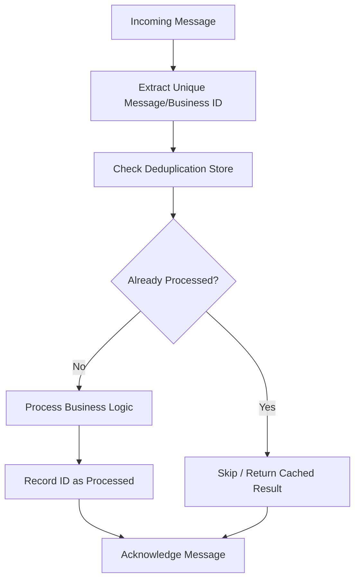

---

# 4. Types of Deduplication

## 4.1 Producer-Side Deduplication
Prevent duplicate publishing in the first place.

## 4.2 Broker-Side Deduplication
Some brokers (e.g., Service Bus) offer built-in duplicate detection within a time window.

## 4.3 Consumer-Side Deduplication (Most Reliable)
Application explicitly tracks processed message/business IDs.

### Decision Flow

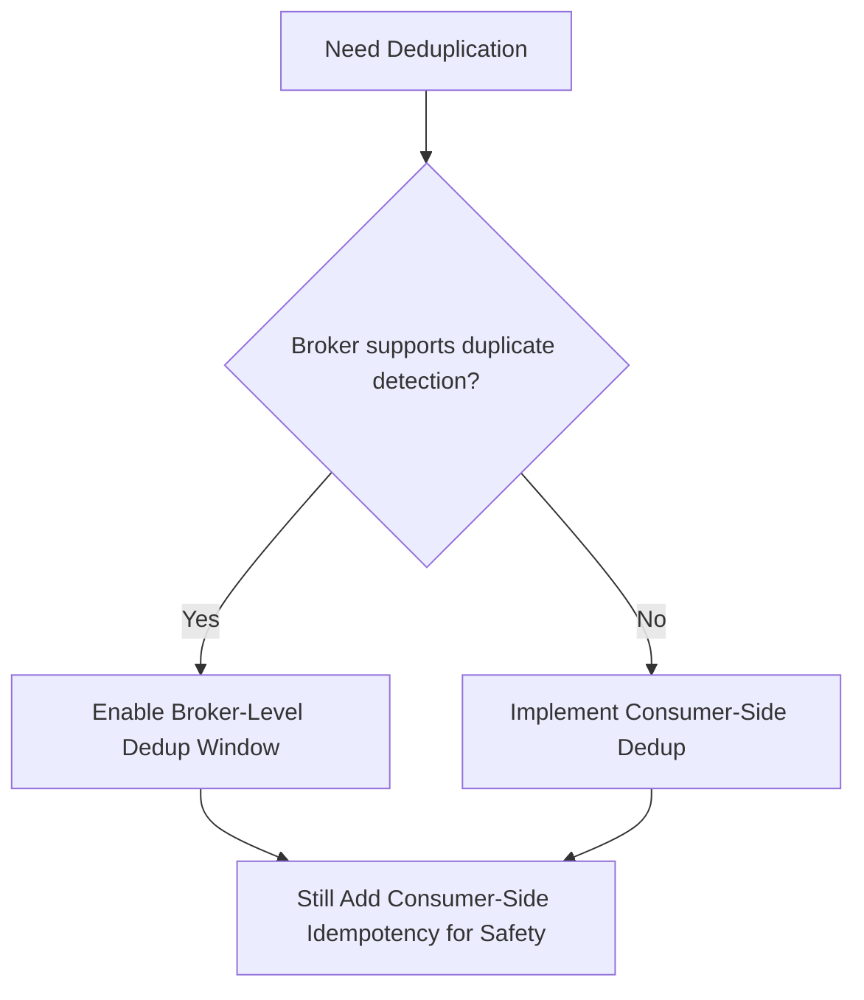

---

# 5. Producer-Side Deduplication

Assign a unique, stable **Message ID** at creation time (not regenerated on retry).

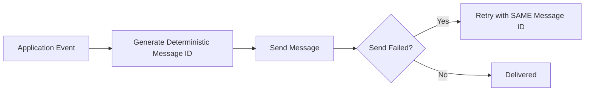

### Key Point

> If retries generate a new random ID each time, deduplication becomes impossible. The ID must remain stable across retries of the same logical event.

---

# 6. Broker-Level Duplicate Detection (e.g., Azure Service Bus)

Some brokers support automatic duplicate detection based on `MessageId` within a defined time window.

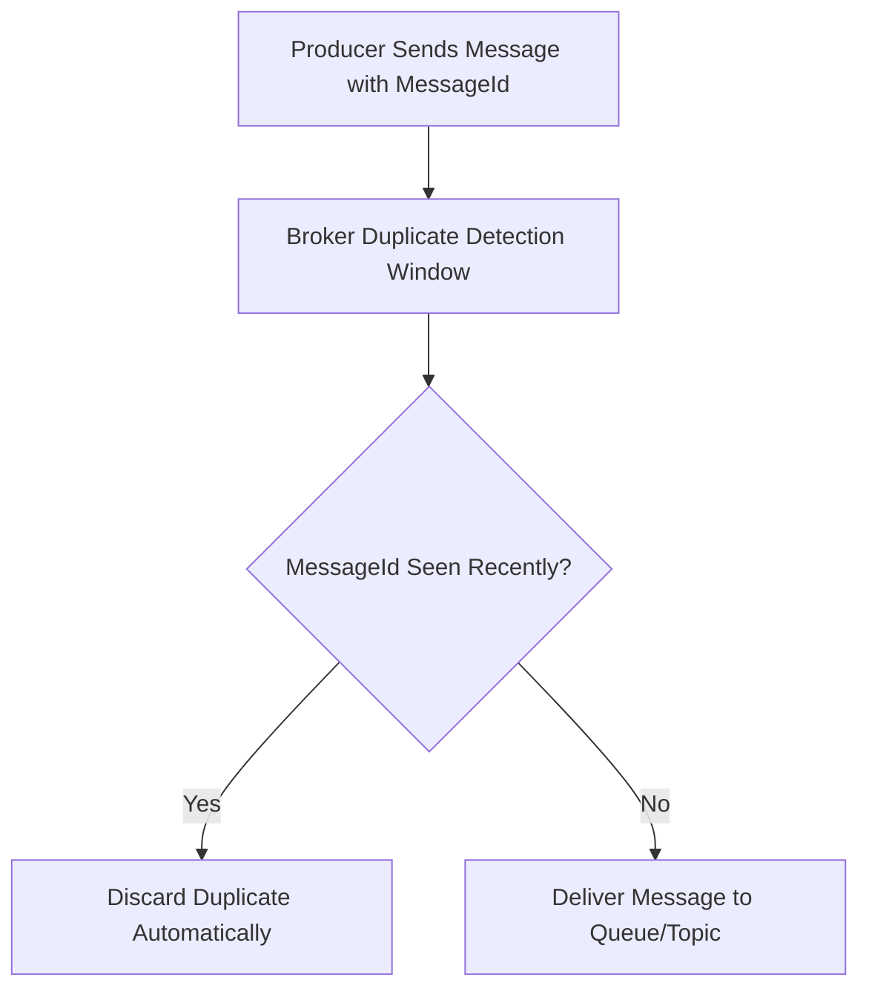

### Interview Note

> Broker-level dedup only helps within a limited time window and only prevents duplicate **delivery**, not duplicate **processing** if the consumer itself retries internally. Application-level idempotency is still required.

---

# 7. Consumer-Side Deduplication (Most Important Pattern)

## 7.1 Using a Processed-Messages Table

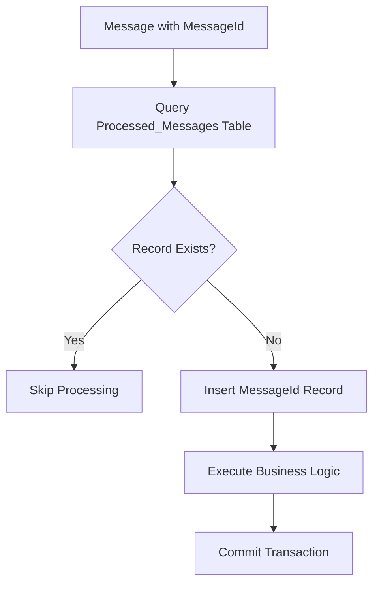

### Example Table Design

```text
ProcessedMessages
------------------
MessageId (Primary Key)
ProcessedAt
Source
Status
```

Use a **unique constraint** on `MessageId` so concurrent duplicate inserts fail safely.

---

## 7.2 Transactional Dedup + Business Update (Atomic Pattern)

Combine dedup check and business write in the same transaction to avoid race conditions.

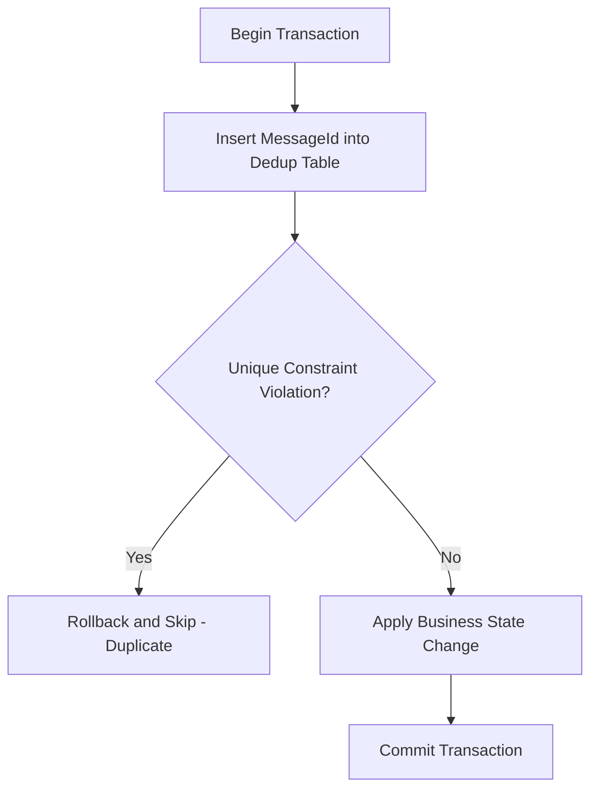

This is a strong pattern for financial/critical operations (e.g., payments, order state changes).

---

# 8. Deduplication Using Business Keys (Not Just Message ID)

Sometimes the **same business event** can arrive with different message IDs (e.g., duplicate publish from a different producer instance).

Use a **business/idempotency key** instead of relying solely on transport-level message ID.

### Example

```text
Message A: MessageId = abc123, OrderId = ORDER-555, Action = "Ship"
Message B: MessageId = xyz789, OrderId = ORDER-555, Action = "Ship"
```

Even though `MessageId` differs, business key `OrderId + Action` should be deduplicated.

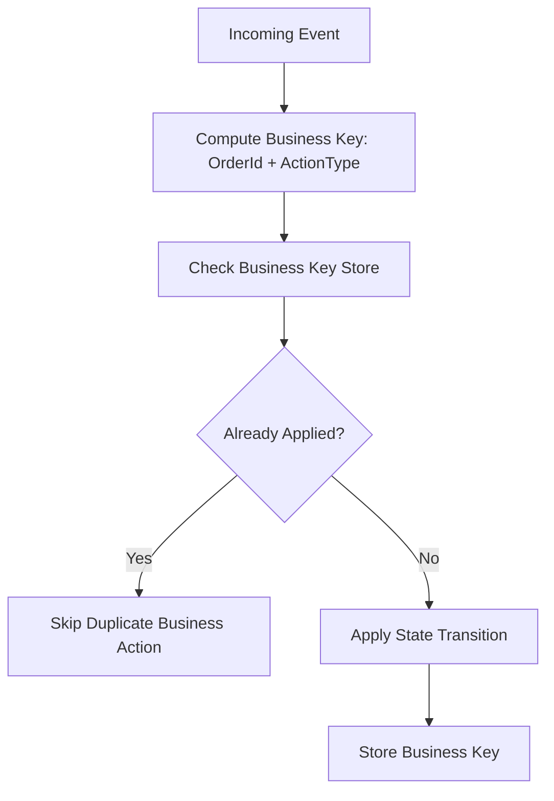

---

# 9. Upsert Pattern (Idempotent by Design)

Instead of tracking IDs, design operations to be naturally idempotent.

### Example: Setting Final State

```text
UPDATE Orders
SET Status = 'Shipped'
WHERE OrderId = 'ORDER-555'
```

Running this twice has the same effect as running it once — this operation is naturally idempotent without needing a dedup table.

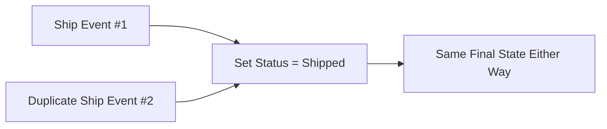

### Interview Tip

> Whenever possible, design state transitions to be naturally idempotent (upsert/set-to-value) instead of relying only on ID tracking.

---

# 10. Deduplication Window Management

Deduplication stores should not grow forever.

Strategies:
- Time-based expiration (e.g., keep 24–72 hours)
- Partition/archive old records
- Use TTL-supported storage (e.g., cache with expiry)
- Separate hot dedup store (fast lookup) from cold audit storage

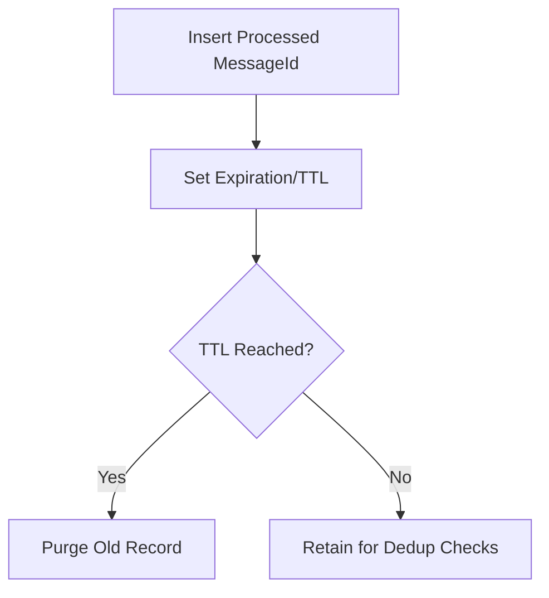

---

# 11. Deduplication in Event-Driven Microservices (Topic/Subscription Context)

Each subscriber must implement its **own** deduplication since each subscription has independent delivery semantics.

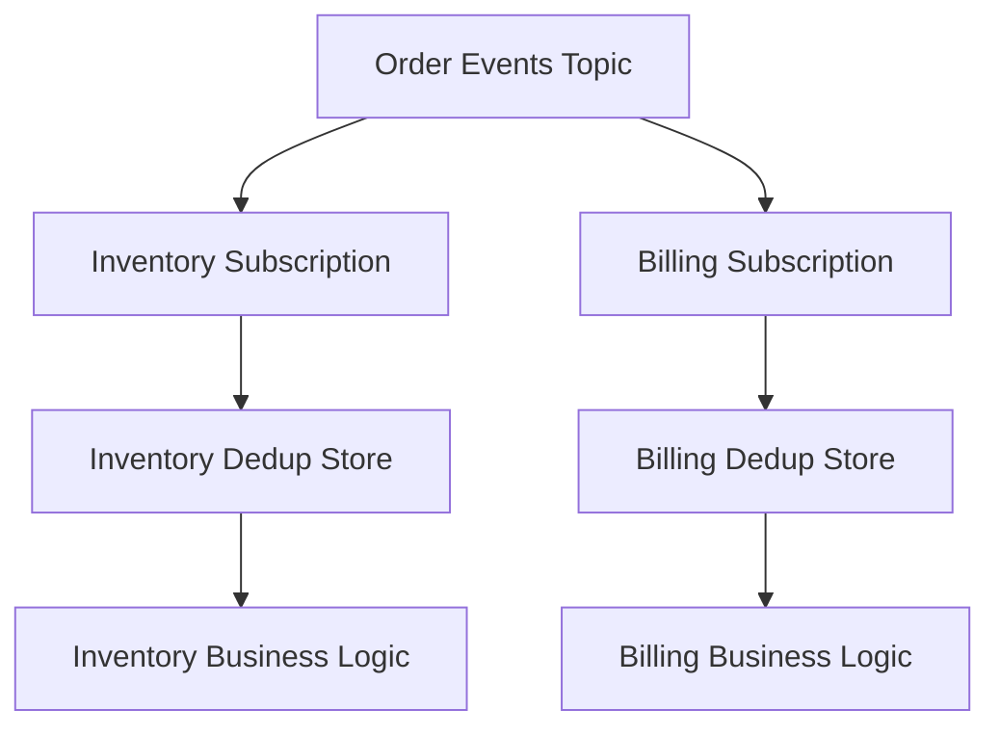

### Interview Point

> Deduplication is a per-consumer responsibility. One subscriber's duplicate handling does not automatically protect another subscriber.

---

# 12. Deduplication for External API Calls (Idempotency Keys)

When calling external systems (e.g., payment gateways), pass an **idempotency key** so the external system itself avoids duplicate effects.

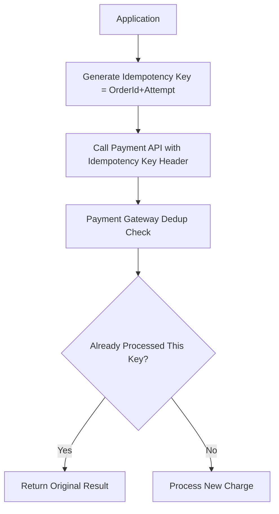

Many external payment/messaging APIs natively support idempotency keys for this exact reason.

---

# 13. Full Reliable + Deduplicated Processing Flow

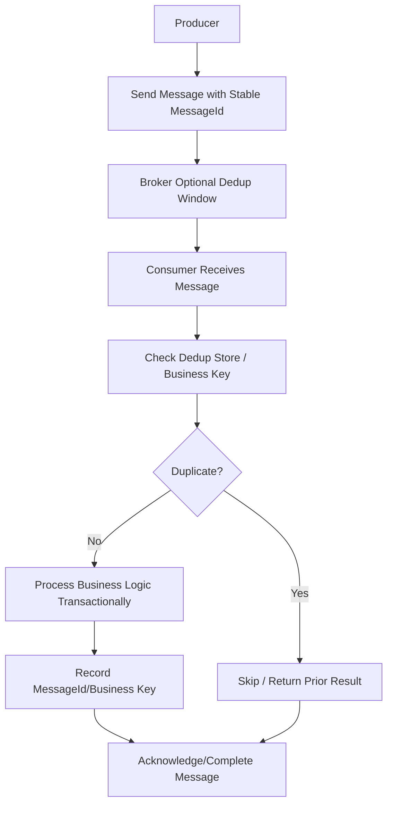

---

# 14. Common Deduplication Storage Options

| Store Type | Use Case |
|---|---|
| Relational DB with unique constraint | Strong consistency, transactional dedup |
| Redis with TTL | Fast, short-window dedup checks |
| Cosmos DB with unique key | Scalable dedup at high throughput |
| In-memory cache (single instance only) | Not reliable across scaled-out instances |
| Broker-native dedup window | First layer of defense, not sufficient alone |

### Interview Warning

> In-memory-only dedup (e.g., local dictionary) fails in scaled-out, multi-instance deployments. Always use a shared/distributed store for dedup state.

---

# 15. Deduplication vs Idempotency (Clarify in Interviews)

| Concept | Meaning |
|---|---|
| Deduplication | Detecting and discarding duplicate messages/events before/at processing |
| Idempotency | Designing operations so repeated execution has the same end effect |

They work together:

```text
Deduplication -> Prevents reprocessing duplicate messages
Idempotency   -> Ensures safe outcome even if reprocessing happens anyway
```

### Strong Interview Answer

> Deduplication and idempotency are complementary. Deduplication tries to avoid reprocessing, while idempotency ensures that even if a duplicate slips through, the result remains correct.

---

# 16. Failure Scenarios and How Dedup Helps

## Scenario A: Consumer Crash After Processing, Before Ack
Message redelivered → dedup store prevents double business effect.

## Scenario B: Producer Retries Due to Network Timeout
Same stable MessageId → broker/consumer dedup avoids duplicate event creation.

## Scenario C: Manual Replay from Dead-Letter Queue
Dedup store still recognizes previously processed MessageId/business key → prevents reapplying already-completed action.

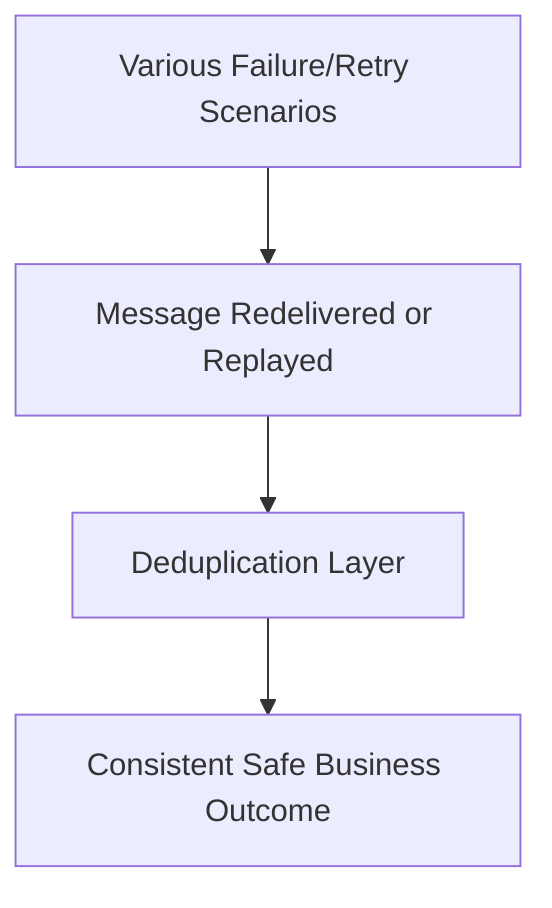

---

# 17. Monitoring Deduplication Effectiveness

Track:
- Duplicate detection count/rate
- Dedup store growth and cleanup health
- False-negative duplicates (missed dedup) if detected via downstream anomalies
- Replay-triggered duplicate attempts
- Business impact incidents caused by duplicates (should trend to zero)

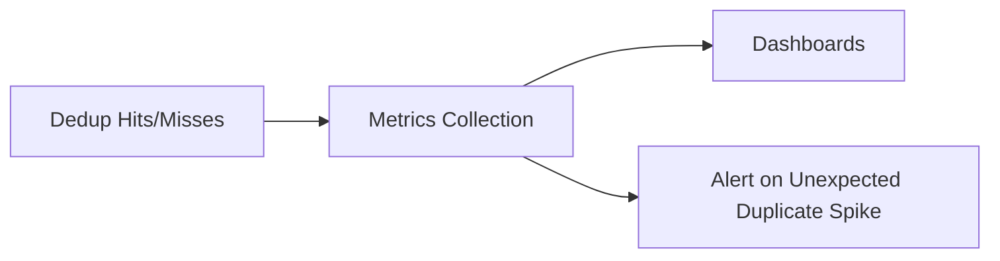

---

# 18. Common Anti-Patterns

1. Generating a new MessageId on every retry (breaks dedup)
2. Using only in-memory dedup in a scaled-out system
3. Relying solely on broker-level dedup window without app-level checks
4. No TTL/cleanup strategy for dedup store (unbounded growth)
5. Dedup check and business update not in same transaction (race condition risk)
6. Assuming exactly-once delivery instead of designing for duplicates
7. Ignoring cross-subscription dedup responsibility in pub-sub systems

---

# 19. Interview Q&A (Strong Answers)

### Q1: How do you implement message deduplication?
**Answer:** Use a stable unique message ID plus a dedup store (DB constraint, Redis with TTL, etc.), and ensure the dedup check plus business update happen atomically.

### Q2: Is broker-level dedup enough?
**Answer:** No. It helps within a time window at the transport level, but application-level idempotency and dedup are still required for full safety.

### Q3: What if two different messages represent the same business action?
**Answer:** Use a business/idempotency key (e.g., OrderId + ActionType) instead of relying only on transport MessageId.

### Q4: How do you avoid dedup store growing forever?
**Answer:** Apply TTL/expiration policies and archive or purge old dedup records.

### Q5: Deduplication vs idempotency — what’s the difference?
**Answer:** Deduplication prevents reprocessing duplicates; idempotency ensures safe results even if a duplicate is processed anyway. Use both together.

### Q6: Does in-memory dedup work in production?
**Answer:** Not reliably in scaled-out systems; use a shared/distributed store instead.

---

# 20. 60-Second Interview Pitch

> I implement message deduplication using a stable, retry-safe message ID combined with a shared dedup store—often a database unique constraint or a distributed cache with TTL. I perform the dedup check and business state update within the same transaction to avoid race conditions, and I use business keys when transport-level IDs might differ for the same logical event. For external systems, I pass idempotency keys to prevent duplicate side effects like double charges. Deduplication works together with idempotent operation design so that even if a duplicate slips through, the final result remains correct.

---

# 21. Final Deduplication Checklist

- [ ] Stable message ID preserved across retries  
- [ ] Dedup store selected (DB/Redis/Cosmos) with correct scale characteristics  
- [ ] Dedup check + business update executed atomically  
- [ ] Business-key-based dedup used where transport ID isn’t reliable  
- [ ] TTL/cleanup strategy defined for dedup store  
- [ ] Idempotent operation design applied where possible  
- [ ] Per-subscription dedup handled independently in pub-sub systems  
- [ ] External API calls use idempotency keys  
- [ ] Dedup metrics and anomaly alerts configured  

---

## Best One-Line Conclusion

> Message deduplication combines a stable message/business ID, a shared dedup store with atomic checks, and idempotent operation design to guarantee that duplicate deliveries never produce duplicate business effects.