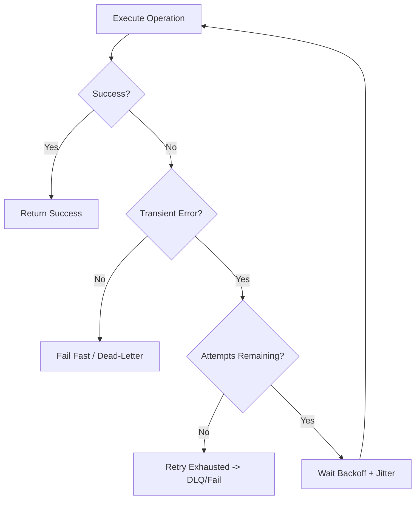
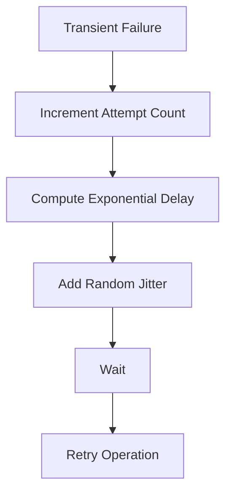
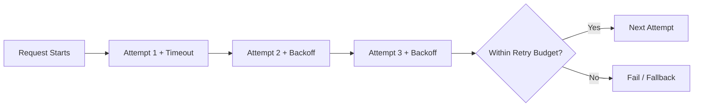
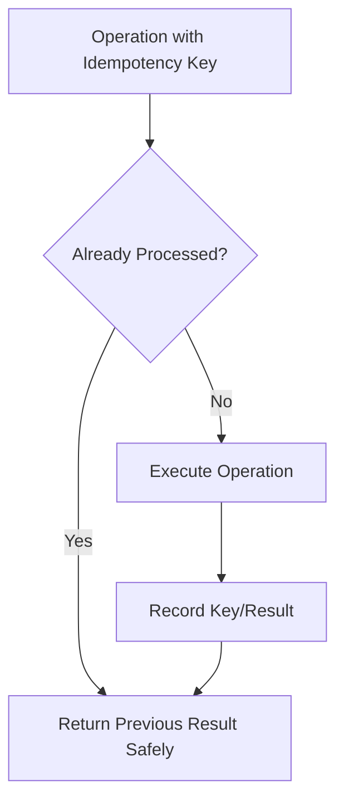
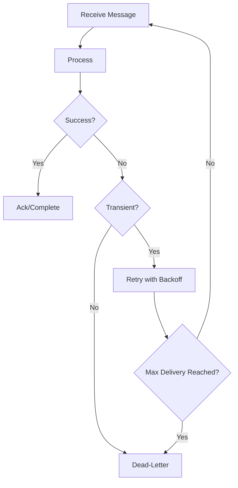
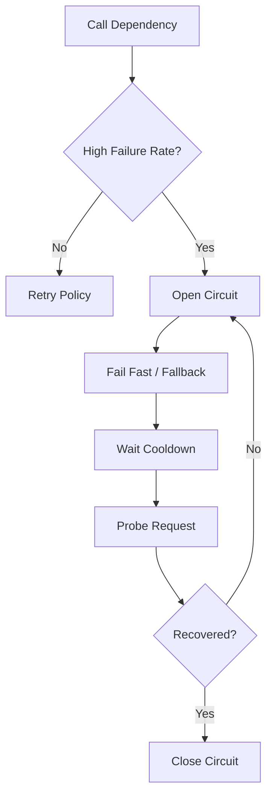
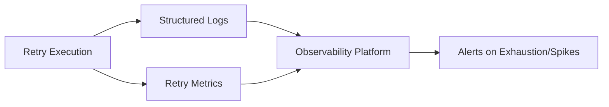
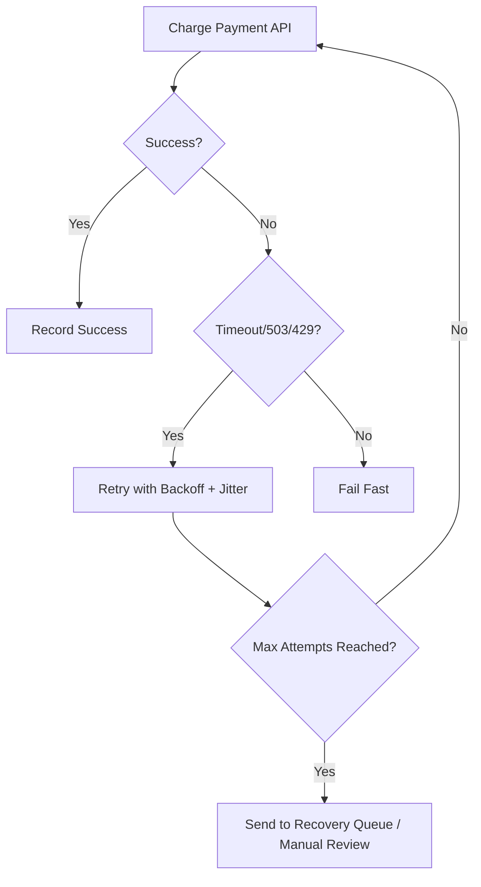

# How Do You Implement Retries?
## Detailed Interview Preparation Guide with Flow Charts

---

## 1. Direct Interview Answer

Implement retries by:

1. Retrying **only transient failures**
2. Using **bounded retry attempts**
3. Applying **exponential backoff with jitter**
4. Keeping operations **idempotent**
5. Sending persistent failures to a **dead-letter path**
6. Adding **timeouts, circuit breakers, and observability**

> **Interview one-liner:**  
> I implement retries with transient-failure detection, exponential backoff + jitter, max-attempt limits, idempotent handlers, and dead-letter handling for non-recoverable errors.

---

## 2. Why Retries Are Needed

Distributed systems fail temporarily due to:

- Network glitches
- Service throttling (429)
- Temporary unavailability (503)
- Short-lived DB connection issues
- Lock/contention bursts
- DNS/transient infrastructure faults

Retries help recover automatically from these temporary issues.

Without retries:
- More user-visible failures
- Lower availability
- Increased manual intervention

---

# 3. Core Retry Flow



---

# 4. Transient vs Permanent Errors

## 4.1 Retry Transient Errors

Examples:
- HTTP 429, 503, 504
- Connection reset
- Timeout from a dependency
- Short-lived lock/conflict
- Temporary broker/network issue

## 4.2 Do Not Retry Permanent Errors

Examples:
- Validation failures
- Schema mismatch
- Authentication failure with invalid credentials
- Unsupported operation
- Business rule violation

### Interview Statement

> I retry only transient failures. Permanent failures should fail fast and go to error handling or dead-letter processing.

---

# 5. Retry Strategy Components

A production retry strategy includes:

1. **Max attempts**  
2. **Delay strategy**  
3. **Backoff algorithm**  
4. **Jitter**  
5. **Error classification**  
6. **Timeout budget**  
7. **Fallback/dead-letter action**  
8. **Observability**

---

# 6. Backoff Algorithms

## 6.1 Fixed Delay

```text
Retry delay: 2s, 2s, 2s...
```

Simple but can create synchronized retry storms.

## 6.2 Exponential Backoff

```text
Retry delay: 1s, 2s, 4s, 8s...
```

Reduces load on recovering service.

## 6.3 Exponential Backoff with Jitter (Recommended)

```text
Retry delay: random around exponential value
Example: 1.2s, 2.7s, 3.9s, 8.5s
```

Prevents synchronized retries from many clients.

---

# 7. Backoff with Jitter Flow



---

# 8. Retry Budget and Timeouts

Retries should respect end-to-end latency/SLA budget.

If each retry waits too long:
- User latency explodes
- Thread/worker resources are exhausted
- Cascading failures increase

Use:
- Overall operation timeout
- Per-attempt timeout
- Maximum cumulative retry duration



---

# 9. Idempotency Is Mandatory for Safe Retries

A retried operation may run more than once.
Without idempotency, retries can cause:
- Double charge
- Duplicate order
- Duplicate email/SMS
- Inconsistent state

Use:
- Idempotency keys
- Message IDs
- Unique constraints
- Upsert semantics
- State transition guards



---

# 10. Retries in Message Processing

For queue/topic consumers:

1. Receive message
2. Process
3. On transient failure -> retry/abandon
4. On repeated failure -> dead-letter



---

# 11. Retry + Circuit Breaker (Important in Interviews)

Retries alone can overload a failing service.  
Use circuit breaker to stop immediate repeated calls when failure rate is high.



---

# 12. Where to Implement Retries

## 12.1 Client/Service Call Layer
For external API/database/service calls.

## 12.2 Messaging Consumer Layer
For transient message processing failures.

## 12.3 Workflow Orchestration Layer
For step-level retries in orchestrated workflows.

Avoid retry duplication across too many layers without coordination (can multiply attempts unexpectedly).

---

# 13. Recommended Retry Defaults (Interview-Friendly)

These are common starting points (tune per system):
- Max attempts: 3 to 5
- Backoff: exponential
- Jitter: enabled
- Retry only transient error codes/exceptions
- Per-attempt timeout: strict
- Dead-letter or fallback after max attempts

Mention:
> Exact values depend on SLA, dependency behavior, and workload characteristics.

---

# 14. Retry Anti-Patterns

1. Infinite retries with no cap  
2. Retrying permanent validation errors  
3. No jitter (retry storm risk)  
4. Long retry chains inside user-facing sync request path  
5. Retrying non-idempotent operations blindly  
6. Not logging retry attempts/correlation IDs  
7. No DLQ/fallback after retries exhausted  
8. Retrying at multiple layers causing exponential amplification  

---

# 15. Retry Observability and Alerting

Track:
- Retry attempt count
- Success-after-retry rate
- Retry exhaustion count
- Error type distribution
- Backoff delay distribution
- Dependency latency/failure rate
- Dead-letter volume



---

# 16. Practical Scenario: External Payment API Timeout

Strategy:
1. Detect timeout as transient
2. Retry with exponential backoff + jitter
3. Use idempotency key to avoid double charge
4. Stop after max attempts
5. Queue for manual/recovery workflow if still failing



---

# 17. Cloud-Native Retry Considerations

In cloud systems:
- Expect transient faults by design
- Respect server throttling headers when provided
- Use async messaging for long retry chains
- Protect downstream systems with rate limits
- Combine retries with bulkheads/circuit breakers

---

# 18. Interview Q&A (Strong Answers)

### Q1: What retry strategy do you use?
**Answer:** Exponential backoff with jitter, bounded attempts, transient-failure filtering, and idempotent operations.

### Q2: Why not retry all failures?
**Answer:** Permanent failures won’t succeed and retries waste resources, increase latency, and can cause cascading failures.

### Q3: Why add jitter?
**Answer:** Jitter prevents many clients from retrying simultaneously and overloading recovering dependencies.

### Q4: What happens after retries are exhausted?
**Answer:** Route to dead-letter/error workflow, alert, and trigger investigation or controlled replay.

### Q5: How do you make retries safe?
**Answer:** Idempotency keys, deduplication, transactional boundaries, and state checks.

### Q6: Retries vs circuit breaker?
**Answer:** Retries handle transient faults; circuit breaker prevents repeated calls to persistently failing dependencies.

---

# 19. 60-Second Interview Pitch

> I implement retries by first classifying errors into transient and permanent. For transient failures, I use bounded retries with exponential backoff and jitter, plus strict timeout budgets. I make operations idempotent so repeated attempts are safe, especially for payments and message consumers. If retries are exhausted, I route failures to dead-letter or recovery workflows and alert operations. I also combine retries with circuit breakers to avoid overloading failing dependencies. Finally, I monitor retry metrics like attempt counts, exhaustion rates, and success-after-retry to continuously tune reliability.

---

# 20. Final Retry Checklist

- [ ] Transient vs permanent error classification implemented  
- [ ] Max retry attempts configured  
- [ ] Exponential backoff enabled  
- [ ] Jitter enabled  
- [ ] Per-attempt + total timeout budget defined  
- [ ] Idempotency strategy in place  
- [ ] Dead-letter/fallback path configured  
- [ ] Circuit breaker integrated for unstable dependencies  
- [ ] Retry metrics, logs, and alerts configured  

---

## Best One-Line Conclusion

> Reliable retry implementation means retrying only transient failures with bounded exponential backoff and jitter, while ensuring idempotency, timeout control, and safe failure handling through dead-letter and observability.