# What Is Peek-Lock in Azure Service Bus?
## Detailed Interview Preparation Guide with Flow Charts

---

## 1. Direct Interview Answer

**Peek-Lock** is an Azure Service Bus receive mode that lets a consumer receive and temporarily lock a message while processing it.

The message is **not deleted immediately**. The consumer must explicitly settle it after processing:

- **Complete** – processing succeeded; remove the message
- **Abandon** – processing failed temporarily; make it available again
- **Dead-letter** – processing cannot succeed; move it to the dead-letter queue
- **Defer** – postpone processing for later retrieval

> **Interview one-liner:**  
> Peek-Lock provides at-least-once message delivery by locking a message during processing and removing it only after the consumer explicitly completes it.

Azure Service Bus uses Peek-Lock when the application needs to process a message before deciding whether it should be removed, retried, deferred, or dead-lettered.  
Reference: Azure Service Bus message transfers, locks, and settlement.

---

# 2. Why Is Peek-Lock Needed?

Suppose a consumer receives a message and the message is immediately deleted. If the consumer crashes while processing it, the message is lost.

Peek-Lock avoids that behavior:

```text
Message received
      |
      v
Message temporarily locked
      |
      v
Consumer processes message
      |
      +-- Success  -> Complete -> Message removed
      |
      +-- Failure  -> Abandon -> Message available again
      |
      +-- Permanent failure -> Dead-letter
      |
      +-- Consumer crashes -> Lock expires -> Message redelivered
```

This provides stronger reliability than deleting the message immediately.

---

# 3. Peek-Lock Execution Flow

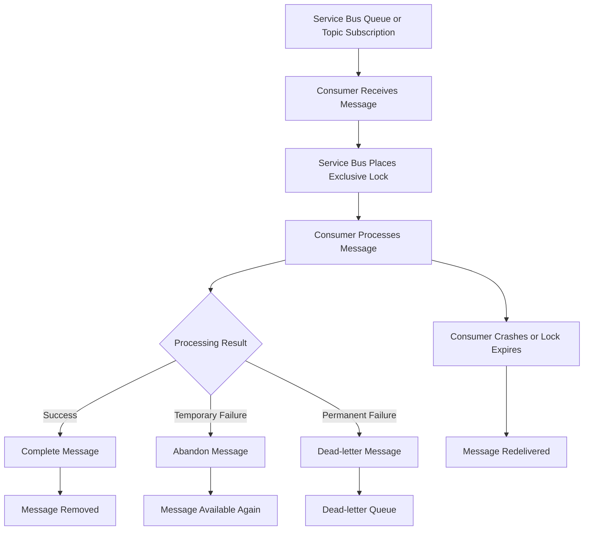
```mermaid
flowchart TD
    Queue[Service Bus Queue or Topic Subscription] --> Receive[Consumer Receives Message]
    Receive --> Lock[Service Bus Places Exclusive Lock]
    Lock --> Process[Consumer Processes Message]

    Process --> Result{Processing Result}

    Result -- Success --> Complete[Complete Message]
    Complete --> Removed[Message Removed]

    Result -- Temporary Failure --> Abandon[Abandon Message]
    Abandon --> Available[Message Available Again]

    Result -- Permanent Failure --> DeadLetter[Dead-letter Message]
    DeadLetter --> DLQ[Dead-letter Queue]

    Process --> Crash[Consumer Crashes or Lock Expires]
    Crash --> Redeliver[Message Redelivered]
```

The lock prevents other competing receivers on the same queue or subscription from receiving that message while the lock is active. When the lock is released or expires, the message can be delivered again.  
Reference: Azure Service Bus message transfers, locks, and settlement.

---

# 4. Peek-Lock vs Receive-and-Delete

Azure Service Bus supports two main receive modes:

1. **Peek-Lock**
2. **Receive-and-Delete**

## 4.1 Peek-Lock

```text
Receive message
      |
      v
Lock message
      |
      v
Process message
      |
      v
Complete after success
```

If processing fails before completion, the message can be redelivered.

## 4.2 Receive-and-Delete

```text
Receive message
      |
      v
Message immediately removed
      |
      v
Process message
```

If the consumer crashes after receiving the message, the message may be lost.

## Comparison Table

| Feature | Peek-Lock | Receive-and-Delete |
|---|---|---|
| Message removed immediately | No | Yes |
| Explicit completion required | Yes | No |
| Supports retry after failure | Yes | No |
| Supports dead-lettering | Yes | No |
| Supports deferral | Yes | No |
| Delivery guarantee | At-least-once | At-most-once |
| Duplicate processing risk | Possible | Lower, but message-loss risk exists |
| Best for | Important business messages | Low-value or loss-tolerant messages |

> **Interview recommendation:**  
> Use Peek-Lock whenever losing a message is unacceptable.

---

# 5. Message Settlement Operations

Message settlement means informing Azure Service Bus what should happen to the received message.

## 5.1 Complete

Use `Complete` when processing finishes successfully.

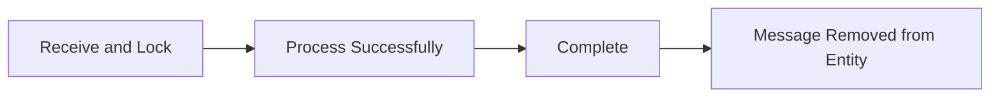
```mermaid
flowchart LR
    Receive[Receive and Lock] --> Process[Process Successfully]
    Process --> Complete[Complete]
    Complete --> Removed[Message Removed from Entity]
```

### Example

```text
Order processed successfully
      |
      v
Complete message
      |
      v
Message is no longer available
```

---

## 5.2 Abandon

Use `Abandon` when processing fails temporarily and the message should be retried.

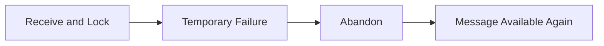
```mermaid
flowchart LR
    Receive[Receive and Lock] --> Process[Temporary Failure]
    Process --> Abandon[Abandon]
    Abandon --> Retry[Message Available Again]
```

Typical reasons:

- Temporary database outage
- HTTP 503 response
- Network timeout
- Temporary throttling
- Short-lived dependency failure

---

## 5.3 Dead-Letter

Use `Dead-letter` when the message cannot be processed successfully.

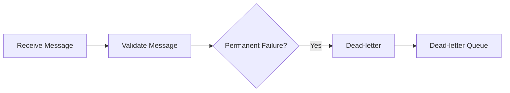
```mermaid
flowchart LR
    Receive[Receive Message] --> Validate[Validate Message]
    Validate --> Invalid{Permanent Failure?}
    Invalid -- Yes --> DeadLetter[Dead-letter]
    DeadLetter --> DLQ[Dead-letter Queue]
```

Typical reasons:

- Invalid schema
- Missing required property
- Unsupported event version
- Permanent business-rule failure
- Malformed payload
- Maximum delivery count reached

---

## 5.4 Defer

Use `Defer` when the consumer intentionally postpones processing.

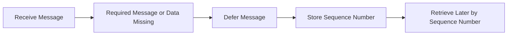
```mermaid
flowchart LR
    Receive[Receive Message] --> Dependency[Required Message or Data Missing]
    Dependency --> Defer[Defer Message]
    Defer --> Sequence[Store Sequence Number]
    Sequence --> Later[Retrieve Later by Sequence Number]
```

A deferred message remains in the queue or subscription but cannot be received through normal receive operations. The application must retain the message sequence number to retrieve it later.

---

# 6. Message Lock

When a message is received in Peek-Lock mode, Azure Service Bus assigns a temporary lock to that message.

During the lock:

```text
Consumer A owns the message lock
Other competing consumers cannot receive that message
Consumer A processes the message
Consumer A settles the message
```

The lock is specific to the queue or topic subscription where the message was received.

## Lock Flow

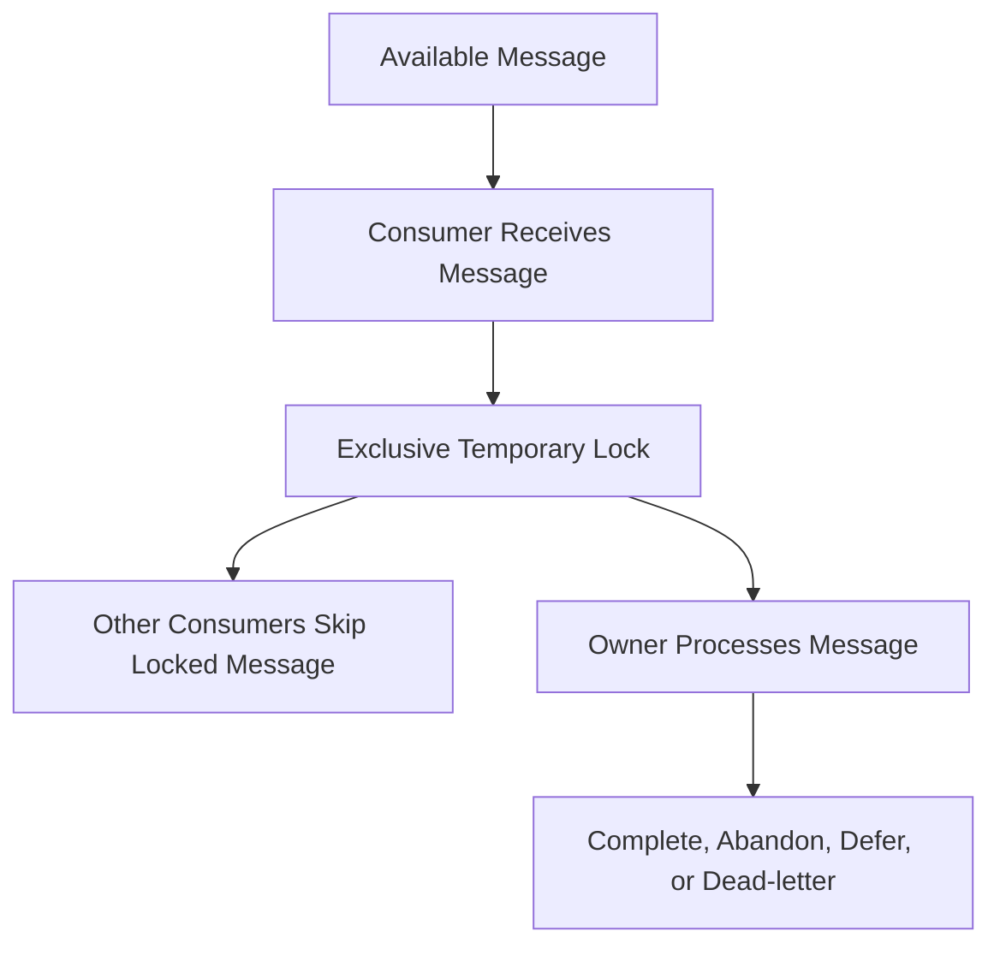
```mermaid
flowchart TD
    Message[Available Message] --> Receiver[Consumer Receives Message]
    Receiver --> Lock[Exclusive Temporary Lock]
    Lock --> Other[Other Consumers Skip Locked Message]
    Lock --> Processing[Owner Processes Message]
    Processing --> Settle[Complete, Abandon, Defer, or Dead-letter]
```

---

# 7. Lock Duration

The lock duration is configured on the Service Bus queue or topic subscription.

Microsoft documentation states that the default lock duration is **one minute**, and the maximum configured lock duration is **five minutes**. For processing that takes longer, the client can renew the lock automatically or explicitly.  
Reference: Azure Service Bus message transfers, locks, and settlement.

## Important Design Rule

Your normal processing time should be shorter than the lock duration whenever possible.

```text
Processing time < Lock duration
```

If processing can exceed the lock duration:

```text
Processing time > Lock duration
```

Use lock renewal or redesign the work as an asynchronous workflow.

---

# 8. Lock Renewal

Lock renewal extends the message lock while the consumer is still processing the message.

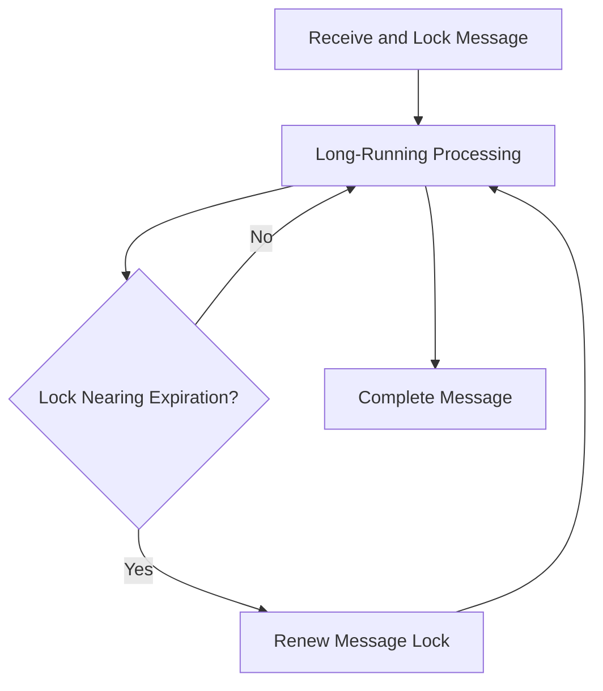
```mermaid
flowchart TD
    Receive[Receive and Lock Message] --> Process[Long-Running Processing]
    Process --> Check{Lock Nearing Expiration?}
    Check -- Yes --> Renew[Renew Message Lock]
    Renew --> Process
    Check -- No --> Process
    Process --> Complete[Complete Message]
```

## When to Use Lock Renewal

Use lock renewal when:

- Processing is legitimately long-running
- External API calls may take time
- Large files are being processed
- Complex workflows cannot finish within the default lock period
- The consumer can reliably maintain its Service Bus connection

## Important Warning

Lock renewal does not guarantee that processing will never be duplicated. The lock can still be lost because of:

- Connection loss
- Service updates
- Process crashes
- Lock renewal failure
- Entity configuration changes
- Host or operating-system updates

Therefore, the consumer must still be idempotent.

---

# 9. What Happens When the Lock Expires?

If the consumer does not settle the message before the lock expires:

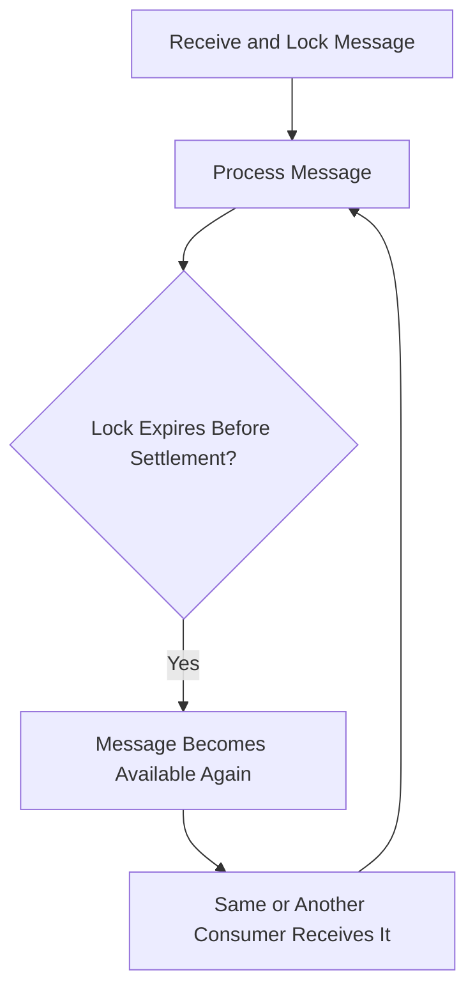
```mermaid
flowchart TD
    Receive[Receive and Lock Message] --> Process[Process Message]
    Process --> LockExpiry{Lock Expires Before Settlement?}
    LockExpiry -- Yes --> Redeliver[Message Becomes Available Again]
    Redeliver --> Another[Same or Another Consumer Receives It]
    Another --> Process
```

The original consumer may receive a lock-lost exception when it tries to complete or settle the message.

### Interview Answer

> If the lock expires before completion, the message is redelivered. This can cause duplicate business processing, so the handler must be idempotent.

---

# 10. Peek-Lock Delivery Guarantee

Peek-Lock generally provides **at-least-once delivery**.

This means:

- A message should not be removed until completion.
- A failed or interrupted delivery can happen again.
- Duplicate deliveries are possible.
- Consumers must safely handle repeated messages.

```text
At-least-once delivery
        |
        +-- Message should not be silently lost
        +-- Duplicate processing is possible
        +-- Idempotency is required
```

### Important Interview Statement

> Peek-Lock reduces message-loss risk, but it does not guarantee exactly-once business processing.

---

# 11. Peek-Lock and Duplicate Processing

Duplicates can happen when:

1. The consumer crashes after completing business logic but before calling `Complete`.
2. The lock expires during processing.
3. The network connection is lost.
4. The completion request fails even though the broker applied the operation.
5. A message is manually replayed from the dead-letter queue.
6. The consumer is restarted before settlement.

## Duplicate-Safe Flow

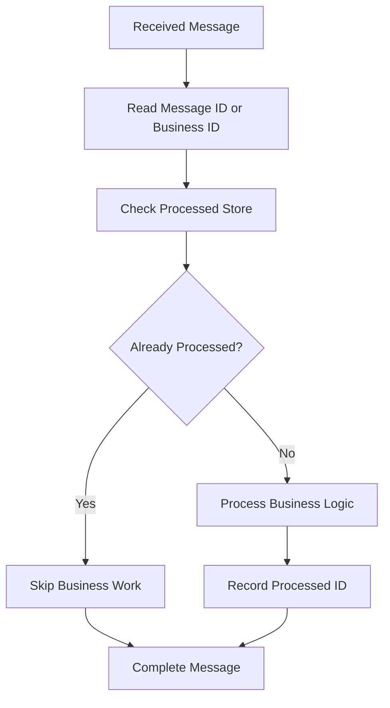
```mermaid
flowchart TD
    Message[Received Message] --> Key[Read Message ID or Business ID]
    Key --> Check[Check Processed Store]
    Check --> Existing{Already Processed?}

    Existing -- Yes --> Skip[Skip Business Work]
    Skip --> Complete[Complete Message]

    Existing -- No --> Process[Process Business Logic]
    Process --> Record[Record Processed ID]
    Record --> Complete
```

---

# 12. Idempotency with Peek-Lock

An idempotent operation produces the same final business result even if executed more than once.

## Example

### Non-idempotent operation

```text
Charge customer $100
Charge customer $100 again
```

This can produce an incorrect double charge.

### Idempotent operation

```text
Set Order-100 status to Paid
Set Order-100 status to Paid again
```

The final state remains `Paid`.

## Recommended Techniques

- Store processed message IDs.
- Use a unique business transaction ID.
- Use database unique constraints.
- Use upsert operations.
- Use optimistic concurrency.
- Pass idempotency keys to external systems.
- Validate current state before applying transitions.

---

# 13. Peek-Lock with Retry and Dead-Lettering

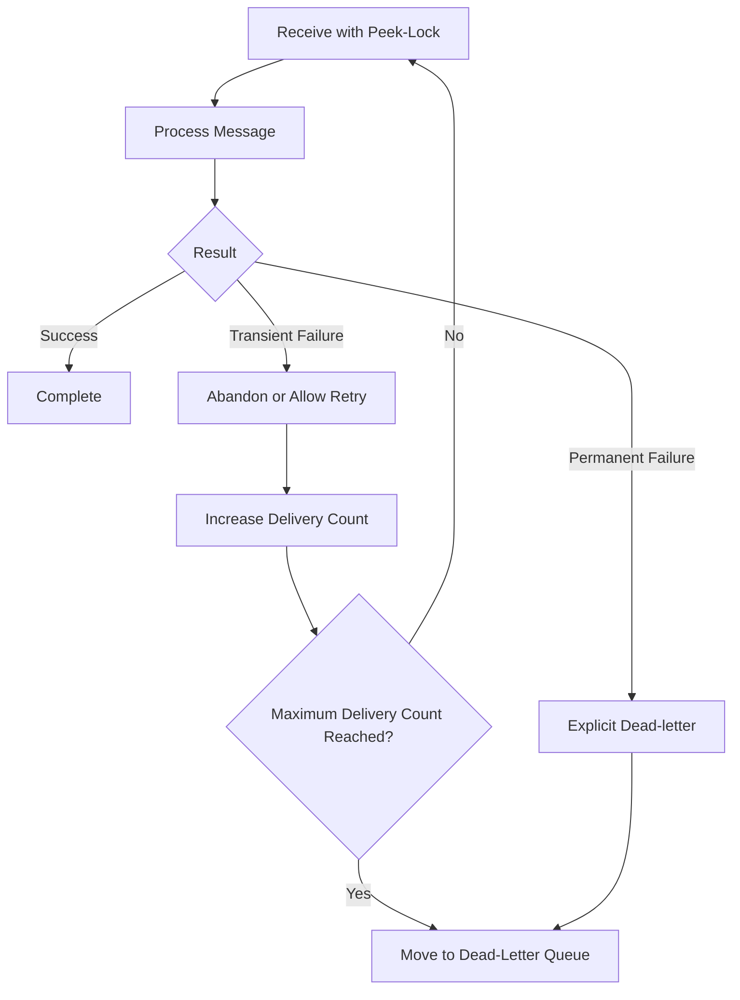
```mermaid
flowchart TD
    Receive[Receive with Peek-Lock] --> Process[Process Message]
    Process --> Result{Result}

    Result -- Success --> Complete[Complete]
    Result -- Transient Failure --> Abandon[Abandon or Allow Retry]
    Abandon --> Count[Increase Delivery Count]
    Count --> Limit{Maximum Delivery Count Reached?}

    Limit -- No --> Receive
    Limit -- Yes --> DLQ[Move to Dead-Letter Queue]

    Result -- Permanent Failure --> DeadLetter[Explicit Dead-letter]
    DeadLetter --> DLQ
```

---

# 14. Maximum Delivery Count

The maximum delivery count defines how many times a message can be delivered before it is automatically moved to the dead-letter queue.

### Example

```text
Maximum delivery count = 5

Delivery 1 -> failure
Delivery 2 -> failure
Delivery 3 -> failure
Delivery 4 -> failure
Delivery 5 -> failure
                  |
                  v
              Dead-letter
```

Use this to prevent poison messages from retrying forever.

### Interview Answer

> I configure a reasonable maximum delivery count, retry transient failures, and dead-letter messages that continue failing after the limit.

---

# 15. Peek-Lock with Azure Functions

A Service Bus-triggered Azure Function commonly uses Peek-Lock semantics.

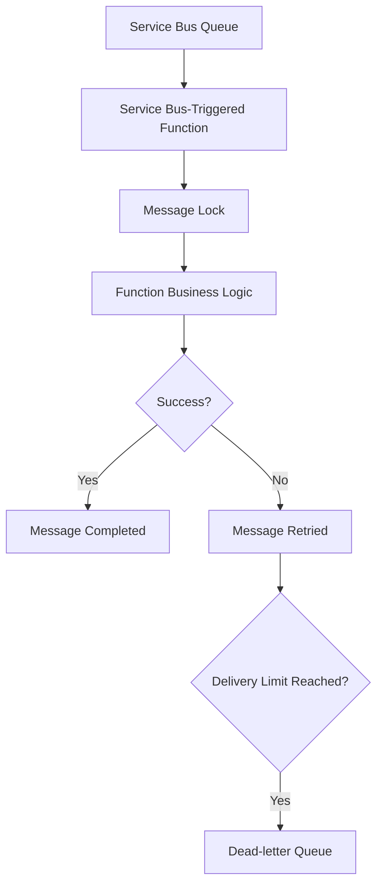
```mermaid
flowchart TD
    Queue[Service Bus Queue] --> Function[Service Bus-Triggered Function]
    Function --> Lock[Message Lock]
    Lock --> Logic[Function Business Logic]

    Logic --> Success{Success?}
    Success -- Yes --> Complete[Message Completed]
    Success -- No --> Retry[Message Retried]
    Retry --> Count{Delivery Limit Reached?}
    Count -- Yes --> DLQ[Dead-letter Queue]
```

## Recommended Function Design

- Keep the handler idempotent.
- Complete only after successful processing.
- Classify transient and permanent errors.
- Use managed identity to access Service Bus.
- Monitor retries and dead-letter messages.
- Keep processing time within the lock duration.
- Use lock renewal for legitimate long-running work.

---

# 16. Peek-Lock with Service Bus Topics

Peek-Lock also applies to messages received from topic subscriptions.

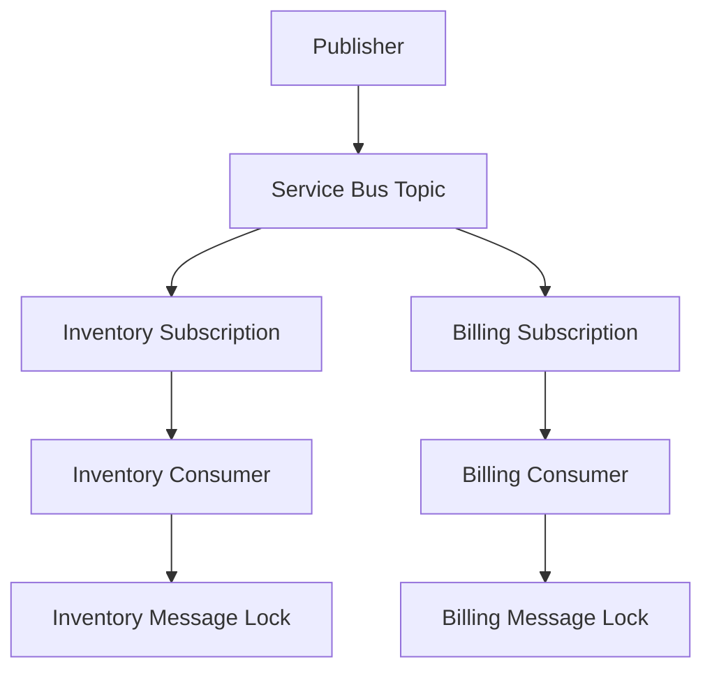
```mermaid
flowchart TD
    Publisher[Publisher] --> Topic[Service Bus Topic]
    Topic --> Inventory[Inventory Subscription]
    Topic --> Billing[Billing Subscription]

    Inventory --> InventoryConsumer[Inventory Consumer]
    Billing --> BillingConsumer[Billing Consumer]

    InventoryConsumer --> InventoryLock[Inventory Message Lock]
    BillingConsumer --> BillingLock[Billing Message Lock]
```

Each subscription has an independent message lifecycle.

For example:

```text
Inventory subscription:
    Complete successfully

Billing subscription:
    Retry and eventually dead-letter
```

The failure of one subscription does not automatically fail the other subscription.

---

# 17. Peek-Lock vs Peek Operation

These terms are often confused.

## Peek-Lock

- Receives a message for processing.
- Locks the message.
- Requires explicit settlement.
- Used for reliable message consumption.

## Peek

- Browses messages without taking ownership.
- Does not lock the message.
- Used for inspection and diagnostics.
- Does not settle or consume the message.

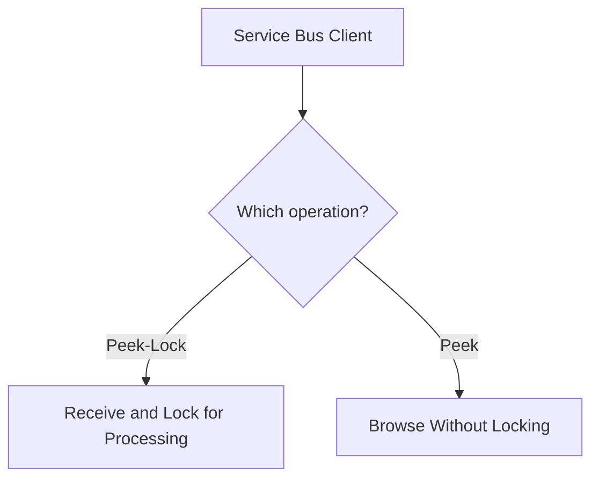
```mermaid
flowchart TD
    Client[Service Bus Client] --> Choice{Which operation?}
    Choice -- Peek-Lock --> Receive[Receive and Lock for Processing]
    Choice -- Peek --> Browse[Browse Without Locking]
```

### Interview Answer

> Peek-Lock is a receive mode for reliable processing. Peek is a non-destructive browsing operation used for diagnostics.

---

# 18. Peek-Lock vs Receive-and-Delete

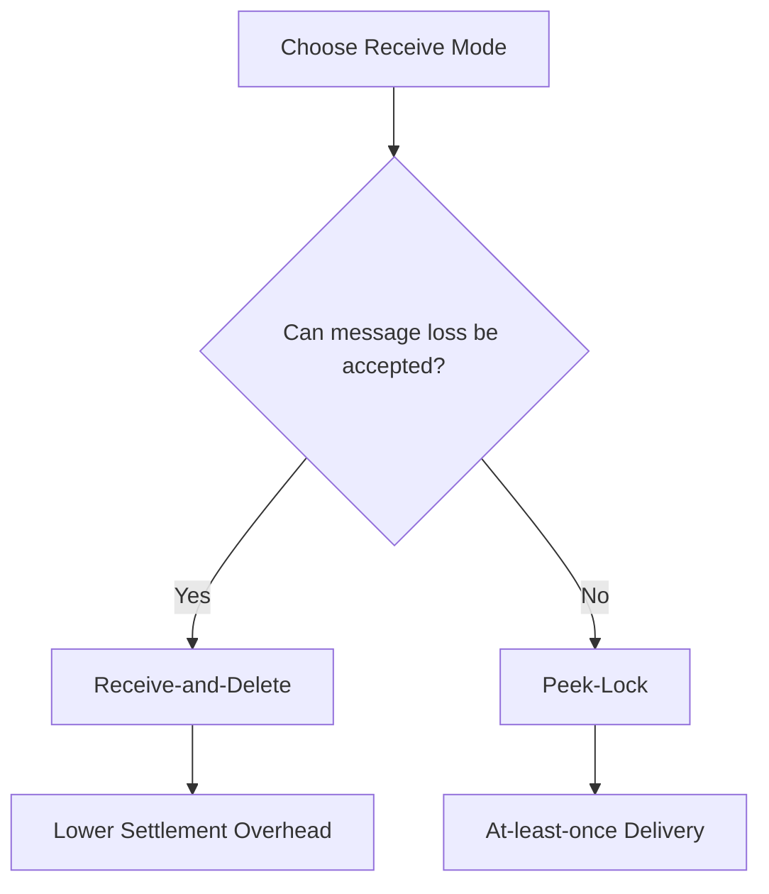
```mermaid
flowchart TD
    Start[Choose Receive Mode] --> A{Can message loss be accepted?}
    A -- Yes --> RAD[Receive-and-Delete]
    A -- No --> PL[Peek-Lock]

    PL --> Reliability[At-least-once Delivery]
    RAD --> Speed[Lower Settlement Overhead]
```

## Choose Peek-Lock When

- Messages represent business transactions.
- Processing can fail.
- You need retries.
- You need dead-lettering.
- You need deferred processing.
- Message loss is unacceptable.

## Choose Receive-and-Delete When

- Occasional message loss is acceptable.
- Messages have low business value.
- Data is temporary or reproducible.
- Maximum receive throughput is more important than recovery.

---

# 19. Prefetch and Peek-Lock

Prefetch can improve throughput by loading multiple messages into a local client cache.

However, prefetched messages may already be locked. If the consumer cannot process them before their locks expire, completion may fail and messages may be redelivered.

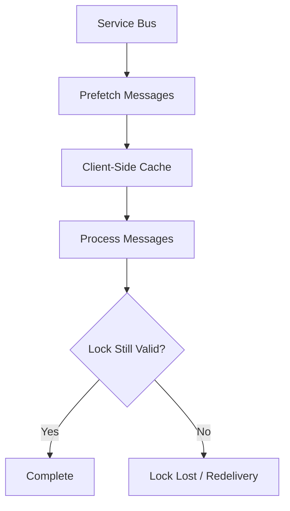
```mermaid
flowchart TD
    Broker[Service Bus] --> Prefetch[Prefetch Messages]
    Prefetch --> Cache[Client-Side Cache]
    Cache --> Process[Process Messages]
    Process --> LockCheck{Lock Still Valid?}
    LockCheck -- Yes --> Complete[Complete]
    LockCheck -- No --> LockLost[Lock Lost / Redelivery]
```

## Prefetch Best Practice

Set prefetch conservatively:

```text
Prefetch size should match the number of messages
the consumer can process within the lock duration.
```

Avoid prefetching far more messages than the consumer can finish in time.

---

# 20. Long-Running Work with Peek-Lock

If processing is longer than the lock duration, consider:

## Option 1: Renew the Message Lock

Use when the work can remain inside one message-processing operation.

## Option 2: Split the Work

Break a large task into smaller queue messages.

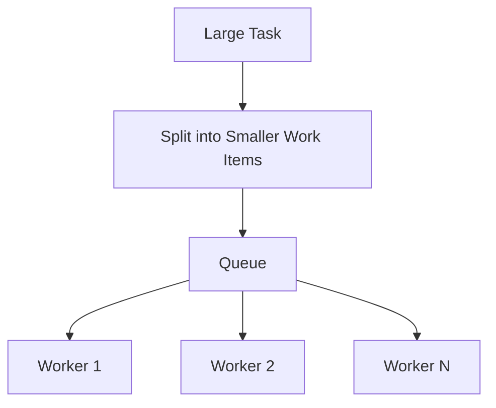
```mermaid
flowchart TD
    LargeTask[Large Task] --> Split[Split into Smaller Work Items]
    Split --> Queue[Queue]
    Queue --> Worker1[Worker 1]
    Queue --> Worker2[Worker 2]
    Queue --> WorkerN[Worker N]
```

## Option 3: Use Durable Functions

Use when the process has multiple steps, state, waits, or compensation.

## Option 4: Start an Asynchronous Workflow

Complete the original message after safely creating a durable workflow record, then process the workflow separately.

---

# 21. Transactional Processing with Peek-Lock

For critical workflows, coordinate message completion with business data updates.

A common challenge:

```text
Database update succeeds
Message completion fails
Message is redelivered
```

Use:

- Idempotent database updates
- Unique constraints
- Transactional outbox/inbox patterns
- Message IDs
- Business transaction IDs

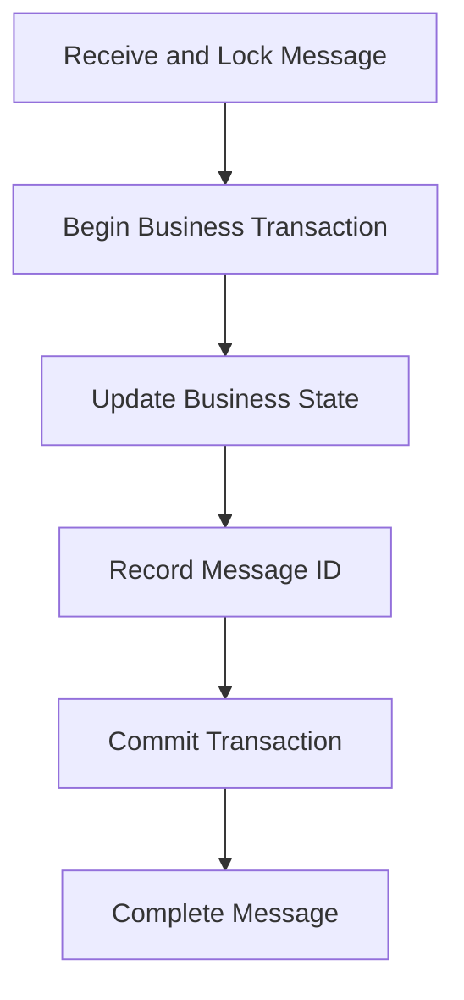
```mermaid
flowchart TD
    Receive[Receive and Lock Message] --> Transaction[Begin Business Transaction]
    Transaction --> Update[Update Business State]
    Update --> Dedup[Record Message ID]
    Dedup --> Commit[Commit Transaction]
    Commit --> Complete[Complete Message]
```

If `Complete` fails after the database transaction commits, the message may be redelivered, but the deduplication check prevents duplicate business effects.

---

# 22. Error Classification

## Retryable Errors

Usually retry:

- Temporary network timeout
- HTTP 429 throttling
- HTTP 503 service unavailable
- Database connection timeout
- Temporary lock conflict
- Short-lived dependency outage

## Non-Retryable Errors

Usually dead-letter:

- Invalid payload
- Schema mismatch
- Missing required property
- Unsupported message version
- Invalid authorization
- Permanent business-rule failure
- Malformed JSON

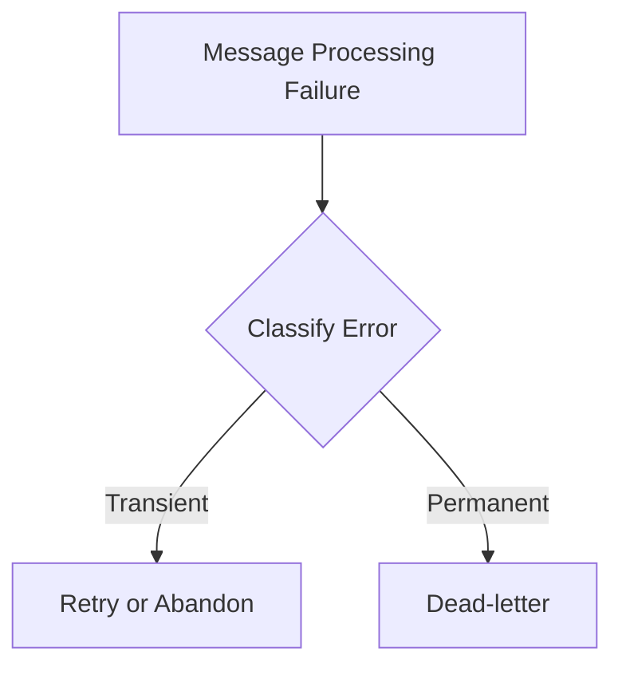
```mermaid
flowchart TD
    Failure[Message Processing Failure] --> Classify{Classify Error}
    Classify -- Transient --> Retry[Retry or Abandon]
    Classify -- Permanent --> DLQ[Dead-letter]
```

---

# 23. Monitoring Peek-Lock Processing

Monitor:

- Active message count
- Delivery count
- Lock-lost exceptions
- Message processing duration
- Retry rate
- Dead-letter count
- Oldest message age
- Consumer throughput
- Completion failures
- Abandoned messages

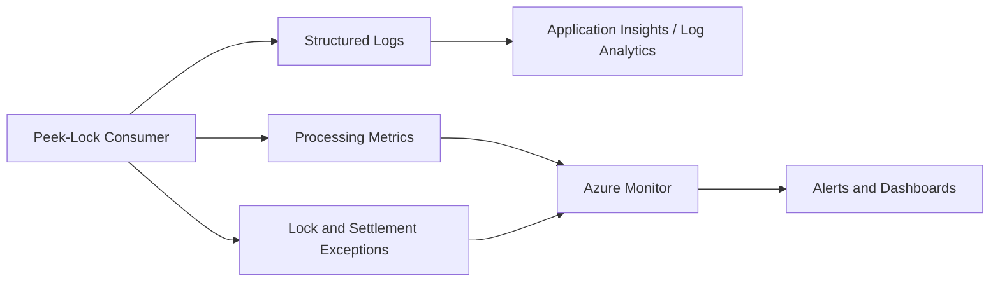
```mermaid
flowchart LR
    Consumer[Peek-Lock Consumer] --> Logs[Structured Logs]
    Consumer --> Metrics[Processing Metrics]
    Consumer --> Exceptions[Lock and Settlement Exceptions]

    Logs --> Insights[Application Insights / Log Analytics]
    Metrics --> Monitor[Azure Monitor]
    Exceptions --> Monitor
    Monitor --> Alerts[Alerts and Dashboards]
```

## Important Alerts

- Lock-lost exception spike
- Delivery count increase
- Dead-letter queue growth
- Message age above SLA
- Consumer processing time approaching lock duration
- Completion failure rate increase

---

# 24. Security Considerations

Secure Peek-Lock consumers using:

- Microsoft Entra ID
- Managed Identity
- Azure RBAC
- Least-privilege roles
- Private endpoints
- Network restrictions
- TLS encryption
- Secret-free configuration
- Audit logging

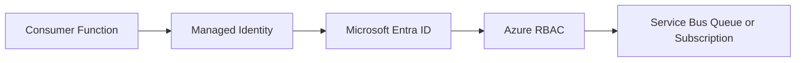
```mermaid
flowchart LR
    Function[Consumer Function] --> Identity[Managed Identity]
    Identity --> Entra[Microsoft Entra ID]
    Entra --> RBAC[Azure RBAC]
    RBAC --> ServiceBus[Service Bus Queue or Subscription]
```

Recommended principle:

> The consumer should have only the permissions required to receive and settle messages from the specific queue or subscription.

---

# 25. Common Peek-Lock Mistakes

## Mistake 1: Completing Before Business Success

```text
Receive
  -> Complete
  -> Process
```

If processing fails, the message is already gone.

### Better

```text
Receive
  -> Process
  -> Complete after success
```

---

## Mistake 2: Ignoring Lock Duration

If processing takes longer than the lock duration, the message may be redelivered.

### Better

- Measure processing duration.
- Increase lock duration where appropriate.
- Renew the lock.
- Reduce work per message.
- Use an asynchronous workflow.

---

## Mistake 3: Assuming Exactly-Once Processing

Peek-Lock provides at-least-once delivery, not guaranteed exactly-once business effects.

### Better

Use idempotency and deduplication.

---

## Mistake 4: Infinite Retries

A poison message can consume resources indefinitely.

### Better

Configure maximum delivery count and dead-letter handling.

---

## Mistake 5: Oversized Prefetch

Prefetched messages can have locks that expire before processing.

### Better

Tune prefetch against processing rate and lock duration.

---

## Mistake 6: Closing the Receiver Before Settlement

If the receiver or connection closes before settlement reaches Service Bus, the message lock can expire and the message may be redelivered.

### Better

Keep the receiver connection alive until the message is settled.

---

# 26. Scenario-Based Interview Answers

## Scenario 1: Order Processing

### Requirement

An order message must not be lost if the worker crashes.

### Answer

> I would use Peek-Lock. The worker receives and locks the message, processes the order, commits the business update, and completes the message only after success. If the worker crashes before completion, the lock expires and the message is redelivered. I would use an idempotency key to prevent duplicate order effects.

---

## Scenario 2: Slow External API

### Requirement

A consumer calls an external provider that sometimes takes several minutes.

### Answer

> I would measure the processing duration and compare it with the message lock duration. If the work is legitimately long-running, I would enable lock renewal or redesign the process using an asynchronous workflow. I would not simply increase prefetch because locked messages could expire before processing.

---

## Scenario 3: Invalid Message

### Requirement

A message has an invalid schema and cannot be processed.

### Answer

> I would validate the message and explicitly dead-letter it with a meaningful reason and description. Retrying a permanent schema error wastes resources and delays healthy messages.

---

## Scenario 4: Database Temporarily Unavailable

### Requirement

The database is unavailable for a short period.

### Answer

> I would treat this as a transient error, retry with bounded exponential backoff, and allow the message to be redelivered if necessary. After the maximum delivery count is reached, the message goes to the DLQ. The consumer must be idempotent.

---

# 27. Common Interview Questions and Strong Answers

## Q1. What is Peek-Lock?

**Answer:**

Peek-Lock is an Azure Service Bus receive mode in which a message is temporarily locked for one consumer and removed only after explicit completion.

---

## Q2. What happens if the consumer crashes?

**Answer:**

If the message was not completed, the lock eventually expires and the message becomes available for redelivery.

---

## Q3. What is the difference between Complete and Abandon?

**Answer:**

`Complete` permanently removes the message after successful processing. `Abandon` releases it so it can be delivered again.

---

## Q4. What happens when the lock expires?

**Answer:**

The message becomes available again and may be delivered to the same or another consumer. The original consumer may receive a lock-lost exception when attempting settlement.

---

## Q5. How do you process a message that takes longer than the lock duration?

**Answer:**

Use lock renewal, reduce the work per message, split the work into smaller messages, or use Durable Functions/asynchronous orchestration.

---

## Q6. Does Peek-Lock guarantee exactly-once processing?

**Answer:**

No. It provides at-least-once delivery. Duplicate delivery is possible, so the consumer must be idempotent.

---

## Q7. When should you use Receive-and-Delete instead?

**Answer:**

Only when occasional message loss is acceptable and the message has low value or can be regenerated.

---

## Q8. What is the role of maximum delivery count?

**Answer:**

It limits repeated delivery attempts. Once the limit is reached, Service Bus moves the message to the dead-letter queue.

---

## Q9. What is the difference between Peek and Peek-Lock?

**Answer:**

Peek browses messages without locking or consuming them. Peek-Lock receives a message for processing and places a temporary lock on it.

---

## Q10. How do you prevent duplicate processing?

**Answer:**

Use idempotent business operations, message IDs, business keys, database uniqueness constraints, deduplication stores, and safe replay logic.

---

# 28. 60-Second Interview Pitch

> Peek-Lock is Azure Service Bus’s reliable receive mode. The consumer receives a message and gets an exclusive temporary lock, but the message is not deleted immediately. After successful processing, the consumer calls Complete. For temporary failures, it abandons the message or lets the lock expire so it can be retried. Permanent failures are dead-lettered. Because the message can be redelivered if the consumer crashes, the lock expires, or settlement fails, I design consumers to be idempotent. I also tune lock duration and prefetch, renew locks for legitimate long-running work, configure maximum delivery count, and monitor retries, lock-lost errors, and DLQ growth.

---

# 29. Final Interview Checklist

- [ ] Explain Peek-Lock clearly.
- [ ] Mention at-least-once delivery.
- [ ] Explain Complete, Abandon, Defer, and Dead-letter.
- [ ] Explain lock duration.
- [ ] Explain lock renewal.
- [ ] Explain lock expiration and redelivery.
- [ ] Mention idempotent consumers.
- [ ] Mention maximum delivery count.
- [ ] Mention dead-letter queues.
- [ ] Compare Peek-Lock with Receive-and-Delete.
- [ ] Explain prefetch risks.
- [ ] Mention monitoring and lock-lost alerts.
- [ ] Mention Managed Identity and RBAC.

---

## Best One-Line Conclusion

> Peek-Lock temporarily reserves a Service Bus message for a consumer and removes it only after successful completion, providing reliable at-least-once delivery with retry, dead-letter, and idempotent-processing support.