# What Is a Dead-Letter Queue?
## Detailed Interview Preparation Guide with Flow Charts

---

## 1. Direct Interview Answer

A **Dead-Letter Queue**, commonly called a **DLQ**, is a special queue used to isolate messages that cannot be successfully delivered or processed.

Instead of retrying a bad message forever and blocking healthy messages, the system moves the problematic message to a separate location for:

- Investigation
- Logging
- Manual correction
- Automated repair
- Controlled replay
- Auditing
- Operational alerting

> **Interview one-liner:**  
> A dead-letter queue isolates poison or unprocessable messages after retries or delivery failures so that normal message processing can continue without losing the failed message.

---

## 2. Why Do We Need a Dead-Letter Queue?

Without a DLQ, a message that always fails could be retried continuously:

```text
Receive message
      |
      v
Processing fails
      |
      v
Retry
      |
      v
Processing fails again
      |
      v
Retry forever
```

This can cause:

- Queue blockage
- Excessive compute usage
- Retry storms
- Duplicate side effects
- Increased latency
- Unclear operational status
- Failure of unrelated healthy messages

With a DLQ:

```text
Message fails repeatedly
      |
      v
Move to Dead-Letter Queue
      |
      v
Continue processing healthy messages
```

---

# 3. Basic Dead-Letter Queue Flow

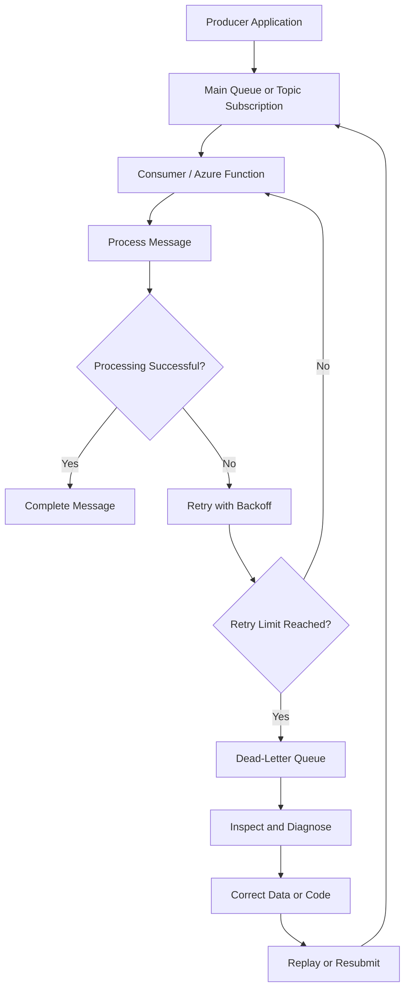

---

# 4. What Is a Poison Message?

A **poison message** is a message that repeatedly fails processing.

Examples:

- Invalid JSON format
- Missing required fields
- Unsupported event version
- Invalid business data
- Expired message
- Incorrect schema
- Downstream dependency failure
- Authorization failure
- Database constraint violation
- Unsupported file format
- Code bug triggered by a specific payload

### Example

```json
{
  "orderId": null,
  "amount": "invalid"
}
```

If the consumer expects a valid `orderId` and numeric `amount`, this message may fail every time unless it is corrected or discarded.

---

# 5. Dead-Letter Queue vs Main Queue

| Main Queue | Dead-Letter Queue |
|---|---|
| Holds messages waiting for normal processing | Holds messages that could not be processed |
| Consumers process messages normally | Operators or recovery processes inspect messages |
| Healthy message flow | Exceptional message flow |
| Expected operational path | Failure-management path |
| Messages are normally completed after success | Messages remain until explicitly handled |

---

# 6. Azure Service Bus Dead-Letter Queue

Azure Service Bus provides a built-in dead-letter subqueue for every:

- Service Bus queue
- Topic subscription

The DLQ is created automatically as a secondary subqueue. It does not need to be created separately and cannot be managed independently from the parent queue or subscription. ([learn.microsoft.com](https://learn.microsoft.com/en-us/azure/service-bus-messaging/service-bus-messaging-overview?utm_source=openai))

## Service Bus Queue DLQ

```text
<queue-name>/$deadletterqueue
```

## Service Bus Topic Subscription DLQ

```text
<topic-name>/Subscriptions/<subscription-name>/$deadletterqueue
```

Each topic subscription has its own dead-letter queue.

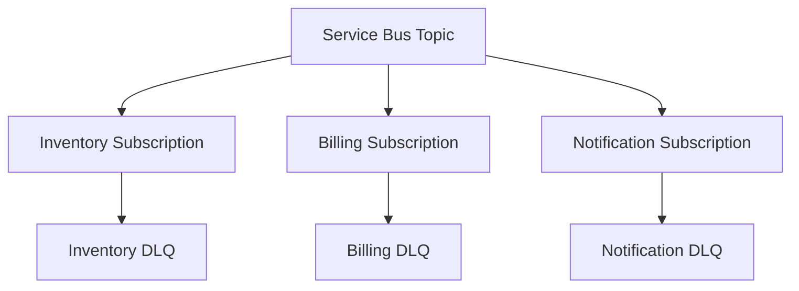

### Important Point

A message can succeed in one subscription and fail in another.

For example:

```text
OrderCreated event
    |
    +-- Inventory subscription: processed successfully
    +-- Billing subscription: moved to DLQ
    +-- Notification subscription: processed successfully
```

---

# 7. Azure Service Bus Dead-Letter Reasons

A Service Bus message can be moved to the DLQ for reasons such as:

1. Maximum delivery count exceeded
2. Time-to-live expired
3. Explicit application dead-lettering
4. Subscription filter evaluation failure
5. Message could not be delivered
6. Forwarding or transfer failure
7. Invalid message processing condition

Dead-lettered messages include metadata such as:

- `DeadLetterReason`
- `DeadLetterErrorDescription`

These properties help operators understand why the message was moved to the DLQ. ([learn.microsoft.com](https://learn.microsoft.com/en-us/azure/service-bus-messaging/jms-developer-guide?utm_source=openai))

---

# 8. Maximum Delivery Count

The **maximum delivery count** controls how many times a message may be delivered before Service Bus moves it to the DLQ.

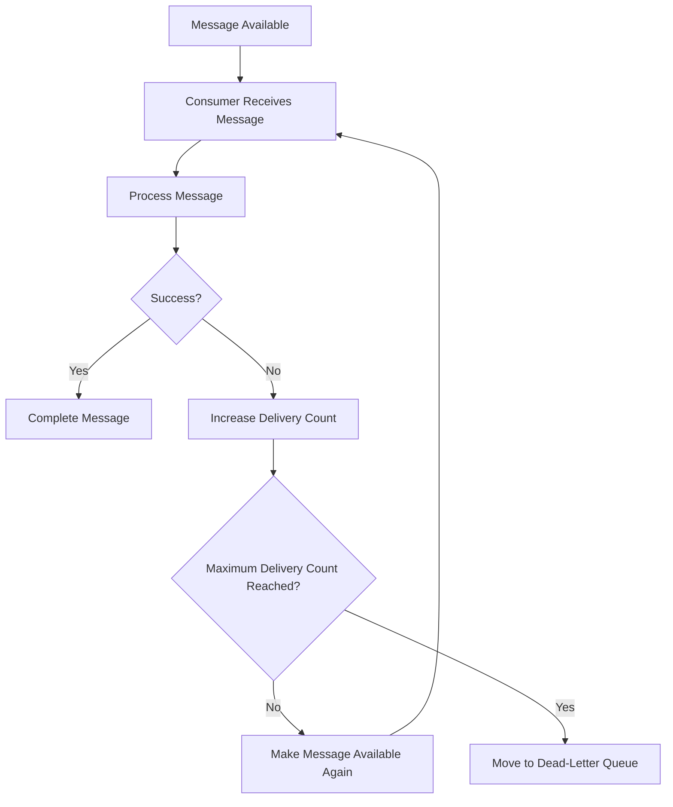

### Interview Answer

> If a message repeatedly fails and exceeds the configured maximum delivery count, Azure Service Bus moves it to the dead-letter queue so it does not retry indefinitely.

---

# 9. Time-to-Live Expiration

A message has a **time-to-live**, or TTL, that determines how long it can remain available.

If the message expires before successful processing, it may be moved to the DLQ when dead-lettering on message expiration is enabled. If this option is not enabled, expired messages may be discarded instead of being placed in the DLQ. ([learn.microsoft.com](https://learn.microsoft.com/en-us/azure/service-bus-messaging/jms-developer-guide?utm_source=openai))

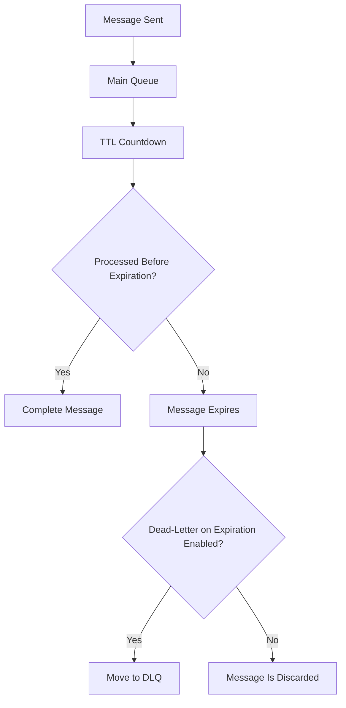

### Interview Point

> If expired messages must be investigated or replayed, enable dead-lettering on message expiration.

---

# 10. Application-Level Dead-Lettering

An application can explicitly dead-letter a message when it determines that retrying will not help.

Examples:

- Invalid schema
- Unsupported event version
- Missing required business data
- Permanent validation failure
- Security violation
- Duplicate business transaction
- Unrecognized command

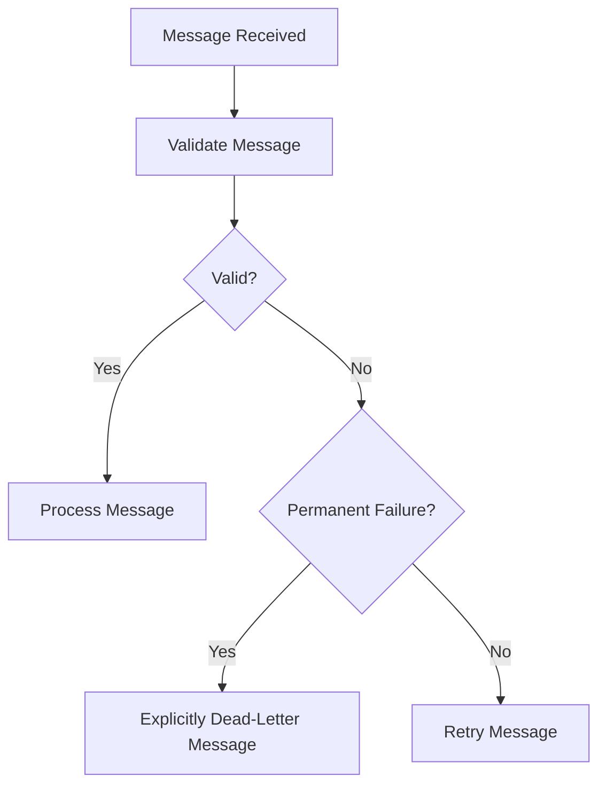

### Example Decision

```text
Database temporarily unavailable
    -> Retry

Invalid order format
    -> Dead-letter immediately

Unsupported event version
    -> Dead-letter and alert

Temporary network timeout
    -> Retry with backoff
```

---

# 11. Dead-Letter Queue Processing Lifecycle

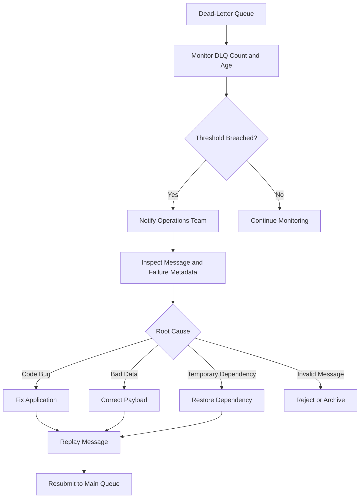

---

# 12. How to Handle a Dead-Lettered Message

A production DLQ process commonly follows these steps:

1. Detect DLQ growth.
2. Identify the affected queue or subscription.
3. Read the message body.
4. Read dead-letter reason and error description.
5. Inspect correlation ID and message ID.
6. Identify the root cause.
7. Fix the code, configuration, data, or dependency.
8. Decide whether to replay, correct, archive, or reject.
9. Replay safely if appropriate.
10. Confirm successful processing.
11. Record the incident and corrective action.

---

# 13. Replay Strategies

## 13.1 Manual Replay

An operator inspects and resubmits selected messages.

Use when:

- Volume is low
- Business impact is high
- Each message requires review
- Data correction is manual

## 13.2 Automated Replay

A recovery process reads the DLQ and resends messages after the root cause is fixed.

Use when:

- Failure cause is known
- Replay is safe
- Payloads are valid
- Idempotency is implemented

## 13.3 Correct-and-Replay

The recovery process modifies the payload before resubmission.

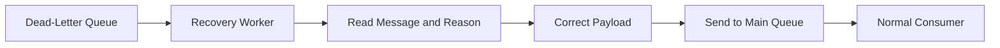

## 13.4 Archive and Reject

Some messages should not be replayed.

Examples:

- Malicious payload
- Irrecoverably invalid data
- Expired business request
- Duplicate transaction
- Unsupported historical event

Store an audit record and complete/remove the DLQ message after the retention decision.

---

# 14. Dead-Letter Queue and Idempotency

A replayed message may be processed more than once.

Therefore, consumers must be idempotent.

## Idempotent Replay Flow

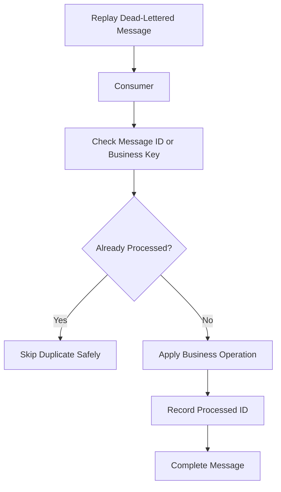

### Idempotency Techniques

- Store processed message IDs.
- Use unique transaction IDs.
- Use database unique constraints.
- Use upsert operations.
- Use conditional updates.
- Check current business state.
- Avoid non-repeatable side effects.
- Use idempotency keys with external payment or notification APIs.

---

# 15. Retry vs Dead-Letter Decision

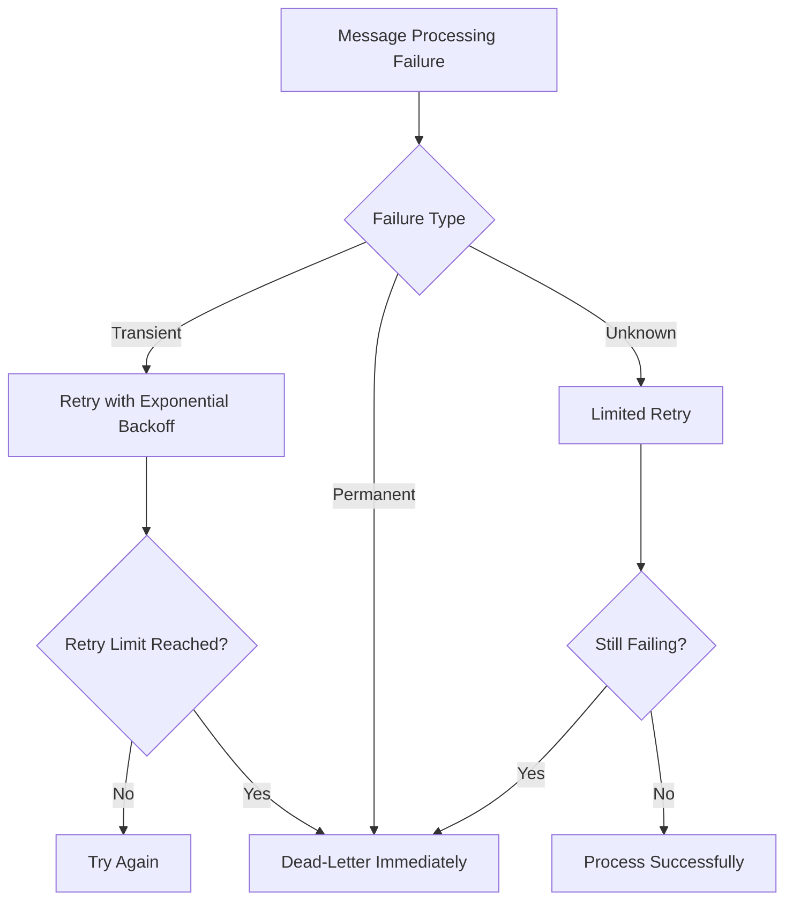

## Transient Failures

Usually retry:

- Network timeout
- Temporary database outage
- Rate limiting
- Service unavailable
- Temporary lock conflict

## Permanent Failures

Usually dead-letter:

- Invalid schema
- Missing required field
- Unsupported version
- Invalid business rule
- Unauthorized operation
- Malformed payload

---

# 16. Azure Storage Queue Poison Queue

Azure Storage Queues do not provide the same built-in Service Bus DLQ entity.

Instead, an application or Azure Functions runtime commonly uses a **poison queue**.

For Azure Functions Queue Storage triggers, after repeated failures, the runtime places the message in a queue named:

```text
<original-queue-name>-poison
```

Azure Functions documentation describes this poison-message behavior and the default retry behavior for queue-triggered functions. ([learn.microsoft.com](https://learn.microsoft.com/en-us/azure/azure-functions/functions-bindings-storage-queue-trigger?utm_source=openai))

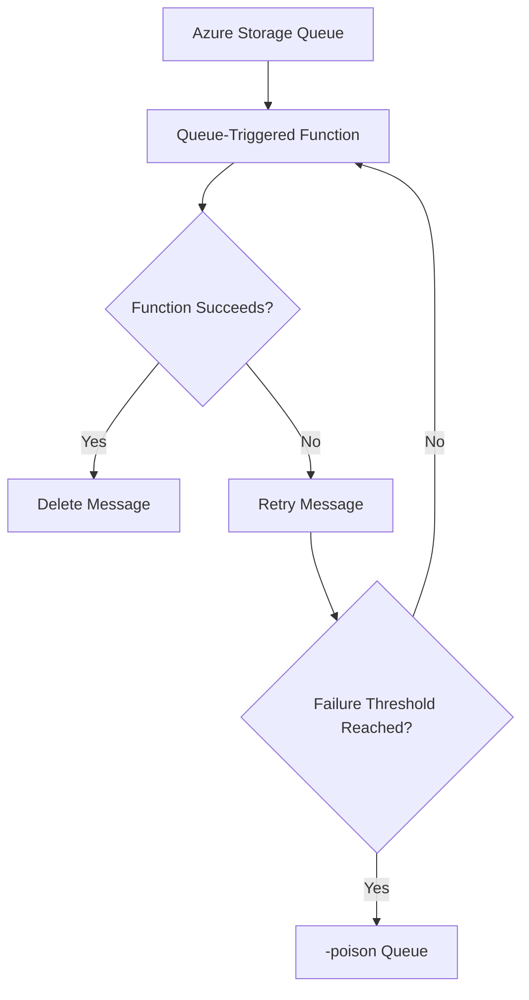

### Interview Distinction

> Service Bus has a built-in dead-letter subqueue. Azure Storage Queue commonly uses a poison queue created and managed by the application or Functions runtime.

---

# 17. Service Bus DLQ vs Storage Queue Poison Queue

| Feature | Service Bus DLQ | Storage Queue Poison Queue |
|---|---|---|
| Built-in entity | Yes | Usually application/runtime pattern |
| Separate subqueue | Yes | Usually separate queue |
| Automatic creation | Yes | Depends on implementation/runtime |
| Delivery count support | Native Service Bus behavior | `DequeueCount`-based handling |
| Dead-letter metadata | `DeadLetterReason`, `DeadLetterErrorDescription` | Application-defined metadata/logging |
| Topic subscription support | Yes, each subscription has a DLQ | No native topic/subscription model |
| Enterprise messaging features | Strong | Simpler |
| Best for | Business workflows and reliable messaging | Lightweight background work |

Azure Storage Queue consumers commonly inspect `DequeueCount` and move poison messages to a dedicated poison queue. ([learn.microsoft.com](https://learn.microsoft.com/en-us/azure/storage/queues/secure-queues?utm_source=openai))

---

# 18. Dead-Letter Queues in Azure Functions

## Service Bus-Triggered Function

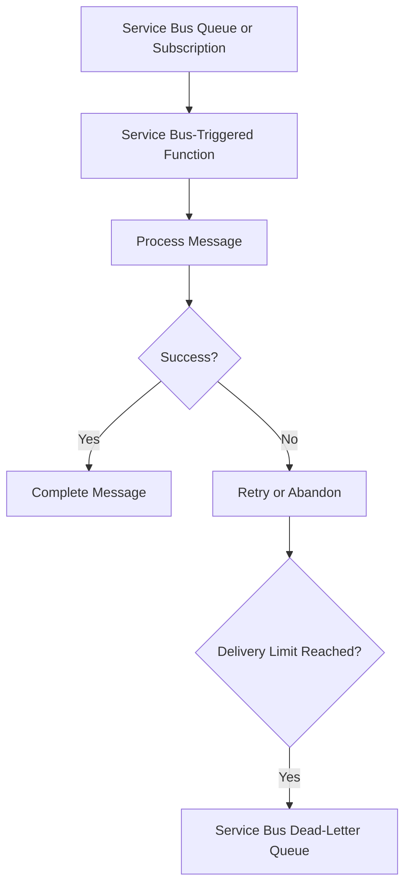

## Queue Storage-Triggered Function

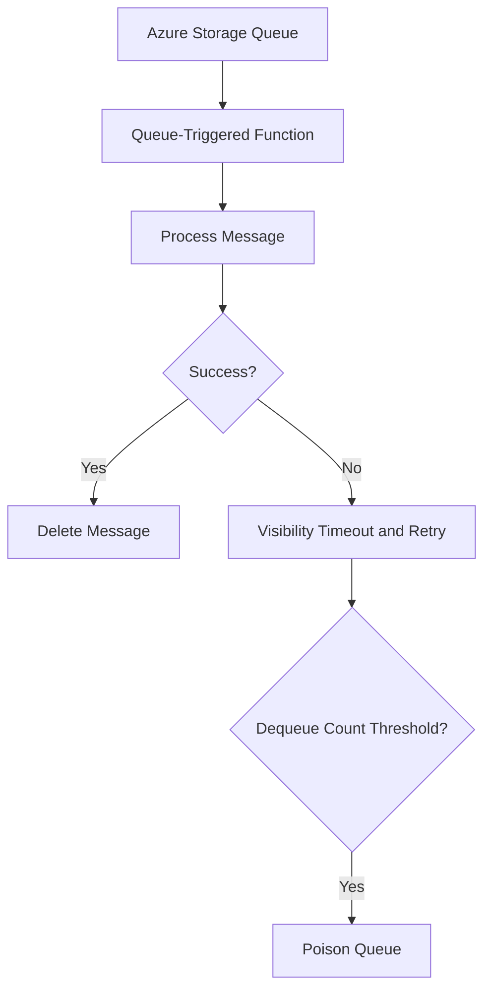

---

# 19. Monitoring a Dead-Letter Queue

Monitor:

- DLQ message count
- Poison queue message count
- Oldest DLQ message age
- Dead-letter rate
- Dead-letter reason
- Error description
- Queue backlog
- Replay success rate
- Retry count
- Subscription-specific failures

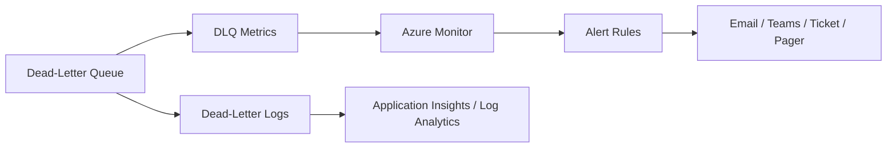

### Alert Examples

- DLQ count greater than zero for a critical queue
- DLQ count increases rapidly
- Oldest DLQ message exceeds a defined age
- Dead-letter rate exceeds the normal baseline
- Poison queue grows continuously
- Replay process fails repeatedly

Azure guidance recommends alerting on poison-queue growth for Azure Storage Queues. ([learn.microsoft.com](https://learn.microsoft.com/en-us/azure/storage/queues/secure-queues?utm_source=openai))

---

# 20. Operational Dashboard

A useful DLQ dashboard includes:

| Metric | Why It Matters |
|---|---|
| Active message count | Shows normal backlog |
| DLQ count | Shows failed message accumulation |
| Oldest message age | Shows processing delay |
| Dead-letter rate | Detects failure spikes |
| Retry count | Identifies transient instability |
| Consumer failure rate | Shows application problems |
| Replay success rate | Measures recovery effectiveness |
| Messages by reason | Helps prioritize root causes |

---

# 21. Security Considerations

Dead-lettered messages may contain sensitive business information.

Protect them using:

- Microsoft Entra ID
- Managed Identity
- Azure RBAC
- Least-privilege access
- Private endpoints
- Encryption in transit
- Encryption at rest
- Restricted operator access
- Audit logging
- Data retention policies
- Sensitive-data masking

### Security Flow

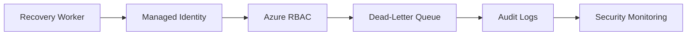

---

# 22. Dead-Letter Queue Best Practices

1. Define a maximum retry policy.
2. Separate transient and permanent failures.
3. Use exponential backoff with jitter.
4. Make message handlers idempotent.
5. Include correlation IDs and message IDs.
6. Preserve the original payload.
7. Store a meaningful dead-letter reason.
8. Monitor DLQ count and age.
9. Alert on unexpected DLQ growth.
10. Create a documented replay process.
11. Correct the root cause before replaying.
12. Avoid infinite replay loops.
13. Limit replay batches.
14. Rate-limit replay operations.
15. Validate messages before resubmission.
16. Archive irrecoverable messages.
17. Restrict DLQ access using RBAC.
18. Protect sensitive message content.
19. Test failure and recovery scenarios.
20. Document ownership of every queue and subscription.

---

# 23. Replay Safety and Loop Prevention

A common mistake is:

```text
DLQ -> Replay -> Failure -> DLQ -> Replay forever
```

Prevent this with:

- Replay attempt count
- Original dead-letter reason
- Maximum replay count
- Separate recovery queue
- Code version tracking
- Failure classification
- Manual approval for repeated failures

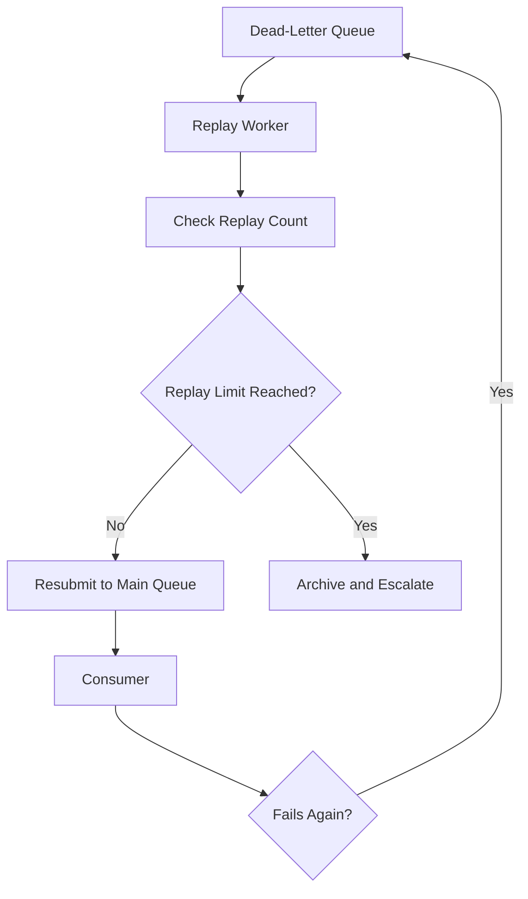

---

# 24. Dead-Letter Queue vs Retry Queue

## Retry Queue

Used for temporary failures.

```text
Temporary outage
    -> Retry later
```

## Dead-Letter Queue

Used for messages that require investigation or cannot be processed normally.

```text
Repeated or permanent failure
    -> Isolate for diagnosis
```

| Retry Queue | Dead-Letter Queue |
|---|---|
| Expected temporary recovery path | Exceptional failure path |
| Automatically retried | Usually manually or deliberately replayed |
| Short delay | Requires investigation |
| Suitable for transient errors | Suitable for poison/permanent errors |

---

# 25. Dead-Letter Queue vs Deferred Message

A **deferred message** is intentionally set aside because the consumer is not ready to process it yet.

A **dead-lettered message** is isolated because it could not be processed or delivered successfully.

| Deferred Message | Dead-Lettered Message |
|---|---|
| Processing is postponed intentionally | Processing failed or delivery was impossible |
| Remains in the main entity | Stored in the DLQ subqueue |
| Retrieved using sequence number | Read from the dead-letter queue |
| Used for workflow ordering | Used for failure handling |

Azure Service Bus deferral is a workflow feature and should not be confused with dead-lettering. ([learn.microsoft.com](https://learn.microsoft.com/en-us/azure/service-bus-messaging/message-deferral?utm_source=openai))

---

# 26. Scenario-Based Interview Answers

## Scenario 1: Invalid Order Message

### Problem

An order message is missing `orderId`.

### Answer

> This is a permanent validation failure. I would not retry it indefinitely. I would explicitly dead-letter the message with a reason such as `InvalidSchema`, record the correlation ID, alert the owning team, and provide a correction-and-replay process if the message can be fixed.

---

## Scenario 2: Database Temporarily Unavailable

### Problem

The consumer cannot connect to the database.

### Answer

> This is likely transient. I would retry with exponential backoff and jitter. If the message exceeds the delivery limit, it should move to the DLQ. I would alert if DLQ growth or database failure continues.

---

## Scenario 3: Payment Provider Timeout

### Problem

The payment provider times out.

### Answer

> I would retry only if the payment operation is safely idempotent. I would use an idempotency key or payment transaction ID to prevent duplicate charges. After the retry threshold, the message goes to the DLQ for controlled recovery.

---

## Scenario 4: Unsupported Event Version

### Problem

A consumer receives an event version it does not understand.

### Answer

> I would dead-letter the message as a permanent compatibility failure, capture the event version and metadata, update the consumer or deployment strategy, and replay only after compatibility is restored.

---

# 27. Common Interview Questions and Strong Answers

## Q1. What is a dead-letter queue?

**Answer:**

A dead-letter queue is a special queue that stores messages that cannot be successfully delivered or processed after retries or due to permanent validation failures.

---

## Q2. Why is a DLQ important?

**Answer:**

It prevents poison messages from blocking normal processing, preserves failed messages for investigation, and supports controlled correction and replay.

---

## Q3. When should a message be dead-lettered?

**Answer:**

When the failure is permanent, the maximum retry/delivery count is exceeded, the message expires with dead-lettering enabled, or the application explicitly determines that retrying is not useful.

---

## Q4. What is a poison message?

**Answer:**

A poison message is a message that repeatedly fails processing because of invalid data, incompatible schema, permanent business errors, or a code path that cannot handle its content.

---

## Q5. Does Azure Service Bus automatically create a DLQ?

**Answer:**

Yes. Each Service Bus queue and topic subscription has an associated dead-letter subqueue that is created automatically.

---

## Q6. Does Azure Storage Queue have a built-in DLQ?

**Answer:**

Azure Storage Queue does not provide the same built-in Service Bus DLQ entity. Azure Functions commonly uses a poison queue named `<queue-name>-poison`, while custom consumers can implement their own poison-queue pattern.

---

## Q7. How do you inspect a dead-letter message?

**Answer:**

Read the message body, message ID, correlation ID, delivery count, dead-letter reason, error description, timestamps, and application properties. Then correlate it with application logs and traces.

---

## Q8. How do you replay a dead-lettered message?

**Answer:**

Fix the root cause first, validate or correct the payload, resubmit the message to the original queue or topic, and ensure the consumer is idempotent to prevent duplicate side effects.

---

## Q9. What is the difference between retry and dead-lettering?

**Answer:**

Retry is for transient failures that may succeed later. Dead-lettering is for permanent or repeatedly failing messages that need isolation and investigation.

---

## Q10. Can a DLQ message expire?

**Answer:**

For Azure Service Bus, time-to-live is not applied to messages already in the dead-letter queue. There is no automatic cleanup; messages remain until they are explicitly processed or removed. ([learn.microsoft.com](https://learn.microsoft.com/da-dk/azUre/service-bus-messaging/service-bus-dead-letter-queues?utm_source=openai))

---

## Q11. How do you prevent replay loops?

**Answer:**

Track replay attempts, apply a maximum replay count, classify errors, use a separate recovery process, rate-limit replay, and archive messages that continue to fail.

---

## Q12. How do you monitor a DLQ?

**Answer:**

Monitor message count, growth rate, oldest message age, dead-letter reason, error description, retry counts, and replay success rate. Configure Azure Monitor alerts for abnormal growth.

---

# 28. 60-Second Interview Pitch

> A dead-letter queue is a failure-isolation mechanism for messages that cannot be processed successfully. In Azure Service Bus, every queue and topic subscription has a built-in DLQ. Messages may be dead-lettered after exceeding the maximum delivery count, expiring, failing delivery, or being explicitly rejected by the application. I use retries for transient failures and dead-lettering for permanent or repeatedly failing messages. In production, I monitor DLQ count and age, inspect failure metadata, fix the root cause, replay messages safely with idempotent consumers, and prevent replay loops with retry limits and audit tracking.

---

# 29. Final Interview Checklist

- [ ] Define dead-letter queue clearly.
- [ ] Explain poison messages.
- [ ] Distinguish transient and permanent failures.
- [ ] Mention retry limits.
- [ ] Mention Service Bus built-in DLQ.
- [ ] Mention Storage Queue poison queue.
- [ ] Explain dead-letter reasons.
- [ ] Explain replay and correction.
- [ ] Mention idempotency.
- [ ] Mention monitoring and alerting.
- [ ] Mention security and RBAC.
- [ ] Mention replay-loop prevention.

---

## Best One-Line Answer

> A Dead-Letter Queue is a controlled holding area for messages that cannot be processed or delivered after retries, allowing the system to continue processing healthy messages while failed messages are investigated and safely replayed.