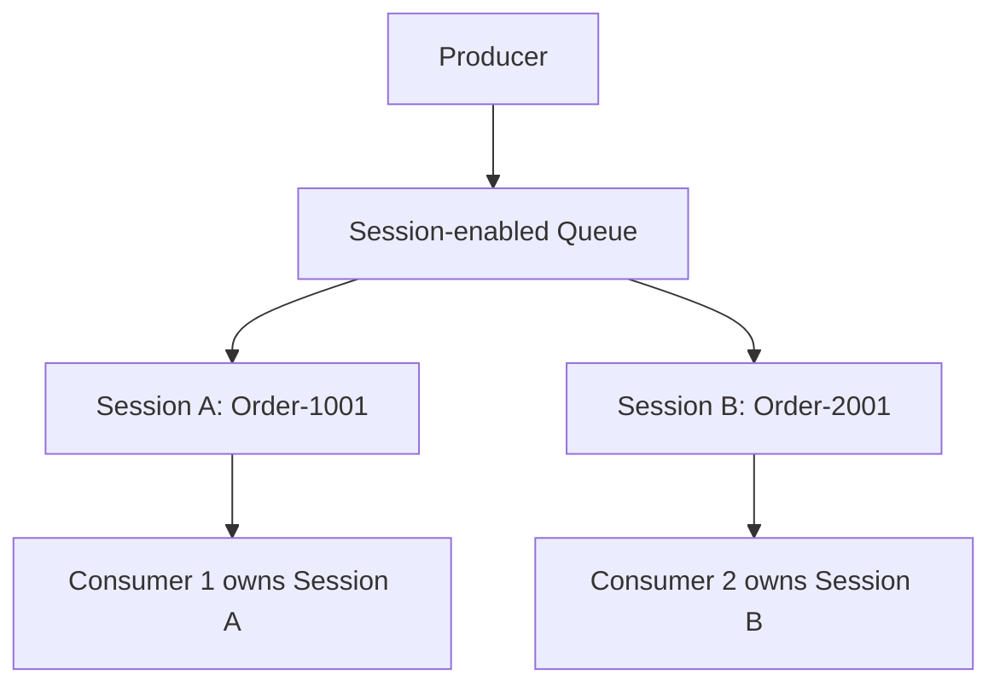
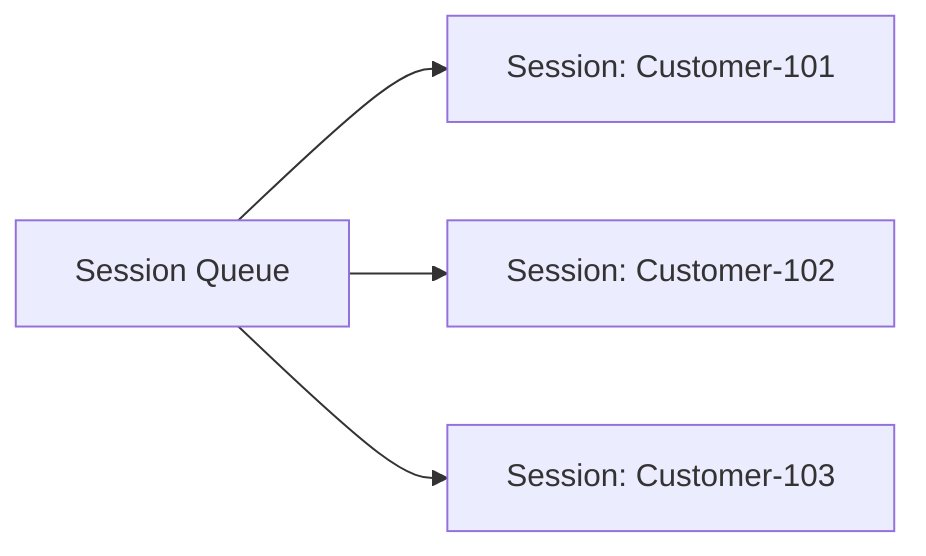
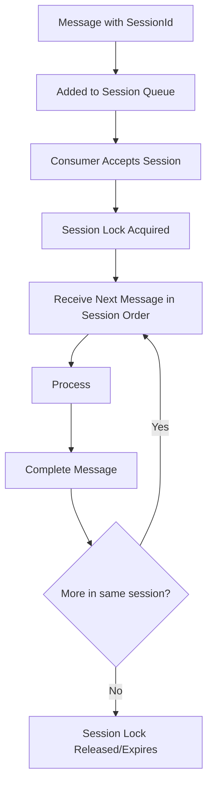
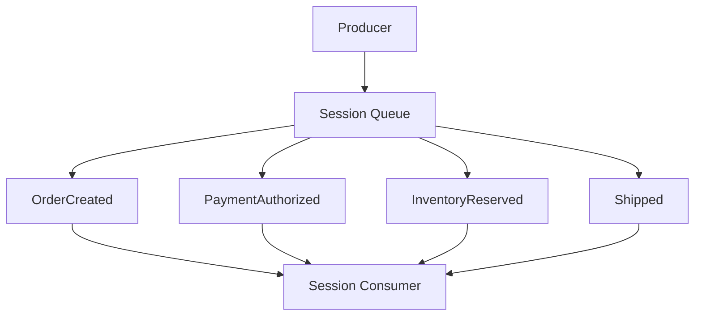
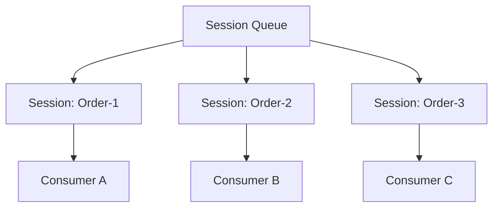
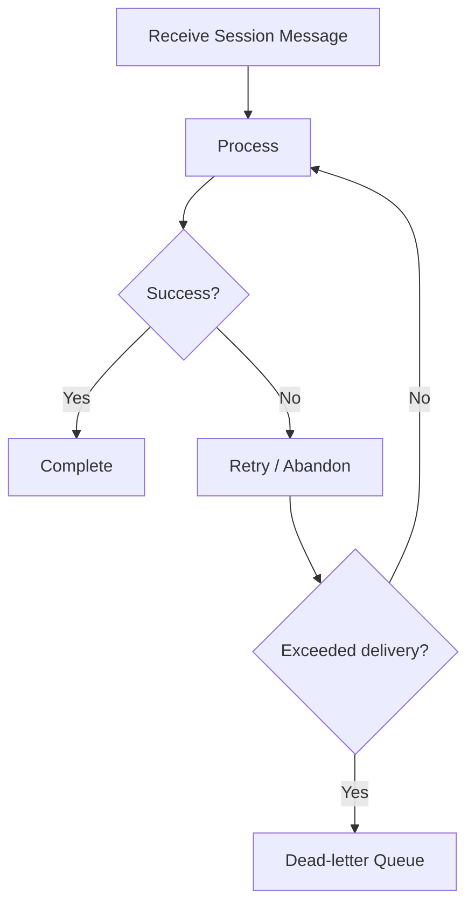

# What Is a Session-Enabled Queue?
## Detailed Interview Preparation Guide with Flow Charts

---

## 1) Direct Interview Answer

A **Session-enabled Queue** (Azure Service Bus) is a queue where messages are grouped by a **SessionId**, and messages in the same session are processed in order by **one consumer at a time**.

> One-liner: *Session-enabled queue gives ordered, correlated, single-active-consumer processing per session key.*

---

## 2) Why Session-Enabled Queues Exist

In normal queue processing with competing consumers:
- Throughput is high
- But strict per-entity ordering is hard

Some business workflows require order per entity (e.g., per order, per account, per cart, per workflow instance).

Session-enabled queue solves this by:
- Grouping messages by `SessionId`
- Locking the session to one consumer
- Processing messages in FIFO order **within that session**

---

## 3) Basic Session Queue Flow

Key point:
- Different sessions can be processed in parallel
- Same session is processed by one consumer at a time

---

## 4) Normal Queue vs Session-Enabled Queue

| Aspect | Normal Queue | Session-enabled Queue |
|---|---|---|
| Ordering guarantee | Best effort/global not guaranteed with concurrency | Ordered within a session |
| Correlation | App-managed | Native via `SessionId` |
| Consumer ownership | Message lock | Session lock (plus message locks within session flow) |
| Parallelism | High via competing consumers | High across sessions, serialized within each session |
| Use case | Independent tasks | Ordered workflow per business key |

---

## 5) Conceptual Model

Think of session-enabled queue as many virtual ordered streams in one queue.

Each session is like a mini FIFO lane.

---

## 6) Message Lifecycle in a Session

---

## 7) Session Lock vs Message Lock

In session-enabled processing:
- Consumer typically acquires **session lock**
- That consumer exclusively processes that session’s message stream during lock ownership

If session lock expires:
- Another consumer can accept the session
- Remaining messages continue from queue

Interview phrase:
> Session lock ensures ordered ownership at session level, preventing concurrent consumers from interleaving messages for the same business entity.

---

## 8) Why SessionId Is Critical

`SessionId` defines grouping boundary.
Bad key design causes:
- Out-of-order business logic
- Hot partitions/sessions
- Throughput imbalance

Good session key examples:
- `OrderId`
- `CustomerId` (if ordering per customer needed)
- `WorkflowInstanceId`
- `CartId`
- `PaymentTransactionId`

---

## 9) Ordered Workflow Example

Scenario: order lifecycle events must be applied in order.

Events:
1. OrderCreated
2. PaymentAuthorized
3. InventoryReserved
4. Shipped

All use `SessionId = Order-1001`

This prevents race conditions for same order.

---

## 10) Parallelism with Sessions

Sessions preserve order per key, but still scale horizontally across keys.

Best of both:
- Correctness within entity
- Parallelism across entities

---

## 11) Session State (Advanced but Valuable Interview Point)

Azure Service Bus sessions support session state metadata for workflow context.

Use cases:
- Checkpoint progress
- Aggregate partial workflow data
- Store small orchestration hints

Example concept:
- SessionId = `Claim-991`
- Session state tracks last completed step

This can reduce dependency on external state for lightweight per-session progress (still use durable app DB for critical business data).

---

## 12) When to Use Session-Enabled Queue

Use it when you need:
1. Ordered processing per business entity
2. Correlated message handling
3. Single active processor per entity stream
4. Stateful workflow progression by key

Typical scenarios:
- Order lifecycle updates
- Payment transaction state machine
- Case/ticket workflow events
- IoT command streams per device
- Multi-step approvals per request

---

## 13) When NOT to Use Session-Enabled Queue

Avoid or reconsider when:
1. Messages are completely independent
2. No ordering/correlation requirement
3. Very high throughput with tiny independent tasks
4. Poor session key cardinality (too few session IDs leading to bottlenecks)

In those cases:
- Normal queue may be simpler/faster

---

## 14) Session Queue vs Topic Subscriptions

- Session-enabled queue: one queue, ordered streams by session
- Topic subscription: fan-out to multiple independent subscribers

You can also combine both:
- Publish event to topic
- Subscription uses sessions for per-entity ordered processing

---

## 15) Failure Handling in Session Processing

Important:
- Keep handlers idempotent
- Use retries for transient errors
- DLQ for poison/permanent failures

---

## 16) Session Lock Renewal

If processing for a session takes longer:
- Renew session lock
- Or reduce message processing time
- Or split heavy work asynchronously

Without renewal:
- Lock expires
- Another consumer may take session
- Duplicate/inconsistent attempts possible if idempotency missing

---

## 17) Throughput and Hot Session Design

Potential issue: one “hot” session gets most traffic.
Effects:
- Throughput bottleneck for that key
- Lag for that entity stream

Mitigations:
- Revisit session key strategy
- Partition workload by finer key where business-safe
- Offload heavy work to async sub-queues while preserving command order logic

---

## 18) Monitoring Session-Enabled Queues

Track:
- Active message count
- Session backlog distribution
- Oldest message age per session
- Session lock lost count
- Dead-letter count
- Processing latency by session key
- Hot session concentration

---

## 19) Security Best Practices

- Use Managed Identity + RBAC
- Avoid hardcoded connection strings
- Private endpoint/network restrictions for sensitive workloads
- Audit access and processing failures
- Encrypt data in transit and at rest

---

## 20) Common Mistakes (Interview Gold)

1. Enabling sessions but not setting SessionId on messages  
2. Using low-cardinality session keys (creates bottlenecks)  
3. Assuming global ordering across all sessions  
4. Ignoring idempotency (duplicates can still happen)  
5. Not monitoring hot sessions and lock expirations  
6. Long processing without session lock renewal strategy  

---

## 21) Interview Q&A (Strong Sample Answers)

### Q1: What is a session-enabled queue?
**Answer:** A Service Bus queue that groups messages by SessionId and guarantees ordered processing within each session by one active consumer at a time.

### Q2: Why use sessions?
**Answer:** To ensure per-entity ordering and correlation in concurrent distributed processing.

### Q3: Does session-enabled queue guarantee global queue ordering?
**Answer:** No, ordering is guaranteed within each session, not across all sessions.

### Q4: Can session queues scale?
**Answer:** Yes, by processing multiple sessions in parallel across consumers.

### Q5: What happens if session lock expires?
**Answer:** Another consumer can acquire that session; therefore handlers must be idempotent and lock renewal may be needed for long operations.

### Q6: Session queue or normal queue for independent image resize tasks?
**Answer:** Normal queue, because ordering per entity is usually unnecessary.

---

## 22) 60-Second Interview Pitch

> A session-enabled queue in Azure Service Bus is used when messages must be processed in order per business key, such as OrderId or WorkflowId. Each message includes a SessionId, and one consumer at a time owns that session, ensuring sequential handling within that stream. Different sessions can still be processed in parallel, so you get both correctness and scalability. It’s ideal for stateful workflows and correlated event handling. In production, I design good session keys, keep handlers idempotent, manage session lock renewal for long processing, and monitor hot-session backlogs and dead-letter patterns.

---

## 23) Final Checklist

- [ ] Ordering needed per entity/workflow  
- [ ] SessionId strategy defined (high-cardinality, business-correct key)  
- [ ] Consumer is session-aware  
- [ ] Idempotency implemented  
- [ ] Retry + DLQ strategy configured  
- [ ] Session lock renewal considered  
- [ ] Monitoring for session lag/hot keys configured  

---

## One-Line Conclusion

> Use a session-enabled queue when you need per-key ordered, correlated, single-active-consumer processing with parallelism across independent keys.