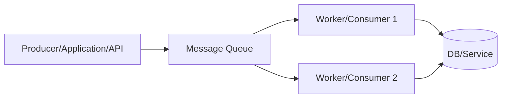
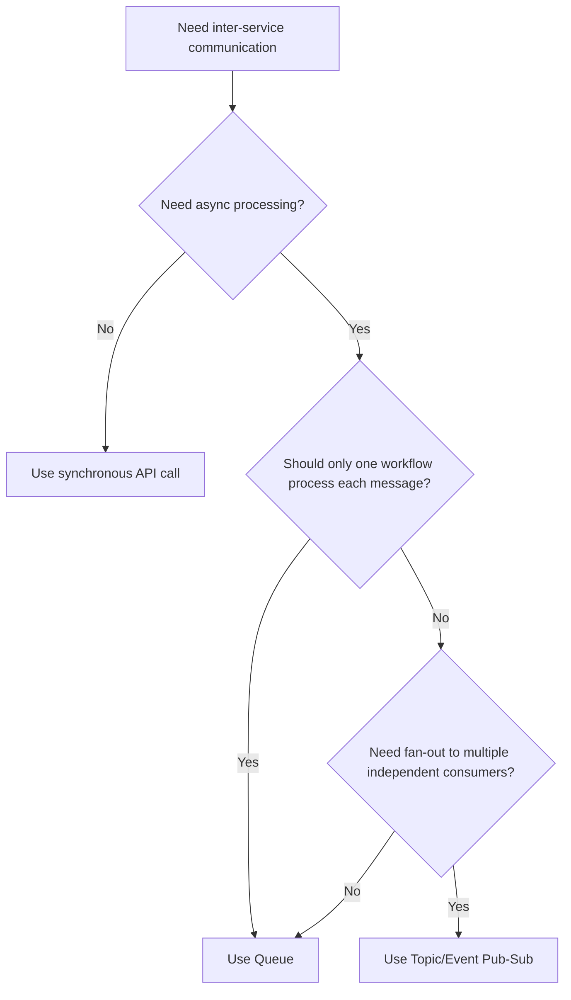
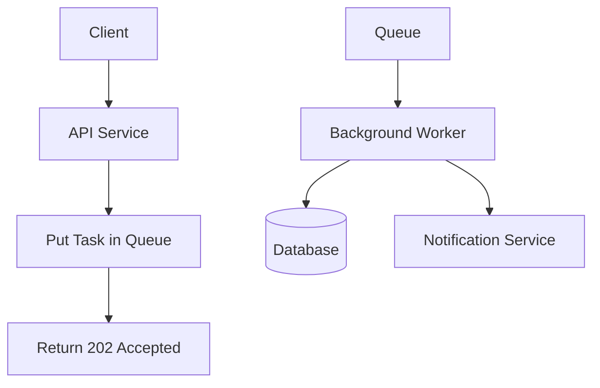
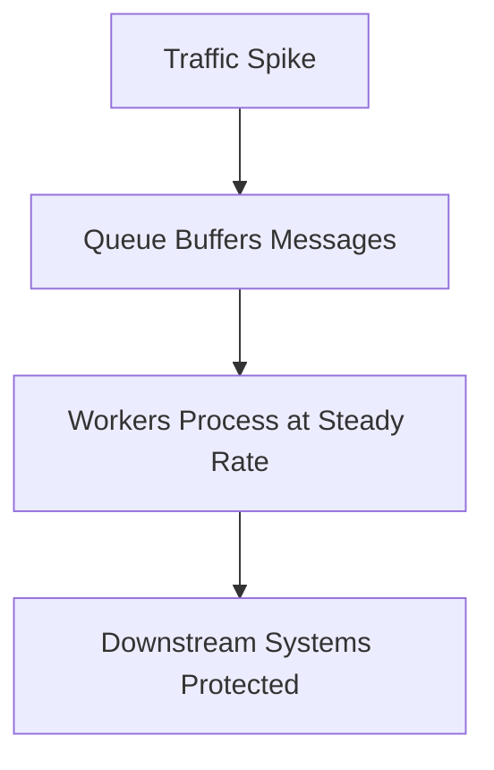
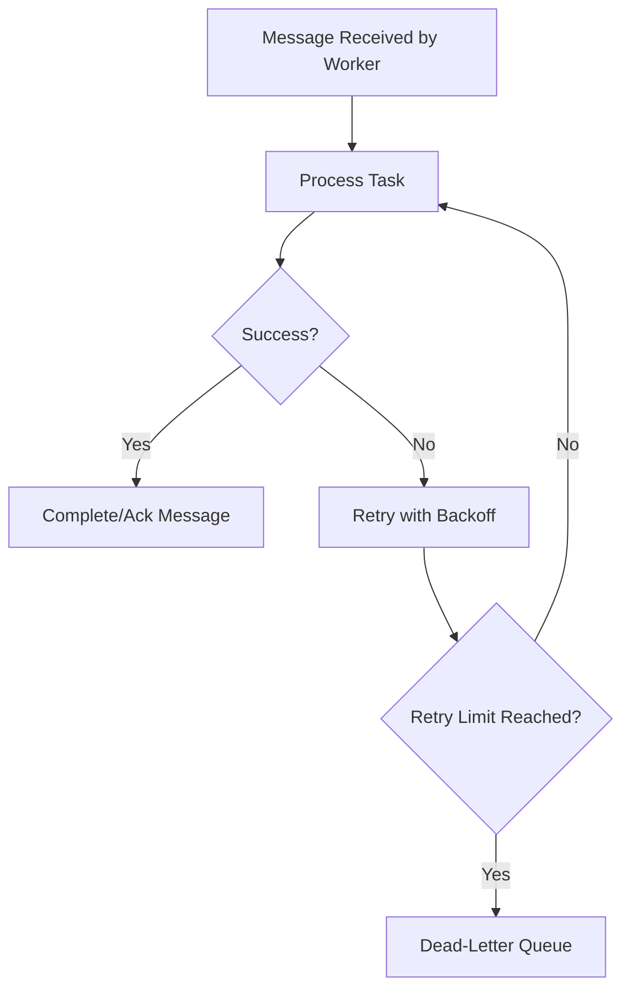
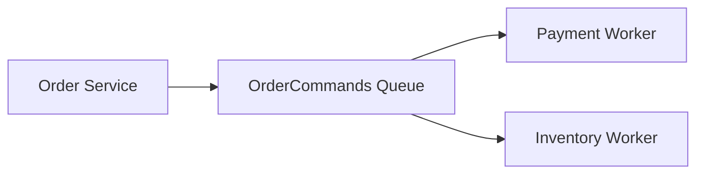
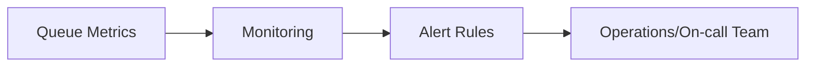

# When Should You Use a Queue?  
## Detailed Interview Preparation Guide with Flow Charts

## 1) Direct Interview Answer

Use a **Queue** when you need **asynchronous, decoupled, reliable, one-at-a-time task processing** between producer and consumer systems.

> One-liner: *Use a queue when one logical consumer workflow should process each message, and the producer should not wait for immediate completion.*

---

## 2) What a Queue Solves

A queue is ideal when you need to:
- Decouple sender and receiver
- Handle traffic spikes (load leveling)
- Process tasks in background
- Improve reliability with retries
- Prevent producer from blocking on slow downstream systems
- Scale consumers independently
- Smooth bursty workloads

---

## 3) Queue Core Flow

Each message is handled by one logical consumer outcome (competing consumer model).

---

## 4) Decision Flow Chart: Should You Use Queue?

---

## 5) Key Indicators You Should Use a Queue

Use a queue when these are true:

1. **Producer and consumer should be loosely coupled**  
2. **Immediate response is not required**  
3. **Work can be done later/background**  
4. **Task must be retried on transient failures**  
5. **Workload arrives in bursts**  
6. **Need horizontal scaling for workers**  
7. **Need resilience during downstream outages**

---

## 6) Real-World Use Cases

1. Order processing after checkout  
2. Image/video thumbnail generation  
3. Email/SMS notification sending  
4. Invoice generation  
5. Report generation jobs  
6. File transformation pipelines  
7. Data sync between systems  
8. Webhook processing  
9. Fraud/risk evaluation pipeline step  
10. Scheduled batch task fan-out

---

## 7) Queue Pattern: API + Background Worker

Why this is useful:
- Fast API response
- Heavy work offloaded
- Better user experience under load

---

## 8) Queue for Load Leveling (Spike Smoothing)

When requests spike, queue absorbs pressure.

Without queue:
- Downstream service may fail/throttle.

With queue:
- Backlog forms, then drains as capacity allows.

---

## 9) Queue for Reliability and Retry

Interview point:
- Queue-based systems must include retry + dead-letter handling.

---

## 10) Queue vs Topic (Interview Critical)

| Need | Queue | Topic |
|---|---|---|
| One logical consumer outcome | ✅ | ❌ |
| Multiple independent consumers each need a copy | ❌ | ✅ |
| Command/task processing | ✅ | ⚠️ (possible but not primary pattern) |
| Event fan-out architecture | ❌ | ✅ |

Rule of thumb:
- **Command/task** → Queue  
- **Event broadcast** → Topic/Pub-Sub

---

## 11) Queue vs Direct Synchronous API Call

Use queue instead of sync API when:
- Consumer is slow/unreliable
- Temporary downtime possible
- Request can be eventually processed
- You need buffering and retries

Use sync call when:
- Immediate response required
- Operation must complete in-request
- Tight consistency is mandatory in same transaction boundary (with careful design)

---

## 12) Queue in Microservices Architecture

(If each worker needs same message independently, use topic/subscriptions instead.  
If workers are competing instances of same processing type, queue is correct.)

---

## 13) Queue and Idempotency

Queue consumers may receive duplicate deliveries (retries/re-delivery scenarios).

So design consumers to be **idempotent**:
- Use operation/message IDs
- Check processed records
- Upsert/state-guard patterns
- Avoid duplicate side-effects (e.g., double charge)

---

## 14) Queue Ordering Considerations

If strict order matters:
- Single consumer or session/partition-aware design (tech dependent)
- Avoid uncontrolled parallelism for same entity key

If order does not matter:
- Scale with multiple competing consumers for throughput

---

## 15) Monitoring Queues in Production

Track:
- Queue depth/backlog
- Oldest message age
- Processing rate
- Failure/retry rate
- Dead-letter count
- Consumer lag and health

---

## 16) Common Anti-Patterns

1. Using queue when every service needs the same message (should be pub-sub)  
2. No dead-letter strategy  
3. No idempotency handling  
4. Unbounded retries without backoff  
5. Ignoring backlog growth alerts  
6. Overloading downstream systems with too many workers  
7. Putting huge payloads directly in queue instead of reference pattern when needed  

---

## 17) Interview Q&A (Strong Sample Answers)

### Q1: When should you use a queue?
**Answer:** When you need asynchronous decoupled processing where each message should be handled once by one logical consumer workflow, with retry and buffering support.

### Q2: Why queue instead of direct API call?
**Answer:** Queue improves resilience and scalability by buffering work, decoupling producer/consumer, and handling transient failures via retry.

### Q3: Queue or topic for OrderCreated consumed by inventory, billing, and notifications?
**Answer:** Topic (pub-sub), because each service needs its own copy. Queue is better for single workflow command processing.

### Q4: How do you make queue processing reliable?
**Answer:** Use retries with backoff, idempotent consumers, dead-letter queues, monitoring, and alerting.

### Q5: Can queues help during peak load?
**Answer:** Yes. They absorb spikes and allow controlled draining by workers, protecting downstream systems.

---

## 18) 60-Second Interview Pitch

> I use a queue when I need asynchronous, reliable, decoupled task processing between services. A queue is ideal when one logical consumer workflow should process each message and when the producer should not block waiting for completion. It helps absorb traffic spikes, enables independent scaling of workers, and improves resilience through retries and dead-letter handling. In production, I combine queue processing with idempotent consumers, backoff policies, backlog monitoring, and alerting to maintain throughput and reliability.

---

## 19) Final Checklist: “Should I Use Queue?”

- [ ] Is async processing acceptable?  
- [ ] Should one logical consumer process each message?  
- [ ] Do I need buffering during spikes?  
- [ ] Do I need retries for transient failures?  
- [ ] Can producer and consumer be decoupled?  
- [ ] Do I have idempotency + DLQ strategy?  

If mostly **yes**, queue is likely the right pattern.

---

## One-Line Conclusion

> Use a queue when you need resilient asynchronous command/task processing with one logical consumer outcome, buffering, and retry-driven reliability.