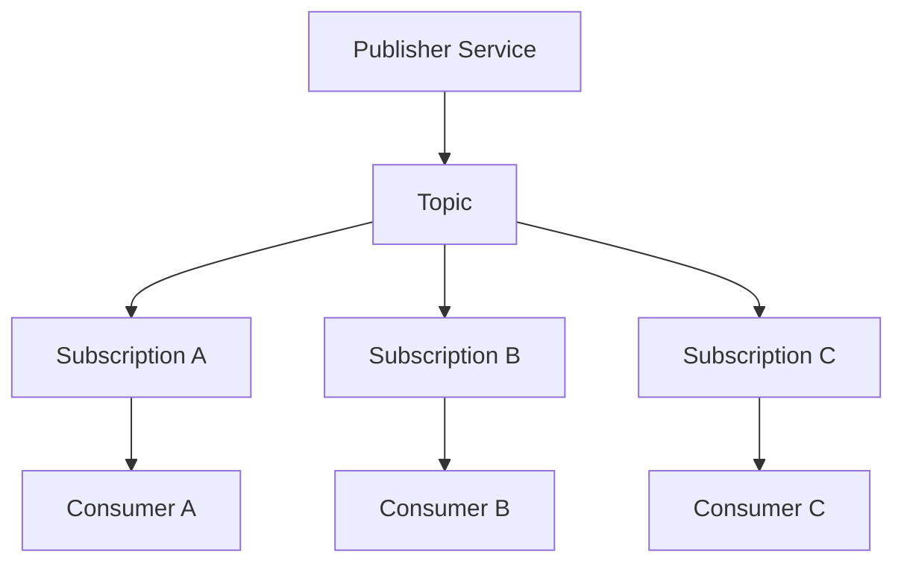
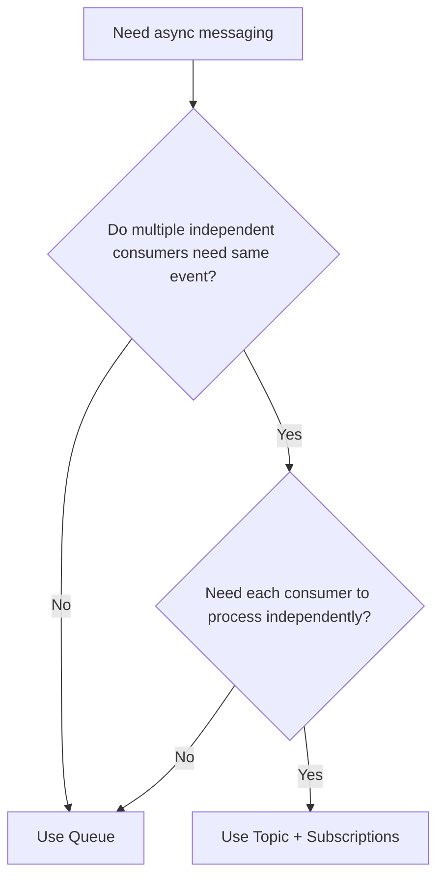
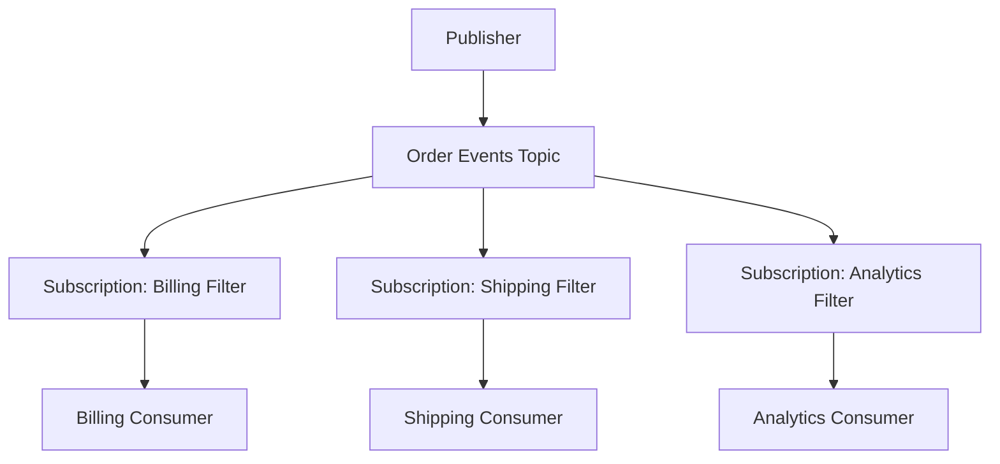
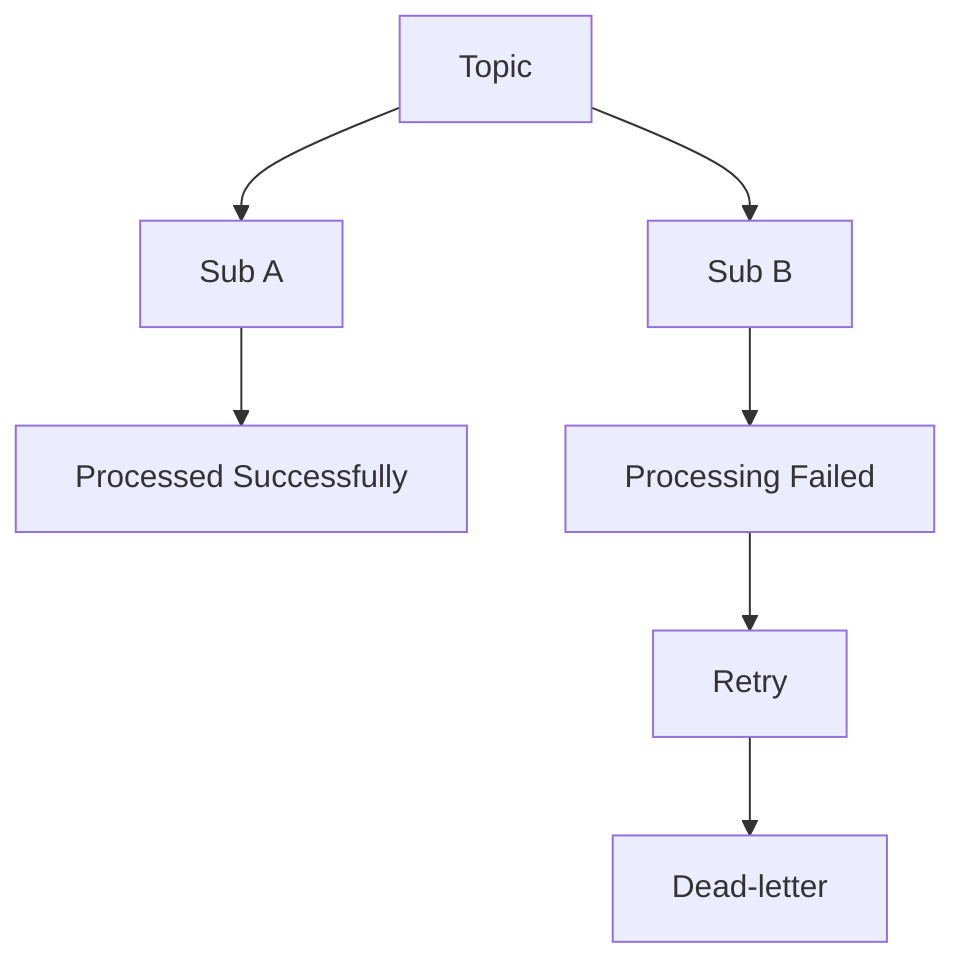
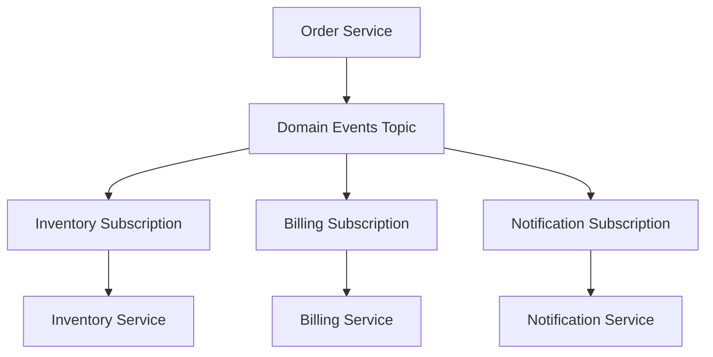
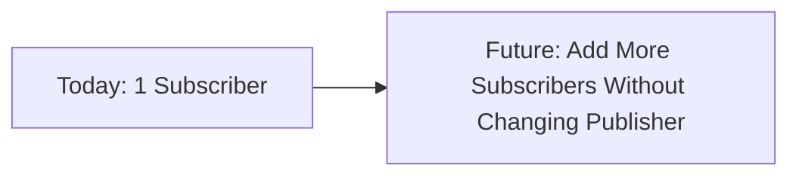
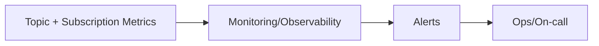

# When Should You Use a Topic?  
## Detailed Interview Preparation Guide with Flow Charts

## 1) Direct Interview Answer

Use a **Topic** when one message/event must be delivered to **multiple independent consumers** (publish-subscribe pattern), where each consumer needs its own copy and lifecycle.

> One-liner: *Use a topic when you want event fan-out—one publisher, many subscribers, loosely coupled.*

---

## 2) What a Topic Solves

A topic is ideal when you need:
- Publish-subscribe messaging
- Event fan-out to multiple services
- Loose coupling between producer and consumers
- Independent scaling/retries per consumer group
- Extensibility (add new subscribers without changing publisher)
- Selective routing with subscription filters

---

## 3) Topic Core Flow

Each subscription receives its own message copy (based on matching rules/filters).

---

## 4) Decision Flow Chart: Should You Use Topic?

---

## 5) Clear Indicators You Should Use Topic

Use a topic when:

1. **More than one downstream service needs the same event**
2. **Consumers should evolve independently**
3. **Publisher should not know all consumers**
4. **Each consumer needs separate retry/failure handling**
5. **You want to add/remove consumers without changing producer code**
6. **You need content-based routing via filters**
7. **You are implementing event-driven microservices**

---

## 6) Real-World Use Cases

1. `OrderCreated` event consumed by:
   - Inventory service
   - Billing service
   - Notification service
   - Analytics service

2. `UserRegistered` event consumed by:
   - CRM sync
   - Welcome email
   - Fraud scoring
   - Audit logging

3. `PaymentCompleted` event consumed by:
   - Order status updater
   - Loyalty points system
   - Ledger posting
   - Reporting pipeline

---

## 7) Topic vs Queue (Interview Critical)

| Requirement | Queue | Topic |
|---|---|---|
| One logical consumer outcome | ✅ | ❌ |
| Multiple independent consumers need same message | ❌ | ✅ |
| Command/task processing | ✅ | ⚠️ |
| Event broadcast/fan-out | ❌ | ✅ |
| Per-consumer filtering and independent subscriptions | ❌ | ✅ |

Rule:
- **Command** (“Do this”) → Queue  
- **Event** (“This happened”) → Topic  

---

## 8) Topic with Subscription Filters

Topics support subscription-level filtering so each subscriber receives only relevant events.

Example filter ideas:
- Event type
- Region
- Priority
- Tenant/customer segment

---

## 9) Independent Failure Handling per Subscription

One subscriber can fail without blocking others.

Key benefit:
- Failure isolation across consumers

---

## 10) Topic in Event-Driven Microservices

Why this is strong:
- High decoupling
- Easy extensibility
- Independent deployments/scaling

---

## 11) Topic for Future-Proof Design

If today you have one consumer but expect more later, topic can reduce future rework.

Interview phrasing:
> Topic supports open-ended downstream integration growth.

---

## 12) Reliability Practices with Topics

Even with topics, ensure:
- Idempotent subscribers
- Retry with backoff
- Dead-letter handling per subscription
- Poison message analysis
- Correlation IDs for tracing
- Monitoring per subscription backlog and failures

---

## 13) Monitoring Topics in Production

Track:
- Topic ingress rate
- Subscription backlog depth
- Oldest message age per subscription
- Retry/dead-letter counts per subscription
- Consumer processing latency

---

## 14) Common Anti-Patterns

1. Using topic when only one strict workflow exists (queue may be simpler)
2. No subscription monitoring (one lagging consumer goes unnoticed)
3. No idempotency in subscribers
4. Too many tightly coupled event contracts without version strategy
5. Treating events like direct commands to one specific consumer

---

## 15) Topic vs Event Hub Clarification (Interview Trap)

- Topic (Service Bus): enterprise brokered pub-sub with subscription semantics, business workflow integration
- Event Hubs: high-throughput event streaming platform for telemetry/log streams

If business services need reliable independent processing of domain events, topic is usually more appropriate than raw stream ingestion tools.

---

## 16) Interview Q&A (Strong Answers)

### Q1: When should you use a topic?
**Answer:** When one event must be consumed independently by multiple services/subscribers.

### Q2: Why not queue for this?
**Answer:** Queue delivers each message to one logical consumer path; it does not provide independent fan-out copies to multiple subscribers.

### Q3: Can subscribers fail independently?
**Answer:** Yes. Each subscription has independent processing lifecycle, retries, and dead-letter handling.

### Q4: What is the main benefit of topic in microservices?
**Answer:** Loose coupling and extensibility—new consumers can be added without changing producer code.

### Q5: How do you route only specific events to specific consumers?
**Answer:** Use subscription filters/rules on message properties.

---

## 17) 60-Second Interview Pitch

> I use a topic when I need publish-subscribe messaging: one event published once but consumed by multiple independent services. Topics are ideal for event-driven microservices because they decouple publisher from subscribers, allow independent scaling and retry behavior, and support filtered subscriptions so each consumer gets only relevant messages. Compared to queues, topics are better for fan-out scenarios. In production, I ensure idempotent consumers, per-subscription monitoring, dead-letter handling, and correlation-based tracing.

---

## 18) Final Checklist: “Should I Use Topic?”

- [ ] Do multiple independent consumers need the same event?  
- [ ] Do I need event fan-out without changing producer?  
- [ ] Do consumers require independent retry/dead-letter behavior?  
- [ ] Do I need subscription-level filtering/routing?  
- [ ] Am I building event-driven microservices?  

If mostly **yes**, use a **Topic**.

---

## One-Line Conclusion

> Use a topic when you need publish-subscribe fan-out, where one event is delivered to multiple independent subscribers with isolated processing lifecycles.