# Azure Blob Storage vs Azure File Share

## Detailed Interview Preparation Guide with Flow Charts

---

## 1. Direct Interview Answer

**Azure Blob Storage** and **Azure Files** are both Azure Storage services, but they are designed for different access models.

- **Azure Blob Storage** is object storage for massive amounts of unstructured data such as images, videos, documents, backups, logs, and data-lake files.
- **Azure Files** provides managed cloud file shares that applications and users can mount using standard SMB or NFS protocols.

> **One-line interview answer:**  
> Choose **Blob Storage** for scalable object-based access through HTTP, REST APIs, or SDKs. Choose **Azure Files** when applications require a shared filesystem mounted through SMB or NFS.

---

## 2. Quick Decision Flow Chart

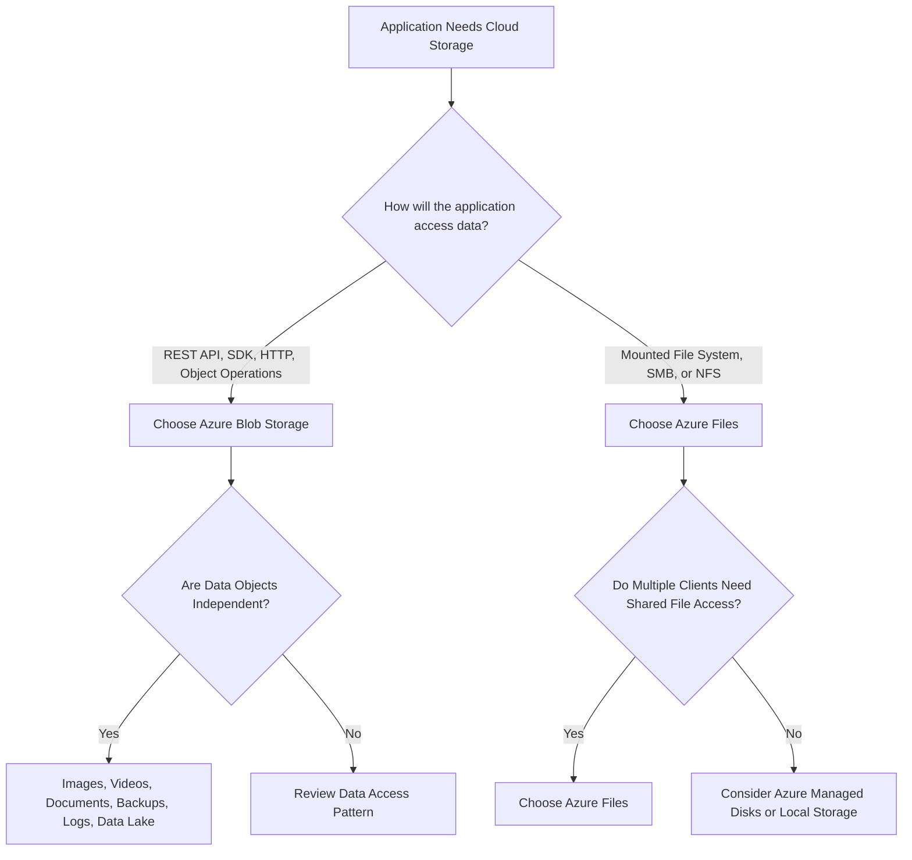

---

## 3. High-Level Comparison

| Category | Azure Blob Storage | Azure Files |
|---|---|---|
| Storage model | Object storage | Managed file share |
| Access style | REST API, SDK, HTTP/HTTPS, CLI | SMB, NFS, REST API, SDK |
| File hierarchy | Container and object naming; hierarchical namespace available with Data Lake Storage | Native directory and file hierarchy |
| Mountable as filesystem | Not normally used as a traditional filesystem | Yes |
| Best for | Objects, media, backups, logs, data lakes | Shared files, lift-and-shift apps, mounted application storage |
| Typical clients | Applications, browsers, data platforms, analytics tools | VMs, containers, Windows/Linux/macOS clients |
| Shared access | Application/API-based | Concurrent file-share access |
| Kubernetes pattern | SDK/API or specialized storage integration | PersistentVolume/PersistentVolumeClaim |
| Protocol focus | HTTP/HTTPS and storage APIs | SMB and NFS |
| Access tiers | Hot, cool, cold, archive options for blob data | HDD or SSD file-share tiers |
| Common AKS use | Object uploads, documents, images, backups | Shared persistent volume |
| Primary abstraction | Object | File and directory |
| Best question to ask | “Do I need object operations?” | “Does the application need a mounted share?” |

Azure Blob Storage is optimized for massive unstructured data, while Azure Files provides fully managed SMB/NFS file shares. ([learn.microsoft.com](https://learn.microsoft.com/en-us/azure/storage/blobs/storage-blobs-introduction?utm_source=openai))

---

## 4. What Is Azure Blob Storage?

Azure Blob Storage is Microsoft's object storage service for large amounts of unstructured data.

Typical data includes:

- Images
- Videos
- Audio files
- Documents
- Backups
- Log files
- Software packages
- Data-lake files
- Archives
- Machine-learning datasets

Applications normally access Blob Storage through:

- Azure Storage SDKs
- REST APIs
- Azure CLI
- Azure PowerShell
- HTTP or HTTPS URLs
- SFTP or supported filesystem protocols for applicable scenarios

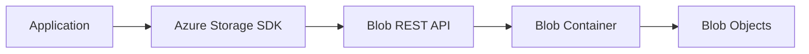

A blob is an object stored inside a container.

Example object path:

```text
https://storageaccount.blob.core.windows.net/images/product-123.jpg
```

---

## 5. Blob Storage Resource Hierarchy

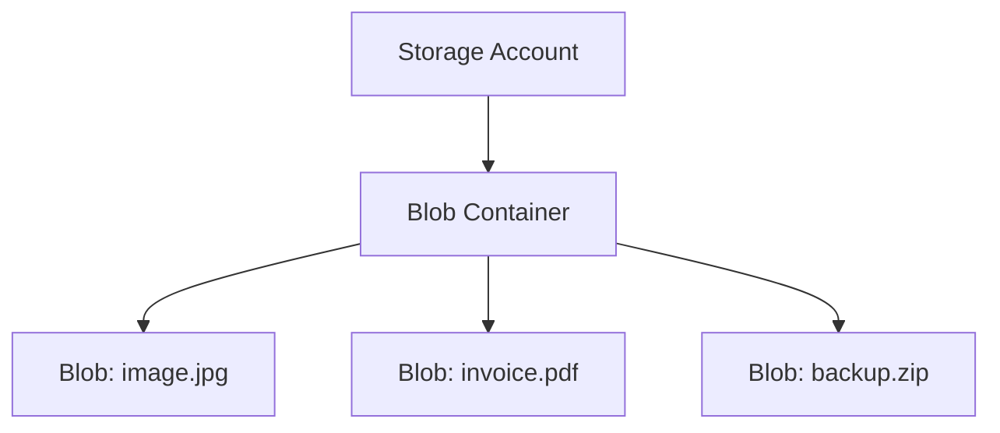

The main hierarchy is:

1. Storage account
2. Container
3. Blob

A blob can contain:

- Data
- Metadata
- Properties
- Tags
- Access tier information
- Version information, if enabled

---

## 6. Blob Types

Azure Blob Storage supports different blob types for different workloads.

### Block Blob

Best for:

- Documents
- Images
- Videos
- Application files
- General object storage

### Append Blob

Best for:

- Append-heavy log workloads
- Data that is added sequentially

### Page Blob

Best for:

- Random read/write patterns
- Virtual hard disk-style workloads

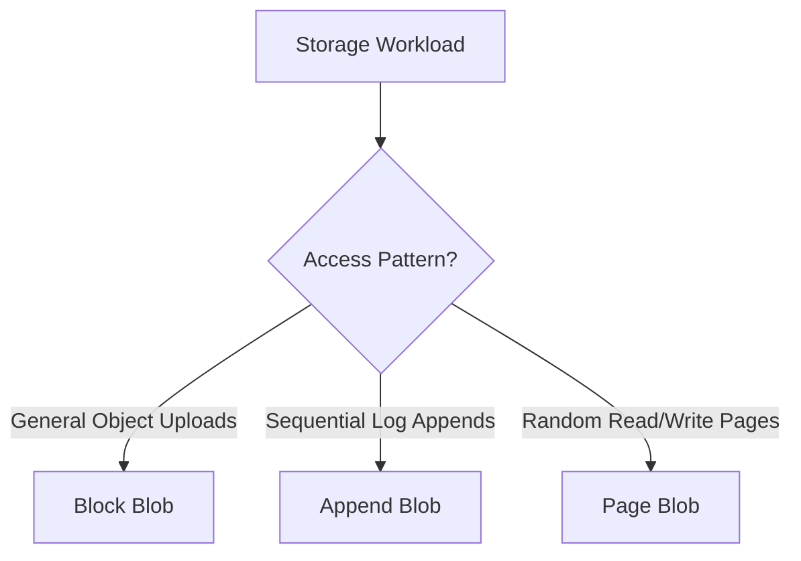

---

## 7. What Is Azure Files?

Azure Files provides fully managed cloud file shares.

Applications and users can access Azure Files using:

- SMB
- NFS
- REST API
- Azure Storage SDKs

Azure Files is useful when an application expects a normal filesystem with:

- Directories
- File paths
- File locking
- Shared access
- Mount operations
- Existing file-based application APIs

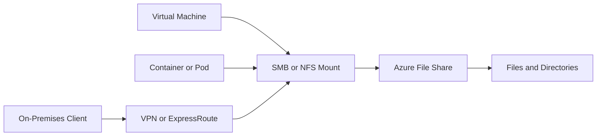

Azure Files supports SMB and NFS file shares, and file shares can be accessed concurrently by many clients. ([learn.microsoft.com](https://learn.microsoft.com/en-us/azure/storage/files/files-nfs-protocol?utm_source=openai))

---

## 8. Azure Files Resource Hierarchy

For the classic management model:

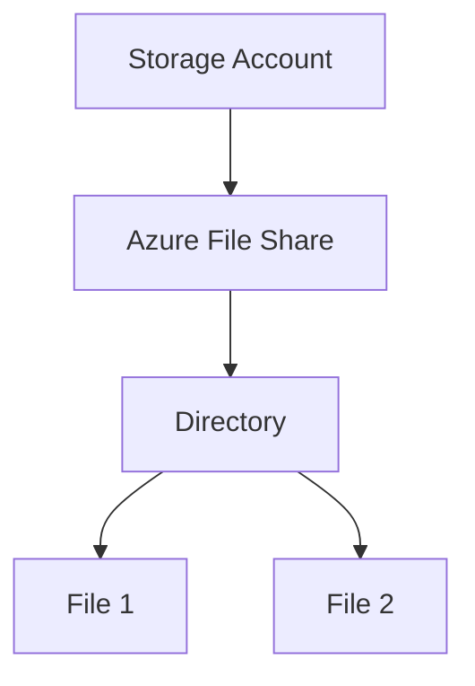

A file share provides a hierarchical filesystem-like structure.

Applications can use paths such as:

```text
\\storageaccount.file.core.windows.net\share\folder\file.txt
```

or a Linux mount path such as:

```text
/mnt/shared/files
```

---

## 9. Blob Storage Access Flow

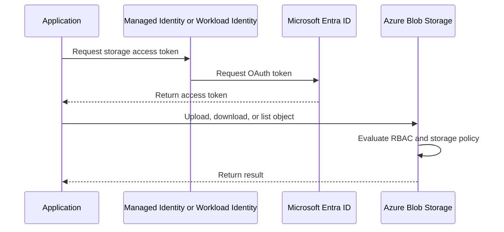

Typical application operations include:

- Upload blob
- Download blob
- List blobs
- Read metadata
- Set tags
- Copy blobs
- Delete blobs
- Move data between access tiers

---

## 10. Azure Files Mount Flow

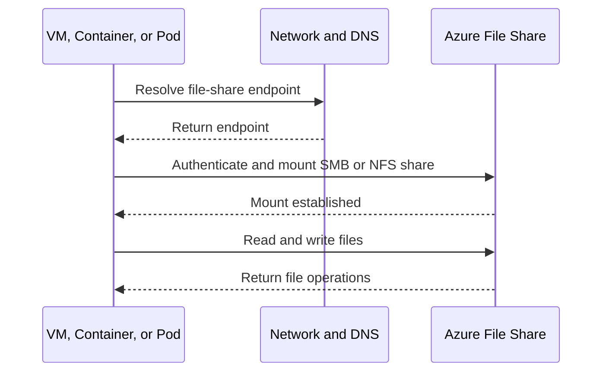

---

## 11. Blob Storage vs Azure Files Access Model

### Blob Storage

The application thinks in terms of:

```text
Container -> Object -> Metadata -> Content
```

Example code concept:

```text
Upload object to:
container = "images"
blob = "products/product-123.jpg"
```

### Azure Files

The application thinks in terms of:

```text
Share -> Directory -> File -> File operation
```

Example filesystem concept:

```text
/mnt/shared/products/product-123.jpg
```

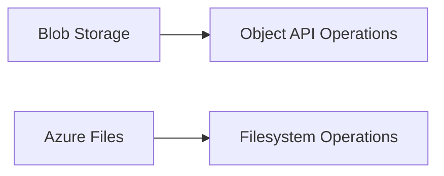

---

## 12. Blob Storage Use Cases

Choose Blob Storage for:

### User File Uploads

Examples:

- Profile images
- Product images
- Documents
- Videos
- Attachments

### Static Content

Examples:

- Website assets
- JavaScript bundles
- CSS
- Images
- Downloadable packages

### Backups and Archives

Examples:

- Database backups
- Application backups
- Disaster-recovery copies
- Long-term archives

### Logs and Telemetry

Examples:

- Application logs
- Audit files
- Exported metrics
- Diagnostic data

### Data Lake and Analytics

Examples:

- Raw data
- Parquet files
- CSV files
- JSON events
- Batch-processing inputs

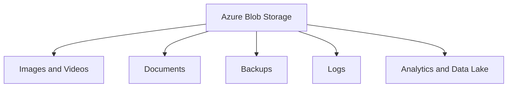

---

## 13. Azure Files Use Cases

Choose Azure Files for:

### Lift-and-Shift Applications

Applications that already expect:

- A Windows file share
- A Linux NFS path
- A shared directory
- File-based configuration
- File locking

### Shared Application Storage

Multiple VMs, containers, or Pods need to access the same files.

### User and Team Shares

Examples:

- Home directories
- Department file shares
- Shared project folders
- Collaboration files

### Stateful Containers

Applications need persistent shared files independent of the lifecycle of a container or Pod.

### Hybrid Applications

On-premises applications and Azure workloads need access to a common file share.

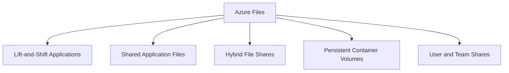

Azure Files is designed for mounted file-share scenarios and lift-and-shift applications that expect standard filesystem access. ([learn.microsoft.com](https://learn.microsoft.com/en-us/azure/storage/files/storage-files-introduction?utm_source=openai))

---

## 14. Blob Storage Access Tiers

Blob Storage supports access tiers designed for different access frequencies.

Common tiers include:

- Hot
- Cool
- Cold
- Archive

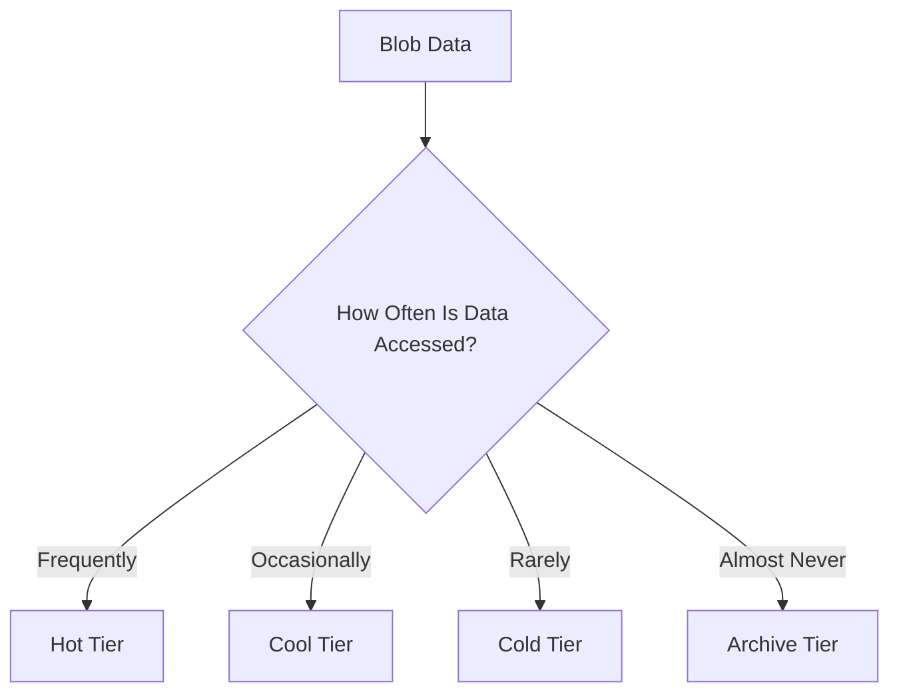

General cost model:

- Hot: higher storage cost, lower access cost
- Cool/cold: lower storage cost, higher access cost
- Archive: lowest storage cost, but retrieval is slower and has additional access considerations

Choose the tier based on actual data access patterns, retention, and recovery requirements. ([learn.microsoft.com](https://learn.microsoft.com/en-us/azure/storage/blobs/access-tiers-best-practices?utm_source=openai))

---

## 15. Azure Files Performance Tiers

Azure Files supports file-share performance options such as:

- HDD or standard file shares
- SSD or premium file shares

### HDD or Standard

Suitable for:

- General-purpose file shares
- Lower-cost shared storage
- Moderate performance requirements

### SSD or Premium

Suitable for:

- I/O-intensive workloads
- Low-latency applications
- Databases or application workloads requiring higher performance
- High-throughput file operations

Azure Files planning guidance identifies SSD and HDD tiers and recommends matching the tier to workload performance requirements. ([learn.microsoft.com](https://learn.microsoft.com/en-us/azure/storage/files/storage-files-planning?utm_source=openai))

---

## 16. Protocol Comparison

| Requirement | Blob Storage | Azure Files |
|---|---|---|
| HTTP/HTTPS object access | Yes | REST API available |
| SMB mount | No as the normal access model | Yes |
| NFS mount | Specialized supported scenarios | Yes |
| Native directory semantics | Object naming; hierarchical namespace available for ADLS scenarios | Yes |
| Browser downloads | Very suitable | Possible through APIs or controlled access |
| Existing file-server compatibility | Limited | Strong |
| Shared filesystem | Not the primary abstraction | Primary abstraction |
| Container volume | Via specific integration or API | Common PVC backing option |

Azure Files supports SMB and NFS, but an individual file share is not accessed through both protocols simultaneously. SMB supports Windows, Linux, and macOS clients, while NFS is for Linux workloads. ([learn.microsoft.com](https://learn.microsoft.com/en-us/azure/storage/files/files-nfs-protocol?utm_source=openai))

---

## 17. Blob Storage in AKS

In AKS, use Blob Storage when Pods need object operations.

Typical examples:

- Uploading user documents
- Reading images
- Writing backups
- Exporting reports
- Storing event payloads
- Processing data files

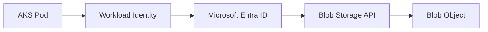

Recommended access pattern:

- Use Workload Identity
- Assign least-privilege Storage Blob Data roles
- Use the Azure Storage SDK
- Avoid account keys in application configuration
- Use private endpoints where required

---

## 18. Azure Files in AKS

Use Azure Files when Pods need a mounted shared filesystem.

Typical pattern:

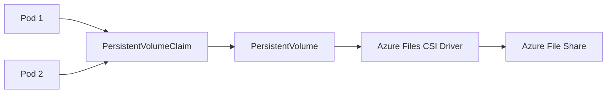

Common use cases:

- Shared uploads directory
- Shared configuration files
- Content-management application
- Legacy application expecting a filesystem
- Shared files across multiple replicas

Azure Files can be used as persistent storage for stateful containers, including workloads that need shared storage across instances. ([learn.microsoft.com](https://learn.microsoft.com/en-us/azure/storage/files/storage-files-introduction?utm_source=openai))

---

## 19. AKS Storage Decision Flow

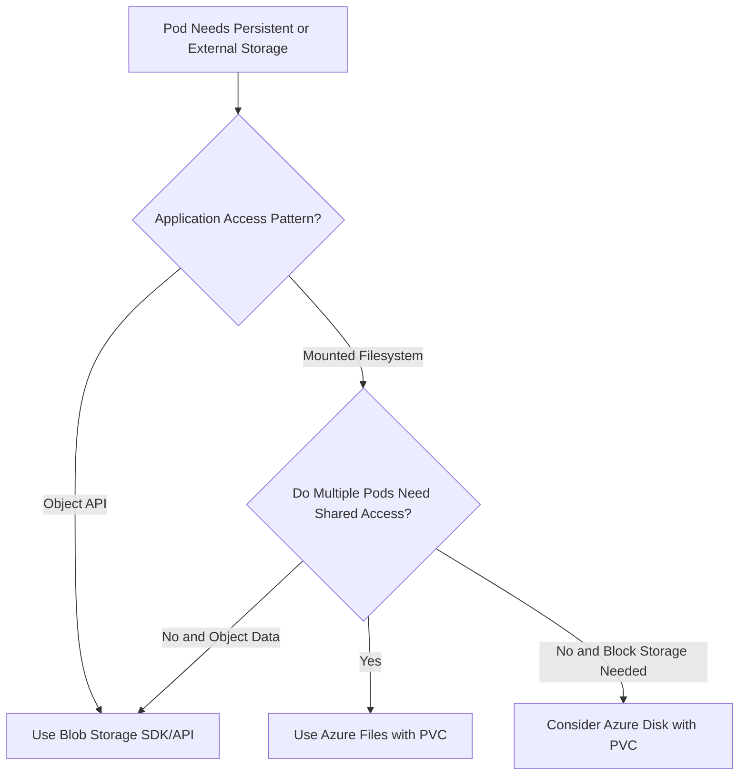

> **Interview phrase:**  
> For AKS, I choose Blob Storage for application-level object operations and Azure Files when the application requires a mounted shared filesystem.

---

## 20. Authentication and Authorization

### Blob Storage

Use:

- Managed identity
- Workload Identity
- Microsoft Entra ID
- Azure RBAC
- User delegation SAS when temporary delegated access is required

### Azure Files SMB

Use:

- Identity-based authentication where supported
- Storage account keys when required by the access pattern
- Microsoft Entra-based access control for suitable environments
- Network restrictions
- Private endpoints

### Azure Files NFS

NFS access relies more heavily on network controls and POSIX-style behavior. It does not provide the same user-based authentication model as SMB NFS shares, so private endpoints, service endpoints, and network restrictions are especially important. ([learn.microsoft.com](https://learn.microsoft.com/en-us/azure/storage/files/files-nfs-protocol?utm_source=openai))

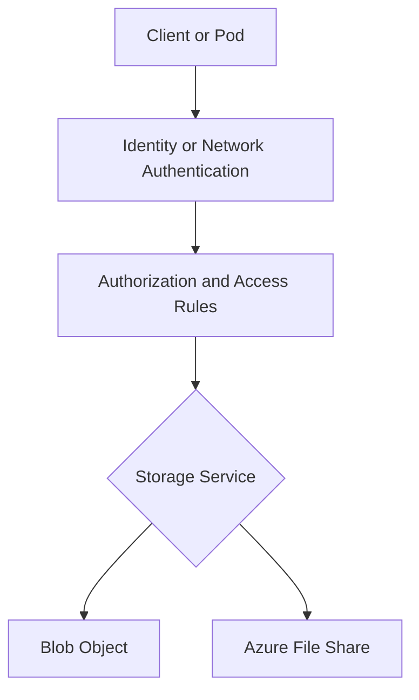

---

## 21. Security Best Practices

For both services:

- Use Microsoft Entra ID where supported
- Prefer managed identity or Workload Identity
- Apply least-privilege RBAC
- Avoid hardcoded account keys
- Use private endpoints for restricted environments
- Restrict public network access
- Enable encryption at rest
- Use TLS in transit
- Enable diagnostic logging
- Configure backup and recovery
- Review data access regularly

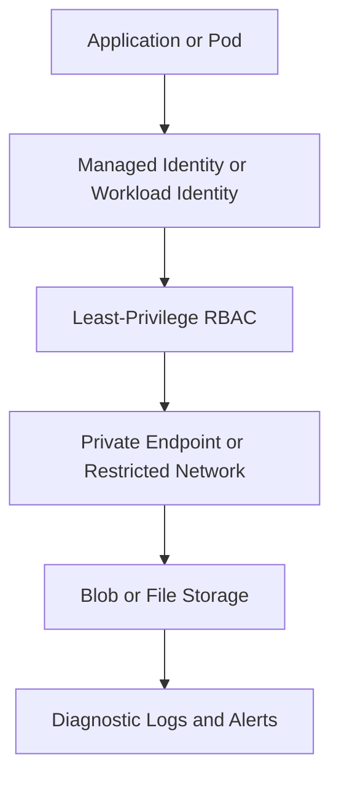

---

## 22. Network Access Comparison

### Blob Storage

Common options:

- Public endpoint with restricted access
- Private endpoint
- VNet integration from Azure workloads
- Storage firewall
- Service endpoints
- Private DNS

### Azure Files

Common options:

- Public endpoint with restrictions
- Private endpoint
- Service endpoint
- VPN or ExpressRoute for on-premises access
- SMB-specific network requirements
- NFS network restrictions

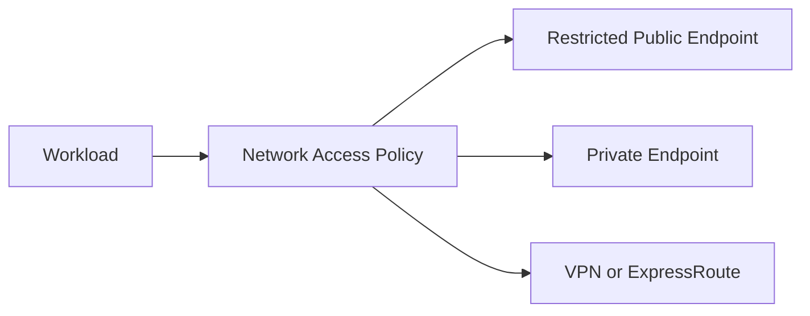

For SMB access from on-premises, private connectivity such as VPN or ExpressRoute may be required when the share is exposed through an internal network. ([learn.microsoft.com](https://learn.microsoft.com/en-us/azure/storage/files/storage-files-planning?utm_source=openai))

---

## 23. Consistency and Access Semantics

### Blob Storage

The application works with complete objects or object ranges.

Good for:

- Upload/download
- Object metadata
- Object versioning
- Data lifecycle
- Large independent files

### Azure Files

The application works with:

- File paths
- Directories
- File handles
- Shared access
- File locking
- Filesystem permissions

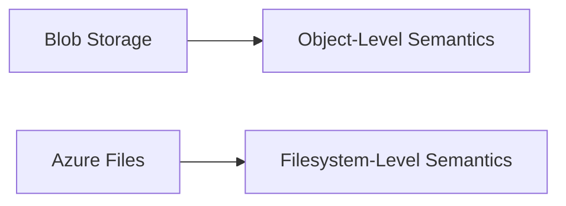

> **Interview distinction:**  
> Blob Storage is optimized for object-level access. Azure Files is optimized for filesystem-level access.

---

## 24. Performance Considerations

### Blob Storage Performance

Optimize by:

- Choosing the appropriate blob type
- Selecting the right access tier
- Using parallel uploads/downloads
- Using block blobs for large objects
- Avoiding excessive small-object operations
- Using CDN or edge caching for public content
- Partitioning workloads appropriately
- Monitoring throttling and request latency

### Azure Files Performance

Optimize by:

- Choosing SSD or HDD tier
- Selecting SMB or NFS appropriately
- Matching share size and provisioned throughput
- Reducing excessive metadata operations
- Avoiding chatty filesystem patterns over high-latency links
- Testing concurrent clients
- Monitoring IOPS, latency, and throughput

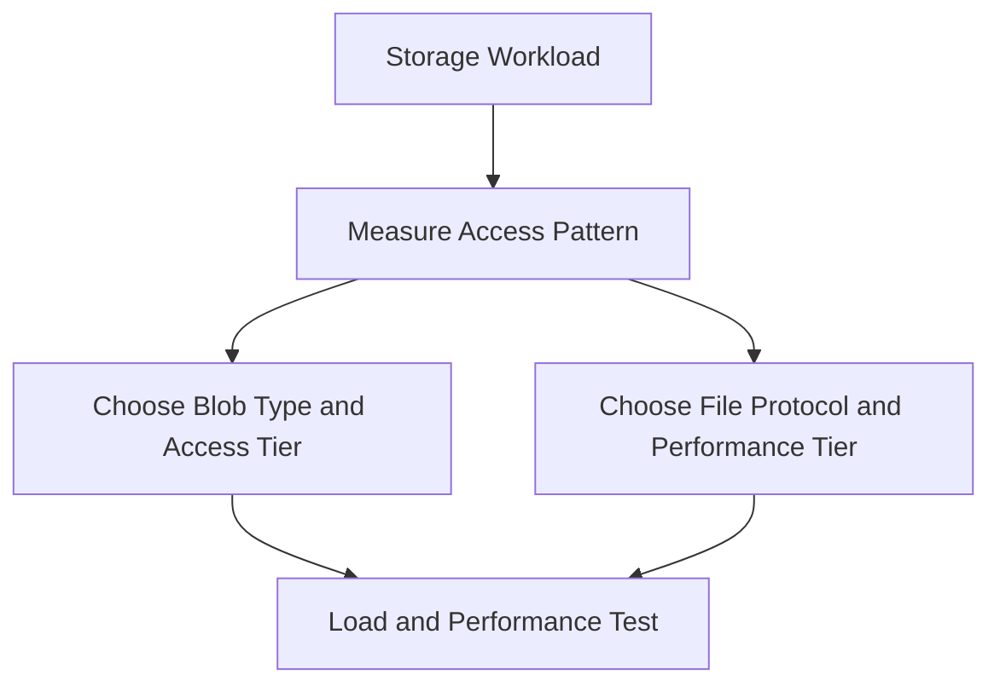

---

## 25. Reliability and Data Protection

For Blob Storage, consider:

- Soft delete
- Blob versioning
- Snapshots
- Lifecycle management
- Geo-redundancy
- Backup and restore
- Immutable storage where required

For Azure Files, consider:

- Share snapshots
- Soft delete
- Azure Backup where supported
- Redundancy options
- File Sync for hybrid scenarios
- Restore testing
- Data consistency during failover

```mermaid
flowchart TD
    Data["Stored Data"] --> Protection["Data Protection Strategy"]
    Protection --> Versioning["Versioning or Snapshots"]
    Protection --> Backup["Backup"]
    Protection --> Replication["Redundancy or Geo-Replication"]
    Protection --> Recovery["Restore and Recovery Testing"]
```

---

## 26. Cost Comparison

### Blob Storage Cost Drivers

- Data stored
- Access tier
- Read/write operations
- Data retrieval
- Replication
- Network egress
- Early deletion or retention considerations

### Azure Files Cost Drivers

- Provisioned or consumed capacity
- HDD versus SSD tier
- Transactions
- Redundancy
- Snapshots
- Network transfer
- Provisioned throughput and IOPS

```mermaid
flowchart TD
    Storage["Storage Cost"] --> Data["Capacity"]
    Storage --> Operations["Read and Write Operations"]
    Storage --> Network["Data Transfer"]
    Storage --> Redundancy["Replication"]
    Storage --> Performance["Performance Tier"]
```

> **Interview answer:**  
> Blob Storage is often more economical for massive object data and archival workloads. Azure Files may cost more for filesystem capabilities, shared access, and predictable file-share performance.

---

## 27. Migration Decision Flow

```mermaid
flowchart TD
    ExistingApp["Existing Application"] --> CurrentModel{"What does the application expect?"}

    CurrentModel -- "File Paths and Mounted Shares" --> Files["Migrate to Azure Files"]
    CurrentModel -- "Object or HTTP API" --> Blob["Migrate to Blob Storage"]
    CurrentModel -- "Can Be Refactored" --> Refactor["Evaluate Cost and Performance"]
    Refactor --> Choice{"Which Model Is Better?"}
    Choice -- "Object Operations" --> Blob
    Choice -- "Filesystem Operations" --> Files
```

### Lift-and-Shift

Azure Files is usually easier when the application already expects SMB or NFS.

### Cloud-Native Refactoring

Blob Storage is often better when the application can use object APIs and does not require filesystem semantics.

---

## 28. Scenario 1: Product Image Uploads

### Requirement

An e-commerce application allows users to upload product images.

### Recommended Choice

**Azure Blob Storage**

### Reasoning

- Images are independent objects
- The application can use SDK or HTTP APIs
- Images can be cached or served through a CDN
- Lifecycle policies can move old images to lower-cost tiers
- No shared filesystem is required

```mermaid
flowchart LR
    User["User"] --> API["Upload API"]
    API --> Blob["Blob Storage"]
    Blob --> CDN["Optional CDN or Edge Delivery"]
    CDN --> Browser["Browser"]
```

---

## 29. Scenario 2: Legacy Windows Application

### Requirement

A legacy Windows application expects a shared drive such as:

```text
\\server\shared-data
```

### Recommended Choice

**Azure Files with SMB**

### Reasoning

- The application expects file-share semantics
- Minimal code changes are preferred
- Multiple application servers need shared access
- SMB is a familiar protocol for Windows applications

```mermaid
flowchart LR
    App1["Windows Application Server 1"] --> SMB["SMB"]
    App2["Windows Application Server 2"] --> SMB
    SMB --> Files["Azure File Share"]
```

---

## 30. Scenario 3: AKS Shared Upload Directory

### Requirement

Several Pods need access to the same uploaded files through a mounted directory.

### Recommended Choice

**Azure Files with a PersistentVolumeClaim**

### Reasoning

- Pods need shared filesystem access
- Data should survive Pod recreation
- Multiple replicas need to read and write the same files
- A file-share volume is more appropriate than local Pod storage

```mermaid
flowchart TB
    Pod1["Application Pod 1"] --> PVC["Shared PVC"]
    Pod2["Application Pod 2"] --> PVC
    Pod3["Application Pod 3"] --> PVC
    PVC --> AzureFiles["Azure Files"]
```

---

## 31. Scenario 4: Backup and Archive

### Requirement

Store database backups for long-term retention.

### Recommended Choice

**Azure Blob Storage**

### Reasoning

- Backups are large independent objects
- Access is typically API or file-transfer based
- Lifecycle policies can reduce storage cost
- Archive or cold tiers may be appropriate
- Object versioning and retention controls can improve recovery

```mermaid
flowchart LR
    Database["Database"] --> Backup["Backup Job"]
    Backup --> Blob["Blob Storage"]
    Blob --> Lifecycle["Lifecycle Management"]
    Lifecycle --> Archive["Cold or Archive Tier"]
```

---

## 32. Scenario 5: Shared Linux Application Data

### Requirement

Several Linux services require POSIX-style shared file access.

### Recommended Choice

**Azure Files with NFS**, if the required features and regional availability fit the workload.

### Reasoning

- The application expects mounted filesystem semantics
- Linux/POSIX behavior is required
- Multiple clients need shared access
- Network controls and NFS limitations must be evaluated

Azure Files NFS shares are Linux-oriented and use network-based access controls rather than the same identity-based model used by SMB. ([learn.microsoft.com](https://learn.microsoft.com/en-us/azure/storage/files/files-nfs-protocol?utm_source=openai))

---

## 33. Blob Storage vs File Share in AKS

| AKS Requirement | Recommended Option |
|---|---|
| Upload images through an API | Blob Storage |
| Store user documents as objects | Blob Storage |
| Mount a shared directory into multiple Pods | Azure Files |
| Persistent shared application files | Azure Files |
| Large backups and archives | Blob Storage |
| Data lake and analytics files | Blob Storage or ADLS Gen2 |
| Legacy application expects SMB | Azure Files SMB |
| Linux application requires NFS | Azure Files NFS |
| Single Pod needs block storage | Consider Azure Disk |
| Static website assets | Blob Storage |
| Cross-service object exchange | Blob Storage |
| Shared configuration files | Azure Files, with careful update controls |

---

## 34. Common Interview Mistakes

1. Saying Blob Storage and Azure Files are interchangeable
2. Calling Blob Storage a traditional filesystem
3. Using Azure Files for every object-storage workload
4. Using Blob Storage when an application requires SMB or NFS
5. Ignoring access semantics and file locking
6. Ignoring AKS PVC and CSI driver requirements
7. Treating account keys as the preferred authentication method
8. Forgetting Blob access tiers
9. Ignoring Azure Files performance tiers
10. Assuming all Azure Files shares support both SMB and NFS simultaneously
11. Ignoring private endpoints and DNS
12. Not considering egress and transaction costs
13. Forgetting backup, replication, and restore testing
14. Storing application state in a container's local filesystem
15. Ignoring the difference between shared files and independent objects

---

## 35. Interview Questions and Strong Answers

### Q1: What is the main difference between Blob Storage and Azure Files?

**Answer:** Blob Storage is object storage accessed through APIs and HTTP-based operations. Azure Files is managed file-share storage accessed using SMB, NFS, REST APIs, or SDKs.

### Q2: When would you choose Blob Storage?

**Answer:** I choose Blob Storage for images, documents, videos, backups, logs, archives, and analytics data where objects are accessed independently through APIs.

### Q3: When would you choose Azure Files?

**Answer:** I choose Azure Files when an application needs a mounted shared filesystem, SMB or NFS compatibility, directory semantics, file locking, or minimal changes to a legacy file-based application.

### Q4: Can Azure Blob Storage be mounted as a filesystem?

**Answer:** Blob Storage is primarily object storage and is normally accessed through APIs or SDKs. Some specialized filesystem or protocol integrations exist, but they have different semantics and should be evaluated carefully. If the application fundamentally needs a shared filesystem, Azure Files is usually the more direct choice.

### Q5: Which service is better for AKS shared persistent storage?

**Answer:** Azure Files is usually appropriate when multiple Pods need shared file access. Blob Storage is better when Pods upload and download objects through an SDK or API.

### Q6: What is the difference between Azure Files SMB and NFS?

**Answer:** SMB is commonly used for Windows, Linux, and macOS file-share scenarios and supports identity-based access patterns. NFS is commonly used for Linux and POSIX-style workloads and relies more heavily on network controls.

### Q7: Which service is better for backups?

**Answer:** Blob Storage is usually better for backups because it is optimized for large objects, lifecycle management, archival tiers, and API-based access.

### Q8: Which service is better for a legacy Windows application?

**Answer:** Azure Files using SMB is usually better because it provides a familiar shared-file protocol and can reduce application changes.

### Q9: How do you secure Blob Storage access?

**Answer:** Use managed identity or Workload Identity, Microsoft Entra ID, least-privilege RBAC, private endpoints, storage firewall rules, encryption, and diagnostic logging.

### Q10: How do you secure Azure Files?

**Answer:** Use identity-based access for supported SMB scenarios, private endpoints, network restrictions, secure SMB settings, encryption, RBAC where applicable, and controlled storage-account credentials when identity-based access is not available.

### Q11: Can multiple Pods mount the same Azure File share?

**Answer:** Yes, Azure Files can support shared file access, subject to the selected protocol, access mode, CSI configuration, application behavior, and performance requirements.

### Q12: Which is more cost-effective?

**Answer:** It depends on the access pattern. Blob Storage is often cost-effective for large object data and archival workloads. Azure Files includes filesystem and shared-access capabilities, so cost should be evaluated against performance, capacity, transaction, and redundancy requirements.

---

## 36. 60-Second Interview Pitch

> Blob Storage and Azure Files use different storage abstractions. Blob Storage is object storage, so I use it for images, documents, videos, backups, logs, and data-lake workloads accessed through REST APIs or SDKs. Azure Files is a managed shared filesystem accessed through SMB or NFS, so I use it for legacy applications, shared directories, lift-and-shift workloads, and AKS Pods that need a mounted persistent volume. In AKS, I use Blob Storage through Workload Identity and the Storage SDK for object operations, while Azure Files is normally integrated through the Azure Files CSI driver and a PersistentVolumeClaim. The decision is based on access semantics, protocol, concurrency, performance, security, cost, and operational requirements.

---

## 37. Final Revision Checklist

Choose **Blob Storage** when:

- [ ] Data is naturally represented as independent objects
- [ ] Applications can use SDKs or REST APIs
- [ ] You store images, documents, videos, or backups
- [ ] You need lifecycle tiers such as hot, cool, cold, or archive
- [ ] You need large-scale unstructured storage
- [ ] You need data-lake or analytics integration
- [ ] You want HTTP-based access

Choose **Azure Files** when:

- [ ] Applications require a mounted filesystem
- [ ] SMB or NFS is required
- [ ] Multiple clients need shared file access
- [ ] A legacy application expects file paths
- [ ] Directory and file semantics are important
- [ ] AKS Pods need a shared persistent volume
- [ ] File locking or POSIX-style behavior is required

For production:

- [ ] Use identity-based access where supported
- [ ] Avoid hardcoded storage keys
- [ ] Use private endpoints for sensitive workloads
- [ ] Configure private DNS correctly
- [ ] Select appropriate redundancy
- [ ] Choose the right performance tier
- [ ] Configure backup and recovery
- [ ] Monitor latency, errors, throttling, and capacity
- [ ] Test restore and failover procedures

---

## One-Line Conclusion

> Use **Azure Blob Storage** for scalable object-based data accessed through APIs, and use **Azure Files** for managed shared filesystems accessed through SMB or NFS.