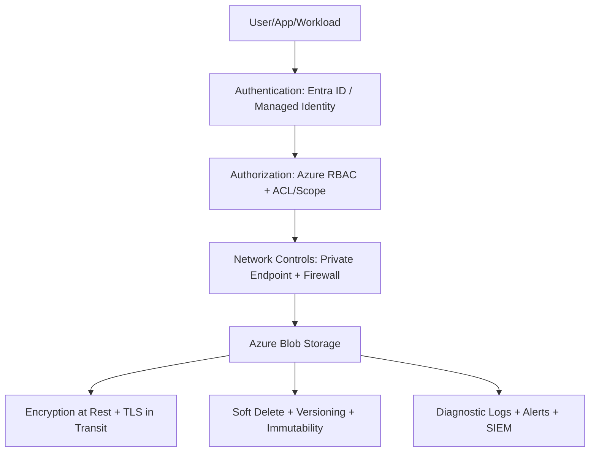
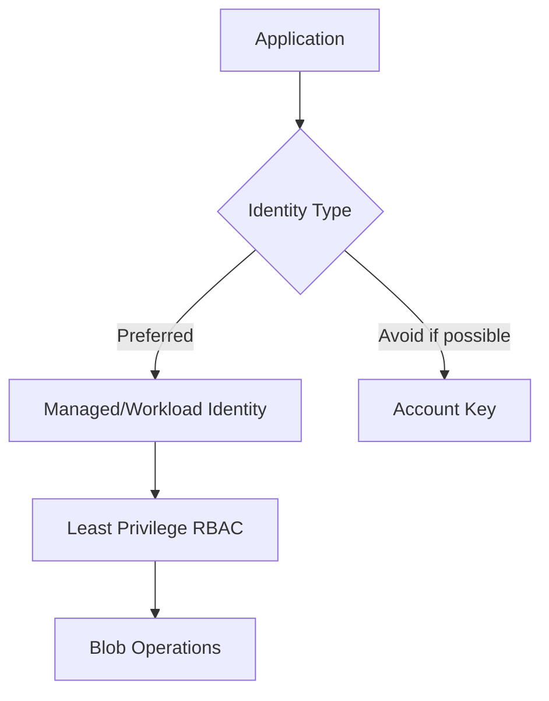
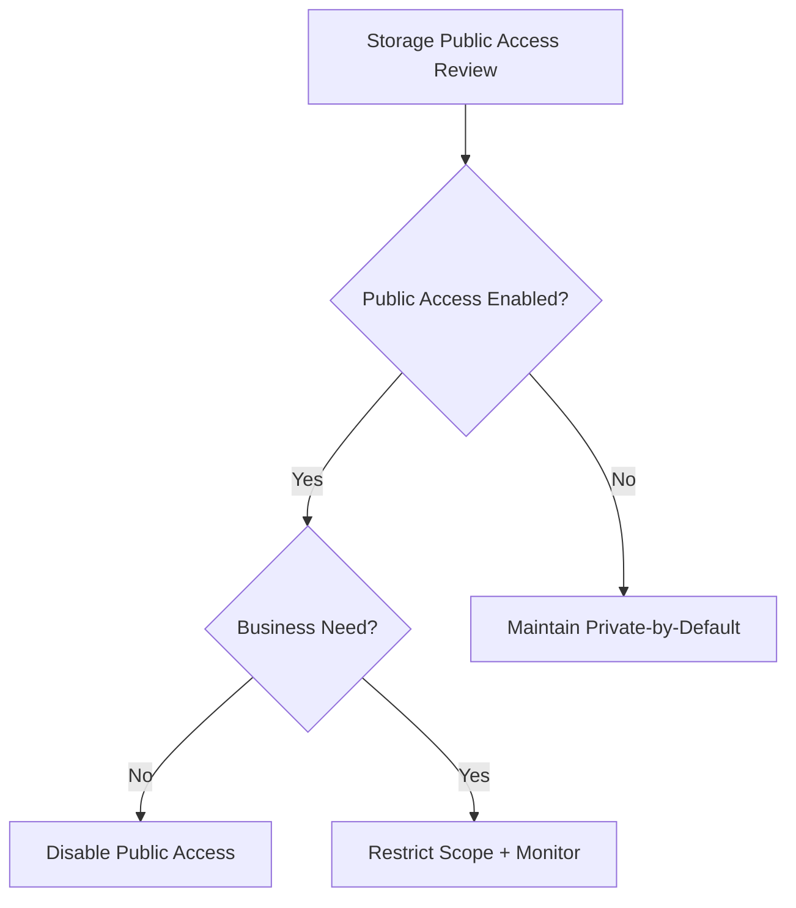
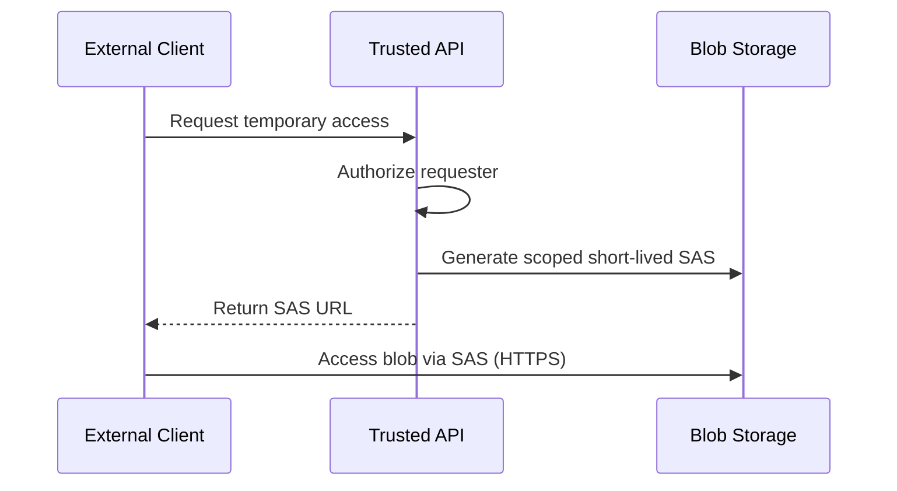
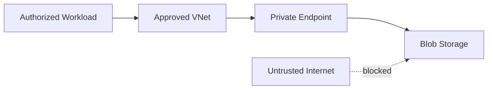
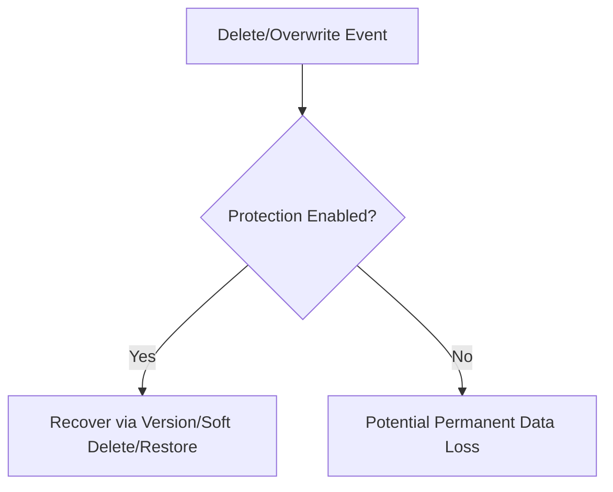
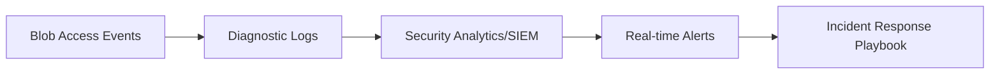
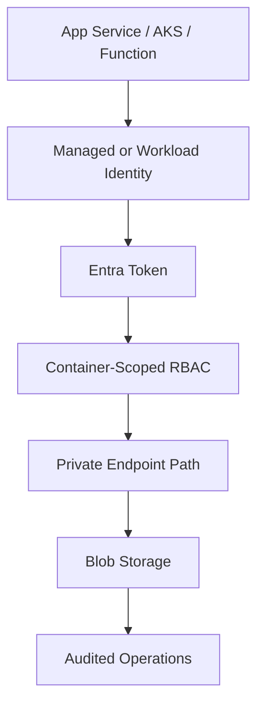

# How Do You Secure Azure Blob Storage?
## Detailed Interview Preparation Guide with Flow Charts (Static Site Ready)

---

## 1) Direct Interview Answer

Secure Azure Blob Storage with **defense in depth** across identity, network, encryption, data protection, monitoring, and governance.

Core controls:

1. Enforce identity-based access (Microsoft Entra ID + RBAC)
2. Disable anonymous/public blob access unless explicitly required
3. Minimize shared key usage; prefer managed/workload identities
4. Restrict network access (private endpoints, firewall, trusted paths)
5. Encrypt data at rest and in transit
6. Use short-lived, least-privilege SAS when delegation is needed
7. Enable soft delete, versioning, and immutable policies for recovery/protection
8. Monitor logs/alerts continuously and apply policy guardrails

> One-liner: *Use Entra ID + least privilege RBAC + private networking + encryption + data protection + monitoring.*

---

## 2) Security Architecture Overview

---

## 3) Threat Model (What You’re Defending Against)

Common risks:

- Public exposure of sensitive containers/blobs
- Credential leakage (account keys/SAS tokens)
- Overprivileged access assignments
- Data exfiltration via unrestricted network paths
- Ransomware/accidental deletion/overwrite
- Lack of audit visibility

Goal: ensure only approved identities from approved networks perform approved actions, with full traceability and recovery.

---

## 4) Identity & Access Security (Most Important)

## 4.1 Prefer Entra ID + Azure RBAC
- Use user/service/workload identities
- Assign least-privilege roles at narrow scope (container over account when possible)
- Separate read/write/admin duties

## 4.2 Avoid Shared Keys for App Access
- Shared keys are broad and risky
- If unavoidable, store in secret manager and rotate aggressively

## 4.3 Use Managed Identity / Workload Identity
- No embedded credentials in code
- Better rotation and lifecycle control

---

## 5) Authorization Strategy

Use least-privilege built-in roles such as:

- Storage Blob Data Reader
- Storage Blob Data Contributor
- Storage Blob Data Owner (sparingly)

Best practice:
- Scope permissions to container/resource group minimally required
- Use separate identities per app/service boundary
- Time-bound privileged elevation where possible

---

## 6) Public Access Hardening

- Disable storage account public access when not needed
- Disable anonymous blob/container access
- Review containers for accidental public ACL exposure
- Periodically audit effective public exposure

---

## 7) Secure Delegation with SAS (When Needed)

Use SAS only for controlled temporary delegation:

- Short expiry
- Minimal permissions (read only, etc.)
- IP restrictions where practical
- HTTPS-only enforcement
- Avoid long-lived account-level SAS tokens

---

## 8) Network Security Controls

## 8.1 Private Endpoints (Preferred for sensitive workloads)
- Keep traffic on private network path
- Pair with private DNS

## 8.2 Storage Firewall Rules
- Restrict to selected VNets/IP ranges
- Deny by default

## 8.3 Disable broad public network exposure
- Permit only required ingress paths

---

## 9) Encryption and Data Confidentiality

## 9.1 Encryption at Rest
- Enabled by default (service-managed keys)
- Use customer-managed keys (CMK) when compliance requires key ownership/control

## 9.2 Encryption in Transit
- Enforce HTTPS/TLS
- Disable insecure transport paths

## 9.3 Key Management
- Centralized key lifecycle policies
- Rotation and revocation procedures

---

## 10) Data Protection & Recovery Controls

Enable:

- Soft delete (blob + container)
- Blob versioning
- Point-in-time restore (where applicable)
- Change feed (if needed for forensic/operational tracking)
- Immutable storage policies (WORM/legal hold/time-based retention)

---

## 11) Ransomware/Integrity Defense

- Immutability for critical backup/legal records
- Separate write/read identities
- Minimize delete permissions
- Alert on unusual mass delete/write behavior
- Backup strategy isolated from primary access plane

---

## 12) Logging, Monitoring, and Alerting

Collect and monitor:

- Authentication failures (401/403)
- SAS usage anomalies
- Unexpected geo/IP access patterns
- Bulk deletes/overwrites
- Privilege changes/RBAC modifications
- Public access configuration drift

Send diagnostics to SIEM and define actionable alerts.

---

## 13) Governance & Policy Enforcement

Apply governance with:

- Azure Policy to enforce secure defaults
- Naming/tagging/classification standards
- Mandatory diagnostics settings
- Baseline blueprints for storage accounts
- Periodic access review and entitlement cleanup

Examples of policy intent:
- Require secure transfer
- Deny public network access for sensitive tiers
- Require private endpoints in regulated subscriptions

---

## 14) Secure Configuration Baseline Checklist

- [ ] Entra ID + RBAC as primary auth model
- [ ] Shared key access disabled/restricted if feasible
- [ ] Public access disabled unless documented exception
- [ ] Private endpoint + firewall allowlist
- [ ] HTTPS enforced
- [ ] Soft delete + versioning enabled
- [ ] Immutability configured for critical data
- [ ] Diagnostic logs + alerting enabled
- [ ] Periodic key/SAS/access review in place

---

## 15) Common Security Mistakes (Interview Gold)

1. Using account keys in app config/source code  
2. Long-lived SAS tokens with broad permissions  
3. Public container enabled by accident  
4. Contributor-level roles assigned too broadly  
5. No recovery controls (soft delete/versioning off)  
6. No private network restrictions for sensitive storage  
7. Missing audit logs and anomaly alerts  

---

## 16) Secure Access Pattern for Applications

Preferred app pattern:

1. App uses managed/workload identity
2. Gets token via Entra ID
3. Accesses only required container scope
4. Storage account reachable via private endpoint
5. Operations logged and monitored

---

## 17) Interview Q&A (Strong Answers)

### Q1: What is the first thing you do to secure Blob Storage?
**Answer:** Enforce identity-based access with Entra ID and least-privilege RBAC; avoid shared keys by default.

### Q2: How do you prevent accidental public exposure?
**Answer:** Disable public/anonymous access at account and container levels, enforce with policy, and continuously audit.

### Q3: When is SAS appropriate?
**Answer:** For temporary delegated access; keep it short-lived, minimal permissions, HTTPS-only, and optionally IP-restricted.

### Q4: How do you secure network access?
**Answer:** Use private endpoints, storage firewalls, approved VNets/IP allowlists, and deny-by-default public access for sensitive data.

### Q5: How do you protect from accidental deletion/ransomware?
**Answer:** Enable soft delete, versioning, immutable retention for critical datasets, and alert on mass delete patterns.

### Q6: How do you prove security controls are working?
**Answer:** Centralized diagnostics, SIEM alerts, periodic access reviews, policy compliance reports, and incident-response drills.

---

## 18) 60-Second Interview Pitch

> I secure Azure Blob Storage with a zero-trust layered model: identity first, network second, data protection always. I use Microsoft Entra ID with least-privilege RBAC and prefer managed/workload identities over shared keys. I disable anonymous/public access by default and expose storage through private endpoints plus firewall allowlists. I enforce encryption in transit and at rest, and for critical data I enable soft delete, versioning, and immutable retention policies to defend against accidental deletion or ransomware. Finally, I enable full diagnostics and SIEM alerting for suspicious access, failed authentication, and mass data operations, then enforce standards with policy so secure settings remain consistent at scale.

---

## 19) One-Line Conclusion

> Secure Blob Storage by combining identity-based least-privilege access, private network boundaries, strong encryption, recoverability controls, and continuous monitoring/governance.