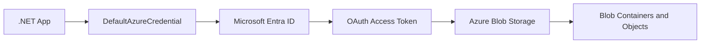
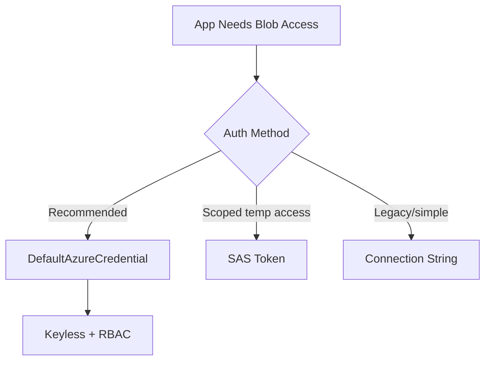
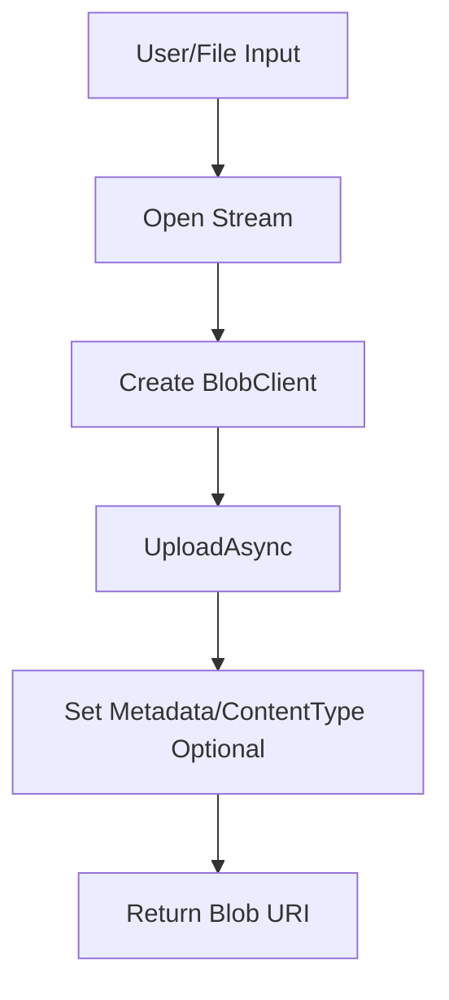
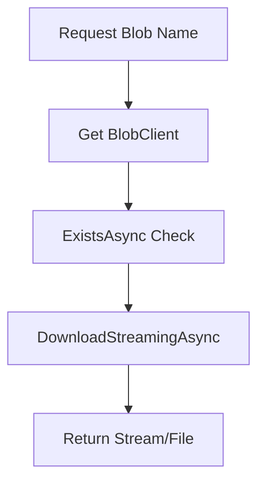
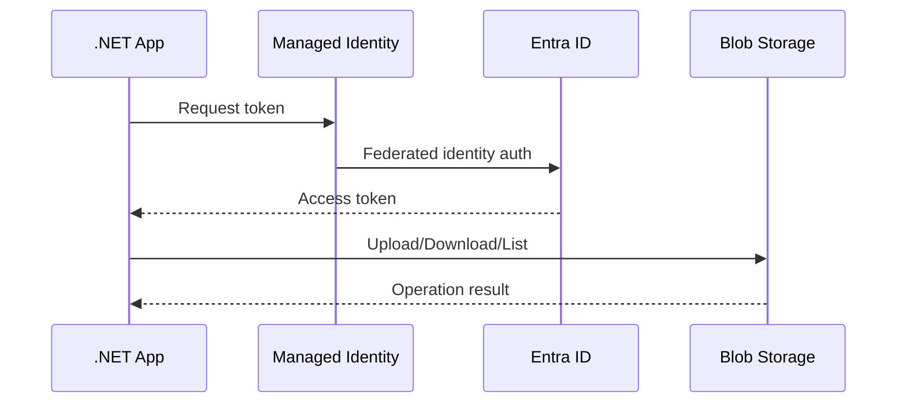
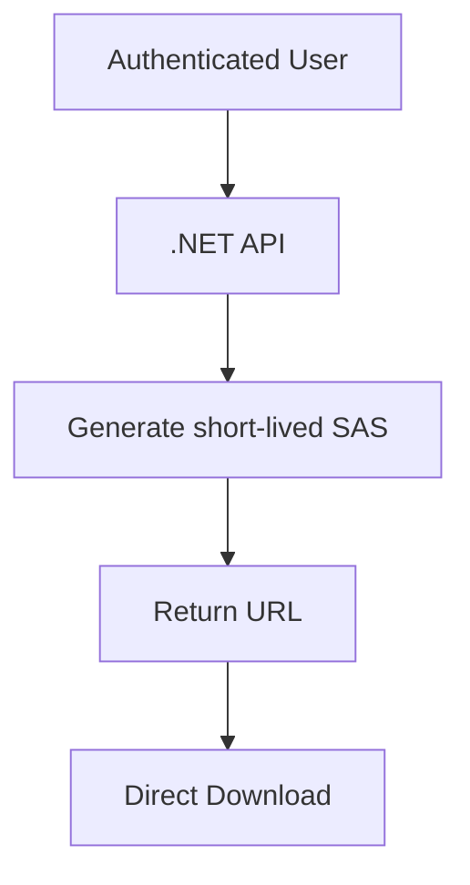

# How Does a .NET Application Access Azure Blob Storage?
## Detailed Interview Preparation Guide with Flow Charts (Static Site Ready)

---

## 1) Direct Interview Answer

A .NET app typically accesses Azure Blob Storage using the **Azure.Storage.Blobs SDK** and **Microsoft Entra ID / Managed Identity** (preferred) via `DefaultAzureCredential`.

High-level steps:

1. Add Blob SDK packages
2. Configure endpoint + authentication
3. Create `BlobServiceClient`
4. Get container and blob client
5. Perform upload/download/list/delete operations
6. Handle errors/retries and secure access

> One-liner: *Use `BlobServiceClient` with `DefaultAzureCredential` for secure, keyless, production-ready Blob access in .NET.*

---

## 2) Access Architecture Flow



---

## 3) Authentication Options (Interview Important)

## Preferred: `DefaultAzureCredential` (Production Best Practice)
- Local dev: VS/Azure CLI identity
- Azure hosting: Managed Identity
- No hardcoded secrets

## Alternatives:
- Connection string (quick start/legacy)
- SAS token (scoped temporary access)
- Shared key (least preferred in production)



---

## 4) NuGet Packages

Install:

- `Azure.Storage.Blobs`
- `Azure.Identity`

Example commands:

```bash
dotnet add package Azure.Storage.Blobs
dotnet add package Azure.Identity
```

---

## 5) Minimal .NET Setup (Identity-Based)

```csharp name=Program.cs
using Azure.Identity;
using Azure.Storage.Blobs;

var blobServiceClient = new BlobServiceClient(
    new Uri("https://<storage-account-name>.blob.core.windows.net"),
    new DefaultAzureCredential());

// container client
var containerClient = blobServiceClient.GetBlobContainerClient("documents");
await containerClient.CreateIfNotExistsAsync();
```

---

## 6) Upload File Flow



```csharp name=UploadExample.cs
using Azure.Storage.Blobs;
using Azure.Storage.Blobs.Models;

public async Task<string> UploadAsync(
    BlobContainerClient containerClient,
    string blobName,
    Stream content,
    string contentType)
{
    var blobClient = containerClient.GetBlobClient(blobName);

    var options = new BlobUploadOptions
    {
        HttpHeaders = new BlobHttpHeaders { ContentType = contentType }
    };

    await blobClient.UploadAsync(content, options);
    return blobClient.Uri.ToString();
}
```

---

## 7) Download File Flow



```csharp name=DownloadExample.cs
using Azure.Storage.Blobs;

public async Task<Stream?> DownloadAsync(BlobContainerClient containerClient, string blobName)
{
    var blobClient = containerClient.GetBlobClient(blobName);

    if (!await blobClient.ExistsAsync())
        return null;

    var response = await blobClient.DownloadStreamingAsync();
    return response.Value.Content;
}
```

---

## 8) List Blobs Example

```csharp name=ListExample.cs
using Azure.Storage.Blobs;

public async Task<List<string>> ListBlobNamesAsync(BlobContainerClient containerClient, string? prefix = null)
{
    var results = new List<string>();

    await foreach (var blobItem in containerClient.GetBlobsAsync(prefix: prefix))
    {
        results.Add(blobItem.Name);
    }

    return results;
}
```

---

## 9) Delete Blob Example

```csharp name=DeleteExample.cs
using Azure.Storage.Blobs;

public async Task<bool> DeleteIfExistsAsync(BlobContainerClient containerClient, string blobName)
{
    var blobClient = containerClient.GetBlobClient(blobName);
    var response = await blobClient.DeleteIfExistsAsync();
    return response.Value;
}
```

---

## 10) ASP.NET Core Service Pattern (Recommended)

```csharp name=BlobStorageService.cs
using Azure.Identity;
using Azure.Storage.Blobs;

public class BlobStorageService
{
    private readonly BlobContainerClient _containerClient;

    public BlobStorageService(IConfiguration config)
    {
        var accountName = config["Storage:AccountName"];
        var containerName = config["Storage:ContainerName"];

        var serviceClient = new BlobServiceClient(
            new Uri($"https://{accountName}.blob.core.windows.net"),
            new DefaultAzureCredential());

        _containerClient = serviceClient.GetBlobContainerClient(containerName);
    }

    public async Task EnsureContainerAsync() =>
        await _containerClient.CreateIfNotExistsAsync();

    public async Task<string> UploadAsync(string blobName, Stream stream, string contentType)
    {
        var blobClient = _containerClient.GetBlobClient(blobName);
        await blobClient.UploadAsync(stream, overwrite: true);
        return blobClient.Uri.ToString();
    }
}
```

Register service in DI and reuse singleton-style clients for efficiency.

---

## 11) Configuration Example

```json name=appsettings.json
{
  "Storage": {
    "AccountName": "mystorageaccount",
    "ContainerName": "documents"
  }
}
```

For local development with connection string fallback:

```json name=appsettings.Development.json
{
  "Storage": {
    "ConnectionString": "UseDevelopmentStorage=true"
  }
}
```

---

## 12) Managed Identity in Azure Hosting

When hosted on:

- Azure App Service
- Azure Functions
- AKS
- Azure VM

Enable Managed Identity and grant storage RBAC role (e.g., Blob Data Contributor at least privilege scope). Then `DefaultAzureCredential` works without secrets.



---

## 13) Role Assignments (Authorization)

Typical RBAC roles:

- Storage Blob Data Reader
- Storage Blob Data Contributor
- Storage Blob Data Owner

Use minimum required permission and narrow scope (container if possible).

---

## 14) Large File Upload Best Practices

- Stream instead of buffering full file in memory
- Use async APIs
- Validate size/content type
- Set transfer options if needed
- Consider resumable/chunked patterns for very large files
- Add cancellation tokens/timeouts

---

## 15) Reliability & Retry

Use SDK retry settings and app-level resilience:

- Exponential backoff
- Handle transient HTTP 429/5xx
- Idempotent upload naming strategy
- Correlation IDs and logs

---

## 16) Secure Download Pattern (SAS for Client Direct Access)

If browser/mobile should download directly:
1. App authenticates caller
2. App creates short-lived SAS URL
3. Client downloads directly from Blob



---

## 17) Common Mistakes (Interview Gold)

1. Hardcoding account keys in source code  
2. Creating Blob clients per request instead of reusing  
3. Not setting content type metadata  
4. Downloading large blobs into memory unnecessarily  
5. Overprivileged RBAC roles  
6. No retry/timeout handling  
7. Ignoring private networking/security controls  

---

## 18) Troubleshooting Quick Guide

- **401/403**: identity exists but RBAC missing/wrong scope
- **404**: wrong container/blob name
- **409**: conflict during create/upload state
- **429/503**: throttling/transient service pressure -> retry with backoff
- **Timeout**: network path/private endpoint/DNS issues

---

## 19) Interview Q&A (Strong Answers)

### Q1: What library does .NET use for Blob Storage?
**Answer:** `Azure.Storage.Blobs` (modern Azure SDK).

### Q2: Preferred auth method?
**Answer:** `DefaultAzureCredential` with Managed Identity/Entra ID and RBAC.

### Q3: How do you upload securely?
**Answer:** Use identity-based auth, stream upload, validate inputs, least privilege RBAC.

### Q4: How do you let users download directly?
**Answer:** Generate short-lived SAS URL after app-level authorization.

### Q5: What’s the difference between authentication and authorization here?
**Answer:** Entra token proves identity (authN); RBAC role grants operations (authZ).

### Q6: How do you improve performance for large files?
**Answer:** Stream I/O, async operations, transfer tuning, and avoid full memory buffering.

---

## 20) 60-Second Interview Pitch

> In .NET, I access Azure Blob Storage using the `Azure.Storage.Blobs` SDK with `DefaultAzureCredential`, which lets me use local developer identity and Managed Identity in Azure without hardcoded secrets. I create a `BlobServiceClient`, then `BlobContainerClient` and `BlobClient` for operations like upload, download, list, and delete. I assign least-privilege RBAC roles (such as Blob Data Reader/Contributor), use async streaming for large files, and implement retries for transient failures. For end-user direct access, I issue short-lived SAS URLs from a secured API. This gives secure, scalable, and production-ready Blob integration.

---

## 21) Final Checklist

- [ ] Installed `Azure.Storage.Blobs` and `Azure.Identity`
- [ ] Using `DefaultAzureCredential`
- [ ] Managed Identity enabled (cloud hosting)
- [ ] RBAC assigned least privilege
- [ ] Blob clients reused (DI/singleton)
- [ ] Upload/download uses streaming async
- [ ] Retry and timeout configured
- [ ] Logging/telemetry included
- [ ] Optional SAS flow for direct client access secured

---

## One-Line Conclusion

> A .NET application accesses Azure Blob Storage by using `BlobServiceClient` from `Azure.Storage.Blobs`, authenticated via `DefaultAzureCredential` and authorized with least-privilege Azure RBAC.