# What Are Azure Storage Account Types?
## Detailed Interview Preparation Guide with Flow Charts

---

## 1. Direct Interview Answer

Azure Storage account types define the kind of storage workloads an account supports, its performance model, supported redundancy options, available features, and pricing behavior.

The main account types are:

1. **Standard general-purpose v2**
2. **Premium block blobs**
3. **Premium file shares**
4. **Premium page blobs**
5. **Legacy standard general-purpose v1**
6. **Legacy Blob Storage**

For most new Azure solutions, choose **Standard general-purpose v2** unless the workload has a specific high-performance requirement for block blobs, file shares, or page blobs.

> **One-line interview answer:**  
> **Azure Storage account types are specialized account configurations for general-purpose storage, premium blobs, premium file shares, premium page blobs, and legacy workloads; Standard general-purpose v2 is the default choice for most new applications.**

---

## 2. Storage Account Type Decision Flow

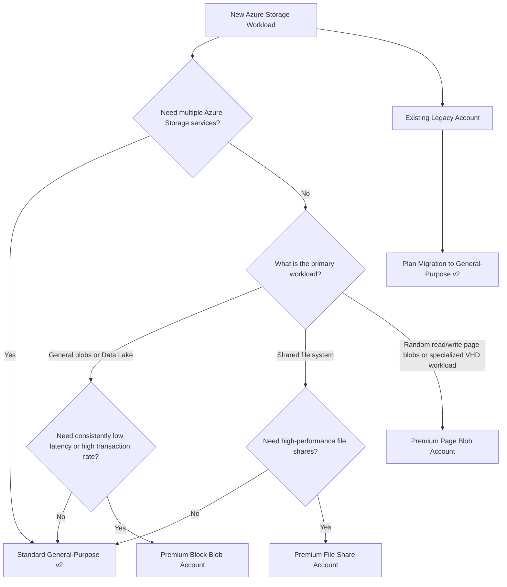

---

## 3. Quick Comparison Table

| Storage Account Type | Azure Resource Kind | Main Workload | Performance | Supported Services | Typical Recommendation |
|---|---|---|---|---|---|
| Standard general-purpose v2 | `StorageV2` | General-purpose storage | Standard | Blobs, Files, Queues, Tables, ADLS Gen2 capabilities | Recommended default |
| Premium block blobs | `BlockBlobStorage` | High-performance block and append blobs | Premium | Blob Storage | Specialized workloads |
| Premium file shares | `FileStorage` | High-performance file shares | Premium | Azure Files | Low-latency or high-IOPS file shares |
| Premium page blobs | `StorageV2` with Premium | Page blobs and specialized random I/O | Premium | Page Blobs | Specialized VHD/page-blob workloads |
| Standard general-purpose v1 | `Storage` | Older general-purpose workloads | Standard | Blobs, Files, Queues, Tables | Legacy; migrate where practical |
| Legacy Blob Storage | `BlobStorage` | Older Blob-only workloads | Standard | Blob Storage | Legacy; migrate to GPv2 |

The supported services and redundancy options vary by account type and Azure region. ([learn.microsoft.com](https://learn.microsoft.com/en-us/azure/storage/common/storage-account-create?utm_source=openai))

---

# 4. Standard General-Purpose v2

## 4.1 What Is It?

A **Standard general-purpose v2** account is the standard, flexible Azure Storage account type for most new applications.

Its resource kind is:

```text
StorageV2
```

It can support:

- Blob Storage
- Azure Files
- Queue Storage
- Table Storage
- Azure Data Lake Storage Gen2 capabilities when hierarchical namespace is enabled

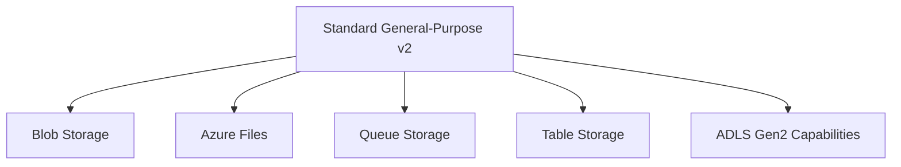

---

## 4.2 Why Is GPv2 the Default Choice?

GPv2 is usually selected because it provides:

- Broad service support
- Modern Azure Storage features
- Multiple redundancy options
- Blob access tiers
- Lifecycle management
- Blob versioning
- Soft delete
- Event integration
- Data Lake Storage Gen2 capabilities
- General-purpose pricing flexibility

Microsoft recommends GPv2 for most new Azure Storage scenarios. ([learn.microsoft.com](https://learn.microsoft.com/en-us/azure/storage/common/storage-account-create?utm_source=openai))

---

## 4.3 Typical GPv2 Use Cases

Use Standard GPv2 for:

- Web application uploads
- Images and documents
- Backups
- Logs
- Static website files
- Queues for background processing
- Tables for simple NoSQL data
- Standard Azure Files shares
- Data Lake Storage Gen2 workloads
- General-purpose enterprise applications

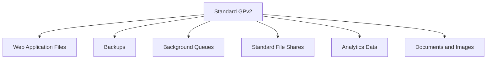

---

## 4.4 GPv2 Blob Access Tiers

GPv2 supports blob access tiers such as:

- Hot
- Cool
- Cold
- Archive

The tier should be selected according to access frequency and retention requirements.

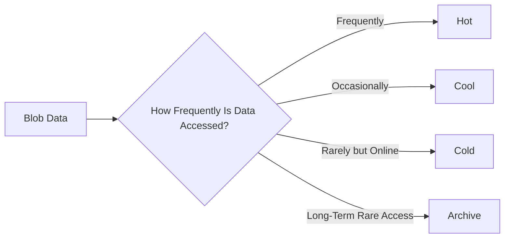

> **Interview point:**  
> GPv2 is not automatically the fastest account type. It is the most flexible general-purpose type. Premium account types are used when consistently low latency or high IOPS are required.

---

## 4.5 GPv2 Redundancy Options

GPv2 supports a broad range of redundancy choices, depending on region and configuration:

- LRS
- ZRS
- GRS
- RA-GRS
- GZRS
- RA-GZRS

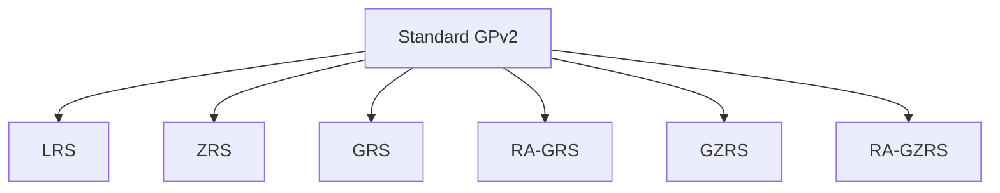

Availability varies by region, so verify regional support before finalizing the design. ([learn.microsoft.com](https://learn.microsoft.com/en-us/azure/storage/common/storage-account-create?utm_source=openai))

---

# 5. Premium Block Blob Accounts

## 5.1 What Are They?

A **Premium block blob account** is designed for high-performance block blob and append blob workloads.

Its resource kind is:

```text
BlockBlobStorage
```

It is commonly selected when the application needs:

- Consistently low latency
- High transaction rates
- High-throughput object operations
- Frequent access to smaller objects
- Predictable performance

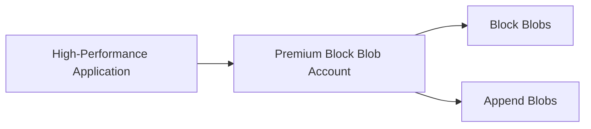

---

## 5.2 Typical Use Cases

Use Premium block blobs for:

- High-transaction object workloads
- Interactive content repositories
- High-performance media processing
- Frequently accessed small objects
- Low-latency application storage
- Specialized analytics or data-ingestion workloads

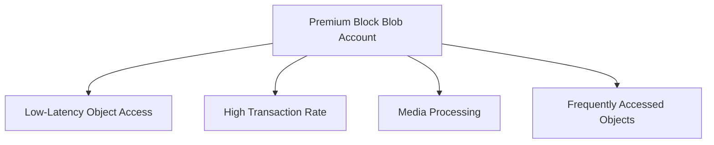

---

## 5.3 When Should You Not Use It?

Do not choose Premium block blobs only because the workload stores blobs.

Standard GPv2 may be better when:

- Access is moderate
- Cost efficiency is more important
- You need broad support for Files, Queues, or Tables
- You need geo-redundancy options not available to the premium account
- You need extensive GPv2 features
- Performance requirements have not been measured

Premium block blob accounts do not support every feature available in GPv2, so check feature compatibility before selecting them. Microsoft notes that some Blob Storage features may have limited or no support in premium block blob accounts. ([learn.microsoft.com](https://learn.microsoft.com/en-us/azure/storage/blobs/storage-blob-block-blob-premium?utm_source=openai))

---

## 5.4 Premium Block Blob Redundancy

Premium block blob accounts generally support:

- LRS
- ZRS, where available

They are not the general choice for GRS or GZRS requirements.

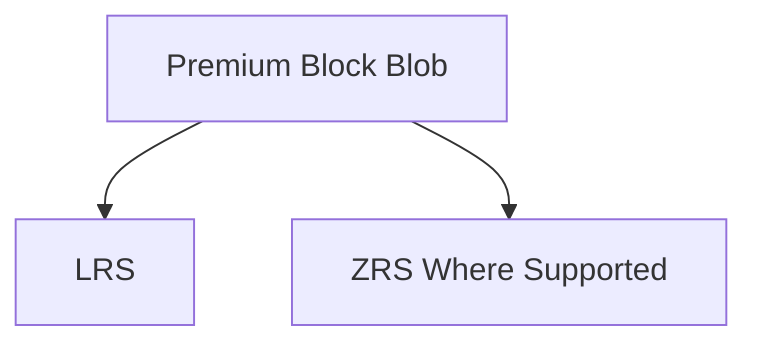

---

# 6. Premium File Share Accounts

## 6.1 What Are They?

A **Premium file share account** is designed for high-performance Azure Files workloads.

Its resource kind is:

```text
FileStorage
```

It is used for:

- High-performance SMB file shares
- High-performance NFS file shares
- Low-latency shared filesystems
- I/O-intensive file applications
- Enterprise-scale file-share workloads

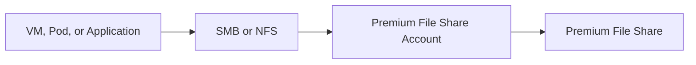

---

## 6.2 Typical Use Cases

Use Premium file shares for:

- High-performance shared application storage
- Enterprise file shares
- I/O-intensive file processing
- Low-latency workloads
- Databases or applications requiring shared file access
- High-performance persistent volumes for containers

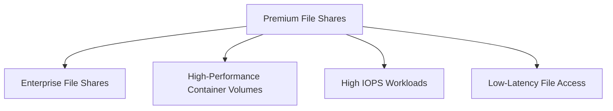

---

## 6.3 Azure Files in AKS

Premium file shares can be used in AKS through the Azure Files CSI driver.

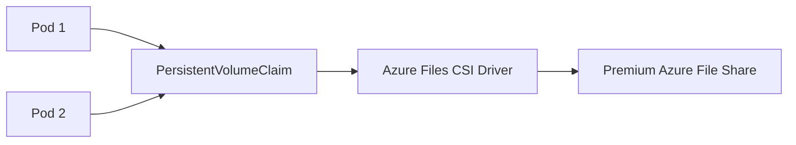

Use Premium Files when:

- Multiple Pods need shared access
- File latency matters
- The workload has high IOPS requirements
- A standard file share cannot meet performance targets

---

## 6.4 Premium File Share Redundancy

Premium file share accounts commonly support:

- LRS
- ZRS, where available

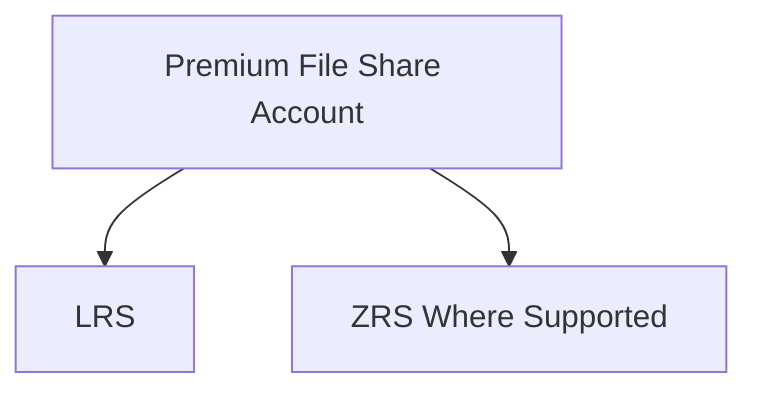

---

## 6.5 Premium File Share Limitations

Compared with GPv2, Premium FileStorage accounts are specialized:

- They are for Azure Files
- They are not general-purpose Blob, Queue, and Table accounts
- They may not support every Blob Storage feature
- Their pricing model is designed around premium file-share performance

> **Interview point:**  
> Choose Premium FileStorage for high-performance file shares, not for a general application that also needs Blob, Queue, and Table services.

---

# 7. Premium Page Blob Accounts

## 7.1 What Are They?

A **premium page blob account** is used for page blobs that require high-performance random read/write operations.

Page blobs are organized into pages and support range-based reads and writes.


---

## 7.2 Typical Use Cases

Premium page blobs are used for specialized workloads such as:

- Virtual hard disk patterns
- Random-access storage
- Certain VM disk scenarios
- Applications requiring consistent low-latency page operations

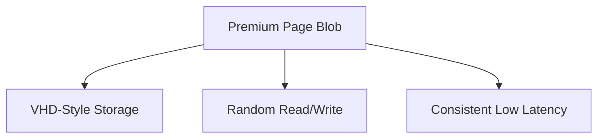

---

## 7.3 When Should You Use Premium Page Blobs?

Use premium page blobs only when:

- The workload specifically requires page blob semantics
- Random read/write access is important
- The application uses a page-blob-compatible design
- Performance requirements justify Premium storage

For most new VM disk designs, evaluate Azure Managed Disks instead of directly managing page blobs.

> **Interview point:**  
> Page blobs are not the normal choice for application documents, images, or videos. Use block blobs for general object storage.

---

## 7.4 Premium Page Blob Restrictions

Premium page blob accounts are specialized and generally support:

- Page blobs
- Premium performance
- LRS
- ZRS where supported, depending on current regional capabilities

They are not intended to be a general-purpose account for Blob, File, Queue, and Table services.

---

# 8. Legacy Standard General-Purpose v1

## 8.1 What Is It?

A **Standard general-purpose v1** account is an older storage account type.

Its resource kind is:

```text
Storage
```

It historically supported:

- Blob Storage
- Azure Files
- Queue Storage
- Table Storage

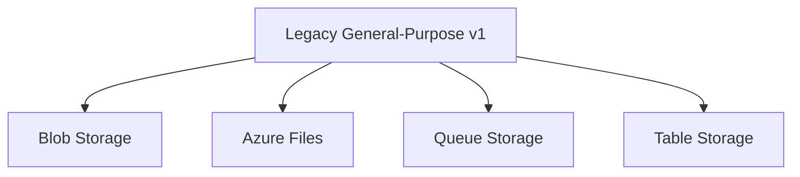

---

## 8.2 Why Is It Considered Legacy?

GPv1 does not provide the full set of modern capabilities available in GPv2.

Compared with GPv2, GPv1 may have limitations involving:

- Modern access tiers
- Lifecycle management
- Current pricing features
- Modern redundancy choices
- New platform capabilities
- Feature support for current designs

Microsoft recommends upgrading existing GPv1 accounts to GPv2 to access modern features and cost-optimization capabilities. ([learn.microsoft.com](https://learn.microsoft.com/en-us/azure/storage/common/storage-account-upgrade?utm_source=openai))

---

## 8.3 Interview Answer for GPv1

> GPv1 is a legacy general-purpose account type. I would not choose it for a new solution. If I found it in an existing environment, I would assess compatibility, model pricing, review feature dependencies, and plan an upgrade to GPv2.

---

# 9. Legacy Blob Storage Accounts

## 9.1 What Are They?

A legacy Blob Storage account is an older Blob-only storage account type.

Its resource kind is:

```text
BlobStorage
```

It was designed for older Blob Storage scenarios and did not provide the full general-purpose capabilities of GPv2.


---

## 9.2 Why Should You Avoid It for New Workloads?

GPv2 generally provides:

- Per-blob access tiers
- Lifecycle management
- Modern redundancy options
- Event integration
- Immutable storage capabilities
- Support for other Azure Storage services
- Modern pricing and feature consistency

Microsoft has announced retirement and automatic migration plans for legacy Blob Storage accounts. Existing users should plan migration to GPv2 before the applicable retirement deadline. ([learn.microsoft.com](https://learn.microsoft.com/en-us/azure/storage/common/legacy-blob-storage-account-migration-overview?utm_source=openai))

---

## 9.3 Interview Answer for Legacy Blob Storage

> Legacy Blob Storage accounts are older Blob-only accounts. I would not select one for a new deployment. I would migrate existing workloads to GPv2 after checking access tiers, lifecycle rules, redundancy, networking, application compatibility, and cost impact.

---

# 10. Storage Account Type Selection Flow

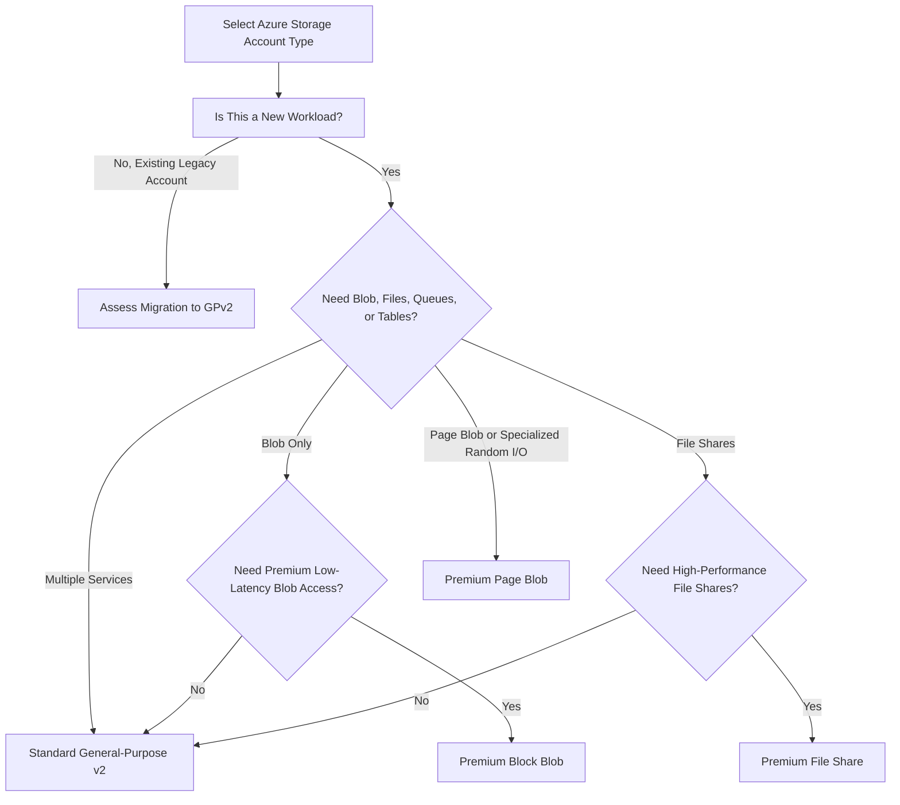

---

# 11. Account Type Selection by Workload

| Workload | Recommended Account Type |
|---|---|
| General web application storage | Standard GPv2 |
| Images and documents | Standard GPv2 |
| Backups and archive | Standard GPv2 |
| Blob Storage with lifecycle tiers | Standard GPv2 |
| Data Lake Storage Gen2 | Standard GPv2 with hierarchical namespace |
| High-transaction block blobs | Premium block blobs |
| Low-latency object access | Premium block blobs |
| Standard SMB file share | Standard GPv2 |
| High-performance SMB file share | Premium file shares |
| High-performance NFS file share | Premium file shares, where supported |
| Shared persistent storage for high-performance AKS workloads | Premium file shares |
| Page blobs with random I/O | Premium page blobs |
| New queue and table workload | Standard GPv2 |
| Existing GPv1 workload | Plan migration to GPv2 |
| Existing legacy Blob account | Plan migration to GPv2 |

---

# 12. Account Type and Performance Decision

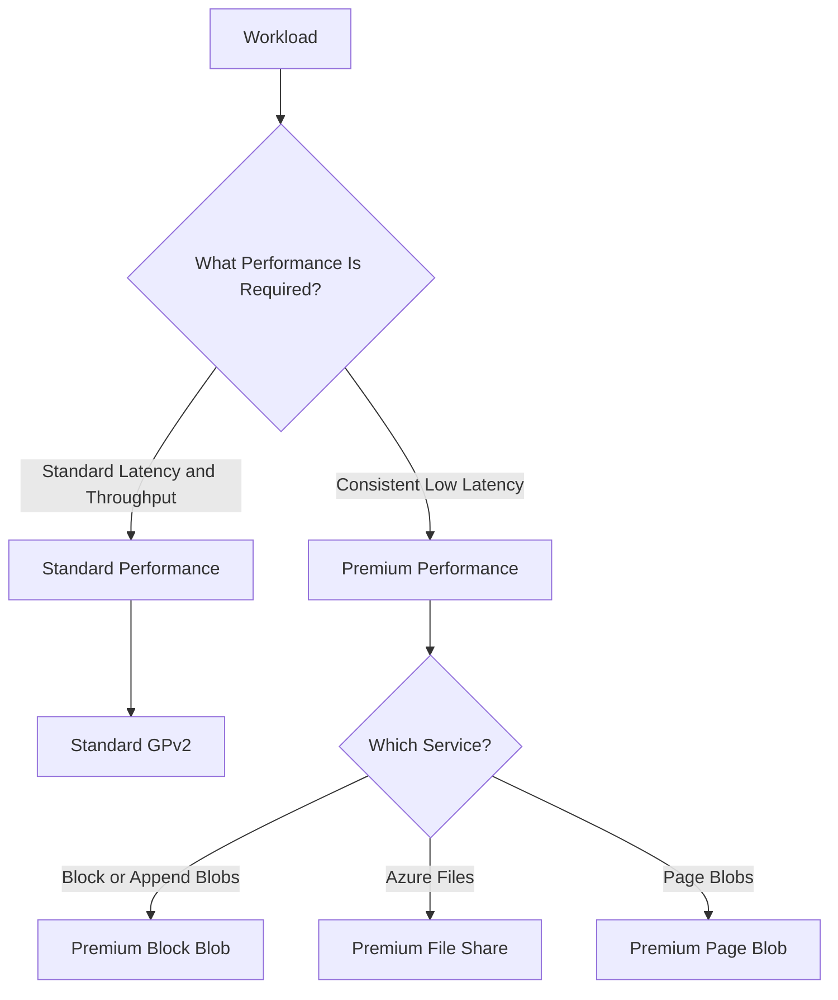

> **Interview point:**  
> First identify the storage service. Then select Standard or Premium based on measurable latency, IOPS, throughput, and transaction requirements.

---

# 13. Account Type and Redundancy

| Account Type | LRS | ZRS | GRS / RA-GRS | GZRS / RA-GZRS |
|---|---:|---:|---:|---:|
| Standard GPv2 | Yes | Yes, where available | Yes | Yes, where available |
| Premium block blobs | Yes | Yes, where available | Generally not the primary option | Generally not the primary option |
| Premium file shares | Yes | Yes, where available | Generally not the primary option | Generally not the primary option |
| Premium page blobs | Yes | Region-dependent | Generally not the primary option | Generally not the primary option |
| Legacy GPv1 | Yes | Limited or unavailable | Yes | No |
| Legacy Blob Storage | Yes | Limited or unavailable | Yes | No |

The exact availability depends on the Azure region and current service support. Always verify supported redundancy for the target region and account type. ([learn.microsoft.com](https://learn.microsoft.com/azure/storage/common/storage-redundancy?utm_source=openai))

---

# 14. Account Type and Hierarchical Namespace

Hierarchical namespace is primarily relevant to:

- Standard GPv2
- Premium block blob accounts, where supported

It enables Azure Data Lake Storage Gen2 capabilities.

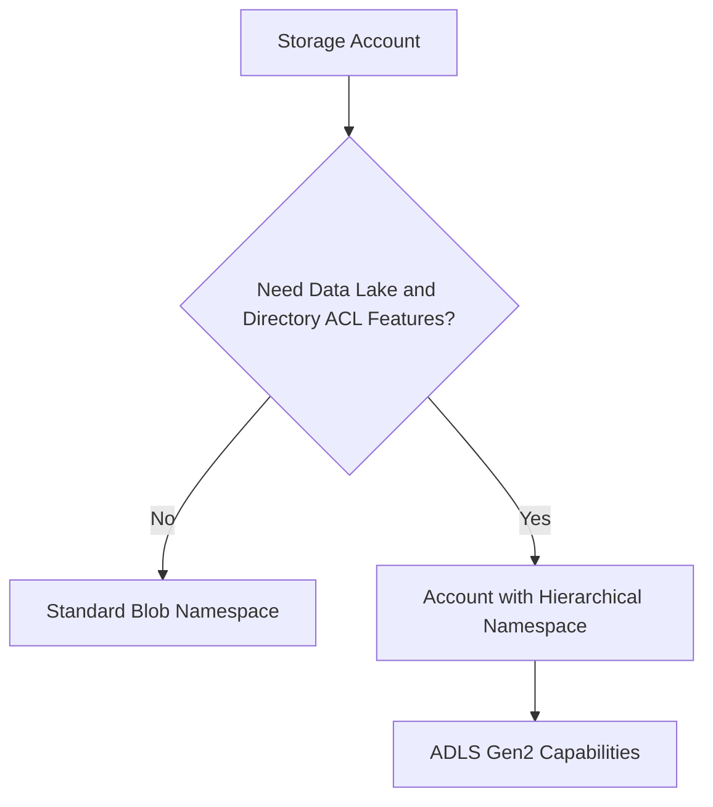

Use hierarchical namespace for:

- Big-data analytics
- Data engineering
- Machine learning data platforms
- Directory and ACL-oriented access

---

# 15. Account Type and Azure Files

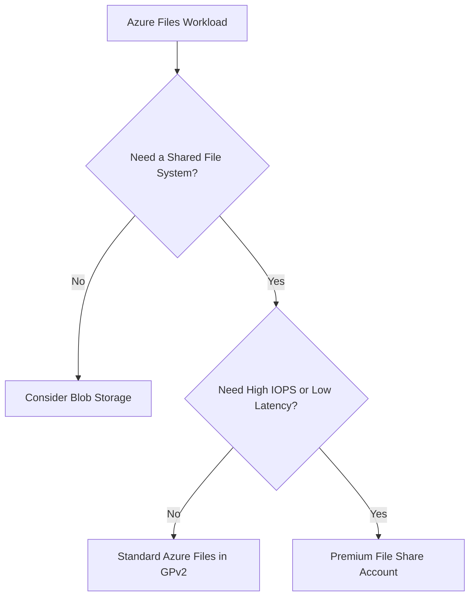

### Standard Azure Files

Use for:

- General file shares
- Moderate file workloads
- Cost-sensitive shared storage
- Standard container volumes

### Premium Azure Files

Use for:

- High-performance file shares
- I/O-intensive applications
- Low-latency workloads
- High-performance AKS persistent volumes

---

# 16. Account Type and Blob Storage

```mermaid
flowchart TD
    BlobWorkload["Blob Workload"] --> Access{"What Is the Access Pattern?"}

    Access -- "Normal Object Storage" --> GPv2["Standard GPv2"]
    Access -- "High Transactions and Low Latency" --> Premium["Premium Block Blob"]
    Access -- "Append-Only Logs" --> Append["GPv2 or Premium Block Blob"]
    Access -- "Random Page-Based I/O" --> Page["Premium Page Blob"]
    Access -- "Virtual Disk Workload" --> ManagedDisk["Evaluate Azure Managed Disks"]
```

---

# 17. Account Type and Azure Data Lake

```mermaid
flowchart LR
    Analytics["Analytics Workload"] --> GPv2["Standard GPv2"]
    GPv2 --> HNS["Enable Hierarchical Namespace"]
    HNS --> ADLS["Azure Data Lake Storage Gen2"]
    ADLS --> AnalyticsTools["Databricks, Synapse, Fabric, Spark, and Other Tools"]
```

Recommended considerations:

- Hierarchical namespace
- Directory-level access control
- Private endpoints
- Microsoft Entra authentication
- Lifecycle management
- Redundancy
- Data residency
- Analytics workload performance

---

# 18. Account Type and AKS

## 18.1 Blob Access from AKS

Use Standard GPv2 or Premium block blobs depending on the object workload.

```mermaid
flowchart LR
    Pod["AKS Pod"] --> Identity["Workload Identity"]
    Identity --> Blob["Blob Endpoint"]
    Blob --> GPv2["GPv2 or Premium Block Blob"]
```

## 18.2 File Access from AKS

Use Azure Files through a CSI driver.

```mermaid
flowchart LR
    Pod["AKS Pod"] --> PVC["PersistentVolumeClaim"]
    PVC --> CSI["Azure Files CSI Driver"]
    CSI --> Account{"Storage Account Type"}
    Account --> Standard["Standard GPv2 File Share"]
    Account --> Premium["Premium File Share"]
```

Select Premium Files when application latency and IOPS requirements justify it.

---

# 19. Can You Change the Storage Account Type Later?

Some account characteristics can be changed or converted, but not every account type can be directly converted in place.

Important interview point:

> You should not assume that a Standard GPv2 account can simply be changed into a Premium block blob or Premium file share account.

For some migrations, the process is:

1. Create a new account with the required type
2. Copy or replicate data
3. Update applications and endpoints
4. Validate the new account
5. Decommission the old account after a controlled migration

Microsoft specifically notes that an existing Standard GPv2 account cannot simply be converted into a Premium block blob account; migration requires creating a new account and copying data. ([learn.microsoft.com](https://learn.microsoft.com/en-us/azure/storage/blobs/storage-blob-block-blob-premium?utm_source=openai))

```mermaid
flowchart TD
    Existing["Existing Storage Account"] --> NeedChange["Need Different Account Type"]
    NeedChange --> Direct{"Supported In-Place Conversion?"}

    Direct -- "Yes" --> Convert["Perform Supported Conversion"]
    Direct -- "No" --> New["Create New Account"]
    New --> Copy["Copy or Replicate Data"]
    Copy --> Switch["Switch Application Endpoints"]
    Switch --> Validate["Validate Workload"]
    Validate --> Retire["Retire Old Account"]
```

---

# 20. Legacy Account Migration Flow

```mermaid
flowchart TD
    Legacy["Legacy GPv1 or Blob Account"] --> Inventory["Inventory Services and Features"]
    Inventory --> Cost["Model Current and Future Cost"]
    Cost --> Compatibility["Check Application Compatibility"]
    Compatibility --> Target["Create GPv2 Target Account"]
    Target --> Copy["Copy Data"]
    Copy --> Test["Test Access, Security, and Performance"]
    Test --> Cutover["Update Application Configuration"]
    Cutover --> Monitor["Monitor Migration"]
    Monitor --> Retire["Retire Legacy Account"]
```

Migration checklist:

- Review account kind and SKU
- Identify all consumers
- Review access keys and SAS tokens
- Review lifecycle policies
- Review redundancy
- Review network rules
- Review private endpoints and DNS
- Review access tiers
- Review Blob features
- Test performance
- Test data integrity
- Update application endpoints
- Rotate credentials after cutover

---

# 21. Storage Account Type and Security

All account types should use defense-in-depth security.

Recommended controls:

- Microsoft Entra ID
- Managed identities
- AKS Workload Identity
- Azure RBAC
- Private endpoints
- Firewall and network rules
- HTTPS-only access
- Encryption
- Soft delete
- Versioning
- Immutable policies where required
- Diagnostic logging
- Azure Policy

```mermaid
flowchart TB
    Workload["Workload"] --> Identity["Identity-Based Authentication"]
    Identity --> RBAC["Least-Privilege RBAC"]
    RBAC --> Network["Private Endpoint or Firewall"]
    Network --> Encryption["Encryption"]
    Encryption --> Data["Storage Data"]
    Data --> Protection["Soft Delete, Versioning, or Immutability"]
    Protection --> Monitoring["Logging and Monitoring"]
```

The account type determines supported storage capabilities, but secure identity and network design are required for every type.

---

# 22. Storage Account Type and Cost

Cost depends on more than Standard versus Premium.

Consider:

- Capacity
- Transactions
- Access tier
- Performance tier
- Redundancy
- Data retrieval
- Network egress
- File-share provisioned capacity
- Snapshots
- Versions
- Backup
- Data transfer
- Regional placement

```mermaid
flowchart TD
    Cost["Total Storage Cost"] --> AccountType["Account Type"]
    Cost --> Capacity["Capacity"]
    Cost --> Transactions["Transactions"]
    Cost --> Redundancy["Redundancy"]
    Cost --> Network["Data Transfer"]
    Cost --> Protection["Versions and Snapshots"]
    Cost --> Performance["Provisioned Performance"]
```

> **Interview answer:**  
> Premium is not always cheaper at scale. Compare the full workload cost, including capacity, operations, redundancy, network transfer, and operational complexity.

---

# 23. Common Interview Mistakes

1. Saying GPv2 is always the fastest storage account
2. Choosing Premium without performance measurements
3. Using Premium block blobs for Azure Files
4. Using Premium Files for ordinary object storage
5. Confusing Premium page blobs with managed disks
6. Choosing GPv1 for a new workload
7. Creating a legacy Blob Storage account
8. Ignoring regional availability of ZRS or GZRS
9. Assuming all account types support the same features
10. Assuming account type can always be changed in place
11. Ignoring migration effort
12. Forgetting that account type affects pricing
13. Ignoring hierarchical namespace requirements
14. Using one account for every environment
15. Selecting redundancy without defining RTO and RPO

---

# 24. Interview Questions and Strong Answers

## Q1: What are the main Azure Storage account types?

**Answer:** The main types are Standard general-purpose v2, Premium block blobs, Premium file shares, Premium page blobs, legacy general-purpose v1, and legacy Blob Storage. GPv2 is the recommended default for most new workloads.

## Q2: Which storage account type should you choose for a new application?

**Answer:** Start with Standard general-purpose v2 unless the application has a measured requirement for premium block blobs, premium file shares, or premium page blobs.

## Q3: What is Standard general-purpose v2?

**Answer:** It is the flexible general-purpose account type supporting Blob Storage, Azure Files, Queue Storage, Table Storage, and Data Lake Storage Gen2 capabilities when hierarchical namespace is enabled.

## Q4: When would you choose Premium block blobs?

**Answer:** Choose Premium block blobs for workloads requiring consistently low latency, high transaction rates, or high-performance block and append blob operations.

## Q5: When would you choose Premium file shares?

**Answer:** Choose Premium file shares for high-performance Azure Files workloads requiring low latency, high IOPS, or high-throughput SMB or NFS file-share access.

## Q6: What are Premium page blobs used for?

**Answer:** They are used for specialized page-blob workloads requiring random read/write operations, such as some VHD-style or disk-oriented scenarios. For many VM disk workloads, Azure Managed Disks should also be evaluated.

## Q7: What is GPv1?

**Answer:** GPv1 is a legacy general-purpose account type. It is not normally selected for new deployments; existing accounts should be evaluated for migration to GPv2.

## Q8: What is a legacy Blob Storage account?

**Answer:** It is an older Blob-only account type. New applications should generally use GPv2, and existing legacy Blob accounts should be assessed for migration.

## Q9: Can GPv2 store both blobs and files?

**Answer:** Yes. A Standard general-purpose v2 account can support Blob Storage, Azure Files, Queue Storage, and Table Storage. However, separate accounts may be better when workloads have different security, performance, redundancy, or compliance requirements.

## Q10: Which account type supports Data Lake Storage Gen2?

**Answer:** GPv2 can support Data Lake Storage Gen2 capabilities when hierarchical namespace is enabled. Some premium block blob accounts also support hierarchical namespace, subject to feature compatibility.

## Q11: Can you convert GPv2 into a Premium block blob account?

**Answer:** Not as a simple direct conversion. Typically, create a new premium account, copy the data, update the application, validate it, and retire the old account.

## Q12: Which account type is best for AKS shared storage?

**Answer:** Use Azure Files through the CSI driver. Standard GPv2 is suitable for ordinary shared file workloads; Premium FileStorage is appropriate when low latency or high IOPS is required.

## Q13: Which account type is best for images and documents?

**Answer:** Standard GPv2 is the usual choice. Premium block blobs may be appropriate if the workload has consistently high transaction or low-latency requirements.

## Q14: Which account type is best for queues and tables?

**Answer:** Standard GPv2 is the typical choice because it supports Queue Storage and Table Storage as part of the general-purpose account model.

## Q15: Does Premium always mean better?

**Answer:** No. Premium provides specialized performance, but it may cost more and support fewer general-purpose services or features. Select it based on measured requirements.

---

# 25. Scenario-Based Interview Answer

## Scenario

A company requires:

- Blob Storage for user documents
- Queue Storage for background processing
- Standard file shares for a legacy application
- Data Lake capabilities for analytics
- Private access from AKS
- Geo-redundancy for production

## Recommended Design

Use:

```text
Standard general-purpose v2
```

with:

- Hierarchical namespace if Data Lake capabilities are needed
- Appropriate geo-redundancy
- Private endpoints
- Workload Identity for AKS
- RBAC
- Lifecycle policies
- Soft delete and versioning
- Diagnostic logging

```mermaid
flowchart TB
    GPv2["Standard GPv2 Storage Account"] --> Blob["Blob Containers for Documents"]
    GPv2 --> Queue["Queue for Background Jobs"]
    GPv2 --> Files["Standard Azure File Share"]
    GPv2 --> ADLS["Hierarchical Namespace for Analytics"]

    AKS["AKS"] --> Identity["Workload Identity"]
    Identity --> PrivateEndpoint["Private Endpoint"]
    PrivateEndpoint --> GPv2
```

If the file-share workload later requires high IOPS, or the Blob workload requires consistent ultra-low latency, evaluate separate premium accounts instead of making the entire design premium.

---

# 26. 60-Second Interview Pitch

> Azure Storage account types define the supported storage services, performance model, redundancy options, features, and pricing behavior. For most new applications, I choose Standard general-purpose v2 because it supports Blob Storage, Azure Files, Queue Storage, Table Storage, and Data Lake Storage Gen2 capabilities. I choose Premium block blobs when the workload needs consistently low-latency or high-transaction object access, Premium FileStorage for high-performance SMB or NFS shares, and Premium page blobs for specialized random page-blob workloads. I avoid GPv1 and legacy Blob Storage for new deployments and plan migrations to GPv2 for existing accounts. Before selecting a type, I evaluate access pattern, latency, IOPS, redundancy, regional availability, security, cost, feature compatibility, and whether the account type can be changed later without creating a migration project.

---

# 27. Final Revision Checklist

- [ ] Standard GPv2 is the default for most new workloads
- [ ] GPv2 supports blobs, files, queues, and tables
- [ ] GPv2 supports ADLS Gen2 capabilities with hierarchical namespace
- [ ] Premium block blobs support high-performance block and append blobs
- [ ] Premium FileStorage supports high-performance file shares
- [ ] Premium page blobs support specialized page-blob workloads
- [ ] GPv1 is a legacy account type
- [ ] Legacy Blob Storage is not recommended for new deployments
- [ ] Premium is not automatically the best choice
- [ ] Account type affects performance and features
- [ ] Account type affects redundancy options
- [ ] Account type affects pricing
- [ ] Redundancy availability varies by region
- [ ] GPv2 supports access tiers for Blob Storage
- [ ] Premium accounts may have feature limitations
- [ ] Storage account type may not be directly convertible
- [ ] Migration may require creating a new account and copying data
- [ ] Use Azure Files for mounted shared filesystems
- [ ] Use Blob Storage for object workloads
- [ ] Use Managed Disks for many VM disk scenarios
- [ ] Use separate accounts when security or performance boundaries differ
- [ ] Use Microsoft Entra ID and managed identities
- [ ] Use private endpoints for sensitive workloads
- [ ] Define RTO and RPO before selecting redundancy
- [ ] Model total cost, not just storage capacity cost
- [ ] Validate compatibility before choosing Premium

---

## One-Line Conclusion

> Choose Standard general-purpose v2 for most new Azure Storage workloads, and use Premium block blob, Premium file share, or Premium page blob accounts only when the workload has a clear, measured performance or protocol requirement.