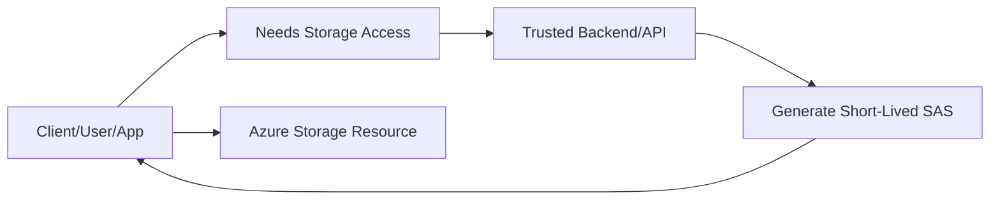
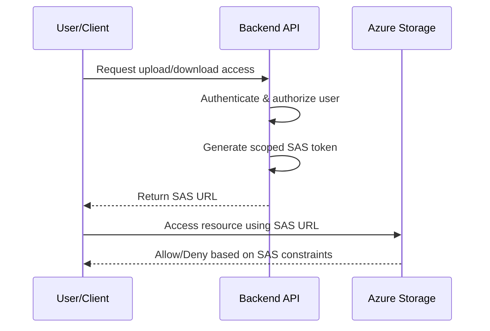
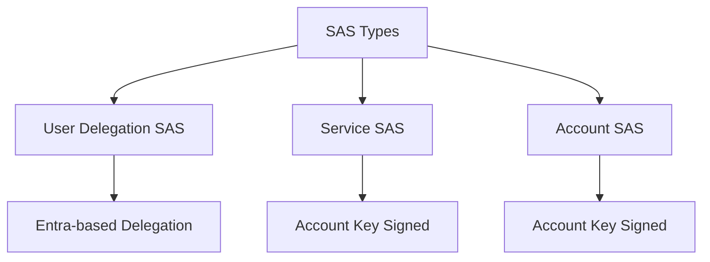
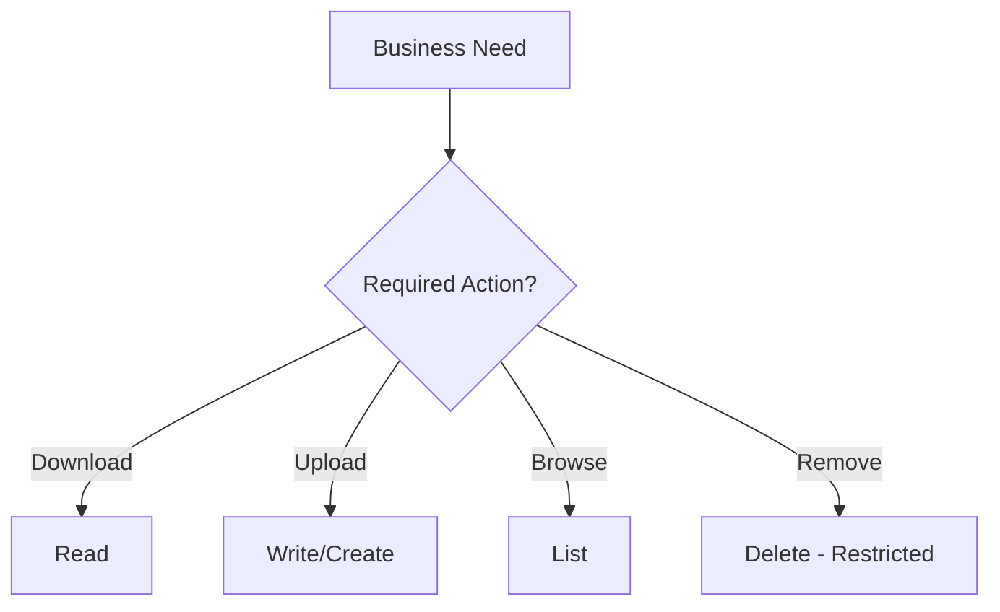
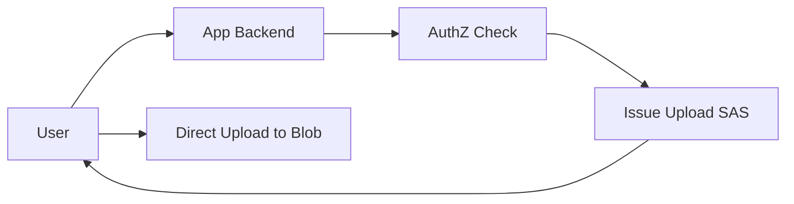
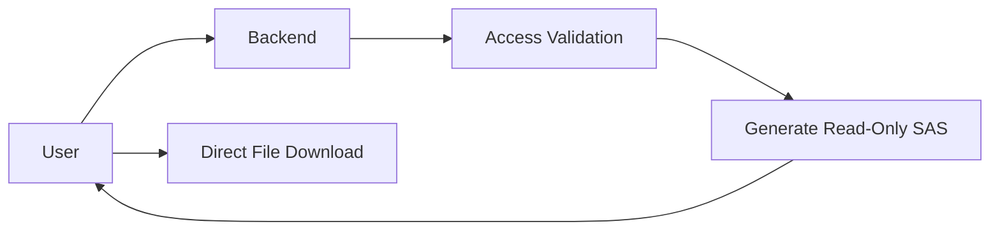
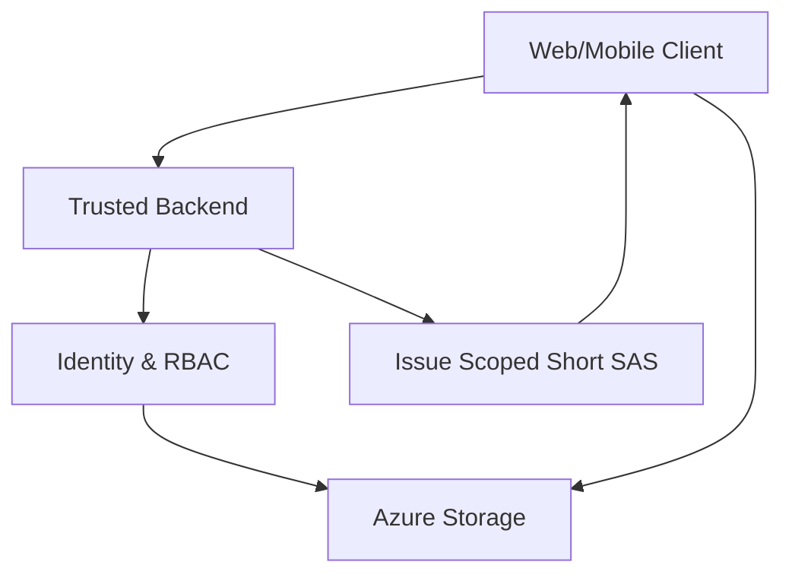

# What Are SAS Tokens in Azure?
## Detailed Interview Preparation Guide with Flow Charts (Static Site Ready)

---

## 1) Direct Interview Answer

A **SAS token** (Shared Access Signature) is a signed URI token that grants **time-limited, permission-scoped, resource-scoped** access to Azure Storage resources **without exposing the account key** directly to clients.

It is commonly used to delegate temporary access to:

- Blob containers/blobs
- File shares/files
- Queues/messages
- Tables/entities

> One-liner: *SAS is delegated, temporary, least-privilege access to Azure Storage via a signed URL.*

---

## 2) Why SAS Tokens Are Used

Without SAS, you might need to share:
- Storage account keys (high risk)
- Broad permissions (over-privileged)
- Long-lived credentials (hard to control)

SAS solves this by allowing:
- precise permissions (read/write/list/delete, etc.)
- short expiration windows
- optional IP/protocol restrictions
- scoped access to specific resources

---

## 3) Core SAS Characteristics

A SAS token can define:

1. **Resource scope** (which blob/file/queue/table)
2. **Permissions** (what actions are allowed)
3. **Start/expiry time** (when access is valid)
4. **Protocol restriction** (HTTPS recommended)
5. **IP range restriction** (optional)
6. **Signature** (proves token integrity)

---

## 4) SAS Token Access Flow

---

## 5) SAS Types (Interview-Critical)

## 5.1 User Delegation SAS (Preferred for Blob/Data Lake)
- Signed using Microsoft Entra credentials via user delegation key
- Better security posture than account-key signed SAS
- Ideal for modern identity-based architectures

## 5.2 Service SAS
- Signed with storage account key
- Scoped to one storage service (Blob/File/Queue/Table)

## 5.3 Account SAS
- Signed with storage account key
- Can span multiple services/resource types at account level
- Broadest scope, use carefully

---

## 6) Typical SAS Parameters (Conceptual)

Common parameters include:
- `sp` (permissions)
- `st` (start time)
- `se` (expiry time)
- `spr` (protocol)
- `sip` (IP range)
- `sr` (resource type)
- `sig` (signature)
- `sv` (service version)

---

## 7) Permission Modeling

Example permission ideas:

- **Read-only download**: `r`
- **Upload-only**: `w` or create/write scope
- **List-only**: `l`
- **Delete allowed**: `d` (use cautiously)

Principle: grant the minimum permissions required.

---

## 8) SAS for Secure Uploads (Common Pattern)

Best pattern for web/mobile upload:

1. App authenticates user
2. Backend authorizes operation
3. Backend issues short-lived upload SAS
4. Client uploads directly to Storage
5. SAS expires quickly

Benefits:
- avoids proxying large files through backend
- reduces backend load/cost
- keeps storage keys hidden

---

## 9) SAS for Secure Downloads

Download flow:
1. User requests file
2. Backend validates entitlement
3. Backend issues read-only SAS
4. User downloads directly

---

## 10) Security Best Practices

1. Prefer **User Delegation SAS** where possible  
2. Use **short expiry** (minutes, not days, when feasible)  
3. Use **least privilege** permissions  
4. Restrict to **specific resource path**  
5. Enforce **HTTPS only**  
6. Optionally restrict by **IP range**  
7. Do **not** log full SAS URLs  
8. Rotate account keys regularly (for key-signed SAS scenarios)  
9. Use RBAC + managed identity for SAS issuance services  
10. Monitor abnormal access patterns

---

## 11) Common SAS Risks

- Long-lived SAS leaked in logs/chat/email
- Overly broad scope (entire container/account)
- Excessive permissions (read+write+delete unnecessarily)
- No revocation strategy
- SAS embedded in client app binaries/config

---

## 12) Expiry and Revocation Considerations

SAS is usually controlled by expiration; immediate revocation is limited unless you:
- rotate signing keys (key-signed SAS impact)
- use stored access policies (for supported scenarios)
- keep very short expiry durations
- gate SAS issuance through strong authz

---

## 13) SAS vs Account Key vs Managed Identity

| Method | Scope Control | Security Posture | Typical Use |
|---|---|---|---|
| Managed Identity + RBAC | Strong | Best for server-side Azure workloads | App-to-storage access |
| SAS Token | Fine-grained temporary delegation | Strong if short-lived & scoped | Client direct upload/download |
| Account Key | Broad | Highest risk | Legacy/admin scenarios only |

---

## 14) Architecture Pattern (Recommended)

Use backend-issued SAS + identity controls:

---

## 15) Observability for SAS Usage

Monitor:
- token issuance rate
- failed authorization attempts
- unusual geolocation/IP access
- excessive data egress
- abnormal delete/list operations
- expired-token access attempts

Add alerts for suspicious patterns.

---

## 16) Common Interview Mistakes to Avoid

1. Saying SAS is “encryption” (it is authorization delegation)  
2. Treating SAS like permanent credentials  
3. Ignoring expiry/permission scoping  
4. Recommending account keys for browser/mobile clients  
5. Not mentioning HTTPS/IP restrictions  
6. Not mentioning least privilege  

---

## 17) Interview Q&A (Strong Answers)

### Q1: What is a SAS token?
**Answer:** A signed token in a URI that grants temporary, scoped permissions to Azure Storage resources.

### Q2: Why not share account keys directly?
**Answer:** Account keys grant broad access and increase blast radius if leaked; SAS limits scope, permissions, and time.

### Q3: Which SAS type is preferred for Blob in modern architectures?
**Answer:** User Delegation SAS, because it uses Entra-based delegation instead of direct account-key signing.

### Q4: How do you secure SAS issuance?
**Answer:** Authenticate user, enforce authorization rules, issue minimal permissions, set short expiry, require HTTPS, and log issuance metadata (not full token).

### Q5: Can SAS tokens be revoked?
**Answer:** Mostly via expiry; additional control depends on signing model and policies (e.g., key rotation or policy-based controls).

### Q6: When should SAS be used?
**Answer:** When a client needs direct temporary access to storage (uploads/downloads) without exposing broad credentials.

---

## 18) 60-Second Interview Pitch

> SAS tokens are Shared Access Signatures that provide delegated, time-bound, permission-scoped access to Azure Storage resources. Instead of exposing storage account keys, a trusted backend issues a short-lived SAS URL after authenticating and authorizing the requester. The client then accesses Blob/File/Queue/Table resources directly using that token. In production, I prefer user delegation SAS for Blob/Data Lake scenarios, enforce HTTPS, minimize permissions, scope to specific resources, keep expirations short, and monitor issuance/access anomalies. This pattern balances strong security with scalable direct client access.

---

## 19) Final Checklist

- [ ] Understand SAS purpose and scope
- [ ] Know all 3 SAS types
- [ ] Prefer user delegation SAS when applicable
- [ ] Apply least privilege permissions
- [ ] Use short expirations
- [ ] Enforce HTTPS
- [ ] Restrict scope/resource path
- [ ] Avoid logging full SAS URLs
- [ ] Monitor and alert on misuse patterns
- [ ] Have key rotation/revocation strategy

---

## One-Line Conclusion

> SAS tokens provide secure, temporary, least-privilege delegated access to Azure Storage without exposing full account credentials.