# What Is Azure Blob Storage?
## Detailed Interview Preparation Guide with Flow Charts

---

## 1. Direct Interview Answer

**Azure Blob Storage is Microsoft's object-storage service for storing massive amounts of unstructured data in the cloud.**

It is commonly used to store:

- Images
- Videos
- Documents
- Audio files
- Application backups
- Log files
- Database exports
- Static website assets
- Data-lake files
- Machine-learning datasets

Blob Storage organizes data using:

```text
Storage Account
      ↓
Container
      ↓
Blob
```

Applications can access Blob Storage using:

- HTTPS
- REST APIs
- Azure Storage SDKs
- Azure CLI
- Azure PowerShell
- Azure Storage Explorer
- Managed identities
- Shared access signatures

> **One-line interview answer:**  
> **Azure Blob Storage is a highly scalable object-storage service used to store and access unstructured data through APIs, SDKs, or HTTP-based endpoints.**

---

## 2. What Problem Does Blob Storage Solve?

Traditional applications often store files:

- On local server disks
- On shared file servers
- Inside databases
- On application virtual machines

These approaches can create problems:

- Limited storage capacity
- Difficult scaling
- Server dependency
- Expensive backups
- Complex file sharing
- Poor global access
- Application downtime during server maintenance

Blob Storage separates application compute from file storage.

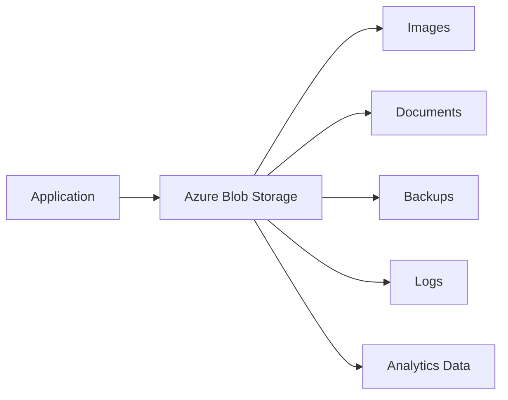

Applications can scale independently while files remain in durable, centralized storage.

---

## 3. Blob Storage Architecture

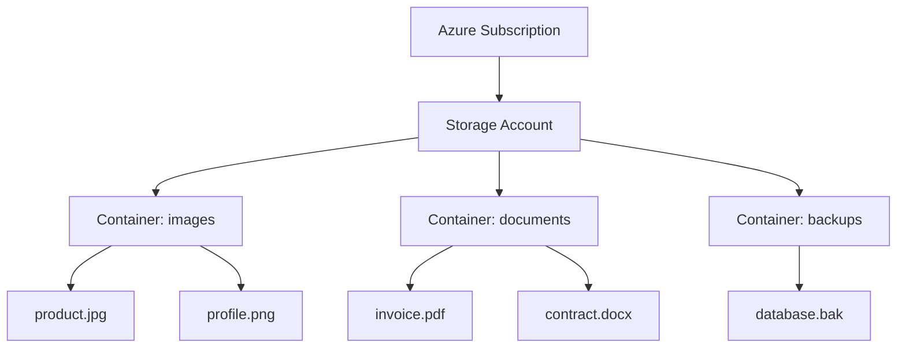

The main resource hierarchy is:

1. Azure subscription
2. Resource group
3. Storage account
4. Container
5. Blob

A storage account provides the namespace and endpoint used to access the data.

---

## 4. What Is a Blob?

A **blob** is an object that stores data.

A blob can contain:

- Text
- Binary data
- Images
- Video
- Audio
- Documents
- Compressed files
- Backups
- Application exports

Example Blob URL:

```text
https://mystorageaccount.blob.core.windows.net/images/product-123.jpg
```

The URL contains:

```text
https://
    ↓
Storage account endpoint
    ↓
Container
    ↓
Blob name
```

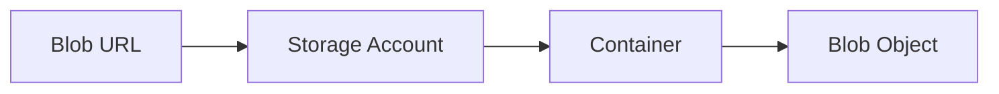

---

## 5. Blob Storage Resource Hierarchy

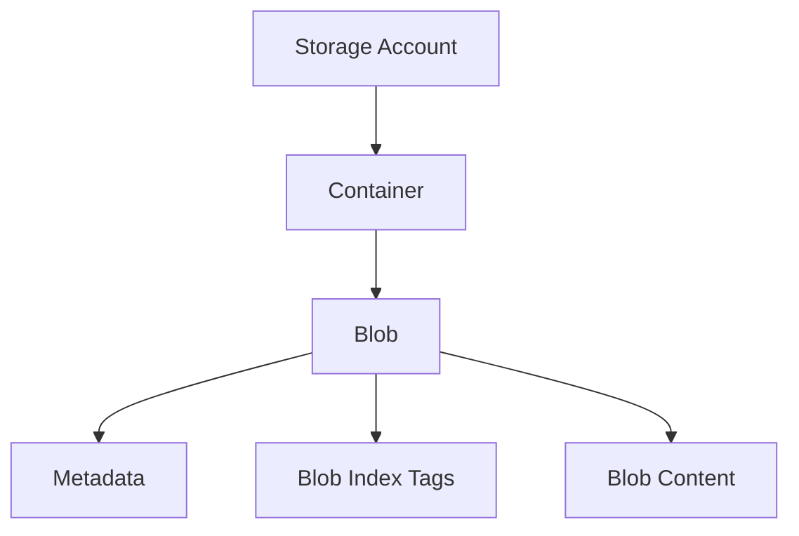

### Storage Account

Provides the unique namespace and service endpoint.

### Container

Groups related blobs. Containers are similar to logical folders but do not provide the same filesystem semantics as a traditional file share.

### Blob

Stores the actual object data.

### Metadata

Stores custom key-value information associated with the blob.

### Blob Index Tags

Provide searchable key-value tags that can help classify and find objects.

---

## 6. Why Use Azure Blob Storage?

Blob Storage is useful because it provides:

- Massive scalability
- Durable object storage
- HTTP and HTTPS access
- Multiple storage tiers
- Lifecycle management
- Redundancy options
- Security integration
- Event integration
- SDK support for many languages
- Integration with Azure analytics services
- Support for backups and disaster recovery

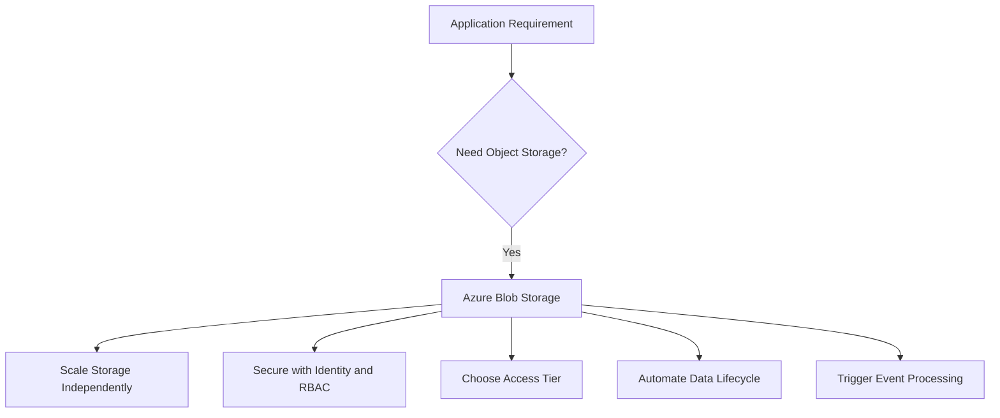

---

## 7. Common Blob Storage Use Cases

### 7.1 Images and Media

- Product images
- Profile photos
- Videos
- Audio files
- Streaming media
- Marketing assets

### 7.2 Documents

- Invoices
- Contracts
- Reports
- User uploads
- PDF files
- Office documents

### 7.3 Backups

- Database backups
- Virtual machine backups
- Application backups
- Disaster recovery copies

### 7.4 Logs

- Application logs
- Audit logs
- Diagnostic exports
- Security logs
- Access logs

### 7.5 Static Website Content

- HTML
- CSS
- JavaScript
- Images
- Fonts
- Downloadable files

### 7.6 Data and Analytics

- CSV files
- JSON data
- Parquet files
- Raw data
- Machine-learning datasets
- Data warehouse staging files

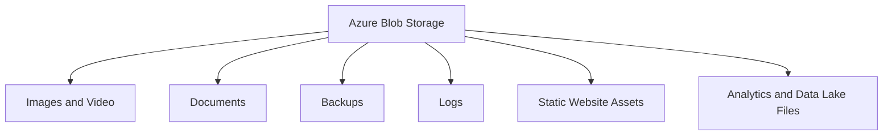

---

## 8. Blob Types

Azure Blob Storage supports three main blob types.

## 8.1 Block Blobs

Block blobs are used for most general-purpose object-storage scenarios.

Suitable for:

- Images
- Documents
- Videos
- Text files
- Application data
- Large uploads

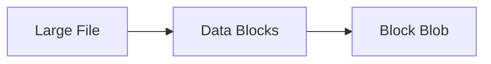

---

## 8.2 Append Blobs

Append blobs are optimized for append operations.

Suitable for:

- Application logs
- Sequential event records
- Audit trails
- Append-only data

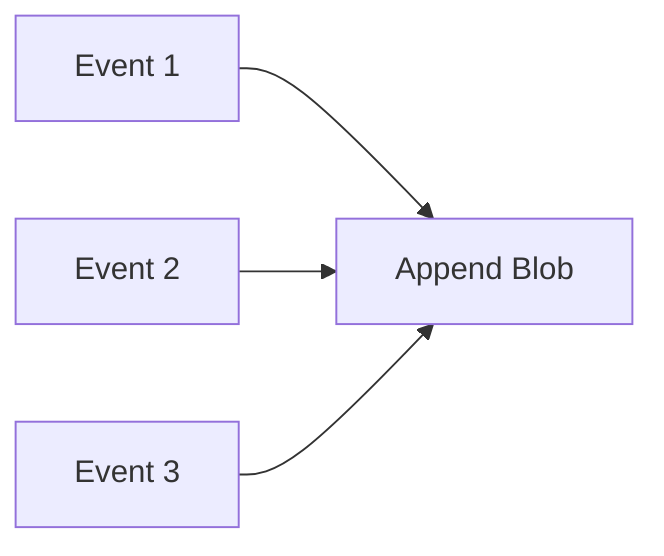

---

## 8.3 Page Blobs

Page blobs support random read/write operations.

Common use cases include:

- Virtual hard disk files
- Certain disk-oriented workloads
- Random-access data patterns

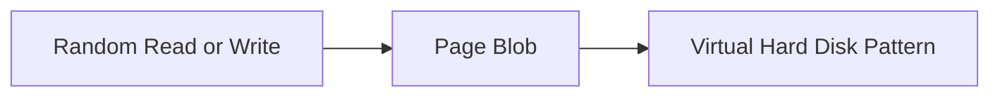

---

## 9. Blob Storage Access Flow

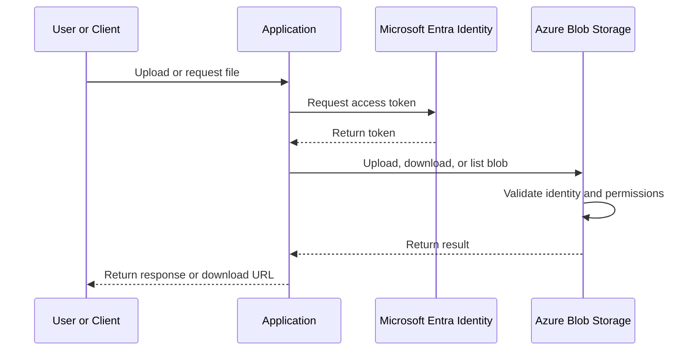

---

## 10. Upload Flow

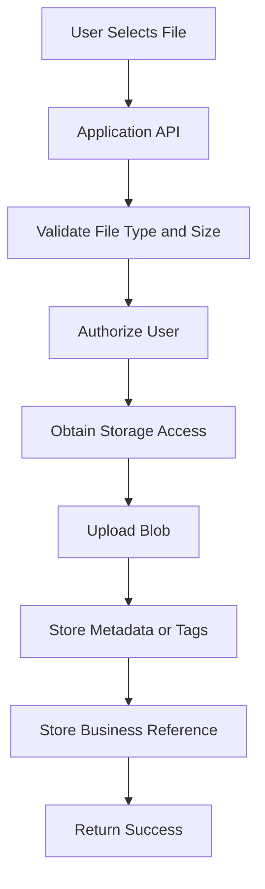

A good upload design often stores:

- Blob name
- Container name
- Content type
- File size
- Owner or tenant ID
- Upload timestamp
- Business entity ID
- Blob version or ETag

---

## 11. Download Flow

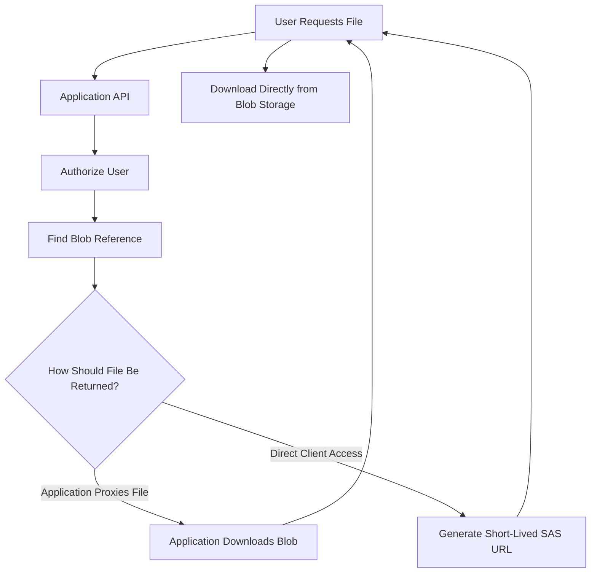

For large files, direct client-to-Blob downloads can reduce load on the application tier.

---

## 12. Authentication and Authorization

Blob Storage supports several access approaches.

## 12.1 Microsoft Entra ID

Use identity-based access with Azure RBAC.

Recommended for:

- Azure workloads
- Managed identities
- Workload identity
- Service-to-service access
- Enterprise applications

## 12.2 Managed Identity

Azure resources can use managed identities without storing credentials in application configuration.

Examples:

- App Service
- Azure Functions
- Virtual Machines
- AKS workloads
- Azure Automation

## 12.3 Workload Identity

AKS Pods can use Workload Identity to obtain tokens and access Blob Storage without storing storage-account keys.

## 12.4 Shared Access Signature

A SAS grants temporary and limited access.

You can restrict:

- Resource
- Permission
- Start time
- Expiry time
- IP range
- Protocol

## 12.5 Storage Account Keys

Storage account keys provide broad access and should be protected carefully.

Prefer identity-based authentication where possible.

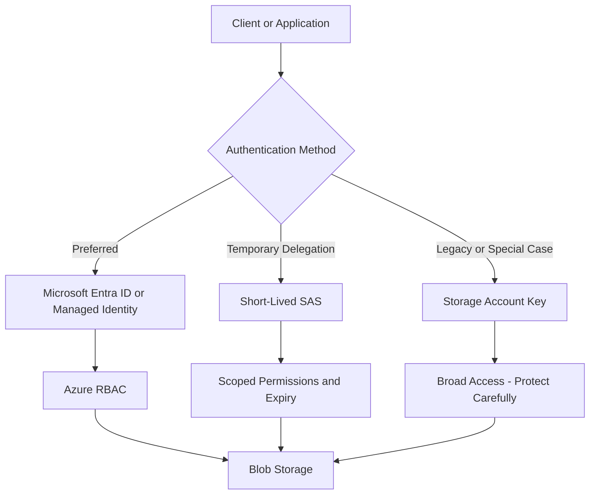

---

## 13. Recommended Security Model

Use:

1. Microsoft Entra ID or managed identity
2. Azure RBAC
3. Least-privilege roles
4. Private endpoints where required
5. HTTPS-only access
6. Disabled anonymous access
7. Diagnostic logs
8. Secret rotation
9. Storage firewalls
10. Data protection features

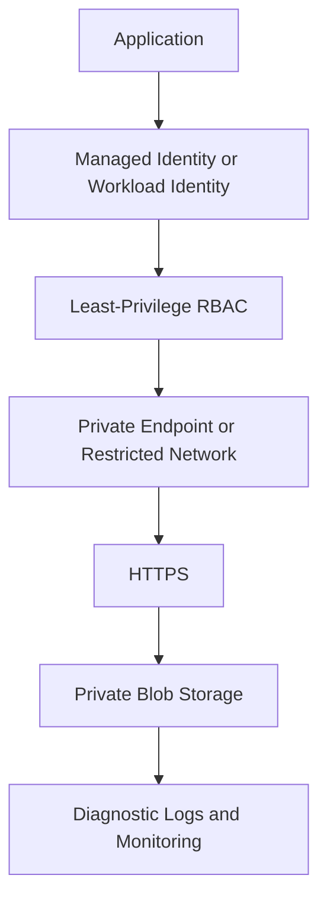

---

## 14. Azure RBAC for Blob Storage

Azure RBAC controls what an identity can do.

Typical roles include:

- Storage Blob Data Reader
- Storage Blob Data Contributor
- Storage Blob Data Owner

### Reader

Can read blob data.

### Contributor

Can read, write, and delete blob data according to the assigned scope.

### Owner

Has broader data permissions and should be granted sparingly.

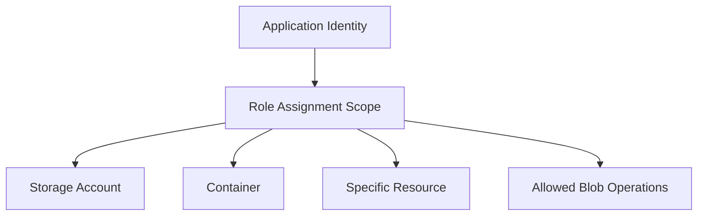

Use the narrowest practical scope.

---

## 15. Access Tiers

Blob Storage provides access tiers for different data-access patterns.

Common tiers include:

- Hot
- Cool
- Cold
- Archive

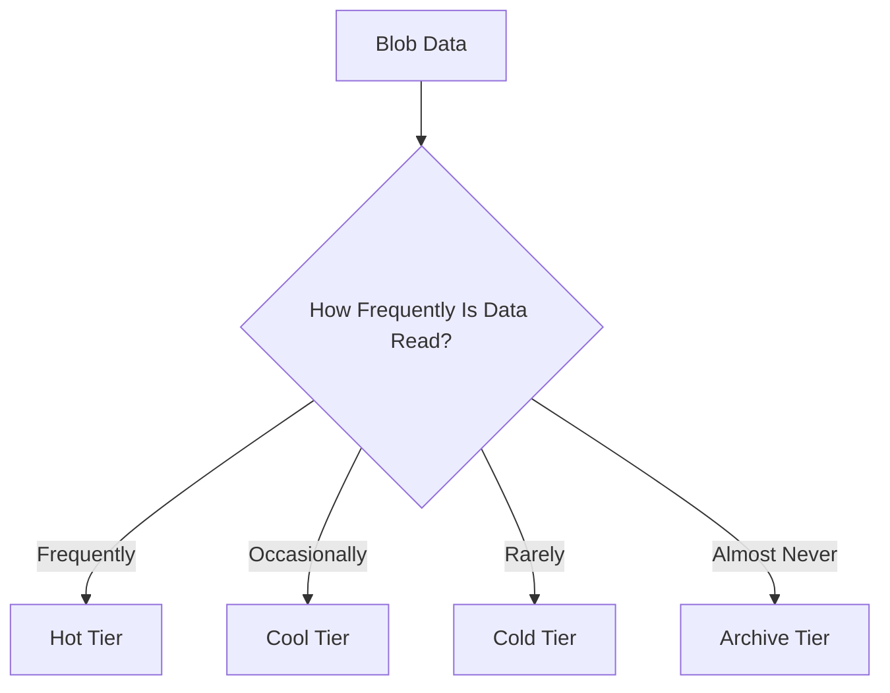

### Hot Tier

Use for data accessed frequently.

Examples:

- Active website images
- Frequently used documents
- Current application assets

### Cool Tier

Use for data accessed less frequently but still requiring online access.

Examples:

- Older documents
- Monthly reports
- Infrequently accessed backups

### Cold Tier

Use for rarely accessed online data where lower storage cost is more important.

### Archive Tier

Use for long-term retention where retrieval can take longer and access costs are higher.

> **Interview point:**  
> Select the access tier based on access frequency, retention requirements, retrieval latency, and total cost—not just storage price.

---

## 16. Lifecycle Management

Lifecycle management automatically moves or deletes blobs based on rules.

Example lifecycle:

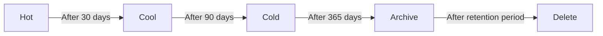

Typical lifecycle actions:

- Move blobs to a cooler tier
- Move blobs to archive
- Delete old snapshots
- Delete old versions
- Delete expired data
- Remove incomplete uploads

Example policy concept:

```json
{
  "rules": [
    {
      "name": "archive-old-backups",
      "type": "Lifecycle",
      "definition": {
        "actions": {
          "baseBlob": {
            "tierToCool": {
              "daysAfterModificationGreaterThan": 30
            },
            "tierToArchive": {
              "daysAfterModificationGreaterThan": 180
            },
            "delete": {
              "daysAfterModificationGreaterThan": 730
            }
          }
        },
        "filters": {
          "blobTypes": [
            "blockBlob"
          ],
          "prefixMatch": [
            "backups/"
          ]
        }
      }
    }
  ]
}
```

---

## 17. Storage Redundancy

Blob Storage supports different redundancy options.

Common choices include:

- LRS
- ZRS
- GRS
- RA-GRS
- GZRS
- RA-GZRS

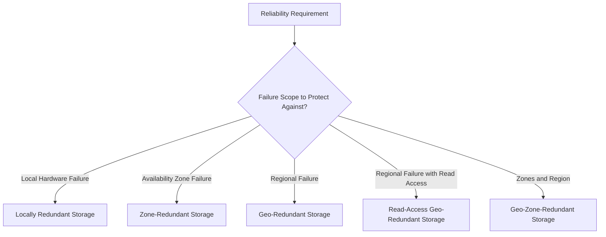

Choose redundancy based on:

- RTO
- RPO
- Regional failure requirements
- Read availability
- Cost
- Compliance
- Backup strategy

> **Interview point:**  
> Redundancy selection is a business and reliability decision, not just a storage configuration decision.

---

## 18. Blob Storage Reliability Flow

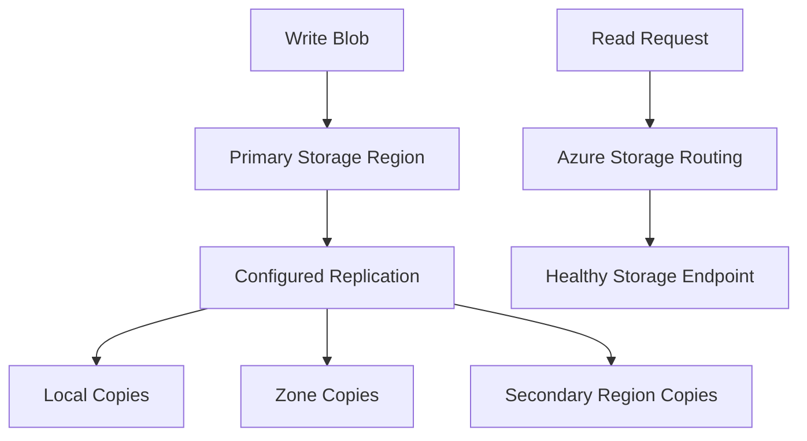

Replication options provide different levels of resilience. Applications still need appropriate retry behavior, backup procedures, and recovery testing.

---

## 19. Versioning and Soft Delete

### Blob Versioning

Keeps previous versions when blobs are overwritten.

Useful for:

- Recovery from accidental overwrite
- Auditability
- Data protection
- Application version history

### Soft Delete

Keeps deleted blobs or containers for a retention period.

Useful for:

- Recovery from accidental deletion
- Operational protection
- Ransomware resilience
- User error recovery

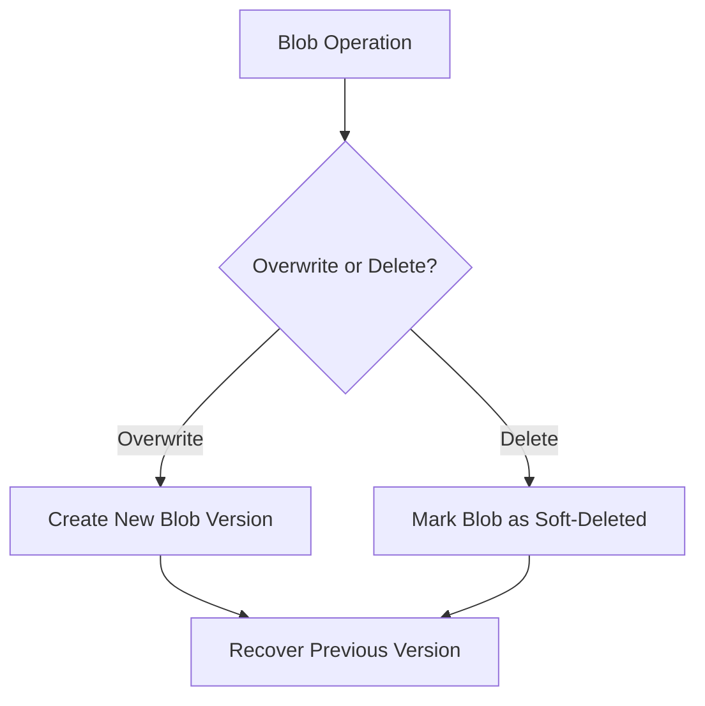

---

## 20. Blob Metadata, Tags, and Properties

### Metadata

Custom key-value pairs associated with a blob.

Example:

```text
department = finance
documentType = invoice
```

### Blob Index Tags

Searchable key-value tags used to classify blobs.

Example:

```text
tenantId = tenant-001
status = approved
retention = long-term
```

### Properties

System-managed or content-related values such as:

- Content type
- Content length
- ETag
- Last modified time
- Content encoding

```mermaid
flowchart TB
    Blob["Blob"] --> Content["Content"]
    Blob --> Metadata["Metadata"]
    Blob --> Tags["Index Tags"]
    Blob --> Properties["System Properties"]
```

---

## 21. Concurrency and ETags

Blob Storage supports concurrency controls.

An ETag identifies a particular version of a blob.

Applications can use conditional operations such as:

```text
Update only if ETag still matches
```

This helps prevent one client from overwriting changes made by another client.

```mermaid
flowchart TD
    ClientA["Client A Reads Blob"] --> ETagA["ETag: A"]
    ClientB["Client B Updates Blob"] --> ETagB["New ETag: B"]

    ClientA --> Update["Client A Attempts Update with ETag A"]
    Update --> Check{"ETag Still A?"}

    Check -- "Yes" --> Success["Update Allowed"]
    Check -- "No" --> Conflict["Reject or Retry"]
```

Use concurrency controls when multiple clients may update the same object.

---

## 22. Event-Driven Blob Processing

Blob creation or modification can trigger events.

Example workflow:

```mermaid
flowchart LR
    Upload["Blob Uploaded"] --> EventGrid["Event Grid Event"]
    EventGrid --> Function["Azure Function"]
    Function --> Process["Resize, Validate, or Scan"]
    Process --> Output["Processed Blob"]
    Process --> Database["Update Metadata Database"]
```

Common use cases:

- Image resizing
- Virus scanning
- Document extraction
- Metadata generation
- Thumbnail creation
- Transcoding
- Data ingestion

---

## 23. Blob Storage and Static Websites

Blob Storage can host static website files such as:

- `index.html`
- `404.html`
- JavaScript
- CSS
- Images
- Fonts

```mermaid
flowchart LR
    Browser["Browser"] --> CDN["Azure Front Door or CDN"]
    CDN --> Static["Blob Static Website Endpoint"]
    Static --> Files["HTML, CSS, JS, Images"]
```

For production static websites, consider:

- HTTPS
- Custom domains
- CDN or Front Door
- Caching
- WAF
- Deployment automation
- Access restrictions
- Cache invalidation

---

## 24. Blob Storage with AKS

AKS Pods commonly access Blob Storage in two ways:

### SDK/API Access

The application uses the Azure Storage SDK.

```mermaid
flowchart LR
    Pod["AKS Pod"] --> WorkloadIdentity["Workload Identity"]
    WorkloadIdentity --> Entra["Microsoft Entra ID"]
    Entra --> Blob["Blob Storage API"]
```

### Mounted Access

Specialized filesystem integrations can mount or expose Blob data, but the application must understand the performance and semantic differences from a normal filesystem.

For most cloud-native applications:

- Use Blob SDK/API for object operations
- Use Azure Files when a shared mounted filesystem is required

---

## 25. Blob Storage and Serverless Applications

Azure Functions can be triggered by Blob Storage events.

```mermaid
flowchart LR
    Blob["Blob Created"] --> Trigger["Blob Trigger or Event Grid"]
    Trigger --> Function["Azure Function"]
    Function --> Process["Process Data"]
    Process --> Output["Write Result to Blob or Database"]
```

Examples:

- Process uploaded images
- Convert documents
- Extract text
- Generate reports
- Validate file formats
- Move files between containers

---

## 26. Blob Storage Security Architecture

```mermaid
flowchart TB
    Client["Client"] --> HTTPS["HTTPS Only"]
    HTTPS --> Gateway["Application or API Gateway"]
    Gateway --> Auth["Authentication and Authorization"]
    Auth --> Identity["Managed Identity or Workload Identity"]
    Identity --> RBAC["Azure RBAC"]
    RBAC --> PrivateEndpoint["Private Endpoint"]
    PrivateEndpoint --> Blob["Blob Storage"]

    Blob --> Logs["Diagnostic Logs"]
    Logs --> SIEM["Security Monitoring"]
```

Recommended controls:

- Disable anonymous access unless explicitly required
- Prefer Entra ID over account keys
- Use least-privilege roles
- Use private endpoints
- Restrict public network access
- Enable HTTPS-only access
- Protect SAS tokens
- Configure expiration policies
- Monitor access logs

---

## 27. SAS Tokens

A Shared Access Signature provides temporary delegated access.

Use SAS when:

- A browser needs direct upload access
- A client needs temporary download access
- You do not want to expose storage account keys
- The application needs scoped delegation

A SAS can limit:

- Container or blob
- Read/write/delete permissions
- Start and expiry time
- IP address
- HTTPS-only access

```mermaid
flowchart TD
    User["User"] --> API["Application API"]
    API --> Validate["Authorize Request"]
    Validate --> SAS["Generate Short-Lived SAS"]
    SAS --> Client["Return Limited URL"]
    Client --> Blob["Direct Blob Upload or Download"]
```

Best practices:

- Use short expiry times
- Grant only required permissions
- Restrict to HTTPS
- Restrict resource scope
- Avoid logging full SAS URLs
- Rotate or revoke where possible
- Prefer user delegation SAS when appropriate

---

## 28. Direct-to-Blob Upload Architecture

For large files, avoid routing all bytes through the application server.

```mermaid
flowchart LR
    User["Browser or Mobile Client"] --> API["Application API"]
    API --> Auth["Authorize Upload"]
    Auth --> SAS["Return Short-Lived Upload SAS"]
    SAS --> Client["Client Uses SAS"]
    Client --> Blob["Upload Directly to Blob Storage"]
    Blob --> Event["Blob Created Event"]
    Event --> Processor["Async Processor"]
```

Benefits:

- Reduces application bandwidth
- Improves upload scalability
- Reduces API server memory usage
- Supports large files
- Enables asynchronous processing

---

## 29. Blob Storage Performance

Performance depends on:

- Blob type
- Object size
- Request rate
- Access pattern
- Parallelism
- Region
- Network path
- Storage account type
- Replication configuration
- Client SDK settings

Optimization techniques:

- Use parallel block uploads
- Use appropriate block sizes
- Avoid excessive small requests
- Use client-side retries with backoff
- Keep compute near storage when possible
- Use CDN for globally accessed content
- Use caching for frequently read objects
- Monitor throttling and latency

```mermaid
flowchart TD
    Workload["Blob Workload"] --> Profile["Profile Request and Object Pattern"]
    Profile --> Upload["Optimize Upload Parallelism"]
    Profile --> Download["Optimize Download and Caching"]
    Profile --> Network["Reduce Network Distance"]
    Profile --> Tier["Choose Access Tier"]
    Upload --> Test["Load Test"]
    Download --> Test
    Network --> Test
    Tier --> Test
```

---

## 30. Blob Storage Cost Optimization

Cost drivers include:

- Capacity stored
- Read and write transactions
- Data retrieval
- Network egress
- Replication
- Storage tier
- Snapshots and versions
- Early deletion or retention considerations

Cost controls:

- Use lifecycle policies
- Delete old versions and snapshots
- Choose correct redundancy
- Use archive for long-term cold data
- Avoid unnecessary cross-region transfer
- Compress large files
- Avoid excessive small-object operations
- Use reserved or committed options where applicable
- Monitor cost by storage account and container

```mermaid
flowchart TD
    Cost["Blob Storage Cost"] --> Storage["Data Capacity"]
    Cost --> Transactions["Read and Write Operations"]
    Cost --> Retrieval["Archive Retrieval"]
    Cost --> Network["Egress"]
    Cost --> Redundancy["Replication"]
    Cost --> Versions["Versions and Snapshots"]

    Storage --> Optimize["Apply Lifecycle and Governance"]
    Transactions --> Optimize
    Retrieval --> Optimize
    Network --> Optimize
    Redundancy --> Optimize
    Versions --> Optimize
```

---

## 31. Data Protection and Compliance

For sensitive data, consider:

- Encryption at rest
- Customer-managed keys
- Private endpoints
- RBAC
- Immutable storage
- Legal hold
- Time-based retention
- Soft delete
- Versioning
- Audit logs
- Data classification
- Regional placement
- Backup and restore testing

```mermaid
flowchart TD
    Data["Sensitive Blob Data"] --> Classify["Classify Data"]
    Classify --> Encrypt["Encrypt Data"]
    Encrypt --> Restrict["Restrict Network and Identity Access"]
    Restrict --> Retain["Apply Retention and Immutability"]
    Retain --> Audit["Audit and Monitor Access"]
    Audit --> Recover["Test Recovery"]
```

---

## 32. Blob Storage vs Azure Files

| Feature | Blob Storage | Azure Files |
|---|---|---|
| Storage model | Object storage | Managed file share |
| Access method | REST, SDK, HTTP/HTTPS | SMB, NFS, REST, SDK |
| Best for | Images, documents, media, backups | Shared directories and mounted filesystems |
| Filesystem semantics | Not the primary model | Native file-share model |
| AKS access | SDK/API or specialized integration | CSI driver and PVC |
| Access tiers | Hot, cool, cold, archive | Standard or premium file-share tiers |
| Large unstructured data | Excellent | Suitable but different model |
| Legacy file-share compatibility | Limited | Strong |

> **Interview answer:**  
> Use Blob Storage for object-based access and Azure Files when the application requires a mounted shared filesystem.

---

## 33. Blob Storage vs Database BLOB Columns

| Requirement | Recommended Option |
|---|---|
| Store large files | Blob Storage |
| Store user profile metadata | Database |
| Search business attributes | Database |
| Store image/document content | Blob Storage |
| Maintain relationship to user/order | Database reference to Blob |
| Transactional business data | Database |
| Large unstructured content | Blob Storage |

Recommended architecture:

```mermaid
flowchart LR
    Application["Application"] --> Database["Database"]
    Application --> Blob["Blob Storage"]

    Database --> Metadata["Blob Name, Owner, Status, Content Type"]
    Blob --> Content["Actual File Content"]
```

Do not store large files in database columns unless there is a strong transactional or compliance reason.

---

## 34. Production Blob Storage Architecture

```mermaid
flowchart TB
    Users["Users"] --> FrontDoor["Azure Front Door or CDN"]
    FrontDoor --> API["Application API"]
    API --> Identity["Managed Identity"]
    Identity --> RBAC["Azure RBAC"]
    RBAC --> Blob["Azure Blob Storage"]

    API --> Database["Metadata Database"]
    Blob --> EventGrid["Event Grid"]
    EventGrid --> Functions["Azure Functions"]
    Functions --> Processing["Image or Document Processing"]

    Blob --> Backup["Backup, Versioning, and Soft Delete"]
    Blob --> Monitor["Azure Monitor and Diagnostic Logs"]
```

---

## 35. Design Example: Document Upload System

### Requirements

- Users upload PDF files
- Files must be private
- Large uploads should not overload the API
- A virus scan is required
- Metadata must be searchable
- Files should be archived after one year

### Design

```mermaid
flowchart TD
    User["User"] --> API["Upload Authorization API"]
    API --> Auth["Authenticate and Authorize"]
    Auth --> SAS["Issue Short-Lived Upload SAS"]
    SAS --> Upload["Direct Upload to Blob"]
    Upload --> Event["Blob Created Event"]
    Event --> Scanner["Virus Scanning Function"]
    Scanner --> Status["Update Document Status"]
    Status --> Database["Store Searchable Metadata"]
    Blob["Blob Storage"] --> Lifecycle["Lifecycle Management"]
    Lifecycle --> Archive["Archive After Retention Period"]
```

### Design Decisions

- Blob Storage stores document content
- Database stores searchable metadata
- SAS enables direct upload
- Event Grid triggers scanning
- Function processes the uploaded document
- Lifecycle management controls retention
- Private access prevents unauthorized downloads

---

## 36. Common Blob Storage Problems

### 401 Unauthorized

Possible causes:

- Missing or invalid token
- Incorrect identity
- Wrong tenant
- Expired SAS
- Incorrect authentication configuration

### 403 Forbidden

Possible causes:

- Identity lacks Storage Blob Data role
- SAS lacks required permission
- Network restrictions deny access
- Anonymous access is disabled
- Resource scope is incorrect

### 404 Not Found

Possible causes:

- Wrong storage account
- Wrong container
- Incorrect blob name
- Case mismatch
- Blob was deleted or moved

### Slow Upload or Download

Possible causes:

- Poor network path
- Large single-threaded request
- Incorrect block size
- Storage throttling
- Cross-region traffic
- Missing CDN or caching

```mermaid
flowchart TD
    Error["Blob Access Error"] --> Code{"Error Code or Symptom?"}

    Code -- "401" --> Auth["Check Token and Identity"]
    Code -- "403" --> Permission["Check RBAC, SAS, and Network Rules"]
    Code -- "404" --> Path["Check Account, Container, and Blob Name"]
    Code -- "Slow" --> Performance["Check Network, Parallelism, Tier, and Throttling"]
```

---

## 37. Useful Troubleshooting Commands

### List Storage Accounts

```bash
az storage account list --output table
```

### List Containers

```bash
az storage container list \
  --account-name <storage-account-name> \
  --auth-mode login \
  --output table
```

### List Blobs

```bash
az storage blob list \
  --account-name <storage-account-name> \
  --container-name <container-name> \
  --auth-mode login \
  --output table
```

### Upload a Blob

```bash
az storage blob upload \
  --account-name <storage-account-name> \
  --container-name <container-name> \
  --name example.txt \
  --file ./example.txt \
  --auth-mode login
```

### Download a Blob

```bash
az storage blob download \
  --account-name <storage-account-name> \
  --container-name <container-name> \
  --name example.txt \
  --file ./downloaded-example.txt \
  --auth-mode login
```

### View Kubernetes Pod Events

```bash
kubectl describe pod <pod-name> -n <namespace>
```

---

## 38. Interview Questions and Strong Answers

### Q1: What is Azure Blob Storage?

**Answer:** Azure Blob Storage is Microsoft's object-storage service for massive amounts of unstructured data such as images, documents, videos, logs, and backups.

### Q2: What is the hierarchy of Blob Storage?

**Answer:** The hierarchy is storage account, container, and blob. The storage account provides the namespace, the container groups related objects, and the blob contains the actual data.

### Q3: What are the different blob types?

**Answer:** The main blob types are block blobs, append blobs, and page blobs. Block blobs are used for general files, append blobs are optimized for append operations such as logs, and page blobs support random-access patterns such as virtual disk files.

### Q4: What is a container?

**Answer:** A container is a logical grouping of blobs inside a storage account. It is similar to a folder conceptually but is not a traditional filesystem directory.

### Q5: How do applications access Blob Storage?

**Answer:** Applications can use HTTPS, REST APIs, Azure SDKs, Azure CLI, PowerShell, Storage Explorer, managed identities, or SAS tokens.

### Q6: How do you secure Blob Storage?

**Answer:** Use Microsoft Entra ID, managed identity or Workload Identity, Azure RBAC, least privilege, private endpoints, HTTPS-only access, restricted public network access, and diagnostic logging.

### Q7: What is the difference between an account key and SAS?

**Answer:** An account key provides broad access to the storage account. A SAS provides delegated, limited access with restrictions such as resource, permission, time, IP range, and protocol.

### Q8: What are Blob Storage access tiers?

**Answer:** Hot is for frequently accessed data, cool and cold are for less frequently accessed online data, and archive is for long-term rarely accessed data with slower retrieval and different access costs.

### Q9: How do you reduce Blob Storage costs?

**Answer:** Use lifecycle management, select the correct access tier and redundancy, delete obsolete versions and snapshots, reduce unnecessary egress, compress data, and monitor transaction and retrieval costs.

### Q10: How do you make Blob Storage highly available?

**Answer:** Choose an appropriate redundancy option such as zone or geo redundancy, use retry policies, enable data-protection features, configure backups, and test recovery procedures.

### Q11: How can a browser upload directly to Blob Storage?

**Answer:** The application authenticates the user and issues a short-lived, scoped SAS URL. The browser then uploads directly to Blob Storage without sending the entire file through the application server.

### Q12: How do you trigger processing after a blob upload?

**Answer:** Use Blob events through Event Grid, Blob-triggered Functions, Logic Apps, or another event-processing service.

### Q13: Should you store large files in SQL Database?

**Answer:** Usually no. Store the file content in Blob Storage and store metadata and the Blob reference in the database.

### Q14: How do AKS Pods access Blob Storage?

**Answer:** Prefer Workload Identity with Microsoft Entra ID and Azure RBAC. The application can use the Azure Storage SDK or REST API to read and write blobs.

### Q15: What is the difference between Blob Storage and Azure Files?

**Answer:** Blob Storage is object storage accessed through APIs, while Azure Files is a managed shared filesystem accessed through SMB or NFS.

---

## 39. 60-Second Interview Pitch

> Azure Blob Storage is Microsoft's object-storage service for storing massive amounts of unstructured data such as images, documents, videos, backups, logs, and analytics files. Its resource hierarchy is storage account, container, and blob. Applications access it through HTTPS, REST APIs, SDKs, managed identities, or scoped SAS tokens. For production, I use Microsoft Entra ID and managed identity with least-privilege RBAC, private endpoints where required, encryption, diagnostic logging, and lifecycle policies. I choose access tiers based on how frequently data is read and select redundancy based on RTO and RPO requirements. In application architecture, I store file content in Blob Storage and searchable business metadata in a database. Events such as blob creation can trigger asynchronous processing through Event Grid or Azure Functions.

---

## 40. Final Revision Checklist

- [ ] Blob Storage is Azure object storage
- [ ] It is optimized for unstructured data
- [ ] The hierarchy is storage account, container, and blob
- [ ] Block blobs are used for most general files
- [ ] Append blobs suit append-heavy workloads
- [ ] Page blobs support random-access patterns
- [ ] Applications use HTTPS, REST, SDKs, CLI, or PowerShell
- [ ] Microsoft Entra ID is preferred for identity-based access
- [ ] Managed identities avoid storing credentials
- [ ] SAS provides temporary delegated access
- [ ] Storage account keys provide broad access
- [ ] Use least-privilege Azure RBAC
- [ ] Protect storage with private endpoints where required
- [ ] Use HTTPS-only access
- [ ] Disable anonymous access unless explicitly required
- [ ] Understand hot, cool, cold, and archive tiers
- [ ] Use lifecycle management for automated tiering
- [ ] Select redundancy according to RTO and RPO
- [ ] Use versioning and soft delete for recovery
- [ ] Use Event Grid or Functions for event-driven processing
- [ ] Store large files in Blob Storage, not normally in database columns
- [ ] Store searchable business metadata in a database
- [ ] Use Workload Identity for AKS access
- [ ] Monitor latency, errors, throttling, and costs
- [ ] Test backup, restore, and failover procedures

---

## One-Line Conclusion

> Azure Blob Storage is a scalable, secure, and durable object-storage service for storing unstructured data through HTTP, REST APIs, SDKs, and identity-based access controls.