# What Is an Azure Storage Account?
## Detailed Interview Preparation Guide with Flow Charts

---

## 1. Direct Interview Answer

An **Azure Storage Account** is a unique namespace and management boundary in Azure that contains Azure Storage data services such as:

- Blob Storage
- Azure Files
- Queue Storage
- Table Storage
- Azure Data Lake Storage Gen2, when hierarchical namespace is enabled

A storage account defines important settings for the data it contains, including:

- Region
- Performance tier
- Redundancy
- Security configuration
- Network access
- Encryption
- Data protection
- Billing and monitoring

> **One-line interview answer:**  
> **An Azure Storage Account is the top-level Azure resource that provides a secure, scalable namespace and management boundary for blobs, files, queues, tables, and related storage services.**

A storage account exposes service endpoints that applications can access over HTTP or HTTPS. ([learn.microsoft.com](https://learn.microsoft.com/en-in/azure/storage/common/storage-account-overview?utm_source=openai))

---

## 2. Why Is a Storage Account Needed?

Applications need a durable and scalable place to store data independently from compute resources.

Without a storage account, applications would commonly depend on:

- Local virtual-machine disks
- Application server filesystems
- Manually managed file servers
- Database BLOB columns
- Developer-managed storage infrastructure

A storage account provides:

- Centralized storage
- Independent scaling
- Durable data storage
- Redundancy options
- Identity-based access
- Network controls
- Monitoring
- Lifecycle management
- Cost management

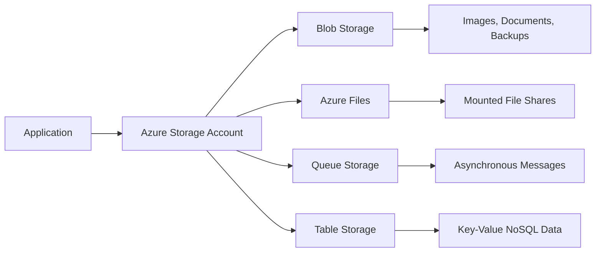

---

## 3. Storage Account Architecture

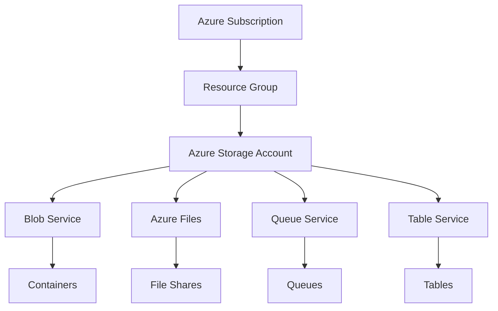

The hierarchy is:

```text
Azure Subscription
        ↓
Resource Group
        ↓
Storage Account
        ↓
Storage Service
        ↓
Storage Resource
        ↓
Data
```

Examples:

```text
Storage Account
  ├── Blob Container
  │     └── Blob Objects
  ├── File Share
  │     └── Files and Directories
  ├── Queue
  │     └── Messages
  └── Table
        └── Entities
```

---

## 4. Storage Services in a Storage Account

## 4.1 Blob Storage

Blob Storage is object storage for unstructured data.

Use it for:

- Images
- Videos
- Documents
- Backups
- Logs
- Static website files
- Data-lake files
- Machine-learning datasets

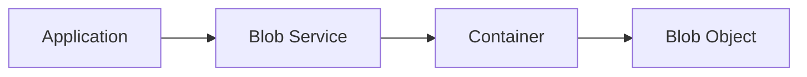

---

## 4.2 Azure Files

Azure Files provides managed cloud file shares.

Use it for:

- SMB file shares
- NFS file shares
- Shared application directories
- Lift-and-shift applications
- Persistent shared storage for containers
- Hybrid file-share scenarios

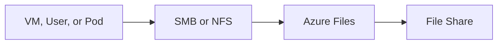

---

## 4.3 Queue Storage

Queue Storage provides asynchronous message storage.

Use it for:

- Background processing
- Work queues
- Decoupling services
- Retry workflows
- Simple asynchronous communication

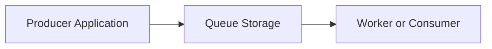

---

## 4.4 Table Storage

Table Storage provides a schemaless NoSQL data store for structured key-value data.

Use it for:

- Simple NoSQL applications
- Metadata
- Device data
- Configuration records
- Large collections of structured entities

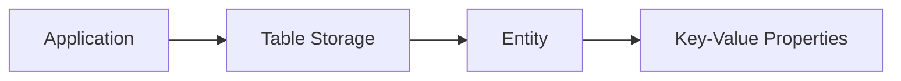

---

## 5. Storage Account Name and Endpoint

A storage account name provides the namespace for the storage data.

A typical Blob endpoint looks like:

```text
https://<storage-account-name>.blob.core.windows.net
```

Other service endpoints include:

```text
https://<storage-account-name>.file.core.windows.net
https://<storage-account-name>.queue.core.windows.net
https://<storage-account-name>.table.core.windows.net
```

A storage account name must be globally unique within the Azure namespace and typically uses lowercase letters and numbers. Microsoft documentation states that standard storage account names are between 3 and 24 characters. ([learn.microsoft.com](https://learn.microsoft.com/en-us/azure/storage/common/storage-account-create?utm_source=openai))

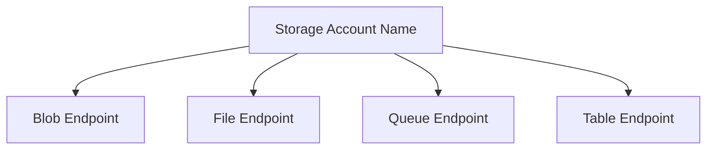

---

## 6. Storage Account Types

For most modern workloads, use the **Standard general-purpose v2** storage account.

Common account types include:

| Account Type | Typical Use |
|---|---|
| Standard general-purpose v2 | General blobs, files, queues, tables, and Data Lake Storage |
| Premium block blobs | High-performance block blob workloads |
| Premium file shares | High-performance Azure Files workloads |
| Premium page blobs | High-performance page blob workloads |
| Legacy general-purpose v1 | Older workloads; generally avoid for new designs |
| Legacy Blob Storage | Older Blob-only scenarios; generally avoid for new designs |

Microsoft recommends Standard general-purpose v2 for most Azure Storage scenarios. Premium accounts should be selected when the workload requires lower latency or higher performance. ([learn.microsoft.com](https://learn.microsoft.com/en-us/azure/storage/common/storage-account-create?utm_source=openai))

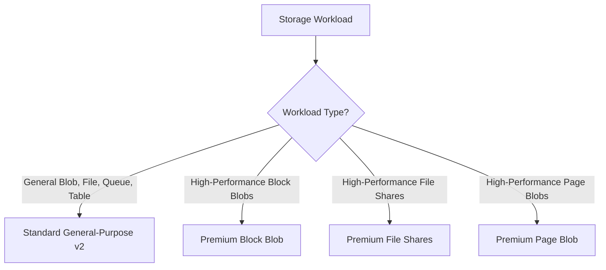

---

## 7. Performance Tiers

Storage accounts generally use one of two performance models:

### Standard

Suitable for:

- General-purpose applications
- Most Blob Storage workloads
- Standard file shares
- Queues and tables
- Backup and archive workloads
- Cost-sensitive systems

### Premium

Suitable for:

- Low-latency applications
- High transaction rates
- High IOPS requirements
- Premium block blobs
- Premium file shares
- Premium page blobs

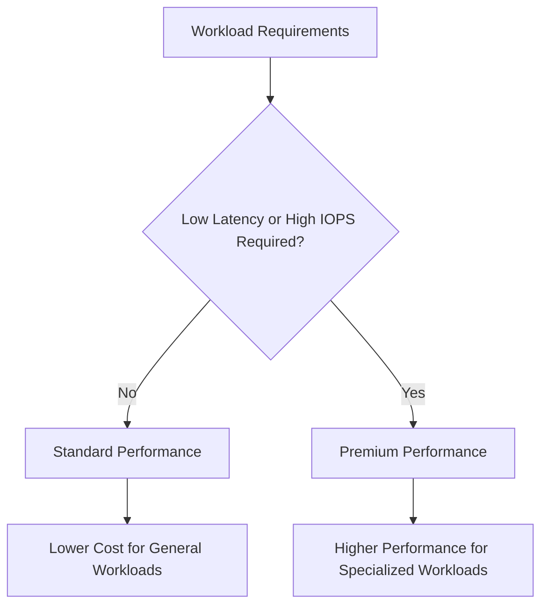

> **Interview point:**  
> Do not select Premium only because it is faster. Select it when measured latency, IOPS, throughput, or workload requirements justify the additional cost.

---

## 8. Storage Redundancy

Redundancy determines how many copies of data Azure maintains and where those copies are located.

Common options include:

- LRS
- ZRS
- GRS
- RA-GRS
- GZRS
- RA-GZRS

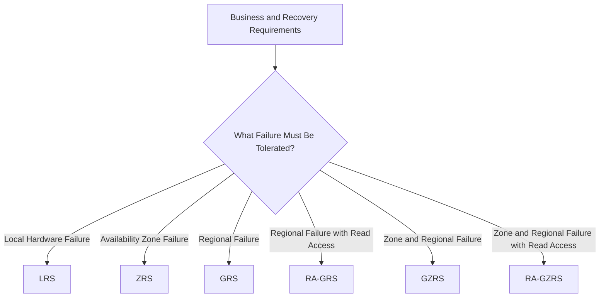

### 8.1 LRS — Locally Redundant Storage

Maintains copies within a single physical datacenter in the primary region.

Use when:

- Data can be reconstructed
- Regional replication is not required
- Cost is the primary concern
- Governance limits data to one region

### 8.2 ZRS — Zone-Redundant Storage

Replicates data synchronously across availability zones in the primary region.

Use when:

- The workload must survive a zone failure
- Low-latency access within the region is important
- Regional disaster recovery is handled separately

### 8.3 GRS — Geo-Redundant Storage

Replicates data to a paired secondary region asynchronously.

Use when:

- Protection from regional failure is required
- Read access to the secondary is not required during normal operation

### 8.4 RA-GRS — Read-Access Geo-Redundant Storage

Provides read access to the secondary region.

Use when:

- The application needs read availability from the secondary during primary-region disruption

### 8.5 GZRS — Geo-Zone-Redundant Storage

Combines zone redundancy in the primary region with geo-replication to a secondary region.

### 8.6 RA-GZRS — Read-Access Geo-Zone-Redundant Storage

Combines zone redundancy, geo-replication, and read access to the secondary.

Azure Storage redundancy should be selected according to availability, durability, disaster-recovery, latency, compliance, and cost requirements. ([learn.microsoft.com](https://learn.microsoft.com/azure/storage/common/storage-redundancy?utm_source=openai))

---

## 9. Redundancy Decision Flow

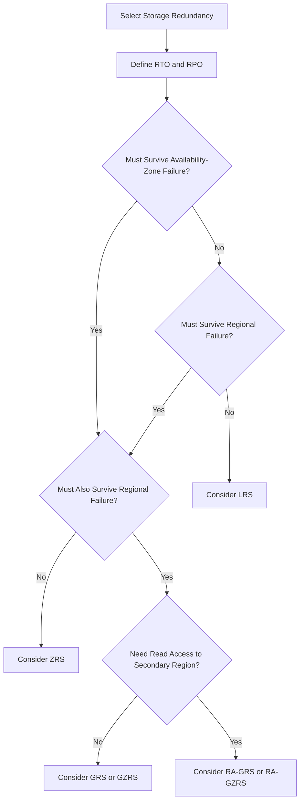

> **Important:**  
> Geo-redundancy is not the same as ransomware protection. If malicious deletion or corruption is replicated, the secondary copy may also be affected. Use soft delete, versioning, immutable storage, backups, and tested recovery procedures for stronger protection. ([learn.microsoft.com](https://learn.microsoft.com/en-us/azure/storage/common/secure-storage?utm_source=openai))

---

## 10. Hierarchical Namespace and Data Lake Storage

A StorageV2 account can enable a **hierarchical namespace** to support Azure Data Lake Storage Gen2 capabilities.

This provides:

- Directory-oriented organization
- File and directory-level access control
- Better data organization for analytics
- Compatibility with many big-data frameworks

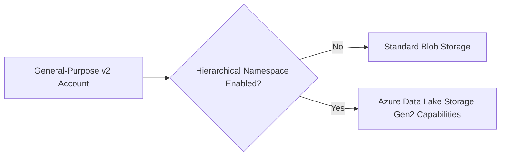

Use hierarchical namespace when the account is designed for:

- Analytics
- Big-data processing
- Data lakes
- Machine learning data platforms
- Directory and ACL-oriented access

The decision should be made early because account configuration choices can affect supported features and migration options. ([learn.microsoft.com](https://learn.microsoft.com/en-us/azure/storage/common/storage-account-create?utm_source=openai))

---

## 11. Storage Account Security Model

A storage account is an important security and policy boundary.

Security controls include:

- Microsoft Entra ID
- Azure RBAC
- Managed identities
- Workload identity
- Shared Access Signatures
- Storage account keys
- Private endpoints
- Storage firewalls
- Encryption
- Soft delete
- Versioning
- Immutable storage
- Diagnostic logging
- Azure Policy

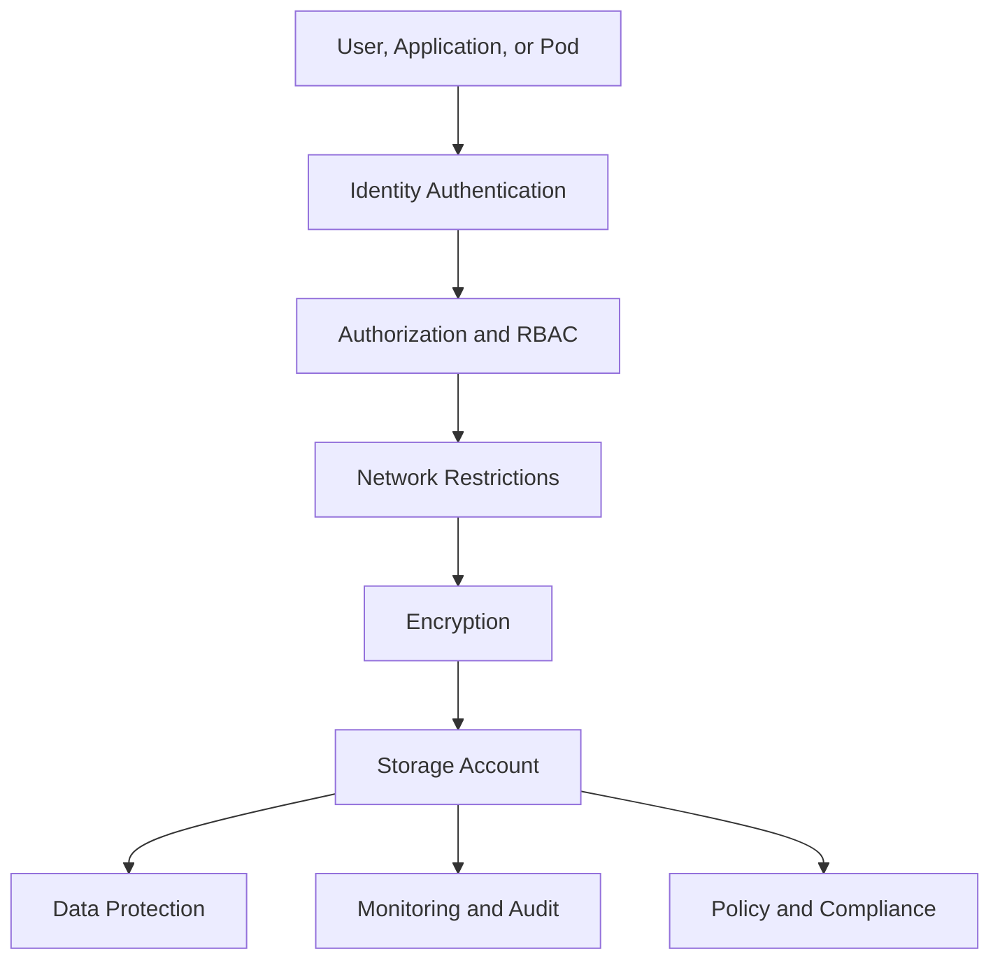

Microsoft recommends separating accounts by environment, workload, sensitivity, and region when that improves least privilege, isolation, or compliance. ([learn.microsoft.com](https://learn.microsoft.com/en-us/azure/storage/common/secure-storage?utm_source=openai))

---

## 12. Authentication and Authorization

### Authentication

Authentication determines who or what is requesting access.

Common identities include:

- Microsoft Entra users
- Service principals
- Managed identities
- AKS Workload Identity
- Storage account keys
- SAS tokens

### Authorization

Authorization determines what the identity can do.

Examples:

- Read blobs
- Write blobs
- Delete files
- Send queue messages
- Read table entities
- Manage the storage account

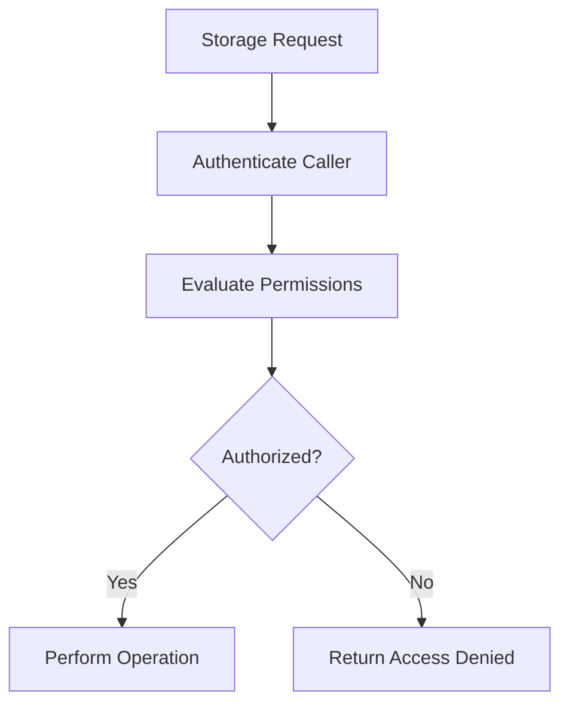

> **Interview answer:**  
> Prefer Microsoft Entra ID with managed identity or Workload Identity for applications. Avoid using long-lived storage account keys as application credentials.

---

## 13. Network Security

Storage accounts can be accessed through public endpoints or private networking.

Common network controls include:

- Private endpoints
- Storage firewalls
- Virtual network rules
- IP allowlists
- Service endpoints
- Private DNS
- HTTPS-only traffic
- Restricted public network access

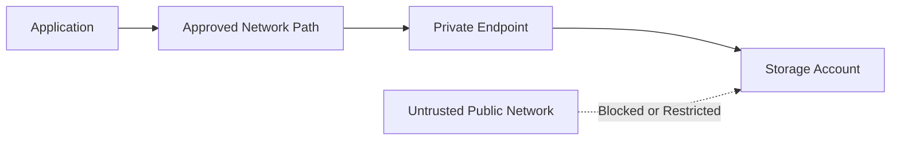

A private endpoint maps a private IP address in a virtual network to the storage service.

> **Interview point:**  
> A storage account can be identity-secured and network-secured at the same time. Identity controls who can access data; network controls where the request can originate.

---

## 14. Encryption

Azure Storage protects data using encryption at rest.

Encryption options may include:

- Microsoft-managed keys
- Customer-managed keys
- Infrastructure encryption for applicable scenarios

Data should also be protected in transit using:

- HTTPS
- TLS
- Secure SMB configurations where applicable

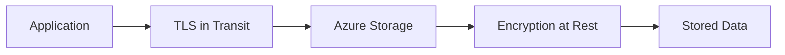

Use customer-managed keys when the organization requires additional control over key lifecycle, rotation, access, or compliance.

---

## 15. Data Protection Features

Depending on the storage service, use:

- Blob soft delete
- Container soft delete
- Blob versioning
- Point-in-time restore
- File-share soft delete
- File-share snapshots
- Immutable storage
- Legal hold
- Time-based retention
- Backup
- Change feed

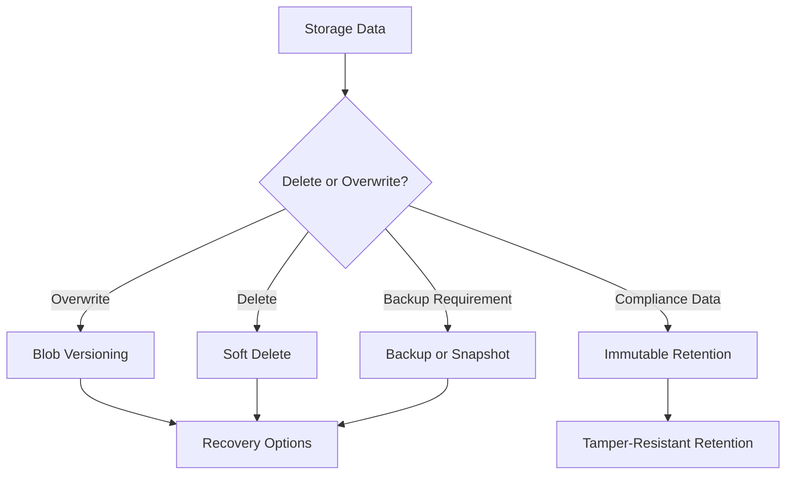

---

## 16. Storage Account Endpoints

A storage account can expose service-specific endpoints.

Examples:

```text
Blob:
https://<account>.blob.core.windows.net

File:
https://<account>.file.core.windows.net

Queue:
https://<account>.queue.core.windows.net

Table:
https://<account>.table.core.windows.net

Data Lake:
https://<account>.dfs.core.windows.net
```

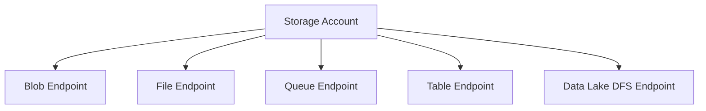

Applications can use:

- Azure SDKs
- REST APIs
- Azure CLI
- PowerShell
- Storage Explorer
- AzCopy
- Data-movement tools

---

## 17. Storage Account Configuration Decisions

When creating a storage account, evaluate:

1. Account type
2. Region
3. Performance tier
4. Redundancy
5. Hierarchical namespace
6. Access tier
7. Network access
8. Public access
9. Identity and RBAC
10. Encryption and key management
11. Data protection
12. Diagnostic logging
13. Tags and governance
14. Cost and lifecycle policy

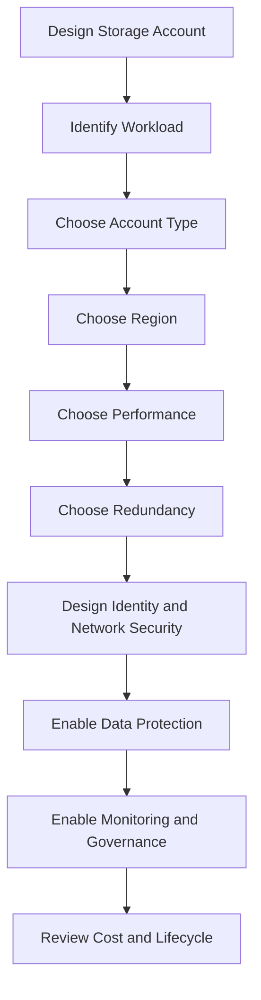

---

## 18. Storage Account Design Principle: Separate by Boundary

Do not place every workload in one storage account automatically.

Separate accounts when workloads have different:

- Security requirements
- Environments
- Regions
- Redundancy requirements
- Performance requirements
- Lifecycle policies
- Cost owners
- Compliance classifications

Example:

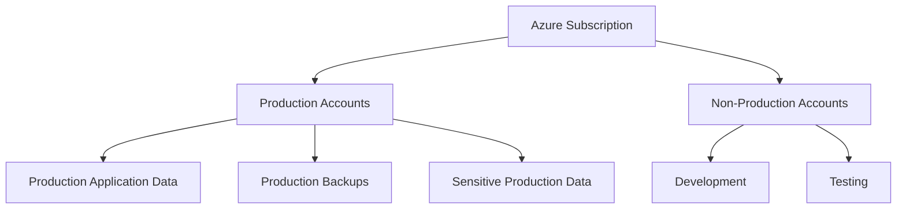

### Why Separate Accounts?

A storage account is a shared:

- Security boundary
- Redundancy boundary
- Network policy boundary
- Billing and governance boundary
- Blast-radius boundary

Microsoft recommends separating accounts when different workloads have different security, compliance, redundancy, or regional requirements. ([learn.microsoft.com](https://learn.microsoft.com/en-us/azure/storage/common/secure-storage?utm_source=openai))

---

## 19. Storage Account and Resource Group

A storage account is an Azure Resource Manager resource and must belong to a resource group.

```mermaid
flowchart LR
    Subscription["Subscription"] --> ResourceGroup["Resource Group"]
    ResourceGroup --> StorageAccount["Storage Account"]
```

A resource group is useful for:

- Lifecycle management
- Role assignments
- Tags
- Policy scope
- Deployment automation
- Cost organization

The storage account and its consumers do not always need to be in the same resource group, but organizational and lifecycle relationships should be considered.

---

## 20. Storage Account and Region

A storage account has a primary Azure region.

Region selection affects:

- Latency
- Data residency
- Availability-zone options
- Redundancy choices
- Cost
- Compliance
- Disaster recovery

```mermaid
flowchart TD
    Workload["Application Workload"] --> Region["Select Nearby Region"]
    Region --> Latency["Reduce Network Latency"]
    Region --> Compliance["Meet Data Residency Requirements"]
    Region --> Redundancy["Choose Regional Resilience"]
```

For multi-region systems:

- Use regional storage accounts where appropriate
- Consider geo-redundancy
- Consider object replication
- Plan failover and failback
- Avoid unnecessary cross-region traffic

---

## 21. Storage Account and Cost

Storage account cost can depend on:

- Data capacity
- Performance tier
- Redundancy
- Transactions
- Data retrieval
- Data egress
- Snapshots
- Versions
- File-share provisioned capacity
- Access tier
- Region

```mermaid
flowchart TD
    Cost["Storage Account Cost"] --> Capacity["Stored Capacity"]
    Cost --> Performance["Performance Tier"]
    Cost --> Redundancy["Redundancy"]
    Cost --> Transactions["Transactions"]
    Cost --> Egress["Data Egress"]
    Cost --> Protection["Versions, Snapshots, and Backups"]
```

Cost optimization techniques:

- Select the correct performance tier
- Use lifecycle policies
- Delete obsolete data
- Avoid unnecessary replication
- Co-locate compute and storage where appropriate
- Monitor egress
- Separate cost ownership with tags
- Review unused accounts and containers

Microsoft identifies capacity, redundancy, transactions, and data egress as important Azure Storage billing factors. ([learn.microsoft.com](https://learn.microsoft.com/en-in/azure/storage/common/storage-account-overview?utm_source=openai))

---

## 22. Storage Account Lifecycle

```mermaid
stateDiagram-v2
    [*] --> Planned
    Planned --> Created
    Created --> Configured
    Configured --> InUse
    InUse --> Monitored
    Monitored --> Optimized
    Optimized --> Retained
    Retained --> Deleted
    Deleted --> [*]
```

Lifecycle activities include:

- Design
- Provisioning
- Security configuration
- Application integration
- Monitoring
- Cost optimization
- Backup and recovery
- Access review
- Decommissioning

---

## 23. Azure Storage Account with AKS

AKS Pods can use a storage account in different ways.

### Blob Access

The application uses an SDK or REST API.

```mermaid
flowchart LR
    Pod["AKS Pod"] --> WorkloadIdentity["Workload Identity"]
    WorkloadIdentity --> Entra["Microsoft Entra ID"]
    Entra --> Blob["Blob Endpoint"]
```

### Azure Files Access

The Pod mounts an Azure File share through a PersistentVolumeClaim.

```mermaid
flowchart LR
    Pod["AKS Pod"] --> PVC["PersistentVolumeClaim"]
    PVC --> CSI["Azure Files CSI Driver"]
    CSI --> FileShare["Azure File Share"]
```

### Queue Access

The application uses Queue Storage through an SDK or API.

```mermaid
flowchart LR
    Pod["Worker Pod"] --> QueueSDK["Queue SDK"]
    QueueSDK --> Queue["Queue Storage"]
```

> **Interview point:**  
> The storage account is the Azure resource boundary. Blob, file, queue, and table access patterns are service-specific.

---

## 24. Storage Account vs Container

| Feature | Storage Account | Container |
|---|---|---|
| Scope | Top-level Azure Storage resource | Logical grouping inside Blob Storage |
| Contains | Blobs, files, queues, tables | Blobs |
| Defines region | Yes | No |
| Defines redundancy | Yes | No |
| Defines network rules | Yes | No |
| Defines billing boundary | Main billing and management boundary | Logical data grouping |
| Provides endpoint | Yes | Uses account endpoint |
| Can have RBAC scope | Yes | Sometimes narrower data access scope |
| Example | `mystorageprod` | `images` |

> **Interview answer:**  
> A storage account is the Azure management and data namespace. A Blob container is only a logical grouping of blobs inside the account.

---

## 25. Storage Account vs Blob Storage

| Feature | Storage Account | Blob Storage |
|---|---|---|
| Meaning | Top-level Azure Storage resource | Object-storage service |
| Contains | Blob, file, queue, and table services | Containers and blobs |
| Scope | Account-wide | Blob-service-specific |
| Configuration | Region, redundancy, network, encryption | Blob type, tier, metadata, lifecycle |
| Example | `mystorageaccount` | `images/product.jpg` |

```mermaid
flowchart LR
    Account["Storage Account"] --> BlobService["Blob Storage Service"]
    BlobService --> Container["Container"]
    Container --> Blob["Blob"]
```

---

## 26. Storage Account vs Azure Managed Disk

| Feature | Storage Account | Managed Disk |
|---|---|---|
| Primary purpose | General Azure Storage services | VM block storage |
| Contains | Blobs, files, queues, tables | Disk volumes |
| Access model | APIs, protocols, SDKs | Attached to VM or supported workload |
| Typical use | Objects, shares, queues, tables | OS and data disks |
| Management | Storage account settings | Disk resource and VM attachment |

Modern managed disks are not normally designed as application-accessible storage-account blobs.

---

## 27. Storage Account vs Database

| Requirement | Storage Account | Database |
|---|---|---|
| Large unstructured files | Excellent | Usually not preferred |
| Relational queries | No | Yes |
| Transactions across rows | No | Yes |
| Object/file storage | Yes | Possible but often inefficient |
| Metadata and business relationships | Limited | Excellent |
| High-volume media storage | Excellent | Usually not preferred |
| Structured transactional data | Not primary use | Excellent |

A common architecture stores:

- File content in Blob Storage
- Searchable metadata in a database
- Processing state in a queue or database

```mermaid
flowchart LR
    Application["Application"] --> Blob["Blob Storage for File Content"]
    Application --> Database["Database for Metadata"]
    Application --> Queue["Queue Storage for Async Processing"]
```

---

## 28. Example: Document Management System

### Requirements

- Users upload documents
- Documents must be private
- Metadata must be searchable
- Documents are scanned asynchronously
- Old documents are archived
- The application runs on AKS

### Design

```mermaid
flowchart TD
    User["User"] --> API["Application API"]
    API --> Identity["Authentication and Authorization"]
    Identity --> Blob["Private Blob Container"]
    API --> Database["Document Metadata Database"]

    Blob --> Event["Blob Created Event"]
    Event --> Worker["AKS Worker or Azure Function"]
    Worker --> Scan["Virus and Content Scan"]
    Scan --> Database
    Blob --> Lifecycle["Lifecycle Management"]
    Lifecycle --> Archive["Archive Older Documents"]
```

### Storage Account Configuration

- Standard general-purpose v2
- Appropriate redundancy
- Private endpoint
- Public access disabled
- Managed identity or Workload Identity
- Blob soft delete
- Versioning
- Lifecycle policy
- Diagnostic logs
- Separate production account

---

## 29. Common Storage Account Mistakes

1. Using one storage account for every environment
2. Storing production and development data together
3. Selecting redundancy without defining RTO and RPO
4. Using storage account keys as permanent application credentials
5. Allowing public access unintentionally
6. Ignoring private endpoint DNS
7. Using Premium storage without a measured need
8. Storing secrets in Blob Storage instead of Key Vault
9. Ignoring lifecycle and retention costs
10. Treating a storage account as a traditional filesystem
11. Forgetting that account settings affect contained services
12. Assuming geo-redundancy protects against ransomware
13. Using cross-region storage without considering egress
14. Not enabling logging and data-protection features
15. Failing to test restore and failover procedures

---

## 30. Interview Questions and Strong Answers

### Q1: What is an Azure Storage Account?

**Answer:** An Azure Storage Account is a top-level Azure resource that provides a unique namespace and management boundary for Blob Storage, Azure Files, Queue Storage, Table Storage, and related data services.

### Q2: What services can a storage account contain?

**Answer:** It can contain blobs, file shares, queues, and tables. A general-purpose v2 account can also support Azure Data Lake Storage Gen2 when hierarchical namespace is enabled.

### Q3: What is the most commonly used storage account type?

**Answer:** Standard general-purpose v2 is the default recommendation for most workloads because it supports blobs, files, queues, tables, and multiple redundancy options.

### Q4: What is the difference between Standard and Premium storage?

**Answer:** Standard is intended for general-purpose workloads and cost efficiency. Premium is intended for workloads requiring lower latency, higher IOPS, or specialized performance.

### Q5: What is the difference between LRS and GRS?

**Answer:** LRS maintains redundant copies within the primary region, while GRS also asynchronously replicates data to a secondary paired region.

### Q6: What is ZRS?

**Answer:** ZRS synchronously replicates data across availability zones in the primary Azure region to protect against a zone-level failure.

### Q7: What is GZRS?

**Answer:** GZRS combines zone redundancy in the primary region with geo-replication to a secondary region.

### Q8: How do you secure a storage account?

**Answer:** Use Microsoft Entra ID, managed identities, least-privilege RBAC, private endpoints, storage firewalls, HTTPS, encryption, soft delete, versioning, diagnostic logging, and policy enforcement.

### Q9: Should applications use storage account keys?

**Answer:** Avoid using long-lived account keys as application credentials. Prefer Microsoft Entra ID with managed identities or Workload Identity. Use SAS only for controlled delegated access.

### Q10: Can one storage account contain Blob Storage and Azure Files?

**Answer:** Yes, a general-purpose v2 storage account can support multiple Azure Storage services. However, separate accounts may be better when workloads have different security, redundancy, region, or performance requirements.

### Q11: What is a storage account endpoint?

**Answer:** It is the service URL used to access data, such as the Blob endpoint, File endpoint, Queue endpoint, or Table endpoint.

### Q12: What factors affect storage-account cost?

**Answer:** Capacity, performance tier, redundancy, transactions, data retrieval, data egress, snapshots, versions, and provisioned file-share capacity can affect cost.

### Q13: When would you create separate storage accounts?

**Answer:** I create separate accounts when environments, regions, sensitivity levels, redundancy requirements, performance requirements, cost ownership, or compliance boundaries differ.

### Q14: What is hierarchical namespace?

**Answer:** Hierarchical namespace enables Azure Data Lake Storage Gen2 capabilities, including directory-oriented organization and filesystem-style access controls for analytics workloads.

### Q15: Does geo-redundancy protect against ransomware?

**Answer:** Not by itself. Geo-replication can replicate deletion or corruption, so it should be combined with soft delete, versioning, immutability, backups, and tested recovery procedures.

### Q16: How do AKS Pods access a storage account?

**Answer:** Pods access Blob, Queue, or Table services through SDKs or APIs using Workload Identity and RBAC. Pods access Azure Files through the CSI driver and PersistentVolumeClaims when a mounted filesystem is required.

---

## 31. Scenario-Based Interview Answer

### Scenario

A company needs to store:

- User-uploaded documents
- Shared files for a legacy application
- Background-processing messages
- Analytics data

### Recommended Design

```mermaid
flowchart TB
    Storage["Azure Storage Design"] --> Blob["Blob Container for Documents"]
    Storage --> Files["Azure Files Share for Legacy Application"]
    Storage --> Queue["Queue for Background Messages"]
    Storage --> ADLS["Hierarchical Namespace for Analytics"]

    Blob --> Documents["User Documents"]
    Files --> Legacy["Mounted Shared Files"]
    Queue --> Workers["Worker Applications"]
    ADLS --> Analytics["Data Engineering and Analytics"]
```

### Design Discussion

A single general-purpose v2 account might support these services, but separate accounts may be preferable if the workloads require different:

- Redundancy
- Performance
- Security
- Lifecycle
- Region
- Cost ownership

The correct answer depends on the workload boundary and operational requirements.

---

## 32. 60-Second Interview Pitch

> An Azure Storage Account is the top-level Azure resource that provides a unique namespace and management boundary for storage services such as Blob Storage, Azure Files, Queue Storage, Table Storage, and Azure Data Lake Storage Gen2. When designing one, I first identify the workload, then choose the account type, region, performance tier, redundancy, network model, identity model, and data-protection settings. For most general workloads, I use a Standard general-purpose v2 account. I prefer Microsoft Entra ID with managed identities or Workload Identity over long-lived storage keys, use private endpoints for sensitive data, and enable soft delete, versioning, logging, and lifecycle policies. I separate accounts by environment, region, security boundary, or redundancy requirement when sharing one account would increase blast radius or make governance difficult.

---

## 33. Final Revision Checklist

- [ ] A storage account is a top-level Azure Storage resource
- [ ] It provides a unique namespace
- [ ] It can contain blobs, files, queues, and tables
- [ ] StorageV2 is the common modern account type
- [ ] Premium accounts are for specialized performance needs
- [ ] Region affects latency, compliance, cost, and redundancy
- [ ] LRS protects within a local datacenter
- [ ] ZRS protects against availability-zone failure
- [ ] GRS protects against regional failure
- [ ] RA-GRS provides read access to the secondary region
- [ ] GZRS combines zone and geo-redundancy
- [ ] HNS enables Data Lake Storage Gen2 capabilities
- [ ] Account settings affect contained storage services
- [ ] Storage accounts provide service-specific endpoints
- [ ] Microsoft Entra ID is preferred for application access
- [ ] Managed identities avoid embedded credentials
- [ ] Workload Identity is useful for AKS Pods
- [ ] Private endpoints restrict network paths
- [ ] Public access should be disabled unless required
- [ ] Storage account keys provide broad access
- [ ] SAS should be scoped and short-lived
- [ ] Soft delete and versioning improve recovery
- [ ] Geo-redundancy is not complete ransomware protection
- [ ] Capacity, transactions, egress, and replication affect cost
- [ ] Separate accounts can reduce blast radius and improve governance
- [ ] Backup and failover procedures must be tested

---

## One-Line Conclusion

> An Azure Storage Account is the secure, scalable, and configurable top-level resource that organizes and manages Azure Blob, File, Queue, Table, and Data Lake Storage services.