# Advanced Microservices Interview Questions & Answers — Experienced Developers (Part 2)
## Advanced Microservices Interview Questions & Answers — Experienced Developers (Part 2)

> **Target:** Senior .NET Developer / Technical Lead / Solution Architect interviews  
> **Focus:** Architecture, DDD, CQRS, Saga, event-driven design, messaging reliability, Azure, OAuth2, Kubernetes and AKS

---

## 1. Explain a complete Microservices architecture you designed.

For an experienced interview, do not simply list services. Explain **business boundaries, communication, data ownership, security, resiliency, observability and deployment**.

### Example: Order Management Platform

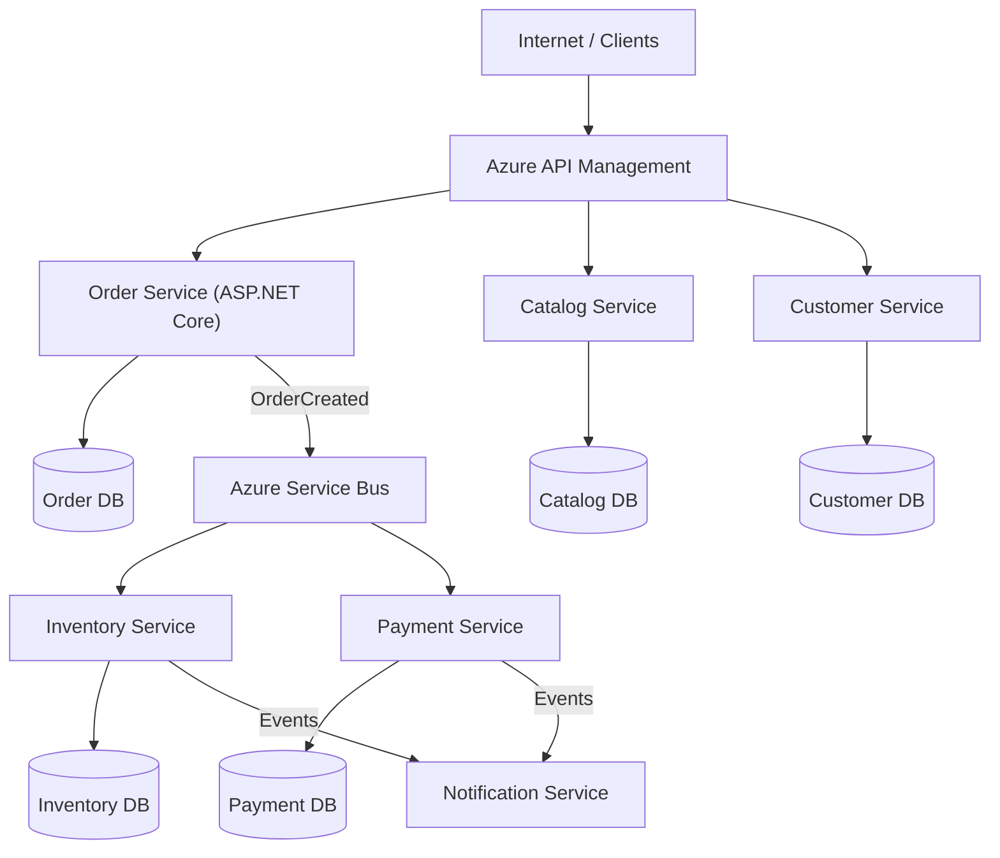


### Key design decisions

**Service boundaries:** Services map to business capabilities such as Ordering, Inventory and Payments rather than technical layers.

**Database ownership:** Each service owns its database. Other services cannot directly update its tables.

**Communication:** REST/gRPC is used where an immediate response is required. Azure Service Bus events/commands are used for long-running workflows and decoupling.

**Consistency:** Cross-service workflows use Saga and eventual consistency rather than distributed database transactions.

**Reliable publishing:** Services use a Transactional Outbox so a business update and its outgoing event are committed atomically to the same local database.

**Security:** External requests use OAuth2/OIDC access tokens. Azure workloads use Managed Identity where possible for Azure resources.

**Resilience:** Timeouts, bounded retries, circuit breakers, idempotency and dead-letter handling are included.

**Observability:** OpenTelemetry provides distributed traces; structured logs and metrics are sent to Azure Monitor/Application Insights.

**Deployment:** Each service is containerized and deployed independently to AKS. Readiness/liveness probes and Horizontal Pod Autoscaler are configured.

### Interview-ready answer

> In a production microservices architecture I start with business boundaries and data ownership. Each service owns its data and exposes APIs or events rather than sharing tables. Immediate operations use REST or gRPC, while business workflows use messaging. I handle cross-service consistency with Saga, reliable publishing with Transactional Outbox, and duplicate delivery with idempotent consumers. OAuth2 and workload identity secure communication. Services are containerized, independently deployed, observed with logs/metrics/traces, and scaled through Kubernetes based on workload characteristics.

---

## 2. How do you decide whether something should actually become a Microservice?

A microservice should not be created merely because a module or table exists.

### Questions I ask

1. Is it a distinct **business capability or bounded context**?
2. Does it have business rules that can be owned independently?
3. Can it own its data?
4. Does it need independent deployment?
5. Does it have different scaling requirements?
6. Does it change at a different rate from the rest of the application?
7. Can a team own it end-to-end?
8. Can its interface remain relatively stable?
9. Will extraction reduce coupling, or merely replace method calls with network calls?

### Good candidate

```text
Payment
```

It may have independent security, audit, integration, scaling and release requirements.

### Poor candidate

```text
AddressService
```

created only because there is an `Address` table. If it cannot operate independently and every request requires synchronous calls to it, it may simply create unnecessary distributed coupling.

### Important principle

Start with **coarser-grained services**. Splitting is easier than recovering from dozens of tightly coupled nano-services.

### Interview-ready answer

> I create a microservice when there is a meaningful business and operational boundary, not just a code boundary. I evaluate domain ownership, data ownership, deployment independence, scaling, change frequency, team ownership and coupling. If the component cannot operate independently and introduces constant synchronous chatter, I usually keep it inside a modular monolith or a larger service.

---

## 3. Explain DDD and Bounded Context in Microservices.

**Domain-Driven Design (DDD)** is an approach for modeling software around the business domain and its rules rather than around technical layers.

Important DDD concepts include:

- Domain
- Subdomain
- Ubiquitous Language
- Entity
- Value Object
- Aggregate
- Domain Service
- Domain Event
- Bounded Context

### Bounded Context

A Bounded Context defines the boundary within which a particular domain model and terminology are valid.

Example: the word `Customer` can mean different things.

```text
Sales Context
Customer = buyer, pricing tier, sales contact

Shipping Context
Customer = recipient, delivery address

Billing Context
Customer = account holder, invoice details
```

Trying to create one universal `Customer` model often produces excessive coupling.

Instead:

```text
Sales Service      -> Sales Customer model
Shipping Service   -> Recipient model
Billing Service    -> Billing Account model
```

### Bounded Context and Microservices

A bounded context is a useful **candidate boundary**, but it does not mechanically mean one bounded context must equal one microservice. Deployment and operational requirements also matter.

### Aggregates

An aggregate defines a consistency boundary inside a domain.

Example:

```text
Order Aggregate
  Order
  OrderItems
```

Changes inside the aggregate can normally use one local transaction.

Changes across bounded contexts normally require APIs/events and distributed consistency patterns.

### Interview-ready answer

> DDD helps model software according to business concepts. A Bounded Context defines where a particular domain model and language are valid. I use bounded contexts as an important input when identifying microservice boundaries because they reduce model and data coupling. Inside a context I maintain strong consistency around aggregates; between contexts I communicate through explicit contracts such as APIs and domain/integration events.

---

## 4. How would you use the Strangler Fig Pattern to migrate a Monolith?

The Strangler Fig Pattern replaces a monolith **incrementally** rather than through a big-bang rewrite.

### Initial architecture

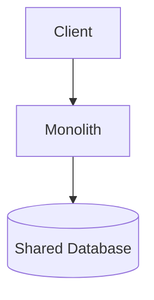

### Introduce a routing layer

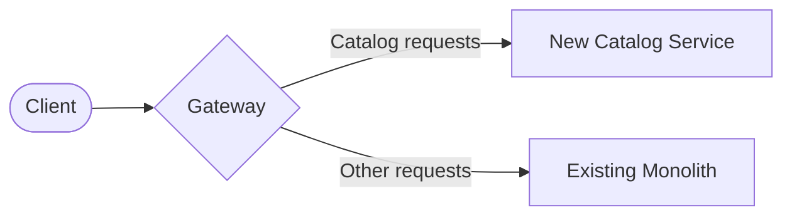

### Migration steps

1. Analyze the domain and dependencies.
2. Improve module boundaries inside the monolith where necessary.
3. Select a capability with a clear boundary.
4. Put a gateway/proxy in front of the application.
5. Route requests for the extracted capability to the new service.
6. Move business logic and establish clear data ownership.
7. Replace direct database access with APIs/events.
8. Monitor behavior and performance.
9. Repeat for another capability.
10. Remove old monolith code when no longer used.

### Database migration challenge

Avoid leaving the new service permanently coupled to the monolith's shared tables.

Transitional techniques may include:

- Change Data Capture
- Events
- Temporary synchronization
- Anti-Corruption Layer
- API façade

But the target should have clear ownership.

### Interview-ready answer

> I use the Strangler pattern to reduce migration risk. I place a routing layer in front of the monolith, extract one bounded capability at a time, move ownership of its logic and data behind the new service, and gradually redirect traffic. I use APIs or events to remove direct database dependencies. This allows old and new architectures to coexist while we validate each migration increment.

---

## 5. What is CQRS? When would you use it, and when would you avoid it?

**CQRS — Command Query Responsibility Segregation** — separates the model used to **change state** from the model used to **read state**.

### Traditional model

```text
Controller
    |
Repository
    |
Database
```

The same domain/data model serves reads and writes.

### CQRS

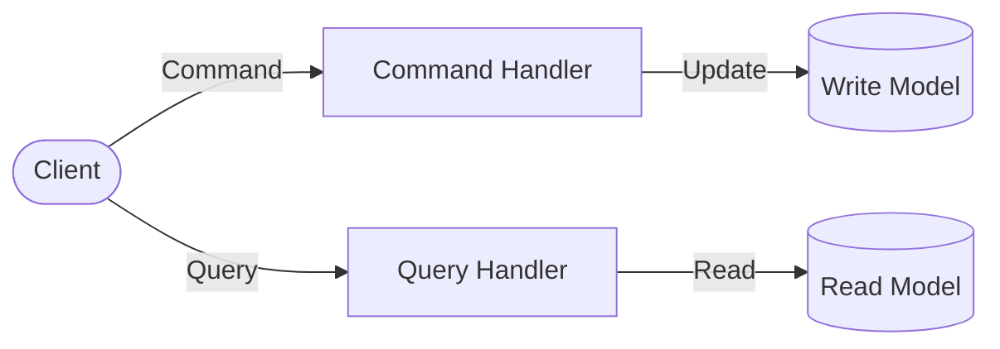

A command represents an intention:

```text
CreateOrderCommand
CancelOrderCommand
ApprovePaymentCommand
```

A query retrieves data:

```text
GetOrderByIdQuery
GetCustomerOrdersQuery
```

### Simple CQRS in .NET

```csharp
public record CreateOrderCommand(Guid CustomerId, decimal Amount);

public class CreateOrderHandler
{
    public async Task<Guid> Handle(CreateOrderCommand command)
    {
        // Validate business rules
        // Create aggregate
        // Save transaction
        return orderId;
    }
}
```

CQRS does **not require** separate physical databases. It can begin as logical command/query separation.

### When I would use CQRS

- Complex write-side business rules
- Very different read and write models
- Read-heavy workloads
- Independent read scaling
- Multiple denormalized projections
- Event-driven systems
- Complex domains where explicit commands improve modeling

### When I would avoid it

- Simple CRUD applications
- Small applications with little domain complexity
- When read/write models are almost identical
- When the team cannot support the added operational/model complexity

### Interview-ready answer

> CQRS separates commands that change state from queries that read state. I use it when write-side domain behavior and read-side requirements differ significantly, or when reads need independent projections or scaling. I avoid introducing full CQRS for simple CRUD because it adds handlers, models, synchronization and operational complexity without enough benefit.

---

## 6. CQRS vs Event Sourcing — what is the difference?

They are independent patterns that are often used together.

### CQRS

Separates:

```text
Commands/Writes
       from
Queries/Reads
```

Current state may still be stored normally:

```text
Order
Id = 101
Status = Shipped
Total = 5000
```

### Event Sourcing

Stores the sequence of state-changing events rather than only the latest state.

```text
OrderCreated
ItemAdded
PaymentReceived
OrderConfirmed
OrderShipped
```

Current state can be rebuilt by replaying the events.

### Comparison

| Area | CQRS | Event Sourcing |
|---|---|---|
| Primary goal | Separate read/write responsibilities | Store state as event history |
| Storage | Can use normal relational/document storage | Event store is authoritative history |
| Audit history | Not automatically complete | Naturally preserves state transitions |
| Complexity | Moderate | Higher |
| Can be used independently? | Yes | Yes |

### Why use them together?

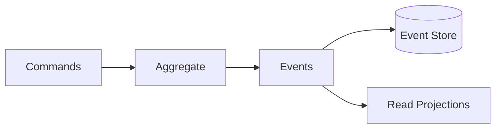

Event Sourcing can generate projections that CQRS query models use.

### When Event Sourcing is useful

- Complete audit history is a core requirement
- Temporal queries are important
- Business events themselves are valuable
- Rebuilding projections is useful

### Avoid when

- CRUD is sufficient
- Event schema evolution would add disproportionate complexity
- Team lacks operational expertise
- Full event history provides little business value

### Interview-ready answer

> CQRS separates read and write models; Event Sourcing changes how state is persisted by storing events as the source of truth. CQRS can use a normal SQL database without Event Sourcing. Event Sourcing can be combined with CQRS to build read projections, but I only introduce it when historical state transitions and event replay provide real value.

---

## 7. How do you implement Saga in a real production system?

A production Saga is more than publishing several events. It must manage **state, failures, retries, compensation and observability**.

### Example order Saga

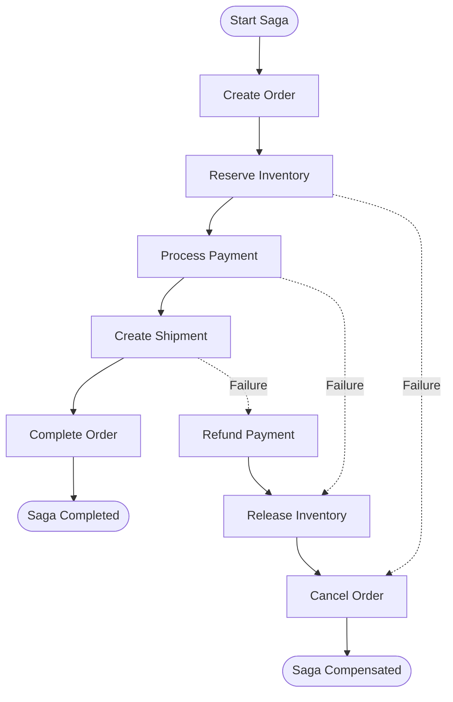

### Orchestrated Saga

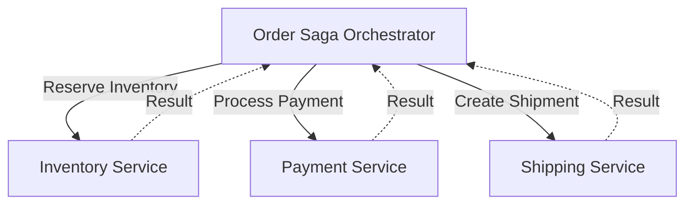
### choreography Saga
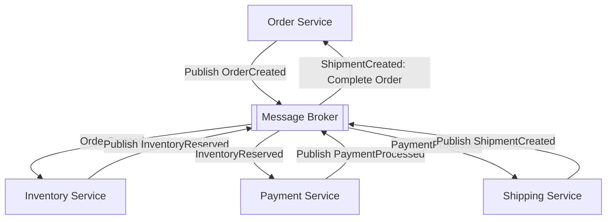

In choreography, services communicate through events in the message broker without a central orchestrator.

### choreography Saga Pattern (Complete)

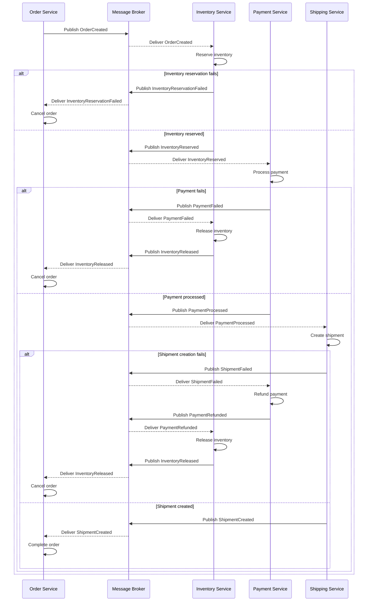

The orchestrator maintains state such as:

```text
SagaId
OrderId
CurrentStep
Status
RetryCount
StartedAt
LastUpdatedAt
```

### Production requirements

- Durable Saga state
- Correlation ID / Saga ID
- Idempotent handlers
- Timeouts
- Retry policies
- Compensation logic
- Outbox/inbox patterns
- Dead-letter handling
- Observability
- Manual recovery/reconciliation for exceptional failures

### Example state machine

```text
Started
  |
InventoryReserved
  |
PaymentCompleted
  |
ShipmentCreated
  |
Completed
```

Failure path:

```text
PaymentFailed
   |
ReleaseInventory
   |
CancelOrder
   |
Compensated
```

### Interview-ready answer

> In production I treat a Saga as a durable state machine. Every Saga has a correlation ID and persisted state. Each step performs a local transaction and emits a result. Commands and events are idempotent, messages use reliable publication, transient failures are retried, timeouts are modeled explicitly, and permanent failures trigger compensation. I also monitor stuck Sagas and provide reconciliation for cases where automated compensation itself fails.

---

## 8. How do you handle compensation when one Saga step fails?

Compensation is a business action that offsets an earlier successful action.

Example:

```text
1. Order Created       SUCCESS
2. Inventory Reserved  SUCCESS
3. Payment Charged     SUCCESS
4. Shipment Creation   FAILED
```

Possible compensation:

```text
Refund Payment
Release Inventory
Cancel Order
```

### Important principle

Compensation is not necessarily database rollback.

```text
Charge $100
```

may be compensated by:

```text
Refund $100
```

Both transactions remain visible for audit purposes.

### Compensation can fail too

Suppose refund fails because the payment provider is temporarily unavailable.

Do not lose the Saga.

Use:

- Retry with backoff
- Durable compensation state
- Dead-letter/error workflow
- Alerting
- Manual reconciliation

### Idempotent compensation

`RefundPayment` must not issue multiple refunds if the same command is delivered twice.

Use a business operation ID:

```text
SagaId + CompensationStep
```

and record completion.

### Interview-ready answer

> Compensation reverses the business effect rather than necessarily rolling back the original database transaction. I persist compensation state, make compensation handlers idempotent, retry transient failures, and route unrecoverable failures to operational reconciliation. This is important because compensation itself is another distributed operation and can fail.

---

## 9. How do you design Event-Driven Microservices?

In event-driven architecture, services publish facts about completed business changes and other services subscribe to them.

Example:

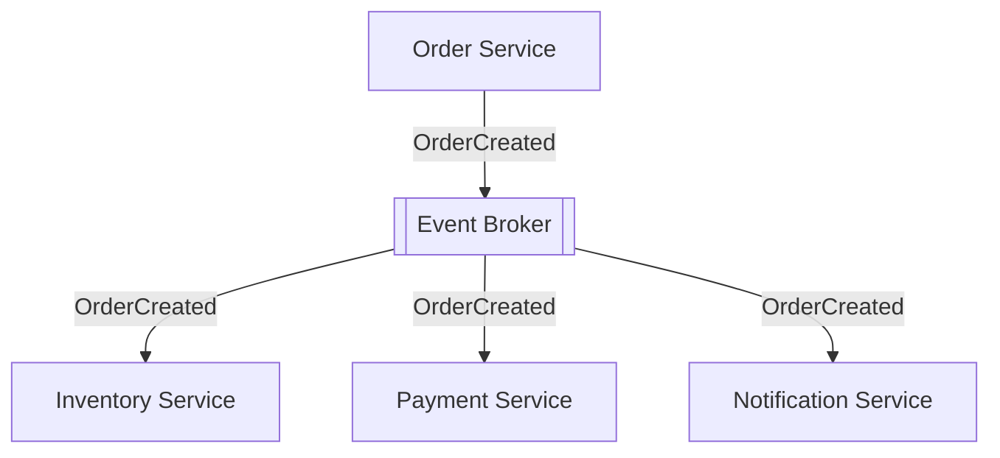

### Event design

A useful integration event should describe something that **already happened**:

```text
OrderCreated
PaymentCompleted
InventoryReserved
```

rather than exposing internal implementation details.

Example:

```json
{
  "eventId": "f81...",
  "eventType": "OrderCreated",
  "eventVersion": 1,
  "occurredAt": "2026-09-26T08:00:00Z",
  "correlationId": "order-flow-123",
  "orderId": "ORD-1001",
  "customerId": "CUS-100"
}
```

### Design considerations

- Event ownership
- Schema/versioning
- At-least-once delivery
- Idempotency
- Ordering requirements
- Retry and DLQ
- Correlation/tracing
- Event size
- Sensitive data
- Consumer independence
- Eventual consistency

### Domain events vs integration events

**Domain event:** meaningful inside a bounded context.

**Integration event:** stable external contract published for other services.

Do not automatically expose every internal domain event externally.

### Interview-ready answer

> I design events as immutable business facts with clear ownership and versioned schemas. Producers should not know individual consumers. I assume at-least-once delivery, so consumers are idempotent. I use Outbox for reliable publication, DLQs for unprocessable messages, correlation metadata for tracing, and explicit rules for ordering and schema evolution.

---

## 10. Azure Service Bus vs Kafka vs RabbitMQ — how would you choose?

Do not choose only by performance numbers. First determine the messaging model.

### Azure Service Bus

Strong fit for Azure enterprise applications requiring managed queues/topics and business messaging.

Useful features include:

- Queues
- Topics/subscriptions
- Dead-letter queues
- Scheduled messages
- Duplicate detection
- Sessions for ordered processing
- Managed Azure integration

Good for:

```text
Order processing
Workflow commands
Enterprise integration
Saga messaging
```

### Kafka

Kafka is a distributed event streaming platform built around durable partitioned logs.

Good for:

- High-throughput event streams
- Event replay
- Analytics pipelines
- Stream processing
- Large-scale event distribution

Concept:

```text
Topic
 |- Partition 0
 |- Partition 1
 |- Partition 2
```

Consumers track offsets and events can be replayed while retained.

### RabbitMQ

RabbitMQ is a mature message broker with flexible routing through exchanges and queues.

Good for:

- Work queues
- Routing patterns
- Traditional broker-based messaging
- Environments where RabbitMQ is already operationally supported

### Comparison

| Requirement | Azure Service Bus | Kafka | RabbitMQ |
|---|---|---|---|
| Managed Azure business messaging | Excellent | Via managed offerings/services | Requires managed/self-hosted option |
| Commands/work queues | Excellent | Possible, not its primary abstraction | Excellent |
| Pub/sub | Yes | Excellent | Yes |
| Event replay | Limited compared with Kafka | Excellent | Not primary model |
| Very high event-stream throughput | Good | Excellent | Good depending on workload |
| DLQ workflow | Built in | Usually designed through topics/processes | Supported through broker patterns |
| Ordered grouping | Sessions | Partition ordering | Queue/design dependent |

### Interview-ready answer

> For an Azure business workflow involving commands, queues, topics, DLQs and Saga processing, Azure Service Bus is often my first choice. For high-volume durable event streams, replay and stream processing, I consider Kafka. RabbitMQ is strong for traditional queueing and flexible routing, especially where the organization already operates it. I choose based on messaging semantics, throughput, replay requirements, cloud platform and operational expertise.

---

## 11. What is the Transactional Outbox Pattern?

The Outbox Pattern solves the **dual-write problem**.

### Problem

```text
BEGIN DB TRANSACTION
Insert Order
COMMIT

Publish OrderCreated
```

What happens if the application crashes after commit but before publishing?

```text
Order exists
Event does not exist in broker
```

The system becomes inconsistent.

### Outbox solution

Store both the business update and outgoing message in the same local transaction.

```text
BEGIN TRANSACTION

Insert Order
Insert OutboxMessage

COMMIT
```

Then a background publisher processes the outbox:

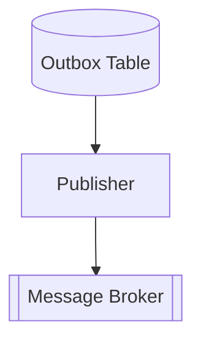

Example table:

```text
Id
EventType
Payload
CreatedAt
ProcessedAt
RetryCount
```

### Important point

Outbox does not magically guarantee exactly-once processing. The publisher can publish an event and crash before marking it processed, causing the event to be published again.

Therefore consumers still need idempotency.

### Interview-ready answer

> Transactional Outbox solves the database-and-broker dual-write problem. I write the domain change and outgoing event to an outbox table in one local transaction. A background worker publishes pending messages and marks them processed. Because publishing can still occur more than once, consumers must remain idempotent.

---

## 12. How do you guarantee reliable event publishing?

In distributed systems, avoid promising impossible guarantees casually. Usually the practical target is **at-least-once delivery plus idempotent processing**.

### Reliable publishing flow

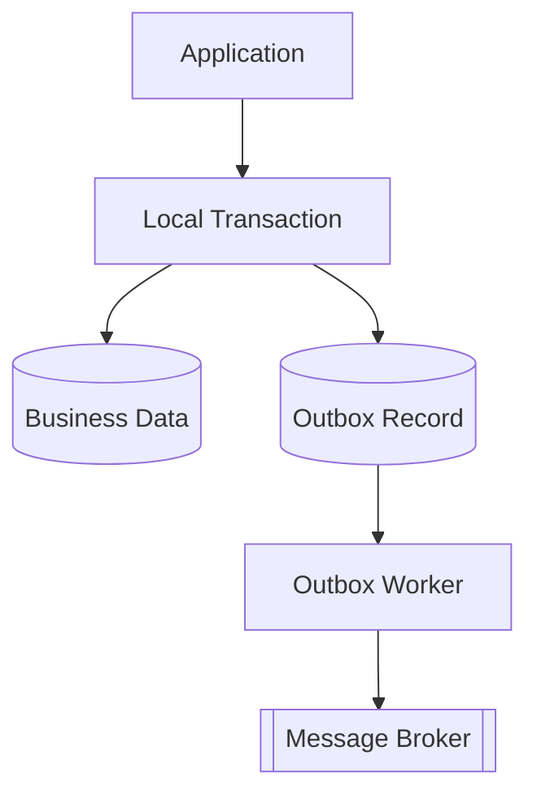

### Steps

1. Commit business data and outbox message atomically.
2. Publisher reads unpublished records.
3. Publish message using broker acknowledgement/confirmation.
4. Mark outbox record processed.
5. Retry transient publishing failures.
6. Monitor old/stuck outbox records.
7. Make consumers idempotent because duplicates are possible.

### Alternative: CDC

Change Data Capture can capture committed database changes/outbox records and publish them downstream, depending on platform and architecture.

### Interview-ready answer

> I guarantee that a committed business operation has a durable event-to-be-published by storing it in a transactional outbox. A reliable worker or CDC pipeline publishes it to the broker with retries and monitoring. I design for at-least-once delivery rather than assuming exactly once end-to-end, and I make consumers idempotent.

---

## 13. How do you handle duplicate messages?

Duplicates are normal in many reliable messaging systems because a message may be successfully processed but its acknowledgement may be lost.

Example:

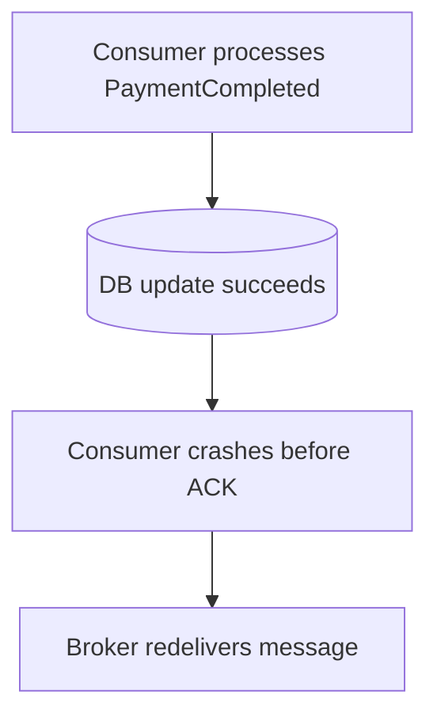

### Solution: identify every message

```json
{
  "messageId": "8e19...",
  "eventType": "PaymentCompleted"
}
```

Consumer records processed IDs.

```text
ProcessedMessages
-----------------
MessageId
ProcessedAt
ConsumerName
```

Processing logic:

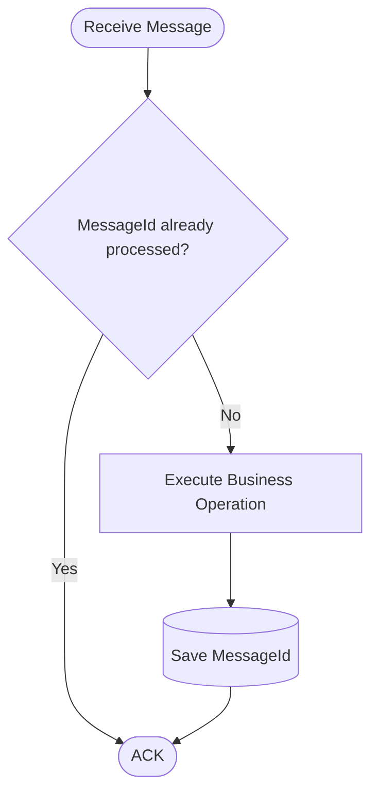

Ideally the business change and processed-message record are committed in the same local transaction.

### Broker duplicate detection

Some brokers offer duplicate detection, but application-level idempotency is still valuable because duplicates can arise from producers, retries and business operations.

### Interview-ready answer

> I assume duplicates can occur. Every event has a unique message or operation ID. The consumer checks an inbox/processed-message store and commits the business change and deduplication marker atomically where possible. Broker-side duplicate detection can help, but I do not rely on it as the only protection.

---

## 14. How do you make consumers idempotent?

An idempotent consumer can process the same logical message multiple times without producing an incorrect additional side effect.

### Example problem

Message:

```text
DebitAccount $100
```

If delivered twice, the account must not be charged $200.

### Technique 1: Inbox / processed message IDs

```text
MessageId = abc123
```

Before processing:

```sql
SELECT 1
FROM ProcessedMessages
WHERE MessageId = @MessageId
```

If it exists, acknowledge and skip.

### Technique 2: Natural idempotency

Instead of:

```text
Increase status counter by 1
```

prefer where semantics allow:

```text
Set OrderStatus = Confirmed
```

Repeated assignment has the same result.

### Technique 3: Unique business key

Example:

```text
Payment(OperationId) UNIQUE
```

The database prevents duplicate operations.

### Critical transaction

```text
BEGIN TRANSACTION
Update business data
Insert ProcessedMessage
COMMIT
```

This avoids a gap between side effect and deduplication record.

### External APIs

When calling payment providers, use provider-supported **idempotency keys** where available.

### Interview-ready answer

> I design consumers for at-least-once delivery. I use a message or business operation ID, persist processed IDs, enforce unique constraints where useful, and commit the deduplication marker with the local business transaction. For external side effects such as payments, I also propagate an idempotency key if the provider supports it.

---

## 15. How do you handle poison messages and Dead-Letter Queues?

A **poison message** repeatedly fails processing because of invalid data, an unsupported schema, missing reference data, or a permanent business/technical problem.

### Do not retry forever

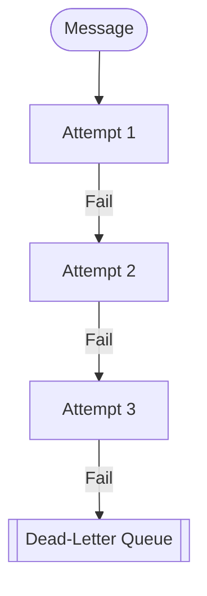

### DLQ processing

A production system should monitor DLQs.

Workflow:

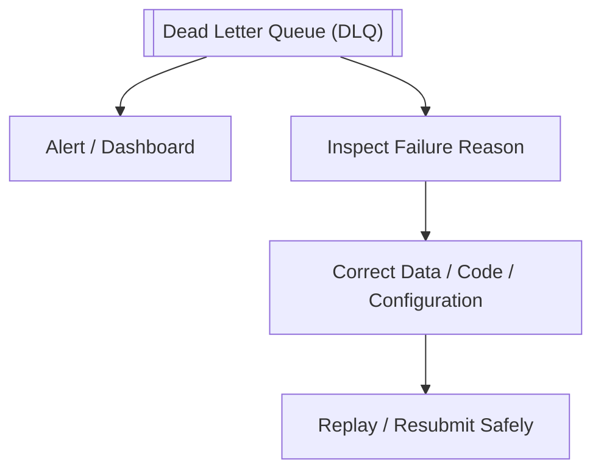

### Include diagnostic metadata

Useful fields:

```text
MessageId
CorrelationId
Exception category
Dead-letter reason
Delivery count
Timestamp
Original destination
```

Do not expose secrets or sensitive payloads unnecessarily in logs.

### Transient vs permanent failure

```text
Timeout -> retry

Invalid schema -> DLQ quickly

Business rule violation -> domain-specific handling
```

### Interview-ready answer

> I classify failures as transient or permanent. Transient failures get bounded retries with backoff. Messages that exceed the retry threshold or cannot be processed are dead-lettered. I monitor DLQ depth and age, preserve correlation and failure metadata, and provide controlled replay after the underlying issue is corrected. A DLQ without monitoring and recovery procedures is incomplete.

---

## 16. How do you maintain message ordering?

Global ordering is expensive and often unnecessary. First ask:

> Which messages actually require ordering, and within what business key?

Example:

```text
OrderCreated
OrderPaid
OrderShipped
```

Ordering may matter **per OrderId**, not across every order in the system.

### Kafka

Messages with the same key can be routed to the same partition.

```text
Key = OrderId

Order-100 -> Partition 1
Order-100 -> Partition 1
Order-100 -> Partition 1
```

Ordering is maintained within a partition, subject to producer/consumer design.

### Azure Service Bus

Sessions can group related messages.

```text
SessionId = OrderId
```

A receiver processes the session's messages in sequence.

### Sequence numbers

Application events may include:

```json
{
  "aggregateId": "ORD-100",
  "version": 7
}
```

Consumer can detect:

```text
Expected = 6
Received = 7
```

and apply an appropriate wait/retry/reconciliation strategy.

### Interview-ready answer

> I avoid requiring global ordering. I define ordering at the smallest useful scope, usually an aggregate or business key such as OrderId. With Kafka I partition by that key; with Azure Service Bus I can use sessions. I may also include aggregate versions or sequence numbers so consumers can detect gaps and out-of-order delivery.

---

## 17. How do you implement rate limiting?

Rate limiting protects services from abuse, accidental overload and unfair resource consumption.

### Common algorithms

- Fixed Window
- Sliding Window
- Token Bucket
- Concurrency limiting

### ASP.NET Core example

```csharp
builder.Services.AddRateLimiter(options =>
{
    options.AddFixedWindowLimiter("api", limiterOptions =>
    {
        limiterOptions.PermitLimit = 100;
        limiterOptions.Window = TimeSpan.FromMinutes(1);
        limiterOptions.QueueLimit = 0;
    });
});

app.UseRateLimiter();
```

Endpoint policy can then be applied according to the application's routing model.

### Where to rate-limit?

Possible layers:

```text
API Gateway -> consumer/API-key limits
Service     -> endpoint/resource protection
Downstream  -> concurrency protection
```

### Partition limits

A production policy may partition by:

- Client ID
- API key
- Tenant
- User
- IP address where appropriate

For authenticated business APIs, client/tenant identity is often more meaningful than IP alone.

### HTTP response

When a request is rejected because of rate limiting, HTTP `429 Too Many Requests` is normally appropriate. `Retry-After` can be provided when meaningful.

### Interview-ready answer

> I normally enforce broad consumer quotas at the gateway and resource-specific limits in services where necessary. I choose the limiter based on traffic behavior and partition by a meaningful identity such as client or tenant. Rate limiting should work with load shedding, timeouts and autoscaling rather than being treated as the only capacity-control mechanism.

---

## 18. How do you make Microservices scalable and highly available?

Scalability and availability require both application and infrastructure design.

### Stateless services

Prefer stateless API instances:

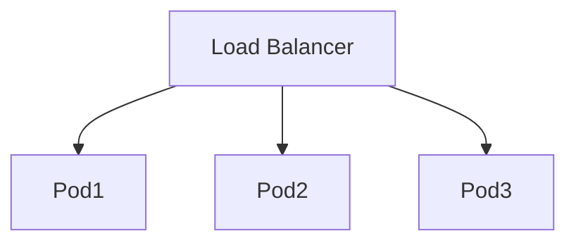

State belongs in external systems such as databases, caches or durable messaging platforms.

### Horizontal scaling

Add instances rather than only increasing server size.

### Independent scaling

```text
Order Service      5 instances
Catalog Service   10 instances
Admin Service      2 instances
```

Each capability scales according to its load.

### High availability techniques

- Multiple replicas
- Multi-zone deployment where supported/required
- Health probes
- Load balancing
- Autoscaling
- Database HA/replication
- Broker HA
- Caching
- Queue buffering
- Circuit breakers
- Graceful degradation
- Pod disruption controls
- Rolling deployments

### Avoid single points of failure

The gateway, identity provider, broker and database are also critical dependencies and require HA planning.

### Scale based on useful metrics

CPU is not always sufficient.

Examples:

```text
HTTP request rate
Queue length
Message lag
Concurrent requests
CPU
Memory
```

### Interview-ready answer

> I design services to be stateless where possible, run multiple replicas, distribute them across failure domains, use health-based traffic routing, and scale horizontally. I scale each service independently using workload metrics such as CPU, request rate or queue backlog. HA also includes the database, broker, gateway and identity dependencies—not just application pods.

---

## 19. How do you implement service-to-service authentication using OAuth2/Managed Identity?

There are two common scenarios.

### OAuth2 client credentials

For machine-to-machine communication:

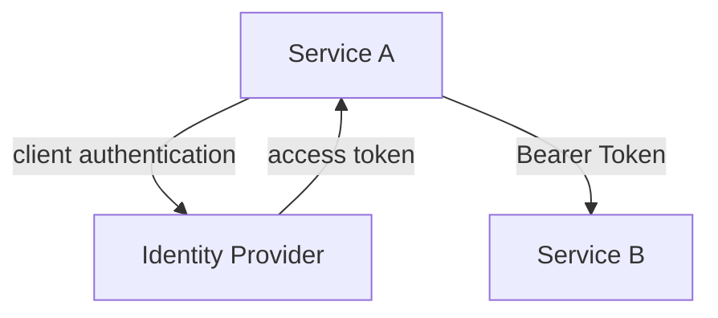

The access token represents the calling application/workload rather than an interactive user.

Service B validates:

- Signature
- Issuer
- Audience
- Expiration
- Application roles/scopes/claims

### Managed Identity in Azure

Managed Identity removes the need to store Azure resource credentials in application configuration.

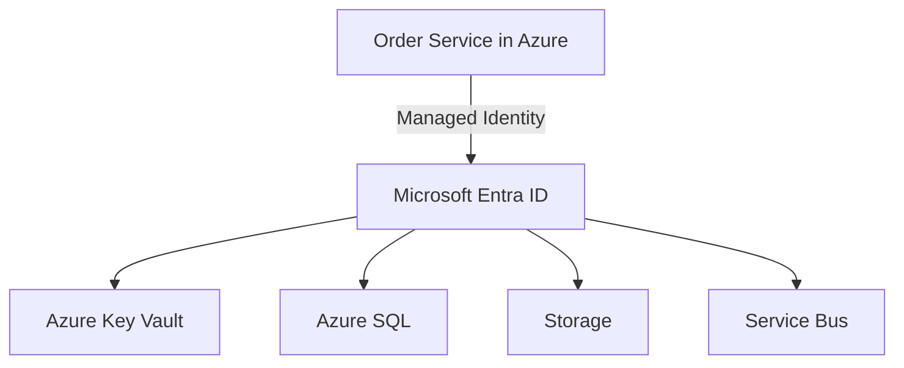

In .NET, Azure SDK clients commonly use `DefaultAzureCredential`:

```csharp
var credential = new DefaultAzureCredential();

var client = new SecretClient(
    new Uri(keyVaultUrl),
    credential);
```

Locally it can use developer credentials; in Azure it can use the workload's managed identity, depending on configuration.

### Calling a protected internal API

If Service B is protected through Microsoft Entra ID, Service A obtains an access token for Service B's configured resource/audience using its workload identity and sends it as a bearer token.

### Security principles

- Least privilege
- Short-lived tokens
- Validate audience
- Separate identities per workload where useful
- Avoid shared passwords/secrets
- Rotate certificates/secrets if credentials are unavoidable

### Interview-ready answer

> For service-to-service authentication I use OAuth2 machine-to-machine flows or cloud workload identity. In Azure I prefer Managed Identity/Workload Identity so the service obtains Entra tokens without storing credentials. The target API validates issuer, audience and application permissions. Access to resources such as Key Vault, Storage or Service Bus is granted through least-privilege Azure RBAC.

---

## 20. How do you deploy and autoscale Microservices using Kubernetes/AKS?

Each microservice is packaged as a container and represented by Kubernetes resources.

### Deployment architecture


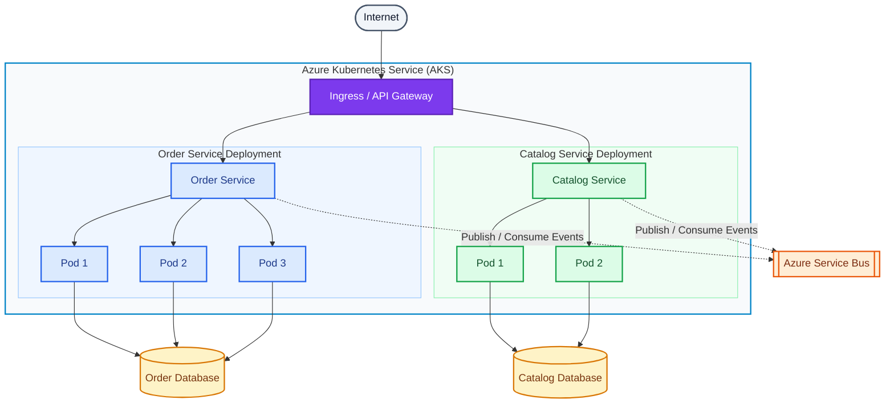

### Deployment example

```yaml
apiVersion: apps/v1
kind: Deployment
metadata:
  name: order-service
spec:
  replicas: 3
  selector:
    matchLabels:
      app: order-service
  template:
    metadata:
      labels:
        app: order-service
    spec:
      containers:
        - name: order-service
          image: myregistry.azurecr.io/order-service:1.0.0
          ports:
            - containerPort: 8080
          resources:
            requests:
              cpu: "250m"
              memory: "256Mi"
            limits:
              cpu: "1"
              memory: "512Mi"
          readinessProbe:
            httpGet:
              path: /health/ready
              port: 8080
          livenessProbe:
            httpGet:
              path: /health/live
              port: 8080
```

### Service

```yaml
apiVersion: v1
kind: Service
metadata:
  name: order-service
spec:
  selector:
    app: order-service
  ports:
    - port: 80
      targetPort: 8080
```

### Horizontal Pod Autoscaler

```yaml
apiVersion: autoscaling/v2
kind: HorizontalPodAutoscaler
metadata:
  name: order-service-hpa
spec:
  scaleTargetRef:
    apiVersion: apps/v1
    kind: Deployment
    name: order-service
  minReplicas: 3
  maxReplicas: 20
  metrics:
    - type: Resource
      resource:
        name: cpu
        target:
          type: Utilization
          averageUtilization: 70
```

### Event-driven scaling

CPU may not represent message-worker load well.

For queue consumers, scaling can be based on:

```text
Azure Service Bus queue length
Kafka lag
Other event-source metrics
```

KEDA is commonly used with Kubernetes for event-driven autoscaling.

```text
Queue grows
   |
KEDA observes backlog
   |
Increase worker pods
   |
Process messages
   |
Queue falls
   |
Scale down
```

### Cluster/node scaling

HPA scales **pods**.

If there is insufficient cluster capacity, AKS node autoscaling can add/remove nodes.

```text
HPA -> More Pods Needed
           |
           v
Cluster Autoscaler -> More Nodes Needed
```

### Production AKS considerations

- Resource requests and limits
- Readiness/liveness/startup probes
- Pod Disruption Budgets where appropriate
- Multiple replicas
- Availability zones where appropriate
- Rolling deployments
- Secrets through Key Vault integration/workload identity
- Network policies
- Ingress/API gateway
- Azure Container Registry
- Central logs and metrics
- OpenTelemetry/Application Insights
- HPA/KEDA
- Cluster autoscaler
- Graceful shutdown

### Typical CI/CD

```mermaid
flowchart TD
    G(["Git Push"]) --> CI

    subgraph CI["Continuous Integration (CI)"]
        direction TB
        R["Restore Dependencies"] --> B["Build Application"]
        B --> T["Run Tests"]
        T --> D["Docker Build"]
        D --> S["Image Scan"]
        S --> P["Push Image to ACR"]
    end

    P --> ACR[["Azure Container Registry (ACR)"]]
    ACR --> CD["CD / GitOps"]

    subgraph AKS["Azure Kubernetes Service (AKS)"]
        direction TB
        RD["Rolling Deployment"] --> RC["Readiness Checks"]
        RC --> M["Monitoring"]
    end

    CD --> RD

    classDef trigger fill:#f1f5f9,stroke:#475569,color:#0f172a,stroke-width:2px
    classDef build fill:#dbeafe,stroke:#2563eb,color:#1e3a8a,stroke-width:2px
    classDef security fill:#fef3c7,stroke:#d97706,color:#78350f,stroke-width:2px
    classDef registry fill:#ffedd5,stroke:#ea580c,color:#7c2d12,stroke-width:2px
    classDef deploy fill:#ede9fe,stroke:#7c3aed,color:#4c1d95,stroke-width:2px
    classDef operations fill:#dcfce7,stroke:#16a34a,color:#14532d,stroke-width:2px

    class G trigger
    class R,B,T,D build
    class S security
    class ACR,P registry
    class CD,RD deploy
    class RC,M operations

    style CI fill:#eff6ff,stroke:#93c5fd,stroke-width:2px
    style AKS fill:#f0fdf4,stroke:#86efac,stroke-width:2px
```

### Interview-ready answer

> I containerize each service and push immutable images to ACR. In AKS I deploy them using Deployments and Services with resource requests/limits and health probes. HPA scales API pods using resource or custom metrics, while queue-based workers can scale with KEDA using backlog or lag. Cluster autoscaling provides node capacity when pod demand grows. I also design for multiple replicas, safe rolling deployments, workload identity, centralized observability and graceful shutdown.

---

# Advanced End-to-End Architecture Diagram 1

```mermaid
flowchart TD
  %% Clients and gateway
  A[Web / Mobile Client] --> B[API Management / Gateway]

  %% Core services
  B --> C[Order Service<br/>ASP.NET Core]
  B --> D[Catalog Service]
  B --> E[Customer Service]

  %% Databases
  C --> CDB[(Order DB)]
  D --> DDB[(Catalog DB)]
  E --> EDB[(Customer DB)]

  %% Outbox / messaging
  C --> F[Outbox]
  F --> G[(Azure Service Bus)]

  %% Downstream services
  G --> H[Inventory Service]
  G --> I[Payment Service]

  H --> HDB[(Inventory DB)]
  I --> IDB[(Payment DB)]

  %% Platform capabilities
  subgraph P[Cross-cutting platform]
    P1[Microsoft Entra ID / OAuth2 / Managed Identity]
    P2[Azure Key Vault]
    P3[Azure App Configuration]
    P4[OpenTelemetry]
    P5[Application Insights / Azure Monitor]
    P6[Azure Container Registry]
    P7[AKS]
    P8[HPA / KEDA / Cluster Autoscaler]
  end

  %% Platform relationships
  A -. auth .-> P1
  B -. secrets .-> P2
  B -. config .-> P3
  C -. telemetry .-> P4
  D -. telemetry .-> P4
  E -. telemetry .-> P4
  H -. telemetry .-> P4
  I -. telemetry .-> P4
  P4 -. metrics/logs .-> P5
  P6 -. images .-> P7
  P7 -. runs on .-> P8

  classDef client fill:#e0f2fe,stroke:#0284c7,color:#0f172a,stroke-width:1.5px;
  classDef gateway fill:#1d4ed8,stroke:#1e40af,color:#ffffff,stroke-width:2px;
  classDef service fill:#10b981,stroke:#059669,color:#ffffff,stroke-width:2px;
  classDef db fill:#8b5cf6,stroke:#6d28d9,color:#ffffff,stroke-width:2px;
  classDef broker fill:#06b6d4,stroke:#0891b2,color:#ffffff,stroke-width:2px;
  classDef platform fill:#f3f4f6,stroke:#9ca3af,color:#111827,stroke-width:1.5px;
  classDef note fill:#fff7ed,stroke:#f59e0b,color:#111827,stroke-width:1px;

  class A client;
  class B gateway;
  class C,D,E,H,I service;
  class CDB,DDB,EDB,HDB,IDB db;
  class G broker;
  class P1,P2,P3,P4,P5,P6,P7,P8 platform;
```


# Advanced End-to-End Architecture Diagram 2

```mermaid
                  flowchart TD
    CLIENT(["Web / Mobile Client"]) --> APIM["API Management / Gateway"]

    subgraph AKS["Azure Kubernetes Service (AKS)"]
        direction TB

        ORDER["Order Service (ASP.NET Core)"]
        CATALOG["Catalog Service"]
        CUSTOMER["Customer Service"]
        WORKER["Outbox Publisher"]
        INVENTORY["Inventory Service"]
        PAYMENT["Payment Service"]
    end

    APIM --> ORDER & CATALOG & CUSTOMER

    subgraph ORDERDATA["Order Database — Single Local Transaction"]
        direction TB
        ODB[("Order Data")]
        OUTBOX[("Outbox Table")]
    end

    ORDER -->|"Commit order + event atomically"| ORDERDATA
    CATALOG --> CDB[("Catalog DB")]
    CUSTOMER --> CUDB[("Customer DB")]

    OUTBOX -->|"Read committed events"| WORKER
    WORKER -->|"Publish OrderCreated"| BUS[["Azure Service Bus Topic"]]
    WORKER -.->|"Mark published after broker acknowledgment"| OUTBOX

    BUS -->|"Inventory subscription"| INVENTORY
    BUS -->|"Payment subscription"| PAYMENT

    INVENTORY --> IDB[("Inventory DB")]
    PAYMENT --> PDB[("Payment DB")]

    subgraph PLATFORM["Cross-Cutting Platform"]
        direction TB
        AUTH["Microsoft Entra ID / OAuth 2.0 / Managed Identity"]
        KV["Azure Key Vault"]
        CONFIG["Azure App Configuration"]
        OTEL["OpenTelemetry"]
        MONITOR["Application Insights / Azure Monitor"]
        ACR[["Azure Container Registry"]]
        SCALE["HPA / KEDA / Cluster Autoscaler"]

        OTEL -->|"Traces, metrics and logs"| MONITOR
    end

    AUTH -.->|"Client authentication / API authorization"| APIM
    AUTH -.->|"Workload identities"| AKS
    KV -.->|"Secrets and certificates"| AKS
    CONFIG -.->|"Settings and feature flags"| AKS
    AKS -.->|"Telemetry"| OTEL
    ACR -.->|"Container images"| AKS
    SCALE -.->|"Scale pods and nodes"| AKS

    classDef client fill:#f1f5f9,stroke:#475569,color:#0f172a,stroke-width:2px
    classDef gateway fill:#7c3aed,stroke:#5b21b6,color:#ffffff,stroke-width:2px
    classDef service fill:#dbeafe,stroke:#2563eb,color:#1e3a8a,stroke-width:2px
    classDef database fill:#fef3c7,stroke:#d97706,color:#78350f,stroke-width:2px
    classDef broker fill:#ffedd5,stroke:#ea580c,color:#7c2d12,stroke-width:2px
    classDef platform fill:#dcfce7,stroke:#16a34a,color:#14532d,stroke-width:2px

    class CLIENT client
    class APIM gateway
    class ORDER,CATALOG,CUSTOMER,WORKER,INVENTORY,PAYMENT service
    class ODB,OUTBOX,CDB,CUDB,IDB,PDB database
    class BUS,ACR broker
    class AUTH,KV,CONFIG,OTEL,MONITOR,SCALE platform

    style AKS fill:#eff6ff,stroke:#60a5fa,stroke-width:2px
    style ORDERDATA fill:#fffbeb,stroke:#f59e0b,stroke-width:2px
    style PLATFORM fill:#f0fdf4,stroke:#86efac,stroke-width:2px
```

The Order Service saves order data and the outbox event in one database transaction. The publisher sends committed events to separate Service Bus subscriptions for Inventory and Payment. Dotted arrows show platform support and operational connections.

---

# Production Failure Scenario

## Interview question

> Order Service publishes `OrderCreated`. Inventory processes it successfully but crashes before acknowledging the message. What happens and how do you prevent duplicate reservation?

### Strong answer

The broker may redeliver `OrderCreated`, because from its perspective processing was not successfully acknowledged. Therefore I do not assume exactly-once delivery.

I assign a unique message/event ID and make Inventory's consumer idempotent:

```mermaid
flowchart TD
    R(["Receive OrderCreated (MessageId = 123)"]) --> B["Begin Local Transaction"]

    subgraph TX["Local Database Transaction"]
        B --> C{"MessageId 123 already in ProcessedMessages?"}
        C -->|"No"| I["Reserve Inventory"]
        I --> P[("Insert ProcessedMessages (123)")]
        P --> COMMIT["Commit Transaction"]
        C -->|"Yes — Skip Duplicate"| COMMIT
    end

    COMMIT --> ACK(["ACK Message"])

    I -.->|"Failure"| RB["Roll Back Transaction"]
    P -.->|"Failure"| RB
    RB --> RETRY(["Retry / Redeliver Message"])

    classDef endpoint fill:#dcfce7,stroke:#16a34a,color:#14532d,stroke-width:2px
    classDef process fill:#dbeafe,stroke:#2563eb,color:#1e3a8a,stroke-width:2px
    classDef decision fill:#fef3c7,stroke:#d97706,color:#78350f,stroke-width:2px
    classDef database fill:#ede9fe,stroke:#7c3aed,color:#4c1d95,stroke-width:2px
    classDef failure fill:#fee2e2,stroke:#dc2626,color:#7f1d1d,stroke-width:2px

    class R,ACK endpoint
    class B,I,COMMIT process
    class C decision
    class P database
    class RB,RETRY failure

    style TX fill:#f8fafc,stroke:#94a3b8,stroke-width:2px
```
Reserve inventory and record the MessageId in the same transaction. ACK only after a successful commit. Use a unique constraint on MessageId to prevent concurrent duplicate processing.


If the same message arrives again, the consumer finds MessageId `123`, performs no duplicate reservation and acknowledges it.

This is a stronger production answer than saying, "the broker will never send duplicates."

---

# Architecture Decision Cheat Sheet

| Requirement | Common approach |
|---|---|
| Simple CRUD application | Modular monolith may be enough |
| Independent business capability | Microservice candidate |
| Complex domain modeling | DDD / Bounded Context |
| Incremental monolith migration | Strangler Fig |
| Separate read/write complexity | CQRS |
| Complete state-change history | Consider Event Sourcing |
| Cross-service business transaction | Saga |
| Reliable DB + event publishing | Transactional Outbox |
| Duplicate delivery | Idempotent Consumer / Inbox |
| Permanent message failure | DLQ |
| Per-entity ordering | Partition key / Session ID |
| Azure enterprise queue/workflow | Azure Service Bus |
| High-volume replayable event stream | Kafka |
| Traditional flexible message broker | RabbitMQ |
| API protection | Rate limiting + load shedding |
| Azure workload authentication | Managed/Workload Identity |
| Container orchestration | Kubernetes / AKS |
| HTTP autoscaling | HPA/custom metrics |
| Queue/event autoscaling | KEDA |
| Node capacity scaling | Cluster Autoscaler |

---

# Senior-Level Interview Rules to Remember

1. **Do not say every module should be a microservice.** Explain the business and operational reason for the boundary.
2. **Do not claim distributed systems give exactly-once processing automatically.** Design for retries and idempotency.
3. **Do not confuse CQRS with Event Sourcing.** They are independent patterns.
4. **Do not treat Saga compensation as a database rollback.** It is usually a compensating business action.
5. **Do not publish an event after a DB commit without discussing the dual-write problem.** Mention Transactional Outbox.
6. **Do not retry every error.** Retry transient failures only and consider idempotency.
7. **Do not create a DLQ and forget it.** Monitoring, alerting, diagnosis and replay are part of the design.
8. **Do not require global ordering unless the business truly requires it.** Prefer ordering by aggregate/business key.
9. **Do not store service credentials in source code.** Prefer workload identity/Managed Identity and least privilege.
10. **Do not say Kubernetes alone provides high availability.** Application replicas, probes, data stores, brokers, zones, scaling and failure handling all matter.

---

# 2-Minute Interview Summary

A mature microservices architecture combines:

```mermaid
flowchart TD
    DDD["DDD / Bounded Contexts"] --> SERVICES["Independent Services + Data Ownership"]

    SERVICES --> SYNC["REST / gRPC: Immediate Interactions"]
    SERVICES --> ASYNC[["Events / Messaging: Asynchronous Workflows"]]

    subgraph PATTERNS["Messaging and Workflow Patterns"]
        direction TB
        SAGA["Saga"]
        OUTBOX[("Outbox")]
        IDEM["Idempotency"]
        DLQ[["Dead-Letter Queue"]]
        ORDER["Ordering Strategy"]
    end

    ASYNC --> SAGA & OUTBOX & IDEM & DLQ & ORDER

    subgraph PLATFORM["Cross-Cutting Platform"]
        direction TB
        SECURITY["Security: OAuth 2.0 / Managed Identity"]
        RELIABILITY["Reliability: Timeout / Retry / Circuit Breaker / Bulkhead"]
        OBS["Observability: Logs / Metrics / Distributed Traces"]
        DEPLOY["Deployment: Docker / AKS"]
        SCALE["Scaling: HPA / KEDA / Cluster Autoscaler"]
    end

    SECURITY -.-> SERVICES
    RELIABILITY -.-> SERVICES
    SERVICES -.-> OBS
    DEPLOY -.-> SERVICES
    SCALE -.-> SERVICES

    classDef domain fill:#ede9fe,stroke:#7c3aed,color:#4c1d95,stroke-width:2px
    classDef service fill:#dbeafe,stroke:#2563eb,color:#1e3a8a,stroke-width:2px
    classDef messaging fill:#ffedd5,stroke:#ea580c,color:#7c2d12,stroke-width:2px
    classDef pattern fill:#fef3c7,stroke:#d97706,color:#78350f,stroke-width:2px
    classDef platform fill:#dcfce7,stroke:#16a34a,color:#14532d,stroke-width:2px

    class DDD domain
    class SERVICES,SYNC service
    class ASYNC messaging
    class SAGA,OUTBOX,IDEM,DLQ,ORDER pattern
    class SECURITY,RELIABILITY,OBS,DEPLOY,SCALE platform

    style PATTERNS fill:#fffbeb,stroke:#fbbf24,stroke-width:2px
    style PLATFORM fill:#f0fdf4,stroke:#86efac,stroke-width:2px
```

```mermaid
flowchart TD
  A[DDD / Bounded Contexts] --> B[Independent Services + Data Ownership]

  B --> C[REST / gRPC<br/>Immediate interactions]
  B --> D[Events / Messaging<br/>Asynchronous workflows]

  D --> E[Saga]
  D --> F[Outbox]
  D --> G[Idempotency]
  D --> H[DLQ]
  D --> I[Ordering strategy]

  subgraph S[Cross-cutting concerns]
    S1[Security<br/>OAuth2 / Managed Identity]
    S2[Reliability<br/>Timeout / Retry / Circuit Breaker / Bulkhead]
    S3[Observability<br/>Logs / Metrics / Distributed Traces]
    S4[Deployment<br/>Docker / AKS]
    S5[Scaling<br/>HPA / KEDA / Cluster Autoscaler]
  end

  A -.-> S1
  B -.-> S2
  D -.-> S3
  C -.-> S4
  D -.-> S5

  classDef root fill:#1d4ed8,stroke:#1e40af,color:#ffffff,stroke-width:2px;
  classDef service fill:#10b981,stroke:#059669,color:#ffffff,stroke-width:2px;
  classDef sync fill:#60a5fa,stroke:#2563eb,color:#ffffff,stroke-width:1.5px;
  classDef async fill:#f59e0b,stroke:#d97706,color:#111827,stroke-width:1.5px;
  classDef concern fill:#f3f4f6,stroke:#9ca3af,color:#111827,stroke-width:1.2px;

  class A root;
  class B service;
  class C sync;
  class D,E,F,G,H,I async;
  class S1,S2,S3,S4,S5 concern;
```

For senior interviews, always explain **why** you chose a pattern, what failure it solves, and what new complexity it introduces.
