# Advanced Microservices Architecture & System Design Interview Guide --- Part 3
## Advanced Microservices Architecture & System Design Interview Guide --- Part 3

> **Target:** Senior .NET Developer / Technical Lead / Solution
> Architect interviews\
> **Reference stack:** ASP.NET Core / .NET, Azure API Management,
> OAuth2/OIDC, Managed Identity, Azure Key Vault, Azure Service Bus,
> Azure SQL/PostgreSQL, Redis, Docker, AKS, OpenTelemetry, Application
> Insights/Azure Monitor\
> **Style:** Production-oriented answers with architecture decisions,
> failure scenarios, trade-offs, and interview-ready summaries


# Reference Architecture Used Throughout This Guide

To make the answers consistent, assume we designed an
e-commerce/order-processing platform with the following business
capabilities:

-   Identity
-   Customer
-   Catalog
-   Ordering
-   Inventory
-   Payment
-   Shipping
-   Notification

``` mermaid
 flowchart TD
    CLIENT(["Internet / Mobile / SPA"]) --> FD["Azure Front Door / WAF"]
    FD --> APIM["Azure API Management Gateway"]

    subgraph AKS["Azure Kubernetes Service (AKS)"]
        direction TB
        ORDER["Order API"]
        CATALOG["Catalog API"]
        CUSTOMER["Customer API"]
        PUBLISHER["Outbox Publisher"]
        INVENTORY["Inventory Service"]
        PAYMENT["Payment Service"]
        SHIPPING["Shipping Service"]
    end

    APIM --> ORDER & CATALOG & CUSTOMER

    subgraph ORDERDB["Order Database — Single Local Transaction"]
        direction TB
        DATA[("Order Data")]
        OUTBOX[("Outbox Table")]
    end

    ORDER -->|"Save order + event atomically"| ORDERDB
    CATALOG --> CDB[("Catalog DB")]
    CUSTOMER --> CUDB[("Customer DB")]

    OUTBOX -->|"Read committed events"| PUBLISHER
    PUBLISHER -->|"Publish OrderCreated"| BUS[["Azure Service Bus — Topics / Queues"]]
    PUBLISHER -.->|"Mark published after acknowledgment"| OUTBOX

    BUS -->|"OrderCreated: Inventory subscription"| INVENTORY
    BUS -->|"OrderCreated: Payment subscription"| PAYMENT

    INVENTORY --> IDB[("Inventory DB")]
    PAYMENT --> PDB[("Payment DB")]

    INVENTORY -->|"Publish InventoryReserved"| BUS
    PAYMENT -->|"Publish PaymentSucceeded"| BUS
    BUS -->|"Deliver inventory and payment events"| SHIPPING

    SHIPPING --> CHECK{"Inventory reserved AND payment successful?"}
    CHECK -->|"Yes — Create shipment"| SDB[("Shipping DB")]
    CHECK -->|"No — Persist state and await remaining event"| SDB

    subgraph PLATFORM["Cross-Cutting Platform"]
        direction TB

        subgraph SECURITY["Identity and Configuration"]
            ENTRA["Microsoft Entra ID / Identity Provider"]
            MI["Managed Identity"]
            KV["Azure Key Vault"]
            CONFIG["Azure App Configuration"]
        end

        subgraph OPERATIONS["Caching and Observability"]
            REDIS[("Redis Cache")]
            OTEL["OpenTelemetry"]
            MONITOR["Application Insights / Azure Monitor"]
            LOGS[("Centralized Logs")]
            ALERTS["Metrics + Alerts"]

            OTEL --> MONITOR
            MONITOR --> LOGS & ALERTS
        end

        subgraph DELIVERY["Delivery and Scaling"]
            CICD["CI/CD"]
            ACR[["Azure Container Registry"]]
            SCALE["Autoscaling — HPA / KEDA / Cluster Autoscaler"]

            CICD -->|"Build, scan and push images"| ACR
        end
    end

    ENTRA -.->|"Authentication / Authorization"| APIM
    MI -.->|"Workload identity"| AKS
    KV -.->|"Secrets / Certificates"| AKS
    CONFIG -.->|"Settings / Feature flags"| AKS
    AKS -.->|"Cache access"| REDIS
    AKS -.->|"Logs / Metrics / Traces"| OTEL
    ACR -.->|"Pull container images"| AKS
    CICD -.->|"Deploy applications"| AKS
    SCALE -.->|"Scale pods and nodes"| AKS

    classDef client fill:#f1f5f9,stroke:#475569,color:#0f172a,stroke-width:2px
    classDef gateway fill:#7c3aed,stroke:#5b21b6,color:#ffffff,stroke-width:2px
    classDef service fill:#dbeafe,stroke:#2563eb,color:#1e3a8a,stroke-width:2px
    classDef database fill:#fef3c7,stroke:#d97706,color:#78350f,stroke-width:2px
    classDef broker fill:#ffedd5,stroke:#ea580c,color:#7c2d12,stroke-width:2px
    classDef platform fill:#dcfce7,stroke:#16a34a,color:#14532d,stroke-width:2px
    classDef decision fill:#fce7f3,stroke:#db2777,color:#831843,stroke-width:2px

    class CLIENT client
    class FD,APIM gateway
    class ORDER,CATALOG,CUSTOMER,PUBLISHER,INVENTORY,PAYMENT,SHIPPING service
    class DATA,OUTBOX,CDB,CUDB,IDB,PDB,SDB,REDIS,LOGS database
    class BUS,ACR broker
    class ENTRA,MI,KV,CONFIG,OTEL,MONITOR,ALERTS,CICD,SCALE platform
    class CHECK decision

    style AKS fill:#eff6ff,stroke:#60a5fa,stroke-width:2px
    style ORDERDB fill:#fffbeb,stroke:#f59e0b,stroke-width:2px
    style PLATFORM fill:#f8fafc,stroke:#94a3b8,stroke-width:2px
    style SECURITY fill:#f0fdf4,stroke:#86efac
    style OPERATIONS fill:#f0fdf4,stroke:#86efac
    style DELIVERY fill:#f0fdf4,stroke:#86efac
```

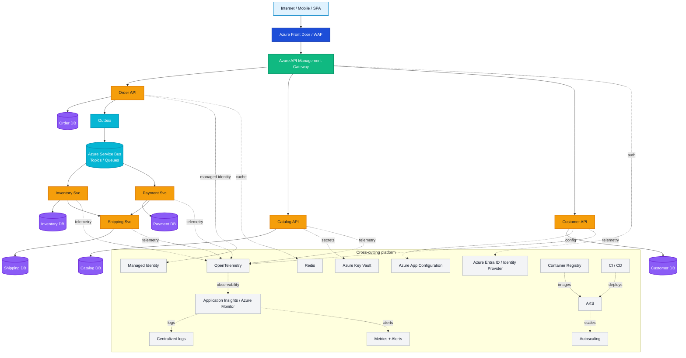

The exact technologies can change. The important interview point is
explaining **why each architectural choice exists**.


# 1. Draw and explain the complete Microservices architecture of your current/recent project

A strong experienced-level answer should not start by listing
technologies. Start with the **business problem**, then explain service
boundaries, communication, data ownership, security, reliability,
observability, and deployment.

## Architecture
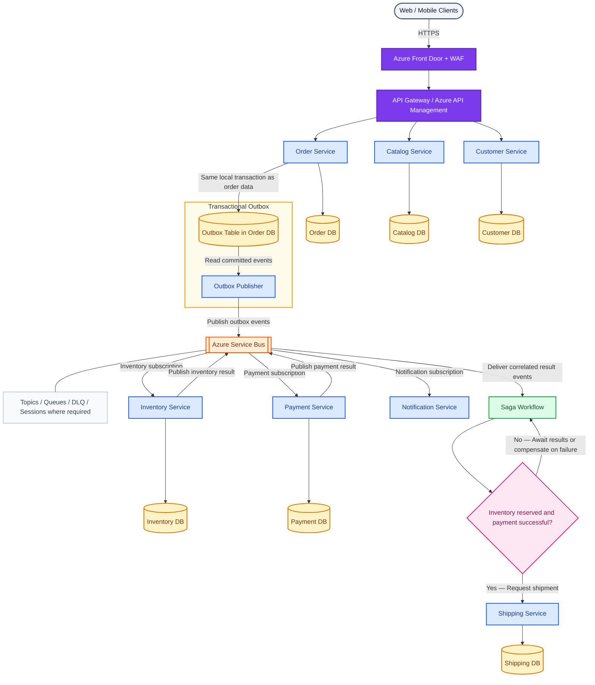

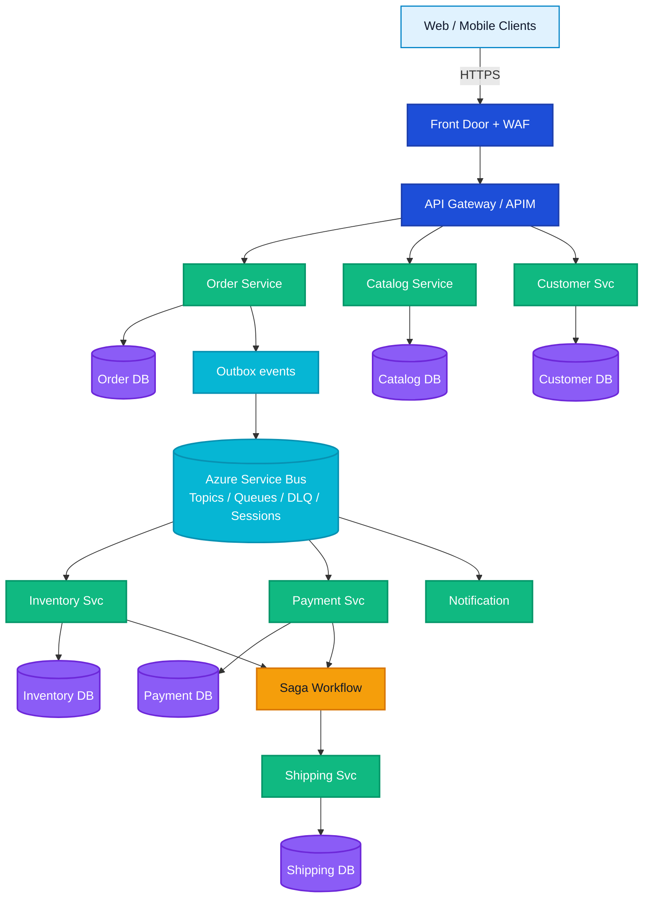

<!-- ``` text
                        +-----------------------+
                        | Web / Mobile Clients  |
                        +-----------+-----------+
                                    |
                                  HTTPS
                                    |
                                    v
                        +-----------------------+
                        | Front Door + WAF      |
                        +-----------+-----------+
                                    |
                                    v
                        +-----------------------+
                        | API Gateway / APIM    |
                        +-----------+-----------+
                                    |
       +----------------------------+----------------------------+
       |                            |                            |
       v                            v                            v
+--------------+             +--------------+             +--------------+
| Order Service|             |Catalog Service|            |Customer Svc  |
+------+-------+             +------+-------+             +------+-------+
       |                            |                            |
       v                            v                            v
   Order DB                    Catalog DB                   Customer DB
       |
       | Outbox events
       v
+---------------------------------------------------------------+
|                    Azure Service Bus                          |
|      Topics / Queues / DLQ / Sessions where required          |
+----------+----------------+----------------+-------------------+
           |                |                |
           v                v                v
   +---------------+ +---------------+ +---------------+
   | Inventory Svc | | Payment Svc   | |Notification   |
   +-------+-------+ +-------+-------+ +---------------+
           |                 |
           v                 v
     Inventory DB       Payment DB
           \                 /
            \               /
             v             v
             +---------------+
             | Saga Workflow |
             +-------+-------+
                     |
                     v
               Shipping Svc
                     |
                 Shipping DB
``` -->

## Communication

I divide communication into two categories.

### Synchronous

Use HTTP/REST or gRPC when an immediate answer is required.

Example:

``` text
Gateway -> Catalog Service -> return product details
```

### Asynchronous

Use messaging for business workflows and events.

Example:

``` text
OrderCreated
InventoryReserved
PaymentCompleted
ShipmentCreated
```

This reduces runtime coupling.

## Data ownership

Each service owns its database.

``` text
Order Service     -> Order DB
Inventory Service -> Inventory DB
Payment Service   -> Payment DB
Shipping Service  -> Shipping DB
```

No service directly updates another service's tables.

## Reliability

I would include:

-   Timeout
-   Retry with exponential backoff and jitter
-   Circuit breaker
-   Idempotency
-   Transactional Outbox
-   Inbox/deduplication
-   Dead-letter queues
-   Saga compensation

## Security

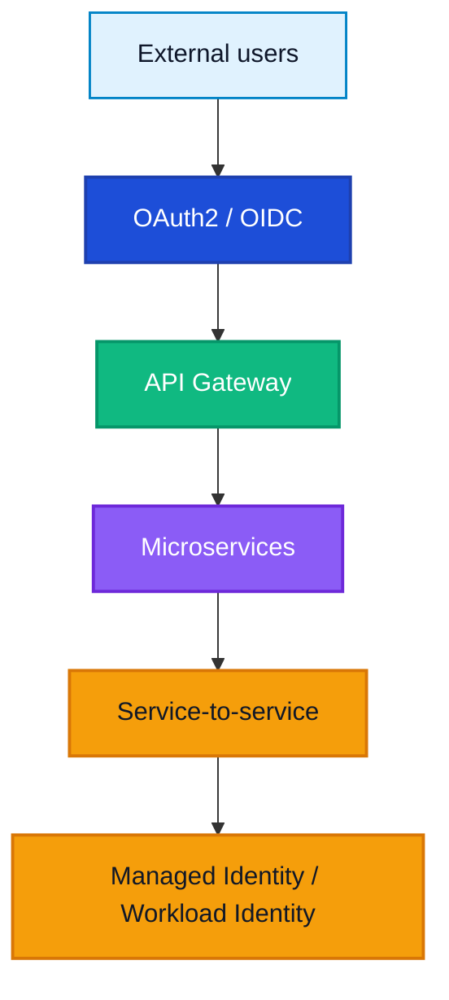

Secrets are stored in Key Vault rather than application configuration
files.

## Observability

All services emit:

``` text
Logs
Metrics
Traces
```

using OpenTelemetry.

Trace context is propagated across HTTP and message headers.

## Deployment

Every service is packaged independently:

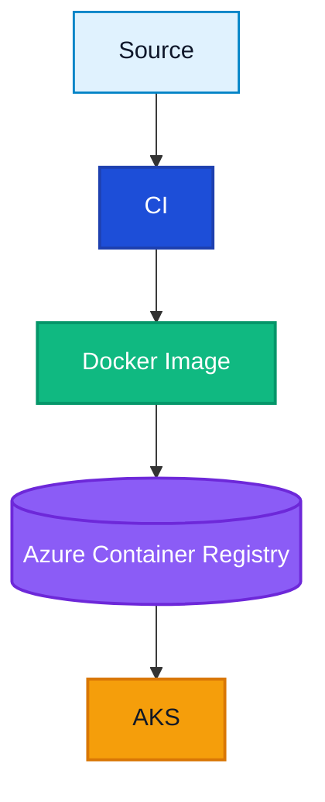

Kubernetes handles:

-   Replicas
-   Rolling deployments
-   Self-healing
-   Health probes
-   Horizontal scaling

## Interview-ready answer

> In my architecture, services are aligned to business capabilities
> rather than technical layers. Each service owns its data and can be
> deployed independently. External traffic enters through an API
> Gateway, while asynchronous business workflows use Azure Service Bus.
> We use Saga, Outbox and idempotent consumers for distributed
> consistency; OAuth2 and Managed Identity for security; OpenTelemetry
> for tracing; and Docker/AKS for deployment and scaling. The goal is
> independent evolution while controlling the operational complexity
> introduced by distributed systems.


# 2. Why did you choose Microservices instead of a Modular Monolith?

This question tests whether you understand that microservices are **not
automatically superior**.

## Modular Monolith

``` text
Application
 |
 +-- Orders Module
 +-- Inventory Module
 +-- Payment Module
 +-- Shipping Module
 |
 +-- One deployment
```

A modular monolith can have excellent domain boundaries without network
distribution.

## Reasons that may justify Microservices

### Independent deployment

Payment changes should not require deploying the entire platform.

### Independent scaling

Catalog may receive 20 times more traffic than Shipping.

``` text
Catalog: 20 pods
Shipping: 3 pods
```

### Different availability requirements

Payment may require stronger operational controls than Notification.

### Team autonomy

Independent teams can own services end-to-end.

### Fault isolation

Notification failure should not necessarily stop order placement.

### Different workload characteristics

Catalog is read-heavy.

Order processing is transactional.

Analytics may be stream-heavy.

## Reasons not to choose Microservices

I would avoid microservices if:

-   Team is small
-   Domain is still unstable
-   Deployment frequency is low
-   Scaling requirements are uniform
-   Operational maturity is low
-   Independent deployment has little value

## Interview-ready answer

> I would choose microservices only when independent deployment,
> scaling, ownership or reliability boundaries justify the additional
> distributed-system complexity. If those requirements are absent, I
> prefer a modular monolith because it provides strong domain separation
> with simpler transactions, debugging, deployment and operations.


# 3. How did you determine the Bounded Contexts and service boundaries?

I start from the **business domain**, not database tables.

## Example

Instead of:

``` text
CustomerTableService
OrderTableService
PaymentTableService
```

identify capabilities:

``` text
Ordering
Inventory
Payments
Shipping
Catalog
```

## DDD Bounded Context

A bounded context defines a boundary inside which a domain model and
terminology have a specific meaning.

For example:

### Ordering context

``` text
Order
OrderLine
OrderStatus
CustomerReference
```

### Shipping context

``` text
Shipment
Package
DeliveryAddress
TrackingStatus
```

An "Order" and a "Shipment" are related, but they are not the same
aggregate.

## Techniques

I use:

-   Domain workshops
-   Event Storming
-   Business capability mapping
-   Aggregate analysis
-   Change-frequency analysis
-   Data ownership analysis
-   Team ownership
-   Dependency analysis

## Events reveal boundaries

Example domain events:

``` text
OrderPlaced
InventoryReserved
PaymentAuthorized
ShipmentCreated
```

They naturally expose interactions between contexts.

## Boundary questions

For each candidate service:

``` text
Does it own clear business rules?
Can it own its data?
Can it change independently?
Can it be deployed independently?
Does it have a stable contract?
Does splitting it create too much chatty communication?
```

## Interview-ready answer

> I use DDD and business capability analysis rather than splitting by
> tables or controllers. I identify bounded contexts through domain
> language, aggregates, business rules, ownership and domain events. I
> validate the boundary by checking whether the capability can own its
> data and evolve independently without creating excessive synchronous
> communication.


# 4. What problems did Microservices introduce that didn't exist in your Monolith?

A senior answer should acknowledge the costs.

## Monolith

An in-process call:

``` csharp
paymentService.Pay(order);
```

is fast and relatively reliable.

Microservices convert it into:

``` text
Network
Serialization
Authentication
Timeout
Retry
Tracing
Versioning
Partial failure
```

## Problems introduced

### Network failures

Remote calls can timeout or fail independently.

### Distributed transactions

One ACID transaction no longer covers the entire workflow.

### Eventual consistency

Users may observe temporary intermediate states.

### Observability complexity

A request may cross 5--10 services.

### Deployment complexity

Instead of one artifact:

``` text
20 services
20 pipelines
20 images
many configurations
```

### Contract compatibility

One service can break another by changing APIs/events.

### Testing complexity

Integration and end-to-end environments become harder.

### Operational cost

You now need:

-   Container orchestration
-   Messaging
-   Distributed tracing
-   Centralized logging
-   Secret management
-   Service discovery
-   Monitoring

## Interview-ready answer

> Microservices replaced in-process problems with distributed-system
> problems: partial failures, network latency, eventual consistency,
> message duplication, distributed tracing, contract compatibility and
> operational complexity. That's why I don't treat microservices as
> simply splitting a large API into smaller APIs.


# 5. How would you prevent a Microservices architecture from becoming a Distributed Monolith?

A distributed monolith occurs when services are physically separated but
remain tightly coupled.

Bad architecture:

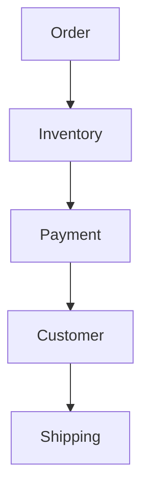

Every request depends synchronously on everything else.

## Warning signs

-   Shared database
-   Shared tables
-   Services must deploy together
-   Long synchronous call chains
-   Shared domain libraries everywhere
-   Circular dependencies
-   Breaking changes require coordinated releases
-   One service failure takes down many others

## Prevention

### Strong data ownership

``` text
Service A cannot directly query Service B's DB.
```

### Async communication

Use events where immediate response is unnecessary.

### Stable contracts

Treat APIs/events as product contracts.

### Avoid shared business libraries

Sharing technical libraries is reasonable.

Sharing domain entities across all services creates coupling.

### Independent CI/CD

A service should normally be deployable without coordinated releases.

### Consumer-driven contract tests

Verify compatibility automatically.

### Architecture dependency rules

Track service dependency graphs.

## Interview-ready answer

> I define autonomy as a measurable architectural requirement. Services
> own their data, communicate through explicit contracts, avoid long
> synchronous chains, and deploy independently. If multiple services
> must always change and deploy together, I question whether they are
> truly separate bounded contexts.


# 6. How do you design an Order → Inventory → Payment → Shipping workflow?

This is a classic Saga problem.

## State flow

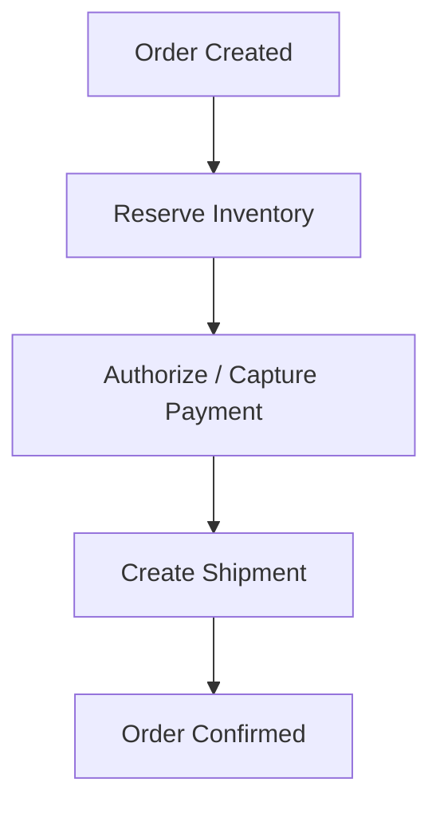

For a business-critical workflow, I often prefer orchestration.
<!-- 
``` text
                     +------------------+
                     | Order Saga       |
                     | Orchestrator     |
                     +--------+---------+
                              |
             +----------------+----------------+
             |                |                |
             v                v                v
        Inventory          Payment          Shipping
``` -->
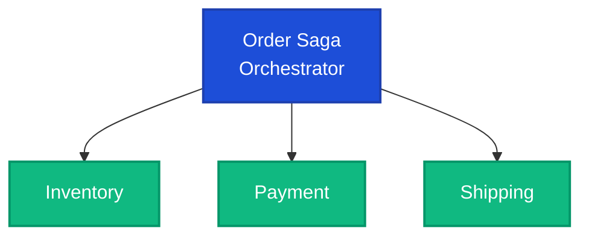

## Example state machine

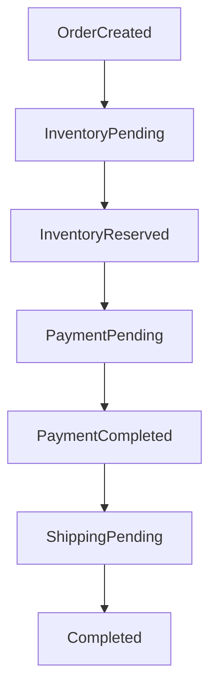

Possible failure states:

``` text
InventoryFailed
PaymentFailed
ShippingFailed
Compensating
Cancelled
ManualReview
```

## Why explicit states?

They make:

-   Recovery easier
-   Monitoring easier
-   User status clearer
-   Duplicate handling safer

## Interview-ready answer

> I model the workflow as a durable Saga state machine. Each service
> performs a local transaction and publishes a result. The orchestrator
> advances the workflow, handles timeout/retry, and triggers
> compensation when necessary. I persist Saga state so the workflow
> survives process restarts.

 

# 7. What happens if Payment succeeds but Inventory/Shipping fails?

Never simply say "rollback payment."

Payment may already have been processed by an external provider.

## Scenario

``` text
Inventory Reserved
Payment Captured
Shipping Creation Failed
```

Possible compensation:

``` text
1. Retry Shipping if failure is transient.
2. If shipping cannot be created:
   Refund/Void Payment
3. Release Inventory
4. Cancel Order
```

## Important distinction

``` text
Technical rollback != Business compensation
```

Payment compensation may be:

``` text
Original:
Charge ₹5,000

Compensation:
Refund ₹5,000
```

Both transactions remain in audit history.

## What if refund fails?

Do not lose the workflow.

``` text
Saga status = CompensationFailed
```

Then:

-   Retry safely
-   Send to exception queue
-   Raise alert
-   Provide operations/manual recovery
-   Run reconciliation

## Interview-ready answer

> Once a payment has succeeded, I don't pretend the original transaction
> can always be rolled back. The Saga executes a business compensation
> such as void or refund. If compensation itself fails, the workflow
> enters a recoverable exception state with retries, alerting and
> reconciliation rather than silently becoming inconsistent.


# 8. How do you guarantee consistency without a distributed ACID transaction?

You normally cannot guarantee instantaneous ACID consistency across
independent services without distributed coordination.

Instead, design **business consistency**.

## Building blocks

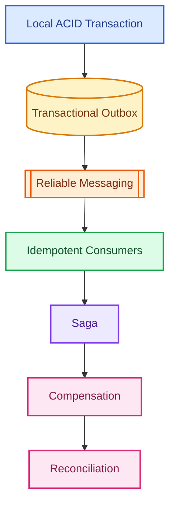

## Example

Order Service transaction:

``` text
BEGIN

INSERT Order
INSERT OutboxMessage(OrderCreated)

COMMIT
```

Outbox publisher sends the event.

Inventory processes it:

``` text
BEGIN

Check Inbox/Event ID
Reserve inventory
Insert Inbox record
Insert InventoryReserved Outbox event

COMMIT
```

## Result

Each service has local transactional guarantees.

The overall workflow converges through messages.

## Interview-ready answer

> I don't claim distributed ACID semantics when the architecture doesn't
> provide them. I guarantee local atomicity and build reliable workflow
> consistency using Outbox, Inbox/idempotency, durable messaging, Saga
> compensation and reconciliation. The business state becomes eventually
> consistent and every intermediate state is explicit.


# 9. How would you design Saga orchestration and compensation?

## Saga state table

Example:

``` text
SagaId
OrderId
CurrentState
InventoryReservationId
PaymentTransactionId
ShipmentId
RetryCount
CreatedAt
UpdatedAt
Version
```

## Flow

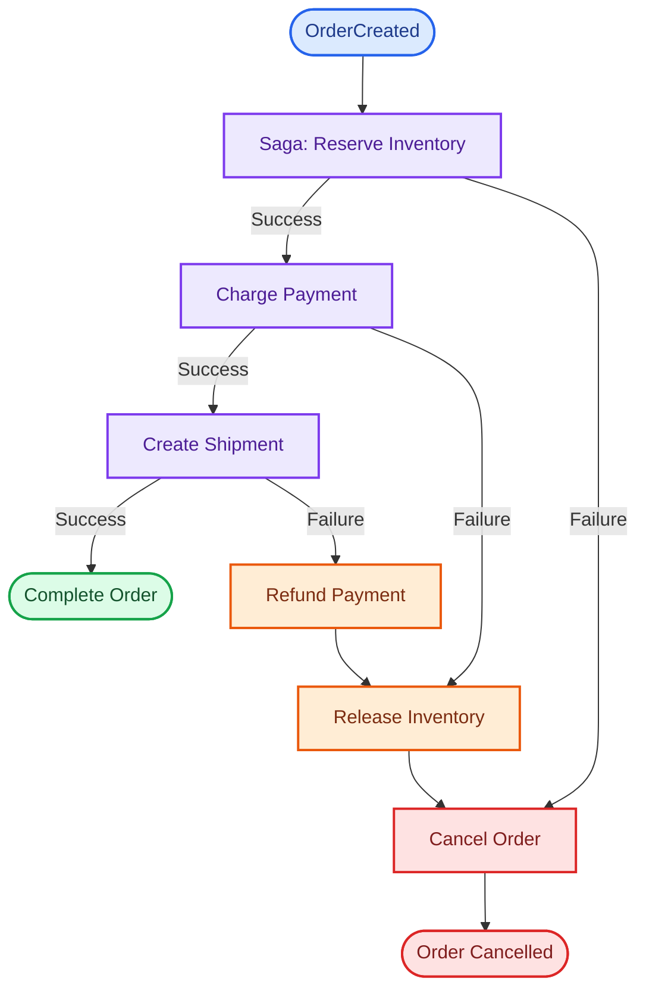


## Production requirements

-   Durable Saga state
-   Correlation ID
-   Idempotent commands
-   Timeouts
-   Retry policy
-   Optimistic concurrency
-   Compensation
-   DLQ
-   Observability
-   Manual recovery
-   Workflow versioning

## Avoid

Do not keep Saga state only in application memory.

If the pod restarts:

``` text
Saga state disappears
```

## Interview-ready answer

> My Saga orchestrator is a durable state machine, not a sequence of
> in-memory calls. It stores state and correlation identifiers, sends
> idempotent commands, processes responses, applies timeout/retry rules,
> and triggers compensating business operations in reverse dependency
> order where appropriate.

 

# 10. How do you guarantee idempotency for Payment APIs?

Payment is one of the most important places for idempotency.

Client sends:

``` http
POST /payments
Idempotency-Key: order-123-payment-1
```

## Server

Store:

``` text
IdempotencyKey
RequestHash
PaymentId
Status
Response
CreatedAt
```

Before charging:

``` text
Does key exist?
 |
 +-- Yes -> return previous result
 |
 +-- No -> process payment and store result atomically
```

## Database constraint

Create a unique constraint:

``` text
UNIQUE(IdempotencyKey)
```

This protects against concurrent duplicates.

## Why request hash?

If a client accidentally reuses the same key with different data:

``` text
Key = ABC
First request = ₹1,000
Second request = ₹10,000
```

reject the conflicting request rather than returning an unrelated
result.

## External payment provider

Pass an idempotency identifier to the provider if supported.

## Interview-ready answer

> For payment commands I require an idempotency key. I persist the key
> and result with a unique database constraint and validate that retries
> carry the same request semantics. A duplicate request returns the
> original result rather than charging again. Where supported, I
> propagate an idempotency key to the external payment provider as well.

 

# 11. How do you solve the dual-write problem between a database and message broker?

The dual-write problem:

``` text
1. Update DB
2. Publish message
```

Failure case:

``` text
DB commit succeeds
Application crashes
Message never publishes
```

Reverse order also fails:

``` text
Message published
DB transaction fails
```

## Solution: Transactional Outbox

Write business data and the event into the same local database
transaction.

``` text
BEGIN

INSERT Order
INSERT OutboxMessage

COMMIT
```

A separate publisher sends the outbox record to the broker.

## Interview-ready answer

> I avoid trying to make the database and broker participate in one
> fragile application-level dual write. Instead I atomically persist the
> business change and an Outbox record in the same database transaction,
> then asynchronously publish the Outbox message.

 

# 12. Explain Transactional Outbox + Inbox patterns

## Outbox

Producer:

``` text
Order DB

Orders
----------------
OrderId
Status

Outbox
----------------
MessageId
Type
Payload
CreatedAt
PublishedAt
```

Transaction:

``` text
BEGIN
  INSERT Order
  INSERT Outbox
COMMIT
```

Publisher:

``` text
Read unpublished Outbox
      |
Publish
      |
Mark published
```

## Why can duplicates still occur?

Imagine:

``` text
Publish succeeds
       |
Publisher crashes
       |
PublishedAt was never updated
```

The same event can be published again.

Therefore consumers must support duplicates.

## Inbox

Consumer stores processed message IDs.

``` text
Inbox
----------------
MessageId
Consumer
ProcessedAt
```

Consumer transaction:

``` text
BEGIN

IF MessageId already exists
    ignore

Perform business change
Insert Inbox MessageId
Insert new Outbox events if required

COMMIT
```

## Interview-ready answer

> Outbox solves atomic persistence of business state and events on the
> producer. Inbox provides deduplication on the consumer. Together they
> support reliable at-least-once messaging without assuming that the
> broker and database share a transaction.

 

# 13. How would you recover stuck or partially completed workflows?

Production systems need a recovery strategy.

## Persist workflow state

Never depend solely on memory.

``` text
SagaId
State
LastUpdated
NextAction
RetryCount
```

## Detect stuck workflows

Example query:

``` text
State = PaymentPending
AND LastUpdated < now - 10 minutes
```

A scheduled recovery worker can inspect them.

## Recovery techniques

-   Retry transient steps
-   Resume Saga from persisted state
-   Republish missing commands safely
-   Query external provider status
-   Execute compensation
-   Move unrecoverable messages to DLQ
-   Manual operations dashboard
-   Reconciliation jobs

## Payment reconciliation example

Suppose the service timed out while calling a provider.

Do **not** immediately assume payment failed.

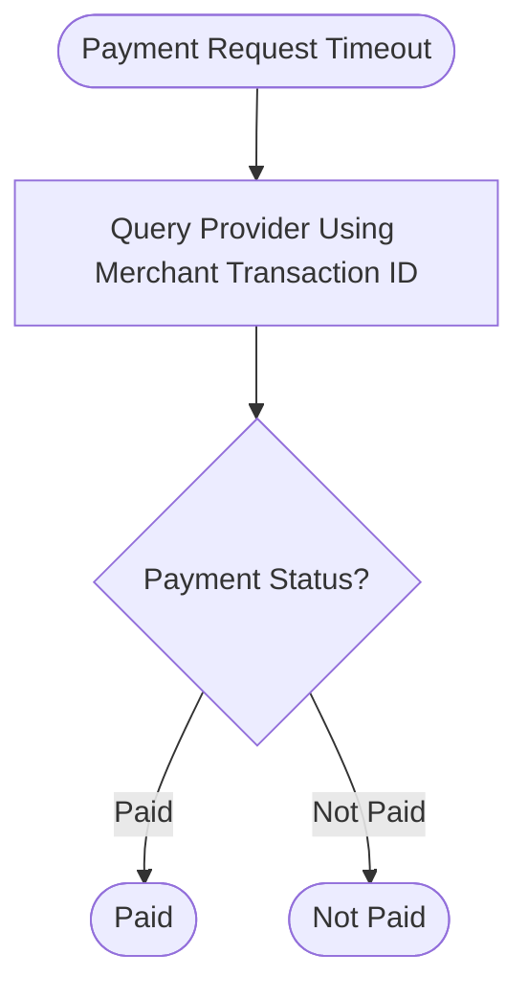

This prevents duplicate charges.

## Interview-ready answer

> I persist every workflow state and use correlation IDs so recovery is
> deterministic. A watchdog/reconciliation process finds Sagas that
> exceed expected durations. It resumes safe steps, checks external
> systems when outcomes are ambiguous, compensates when required, and
> escalates unrecoverable cases to DLQ/manual operations.

 

# 14. How do you design Microservices for millions of requests?

"Millions of requests" alone is not enough.

Clarify:

``` text
Millions per day?
Per hour?
Peak RPS?
Read/write ratio?
Payload size?
Latency SLO?
Regional distribution?
```

## Scale horizontally

Services should be stateless where practical:

``` text
Load Balancer
   |
   +--> Pod 1
   +--> Pod 2
   +--> Pod 3
   +--> Pod N
```

## Cache

Use Redis/CDN where appropriate.

``` text
Client
 |
Cache
 |
Database
```

Avoid caching data that cannot safely be stale.

## Async processing

Move non-immediate work to queues.

``` text
HTTP Request
   |
Create job
   |
Queue
   |
Workers
```

## Database

Often the real bottleneck.

Consider:

-   Correct indexes
-   Query plans
-   Connection pooling
-   Read replicas
-   Partitioning
-   Sharding when truly necessary
-   Efficient pagination
-   Avoid N+1 queries
-   Batch writes

## Rate limiting

Protect expensive endpoints.

## Autoscaling

Scale on relevant signals:

``` text
CPU
Memory
RPS
Queue length
Consumer lag
```

## Interview-ready answer

> I first quantify peak load and SLOs. Then I design stateless
> horizontal scaling, caching, asynchronous work, efficient data access,
> partitioning where necessary, rate limiting and autoscaling. I
> load-test the entire dependency chain because scaling application pods
> alone does not solve database, broker or external API bottlenecks.

 

# 15. How do you identify the actual bottleneck when adding more pods doesn't improve performance?

This is an important senior-level troubleshooting question.

Suppose:

``` text
3 pods -> 2,000 RPS
6 pods -> 2,050 RPS
12 pods -> 2,060 RPS
```

The application tier is probably not the limiting resource.

## Investigate saturation

### Database

Check:

-   CPU
-   Query duration
-   Locks
-   Deadlocks
-   IOPS
-   Connection pool
-   Slow queries

### Downstream APIs

``` text
Payment API max = 500 RPS
```

Adding pods cannot exceed the dependency limit.

### Message broker

Check:

-   Throughput
-   Partitions
-   Consumer lag
-   Throttling

### Application resources

-   Thread pool starvation
-   Socket exhaustion
-   GC pressure
-   CPU
-   Memory
-   Connection pool limits

### Kubernetes

-   CPU throttling
-   Incorrect requests/limits
-   Node saturation
-   Network constraints

## Use traces

Distributed tracing can show:

``` text
Total request: 900 ms

Order Service code: 20 ms
Database:           650 ms
Payment call:       200 ms
Other:               30 ms
```

The database is the primary target, not pod count.

## Interview-ready answer

> When scaling pods stops improving throughput, I stop treating the
> application replica count as the problem. I use metrics, profiling and
> distributed traces to locate the saturated shared
> dependency---database, connection pool, broker, external API, node
> resources, locks or I/O. Horizontal scaling only helps when the
> bottleneck is actually in a horizontally scalable tier.

 

# 16. How do you implement end-to-end distributed tracing across HTTP calls and messages?

Use OpenTelemetry.

## Trace structure

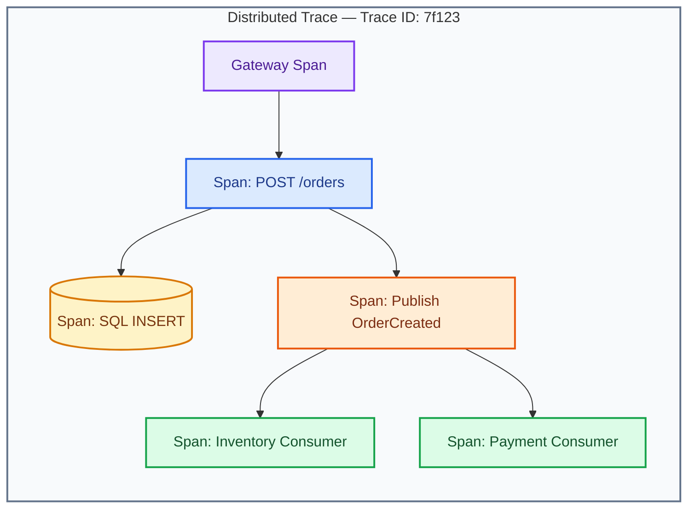

## HTTP

W3C Trace Context commonly uses:

``` text
traceparent
tracestate
```

Instrumentation propagates context through outgoing HTTP requests.

## Messaging

Trace context must also be propagated through message
properties/headers.

``` text
Message:
  EventId
  CorrelationId
  traceparent
```

Consumer extracts the context and starts a child/linked span as
appropriate.

## .NET concept

``` csharp
builder.Services.AddOpenTelemetry()
    .WithTracing(tracing =>
    {
        tracing
            .AddAspNetCoreInstrumentation()
            .AddHttpClientInstrumentation();
    });
```

Then export to the chosen observability backend.

## Important IDs

Do not confuse:

``` text
TraceId       -> technical distributed trace
CorrelationId -> business/request correlation
OrderId       -> domain identifier
MessageId     -> message identity/deduplication
```

All can be useful.

## Interview-ready answer

> I instrument services with OpenTelemetry and propagate W3C trace
> context over HTTP and message headers. The same trace can then connect
> gateway processing, service spans, database calls and asynchronous
> consumers. I also retain business correlation IDs such as
> OrderId/SagaId because technical trace IDs alone are not enough for
> operational investigations.

 

# 17. How do you define SLOs and monitor P95/P99 latency, error rate, saturation and consumer lag?

## SLI

A Service Level Indicator is a measured signal.

Examples:

``` text
Availability
Latency
Error rate
Queue processing delay
```

## SLO

A Service Level Objective is the target.

Example:

``` text
99.9% of valid API requests succeed per month.

95% of order reads complete < 300 ms.

99% complete < 800 ms.
```

## Why P95/P99?

Average latency can hide poor tail performance.

Example:

``` text
90 requests = 100 ms
10 requests = 5 seconds
```

Average may look acceptable while many users experience severe latency.

Track:

``` text
P50
P95
P99
```

## Core operational signals

### Latency

``` text
P95 / P99 request duration
```

### Traffic

``` text
Requests per second
Messages per second
```

### Errors

``` text
5xx
Timeouts
Failed messages
```

### Saturation

``` text
CPU
Memory
DB connections
Thread pool
Disk I/O
```

### Messaging

``` text
Queue depth
Oldest message age
Consumer lag
DLQ count
Processing rate
```

## Alerting

Do not alert on every small metric spike.

Prefer alerts tied to user impact and SLO burn.

## Interview-ready answer

> I define SLIs around user-visible reliability---success rate and
> latency---and set measurable SLOs such as availability plus P95/P99
> latency. I then monitor saturation and dependency metrics to explain
> why an SLO is at risk. For event-driven services, queue depth,
> oldest-message age, processing rate and consumer lag are first-class
> operational signals.

 

# 18. How do you handle zero-downtime deployments and backward-compatible contracts?

Zero downtime requires application, infrastructure, and database
compatibility.

## Rolling deployment

``` text
Version 1:
Pod A
Pod B
Pod C

Deploy V2 gradually:

Pod A V2
Pod B V1
Pod C V1
```

During deployment, V1 and V2 coexist.

Therefore contracts must be compatible.

## API compatibility

Prefer additive changes.

Old:

``` json
{
  "id": 1,
  "name": "Book"
}
```

New:

``` json
{
  "id": 1,
  "name": "Book",
  "category": "Education"
}
```

Avoid suddenly removing or renaming required fields.

## Database: Expand and Contract

### Release 1 --- Expand

Add new column/table while old code still works.

### Release 2

Deploy code that writes/reads the new structure.

### Release 3 --- Contract

Remove old structure only after no deployed version depends on it.

## Messaging

Consumers should tolerate additive fields.

For breaking semantic changes, version the event.

## Kubernetes

Use:

-   Readiness probes
-   RollingUpdate
-   PodDisruptionBudget where appropriate
-   Graceful shutdown
-   `preStop`/termination handling where needed
-   Proper `maxUnavailable`/`maxSurge`

## Blue/Green

``` text
Blue = current
Green = new

Validate Green
Switch traffic
```

## Canary

``` text
5% -> new
25% -> new
50% -> new
100% -> new
```

Useful for risk reduction.

## Interview-ready answer

> Zero downtime depends on coexistence. I assume old and new versions
> will run simultaneously, so APIs, events and schemas must remain
> backward compatible. I use rolling, canary or blue/green deployment as
> appropriate and apply expand-and-contract database migrations rather
> than destructive schema changes in the same release.

 

# 19. How would you secure an entire Microservices ecosystem using Gateway + OAuth2 + Managed Identity + Key Vault?

Use layered security.

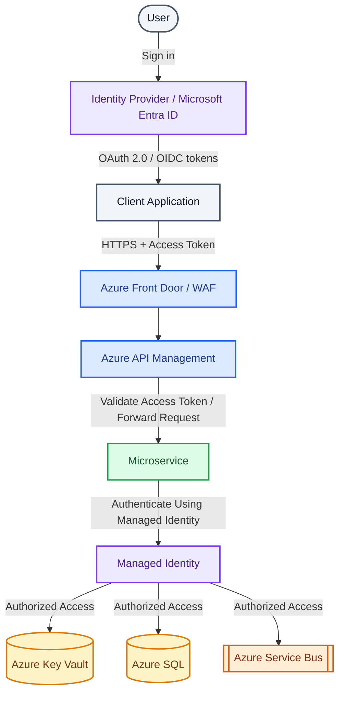

## User authentication

The user authenticates with the identity provider.

Client receives an access token.

## Gateway

Gateway can:

-   Validate token
-   Reject invalid traffic
-   Apply rate limits
-   Apply API policies
-   Route requests

## Service authorization

Backend service validates authorization requirements.

Example:

``` text
scope = orders.write
role = OrderManager
```

Do not rely only on:

``` text
"The gateway already checked it."
```

## Service-to-service authentication

Use Managed Identity / workload identity where Azure resources support
it.

Example:

``` text
Order Service
   |
Managed Identity
   |
Service Bus
```

No connection-string password needs to be stored.

## Key Vault

Store secrets that cannot be eliminated:

-   Third-party API keys
-   Certificates
-   Legacy credentials

Use Managed Identity to access Key Vault.

## Network security

Additionally use:

-   Private endpoints where justified
-   Network policies
-   NSGs
-   TLS
-   WAF
-   Restricted ingress
-   Least privilege

## Interview-ready answer

> I use OAuth2/OIDC for user and client identity, enforce edge policies
> at API Management, and still enforce resource authorization in the
> services. For Azure service-to-service access I prefer Managed
> Identity/workload identity so credentials do not need to be
> distributed. Secrets that remain are stored in Key Vault, and network
> access is restricted using private connectivity and least privilege.

 

# 20. Design a production-grade .NET/Azure Microservices system from scratch and explain every architectural trade-off

This is the culmination of the previous questions.

 

## Step 1 --- Understand the domain before selecting technologies

Requirements:

``` text
Order platform
High traffic
Payments
Inventory
Shipping
Notifications
Independent teams
24x7 availability
Audit requirements
```

Do not begin with:

``` text
"We need Kubernetes and Kafka."
```

Begin with business requirements and SLOs.

 

## Step 2 --- Define bounded contexts

``` text
Identity
Customer
Catalog
Ordering
Inventory
Payment
Shipping
Notification
```

### Trade-off

Too few services:

``` text
Large coupling
Poor independent deployment
```

Too many services:

``` text
Network chatter
Operational overhead
Complex workflows
```

Start coarse-grained and split only where justified.

 

## Step 3 --- Choose .NET service architecture

Each service:

``` text
ASP.NET Core API
Application layer
Domain layer
Infrastructure layer
```

Conceptually:

``` text
API
 |
Application
 |
Domain
 |
Infrastructure
```

Use Clean Architecture pragmatically, not dogmatically.

### Trade-off

More abstraction improves separation but excessive
interfaces/repositories can create ceremony.

 

## Step 4 --- API Gateway

Use Azure API Management.

Responsibilities:

``` text
Routing
OAuth/token policies
Rate limiting
Version routing
Request policies
Observability headers
```

Avoid domain logic.

 

## Step 5 --- Data ownership

``` text
Order Service     -> PostgreSQL/Azure SQL
Payment Service   -> Payment DB
Inventory Service -> Inventory DB
```

### Trade-off

Database-per-service improves autonomy but makes joins and distributed
transactions harder.

That complexity is intentional and must be solved through
APIs/events/read models.

 

## Step 6 --- Communication

### REST

For synchronous client-facing/query operations.

### gRPC

For high-performance internal synchronous communication when justified.

### Azure Service Bus

For durable commands/events and workflows.

Example:

``` text
OrderCreated
InventoryReserved
PaymentCompleted
```

### Trade-off

Synchronous calls are simpler but increase temporal coupling.

Async messaging improves resilience but introduces eventual consistency
and operational complexity.

 

## Step 7 --- Distributed transactions

Use:

``` text
Saga
+
Outbox
+
Inbox
+
Idempotency
```

Never assume exactly-once processing across the entire distributed
system.

Design for safe at-least-once delivery.

 

## Step 8 --- Caching

Use Redis for suitable hot/read-heavy data.

Examples:

``` text
Catalog
Reference data
Session-independent computed data
```

### Trade-off

Caching improves latency and database load but introduces invalidation
and stale-data problems.

Do not cache simply because Redis is available.

 

## Step 9 --- Security

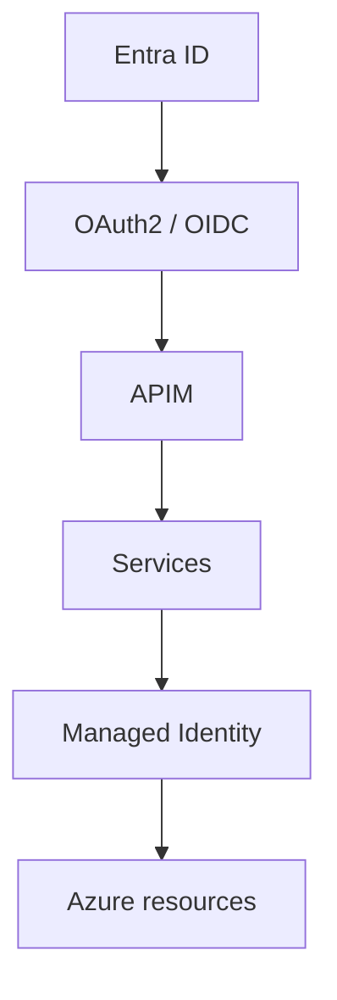

Use Key Vault for unavoidable secrets.

Apply least privilege.

 

## Step 10 --- Containerization

Each service:

``` text
Docker image
```

Build once and promote the same immutable artifact across environments.

 

## Step 11 --- AKS

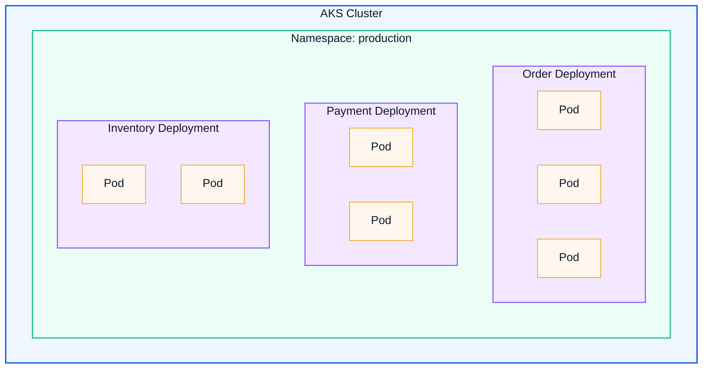

Use:

-   Deployments
-   Services
-   ConfigMaps
-   Workload Identity
-   Readiness/liveness/startup probes
-   Resource requests/limits
-   PodDisruptionBudgets where justified

 

## Step 12 --- Autoscaling

### HPA

Scale APIs based on signals such as CPU or custom metrics.

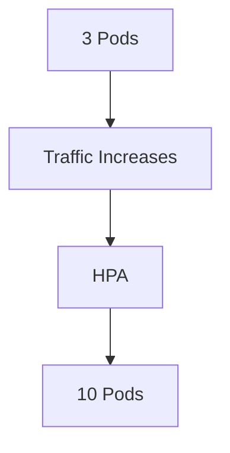

### KEDA

Useful for event-driven workers.

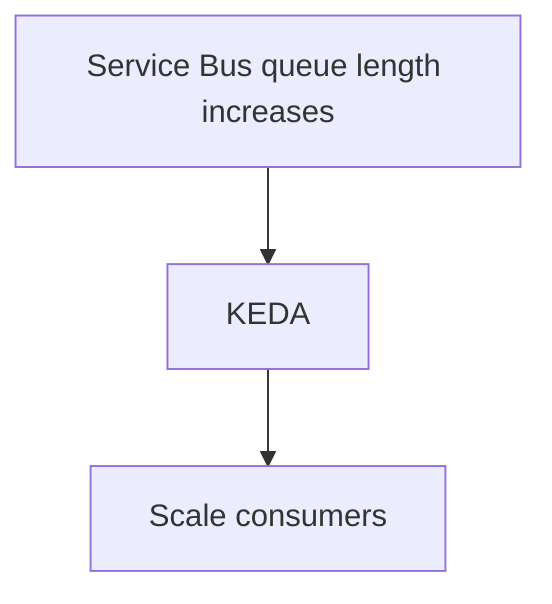

### Cluster autoscaling

If pods cannot be scheduled:

``` text
More nodes are added
```

### Trade-off

Autoscaling is not a substitute for performance engineering.

If the database is saturated, adding pods may worsen the problem.

 

## Step 13 --- Resilience

For remote calls:

``` text
Timeout
Retry
Circuit Breaker
Bulkhead
Rate limiting
```

Use modern .NET resilience handlers/Polly where appropriate.

Avoid retries for unsafe operations unless idempotency is guaranteed.

 

## Step 14 --- Observability

Use OpenTelemetry.

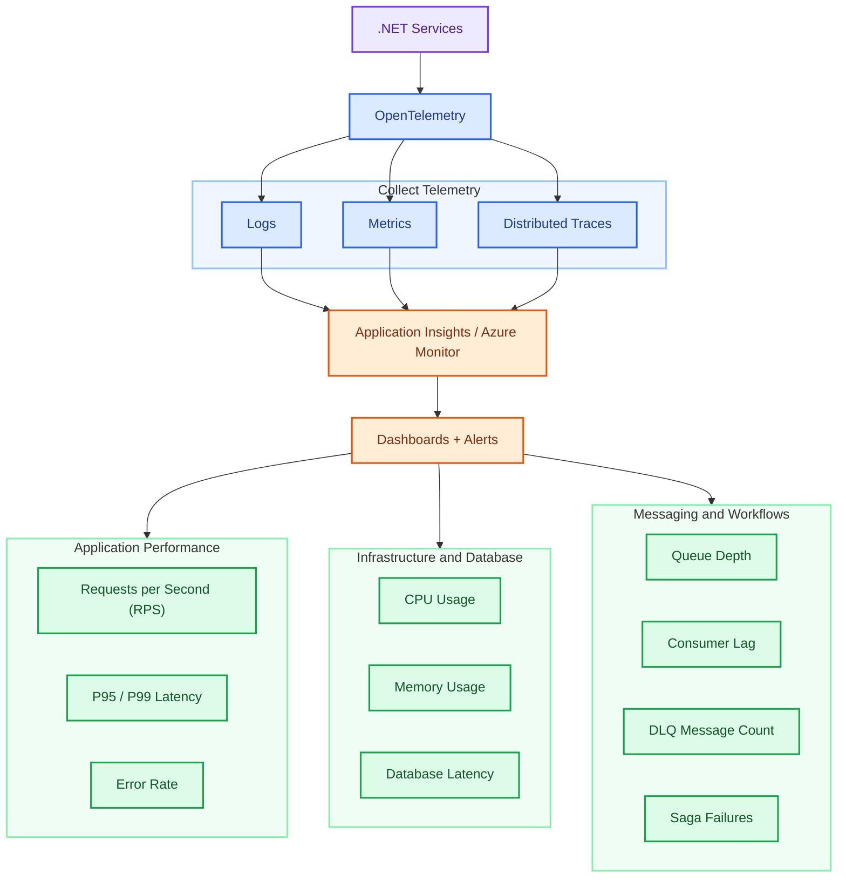

 

## Step 15 --- CI/CD

``` mermaid
flowchart TD
    G(["Git"]) --> PR["Pull Request"]

    subgraph CI["Continuous Integration"]
        direction TB
        BUILD["Build"] --> UNIT["Unit Tests"]
        UNIT --> INT["Integration Tests"]
        INT --> CONTRACT["Contract Tests"]
        CONTRACT --> SCAN["Security Scan"]
        SCAN --> DOCKER["Docker Build"]
        DOCKER --> ACR[["Push to Azure Container Registry"]]
    end

    PR --> BUILD

    subgraph CD["Continuous Delivery"]
        direction TB
        DEV["Deploy Dev"] --> QA["Deploy QA"]
        QA --> CANARY["Production Canary"]
        CANARY --> CHECK{"Health Checks Passed?"}
        CHECK -->|"Yes"| PROD(["Full Production Rollout"])
        CHECK -->|"No"| ROLLBACK["Roll Back"]
    end

    ACR --> DEV

    classDef source fill:#f1f5f9,stroke:#475569,color:#0f172a,stroke-width:2px
    classDef build fill:#dbeafe,stroke:#2563eb,color:#1e3a8a,stroke-width:2px
    classDef test fill:#dcfce7,stroke:#16a34a,color:#14532d,stroke-width:2px
    classDef security fill:#fef3c7,stroke:#d97706,color:#78350f,stroke-width:2px
    classDef registry fill:#ffedd5,stroke:#ea580c,color:#7c2d12,stroke-width:2px
    classDef deploy fill:#ede9fe,stroke:#7c3aed,color:#4c1d95,stroke-width:2px
    classDef failure fill:#fee2e2,stroke:#dc2626,color:#7f1d1d,stroke-width:2px

    class G,PR source
    class BUILD,DOCKER build
    class UNIT,INT,CONTRACT,PROD test
    class SCAN,CHECK security
    class ACR registry
    class DEV,QA,CANARY deploy
    class ROLLBACK failure

    style CI fill:#eff6ff,stroke:#93c5fd,stroke-width:2px
    style CD fill:#faf5ff,stroke:#c4b5fd,stroke-width:2px
```

Use Infrastructure as Code where possible.

Examples:

``` text
Bicep
Terraform
```

 

## Step 16 --- Contract management

APIs:

``` text
Backward-compatible changes
Version breaking changes
```

Events:

``` text
Schema evolution
Optional additive fields
Version when semantics change
```

Use contract tests.

 

## Step 17 --- Disaster recovery

Plan:

``` text
Backups
Restore testing
Multi-zone deployment
Regional recovery where business requires it
RPO
RTO
```

Definitions:

``` text
RPO = acceptable data loss window
RTO = acceptable recovery duration
```

Architecture should follow actual business targets.

 

# Complete Production Architecture

``` text
                         +--------------------------+
                         |      Web / Mobile        |
                         +------------+-------------+
                                      |
                                      v
                         +--------------------------+
                         | Azure Front Door + WAF   |
                         +------------+-------------+
                                      |
                                      v
                         +--------------------------+
                         | Azure API Management     |
                         +------------+-------------+
                                      |
               +----------------------+----------------------+
               |                      |                      |
               v                      v                      v
        +-------------+        +-------------+        +-------------+
        | Order API   |        | Catalog API |        | Customer API|
        | .NET / AKS  |        | .NET / AKS  |        | .NET / AKS |
        +------+------+        +------+------+        +------+------+
               |                      |                      |
               v                      v                      v
          Order DB                Catalog DB              Customer DB
               |
          Outbox Table
               |
               v
     +------------------------------------------------+
     |             Azure Service Bus                  |
     | Topics | Queues | DLQ | Sessions               |
     +-------+----------------+------------------------+
             |                |
             v                v
     +---------------+ +---------------+
     | Inventory Svc | | Payment Svc   |
     | .NET / AKS    | | .NET / AKS    |
     +-------+-------+ +-------+-------+
             |                 |
        Inventory DB       Payment DB
             |                 |
             +--------+--------+
                      |
                      v
                Saga Orchestrator
                      |
                      v
               +--------------+
               | Shipping Svc |
               +------+-------+
                      |
                 Shipping DB


Platform / Cross Cutting
------------------------------------------------------

Azure Entra ID
Managed Identity / Workload Identity
Azure Key Vault
Azure App Configuration
Azure Cache for Redis
Azure Container Registry
AKS
OpenTelemetry
Application Insights
Azure Monitor
CI/CD
Infrastructure as Code
Backup / DR
```
```mermaid
flowchart TD
  %% Edge / entry
  A[Web / Mobile] --> B[Azure Front Door + WAF]
  B --> C[Azure API Management]

  %% API layer
  C --> O[Order API<br/>.NET / AKS]
  C --> CA[Catalog API<br/>.NET / AKS]
  C --> CU[Customer API<br/>.NET / AKS]

  %% Core data stores
  O --> ODB[(Order DB)]
  CA --> CAB[(Catalog DB)]
  CU --> CDB[(Customer DB)]

  %% Outbox and messaging
  O --> OT[Outbox Table]
  OT --> SB[(Azure Service Bus<br/>Topics / Queues / DLQ / Sessions)]

  %% Async services
  SB --> I[Inventory Svc<br/>.NET / AKS]
  SB --> P[Payment Svc<br/>.NET / AKS]

  I --> IDB[(Inventory DB)]
  P --> PDB[(Payment DB)]

  %% Saga and fulfillment
  I --> SAGA[Saga Orchestrator]
  P --> SAGA
  SAGA --> S[Shipping Svc]
  S --> SDB[(Shipping DB)]

  %% Cross-cutting platform
  subgraph X[Platform / Cross Cutting]
    X1[Azure Entra ID]
    X2[Managed Identity / Workload Identity]
    X3[Azure Key Vault]
    X4[Azure App Configuration]
    X5[Azure Cache for Redis]
    X6[Azure Container Registry]
    X7[AKS]
    X8[OpenTelemetry]
    X9[Application Insights]
    X10[Azure Monitor]
    X11[CI / CD]
    X12[Infrastructure as Code]
    X13[Backup / DR]
  end

  %% Dotted dependencies
  C -. auth .-> X1
  O -. identity .-> X2
  CA -. secrets .-> X3
  CU -. config .-> X4
  O -. cache .-> X5
  X6 -. images .-> X7
  X7 -. runs .-> X11
  X7 -. deploys .-> X12
  O -. telemetry .-> X8
  CA -. telemetry .-> X8
  CU -. telemetry .-> X8
  I -. telemetry .-> X8
  P -. telemetry .-> X8
  S -. telemetry .-> X8
  X8 -. traces .-> X9
  X8 -. metrics .-> X10
  X13 -. recovery .-> ODB
  X13 -. recovery .-> CAB
  X13 -. recovery .-> CDB
  X13 -. recovery .-> IDB
  X13 -. recovery .-> PDB
  X13 -. recovery .-> SDB

  %% Styles
  classDef edge fill:#dbeafe,stroke:#2563eb,color:#0f172a,stroke-width:1.5px;
  classDef gateway fill:#1d4ed8,stroke:#1e40af,color:#ffffff,stroke-width:2px;
  classDef api fill:#10b981,stroke:#059669,color:#ffffff,stroke-width:2px;
  classDef db fill:#8b5cf6,stroke:#6d28d9,color:#ffffff,stroke-width:2px;
  classDef broker fill:#06b6d4,stroke:#0891b2,color:#ffffff,stroke-width:2px;
  classDef workflow fill:#f59e0b,stroke:#d97706,color:#111827,stroke-width:2px;
  classDef platform fill:#f3f4f6,stroke:#9ca3af,color:#111827,stroke-width:1.2px;

  class A edge;
  class B,C gateway;
  class O,CA,CU,I,P,S api;
  class ODB,CAB,CDB,IDB,PDB,SDB db;
  class OT,SB broker;
  class SAGA workflow;
  class X1,X2,X3,X4,X5,X6,X7,X8,X9,X10,X11,X12,X13 platform;
```

```mermaid
flowchart TD
    CLIENT(["Web / Mobile Clients"]) --> FD["Azure Front Door + WAF"]
    FD --> APIM["Azure API Management"]

    subgraph AKS["Azure Kubernetes Service (AKS) — .NET Workloads"]
        direction TB
        ORDER["Order API"]
        CATALOG["Catalog API"]
        CUSTOMER["Customer API"]
        PUB["Outbox Publisher"]
        INVENTORY["Inventory Service"]
        PAYMENT["Payment Service"]
        SAGA["Saga Orchestrator"]
        SHIPPING["Shipping Service"]
    end

    APIM --> ORDER & CATALOG & CUSTOMER

    subgraph ORDERDB["Order DB — Atomic Local Transaction"]
        DATA[("Order Data")]
        OUTBOX[("Outbox Table")]
    end

    ORDER -->|"Save order + event atomically"| ORDERDB
    CATALOG --> CDB[("Catalog DB")]
    CUSTOMER --> CUDB[("Customer DB")]

    OUTBOX -->|"Read committed events"| PUB
    PUB -->|"Publish OrderCreated"| BUS[["Azure Service Bus"]]
    BUS --- FEATURES["Topics / Queues / DLQ / Sessions"]

    BUS -->|"OrderCreated / Step results"| SAGA
    SAGA -->|"Publish step commands"| BUS

    BUS -->|"Reserve inventory command"| INVENTORY
    BUS -->|"Process payment command"| PAYMENT
    BUS -->|"Create shipment command"| SHIPPING

    INVENTORY --> IDB[("Inventory DB")]
    PAYMENT --> PDB[("Payment DB")]
    SHIPPING --> SDB[("Shipping DB")]
    SAGA --> SAGADB[("Saga State Store")]

    INVENTORY -->|"Inventory result"| BUS
    PAYMENT -->|"Payment result"| BUS
    SHIPPING -->|"Shipment result"| BUS

    subgraph PLATFORM["Platform / Cross-Cutting Capabilities"]
        direction TB

        subgraph SECURITY["Identity and Configuration"]
            ENTRA["Microsoft Entra ID"]
            IDENTITY["Managed Identity / Workload Identity"]
            KV["Azure Key Vault"]
            CONFIG["Azure App Configuration"]
        end

        subgraph OPERATIONS["Caching and Observability"]
            REDIS[("Azure Cache for Redis")]
            OTEL["OpenTelemetry"]
            AI["Application Insights"]
            MONITOR["Azure Monitor"]
            OTEL --> AI --> MONITOR
        end

        subgraph DELIVERY["Delivery and Recovery"]
            CICD["CI/CD"]
            ACR[["Azure Container Registry"]]
            IAC["Infrastructure as Code"]
            DR["Backup / Disaster Recovery"]
            CICD -->|"Build, scan and push"| ACR
        end
    end

    ENTRA -.->|"Authentication / Authorization"| APIM
    IDENTITY -.->|"Workload authentication"| AKS
    KV -.->|"Secrets / Certificates"| AKS
    CONFIG -.->|"Settings / Feature flags"| AKS
    AKS -.->|"Cache access"| REDIS
    AKS -.->|"Logs / Metrics / Traces"| OTEL
    ACR -.->|"Container images"| AKS
    CICD -.->|"Deploy workloads"| AKS
    IAC -.->|"Provision infrastructure"| AKS
    DR -.->|"Backup / Restore"| ORDERDB
    DR -.->|"Backup / Restore"| CDB & CUDB & IDB & PDB & SDB & SAGADB

    classDef client fill:#f1f5f9,stroke:#475569,color:#0f172a,stroke-width:2px
    classDef gateway fill:#7c3aed,stroke:#5b21b6,color:#ffffff,stroke-width:2px
    classDef service fill:#dbeafe,stroke:#2563eb,color:#1e3a8a,stroke-width:2px
    classDef database fill:#fef3c7,stroke:#d97706,color:#78350f,stroke-width:2px
    classDef broker fill:#ffedd5,stroke:#ea580c,color:#7c2d12,stroke-width:2px
    classDef workflow fill:#fce7f3,stroke:#db2777,color:#831843,stroke-width:2px
    classDef platform fill:#dcfce7,stroke:#16a34a,color:#14532d,stroke-width:2px
    classDef note fill:#f8fafc,stroke:#94a3b8,color:#334155

    class CLIENT client
    class FD,APIM gateway
    class ORDER,CATALOG,CUSTOMER,PUB,INVENTORY,PAYMENT,SHIPPING service
    class DATA,OUTBOX,CDB,CUDB,IDB,PDB,SDB,SAGADB,REDIS database
    class BUS,ACR broker
    class SAGA workflow
    class ENTRA,IDENTITY,KV,CONFIG,OTEL,AI,MONITOR,CICD,IAC,DR platform
    class FEATURES note

    style AKS fill:#eff6ff,stroke:#60a5fa,stroke-width:2px
    style ORDERDB fill:#fffbeb,stroke:#f59e0b,stroke-width:2px
    style PLATFORM fill:#f8fafc,stroke:#94a3b8,stroke-width:2px
    style SECURITY fill:#f0fdf4,stroke:#86efac
    style OPERATIONS fill:#f0fdf4,stroke:#86efac
    style DELIVERY fill:#f0fdf4,stroke:#86efac
```

The Saga Orchestrator sends commands in sequence and advances after successful results. On failure, it issues compensation commands through Service Bus.

 

# Architecture Trade-Off Summary

   -
  Decision                Benefit                 Cost / Trade-off
  ----------------------- ----------------------- -------------------------
  Microservices           Independent             Distributed complexity
                          deployment/scaling      

  Database per service    Autonomy                No simple cross-service
                                                  joins/transactions

  REST                    Simple/interoperable    Runtime coupling

  gRPC                    Performance/strong      More
                          contract                infrastructure/client
                                                  constraints

  Messaging               Decoupling/resilience   Eventual consistency

  Saga                    Distributed business    Compensation complexity
                          workflow                

  Outbox                  Reliable DB-to-event    Extra
                          transition              table/publisher/cleanup

  Inbox                   Duplicate protection    Storage and cleanup

  Redis                   Performance             Cache
                                                  invalidation/staleness

  API Gateway             Central edge policies   Potential bottleneck if
                                                  abused

  AKS                     Flexible orchestration  Operational complexity

  Managed Identity        Fewer secrets           Cloud/platform dependency

  OpenTelemetry           End-to-end              Instrumentation/storage
                          observability           cost

  Autoscaling             Elastic capacity        Cannot fix shared
                                                  bottlenecks

  Canary deployment       Lower release risk      Deployment complexity
   -

 

# Senior-Level System Design Interview Answer

When asked:

> Design a production-grade microservices architecture.

A strong answer follows this sequence:

``` text
1. Clarify functional requirements
2. Clarify scale and SLOs
3. Identify bounded contexts
4. Define service/data ownership
5. Choose synchronous vs asynchronous communication
6. Explain consistency model
7. Explain Saga/Outbox/idempotency
8. Explain caching
9. Explain resilience
10. Explain security
11. Explain observability
12. Explain deployment
13. Explain autoscaling
14. Explain backward compatibility
15. Explain failure recovery
16. Explain DR
17. State trade-offs
```

Do not simply draw boxes.

For every major decision explain:

``` text
Why?
What problem does it solve?
What new problem does it introduce?
How will we operate it in production?
```

 

# High-Value Interview Follow-Up Questions

After presenting the architecture, expect questions such as:

1.  Why not use a monolith?
2.  Why Service Bus instead of Kafka?
3.  What if Service Bus is unavailable?
4.  What if the same event arrives twice?
5.  What if events arrive out of order?
6.  What happens if Payment times out but actually succeeded?
7.  What if the Saga orchestrator crashes?
8.  What if compensation fails?
9.  What if Redis is unavailable?
10. What if the database is the bottleneck?
11. Why does adding pods not increase throughput?
12. How do you deploy a breaking database change?
13. How do you trace one order through ten services?
14. How do you prevent retry storms?
15. How do you secure internal services?
16. How do you rotate secrets?
17. How do you recover from a regional outage?
18. How do you prevent the architecture becoming a distributed monolith?

These follow-ups are often where senior-level interviews are decided.


# Rapid Revision Cheat Sheet


| Concept | Experienced-level answer |
| --- | --- |
| Service boundary | Business capability / bounded context |
| Distributed monolith | Separate deployments but tightly coupled behavior |
| Database ownership | One service owns writes and schema |
| Saga | Durable distributed business workflow |
| Compensation | Business reversal, not database rollback |
| Payment idempotency | Idempotency key + unique constraint + stored result |
| Dual write | Transactional Outbox |
| Duplicate events | Inbox/deduplication + idempotent handler |
| Stuck workflow | Durable state + watchdog + reconciliation |
| Scale | Find the bottleneck before adding replicas |
| Tail latency | Monitor P95/P99 |
| Async health | Queue depth + oldest message age + consumer lag |
| Tracing | OpenTelemetry + W3C trace context |
| Zero downtime | Backward compatibility + expand/contract |
| User security | OAuth 2.0 / OIDC |
| Azure workload security | Managed Identity / Workload Identity |
| Secrets | Key Vault |
| Containers | Immutable Docker images |
| Orchestration | AKS |
| API autoscaling | HPA / custom metrics |
| Worker autoscaling | KEDA |
| Reliability | Timeout + retry + circuit breaker + bulkhead |
| Production consistency | Local ACID + Outbox + Inbox + Saga |
| Architecture maturity | Explain trade-offs, not only technologies |


# Final Interview Guidance

For a Senior Developer or Technical Lead interview, avoid saying:

> "We used Microservices because Microservices are scalable."

Instead explain **where scaling is required and why independent scaling
matters**.

Avoid saying:

> "Kafka/Service Bus guarantees exactly once."

Instead explain the delivery assumptions and how your application
handles duplicates.

Avoid saying:

> "Saga rolls back all transactions."

Instead explain **business compensation**.

Avoid saying:

> "Kubernetes solves scalability."

Instead explain that Kubernetes can add replicas, while the real
bottleneck may be the database, broker, external dependency, network,
connection pool or application design.

Avoid saying:

> "The API Gateway handles security."

Instead explain layered authentication and authorization across the
gateway and services.

The strongest architecture answer connects:

``` mermaid
flowchart TD
    DOMAIN(["Domain"]) --> BOUNDARIES["Service Boundaries"]
    BOUNDARIES --> DATA[("Data Ownership")]
    DATA --> COMM["Communication"]
    COMM --> CONS["Consistency"]
    CONS --> RES["Resilience"]
    RES --> SEC["Security"]
    SEC --> OBS["Observability"]
    OBS --> DEPLOY["Deployment"]
    DEPLOY --> SCALE["Scalability"]
    SCALE --> OPS(["Operations"])

    classDef domain fill:#ede9fe,stroke:#7c3aed,color:#4c1d95,stroke-width:2px
    classDef design fill:#dbeafe,stroke:#2563eb,color:#1e3a8a,stroke-width:2px
    classDef reliability fill:#fef3c7,stroke:#d97706,color:#78350f,stroke-width:2px
    classDef security fill:#fce7f3,stroke:#db2777,color:#831843,stroke-width:2px
    classDef delivery fill:#dcfce7,stroke:#16a34a,color:#14532d,stroke-width:2px

    class DOMAIN domain
    class BOUNDARIES,DATA,COMM design
    class CONS,RES reliability
    class SEC security
    class OBS,DEPLOY,SCALE,OPS delivery
```

That demonstrates that you understand microservices as a **production
distributed system**, not simply a collection of small Web APIs.
