# Microservices Interview Questions & Answers --- Experienced Developers

> **Target:** Senior .NET Developer / Technical Lead interviews\
> **Focus:** Architecture, communication, data consistency, resiliency,
> security, deployment, observability, API evolution, and migration

 

## 1. What are Microservices? How are they different from a Monolithic architecture?

### What are Microservices?

Microservices architecture is an architectural style in which an
application is divided into a set of **small, independently deployable
services**. Each service is responsible for a specific **business
capability** and normally owns its own business logic and data.

For example, an e-commerce platform may contain:

-   Identity Service
-   Customer Service
-   Product/Catalog Service
-   Order Service
-   Payment Service
-   Inventory Service
-   Notification Service

Instead of building all these capabilities inside one application and
deploying them together, they can be developed and deployed as
independent services.

A good microservice should have:

-   A clear business responsibility
-   High cohesion
-   Loose coupling with other services
-   Independent deployment
-   Clearly defined APIs/events
-   Ownership of its own data
-   Independent scaling where practical
-   Independent failure boundaries

### Monolith vs Microservices
| Area | Monolithic Architecture | Microservices Architecture |
|---|---|---|
| **Deployment** | Entire application deployed together | Services can be deployed independently |
| **Codebase** | Usually one large application/codebase | Multiple bounded services |
| **Database** | Common/shared database is common | Database ownership per service |
| **Scaling** | Scale the entire application | Scale individual services |
| **Failure** | A serious failure can affect the whole application | Failures can often be isolated |
| **Communication** | In-process method calls | Network calls/events |
| **Transactions** | Local ACID transactions are easier | Distributed consistency is harder |
| **Technology** | Usually one primary stack | Services can use different technologies |
| **Operations** | Simpler initially | More operational complexity |
| **Testing** | End-to-end setup can be simpler | Contract/integration/distributed testing becomes important |

### Important experienced-level point

Microservices are **not automatically better than a monolith**. They
solve problems such as independent deployment, organizational scaling,
isolated scalability, and domain separation, but introduce
distributed-system complexity.

A well-designed **modular monolith** can be preferable when the
product/team does not yet need independent deployment and scaling.

### Interview-ready answer

> Microservices divide a system into independently deployable services
> aligned with business capabilities. Unlike a monolith, where modules
> run and deploy together, microservices communicate across network
> boundaries and can be deployed and scaled independently. The trade-off
> is increased complexity in communication, data consistency,
> monitoring, security, testing, and deployment. I would choose
> microservices when the business and operational benefits justify that
> distributed-system complexity.

 

## 2. How do Microservices communicate --- synchronous vs asynchronous?

Microservices generally communicate using two styles.

### Synchronous communication

The caller sends a request and waits for a response.

Common technologies:

-   REST/HTTP
-   gRPC

Example:

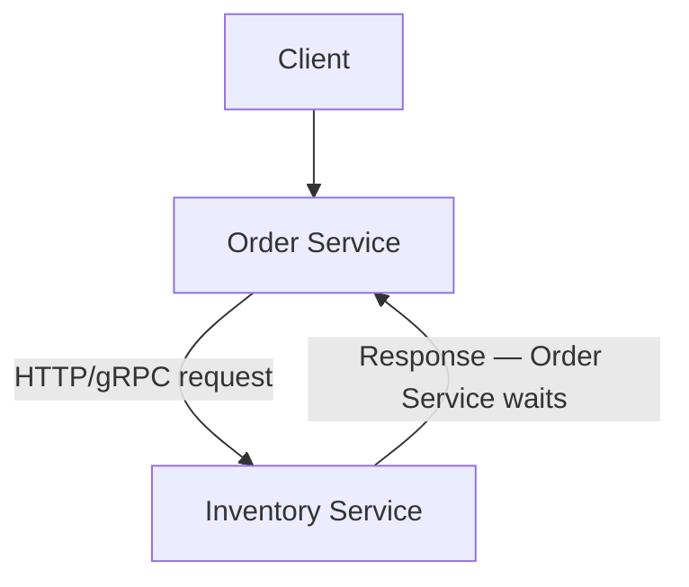

Example:

``` csharp
var response = await httpClient.GetAsync(
    $"/api/inventory/{productId}");
```

### Advantages

-   Simple request/response model
-   Easy to understand
-   Useful when the caller immediately needs the result

### Disadvantages

-   Runtime coupling
-   Increased latency
-   Downstream failures can propagate
-   Long synchronous call chains are fragile

For example:


If every dependency must respond before the original request completes,
latency and failure risk increase.

### Asynchronous communication

The producer publishes a message/event without requiring the consumer to
complete processing immediately.

Typical technologies:

-   Azure Service Bus
-   RabbitMQ
-   Apache Kafka
-   AWS SQS/SNS

Example:

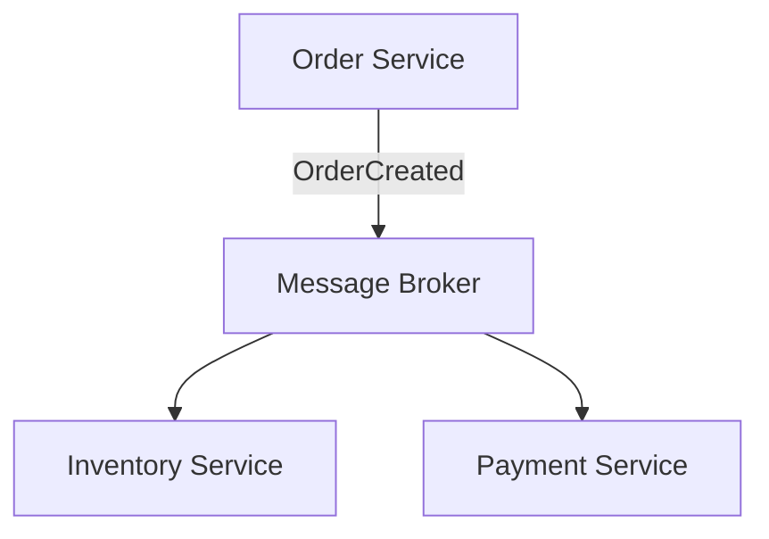

### Advantages

-   Loose runtime coupling
-   Better resilience
-   Traffic buffering
-   Easier fan-out
-   Good for workflows and event-driven processing

### Challenges

-   Eventual consistency
-   Duplicate messages
-   Ordering
-   Retry/dead-letter handling
-   Harder debugging

### When to choose

Use **synchronous communication** when the caller requires an immediate
result.

Use **asynchronous communication** when the operation can continue
independently or when multiple consumers need to react to an event.

A real architecture commonly uses both.

### Interview-ready answer

> I use synchronous REST or gRPC when a service needs an immediate
> response. For business events and workflows that do not require
> immediate completion, I prefer asynchronous messaging. I avoid
> unnecessary synchronous dependency chains because they increase
> latency and can create cascading failures.

 

## 3. REST vs gRPC vs Messaging --- when would you choose each?

### REST

REST normally uses HTTP with JSON.

Example:

``` http
GET /api/orders/1001
```

Choose REST when:

-   APIs are exposed to web/mobile clients
-   Interoperability is important
-   Human-readable payloads are useful
-   Public APIs are required
-   Standard HTTP semantics are valuable

### gRPC

gRPC commonly uses HTTP/2 and Protocol Buffers.

Example contract:

``` proto
service InventoryService {
  rpc GetStock (StockRequest) returns (StockResponse);
}
```

Choose gRPC when:

-   Internal service-to-service communication is performance-sensitive
-   Strong contracts are useful
-   Low serialization overhead matters
-   Streaming is required
-   Both sides can support gRPC

### Messaging

Messaging uses queues/topics/event streams.

Example:

``` text
OrderCreated
PaymentCompleted
InventoryReserved
ShipmentCreated
```

Choose messaging when:

-   Immediate response is unnecessary
-   Services should be loosely coupled
-   Work must survive temporary consumer outages
-   Multiple services react to the same event
-   Event-driven workflows are required

### Comparison

| Feature | REST | gRPC | Messaging |
|---|---|---|---|
| **Communication** | Synchronous | Usually synchronous/streaming | Asynchronous |
| **Common Payload** | JSON | Protobuf | JSON/Avro/Protobuf/etc. |
| **Browser Friendliness** | Excellent | More constrained | Not direct |
| **Performance** | Good | Very good | Depends on broker/workload |
| **Coupling** | Moderate | Moderate | Lower runtime coupling |
| **Best Fit** | External/general APIs | Internal high-performance calls | Events/background workflows |

### Interview-ready answer

> I normally use REST for external APIs, gRPC for efficient internal
> service-to-service calls when a strongly typed contract is beneficial,
> and messaging for asynchronous workflows and domain events. I choose
> based on interaction semantics rather than using one protocol
> everywhere.

 

## 4. What is an API Gateway and what responsibilities should it have?

An API Gateway is the **entry point** between external clients and
backend services.

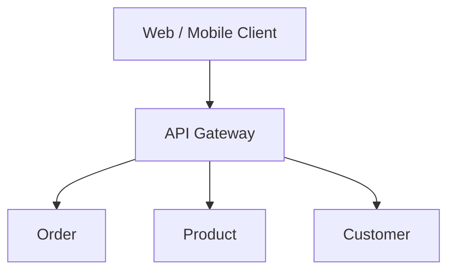

Possible technologies include:

-   Azure API Management
-   YARP
-   Kong
-   NGINX
-   AWS API Gateway

### Appropriate responsibilities

An API Gateway may handle:

-   Routing
-   TLS termination
-   Authentication/token validation
-   Authorization at the edge where appropriate
-   Rate limiting/throttling
-   Request/response transformation
-   API version routing
-   Correlation IDs
-   Centralized cross-cutting policies
-   Sometimes response aggregation

### What should not be placed there?

Avoid putting core domain/business logic into the gateway.

Bad example:

``` text
Gateway decides whether an order is financially valid.
```

Better:

``` text
Order Service owns order business rules.
```

Otherwise, the gateway becomes a new monolith and bottleneck.

### API Gateway vs Load Balancer

A load balancer primarily distributes traffic across instances.

An API Gateway understands API-level concerns such as routes,
authentication, quotas, transformations, and policies.

### Interview-ready answer

> An API Gateway provides a controlled entry point to microservices. I
> use it for routing, authentication-related policies, rate limiting,
> observability headers, and other cross-cutting API concerns. I keep
> business logic inside domain services so the gateway does not become a
> centralized business layer.

 

## 5. How do you identify service boundaries when breaking a Monolith?

This is one of the most important microservices design questions.

Do **not** split services merely by technical layers such as:

``` text
Controller Service
Business Service
Repository Service
```

That creates distributed technical layers rather than business-oriented
services.

### Use business capabilities

Example e-commerce capabilities:

``` text
Catalog
Ordering
Payments
Inventory
Shipping
Customers
```

Each can become a bounded context/service when the domain and
operational requirements justify it.

### Domain-Driven Design concepts

Useful techniques include:

-   Bounded Context
-   Aggregates
-   Domain events
-   Context mapping
-   Event Storming

### Questions to ask

When defining a boundary, ask:

1.  Does this capability have its own business rules?
2.  Can its data be owned independently?
3.  Does it change independently?
4.  Does it need independent scaling?
5.  Can a team own it end-to-end?
6.  Can the interface with other capabilities be clearly defined?
7.  Would splitting it reduce coupling rather than create excessive
    network chatter?

### Example

A monolith may contain:

``` text
Customer
Order
Payment
Inventory
Shipping
```

Possible boundaries:

``` text
Customer Service -> Customer data
Order Service    -> Order data
Payment Service  -> Payment transactions
Inventory Service-> Stock
Shipping Service -> Shipment lifecycle
```

### Avoid a distributed monolith

If every request requires five services to communicate synchronously and
services constantly share each other's database tables, the system may
have the disadvantages of both architectures.

### Interview-ready answer

> I identify boundaries primarily from business capabilities and bounded
> contexts, not from tables or technical layers. I look at data
> ownership, business rules, change frequency, scaling requirements,
> team ownership, and communication patterns. I prefer starting with
> relatively coarse-grained boundaries and splitting further only when
> there is a clear reason.

 

## 6. Why should each Microservice own its database?

A core principle is:

> A service owns its data, and other services access that data through
> the service's published contract rather than directly modifying its
> tables.

Example:

``` text
Order Service --------> Order DB
Payment Service ------> Payment DB
Inventory Service ----> Inventory DB
```

Avoid:

``` text
Order Service -----\
Payment Service -----> Shared Database
Inventory Service --/
```

### Why?

#### Loose coupling

Changing an Order table should not unexpectedly break Payment Service.

#### Independent deployment

A service can evolve its schema along with its code.

#### Clear ownership

Only the owning service controls writes and invariants for its data.

#### Technology flexibility

One service could use PostgreSQL while another uses a document database
if justified.

### Does database-per-service mean one physical server?

No.

It is primarily about **logical ownership and access boundaries**.
Services may use different schemas/databases on the same physical
infrastructure initially, provided ownership is enforced.

### How does another service get the data?

Use:

-   Service APIs
-   Events
-   Local read models
-   Replicated projections
-   CQRS patterns where appropriate

### Interview-ready answer

> Database-per-service protects autonomy. Other services should not
> directly depend on a service's internal schema. They consume APIs or
> events. This prevents database-level coupling and allows each service
> to evolve independently, although it means cross-service consistency
> and reporting require deliberate distributed-system patterns.

 

## 7. How do you handle distributed transactions between Microservices?

A traditional database transaction works well inside one database:

``` text
BEGIN TRANSACTION
Update Order
Update Payment
COMMIT
```

But in microservices:

``` text
Order DB
Payment DB
Inventory DB
```

one local transaction cannot normally provide atomicity across all
independently owned stores.

### Preferred approach

Use:

-   Local transaction per service
-   Saga pattern
-   Events/messages
-   Compensating actions
-   Idempotency
-   Transactional Outbox
-   Eventual consistency

### Example

Order workflow:

``` text
1. Create Order
2. Reserve Inventory
3. Process Payment
4. Confirm Order
```

If payment fails:

``` text
Release Inventory
Cancel Order
```

These are **compensating transactions**.

### Why not simply use distributed two-phase commit?

Two-phase commit can provide stronger atomicity in environments that
support it, but it creates coordination, availability, scalability, and
technology constraints. In independently deployed microservices,
Saga-style business transactions are commonly more practical.

### Transactional Outbox

A common failure:

``` text
1. Save Order to DB      -> success
2. Publish OrderCreated  -> application crashes
```

Now the database changed but no event was published.

With the Outbox Pattern:

``` text
Local DB transaction:
  Insert Order
  Insert OutboxMessage
Commit

Background Publisher:
  Read OutboxMessage
  Publish to broker
  Mark processed
```

This greatly improves reliability between database updates and message
publication.

### Interview-ready answer

> I avoid trying to stretch a single ACID transaction across
> independently owned service databases. I use local transactions
> combined with a Saga for the business workflow, compensating actions
> for failures, idempotent consumers, and usually the Transactional
> Outbox pattern for reliable event publication.

 

## 8. What is the Saga Pattern?

A Saga manages a business transaction spanning multiple services as a
sequence of **local transactions**.

Example:

``` text
Create Order
     |
Reserve Inventory
     |
Charge Payment
     |
Create Shipment
     |
Confirm Order
```

Each step commits independently.

If a later step fails, previously completed work is logically reversed
through compensating actions.

Example:

``` text
Payment failed
     |
Release Inventory
     |
Cancel Order
```

### Important point

Compensation is not always a literal database rollback.

For example:

``` text
Payment charged -> Refund payment
```

The original charge may remain in an audit trail; a refund is a new
business action.

### Saga requirements

A production Saga should consider:

-   Idempotency
-   Retry policy
-   Timeouts
-   Duplicate events
-   Correlation IDs
-   State tracking
-   Compensation failures
-   Observability
-   Dead-letter queues

### Interview-ready answer

> Saga is a pattern for maintaining business consistency across multiple
> microservices without one global database transaction. Each service
> executes a local transaction. If a later step fails, compensating
> actions undo or offset the business effect of earlier successful
> steps.

 

## 9. Saga Choreography vs Orchestration --- which approach would you use?

### Choreography

Services react to events without a central coordinator.

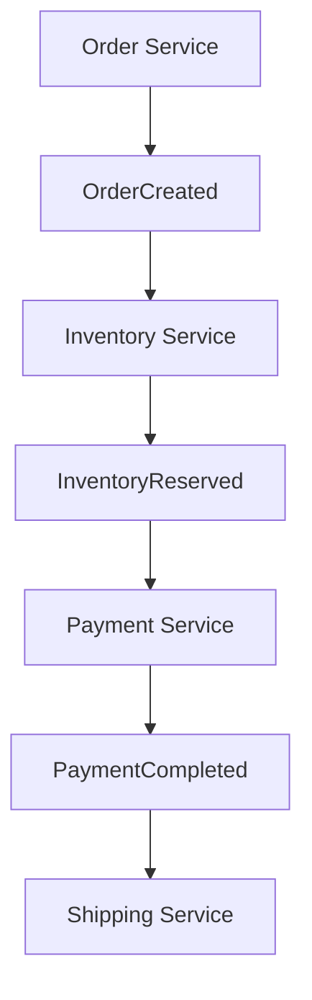

#### Advantages

-   Loose coupling
-   No central workflow component
-   Natural for simple event-driven flows

#### Disadvantages

-   Business flow becomes difficult to visualize as complexity grows
-   Event chains can become difficult to debug
-   Hidden dependencies may develop

### Orchestration

A central orchestrator controls the workflow.

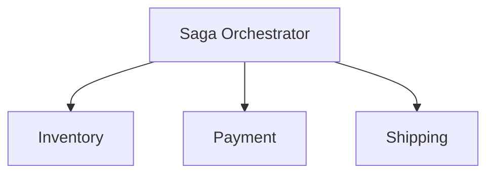

The orchestrator sends commands and processes responses/events.

#### Advantages

-   Workflow is explicit
-   Easier to understand complex processes
-   Easier central state tracking and compensation coordination

#### Disadvantages

-   Additional component
-   Orchestrator can become overly coupled if badly designed

### Which would I choose?

For a simple flow with a small number of independent reactions,
choreography can be effective.

For a complex workflow with many steps, branching, timeouts, and
compensations, orchestration is usually easier to reason about
operationally.

### Interview-ready answer

> I don't choose choreography or orchestration as a universal rule.
> Choreography works well for simple event reactions. For a complex
> business workflow such as order-payment-inventory-shipping with
> compensation and timeout rules, I generally prefer orchestration
> because the workflow state and recovery path are explicit.

 

## 10. What is Eventual Consistency?

Eventual consistency means distributed data may temporarily be
inconsistent, but after all relevant events/messages are processed, the
participating views converge to the expected state.

Example:

``` text
Order Service:
Order = Confirmed

Inventory Service:
Stock update still processing
```

After the inventory event is processed:

``` text
Order = Confirmed
Inventory = Updated
```

### Why does it happen?

Because microservices normally:

-   Own separate databases
-   Commit local transactions independently
-   Communicate asynchronously for many workflows

### Design implications

Applications should account for:

-   Temporary states such as `Pending`
-   Retry
-   Idempotency
-   Duplicate handling
-   Message ordering
-   Reconciliation
-   User-visible workflow state

Instead of pretending everything is immediately consistent, expose
meaningful business states:

``` text
OrderStatus:
PendingPayment
PaymentConfirmed
PendingInventory
Confirmed
Failed
```

### Interview-ready answer

> Eventual consistency means services may not reflect the same business
> state at exactly the same instant. They converge after asynchronous
> processing completes. I design explicit intermediate states, reliable
> messaging, idempotent handlers, retries, and reconciliation so
> temporary inconsistency is controlled and observable.

 

## 11. How do you implement Retry, Timeout, Circuit Breaker and Fallback?

These are resiliency patterns.

### Timeout

Never allow a remote call to wait indefinitely.

``` text
Order -> Payment

Timeout = 2 seconds
```

If the dependency does not respond within the acceptable time, fail or
switch to an appropriate recovery path.

### Retry

Retry transient failures such as temporary network problems.

Use:

``` text
Retry 1
Wait
Retry 2
Wait longer
Retry 3
```

Prefer exponential backoff and jitter.

Do **not** blindly retry:

-   Validation errors
-   Authentication failures
-   Non-idempotent operations unless safely designed
-   Long-running failures that will amplify load

### Circuit Breaker

If a downstream service repeatedly fails, stop calling it temporarily.

Typical states:

``` text
Closed -> requests flow normally

Open -> calls fail fast

Half-Open -> limited trial requests test recovery
```

This protects both caller and dependency.

### Fallback

Return an acceptable degraded response when appropriate.

Example:

``` text
Recommendation Service unavailable
        |
        v
Return cached/default recommendations
```

Do not use fallback when stale/default data would be dangerous or
incorrect, such as pretending a payment succeeded.

### .NET

Modern .NET applications can use `Microsoft.Extensions.Http.Resilience`,
built on Polly, for resilience handlers.

Conceptual registration:

``` csharp
services.AddHttpClient<InventoryClient>()
    .AddStandardResilienceHandler();
```

Production settings should be tuned to service latency, idempotency,
traffic, and SLO requirements.

### Interview-ready answer

> I apply timeouts to bound remote calls, retries only for transient and
> safe-to-repeat failures, circuit breakers to stop hammering an
> unhealthy dependency, and fallbacks only where degraded data is
> semantically acceptable. I also add jitter and make operations
> idempotent to avoid retry storms and duplicate side effects.

 

## 12. How do you prevent cascading failures between services?

A cascading failure occurs when failure in one dependency causes other
services to exhaust resources or fail.

Example:

``` text
Database slow
   |
Payment Service slow
   |
Order threads/connections wait
   |
Order Service becomes unhealthy
   |
Gateway requests accumulate
```

### Techniques

-   Timeouts
-   Circuit breakers
-   Bounded retries with backoff and jitter
-   Bulkheads/resource isolation
-   Rate limiting
-   Load shedding
-   Queue-based buffering
-   Caching where safe
-   Autoscaling
-   Backpressure
-   Dependency isolation
-   Graceful degradation
-   Avoid deep synchronous chains

### Bulkhead example

Do not allow one failing dependency to consume every thread/connection.

``` text
Inventory calls -> isolated resource limit
Payment calls   -> separate resource limit
```

If Inventory becomes unhealthy, Payment-related capacity is protected.

### Retry storm warning

Suppose:

``` text
Gateway retries 3 times
Service A retries 3 times
Service B retries 3 times
```

One client request can create many downstream attempts.

Retry policies therefore need to be designed across the entire call
chain.

### Interview-ready answer

> I prevent cascading failures by bounding latency and resource
> consumption. That means aggressive timeouts, carefully controlled
> retries, circuit breakers, bulkheads, rate limiting, queueing, load
> shedding, and avoiding deep synchronous chains. I also make sure
> retries are coordinated so one failure does not create a retry storm.

 

## 13. How do you secure communication between Microservices?

Security should exist at multiple layers.

### External communication

``` text
Client
  |
 HTTPS
  |
API Gateway
  |
Services
```

Use TLS for data in transit.

### Service-to-service security

Options include:

-   OAuth 2.0 access tokens
-   Workload identity/managed identity
-   mTLS
-   Service mesh identity
-   Short-lived service credentials

### Authorization

Authentication answers:

``` text
Who are you?
```

Authorization answers:

``` text
What are you allowed to do?
```

Services should enforce authorization for sensitive operations rather
than trusting network location alone.

### Additional controls

-   Least privilege
-   Secret rotation
-   Network segmentation
-   Firewall/private endpoints
-   Input validation
-   Rate limiting
-   Audit logs
-   Certificate rotation
-   Secure secret stores such as Azure Key Vault

### Zero Trust principle

Do not assume:

``` text
"It came from the internal network, so it is trusted."
```

Verify identity and authorization.

### Interview-ready answer

> I secure microservices in layers: TLS for transport, strong workload
> or user identity, token or certificate-based authentication,
> service-level authorization, least-privilege access, secure secret
> management, network controls, and auditing. Internal traffic should
> not automatically be trusted simply because it is inside the cluster
> or VNet.

 

## 14. How do you implement JWT/OAuth2 authentication in Microservices?

OAuth 2.0 is an authorization framework. OpenID Connect adds an identity
layer for authentication.

A typical architecture:

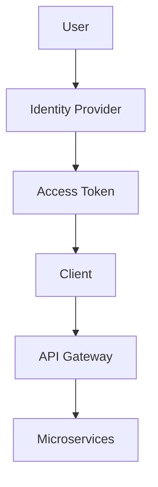

### JWT contains claims

Example:

``` json
{
  "sub": "user-101",
  "scope": "orders.read orders.write",
  "role": "Manager",
  "iss": "https://identity.example.com",
  "aud": "orders-api"
}
```

### Validation

A service should validate appropriate properties such as:

-   Signature
-   Issuer
-   Audience
-   Expiration
-   Required scopes/roles/claims

### ASP.NET Core example

``` csharp
builder.Services
    .AddAuthentication("Bearer")
    .AddJwtBearer("Bearer", options =>
    {
        options.Authority = configuration["Auth:Authority"];
        options.Audience = "orders-api";
    });

builder.Services.AddAuthorization();
```

Pipeline:

``` csharp
app.UseAuthentication();
app.UseAuthorization();
```

### Service-to-service calls

Do not pass a user's token everywhere without considering audience and
authorization semantics.

For machine-to-machine communication, OAuth client credentials or cloud
workload identities are common.

### Gateway validation vs service validation

The gateway can validate tokens early, but sensitive backend services
should not depend solely on the assumption that all traffic always came
through the gateway.

### Interview-ready answer

> I normally use OAuth 2.0/OpenID Connect with a trusted identity
> provider. The client obtains an access token and APIs validate
> signature, issuer, audience, expiry, and required scopes or claims.
> For service-to-service calls I prefer workload identity or
> client-credentials-style access rather than sharing passwords or
> long-lived secrets.

 

## 15. How do you deploy Microservices using Docker?

Each microservice is packaged as its own container image.

Example `Dockerfile` for ASP.NET Core:

``` dockerfile
FROM mcr.microsoft.com/dotnet/aspnet:9.0 AS base
WORKDIR /app
EXPOSE 8080

FROM mcr.microsoft.com/dotnet/sdk:9.0 AS build
WORKDIR /src
COPY . .
RUN dotnet publish "OrderService.csproj" \
    -c Release \
    -o /app/publish

FROM base AS final
WORKDIR /app
COPY --from=build /app/publish .
ENTRYPOINT ["dotnet", "OrderService.dll"]
```

### Typical CI/CD flow

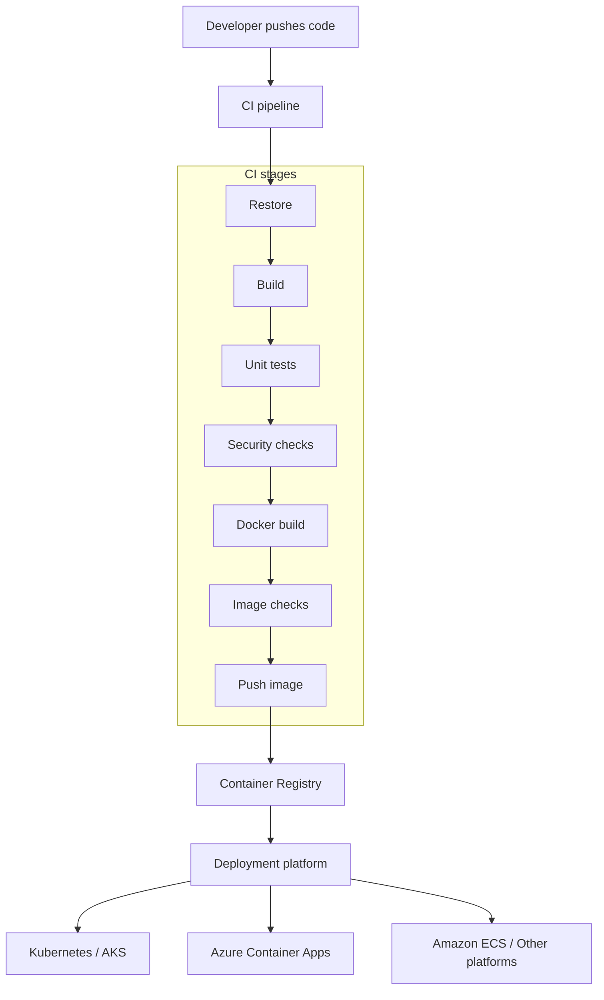

### Why containers?

Containers provide:

-   Repeatable packaging
-   Dependency isolation
-   Environment consistency
-   Fast deployment
-   Horizontal scaling support
-   Immutable release artifacts

### Production practices

-   Use multi-stage builds
-   Run as non-root where practical
-   Keep images small
-   Do not bake secrets into images
-   Use health probes
-   Set CPU/memory requests and limits in orchestrators
-   Scan images
-   Tag images immutably, e.g. commit SHA
-   Send logs to external systems rather than depending on local
    container files

### Interview-ready answer

> I package each service as an independent Docker image, build and test
> it in CI, push an immutable version to a registry, and deploy it
> through an orchestrator such as Kubernetes/AKS or a managed container
> platform. Configuration and secrets are injected at runtime rather
> than stored in the image.

 

## 16. How do you manage configuration and secrets across services?

Configuration and secrets should be externalized from application
binaries/images.

### Configuration examples

Non-secret settings:

``` text
Feature flags
Service URLs
Timeout values
Logging levels
Queue names
```

Potential systems:

-   Environment variables
-   appsettings files plus environment overrides
-   Azure App Configuration
-   Kubernetes ConfigMaps
-   Feature management platforms

### Secrets

Examples:

``` text
Database passwords
API keys
Certificates
Client secrets
```

Store secrets in dedicated secret-management systems such as:

-   Azure Key Vault
-   AWS Secrets Manager
-   HashiCorp Vault
-   Kubernetes Secrets, ideally with stronger external secret-management
    integration

### Azure approach

A strong Azure architecture can use:

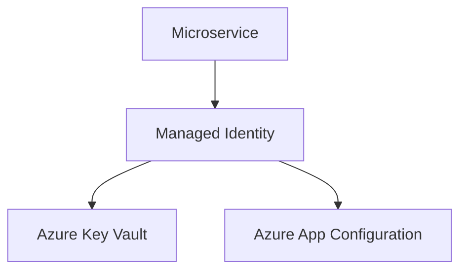

This reduces the need to distribute credentials.

### Never do this

``` json
{
  "DbPassword": "ProductionPassword123"
}
```

in source control.

### Interview-ready answer

> I externalize configuration and separate secrets from normal
> configuration. In Azure, I prefer managed identities with Key Vault
> for secrets and App Configuration or environment-specific
> configuration for non-secret settings. I avoid long-lived credentials
> in source code, Docker images, and CI files.

 

## 17. How do you perform centralized logging and distributed tracing?

In microservices, one request may cross many services.

Example:

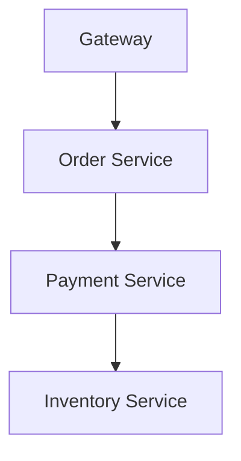

Independent log files are not enough.

### Centralized logging

Services write structured logs to a centralized platform.

Examples:

-   Azure Monitor / Application Insights
-   Elasticsearch/OpenSearch-based stacks
-   Seq
-   Splunk

Structured log:

``` json
{
  "level": "Information",
  "service": "OrderService",
  "orderId": "ORD-1001",
  "traceId": "abc123",
  "message": "Order created"
}
```

Prefer structured properties over concatenated strings.

### Distributed tracing

A trace follows one request across service boundaries.

``` text
Trace ID: abc123

Gateway         Span 1
Order Service   Span 2
Payment Service Span 3
Database        Span 4
```

OpenTelemetry is commonly used for instrumentation and context
propagation.

### Metrics

Observability normally includes three signals:

``` text
Logs
Metrics
Traces
```

Useful metrics:

-   Request rate
-   Error rate
-   Latency
-   CPU/memory
-   Queue depth
-   Dependency latency
-   Circuit breaker state
-   Business metrics

### Correlation

Propagate trace context/correlation identifiers across:

-   HTTP calls
-   gRPC
-   Message headers

### Interview-ready answer

> I use structured centralized logging plus distributed tracing and
> metrics. OpenTelemetry is useful for standard instrumentation and
> context propagation. Every cross-service request or message should
> carry trace context so we can reconstruct a transaction across the
> gateway, services, databases, and messaging infrastructure.

 

## 18. How do you version Microservice APIs without breaking consumers?

API changes should be designed for backward compatibility.

### Breaking change example

Existing response:

``` json
{
  "customerName": "Venkat"
}
```

Changing it immediately to:

``` json
{
  "fullName": "Venkat"
}
```

may break consumers expecting `customerName`.

### Strategies

#### URL versioning

``` text
/api/v1/orders
/api/v2/orders
```

#### Header/media-type versioning

``` text
Accept: application/vnd.company.orders.v2+json
```

#### Backward-compatible evolution

Prefer additive changes where possible:

``` json
{
  "customerName": "Venkat",
  "preferredName": "Venkat"
}
```

### Event versioning

Events also require compatibility.

Good principle:

-   Avoid changing the meaning of existing fields
-   Add optional fields where possible
-   Use explicit event versions when semantics change significantly
-   Keep consumers tolerant of additional fields
-   Use schema/contract validation

### Consumer-driven contract testing

Tools such as Pact can help verify that provider changes remain
compatible with consumer expectations.

### Deprecation process

``` text
Introduce v2
     |
Notify consumers
     |
Observe v1 usage
     |
Migration period
     |
Retire v1
```

### Interview-ready answer

> My first preference is backward-compatible additive evolution. When a
> genuine breaking change is unavoidable, I expose a new API or event
> contract version, run versions side by side for a migration period,
> use contract testing, communicate deprecation, and monitor old-version
> usage before removal.

 

## 19. How do you implement health checks?

Health checks allow infrastructure to determine whether a service is
alive and whether it can receive traffic.

### ASP.NET Core

``` csharp
builder.Services.AddHealthChecks();

app.MapHealthChecks("/health");
```

### Liveness

Question:

> Is the application process alive?

Example:

``` text
/health/live
```

If liveness repeatedly fails, an orchestrator may restart the container.

### Readiness

Question:

> Is the application ready to receive traffic?

Example:

``` text
/health/ready
```

A service may be alive but temporarily unable to serve requests.

### Dependency checks

Readiness may consider critical dependencies, but health checks should
be designed carefully. If every service reports unhealthy because one
optional dependency is unavailable, you can amplify an incident.

### Kubernetes concept

``` yaml
livenessProbe:
  httpGet:
    path: /health/live
    port: 8080

readinessProbe:
  httpGet:
    path: /health/ready
    port: 8080
```

### Startup checks

For applications with long startup times, a startup probe can prevent
premature liveness failures.

### Interview-ready answer

> I separate liveness from readiness. Liveness tells the platform
> whether the process needs restarting; readiness tells it whether the
> instance should receive traffic. I avoid expensive health endpoints
> and carefully choose which dependencies affect readiness so a minor
> downstream issue does not unnecessarily remove every instance from
> service.

 

## 20. How would you migrate an existing Monolith to Microservices?

Do not rewrite the entire system in one step.

A safer approach is incremental migration using the **Strangler Fig
Pattern**.

### Step 1: Understand the domain

Identify:

-   Business capabilities
-   Bounded contexts
-   Module dependencies
-   Database coupling
-   High-change areas
-   Scaling bottlenecks
-   Deployment pain points

### Step 2: Improve modularity inside the monolith

Before extraction, establish clearer internal boundaries.

``` text
Monolith
 ├── Orders
 ├── Payments
 ├── Inventory
 └── Customers
```

This reduces extraction risk.

### Step 3: Select a suitable first service

Choose a capability with:

-   Clear boundaries
-   Business value
-   Manageable dependencies
-   A reason for independent deployment/scaling

Do not automatically begin with the hardest, most coupled module.

### Step 4: Put a routing layer in front

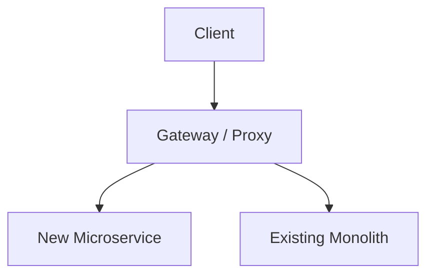

### Step 5: Extract business capability and data ownership

Example:

``` text
Before:

Monolith -> Shared DB
```

After extracting Catalog:

``` text
Monolith ------> Remaining Monolith DB

Catalog Service -> Catalog DB
```

### Step 6: Replace direct database coupling

Legacy modules should stop reading the extracted service's tables
directly.

Replace with:

-   APIs
-   Events
-   Read models where justified

### Step 7: Add reliability and observability

Before scaling the number of services, establish:

-   Centralized logging
-   Distributed tracing
-   Metrics
-   Health checks
-   Retry/timeout/circuit-breaker standards
-   CI/CD
-   Container/platform standards
-   Secrets management

### Step 8: Introduce asynchronous events where appropriate

Example:

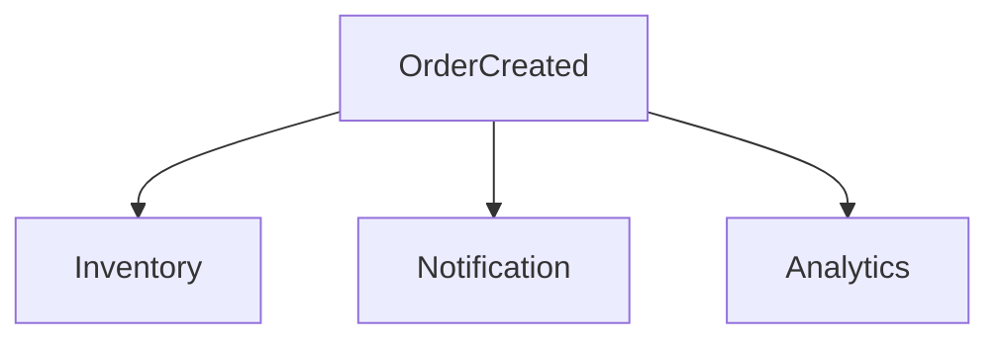

### Step 9: Repeat incrementally

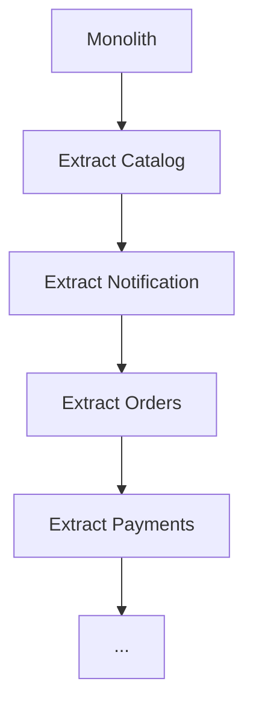

The monolith gradually becomes smaller.

### Migration risks

Watch for:

-   Distributed monolith
-   Shared database remaining indefinitely
-   Too many tiny services
-   Excessive synchronous calls
-   Missing observability
-   Inconsistent authentication
-   Duplicate data without ownership rules
-   Big-bang rewrite
-   Premature infrastructure complexity

### Interview-ready answer

> I migrate incrementally using a Strangler approach. First I identify
> bounded contexts and improve modular boundaries inside the monolith.
> Then I extract one capability with clear ownership, route traffic to
> it through a gateway or proxy, move its data behind the new service
> contract, and replace direct database dependencies with APIs or
> events. I establish CI/CD, observability, security, and resilience
> early, then repeat capability by capability rather than performing a
> big-bang rewrite.

 

## End-to-End Example: Order Processing Microservices

A useful interview architecture is:

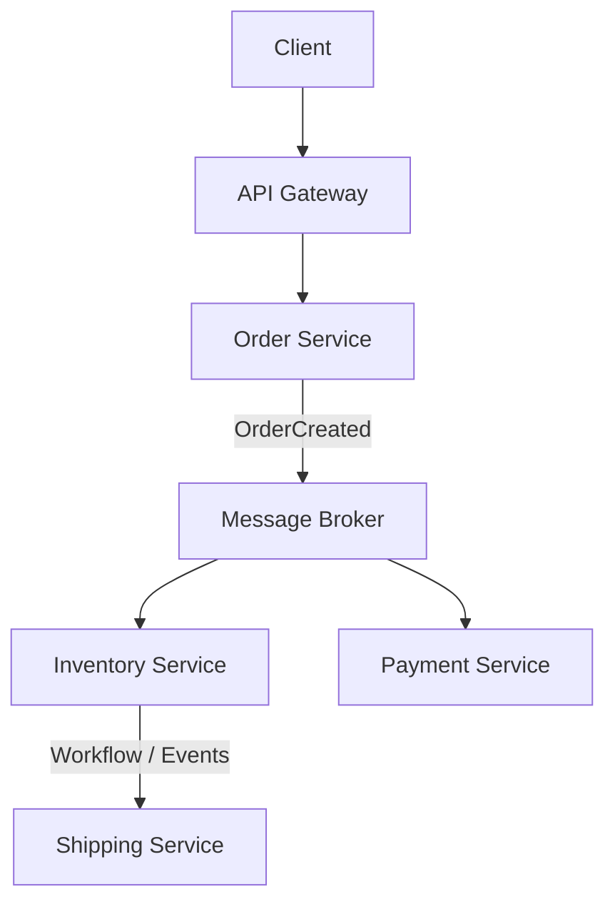

Each service owns its data:

``` text
Order Service      -> Order DB
Inventory Service  -> Inventory DB
Payment Service    -> Payment DB
Shipping Service   -> Shipping DB
```

Cross-cutting capabilities:

``` text
API Gateway
Identity Provider
Message Broker
Centralized Logs
OpenTelemetry
Metrics/Alerts
Configuration Store
Secret Store
Container Registry
Container Orchestrator
```

 

## Experienced Interview Scenario

#### Scenario

The interviewer asks:

> An Order Service calls Inventory and Payment. Payment becomes slow.
> Users start reporting timeouts. Soon the Order Service also becomes
> unavailable. What would you do?

### Strong answer

I would first use distributed traces and metrics to confirm where
latency is accumulating and whether thread, socket, connection-pool, or
queue resources are being exhausted.

At the design level I would ensure:

1.  Payment calls have a strict timeout.
2.  Retries are bounded and only used for transient, safe-to-repeat
    operations.
3.  Exponential backoff and jitter prevent synchronized retries.
4.  A circuit breaker stops repeated calls when Payment is unhealthy.
5.  Bulkheads prevent Payment calls from exhausting all Order Service
    resources.
6.  Idempotency prevents duplicate charges when requests are retried.
7.  For workflows that do not require an immediate payment result,
    messaging can decouple Order from Payment.
8.  The order can expose a meaningful state such as `PaymentPending`.
9.  Monitoring and alerts cover dependency latency, failure rate,
    circuit state, and queue depth.
10. Recovery procedures handle messages that repeatedly fail, such as
    dead-letter and reconciliation processing.

This answer demonstrates that resiliency is not just a library
configuration; it is an architectural property.

 

## Rapid Revision Sheet

 | Topic                    | Key Interview Point|
 |---|---| 
 | Microservices            | Independently deployable business capabilities|
 | Boundaries               | Bounded contexts/business capabilities|
 | REST                     | General synchronous APIs|
 | gRPC                     | Efficient strongly typed internal communication|
 | Messaging                | Async decoupling and events|
 | API Gateway              | Routing and cross-cutting edge concerns|
 | Database per service     | Data ownership and autonomy|
 | Distributed transaction  | Local transactions + Saga|
 | Saga                     | Transactions + compensations|
 | Choreography             | Services react to events|
 | Orchestration            | Coordinator manages workflow|
 | Eventual consistency     | Temporary inconsistency, eventual convergence|
 | Retry                    | Transient failures only|
 | Timeout                  | Bound remote-call latency|
 | Circuit breaker          | Fail fast when dependency is unhealthy|
 | Bulkhead                 | Isolate resources/failures|
 | JWT                      | Signed token carrying claims|
 | OAuth2/OIDC              | Authorization + identity architecture|
 | Docker                   | Independent immutable service packaging|
 | Secrets                  | Vault + workload/managed identity|
 | Logging                  | Structured centralized logs|
 | Tracing                  | End-to-end trace/span correlation|
 | Versioning               | Prefer backward-compatible evolution|
 | Health checks            | Liveness + readiness|
 | Migration                | Incremental Strangler pattern|


## Senior-Level Points to Mention in Interviews

For experienced interviews, avoid describing microservices only as
"small APIs." Demonstrate that you understand the operational and
distributed-system consequences:

-   A network call is not equivalent to an in-process method call.
-   Every remote dependency needs a failure strategy.
-   Retries require idempotency and must not amplify outages.
-   Database ownership is fundamental to service autonomy.
-   Cross-service ACID transactions are usually replaced by business
    workflows and eventual consistency.
-   Events need schemas and compatibility rules just like APIs.
-   Duplicate message delivery should be expected and consumers should
    be idempotent.
-   Observability should be designed into the architecture.
-   Service boundaries should follow the domain, not CRUD tables.
-   Microservices increase operational complexity and should be adopted
    for clear business or engineering reasons.
-   A modular monolith is often a sensible starting point.
-   Security must cover both north-south and east-west traffic.
-   CI/CD and automation are essential when many independently
    deployable services exist.
-   Failure isolation is as important as functional decomposition.

 

# Final Interview Summary

A strong microservices answer should connect four areas:

``` text
Business Boundaries
        +
Independent Data Ownership
        +
Reliable Distributed Communication
        +
Operational Excellence
```

If an interviewer asks you to design a microservices solution, explain
not only **which services you would create**, but also:

-   Why those service boundaries exist
-   Who owns each piece of data
-   Which calls are synchronous vs asynchronous
-   How transactions are coordinated
-   How failures are handled
-   How APIs/events are secured
-   How services are observed
-   How they are deployed and scaled
-   How contracts evolve
-   How the design avoids becoming a distributed monolith

That is the difference between describing microservices at a beginner
level and discussing them as an experienced developer or technical lead.
