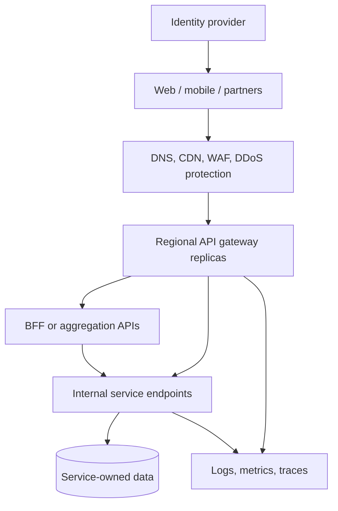

# Design an API Gateway for 50+ Microservices
## Design an API Gateway for 50+ Microservices

For 50+ services, the gateway is the controlled entry point for external clients. It handles common edge concerns and presents stable APIs while services own business rules and their data. I would place identity validation, coarse access rules, client quotas, routing, and public API versions at the gateway; each service still enforces its own resource-level authorization and protects its own capacity. [Microsoft API gateway guidance](https://learn.microsoft.com/en-us/azure/architecture/microservices/design/gateway)

## 1. Clarify Scope Before Choosing a Product

Ask whether clients are public, partner, mobile, or internal; expected peak requests/second; geographic regions; multi-tenant isolation; identity provider; compliance requirements; streaming/WebSocket/gRPC support; and whether APIs are customer products with plans, keys, and analytics. Ask whether the 50+ services are Kubernetes, Azure Container Apps, VMs/IIS, or mixed. The gateway choice should follow these requirements, not the service count alone.

Assume external REST clients, OAuth 2.0/OpenID Connect tokens, multiple teams, independently deployed services, and a few expensive endpoints such as search and report generation.

## 2. Reference Architecture

Keep service endpoints private to the environment when possible. Run multiple gateway instances across zones, use health-based traffic routing, and make configuration declarative and version controlled. A BFF is useful when web and mobile clients need different compositions; the gateway itself should remain mainly a policy and routing layer, not a home for complex business workflows. [Microsoft API gateway guidance](https://learn.microsoft.com/en-us/azure/architecture/microservices/design/gateway)

## 3. Responsibility Map: Where Each Concern Belongs

| Concern | Gateway / edge | Service | Reason |
| --- | --- | --- | --- |
| Authentication | Validate external token signature, issuer, audience, expiry; reject invalid requests | Authenticate trusted caller context or validate token/workload identity, especially for direct internal calls | Gateway is first entry point, but service must not trust spoofable headers |
| Authorization | Coarse API access: scopes, client plan, route permissions | Resource and business rules: “may this user edit this specific order?” | Gateway cannot reliably own service data and domain rules |
| Rate limiting | Per client/user/tenant/route usage budget and abuse prevention | Local concurrency/cost limits for expensive operations and dependencies | Edge fairness and downstream protection have different scopes |
| Throttling | Reject or shape excess ingress traffic; return 429 and useful retry guidance | Bound in-flight work, queues, DB connections; shed load under saturation | A request within a client quota can still overload a service |
| Routing | Host/path/method/header matching; service discovery; canary weights | Internal business dispatch within the service | Keep public URLs stable while deployments change |
| API versioning | Public contract and version-based route selection | Implement and test the versioned contract | Gateway routes versions; service/BFF owns behavior |
| Telemetry | Request ID, route, auth outcome, status, latency | Business events, dependency latency, and traces | End-to-end diagnosis needs both |

This map is a design recommendation. Its exact implementation depends on the trust boundary and gateway product. Microsoft documents edge authentication and rate limiting as gateway concerns while services still require appropriate authorization. [Microsoft gateway guidance](https://learn.microsoft.com/en-us/azure/architecture/microservices/design/gateway) · [Protected APIs behind gateways](https://learn.microsoft.com/en-us/entra/msidweb/advanced/api-gateways)

## 4. Authentication at the Gateway

Use an identity provider to issue access tokens. The gateway checks signature using trusted issuer keys, `iss`, intended `aud`, expiry/not-before, and required scope for the route. Return 401 for missing/invalid credentials. Do not log tokens. Rotate signing keys through the provider's discovery/JWKS mechanism and define failure behavior if keys cannot refresh.

For service-to-service calls, use workload identity, mTLS, or an appropriate internal token mechanism. If the gateway forwards user claims in headers, strip any incoming client-supplied versions of those headers and ensure a protected, authenticated connection to the backend. A service that can also be reached directly should validate caller identity itself. Azure API Management exposes JWT validation policies, and Microsoft documents protected ASP.NET Core APIs behind gateways. [APIM validate-jwt](https://learn.microsoft.com/en-us/azure/api-management/validate-jwt-policy) · [Protected APIs behind gateways](https://learn.microsoft.com/en-us/entra/msidweb/advanced/api-gateways)

## 5. Authorization: Coarse at Gateway, Fine in Services

The gateway checks whether a token/client can call `/orders/*` or `/admin/*`, based on scopes/roles and product subscriptions. Return 403 when a valid identity lacks route permission. The Order service decides whether `user-42` can access `order-123`, whether the order belongs to the user's tenant, and whether its current state permits cancellation. These decisions require domain state and must live with the owner service.

Do not infer tenant ownership solely from a URL or untrusted header. Use verified claims and check resource ownership in the service. Deny by default; make public endpoints explicit. Cache authorization decisions only when their freshness and revocation requirements allow it.

## 6. Rate Limiting vs Throttling

**Rate limiting** defines a usage budget over time, such as 100 requests/minute per client for a route. **Throttling** controls admission when capacity is tight, such as at most 20 concurrent report requests per tenant. They overlap in gateway products, but the interview distinction is contract/fairness versus protecting current capacity.

Example policy layers:

| Layer | Example | Key |
| --- | --- | --- |
| Edge abuse control | Anonymous requests per source IP or device | IP/device, with care for NAT and proxies |
| Customer plan | Requests per minute and daily quota | Verified client or subscription ID |
| Tenant fairness | Max concurrent expensive requests | Tenant ID from validated identity |
| Operation protection | Search and export have lower limits | Route plus client/tenant |
| Service backpressure | DB-bound operations have bounded workers/queue | Service-local resource |

Use token bucket for controlled bursts, sliding/fixed window for interval budgets, and a concurrency limiter for in-flight work. Return HTTP 429 for rate policy violations, optionally `Retry-After`; use 503 when service capacity is temporarily unavailable and no useful retry time can be promised. Do not retry non-idempotent requests blindly. If limits must be globally exact across many gateway replicas/regions, use a shared coordinator/store or accept and document approximate local enforcement and its latency/availability tradeoff. [Azure throttling design](https://learn.microsoft.com/en-us/azure/well-architected/design-guides/throttling) · [ASP.NET Core rate limiting](https://learn.microsoft.com/en-us/aspnet/core/performance/rate-limit)

## 7. Routing 50+ Services Without a Configuration Mess

Use stable external paths by domain, for example `/api/v1/orders/** → Order API` and `/api/v1/catalog/** → Catalog API`. Group related endpoints into APIs/products and let owning teams maintain route definitions through reviewed configuration as code. Validate routes in CI for collisions, missing backends, unexpected public exposure, and incompatible policies.

Use service discovery or platform backend references instead of hard-coded instance IPs. Health checks and connection draining remove unhealthy/terminating backends. Support weighted canary deployment when appropriate, but avoid random split for stateful or incompatible workflows without safeguards. Set request/connection timeouts, payload size limits, and clear ownership of retries. Expose only required headers and methods. [Microsoft gateway guidance](https://learn.microsoft.com/en-us/azure/architecture/microservices/design/gateway) · [Kubernetes Gateway API HTTPRoute](https://gateway-api.sigs.k8s.io/reference/api-types/httproute/)

## 8. API Versioning

Version the **external contract** when a breaking change cannot be rolled out compatibly. A public path strategy such as `/api/v1/orders` and `/api/v2/orders` is easy for interview examples; header or media-type versions are alternatives. The gateway matches the public version and routes to the correct backend/BFF implementation. A deployment version, an API Management revision, and a public API version are different concepts.

Prefer additive changes within a version. Publish OpenAPI definitions per public version, define deprecation and sunset timelines, and monitor usage before removing v1. Running 50 services does not mean every service must share one global version number; version APIs by domain/contract. Azure API Management supports version sets and revisions as separate concepts. [APIM versions](https://learn.microsoft.com/en-us/azure/api-management/api-management-versions) · [APIM revisions](https://learn.microsoft.com/en-us/azure/api-management/api-management-revisions)

## 9. An Azure/.NET Implementation Choice

For a public Azure platform, a practical option is **Azure Front Door or Application Gateway/WAF at the edge → Azure API Management for public API policies → private .NET services**. Use APIM APIs/products, JWT validation, scope checks, route/backend policies, rate limits, version sets, and telemetry. Confirm the chosen tier supports required policies, scale, private connectivity, regions, and budget. [APIM concepts](https://learn.microsoft.com/en-us/azure/api-management/api-management-key-concepts) · [Protect APIs with Application Gateway and APIM](https://learn.microsoft.com/en-us/azure/architecture/web-apps/api-management/architectures/protect-apis)

For a self-hosted .NET reverse proxy, YARP can route to services and integrate with ASP.NET Core authentication and rate-limiting middleware. You own the policy configuration, shared counters if required, deployment, and operations. Kubernetes ingress/Gateway API or a service mesh may be appropriate when the platform already provides the needed controls. Choose managed API management when developer products, quotas, governance, and analytics matter; choose a smaller ingress/proxy when the requirements are correspondingly narrower. [YARP rate limiting](https://learn.microsoft.com/en-us/aspnet/core/fundamentals/servers/yarp/rate-limiting) · [Microsoft gateway guidance](https://learn.microsoft.com/en-us/azure/architecture/microservices/design/gateway)

## 10. Reliability, Security, and Observability

- Deploy redundant gateway capacity across zones and test failover. Avoid a single gateway node or configuration service as a point of failure.
- Use TLS to the gateway and protected transport to backends; define trust boundaries for forwarded identity and client IP.
- Apply request size limits, schema validation where useful, WAF protections, and safe header normalization. Keep policies lightweight.
- Propagate trace context and a correlation ID. Measure requests by route/client, p50/p95/p99 latency, 401/403/429/5xx rates, upstream failures, and backend saturation.
- Set timeouts and bounded retries; avoid gateway retrying payment/order writes without idempotency keys. Circuit breaking and load shedding should be based on measured dependency behavior.
- Prevent configuration drift with templates, automated checks, staged rollout, and rollback. Minimize cross-team route ownership conflicts.

## 11. Walk Through a Request

`POST /api/v1/orders` arrives through WAF. The gateway validates the token, verifies `orders.write`, applies a per-client write limit and tenant admission policy, attaches trace context, and routes to the Order API. The service validates user/tenant access to the requested resource and business rules, then creates the order using its own transaction. If the client is over its gateway budget, it receives 429 before expensive backend work. If the Order service is saturated despite the client being within quota, it applies its own bounded concurrency/backpressure.

## 12. Two-Minute Interview Answer

> I would put a redundant API gateway behind an edge WAF and use it as the public entry point for 50-plus services. The gateway validates external access tokens, applies coarse route scopes, enforces per-client and per-tenant rate limits, routes versioned public paths to healthy backends, and emits consistent telemetry. Each service still checks resource-level authorization and its own business invariants, because the gateway does not own that data. I distinguish usage rate limits from concurrency and load throttling: edge policies provide fairness, while services protect their own database and expensive operations. Routes and policies should be declarative, reviewed, and tested for collisions and accidental exposure. I would version the public contract per domain, keep v1 and v2 side by side during migration, and monitor usage before deprecation. For an Azure/.NET system I would evaluate WAF plus API Management for managed policies or YARP for a self-hosted gateway, according to governance and operational requirements.

## 13. Common Interview Follow-Ups

**Should the gateway perform all authorization?** No. It can reject calls lacking a route-level permission; resource ownership and state-dependent rules remain in services.

**Can a backend trust `X-User-Id`?** Only if client-supplied versions are removed, transport and gateway identity are protected, and the service trusts the gateway under an explicit security design. Validating a token in the service is often clearer for sensitive APIs.

**What if the gateway goes down?** Run multiple healthy instances across zones with failover and tested deployment rollback. Keep backends private, but avoid one instance or one fragile configuration rollout blocking all clients.

**Do all 50 services need to be exposed?** No. Only client-facing capabilities get public routes; internal services remain behind private service-to-service access.

**What is the difference between 429 and 503?** 429 indicates a caller or policy limit; 503 indicates temporary service unavailability/overload. Communicate retry guidance where it is reliable.

**Should the gateway aggregate many service calls?** Use a purpose-built BFF/aggregation API for substantial composition, caching, and fallback logic; keep gateway routing and policy maintainable.

## 14. Mistakes to Avoid

- Putting resource-level business authorization only in the gateway.
- Treating a validated user header from an untrusted request as proof of identity.
- Using one global rate limit that lets noisy tenants starve everyone else.
- Scaling gateway instances while ignoring backend and shared rate-counter capacity.
- Retrying non-idempotent writes automatically at several layers.
- Coupling every microservice deployment to one public API version.
- Exposing all internal services directly because there are many routes.
- Turning the gateway into a monolith containing business orchestration.

## 15. Primary References

- [Microsoft: API gateways in microservices](https://learn.microsoft.com/en-us/azure/architecture/microservices/design/gateway)
- [Microsoft: Design throttling to improve resilience](https://learn.microsoft.com/en-us/azure/well-architected/design-guides/throttling)
- [Microsoft: Azure API Management concepts](https://learn.microsoft.com/en-us/azure/api-management/api-management-key-concepts)
- [Microsoft: APIM versions and revisions](https://learn.microsoft.com/en-us/azure/api-management/api-management-versions)
- [Microsoft: Protected ASP.NET Core APIs behind gateways](https://learn.microsoft.com/en-us/entra/msidweb/advanced/api-gateways)

## Architecture Overview & Responsibility Matrix

| Component | Primary Location | Implementation Strategy |
| --- | --- | --- |
| Authentication | API Gateway (edge) | Validate identity tokens, such as JWTs. Forward trusted user identity metadata to downstream services through sanitized headers. |
| Authorization | Gateway and microservice | **Gateway:** Perform coarse-grained checks using routes and OAuth scopes. **Microservice:** Enforce fine-grained domain permissions and role-based access control (RBAC). |
| Routing | API Gateway | Use declarative reverse-proxy rules to match paths, headers, or query parameters. |
| Rate Limiting | API Gateway | Apply global or tier-based request limits per client to reduce abuse and protect service capacity. |
| Throttling | Individual microservices | Use concurrency limits, backpressure, and circuit breakers to protect CPU, databases, and dependent services. |
| API Versioning | Gateway and microservice | **Gateway:** Route or rewrite requests during version transitions, including header-based routing. **Microservice:** Maintain version-specific endpoints or application logic. |

1. Authentication (Who are they?)

- Implementation Location: Strictly at the API Gateway Edge. Individual microservices should never handle raw client credentials.
- How to do it in Azure: Centralize your identity management using Microsoft Entra ID (formerly Azure AD). Clients authenticate with Entra ID to receive a JSON Web Token (JWT). The Azure APIM gateway uses the inbound validate-jwt policy to intercept, verify the cryptographic signature, check expiration, and unpack claims at the edge

2. Authorization (What can they do?)
- Implementation Location: Decoupled Strategy (Split between Gateway and Service).
- How to do it in Azure:
- Coarse-Grained Authorization (Gateway): APIM inspects the verified JWT for high-level scopes or roles using policies (e.g., ensuring an external client has the read:orders scope). If missing, it rejects traffic early to protect downstream resources.
- Fine-Grained Authorization (Microservice): The gateway strips the raw credential and forwards the validated identity metadata to the microservices via secure, trusted internal headers (e.g., X-User-Id, X-User-Roles). The specific microservice then determines business-level permissions (e.g., "Does User A own Order 123?")

3. Rate Limiting (Spike Protection)
- Implementation Location: Gateway Edge.
- How to do it in Azure: Use APIM's inbound rate-limit or rate-limit-by-key policies. This tracks short-term bursts (e.g., 100 requests per minute). You can configure this to count against an authenticated user's ID, an API subscription key, or a client IP address. If a client exceeds the threshold, APIM instantly returns a 429 Too Many Requests response

4. Throttling (Resource & Plan Management)
- Implementation Location: Gateway Edge (Commercial limits) and Service/Infrastructure Layer (Resource protection).
- How to do it in Azure:
- Gateway Tiering: Use APIM's quota or quota-by-key policies for long-term usage tracking (e.g., 10,000 calls per month) to manage monetized API product tiers.
-  Infrastructure Throttling: If a downstream cluster starts failing under load, use APIM's built-in Circuit Breaker policies or Azure Application Gateway to queue or gracefully shed load

5. Routing (Where does the traffic go?)

- Implementation Location: Gateway Edge.
- How to do it in Azure: APIM acts as a reverse proxy. You map standard public URLs to private internal endpoints using inbound path matching (e.g., public ://company.com* routes traffic internally to the isolated Cluster IP or Private Link of your Orders Microservice). This hides internal service maps and lets you migrate or refactor services without disrupting clients.

6. API Versioning (Which variation?)
- Implementation Location: Gateway Edge.
- How to do it in Azure: Use Azure APIM Version Sets. Instead of forcing microservices to maintain multiple legacy branches simultaneously, APIM handles version multiplexing. You can configure APIM to detect the version through three native approaches:

- Path: ://company.com vs ://company.com
- Query String: ://company.com
- Header: api-version: 2.0
- APIM reads this at the edge and cleanly rewrites/routes the URL to the exact target microservice deployment version block.

