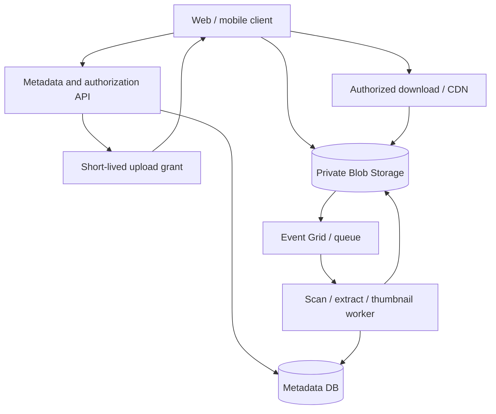

## Design a File and Document Storage System for Millions of Large Files

Use **Azure Blob Storage for file bytes** and a separate metadata database for ownership, permissions, status, search fields, and workflow state. Let clients upload large files directly to Blob Storage after the API authorizes the operation and grants narrowly scoped access. A processing pipeline validates uploaded content before it becomes available. A CDN/edge layer accelerates content that is safe to cache; private documents need a deliberate authorization design. [Azure Blob Storage architecture guidance](https://learn.microsoft.com/en-us/azure/well-architected/service-guides/azure-blob-storage)

## 1. Clarify Requirements and Capacity

Ask for file size distribution and maximum, uploads/day, downloads/day, peak concurrency, geographic distribution, retention, search needs, tenant isolation, legal hold, versioning, and whether files contain sensitive material. Distinguish public assets from private clinical, financial, or employee documents. Establish upload success criteria: is the request complete when bytes reach Blob Storage, or only after checksum and malware/content checks pass?

**Example sizing:** 10 million files averaging 20 MB means about 200 TB of logical bytes, before replicas, versions, derivatives, and metadata. If 100,000 files/day average 20 MB, ingress is roughly 2 TB/day. A campaign or migration can create a much larger peak. Measure the size distribution because a few multi-gigabyte files can dominate bandwidth and upload duration. Current account, blob, and request limits depend on configuration and should be checked during detailed capacity planning. [Blob scalability targets](https://learn.microsoft.com/en-us/azure/storage/blobs/scalability-targets)

## 2. High-Level Architecture

The API stores metadata and issues limited upload/download grants. Blob Storage stores bytes. Workers process and classify new files asynchronously. A separate delivery design handles public versus private content. Do not make the API proxy multi-gigabyte uploads merely to reach Blob Storage; that consumes application connections, memory, and bandwidth unnecessarily.

## 3. Metadata Design

Use a relational database such as PostgreSQL or Azure SQL for searchable and transactional metadata, with a table roughly like:

| Field | Purpose |
| --- | --- |
| `FileId` | Stable public identifier; avoid exposing raw Blob paths as the main ID |
| `TenantId`, `OwnerId` | Tenant and access checks |
| `StorageAccount`, `Container`, `BlobName`, `VersionId` | Physical location and immutable version reference |
| `OriginalFileName`, `ContentType`, `SizeBytes`, `Checksum` | Display and validation |
| `Status` | `Initiated`, `Uploaded`, `Scanning`, `Ready`, `Rejected`, `Deleted` |
| `CreatedAt`, `ExpiresAt`, `DeletedAt` | Lifecycle and retention |
| `Classification`, `Tags`, `DocumentType` | Search, policy, workflow |

Keep Blob metadata/tags for storage-level operations and small lookup attributes, but use the application database for rich queries, relationships, tenant authorization, and business workflow. Index common queries such as `(TenantId, Status, CreatedAt)` and avoid listing all blobs to build a user-facing file list. Store a sanitized original filename separately from a generated opaque Blob name.

## 4. Large-File Upload Flow

1. **Initiate:** Client calls `POST /files/uploads` with intended filename, declared size/type, tenant, and optional checksum. API authenticates the user, checks quota and allowed type/size, generates a random `FileId`/Blob name, and creates an `Initiated` metadata row.
2. **Authorize:** API returns a short-lived, blob-scoped **user delegation SAS** with only the required write permissions, or uses another Entra-based direct authorization design. The service's Managed Identity needs permission to generate the delegation key; clients must not receive the storage account key. Bind the grant to the intended blob and keep lifetime narrow. [Azure SAS guidance](https://learn.microsoft.com/en-us/azure/storage/common/storage-sas-overview)
3. **Transfer:** Browser/mobile uploads directly to a private container using the Azure Blob SDK. Use block blob transfer with bounded parallel chunks, retries, progress, and resume/restart behavior designed in the client. Blocks are staged and become the committed blob only after a block list is committed. [BlockBlobClient](https://learn.microsoft.com/en-us/dotnet/api/azure.storage.blobs.specialized.blockblobclient) 
4. **Finalize:** Client calls `POST /files/{fileId}/complete`. API checks Blob properties (existence, size, ETag, checksum if supplied), confirms the expected owner/tenant/upload session, and transitions the metadata state idempotently. Do not trust the client's claim that upload succeeded.
5. **Process:** A Blob-created event or a reliable work item starts scanning, type verification, extraction, and previews. Mark `Ready` only after required checks pass. Events can be duplicated, so workers use `FileId`/Blob version and idempotent state transitions.

Client-to-Blob direct upload requires the appropriate storage CORS configuration for browser clients. Multipart/resumable UX should save enough client state to retry without generating conflicting committed versions. Set an expiry for abandoned upload sessions and remove orphaned/uncommitted data according to policy.

## 5. The DB + Blob Consistency Problem

The metadata database and Blob Storage do not share one transaction. A metadata row can exist without a blob if upload stops; a blob can exist without a finalized row if the complete call fails. Use a **state machine and reconciliation**, not a claim of cross-system atomicity:

- An `Initiated` row has a limited upload window. A scheduled job marks it expired and cleans up the blob if appropriate.
- Completion is idempotent and verifies the blob before moving to `Uploaded`/`Scanning`.
- An event processor can retry scanning without duplicating previews or changing a `Ready` file back to `Scanning`.
- Reconciliation compares incomplete metadata and expected blobs; carefully handle the interval when an upload is still active.
- Deletion marks the row pending/deleted, restricts access, deletes/purges blobs according to retention and legal-hold rules, then records completion.

For documents that require audit and retention, distinguish logical deletion from physical removal and define who may restore versions.

## 6. Security and Tenant Isolation

Default to private containers and deny anonymous access. Use Microsoft Entra ID and **Managed Identity** for server-side Blob operations, least-privilege data-plane RBAC, TLS, encryption at rest, private endpoints/firewall rules where appropriate, and key/certificate management according to policy. Prefer user delegation SAS over account-key-signed SAS when a client needs time-limited delegated access. A SAS is a bearer capability: avoid logging it, putting it in analytics/referrer URLs, or granting list/delete permission unnecessarily. [Blob security recommendations](https://learn.microsoft.com/en-us/azure/storage/blobs/security-recommendations) · [Authorize with Entra ID](https://learn.microsoft.com/en-us/azure/storage/blobs/authorize-access-azure-active-directory)

Authorization happens in the metadata API **before** granting upload or download access: verify tenant, owner, role, document state, and workflow restrictions. A guessed `FileId` or leaked Blob name must not grant access. Use separate containers/accounts for materially different trust or lifecycle requirements if needed. For sensitive documents, avoid long-lived bearer download links; use short expiry, controlled forwarding, or an authenticated delivery service.

## 7. Content Validation and Processing

Treat files and filenames as untrusted. Enforce allowed size/type, inspect actual content rather than trusting the supplied MIME type or extension, sanitize display names, and scan for malware before granting normal access. Put new uploads in a quarantine/staging area or restrict reads until status becomes `Ready`. Generate thumbnails, PDF previews, text extraction, OCR, and search indexing asynchronously, each with idempotency and retries. A scan failure should leave the document unavailable and visible for investigation.

For clinical or regulated documents, classify data and set retention, access audit, region, and legal-hold policies before enabling broad previews or search. Encrypt and protect extracted text as carefully as the source file.

## 8. CDN and Download Design

**Public immutable assets:** Azure Front Door can cache Blob content at edge locations. Use versioned paths or content hashes and long cache TTLs; a new version gets a new URL. Azure Front Door can use Blob Storage as an origin and, for supported Premium configurations, Private Link to protect origin connectivity. [Front Door with Blob Storage](https://learn.microsoft.com/en-us/azure/frontdoor/scenario-storage-blobs) · [Front Door Private Link](https://learn.microsoft.com/en-us/azure/frontdoor/private-link)

**Private documents:** Do not simply make a container public or let a shared CDN cache user-specific responses. Options include: issue a short-lived per-blob read SAS after authorization for a direct download (often low CDN cache reuse because SAS query strings differ); use an authenticated edge/delivery layer with a carefully controlled cache key and origin access; or stream through a backend when strict per-request policy outweighs bandwidth cost. Verify Front Door cache-key, query-string, `Cache-Control`, and access behavior end to end. Misconfigured caching can expose one user's document to another. [Front Door caching](https://learn.microsoft.com/en-us/azure/frontdoor/how-to-configure-caching)

Use range requests where supported for large downloads and resume, and include `Content-Disposition` safely. A CDN improves repeated downloads, not uploads; protect the origin and model egress cost. Purging an edge cache is not always instantaneous, so use versioned object paths for immutable files and conservative caching for revocable private content.

## 9. Scale, Partitioning, and Storage Tiers

Use opaque Blob names with a well-distributed prefix rather than monotonically increasing names that can concentrate traffic. Organize paths for operational clarity, for example `tenant-hash/2026/09/file-guid/version`, without making the original filename the unique physical key. Blob partitioning incorporates account, container, and blob name; benchmark the actual naming and workload. Split across storage accounts when account-level throughput, isolation, regional placement, or policy requires it, and keep the mapping in metadata. [Blob performance targets](https://learn.microsoft.com/en-us/azure/storage/blobs/scalability-targets) · [Optimize blob partitions](https://learn.microsoft.com/en-us/azure/storage/blobs/storage-performance-blob-partitions)

Select hot/cool/cold/archive tiers based on access and restore latency, then apply lifecycle rules to move old content. An archived file cannot be treated as instantly downloadable; surface a `Restoring` status and notify the user when ready. Versioning, soft delete, backup/replication, and immutability add storage cost but may be required by recovery or compliance policy. Measure total cost including storage, requests, data transfer, CDN, processing, and retained versions.

## 10. High Availability and Disaster Recovery

Deploy API and workers across zones. Choose Blob redundancy (for example, zone or geo redundancy) according to RPO/RTO and region policy; do not assume geo replication gives automatic, zero-loss application failover. Plan metadata DB failover with the same file IDs and storage mapping. Test complete and partial uploads during zone outage, delayed events, storage throttling, and a region failover. The delivery path should degrade clearly if metadata authorization is unavailable rather than accidentally serving private files from a stale public cache.

## 11. Monitoring and Testing

Track initiated/uploaded/ready/rejected counts, incomplete-upload age, upload success and p95 duration by file size, Blob 4xx/5xx and throttling, scan backlog, checksum failures, metadata-to-blob mismatches, CDN hit ratio, origin egress, and cost. Trace `FileId` through initiation, transfer completion, processing, and download authorization without logging SAS tokens. Alert on orphan growth and scans stuck beyond their SLA.

Test parallel large uploads, network interruption/resume, expired SAS, duplicate completion calls/events, malicious content, cross-tenant access, CDN cache isolation, deletion with active links, and storage/account failover.

## 12. Two-Minute Interview Answer

> I would keep file bytes in private Azure Blob Storage and searchable ownership, status, and lifecycle metadata in PostgreSQL or Azure SQL. The API authenticates the user, checks quota and tenant permissions, creates an `Initiated` row, and issues a short-lived blob-scoped user delegation SAS. The client uploads large block blobs directly with chunked retries, then calls a completion endpoint. The API verifies the blob's size, checksum or ETag and moves the file to processing. Workers scan and extract content before marking it `Ready`; incomplete rows and orphan blobs are reconciled because the DB and Blob Storage cannot share one transaction. Server components use Managed Identity and least-privilege RBAC, with private endpoints where needed. I would put public immutable assets behind Azure Front Door with versioned URLs, but keep private documents behind explicit authorization and carefully designed caching. For millions of files I would use distributed blob names, monitor account limits and hot partitions, apply lifecycle tiers, and test zone/region recovery and abandoned uploads.

## 13. Common Interview Follow-Ups

**Why not store files in SQL?** Blob Storage is designed for large unstructured objects and independent scaling; the database is better suited to transactional metadata and queries.

**Why direct client uploads?** They remove large byte streams from API replicas, reduce application bandwidth, and allow chunked transfer directly to storage under limited permissions.

**Does a SAS make a document private?** It grants bearer access within its permissions and validity. Protect it, scope it tightly, and enforce authorization before issuing it.

**What if upload succeeds but the API crashes before metadata completion?** The client retries the idempotent complete endpoint; reconciliation detects an incomplete row with a committed blob.

**Can I cache a private SAS URL in Front Door?** Only after validating the cache-key and authorization design. Different SAS query strings may lower hit rate, and ignoring them can expose content if authorization is not enforced safely.

**What if a malware scan fails?** Keep the file restricted and in `Rejected` or `ReviewRequired`; do not release it to normal download paths.

## 14. Mistakes to Avoid

- Proxying every multi-gigabyte upload through a single API instance.
- Claiming a database row and Blob upload commit atomically.
- Trusting filename extension, MIME header, or a client-reported checksum without verification.
- Issuing broad or long-lived account-key SAS tokens to clients.
- Serving unscanned files from a public container.
- Assuming a private Blob origin alone makes CDN-cached responses user-authorized.
- Treating archive tier as instantly retrievable.
- Ignoring orphan cleanup, metadata reconciliation, and CDN purge behavior.

## 15. Primary References

- [Microsoft: Azure Blob Storage scalability targets](https://learn.microsoft.com/en-us/azure/storage/blobs/scalability-targets)
- [Microsoft: BlockBlobClient](https://learn.microsoft.com/en-us/dotnet/api/azure.storage.blobs.specialized.blockblobclient)
- [Microsoft: SAS overview](https://learn.microsoft.com/en-us/azure/storage/common/storage-sas-overview)
- [Microsoft: Blob security recommendations](https://learn.microsoft.com/en-us/azure/storage/blobs/security-recommendations)
- [Microsoft: Azure Front Door with Blob Storage](https://learn.microsoft.com/en-us/azure/frontdoor/scenario-storage-blobs)
- [Microsoft: Front Door caching](https://learn.microsoft.com/en-us/azure/frontdoor/how-to-configure-caching)
