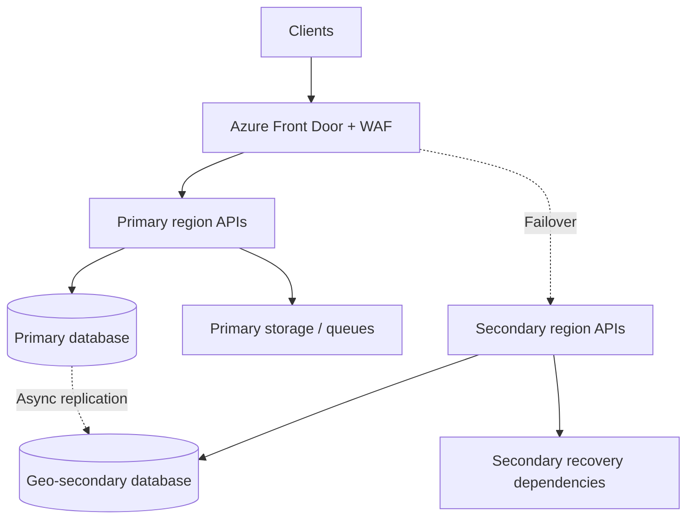

## Design a High-Availability System Across Azure Regions

A multi-region design must keep the application available through a regional outage **without losing control of data ownership**. For a transactional .NET application, I would usually begin with a **primary region plus a warm secondary**: both regions have deployable application capacity, Azure Front Door routes to the healthy primary, and data replicates to the secondary. The exact failover policy depends on the required recovery time objective (RTO) and recovery point objective (RPO). A healthy web endpoint alone does not mean its database is writable. [Microsoft multi-region App Service architecture](https://learn.microsoft.com/en-us/azure/architecture/web-apps/guides/multi-region-app-service/multi-region-app-service) · [Azure Front Door guidance](https://learn.microsoft.com/en-us/azure/well-architected/service-guides/azure-front-door)

## 1. Define RTO and RPO First

**RTO** is the maximum acceptable time to restore a service after an incident. **RPO** is the maximum acceptable amount of recent data that can be lost, expressed as time. For example, an RTO of 30 minutes and RPO of 5 minutes mean the service should recover within 30 minutes and lose no more than five minutes of committed data **under the stated failure scenario**. These are business targets, not promises automatically provided by adding a second region.

Ask which workflows need near-zero data loss (payments, orders), which can tolerate replay (analytics), whether degraded read-only service is acceptable, and what regional data-residency rules apply. Specify separate objectives for a single-zone outage, a region outage, and a global edge/identity-provider outage. Measure actual recovery in drills. [Microsoft disaster recovery guidance](https://learn.microsoft.com/en-us/azure/well-architected/design-guides/disaster-recovery)

## 2. Reference Architecture: Active-Passive

Both regions run compatible application builds. The secondary has either hot capacity or a tested warm scale-up plan. Front Door uses origin priorities and health probes to route to the primary and then the secondary when the primary is unavailable. **Do not route writes to the secondary merely because Front Door can reach it**: promote the data layer first and confirm application dependencies. [Front Door routing methods](https://learn.microsoft.com/en-us/azure/frontdoor/routing-methods)

## 3. Front Door vs Traffic Manager vs Regional Load Balancing

| Component | Layer and role | Good fit | Failover consideration |
| --- | --- | --- | --- |
| Azure Front Door | Global HTTP/HTTPS reverse proxy at the edge; WAF, TLS, CDN, origin routing | Web/API traffic across regions | Probes select origins; data-plane readiness and database promotion still need coordination |
| Azure Traffic Manager | DNS-based global routing to endpoints | Protocol-flexible or DNS-level routing; alternate global ingress | Client/resolver DNS caching and TTL can delay movement; existing connections do not move |
| Application Gateway / regional load balancer | Regional L7/L4 routing to instances | Within-region availability and WAF/backend routing | Cannot by itself solve global regional failover |
| Azure Load Balancer | Regional network load distribution | TCP/UDP or internal load balancing | No global application-level routing |

For a public HTTP SaaS application, use **Front Door as the normal global ingress** and regional ingress/load balancing behind it when needed. Traffic Manager can route directly among regional endpoints or be part of a separately engineered edge-failure strategy; stacking services is not automatically more available. Traffic Manager makes DNS decisions, while Front Door proxies each HTTP request through the edge. DNS TTL and caching affect Traffic Manager failover. [Front Door routing](https://learn.microsoft.com/en-us/azure/frontdoor/routing-methods) · [Traffic Manager operation](https://learn.microsoft.com/en-us/azure/traffic-manager/traffic-manager-how-it-works) · [Azure multi-region network design](https://learn.microsoft.com/en-us/azure/networking/design-guide/multi-region)

## 4. Health Probes and Readiness

A probe endpoint should answer whether that region can **serve the routed workload**, not just whether the process is alive. Separate `/health/live` (process liveness) from `/health/ready` (critical dependencies and write eligibility). Avoid a readiness check that makes both regions fail because one shared, noncritical dependency is down. Probe frequency, thresholds, and region placement must avoid flapping.

Front Door routes based on origin health, priority, latency, and weight according to configuration. If all origins in an origin group fail health probes, Front Door may still route round-robin among them rather than return a clean “no healthy origin” state, so the application must handle its own degraded/fail-closed behavior. Confirm actual probe semantics in a failure test. [Front Door health probes](https://learn.microsoft.com/en-us/azure/frontdoor/health-probes) · [Front Door routing methods](https://learn.microsoft.com/en-us/azure/frontdoor/routing-methods)

## 5. Database Replication and Failover

For Azure SQL Database, a **failover group** or active geo-replication can replicate the primary database to a secondary region. Replication is asynchronous: after an unplanned forced failover, recent committed primary writes can be absent from the new primary. The read-write listener abstracts the current primary, but the application still needs connection retry, idempotency, and reconciliation. Planned failover can coordinate data catch-up; an emergency forced failover may trade data loss for recovery time. [Azure SQL failover groups](https://learn.microsoft.com/en-us/azure/azure-sql/database/auto-failover-group-sql-db?view=azuresql-db) · [Azure SQL business continuity](https://learn.microsoft.com/en-us/azure/azure-sql/database/business-continuity-high-availability-disaster-recover-hadr-overview?view=azuresql)

For PostgreSQL, choose the Azure service's supported cross-region replica/restore/failover mechanism and verify its promotion, replication-lag, and endpoint behavior for the selected tier; do not assume Azure SQL failover-group semantics apply. The system should monitor lag, test promotion, and have a single-writer rule. Prevent both regions from accepting conflicting writes during a network partition or partial recovery. For near-zero RPO, examine whether the data technology and workload can support stronger replication/consensus or an explicit write-acknowledgement strategy, with its latency and availability tradeoff.

## 6. Blob Storage, Queues, Cache, and Other Dependencies

- **Blob Storage:** GRS/GZRS replicate asynchronously to another region. Check the **last sync time** to estimate potential loss before an unplanned account failover. Design metadata/Blob consistency and test access after failover. Read-access geo variants can provide secondary reads, but write promotion remains a separate event. [Azure Storage redundancy](https://learn.microsoft.com/en-us/azure/storage/common/storage-redundancy) · [Last sync time](https://learn.microsoft.com/en-us/azure/storage/common/last-sync-time-get)
- **Messaging:** Decide whether messages are replicated, rebuilt from an outbox, or replayed from a durable event source. A regional broker outage can leave acknowledged jobs in that region; a standby queue alone does not recover them. Use idempotent consumers and clear ownership when replaying.
- **Redis:** Treat cache as rebuildable unless it holds critical state by design. Do not block all recovery waiting for a warm cache; protect the new primary DB from a cold-cache stampede.
- **Identity, Key Vault, DNS, certificates:** Ensure the secondary can authenticate users/workloads and access its secrets/keys; preconfigure permissions, private endpoints, and network rules.
- **Search/analytics:** Rebuild or replicate according to their RPO. If search is noncritical, serve degraded functionality while indexing catches up.

A disaster recovery plan is only as complete as its least recoverable dependency. [Microsoft disaster recovery guidance](https://learn.microsoft.com/en-us/azure/well-architected/design-guides/disaster-recovery)

## 7. Failover Runbook

1. Detect regional impairment using app SLOs, independent probes, and database/queue metrics. Decide whether the incident exceeds the failover threshold; a transient origin failure may not justify promoting a database.
2. Fence or disable writes to the old primary as far as possible. Record the decision, current replication lag, and estimated potential data loss.
3. Promote the secondary data store using its supported failover mechanism. Confirm it is the **only writable primary**.
4. Reconfigure or activate secondary queue, Blob, secrets, and service endpoints; scale warm compute to full load if needed.
5. Run a readiness/synthetic transaction against the secondary: authenticated read, safe write, and dependency check.
6. Enable/confirm Front Door routing to the secondary. Monitor 5xx, p95 latency, write success, queue backlog, and data reconciliation.
7. Communicate the incident, reconcile missing/duplicate operations with idempotency keys and audit records, and keep the old region fenced until safe failback.

Some automation can perform these steps, but do not let an HTTP health probe alone trigger an irreversible database promotion without a defined policy. Separate **traffic failover** from **data failover**. [Azure SQL disaster recovery guidance](https://learn.microsoft.com/en-us/azure/azure-sql/database/disaster-recovery-guidance?view=azuresql)

## 8. Failback

After the failed region returns, do not immediately send writes back simply because it is healthy. Establish the new primary's authoritative data, rebuild replication in the reverse direction, reconcile any missing transactions and queued work, then perform a **planned** failback during a controlled window. Front Door priority can automatically prefer the former primary once it is healthy, so disable/adjust routing until the data plane is ready. Test failback as thoroughly as failover. [Microsoft multi-region App Service architecture](https://learn.microsoft.com/en-us/azure/architecture/web-apps/guides/multi-region-app-service/multi-region-app-service)

## 9. Active-Active Alternative

Active-active application regions can reduce user latency and use both regions under normal conditions, but **active-active writes** require a deliberate conflict-resolution and data-placement strategy. Options include assigning each tenant/user a home region with one writer, using a database designed for multi-region writes with a chosen consistency model, or partitioning write ownership. A single primary DB behind two active web regions is still a cross-region data dependency and may not improve write availability during primary-region failure.

Choose active-active when latency or availability objectives justify the operational complexity. For a transactional order system with strict invariants, active-passive or region-pinned single writers are often easier to reason about than unrestricted multi-master writes. [Azure multi-region network design](https://learn.microsoft.com/en-us/azure/networking/design-guide/multi-region) · [Microsoft DR guidance](https://learn.microsoft.com/en-us/azure/well-architected/design-guides/disaster-recovery)

## 10. RTO/RPO Budget Example

Suppose the business sets **RTO 30 minutes, RPO 5 minutes** for regional loss. An illustrative RTO budget might be: detect and decide 5 minutes; fence/promote database 8 minutes; verify dependencies and scale 7 minutes; route/test traffic 5 minutes; contingency 5 minutes. These are **targets to validate in drills**, not Azure service guarantees. RPO depends on measured replication lag and the precise failover moment; if lag exceeds five minutes, an emergency promotion might violate the target. Alert before that happens and define whether to wait for catch-up, accept loss, or temporarily stop writes.

For a planned failover, pause or drain writes, wait for replication synchronization where supported, promote, then resume. For a destroyed primary region, you might not be able to wait; record the last replicated point and run reconciliation later.

## 11. Testing and Observability

Track Front Door origin health/route decisions, application availability and p95 latency by region, database replication lag, SQL failover status, Blob last sync time, queue backlog/oldest age, cache cold-start DB load, and synthetic end-to-end transactions. Run game days for app-instance/zone loss, primary DB outage, regional isolation, broker loss, and restoration/failback. Measure **observed** RTO/RPO with timestamps and data checks, not just a successful DNS or origin switch.

Use idempotency keys for writes so client retries during failover do not duplicate orders/payments. Store enough business audit data to reconcile uncertain outcomes, and ensure backups remain independent of live replication (replication can propagate logical deletion/corruption).

## 12. Two-Minute Interview Answer

> I would begin with business RTO and RPO and separate availability of the web tier from recovery of data. For a transactional Azure application, I would deploy stateless APIs in two regions with Azure Front Door and WAF, using origin priorities and meaningful readiness probes for primary-to-secondary routing. Within each region, a regional load balancer or ingress distributes traffic across healthy instances. For Azure SQL I would use a failover group or geo-replication, knowing it is asynchronous and an emergency promotion may lose recent writes. Blob redundancy, message replay, Key Vault access, and identity must also be ready in the secondary. The runbook fences the old writer, promotes the secondary database, verifies dependencies with a synthetic transaction, then shifts traffic and reconciles uncertain requests. Traffic Manager is DNS-based and useful for DNS-level routing or a separately designed edge fallback, but its TTL and resolver caching affect failover. I would test region loss and failback regularly, measure actual RTO/RPO, and use idempotency keys so client retries do not duplicate writes.

## 13. Common Interview Follow-Ups

**Is Front Door enough for high availability?** No. It can redirect HTTP traffic, but a secondary API with an unwritable or stale database cannot safely process writes.

**Does geo-replication guarantee zero data loss?** No. Azure SQL and GRS/GZRS storage replicate asynchronously across regions; unplanned failover can lose recent writes.

**Front Door vs Traffic Manager?** Front Door is an HTTP/HTTPS edge proxy with WAF/CDN/origin health routing; Traffic Manager answers DNS queries to select endpoints. DNS caching affects Traffic Manager failover.

**What if Front Door itself fails?** Consider a separately tested alternate ingress/global routing strategy only if the target SLO justifies it; also account for DNS and security policy consistency. [Front Door high-availability guide](https://learn.microsoft.com/en-us/azure/frontdoor/high-availability)

**Why is failback risky?** The secondary became authoritative during the incident. The original region's data is stale until rebuilt and synchronized; routing back prematurely can lose or conflict with writes.

**What if RPO must be zero?** Challenge whether asynchronous geo-replication meets it. Evaluate synchronous/consensus or business-level journal and reconciliation, accepting additional latency, availability, and cost tradeoffs.

## 14. Mistakes to Avoid

- Equating two web regions with end-to-end disaster recovery.
- Automatically routing to a healthy API before its database is promoted and writable.
- Promising zero RPO from asynchronous geo-replication.
- Ignoring DNS TTL/client caches when choosing Traffic Manager.
- Using a shallow health probe that reports healthy while critical writes fail.
- Allowing both regions to accept conflicting writes after a partial failover.
- Forgetting queues, blobs, identity, secrets, cache warming, and failback.
- Testing only traffic routing rather than a complete business transaction.

## 15. Primary References

- [Microsoft: Azure Front Door routing methods](https://learn.microsoft.com/en-us/azure/frontdoor/routing-methods)
- [Microsoft: Azure Traffic Manager operation](https://learn.microsoft.com/en-us/azure/traffic-manager/traffic-manager-how-it-works)
- [Microsoft: Azure SQL failover groups](https://learn.microsoft.com/en-us/azure/azure-sql/database/auto-failover-group-sql-db?view=azuresql-db)
- [Microsoft: Azure Storage redundancy](https://learn.microsoft.com/en-us/azure/storage/common/storage-redundancy)
- [Microsoft: Multi-region disaster recovery design](https://learn.microsoft.com/en-us/azure/well-architected/design-guides/disaster-recovery)
