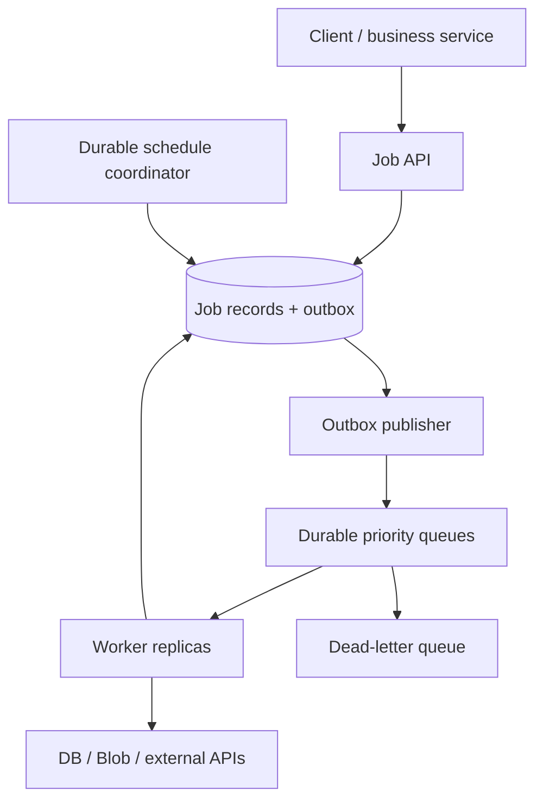

## Design a Background Job Processing System

A background job system accepts work quickly, persists it durably, and lets independently scaled workers process it outside the request path. Examples include PDF generation, document extraction, email sending, image resizing, and billing reconciliation. A reliable design defines job state, queue semantics, retry limits, idempotency, scheduling, poison-message recovery, and how callers learn the final outcome. [Microsoft background-job guidance](https://learn.microsoft.com/en-us/azure/architecture/best-practices/background-jobs)

## 1. Clarify Requirements and Scale

Ask for jobs per second, burst size, average and maximum duration, CPU/I/O use, priority classes, deadlines, ordering needs, recurrence, user-visible progress, and acceptable loss/duplication. Distinguish a five-second thumbnail task from a two-hour export. Ask whether a failed payment-related job needs manual reconciliation rather than an automatic retry.

Example: 2 million jobs/day averages about 23 jobs/second; a 20× peak is around 460 jobs/second. If each job takes 10 seconds of worker time, 460 simultaneous worker slots would be needed to keep pace at peak before headroom. The correct worker count depends on concurrency limits, downstream capacity, and the desired time to drain a burst. Queue depth alone is not enough; track **oldest job age** and processing latency.

## 2. High-Level Architecture



The API records intent and returns `202 Accepted` with a stable `jobId` and status URL. The queue carries a compact job reference, not a multi-gigabyte payload; store large inputs in Blob Storage and pass a durable URI/ID. Workers update job state in the database, and the scheduler enqueues due work. This separates API latency from job duration and absorbs bursts. [Microsoft queue-based load leveling](https://learn.microsoft.com/en-us/azure/architecture/patterns/queue-based-load-leveling)

## 3. Job Record and State Machine

| Field | Purpose |
| --- | --- |
| `JobId`, `TenantId`, `JobType`, `SchemaVersion` | Identity, routing, compatibility |
| `PayloadRef`, `PayloadHash` | Reference to validated input and deduplication context |
| `Status` | `Pending`, `Queued`, `Running`, `RetryScheduled`, `Succeeded`, `Failed`, `Cancelled` |
| `Priority`, `DueAtUtc`, `ExpiresAtUtc` | Scheduling and SLA |
| `AttemptCount`, `MaxAttempts`, `NextAttemptAtUtc` | Retry policy |
| `LeaseOwner`, `LeaseUntilUtc`, `Version` | Safe worker claims and recovery |
| `CreatedAtUtc`, `StartedAtUtc`, `CompletedAtUtc`, `LastErrorCode` | Operations and audit |
| `IdempotencyKey`, `CorrelationId` | Safe client retries and tracing |

Transitions should be conditional and monotonic: for example, a stale worker must not turn an already `Succeeded` job back into `Running`. A long-running job may periodically record progress, but progress writes should not overload the database. Preserve enough attempt history for investigation without storing secrets in errors.

## 4. Queue Choice and Topology

For Azure/.NET, **Azure Service Bus** is a strong fit when you need durable queues, peek-lock settlement, scheduled delivery, DLQs, and optionally sessions for per-key order. Azure Storage Queues can fit simpler workloads; Kafka is suited to event streams/replay rather than being the default scheduler for individual delayed jobs. A separate .NET Worker Service or Azure Functions trigger can consume jobs according to hosting and operational needs. [Azure messaging choices](https://learn.microsoft.com/en-us/azure/architecture/guide/technology-choices/messaging) · [Service Bus best practices](https://learn.microsoft.com/en-us/azure/well-architected/service-guides/azure-service-bus)

Use distinct queues or subscriptions for materially different processing costs and SLAs, such as `critical`, `standard`, and `bulk`. Do not let a million low-priority exports block security notifications. Reserve worker capacity for critical work, but allocate some capacity to standard work to prevent starvation. Scale separate worker pools by queue age, throughput, and dependency saturation; cap parallelism so adding workers does not exhaust SQL connections or a third-party API. [Microsoft competing consumers](https://learn.microsoft.com/en-us/azure/architecture/patterns/competing-consumers)

## 5. Reliable Enqueue: The Dual-Write Boundary

If `POST /jobs` must write a job row and publish a queue message, doing those as two unrelated writes can lose work. Persist the `Pending` job and an **outbox message in one database transaction**. A relay publishes the outbox entry and marks it sent after broker confirmation. A crash after publish but before marking can resend, so the worker must be idempotent. The API uses a client idempotency key to return the same `jobId` after an uncertain HTTP retry. [Microsoft asynchronous messaging guidance](https://learn.microsoft.com/en-us/dotnet/architecture/microservices/architect-microservice-container-applications/asynchronous-message-based-communication)

A queue message might contain `{jobId, jobType, schemaVersion, correlationId}`. The worker reads the authoritative job row before starting, so stale, cancelled, expired, or already completed messages become safe no-ops. Keep queue TTL and job retention aligned with the business deadline.

## 6. Worker Processing and Settlement

With Service Bus **peek-lock**, receive a message, validate/claim its job, run the handler, commit a durable outcome, and only then complete the message. If the worker crashes before completion, the lock expires and the message is redelivered. For long jobs, renew the message lock or decouple the long-running execution from the broker lock using a durable lease/state-machine design; do not assume a short queue lock lasts for a two-hour export. Use cancellation tokens and graceful shutdown. [Service Bus locks and settlement](https://learn.microsoft.com/en-us/azure/service-bus-messaging/message-transfers-locks-settlement) · [.NET Worker Services](https://learn.microsoft.com/en-us/dotnet/core/extensions/workers)

```text
receive job message under lock
load job and conditionally claim it
if already completed/cancelled/expired: complete message
otherwise execute handler with timeout and bounded resources
commit result/progress and outgoing events durably
complete message after successful state commit
on classified failure: schedule retry or dead-letter deliberately
```

Multiple workers can compete for the same queue. Use a DB compare-and-set/lease or unique processing constraint where duplicate simultaneous execution would cause harm. A broker lock reduces concurrency but cannot by itself guarantee only one business effect, especially after lock loss or uncertain completion.

## 7. Idempotency and External Side Effects

Assume **at-least-once processing**. Use stable `jobId`/`operationId` and conditional state transitions. For a local database update, record a unique processed operation marker in the same transaction as the effect. For a generated file, write to a deterministic destination/version or use conditional creation. For payment or email providers, use a provider idempotency key if supported and reconcile an ambiguous timeout before repeating the call.

`Succeeded` in the job table should mean the required effect is durably recorded, not merely that a method returned. If the worker performs an external call and crashes before saving success, the outcome is unknown. A provider status lookup or a separate `AwaitingConfirmation` state may be necessary. Azure Service Bus duplicate detection reduces repeated sends within a configured window, but it does not remove consumer idempotency. [Service Bus duplicates](https://learn.microsoft.com/en-us/azure/service-bus-messaging/service-bus-message-loss-and-duplicates)

## 8. Retry Policy

Classify the error:

| Error | Example | Action |
| --- | --- | --- |
| Transient | 503, throttling, network timeout | Delayed retry with exponential backoff and jitter; honor `Retry-After` |
| Dependency outage | Database/provider unavailable | Circuit breaker, slow/pause workers, bounded retry |
| Permanent validation | Bad payload, unsupported schema | Mark failed and quarantine/dead-letter immediately |
| Ambiguous side effect | Payment call timed out | Reconcile by stable operation ID before repeating |
| Expired/cancelled | Scheduled task no longer useful | Mark terminal; do not run |

Limit both attempt count and total retry age. Avoid immediate abandon/requeue loops that hammer a failing dependency and starve healthy jobs. Record each retry reason and schedule it for a future time instead of holding a worker thread asleep. A delayed retry can be a scheduled broker message or durable `NextAttemptAtUtc` scanned by a dispatcher. If retries must preserve per-entity order, park later jobs for that entity or use sessions; moving one failed job to a separate retry queue may allow successors to overtake it. [Microsoft retry guidance](https://learn.microsoft.com/en-us/azure/well-architected/design-guides/handle-transient-faults)

## 9. Scheduling and Recurring Jobs

For a **one-time future job**, persist `DueAtUtc` and let a scheduler enqueue it near the due time, or use broker scheduled delivery when its semantics fit. Store the authoritative schedule in the DB if users may edit/cancel it and the system needs audit/recovery. On reschedule, invalidate prior scheduled messages using a generation/version so an old message becomes a no-op even if cancellation races.

For a **recurring job**, store cron/time-zone/business rules and compute occurrence IDs, for example `(ScheduleId, ScheduledFireTimeUtc)`, behind a unique constraint. Multiple scheduler replicas compete through a DB lease/leader election or atomic claim. Persist each occurrence before enqueueing; after failover, a new scheduler catches up missed occurrences according to policy (run all, coalesce, or skip). Define daylight-saving behavior in the schedule's time zone; store execution instants in UTC. Prevent overlapping runs when the business operation requires it, but do not assume every recurrence must serialize globally.

For a large number of future tasks, benchmark broker scheduled-message and cancellation/inspection limits; a DB-backed schedule index with a bounded due-window dispatcher may be easier to manage. [Azure Service Bus scheduled messages](https://learn.microsoft.com/en-us/azure/service-bus-messaging/message-sequencing)

## 10. Poison Messages and DLQ Recovery

A poison message repeatedly fails because it is malformed, incompatible with the worker version, or hits a deterministic bug. After a defined delivery/attempt threshold, dead-letter it with `jobId`, reason code, last error, schema version, and correlation ID. Azure Service Bus has a DLQ associated with queues and subscriptions and can dead-letter after the maximum delivery count. Do not retry known permanent validation failures up to the threshold just to consume attempts. [Service Bus DLQ](https://learn.microsoft.com/en-us/azure/service-bus-messaging/service-bus-dead-letter-queues)

Alert on DLQ count and **oldest age**, investigate root cause, fix code/configuration or data, and replay only if the job is still valid, not expired, and not already completed. Preserve the same job identity so idempotency checks still work. Do not let a poison job block an ordered session indefinitely; decide whether to quarantine that entity's later jobs or permit a documented recovery transition.

## 11. Example: Document Processing

A user uploads a document to Blob Storage. The API saves `Document(Status=Uploaded)` and `Job(Type=ExtractText, Status=Pending)` plus an outbox event in one transaction. A worker receives the job, checks that the Blob version matches, claims the job, extracts text in bounded chunks, stores a versioned result, and commits `Succeeded`. A second job embeds text and indexes it. If PDF extraction fails transiently, schedule a delayed retry; if the document is corrupt or unsupported, mark it `FailedPermanent` and DLQ the message. On duplicate delivery, the worker sees the same completed input version and returns the existing output. This maps directly to a document/RAG pipeline without making the HTTP upload wait for extraction.

## 12. Failure Walkthrough

| Failure point | Expected behavior |
| --- | --- |
| API commits job but crashes before sending response | Client retries with same key and receives same `jobId`; outbox publishes |
| Broker is down | Outbox retains pending message; relay retries and alerts on age |
| Worker crashes during processing | Lock/lease expires; another worker resumes or reruns idempotently |
| Worker commits result but queue completion fails | Redelivery checks terminal state and completes without repeating effect |
| External call times out after possible success | Reconcile provider state before retrying |
| Scheduler crashes before enqueuing occurrence | New scheduler claims due occurrence using stable occurrence ID |
| Poison message reaches threshold | DLQ with reason; alert and controlled replay after repair |

## 13. Observability, Security, and Operations

Expose `GET /jobs/{jobId}` with status, progress, safe error code, and result location. Track queue depth, oldest message age, pending outbox age, job wait/run duration p95/p99, success/failure/retry rate, DLQ age, worker concurrency, lease expirations, and downstream throttling. Propagate trace/correlation IDs into queue headers. Make job payloads versioned and avoid placing secrets or large sensitive content directly in queue messages. Authenticate job producers and isolate tenants; workers should have least-privilege access to the specific Blob/DB/provider resources they need.

Deploy workers independently from the API, drain on shutdown, and cap job duration and memory. Test scale-out, duplicate delivery, lost acknowledgement, long-running lock renewal, poisoned payload, scheduler failover, and broker outage. A deployment should tolerate in-flight jobs created by an older payload schema.

## 14. Two-Minute Interview Answer

> I would put durable job records behind an API that returns `202 Accepted` and a job ID, then publish a compact job reference to a queue using a transactional outbox so a committed job cannot lose its message. Separate worker pools consume critical and bulk queues and scale using oldest message age plus downstream capacity. With Service Bus peek-lock, workers claim a job, perform the work, commit a durable result, and only then complete the message. Since a crash can cause redelivery, every handler uses stable job IDs, conditional state changes, and idempotency keys for external providers. I classify failures: transient errors get delayed exponential backoff with jitter; invalid payloads fail immediately; exhausted jobs go to a monitored DLQ for repair and controlled replay. One-time and recurring schedules have durable records and unique occurrence IDs, with a leased scheduler so multiple instances do not double-enqueue. I would test worker crashes, broker outages, ambiguous external calls, schedule failover, and poison messages.

## 15. Common Interview Follow-Ups

**Why not use `Task.Run` in the API?** It is tied to the web process and may be lost on restart; it lacks durable scheduling, retries, and operational visibility.

**Does queue acknowledgement guarantee the job succeeded?** No. Acknowledge only after the required durable state/effect is recorded; the user-visible job status is tracked separately.

**Is exactly-once execution possible?** A broker can redeliver after uncertain acknowledgement. Design effectively-once business effects with idempotency and reconciliation rather than promising one method invocation.

**How do you process a two-hour job with a short lock?** Use lock renewal within supported bounds or a durable job lease/state machine that checkpoints progress and lets the queue trigger/coordinate execution.

**How do you cancel a running job?** Mark cancellation requested in durable state; cooperative workers observe it at safe checkpoints, stop, and record the final state. An already committed external effect may need compensation.

**How do you prevent duplicate recurring runs?** Use a unique schedule occurrence ID and atomic claim. Duplicate queue messages are still harmless because the worker checks the occurrence state.

## 16. Mistakes to Avoid

- Using fire-and-forget work in an HTTP request for durable business jobs.
- Storing only the queue message with no status or audit when users need progress.
- Acknowledging before the durable result commits.
- Assuming a broker lock or duplicate-detection window replaces idempotency.
- Retrying invalid data indefinitely or immediately requeueing a failing dependency.
- Sleeping in worker threads for long delayed retries.
- Running multiple cron schedulers without a lease or unique occurrence constraint.
- Replaying expired or already completed jobs from the DLQ.

## 17. Primary References

- [Microsoft: Background-job best practices](https://learn.microsoft.com/en-us/azure/architecture/best-practices/background-jobs)
- [Microsoft: Azure Service Bus locks and settlement](https://learn.microsoft.com/en-us/azure/service-bus-messaging/message-transfers-locks-settlement)
- [Microsoft: Azure Service Bus dead-letter queues](https://learn.microsoft.com/en-us/azure/service-bus-messaging/service-bus-dead-letter-queues)
- [Microsoft: Competing Consumers pattern](https://learn.microsoft.com/en-us/azure/architecture/patterns/competing-consumers)
- [Microsoft: .NET Worker Services](https://learn.microsoft.com/en-us/dotnet/core/extensions/workers)
