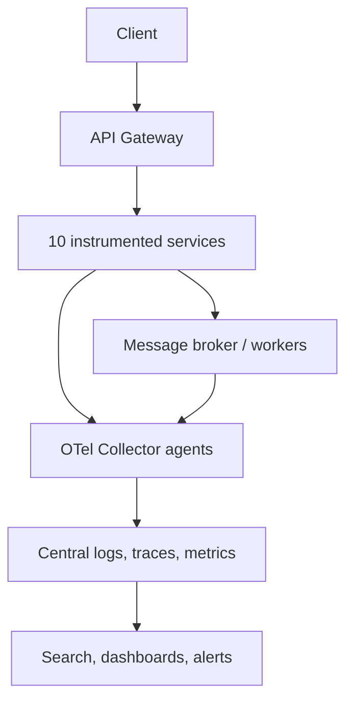

## Design Centralized Logging and Distributed Tracing for 10 Microservices

A single user request may enter an API Gateway, call several services, publish a message, and complete in a worker. Centralized logs answer **what each component reported**; a distributed trace shows **the end-to-end call graph and time spent in each operation**. Metrics show whether a problem is widespread. I would use structured logs, W3C trace context, OpenTelemetry instrumentation, a Collector pipeline, and searchable log/trace backends. [W3C Trace Context](https://www.w3.org/TR/trace-context/) · [Microsoft .NET observability](https://learn.microsoft.com/en-us/dotnet/core/diagnostics/observability-with-otel)

## 1. Clarify Requirements

Ask how many requests/second and log events/second, retention periods, incident investigation targets, regulatory data restrictions, deployment platform, and budget. Ask whether all 10 services are HTTP or some communicate via Kafka, RabbitMQ, or Azure Service Bus. Decide which traces must always be retained (errors, slow requests, critical payment flows) and what fraction of healthy requests to sample. Define acceptable telemetry loss during an observability outage; the business request path should not block indefinitely on telemetry export.

## 2. Reference Architecture



Each service emits structured logs and spans with resource attributes such as `service.name`, environment, deployment version, and region. Collectors receive telemetry, batch/filter/redact it, and export it to a backend such as Azure Monitor/Application Insights, Grafana Tempo plus Loki, Jaeger plus a log store, or another managed observability platform. Choose one trace/log correlation model and standardized service naming. The Collector has receiver, processor, and exporter pipelines. [OpenTelemetry Collector](https://opentelemetry.io/docs/collector/)

## 3. Trace, Span, and Correlation ID

A **trace** represents one logical operation. All spans in it share a `traceId`; each operation has its own `spanId` and usually a parent span ID. A **span** records a name, start/end time, status, and attributes. A separate business ID such as `orderId` or `correlationId` helps find the operation even if the trace was not sampled, but it is not a substitute for a W3C trace ID.

Example: `POST /orders` produces an ingress span, then gateway and service spans for Auth, Catalog, Inventory, Payment, Orders, and Notification. Nested spans may cover SQL, Redis, and outbound HTTP calls. The trace view shows which service was slow; correlated logs explain a particular failure. A fan-out can have sibling spans rather than a single line of 10 calls.

## 4. Propagate Context Across HTTP Calls

At ingress, the gateway accepts and validates standard W3C `traceparent` and optional `tracestate`, or creates a new trace if absent. The request's span becomes the parent for downstream operations. Instrumented HTTP clients send context to the next service; each service extracts it and creates a child server span with the **same trace ID** and a new span ID. `traceparent` carries trace ID, parent span ID, and flags; `tracestate` carries vendor context. Do not manually generate a new trace ID in every service. [W3C Trace Context](https://www.w3.org/TR/trace-context/) · [.NET distributed tracing concepts](https://learn.microsoft.com/en-us/dotnet/core/diagnostics/distributed-tracing-concepts)

For gateway/proxy hops, verify that headers are forwarded and not silently removed. Treat inbound baggage and custom headers as untrusted; do not put secrets, raw tokens, or sensitive user data in them. Set size and allowlist limits. Trace context is for observability, not authorization. [OpenTelemetry baggage](https://opentelemetry.io/docs/concepts/signals/baggage/)

## 5. Propagate Context Through Queues and Background Jobs

At publish time, inject the current trace context into message **headers/properties** and record a producer span. At consume time, extract the headers and start a consumer/process span using the extracted context or a span link, according to the message workflow. Use a stable business `messageId` and `orderId` separately for idempotency and investigation. If a queue retries the same event hours later, decide whether a parent-child relation or a span link better expresses causality; do not hold a single in-memory span open for the whole queue delay.

Some broker client libraries instrument propagation automatically; verify in an integration test. If a legacy producer omits headers, create a new trace at the consumer and correlate via business IDs where possible. This creates a visible boundary instead of pretending the trace is complete. [OpenTelemetry messaging conventions](https://opentelemetry.io/docs/specs/semconv/messaging/) · [OpenTelemetry propagators](https://opentelemetry.io/docs/specs/otel/context/api-propagators/)

## 6. Centralized Structured Logging

Emit one JSON/log event per meaningful occurrence, with fields rather than interpolated unstructured text:

```json
{
  "timestamp": "2026-09-27T09:30:00Z",
  "level": "Error",
  "service.name": "PaymentService",
  "environment": "production",
  "traceId": "4bf92f3577b34da6a3ce929d0e0e4736",
  "spanId": "00f067aa0ba902b7",
  "orderId": "ORD-123",
  "event": "PaymentAuthorizationFailed",
  "providerErrorCode": "TIMEOUT",
  "durationMs": 3020
}
```

Use stable field names and include trace/span IDs from the active context. Log at boundaries and meaningful state transitions; do not log every method call. Control severity and volume. Store exceptions with stack traces and normalized error codes. Protect PII, access tokens, connection strings, payment data, and clinical data by redaction at the application and Collector layers. Limit who can search production logs and define retention by data sensitivity. OpenTelemetry specifies correlation of log records with trace and span IDs. [OpenTelemetry logging](https://opentelemetry.io/docs/specs/otel/logs/)

## 7. .NET 9 Instrumentation Sketch

ASP.NET Core and `HttpClient` provide instrumentation hooks; `ActivitySource` supplies custom spans, and `ILogger` emits structured logs. This sample shows the shape of a service configuration; package versions and exporters should be selected for the deployed runtime.

```csharp
using System.Diagnostics;
using OpenTelemetry.Resources;
using OpenTelemetry.Trace;

var builder = WebApplication.CreateBuilder(args);

builder.Services.AddHttpClient("inventory");
builder.Services.AddOpenTelemetry()
    .ConfigureResource(resource => resource.AddService("OrderService"))
    .WithTracing(tracing => tracing
        .AddAspNetCoreInstrumentation()
        .AddHttpClientInstrumentation()
        .AddSource("Orders.Business")
        .AddOtlpExporter());

var app = builder.Build();
app.Run();

// In an application service:
private static readonly ActivitySource Source = new("Orders.Business");

public async Task ConfirmAsync(Guid orderId, CancellationToken ct)
{
    using var activity = Source.StartActivity("order.confirm");
    activity?.SetTag("order.id", orderId.ToString());
    logger.LogInformation("Confirming order {OrderId}", orderId);
    await repository.ConfirmAsync(orderId, ct);
}
```

Configure the OTLP exporter endpoint and credentials via environment/configuration and send to a Collector, not directly from each code path. Instrument SQL/Redis and broker libraries where supported, and verify they create spans without exposing query parameters or PII. `Activity.Current?.TraceId` and `Activity.Current?.SpanId` can be used when explicit correlation is needed; logging/export configuration should include them automatically where supported. [Microsoft .NET observability](https://learn.microsoft.com/en-us/dotnet/core/diagnostics/observability-with-otel) · [Microsoft built-in Activities](https://learn.microsoft.com/en-us/dotnet/core/diagnostics/distributed-tracing-builtin-activities)

## 8. Collector and Storage Design

Deploy a local/nearby Collector agent per node or environment and optionally a central Collector gateway tier. Agents receive OTLP, batch, limit memory, and forward; gateway collectors can apply shared redaction/routing/sampling policies before export. Keep telemetry pipelines independent from business services and ensure backpressure/export failures do not exhaust application memory. For tail sampling across multiple collectors, route all spans of a trace to the same tail-sampling instance; otherwise it cannot make a decision using the complete trace. [OpenTelemetry Collector architecture](https://opentelemetry.io/docs/collector/architecture/) · [Collector gateway deployment](https://opentelemetry.io/docs/collector/deploy/gateway/)

Index logs by time, service, severity, trace ID, and chosen low-cardinality operational fields. High-cardinality values such as `userId` and `orderId` can be searchable log fields, but should not automatically become metric labels. Define hot retention for investigations, cheaper archive retention if needed, access control, and deletion policy. Distributed traces are sampled and may not be retained for every request; keep business audit events in their authoritative store rather than relying on telemetry as an audit ledger.

## 9. Sampling and Cost Control

Tracing every span of every request can be expensive. **Head sampling** decides near the beginning using a probability or policy; it is cheap but can miss a later error. **Tail sampling** waits for trace completion and can retain slow/error traces, but consumes collector memory and needs trace-affinity routing. Sample common successful traffic, retain selected critical/error/slow paths, and keep trace-consistent decisions so a trace does not appear fragmented. Logs have their own volume controls; an unsampled trace can still have correlated log records, but clicking through to a trace may find nothing.

Sampling is an operational cost/visibility decision, not a correctness mechanism. During an incident, increase sampling temporarily for affected routes or tenants within privacy/cost limits. Monitor telemetry drop counts and exporter failures so an apparent drop in errors is not simply lost data. [OpenTelemetry Collector deployment](https://opentelemetry.io/docs/collector/deploy/gateway/)

## 10. How to Trace One Request Across 10 Services

1. The client sends `POST /orders` with a client request ID. Gateway creates or continues a W3C trace and returns a safe request/trace reference to support.
2. Gateway span records route, status, and duration. Its outbound request propagates `traceparent`.
3. Each service creates a server span, propagates context to `HttpClient` calls, and logs with the shared trace ID plus its own span ID.
4. If the request publishes an event, the producer injects context into broker headers. The consumer extracts it and continues or links the trace.
5. Search the trace backend by trace ID. Inspect the waterfall: which span dominates elapsed time, where errors appear, and whether retries/parallel calls occurred.
6. Open logs filtered by that trace ID, then by specific `spanId` or `orderId`, to see validation failures, SQL timeouts, and provider response codes.
7. Compare service metrics (error rate, p95 latency, saturation) to determine whether the issue is one request or systemic.

If a service is missing from the trace, investigate missing header propagation, uninstrumented libraries, asynchronous context loss, sampling/export drops, or a different trace started at the message boundary. Do not assume the service was skipped merely because its span is absent.

## 11. Example Investigation

The user reports an order timeout. The trace shows gateway 5.2 s, Order API 5.0 s, Inventory 80 ms, and Payment 4.6 s. The Payment span includes two outbound provider attempts. Correlated logs show the first attempt timed out and the second was blocked by a circuit breaker. The trace identifies the latency owner; logs show the failure reason; metrics reveal whether many Payment requests had the same problem. The remediation may involve provider timeout/retry policy and idempotency, not adding more Order API replicas.

## 12. Reliability and Security Details

- Propagate cancellation and deadlines where appropriate, but keep trace context distinct from request authorization.
- Sanitize untrusted incoming tracing headers and enforce size limits. Do not propagate baggage with sensitive data across services.
- Use TLS and authentication for telemetry export; restrict access by team/environment.
- Bound log and trace buffers, batch asynchronously, and define drop behavior if the backend is down.
- Include deployment version and region to distinguish a bad rollout from a provider outage.
- Test missing spans, duplicate message processing, parallel fan-out, retries, and a Collector outage.

## 13. Two-Minute Interview Answer

> I would standardize on structured JSON logs and OpenTelemetry traces across the gateway and all 10 services. The gateway starts or continues a W3C trace, and HTTP clients forward `traceparent` so every downstream span shares one trace ID while retaining its own span ID. For broker messages, producers inject trace context into message headers and consumers extract it or create a span link. Each service logs business IDs, trace ID, span ID, error code, and deployment version without logging secrets or personal data. Collectors receive, batch, redact, sample, and export telemetry to centralized log and trace stores. To investigate a request, I search by trace ID, inspect the waterfall for the slow or failing span, then filter logs by the same trace ID and compare service metrics. I would sample routine successes, retain relevant errors and slow traces within budget, monitor dropped telemetry, and test that context survives gateways, queues, retries, and service restarts.

## 14. Common Interview Follow-Ups

**Is a correlation ID the same as a trace ID?** No. A business/request correlation ID helps search records; a trace ID connects spans under a standard propagation model. Carry both when useful.

**What if the user request triggers background work hours later?** Propagate a causal reference in message headers and business IDs. Use a new trace with a span link when a long-running separate workflow is clearer than one parent-child trace.

**Why not put every field in baggage?** Baggage propagates through calls, can be visible in headers, and adds overhead/security risk. Use small, approved context only.

**How do you trace parallel calls?** Child spans are siblings under the caller. The waterfall shows overlap; total elapsed time is not the sum of all span durations.

**What if one service uses another language?** Use W3C context and OpenTelemetry SDK/instrumentation for that language, with common resource/attribute conventions.

**Do traces replace logs or metrics?** No. Traces show one path, logs explain events, and metrics show aggregate behavior and alert conditions.

## 15. Mistakes to Avoid

- Generating a new trace ID in each service or losing context at the broker boundary.
- Using only a custom `X-Correlation-ID` and expecting a trace waterfall automatically.
- Assuming all traces are complete when head sampling or exporter loss is active.
- Logging tokens, passwords, full request bodies, payment or clinical data.
- Using high-cardinality user/order IDs as metric labels indiscriminately.
- Making business requests wait synchronously for a logging backend.
- Treating observability logs as the system's durable business audit record.

## 16. Primary References

- [W3C Trace Context](https://www.w3.org/TR/trace-context/)
- [Microsoft: .NET observability with OpenTelemetry](https://learn.microsoft.com/en-us/dotnet/core/diagnostics/observability-with-otel)
- [OpenTelemetry Collector](https://opentelemetry.io/docs/collector/)
- [OpenTelemetry messaging conventions](https://opentelemetry.io/docs/specs/semconv/messaging/)
- [OpenTelemetry logging](https://opentelemetry.io/docs/specs/otel/logs/)
