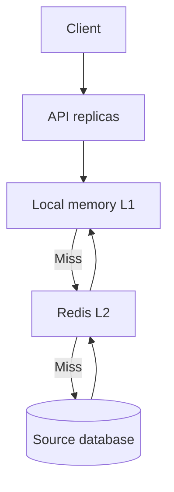

# Design a Distributed Caching Solution
## Design a Distributed Caching Solution

A cache reduces latency and database load for frequently requested data. The design question is not simply “Redis or local memory?” It is **what data can be stale, for how long, across how many application instances, and what happens if the cache fails?** For an ASP.NET Core service with many replicas, I would often use a short-lived in-process cache for especially hot, safe data and Redis as a shared second-level cache, while keeping the database as the source of truth. Some workloads need only one of those layers. [Microsoft caching guidance](https://learn.microsoft.com/en-us/azure/architecture/best-practices/caching)

## 1. Clarify the Requirements

Ask for request volume, read/write ratio, size and cardinality of cached items, p95/p99 latency goal, database capacity, number of app replicas/regions, and acceptable staleness by data type. Ask whether a value contains tenant/user-specific data and whether a changed permission or account balance must be visible immediately.

Example workload: product details are read thousands of times more often than updated, while inventory and account balances change frequently. Product descriptions may tolerate a short stale interval; an inventory reservation and a money transfer must rely on an authoritative transactional store. Define an explicit freshness budget per item rather than applying one TTL everywhere.

## 2. Architecture and Read Flow



For a read, check local L1, then shared Redis L2, then the database. Cache the database result with suitable TTLs; store missing results briefly where safe. A simpler one-layer Redis cache may be preferable when local invalidation complexity outweighs a few milliseconds of latency. A CDN or HTTP output cache can serve public responses before the application, but authorization and personalization must be handled correctly. [Microsoft cache-aside pattern](https://learn.microsoft.com/en-us/azure/architecture/patterns/cache-aside)

## 3. Redis vs Local Cache

| Concern | Local cache (`IMemoryCache`) | Distributed cache (Redis) |
| --- | --- | --- |
| Lookup latency | In-process, no network hop | Network call and serialization overhead |
| Scope | One process/replica | Shared among replicas using the same cache |
| Scale-out behavior | Each replica has different contents | Common view, subject to cache topology/replication |
| Memory cost | Duplicated across replicas | Centralized cache memory and service cost |
| Failure mode | Lost on restart; app memory pressure | Redis outage/latency affects all clients using it |
| Invalidation | Evict on each replica or wait for TTL | One shared key deletion, plus any L1/edge layers |
| Best use | Tiny, hot, slow-changing reference data | Shared sessions, frequently read entities, cross-replica cache |

Neither cache should be the only durable store of business data. Local memory is appropriate for immutable configuration or very short-lived snapshots; Redis is useful when many replicas benefit from the same cached values. An L1+L2 design improves hot-path latency but adds another stale-data boundary. [ASP.NET Core in-memory caching](https://learn.microsoft.com/en-us/aspnet/core/performance/caching/memory) · [ASP.NET Core distributed caching](https://learn.microsoft.com/en-us/aspnet/core/performance/caching/distributed)

## 4. Cache-Aside, Write-Through, and Write-Behind

**Cache-aside (recommended default):** On a miss, read the DB and fill the cache. On a write, commit to the DB and invalidate the affected key. It is simple and caches only data that is requested, but it does not provide automatic strong consistency. [Microsoft cache-aside pattern](https://learn.microsoft.com/en-us/azure/architecture/patterns/cache-aside)

**Write-through:** Write through a coordinated cache/store path so the cache is updated with the data. This may simplify reads, but it adds latency/coordination to writes and still needs a reliable plan when one side fails. Avoid casually writing DB and Redis as two unrelated operations and calling them atomic.

**Write-behind:** Accept writes into cache and flush later. It may improve apparent write latency, but losing unflushed cache data is unacceptable for many business records. Use only when durability, replay, and failure semantics are explicitly designed.

## 5. TTL and Eviction Policy

An **absolute TTL** bounds how long an entry can survive without refresh. A **sliding TTL** extends on access; for hot mutable data it can keep a stale entry alive indefinitely unless combined with an absolute cap. Choose TTL by business freshness: a nearly immutable country list may last hours, product description minutes, dynamic stock much shorter or not cached for transactional decisions. These are examples, not universal values.

Add small random TTL jitter to avoid thousands of keys expiring simultaneously. Set a cache memory budget and appropriate eviction policy; TTL is not a promise that a key survives until expiry because memory pressure can evict it earlier. Size based on serialized payload, overhead, hot working set, and replicas. Do not cache huge rarely reused objects automatically. [Redis cache-aside](https://redis.io/docs/latest/develop/use-cases/cache-aside/)

## 6. Cache Invalidation on Writes

For a basic cache-aside write: update the authoritative database, commit, then delete the Redis key and invalidate L1. If invalidation fails, a bounded TTL provides eventual refresh; monitor and retry the invalidation where freshness matters. For multiple dependent cached views (product detail, search summary, category page), maintain an explicit invalidation map or use versioned cache keys.

A simple **delete-after-commit** has a race:

1. Reader misses cache and reads old DB value.
2. Writer commits a new DB value and deletes the cache key.
3. Reader stores its previously read old value **after** deletion.

That stale entry can remain until TTL. If this is unacceptable, use a version/generation in the DB and cache key (`product:123:v8`), compare versions before publishing a refreshed value, or use another coordinated strategy. Multi-level caches must invalidate across replicas; a Redis delete does not magically evict every `IMemoryCache`. Pub/sub invalidation can be fast but messages may be missed during disconnection, so keep short local TTLs or durable/version checks as a safety net. [Microsoft cache-aside consistency considerations](https://learn.microsoft.com/en-us/azure/architecture/patterns/cache-aside) · [Redis client-side caching](https://redis.io/docs/latest/develop/reference/client-side-caching/)

For highly sensitive authorization revocation, payments, and inventory reservations, read from the authoritative system or design a stronger consistency path. A cache TTL is not an authorization guarantee.

## 7. Cache Stampede and Hot Keys

A stampede occurs when many concurrent requests miss or expire the same hot key and all query the database. Combine techniques according to scale:

- **Single-flight within a process:** Only one request loads a key; other local requests await it. This does not coordinate multiple replicas.
- **Cross-replica lease:** One worker briefly claims a Redis lock, loads the DB value, and populates the cache; others wait briefly or serve permitted stale data. Use a unique lock token, short expiry, and compare-and-delete on release. A cache-fill lock is an optimization, not a correctness lock for business transactions.
- **Stale-while-revalidate:** Serve a bounded stale copy while one worker refreshes it, but only for data with an explicit stale allowance.
- **Early refresh and TTL jitter:** Refresh popular keys before expiry and spread expiration times.
- **Backpressure:** Bound DB fallback concurrency and shed load if both cache and DB are saturated.

.NET `HybridCache` provides stampede protection for concurrent callers in an application instance and can use a configured secondary distributed cache. Do not assume local coalescing is a global distributed lock across replicas. Redis documents `SET ... NX ... PX` and compare-before-release semantics for a short lease. [Microsoft HybridCache](https://learn.microsoft.com/en-us/aspnet/core/performance/caching/hybrid) · [Redis distributed locks](https://redis.io/docs/latest/develop/clients/patterns/distributed-locks/)

## 8. Stale Data Policies

Define three classes:

| Data | Example | Suggested read behavior |
| --- | --- | --- |
| Stale-tolerant | Public product description | Bounded stale-while-revalidate during refresh/outage |
| Short-stale | Profile display or dashboard count | Short TTL, explicit invalidation, version if needed |
| Strongly current | Inventory reservation, payment balance, access revocation | Authoritative read/transaction or stronger design |

If Redis is unavailable, a bounded DB fallback may keep the service running, but it can trigger a database overload. Use circuit breakers, timeouts, and a concurrency limit. For safe data, a locally cached stale value may be better than error; for security or financial decisions, fail closed or query the source of truth. Never apply “serve stale” globally without a per-data policy.

## 9. Negative Caching and Cache Penetration

Unknown IDs can repeatedly hit the database. Cache “not found” for a short TTL when the result is safe to share. Keep tenant/authorization context in the key; otherwise one user's 404 could hide another user's resource. A newly created item may remain apparently absent until a negative entry expires, so invalidate it on creation. Rate-limit enumeration and suspicious requests rather than relying on negative caching alone.

Use structured namespaced keys such as `catalog:tenant-42:product:123:v8`. Include every input that changes the result: locale, tenant, currency, permissions, or API version where applicable. Avoid storing secrets in key names or logs.

## 10. .NET 9 Implementation Sketch

For a two-level cache, `HybridCache` offers a unified API and per-process stampede protection. Configure a distributed backing cache if cross-replica sharing is needed. This is illustrative code; choose TTLs from the product's freshness budget and define write-side invalidation separately.

```csharp
builder.Services.AddStackExchangeRedisCache(options =>
{
    options.Configuration = builder.Configuration.GetConnectionString("Redis");
});
builder.Services.AddHybridCache();

public sealed class ProductReader(HybridCache cache, AppDbContext db)
{
    public async Task<ProductDto?> GetAsync(Guid tenantId, Guid productId,
        CancellationToken ct)
    {
        var key = $"catalog:{tenantId}:product:{productId}";
        return await cache.GetOrCreateAsync(
            key,
            async token => await db.Products.AsNoTracking()
                .Where(p => p.TenantId == tenantId && p.Id == productId)
                .Select(p => new ProductDto(p.Id, p.Name, p.Price))
                .SingleOrDefaultAsync(token),
            cancellationToken: ct);
    }
}
```

On update, commit the DB transaction and call `cache.RemoveAsync(key, cancellationToken)`; implement durable invalidation/retry or versioned keys if missing an invalidation would be unacceptable. A per-instance local cache can briefly retain old data in multi-replica deployments; test actual secondary-cache and invalidation behavior for the chosen library/version. This sketch is not a substitute for transactional stock or payment logic. [Microsoft HybridCache documentation](https://learn.microsoft.com/en-us/aspnet/core/performance/caching/hybrid)

## 11. Capacity, Availability, and Observability

Calculate hit ratio and DB savings per endpoint, not only globally. At 20,000 reads/second with a sustained 95% hit rate, about 1,000 reads/second still reach the database, plus misses during cold starts and failures. A cache outage can expose the DB to the full 20,000 reads/second unless fallback is bounded.

Run Redis with appropriate managed HA/replication, zone placement, memory headroom, and failover testing. Treat it as an optimization unless a feature deliberately relies on it as state, in which case design stronger durability. Monitor L1/L2 hit rates, cache p95 latency, evictions, memory usage, hot keys, origin query rate, stale serves, refresh failures, stampede-lock contention, and invalidation lag. Load-test cold cache, synchronized expiry, Redis loss, and one viral key.

## 12. Two-Minute Interview Answer

> I would start by classifying data by freshness requirements. For read-heavy product information, I would use cache-aside with Redis shared across API replicas, and optionally a very short-lived local L1 for the hottest entries. On a miss, the service reads the database, stores the result with a TTL, and returns it. On a write, it commits the database first and invalidates all affected keys; I would use versioned keys or another consistency mechanism where a simple delete race is unacceptable. I would add TTL jitter and single-flight refresh to prevent cache stampedes, with a cross-replica lease or bounded stale-while-revalidate for very hot keys. During a Redis outage, database fallback must be limited to avoid an overload cascade. Inventory reservations, balances, and security decisions would use the authoritative store or a stronger consistency design. I would track hit rate, origin load, evictions, stale serves, and invalidation lag, then test cold starts and cache failures.

## 13. Common Interview Follow-Ups

**When is local memory enough?** For one instance, immutable data, or short-lived per-instance values where divergent replicas are acceptable. Horizontal scale and coordinated invalidation often justify Redis.

**Does Redis guarantee cache consistency?** No. It shares cached values across replicas, but application writes, cache invalidation, replication, and races still need design.

**Should I update cache or delete it after a DB write?** Deletion is the common cache-aside default; updating can avoid the next miss but risks dual-write and stale overwrite problems. Decide based on measured latency and consistency needs.

**How long should the TTL be?** Set it from the business freshness budget, update frequency, DB fallback capacity, and invalidation reliability. There is no universal five-minute setting.

**Does `HybridCache` solve a cross-instance stampede?** Its coalescing handles callers in an instance. A hot miss across many replicas may still need a distributed lease, prewarming, or stale serving.

**How do you prevent caching another tenant's data?** Include the validated tenant and all relevant context in the cache key, enforce authorization before serving, and test isolation.

## 14. Mistakes to Avoid

- Caching inventory availability and treating the cached number as a reservation.
- Assuming Redis deletes invalidate every local L1 instantly.
- Ignoring the read-then-invalidate race that can repopulate stale data.
- Setting identical TTLs on millions of keys and creating synchronized expiry.
- Falling back to the DB without concurrency limits during a Redis outage.
- Using a distributed cache lock as the correctness mechanism for a financial transaction.
- Sharing personalized entries between users or tenants because of incomplete keys.

## 15. Primary References

- [Microsoft: Cache-Aside pattern](https://learn.microsoft.com/en-us/azure/architecture/patterns/cache-aside)
- [Microsoft: Caching guidance](https://learn.microsoft.com/en-us/azure/architecture/best-practices/caching)
- [Microsoft: HybridCache in ASP.NET Core](https://learn.microsoft.com/en-us/aspnet/core/performance/caching/hybrid)
- [Redis: Cache-aside](https://redis.io/docs/latest/develop/use-cases/cache-aside/)
- [Redis: Distributed locks](https://redis.io/docs/latest/develop/clients/patterns/distributed-locks/)


