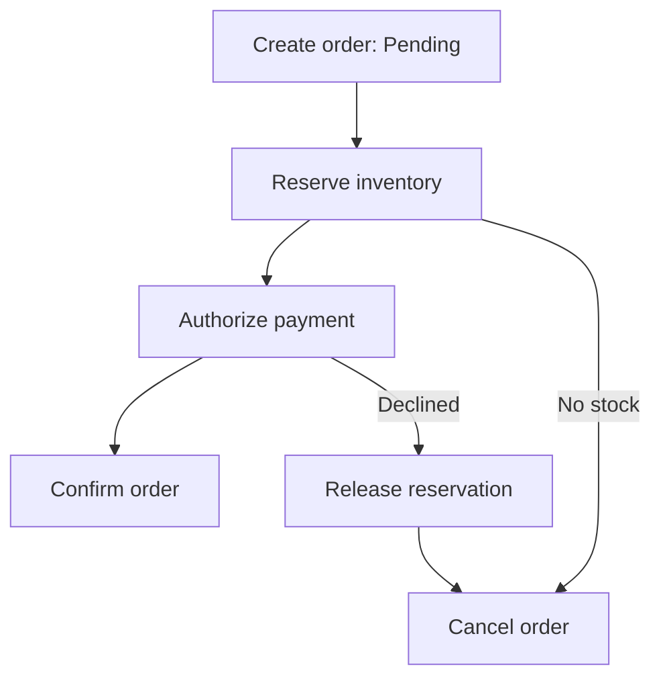
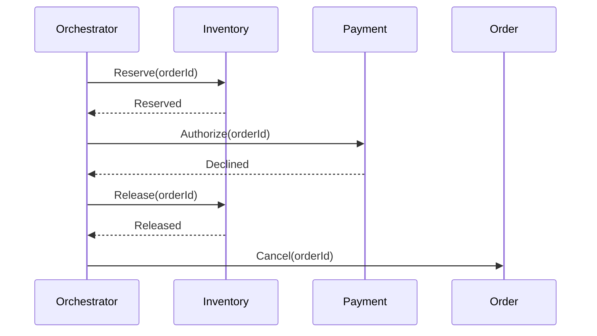

## Design a Distributed Transaction Across Microservices

A business transaction such as placing an order can span Order, Inventory, Payment, and Shipping services. Each service owns its database, so a normal database transaction cannot atomically commit all of them. A **Saga** coordinates a sequence of local transactions and, when necessary, runs business compensations to reach a valid final state. The system is eventually consistent during the workflow. [Microsoft Saga pattern](https://learn.microsoft.com/en-us/azure/architecture/patterns/saga)

## 1. Start by Clarifying the Business Rules

Before choosing orchestration or choreography, ask:

- Which services own which data, and what must be completed before the user sees success?
- Can we reserve inventory and authorize payment before committing a sale?
- Which steps are reversible, and which create an irreversible external effect?
- What is the maximum acceptable time in `Pending`? What should happen on timeout?
- Can commands be delivered more than once? What read consistency does the client need?
- Is the workflow short and stable, or does it have branches, deadlines, and manual review?

A distributed workflow should expose an honest status such as `Pending`, `Confirmed`, `CancellationPending`, or `Cancelled`. Do not claim that an order is final while downstream steps may still fail.

## 2. Example Order Saga

Assume the business requires available stock and a successful payment authorization before confirming an order.

The successful path is `CreateOrder → ReserveInventory → AuthorizePayment → ConfirmOrder`. A payment decline after reservation runs `ReleaseInventory → CancelOrder`. If payment authorization succeeds but confirmation later fails permanently, void the authorization if possible and release the reservation. Capture money and arrange shipment only at a stage where their failure and reversal policies are explicitly designed. The exact order of steps follows business risk, not a universal Saga rule.

## 3. Why Not Simply Use One Distributed ACID Transaction?

A local ACID transaction works inside one database. Two-phase commit across independent services introduces coordinated availability and operational complexity, and many messaging, cloud, and external payment participants cannot join it. A Saga makes each service commit locally, then coordinates later actions or compensation. It does **not** provide automatic rollback or full ACID isolation across services. If strict atomicity is truly required, reconsider the service boundary or put the invariant within one transactional owner. [Microsoft Saga pattern](https://learn.microsoft.com/en-us/azure/architecture/patterns/saga) · [AWS Saga patterns](https://docs.aws.amazon.com/prescriptive-guidance/latest/cloud-design-patterns/saga-patterns.html)

## 4. Saga Orchestration

An orchestrator owns the workflow state and issues commands to participants. It records the outcome of each step and chooses the next step, retry, timeout, or compensation. Services still own their data and business operation implementation.

Persist the state machine, for example `Started → InventoryReserved → PaymentAuthorized → Completed`, with failure branches such as `PaymentDeclined → ReleasingInventory → Cancelled`. Commands and replies carry `sagaId`, `orderId`, `stepId`, and correlation ID. The orchestrator must recover after a crash and resume unfinished work from durable state.

**Advantages:** one place to inspect the workflow, explicit branches and deadlines, simpler compensation coordination for long processes. **Costs:** an additional service/workflow engine, potential coupling to participant contracts, and a critical component that must be durable and scalable. A single orchestrator instance is not required: multiple workers can process different saga instances safely. [AWS Saga orchestration](https://docs.aws.amazon.com/prescriptive-guidance/latest/cloud-design-patterns/saga-orchestration.html)

## 5. Saga Choreography

There is no central workflow controller. Each service publishes events and reacts to events from others:

1. Order publishes `OrderCreated`.
2. Inventory handles it and publishes `InventoryReserved` or `InventoryReservationFailed`.
3. Payment handles `InventoryReserved` and publishes `PaymentAuthorized` or `PaymentDeclined`.
4. Order handles the outcome; Inventory handles a cancellation/compensation event when needed.

**Advantages:** fewer central workflow components and natural event-driven integration for short, simple flows. **Costs:** business control flow is spread across services, cycles can emerge, and timeouts, global visibility, and change coordination become harder as branches grow. Give one service explicit ownership of the overall business outcome even in a choreographed flow. [AWS Saga choreography](https://docs.aws.amazon.com/prescriptive-guidance/latest/cloud-design-patterns/saga-choreography.html) · [Microsoft choreography pattern](https://learn.microsoft.com/en-us/azure/architecture/patterns/choreography)

## 6. Which Would I Choose?

For an order/payment/inventory/shipping workflow with conditional paths, timeouts, compensations, and manual intervention, **I would choose orchestration**. The state machine makes the business policy and recovery visible. I would use choreography for a small, stable flow with few steps and independent event reactions, especially when there is little central decision-making.

| Decision factor | Prefer orchestration when… | Prefer choreography when… |
| --- | --- | --- |
| Process complexity | Many branches, deadlines, and compensations | Few predictable steps |
| Visibility | One end-to-end status and audit trail are needed | Distributed traces and service events suffice |
| Ownership | One domain owns the overall process | Participants respond independently to facts |
| Change | Workflow rules change together | Services evolve with loose event contracts |

This is a design judgment, not a property of Kafka, RabbitMQ, or Azure Service Bus. Any of those brokers can carry Saga messages; durability, idempotency, and state management remain application responsibilities.

## 7. How Compensation Works

A compensation is a **new business operation** that semantically reverses or mitigates an earlier completed step. It is not a database rollback across services. For instance, `ReleaseReservation` cancels a held quantity; `VoidAuthorization` releases an uncaptured card authorization; `RefundPayment` creates a separate financial transaction after capture. A refund is not the same as erasing the original charge.

| Forward action | Possible compensation | Important condition |
| --- | --- | --- |
| Create pending order | Mark order cancelled | Keep audit history |
| Reserve stock | Release reservation | Only if it still exists and is not already consumed |
| Authorize payment | Void authorization | Provider state may be uncertain; query/reconcile first |
| Capture payment | Issue refund | Refund can fail or take time |
| Create shipping label | Cancel label | Carrier may not permit cancellation after dispatch |
| Send notification | Send correction | Original message cannot be unsent |

Design forward and compensating operations together. Compensation generally proceeds in reverse dependency order, but business rules may dictate a different sequence. Persist each compensation state, retry transient failures, and escalate irrecoverable outcomes to an operations/manual-review queue. Make compensations idempotent: `ReleaseReservation(orderId)` called twice must not add stock twice. [Microsoft Saga pattern](https://learn.microsoft.com/en-us/azure/architecture/patterns/saga) · [Microsoft compensating transaction pattern](https://learn.microsoft.com/en-us/azure/architecture/patterns/compensating-transaction)

## 8. Handling the Point of No Return

Classify steps as **compensable**, **pivot/commit decision**, or **retryable to completion**. Prefer reversible reservations and authorizations before the pivot. After an irreversible step, the workflow may need to keep retrying toward a valid final state or execute a business remedy, such as a refund or support case. It cannot promise perfect restoration to the original state. For example, an already shipped package cannot be “unshipped”; arrange a return process. [Microsoft Saga pattern](https://learn.microsoft.com/en-us/azure/architecture/patterns/saga)

## 9. Reliability: Outbox, Inbox, Idempotency, and Timeouts

**Outbox:** Save a local state change and its outbound message in the same database transaction. A publisher later sends the message. This closes the gap where the database commits but publishing fails, although a crash may cause duplicate publishes. [AWS transactional outbox](https://docs.aws.amazon.com/prescriptive-guidance/latest/cloud-design-patterns/transactional-outbox.html)

**Inbox/idempotency:** Each participant records a unique command/event ID with its local state update, then acknowledges the message. Repeated commands return the prior outcome. Use stable idempotency keys with payment providers. Acknowledgement loss or consumer restart must not reserve stock or charge a card twice.

**Timeouts and unknown results:** A payment API timeout does not prove that authorization failed. Query the provider using a stable operation ID before retrying or compensating. Model `Unknown` or `PendingVerification` and reconcile asynchronously. Persist deadlines so an orchestrator restart does not lose them.

**Concurrency:** Two Sagas may compete for the last item. Inventory must enforce its own atomic reservation invariant using its database transaction, conditional update, or concurrency control. Saga coordination alone does not isolate concurrent workflows. [AWS Saga choreography considerations](https://docs.aws.amazon.com/prescriptive-guidance/latest/cloud-design-patterns/saga-choreography.html)

## 10. Failure Walkthroughs

**Inventory says no stock:** Cancel the pending order. No payment command should be issued.

**Payment declines after stock is reserved:** Record the decline, release the reservation, then cancel. If release is temporarily unavailable, remain in `CancellationPending` and retry; do not mark fully cancelled prematurely.

**Payment call times out:** Query/reconcile payment status with the same idempotency key. Do not issue a fresh charge with a new key. If authorized, continue or void according to the workflow state.

**Orchestrator crashes after sending a command:** On restart, durable state may show the command as pending. Resend with the same `stepId` and idempotency key; the participant returns its recorded result.

**Compensation fails:** Keep durable `CompensationPending` state, retry transient failures with backoff, alert on age/attempt thresholds, and route persistent exceptions for manual intervention.

**Message arrives out of order or twice:** Use per-aggregate sequence/version and valid state transitions. Discard already applied steps; park or retry messages whose prerequisites have not completed. Ordering keys/sessions help, but do not replace state validation.

## 11. Observability and Testing

Track `sagaId`, `orderId`, command/event IDs, step names, current state, attempts, deadline, and last error. Monitor stuck Sagas, time in `Pending`, compensation age/failures, duplicate detections, outbox backlog, consumer lag, and payment reconciliation differences. Trace each command and response across services without logging card data or secrets.

Test success, business rejection, timeouts, duplicate delivery, crash after local commit, crash before acknowledgement, failure of a compensation, and concurrent orders for the same stock. Verify both user-visible status and financial/inventory invariants after recovery.

## 12. Two-Minute Interview Answer

> For an order spanning Order, Inventory, and Payment databases, I would use a Saga rather than assume one ACID transaction across services. I would first create a pending order, reserve inventory, authorize payment, and confirm the order. For a workflow with branches and deadlines, I would choose orchestration: a durable coordinator records each step, sends commands, handles replies and timeouts, and starts compensations when needed. If payment declines after stock reservation, it releases the reservation and cancels the order. Compensation is a separate business action, not an automatic rollback; if payment was captured, it may require a refund, and if an item shipped, it may require a return. Every service performs its own local transaction and uses an outbox for messages and idempotent handlers for duplicates. I would give payment calls stable idempotency keys, reconcile ambiguous timeouts, and keep failed compensations visible for retry or manual resolution. I would use choreography for a shorter, stable event flow where central workflow decisions are minimal.

## 13. Common Interview Follow-Ups

**Does a Saga guarantee atomicity?** It coordinates eventual consistency and recovery; intermediate states can be visible, and some effects cannot be undone exactly.

**Who owns compensation?** The service that owns the data implements the business action; the orchestrator requests it, or a choreographed participant reacts to a failure event.

**Can a DLQ replace compensation logic?** No. A DLQ holds failed messages for investigation. The Saga still needs explicit state and a recovery decision.

**Should an orchestrator share databases with participants?** No. It stores workflow state and communicates through commands/replies; each participant owns its own data and invariants.

**How does the client know the final result?** Return an order ID and pending status, expose a status endpoint and optionally notifications. The status should reflect durable Saga state.

## 14. Mistakes to Avoid

- Calling compensation a perfect rollback or deleting the audit trail.
- Capturing payment or shipping before defining failure and refund/return policies.
- Treating a timeout as proof that an external operation did not happen.
- Marking a Saga cancelled while its compensation is still failing.
- Publishing messages separately from local state without addressing the dual-write gap.
- Assuming broker ordering or exactly-once delivery replaces idempotency.
- Introducing a central orchestrator without durable state and recovery behavior.

## Orchestration vs. Choreography

 Orchestration: A central coordinator (the orchestrator) tells each microservice what local transaction to execute and when.

- Pros: Clear transaction visibility, easy debugging, central place for error handling.
- Cons: The orchestrator can become a single point of failure or tight coupling bottleneck if not managed well

Choreography: Services listen to domain events via a message broker and react independently without a central brain.

- Pros: Highly decoupled, easy to scale for simple event-driven paths.
- Cons: Harder to trace, debug, and manage as business logic grows complex.

**How Compensation Works**

Unlike a standard database rollback that locks and reverts rows instantly, a Saga relies on eventual consistency through explicit compensating actions.

- Forward Steps: Each service performs a local transaction and commits data to its own database.
- Failure Trigger: If a step fails (e.g., the payment service fails), the orchestrator initiates rollback.
- Reverse Execution: The orchestrator triggers compensating transactions in reverse order of the successful steps.
- Semantic Reversal: Compensations are new business actions that undo previous effects (e.g., refunding money, releasing reserved stock).
- Idempotency: Every local transaction and compensation must be idempotent (safe to run multiple times) in case network retries trigger duplicate messages

