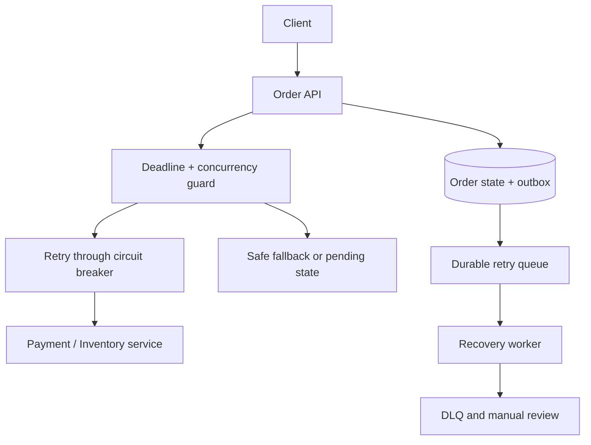

## Design a System That Survives Downstream-Service Failures

A resilient system limits how long it waits for a dependency, retries only when useful and safe, stops calling a persistently failing dependency, and chooses an explicit degraded behavior. If durable asynchronous work cannot complete after bounded attempts, it moves to a dead-letter queue (DLQ) with an owner and recovery process. The familiar sequence **timeout → retry with backoff/jitter → circuit breaker → fallback → DLQ/manual recovery** is a useful explanation, but these controls cooperate rather than always running as one literal pipeline: a synchronous HTTP call does not automatically have a DLQ, and some failures must fail immediately without retry. [Microsoft transient-fault guidance](https://learn.microsoft.com/en-us/azure/well-architected/design-guides/handle-transient-faults) · [Microsoft Circuit Breaker pattern](https://learn.microsoft.com/en-us/azure/architecture/patterns/circuit-breaker)

## 1. Start With Requirements and Failure Policy

Ask which downstream services are critical, their latency and availability targets, whether operations are read-only or have side effects, whether stale data is acceptable, and what user-visible result is valid if a dependency is unavailable. Clarify end-to-end request deadline, expected peak concurrency, rate limits, and whether the workflow can continue asynchronously.

**Example:** An Order API calls Catalog for a product description, Inventory for a reservation, and Payment for authorization. It may use a cached product description if Catalog is unavailable. It cannot honestly confirm an order if payment outcome is unknown. In that case it records `PaymentPendingVerification` and reconciles, or returns a pending response. Different dependencies need different resilience policies.

## 2. Reference Architecture



Keep the synchronous critical path short. For a workflow that may take minutes, persist its state and continue from a queue rather than holding an HTTP request open. Use correlation and idempotency IDs from the client through the API, queue, worker, and provider. The queue is a durable continuation for explicitly asynchronous work, not a substitute for telling the client the true order state.

## 3. Timeouts and End-to-End Deadlines

Set an **overall request deadline** and **per-attempt timeout**. If the API has a 3-second end-to-end budget, three 2-second calls plus backoffs cannot fit; downstream attempts must use the remaining budget. Pass cancellation/deadline information to HTTP clients, database calls, and workers where supported. A timeout is a local statement that the caller stopped waiting; it does **not** prove the downstream operation failed. [Microsoft transient-fault guidance](https://learn.microsoft.com/en-us/azure/well-architected/design-guides/handle-transient-faults)

| Operation | Illustrative policy | Why |
| --- | --- | --- |
| Catalog read | Short attempt timeout; maybe one retry | Stale cached data may be acceptable |
| Inventory reserve | Deadline and idempotency key; query state after uncertain timeout | Avoid reserving twice |
| Payment authorize | Stable provider operation ID; reconcile uncertain response | A second independent charge is unacceptable |
| Email notification | Async queue and longer retry horizon | Not on order-confirmation critical path |

Tune actual values using observed p95/p99 latency and the user's response SLO, not arbitrary universal defaults.

## 4. Retry With Backoff and Jitter

Retry **transient** failures such as connection resets, 503, and eligible 429 responses. Use a small maximum attempt count for interactive calls and respect `Retry-After` where provided. For background jobs, schedule delayed retries using exponential backoff and jitter, for example a randomized delay bounded by a maximum. Jitter spreads clients out so they do not all retry on the same second. [Microsoft retry guidance](https://learn.microsoft.com/en-us/azure/well-architected/design-guides/handle-transient-faults)

Do **not** retry malformed requests, 401/403, most validation 4xx, or a business decline. Do not automatically retry POST/payment calls unless the downstream operation supports a stable idempotency key or a safe status lookup. A timed-out payment may have succeeded. Also check SDK, gateway, service-mesh, and application retries together: 3 retries at each of 3 layers can multiply load sharply. Choose one layer to own each retry budget and observe total attempts. [Microsoft Retry Storm antipattern](https://learn.microsoft.com/en-us/azure/architecture/antipatterns/retry-storm/)

## 5. Circuit Breaker

A circuit breaker tracks recent failures for a dependency or endpoint:

| State | Behavior |
| --- | --- |
| Closed | Calls proceed; failures count toward a threshold |
| Open | Calls fail fast or take an approved fallback for a cool-down period |
| Half-open | Allow a limited number of probes; close on recovery or reopen on failure |

Scope breakers by dependency/endpoint and often by region or provider route; one broken payment provider should not open the Catalog circuit. Choose failure thresholds, sampling window, minimum throughput, break duration, and half-open concurrency based on traffic. Treat expected business outcomes such as “card declined” as valid responses, not dependency failures. The breaker protects both the failing service and your own thread/connection pool. It does not repair the dependency. [Microsoft Circuit Breaker pattern](https://learn.microsoft.com/en-us/azure/architecture/patterns/circuit-breaker)

The implementation order matters. A common resilience pipeline has an overall timeout and concurrency guard outside a bounded retry, with circuit breaker and attempt timeout applied to downstream attempts. Microsoft’s standard HTTP resilience options describe a bulkhead, total request timeout, retry, circuit breaker, and attempt timeout chain. Verify configured behavior rather than assuming the human-readable arrow sequence represents middleware nesting. [Microsoft .NET HTTP resilience options](https://learn.microsoft.com/en-us/dotnet/api/microsoft.extensions.http.resilience.httpstandardresilienceoptions?view=net-9.0-pp)

## 6. Fallback and Graceful Degradation

A fallback must be **business-correct and visible**:

| Dependency unavailable | Possible fallback | Invalid fallback |
| --- | --- | --- |
| Recommendation service | Omit recommendations or show cached list | Block checkout |
| Product description | Serve bounded stale description with indication if needed | Serve stale price for a binding purchase without policy |
| Notification provider | Queue notification and show core operation succeeded | Claim notification delivered |
| Inventory service | Put order in pending state or reject temporarily | Claim stock reserved without confirmation |
| Payment provider | Record unknown/pending and reconcile; possibly offer alternate approved provider | Mark payment successful or immediately charge again with a new key |

For a read-only operation, stale-while-revalidate may be appropriate with a defined maximum age. For money, inventory, authorization, and compliance, fail closed or persist a pending state until authoritative confirmation. A fallback should not silently violate the contract.

## 7. Queue, DLQ, and Manual Recovery

For asynchronous work, persist the business state and publish a job reliably, preferably via a transactional outbox when the DB and broker are separate. Workers retry transient failures with delayed scheduling and bounded attempts/age. Invalid input or exhausted work goes to a **DLQ** with message ID, business ID, failure reason, attempt count, original event version, and correlation ID. Azure Service Bus queues/subscriptions have DLQ subqueues and can move messages there after `MaxDeliveryCount`. [Service Bus DLQs](https://learn.microsoft.com/en-us/azure/service-bus-messaging/service-bus-dead-letter-queues)

The recovery process is: alert on DLQ age/count → inspect root cause and external state → fix configuration/data/code → decide whether retry is still valid → replay with the **same business/idempotency identity** or perform manual compensation → record the outcome. Do not replay a payment authorization blindly after a timeout, and do not let a DLQ become a silent graveyard. A synchronous failed request should return a truthful response or durable pending job; it does not “go to the DLQ” unless the application explicitly created queued work.

## 8. Idempotency and Unknown Outcomes

Every retryable side effect should carry a stable operation ID, such as `orderId + paymentAttemptId`. The downstream service stores that ID behind a unique constraint or uses a provider idempotency API. If a call times out after the downstream commit, the next attempt returns the previous outcome rather than executing again. For external providers, query status/reconcile using their reference when the response is ambiguous. An outbox/inbox can protect local DB and message boundaries, but does not make a third-party API call atomic with your DB.

Use explicit state transitions: `Pending → Authorizing → Authorized` or `PendingVerification`, followed by reconciliation. Avoid a generic catch block that maps every exception to `Failed` when the external side effect might have succeeded.

## 9. Bulkheads and Backpressure

A circuit breaker opens after observing failure; a **concurrency limiter/bulkhead** prevents a slow dependency from consuming every connection or worker before that happens. Allocate separate budgets for critical and optional dependencies. Bound request queues and thread/connection pools. If the capacity limit is reached, reject or degrade quickly; allowing requests to wait indefinitely creates timeout cascades. Rate limits at the gateway and producer-side load control further reduce overload. [Microsoft throttling design](https://learn.microsoft.com/en-us/azure/well-architected/design-guides/throttling)

## 10. Walk Through a Payment Outage

1. Order API creates `Order(Pending)` and a stable payment operation ID.
2. Payment call has a per-attempt timeout within the overall request deadline.
3. A transient 503 triggers a bounded retry with jitter. A timeout with uncertain outcome triggers provider status lookup rather than an unrelated charge.
4. If failures persist, the breaker opens. New requests fail fast into `PaymentPending` or a clear temporary-unavailable response according to product rules.
5. A durable recovery worker retries/reconciles when the dependency returns. A genuine decline cancels the order; a confirmed authorization advances it.
6. After the allowed recovery window, unresolved cases enter a DLQ/manual review queue with full references. Operators reconcile provider records before replay or compensation.
7. As the provider recovers, half-open probes test it gradually; the breaker closes only after successful evidence.

This design preserves a truthful status and avoids duplicate charges. It may reduce immediate checkout success during the outage, which is the correct tradeoff when payment confirmation is required.

## 11. .NET Implementation Sketch

For outbound HTTP calls in a .NET service, `Microsoft.Extensions.Http.Resilience` provides standard resilience handlers. The example is illustrative; configure retry predicates and budgets for each operation, especially unsafe methods.

```csharp
builder.Services.AddHttpClient("catalog", client =>
{
    client.BaseAddress = new Uri(builder.Configuration["Catalog:BaseUrl"]!);
})
.AddStandardResilienceHandler(options =>
{
    options.TotalRequestTimeout.Timeout = TimeSpan.FromSeconds(3);
    options.AttemptTimeout.Timeout = TimeSpan.FromSeconds(1);
    options.Retry.MaxRetryAttempts = 2;
    options.Retry.Delay = TimeSpan.FromMilliseconds(200);
    options.Retry.UseJitter = true;
});
```

Use this kind of automatic retry for an eligible read such as Catalog. Configure a separate named client/pipeline for Payment with an idempotency key, stricter retry predicate, and reconciliation path. The resilience library does not know your business definition of “safe to repeat.” [Microsoft .NET HTTP resilience options](https://learn.microsoft.com/en-us/dotnet/api/microsoft.extensions.http.resilience.httpstandardresilienceoptions?view=net-9.0-pp)

## 12. Observability and Fault Testing

Measure downstream latency p95/p99, timeout count, retry attempts per original request, breaker open/half-open time, fallback use, bulkhead rejection, queue oldest age, DLQ oldest age, and manual recovery time. Trace `orderId`, operation ID, and correlation ID across HTTP and messages without logging secrets. Distinguish provider business declines from transport failures in metrics.

Inject faults: high latency, 503 bursts, 429 with `Retry-After`, connection resets, partial outage, successful side effect with lost response, broker outage, poison messages, and provider recovery. Verify the overall request deadline, retry count, no duplicate side effect, truthful status, safe fallback, and operator runbook. [Microsoft reliability testing guidance](https://learn.microsoft.com/en-us/azure/well-architected/reliability/reliability-test)

## 13. Two-Minute Interview Answer

> I would classify each downstream dependency by criticality and define an overall request deadline. Every call gets a shorter per-attempt timeout. Transient failures may receive a small bounded retry with backoff and jitter, while validation failures and business declines do not. I would put a circuit breaker around a failing dependency so repeated requests fail fast, and a concurrency limit prevents slow calls from exhausting the service before the breaker opens. The fallback must be business-correct: a stale product description may be acceptable, but a payment timeout means unknown, not success or failure. For long recovery, I would persist a pending state and queue work reliably with stable idempotency IDs. After bounded retries, poison or unresolved messages go to a monitored DLQ and an operator reconciles external state before replaying. I would test lost responses after successful downstream commits, retry storms, breaker recovery, and DLQ handling, and monitor the actual end-to-end error and latency budget.

## 14. Common Interview Follow-Ups

**Should every timeout be retried?** No. The downstream may have completed the side effect. Retry only when safe or under a stable idempotency key, often after status reconciliation.

**What is the difference between retry and circuit breaker?** Retry handles a likely transient failure for one operation; a breaker stops repeated calls to a dependency that is currently likely to fail.

**What if the breaker is open but the dependency recovered?** After a cool-down, allow limited half-open probes and close only on sufficient success.

**Can a fallback hide an outage?** Yes, if it returns misleading success or is not monitored. Record fallback use and expose degraded status where relevant.

**Does a DLQ solve failures?** No. It retains failed asynchronous work for diagnosis; an owner and replay/compensation process must resolve it.

**How do you avoid retry multiplication?** Set an end-to-end deadline and one effective retry budget across SDK, gateway, app, and worker layers; inspect built-in SDK retries.

## 15. Mistakes to Avoid

- Treating a timeout as proof that payment or inventory did not commit.
- Retrying 400/401/403 or a genuine business decline.
- Adding retries independently at every layer and amplifying an outage.
- Serving stale security/payment state as a generic fallback.
- Letting a breaker or retry queue substitute for idempotency.
- Calling a synchronous HTTP failure a DLQ event without durable queued work.
- Ignoring half-open behavior, bulkheads, and retry age limits.
- Leaving DLQ messages without alerting, ownership, and a replay runbook.

## 16. Primary References

- [Microsoft: Handling transient faults](https://learn.microsoft.com/en-us/azure/well-architected/design-guides/handle-transient-faults)
- [Microsoft: Circuit Breaker pattern](https://learn.microsoft.com/en-us/azure/architecture/patterns/circuit-breaker)
- [Microsoft: Retry Storm antipattern](https://learn.microsoft.com/en-us/azure/architecture/antipatterns/retry-storm/)
- [Microsoft: Azure Service Bus DLQs](https://learn.microsoft.com/en-us/azure/service-bus-messaging/service-bus-dead-letter-queues)
- [Microsoft: .NET HTTP resilience options](https://learn.microsoft.com/en-us/dotnet/api/microsoft.extensions.http.resilience.httpstandardresilienceoptions?view=net-9.0-pp)
