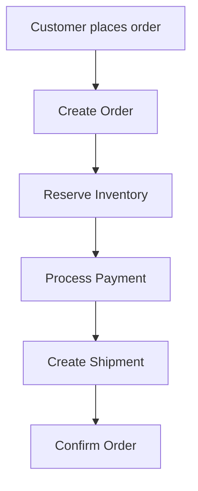
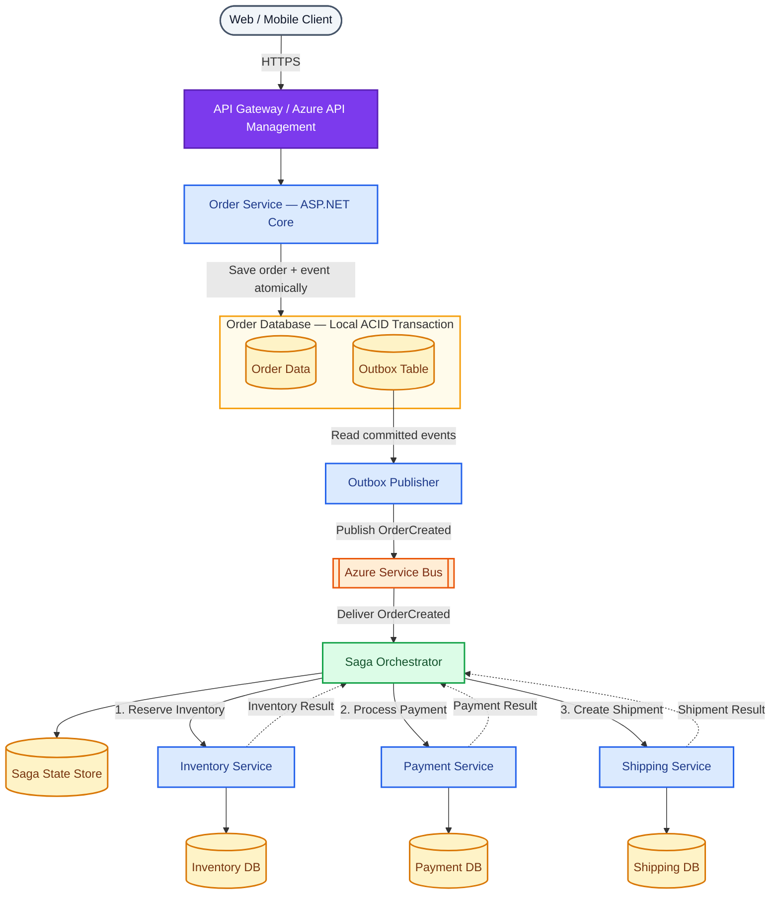
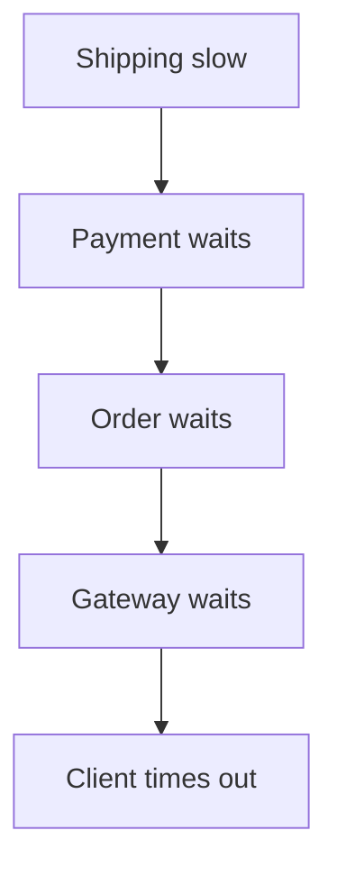
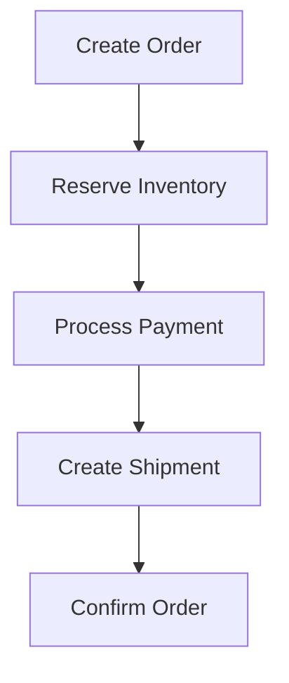
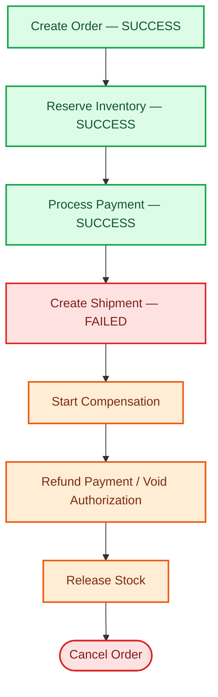
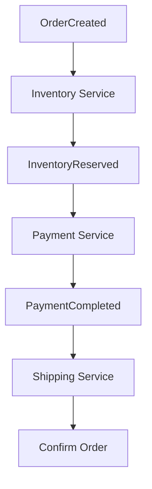
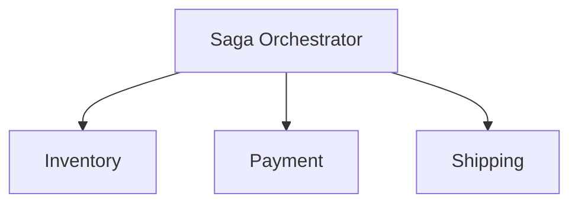

# E-Commerce / Order Management System --- Microservices System Design

## # E-Commerce / Order Management System --- Microservices System Design

> **Interview Scenario:** Design an E-commerce / Order Management
> System. How would you design **Order → Inventory → Payment →
> Shipping**? What happens when **Payment succeeds but Shipping fails**?
>
> **Target:** Experienced .NET Developer / Technical Lead / Solution
> Architect interviews\
> **Reference stack:** ASP.NET Core, Azure API Management, Azure Service
> Bus, Azure SQL/PostgreSQL, Redis, Managed Identity, Azure Key Vault,
> OpenTelemetry/Application Insights, Docker, AKS

------------------------------------------------------------------------

## 1. What is the interviewer testing?

This is not only a question about drawing four services. The interviewer
usually wants to see whether you understand service boundaries, database
ownership, synchronous vs asynchronous communication, distributed
transactions, Saga orchestration, eventual consistency, compensation,
payment idempotency, Outbox/Inbox, duplicate messages, retry/DLQ
handling, recovery, observability, scalability and security.

A senior-level answer should explain both the **happy path and failure
paths**.

------------------------------------------------------------------------

## 2. Business workflow

<!-- ``` text
Customer places order
        |
        v
Create Order
        |
        v
Reserve Inventory
        |
        v
Process Payment
        |
        v
Create Shipment
        |
        v
Confirm Order
``` -->


Each capability owns its own data:

``` text
Order Service      -> Order Database
Inventory Service  -> Inventory Database
Payment Service    -> Payment Database
Shipping Service   -> Shipping Database
```

A normal local ACID transaction cannot safely span all four
independently owned stores and external payment/shipping providers. This
is a **distributed business transaction**.

------------------------------------------------------------------------

## 3. High-Level Architecture

<!-- ``` text
                         +----------------------+
                         | Web / Mobile Client  |
                         +----------+-----------+
                                    |
                                  HTTPS
                                    |
                                    v
                         +----------------------+
                         | API Gateway / APIM   |
                         +----------+-----------+
                                    |
                                    v
                         +----------------------+
                         |    Order Service     |
                         |    ASP.NET Core      |
                         +----------+-----------+
                                    |
                         Local DB Transaction
                                    |
                    +---------------+---------------+
                    |                               |
                    v                               v
                Order DB                       Outbox Table
                                                    |
                                                    v
                                      +-------------------------+
                                      |   Azure Service Bus     |
                                      +------------+------------+
                                                   |
                                                   v
                                      +-------------------------+
                                      |   Saga Orchestrator     |
                                      +------------+------------+
                                                   |
                       +---------------------------+---------------------------+
                       |                           |                           |
                       v                           v                           v
              +----------------+          +----------------+          +----------------+
              | Inventory Svc  |          | Payment Svc    |          | Shipping Svc   |
              +-------+--------+          +-------+--------+          +-------+--------+
                      |                           |                           |
                      v                           v                           v
                Inventory DB                 Payment DB                  Shipping DB
``` -->



Cross-cutting platform:

``` text
Azure Entra ID / Identity Provider
Managed Identity / Workload Identity
Azure Key Vault
Redis
OpenTelemetry
Application Insights / Azure Monitor
AKS
Azure Container Registry
CI/CD
```

------------------------------------------------------------------------

## 4. Service responsibilities

### Order Service

Owns Order, Order Lines, Order Status, total, customer references and
order lifecycle. It never directly modifies Inventory, Payment or
Shipping tables.

### Inventory Service

Owns stock, reservations, reservation expiration and allocation. Its key
responsibility is deciding whether requested stock can be reserved.

### Payment Service

Owns payment transactions, authorization, capture, void/refund, provider
references, idempotency records and payment state.

### Shipping Service

Owns shipments, packages, carrier integration, delivery address,
tracking and shipping lifecycle.

The principle is:

> A service owns its schema and business invariants. Other services
> interact through published APIs, commands or events.

------------------------------------------------------------------------

## 5. Why not one long synchronous HTTP chain?

A naive design is:


If Shipping becomes slow:



This creates strong temporal coupling and difficult partial failures.

For a durable order workflow, I would normally use an **asynchronous
Saga**. The initial order API can return:

``` http
202 Accepted
```

``` json
{
  "orderId": "ORD-1001",
  "status": "Processing"
}
```

The internal workflow then proceeds independently of the original HTTP
connection.

------------------------------------------------------------------------

## 6. Saga Pattern

A Saga models the transaction as local transactions:



If a later step fails, perform compensating business operations.



------------------------------------------------------------------------

## 7. Choreography vs Orchestration

### Choreography



This is suitable for relatively simple event reactions, but complex
workflows can become difficult to visualize, recover and compensate.

### Orchestration

For Order → Inventory → Payment → Shipping, I generally prefer a durable
orchestrator:



It sends commands, processes results, stores workflow state and controls
compensation. It coordinates the workflow but does **not** own each
service's domain rules.

||  |


------------------------------------------------------------------------

## 8. Complete happy path

Assume:

``` text
Order ID = ORD-1001
Saga ID  = SAGA-5001
```

### Step 1 --- Create Order

``` http
POST /api/orders
```

Order Service performs one local transaction:

``` text
BEGIN

INSERT Order (Status = Pending)
INSERT OutboxMessage (OrderCreated)

COMMIT
```

The Outbox publisher later sends `OrderCreated`.

### Step 2 --- Start Saga

The Saga persists:

``` text
SagaId       SAGA-5001
OrderId      ORD-1001
State        InventoryPending
```

### Step 3 --- Reserve Inventory

The Saga sends `ReserveInventory`.

Inventory Service:

``` text
BEGIN
Check Inbox MessageId
Validate available stock
Create reservation
Insert Inbox record
Insert InventoryReserved into Outbox
COMMIT
```

### Step 4 --- Process Payment

After `InventoryReserved`, the Saga sends `ProcessPayment`.

Payment Service receives an idempotency key such as:

``` text
ORD-1001-PAYMENT-1
```

It processes the payment and atomically stores its state plus a
`PaymentCompleted` Outbox event.

### Step 5 --- Create Shipment

Saga receives `PaymentCompleted` and sends `CreateShipment`.

Shipping Service creates the shipment and publishes `ShipmentCreated`.

### Step 6 --- Confirm Order

Saga processes `ShipmentCreated`, updates the Order to `Confirmed`, and
completes.

``` text
Order Created
      |
Inventory Reserved
      |
Payment Completed
      |
Shipment Created
      |
Order Confirmed
```

------------------------------------------------------------------------

## 9. Why reserve inventory?

Do not immediately make temporary checkout stock consumption
irreversible.

Example:

``` text
Available = 10
Order A reserves 2
Order B reserves 3
Sellable remainder = 5
```

If Order A fails:

``` text
Release reservation = 2
```

Reservations can also expire if checkout/payment never completes.

This makes compensation manageable and reduces overselling.

------------------------------------------------------------------------

## 10. Critical scenario: Payment succeeds but Shipping fails

Assume:

``` text
Order              SUCCESS
Inventory Reserve  SUCCESS
Payment             SUCCESS
Shipping            FAILED
```

You cannot execute one SQL `ROLLBACK` because Payment already committed
and an external payment provider may already have charged the customer.

First classify the shipping failure.

### Transient Shipping failure

Examples:

``` text
Carrier API timeout
Temporary HTTP 503
Short network outage
```

Do **not** automatically refund the customer after the first technical
failure.

A reasonable business state is:

``` text
OrderStatus    = Processing
ShippingStatus = Pending
```

Retry shipment creation using a bounded policy with exponential backoff
and jitter.

### Permanent Shipping failure

Examples:

``` text
Unsupported delivery address
No carrier supports the destination
Permanent fulfillment/business-rule rejection
```

Now execute compensation:

``` text
Shipping Failed
      |
      v
Refund / Void Payment
      |
      v
Release Inventory
      |
      v
Cancel Order
```

The exact policy is a business decision. A technical timeout and a
permanent inability to fulfill the order should not be treated
identically.

------------------------------------------------------------------------

## 11. Compensation is not database rollback

This is an important interview statement.

A database rollback makes an uncommitted transaction disappear.

A Saga compensation is a **new business transaction** that offsets a
previously committed transaction.

Example:

``` text
Original:
₹5,000 Charge

Compensation:
₹5,000 Refund
```

Both transactions remain for audit and reconciliation.

Therefore say:

> Payment Service performs a void/refund compensation.

Avoid:

> We rollback the payment.

------------------------------------------------------------------------

## 12. Void vs Refund

If payment is only authorized:

``` text
Authorize -> Void
```

If payment has already been captured:

``` text
Capture -> Refund
```

The Saga should request compensation, but **Payment Service owns the
provider-specific rule** for whether to void or refund.

------------------------------------------------------------------------

## 13. What if Refund fails?

This is an important senior-level follow-up.

``` text
Shipping Failed
      |
Refund Payment
      |
      X Provider unavailable
```

Persist an explicit state:

``` text
PaymentRefundPending
```

Then:

-   Retry safely
-   Reconcile with the payment provider
-   Alert operations after thresholds
-   Route unrecoverable processing to an exception/DLQ workflow
-   Provide controlled manual recovery

Never silently mark the order fully cancelled while money remains
captured.

------------------------------------------------------------------------

## 14. Saga state machine

``` text
Created
   |
InventoryPending
   |
   +-- rejected --> Cancelled
   |
InventoryReserved
   |
PaymentPending
   |
   +-- failed --> InventoryReleasePending
   |
PaymentCompleted
   |
ShippingPending
   |
   +-- transient --> ShippingRetryPending
   |
   +-- permanent --> PaymentCompensationPending
   |
ShipmentCreated
   |
Completed
```

Compensation:

``` text
PaymentCompensationPending
        |
PaymentRefunded
        |
InventoryReleasePending
        |
InventoryReleased
        |
Cancelled
```

Persist state such as:

``` text
SagaId
OrderId
CurrentState
InventoryReservationId
PaymentId
ShipmentId
RetryCount
LastError
CreatedAt
UpdatedAt
Version
```

This allows recovery after pod restarts, deployments and crashes.

------------------------------------------------------------------------

## 15. Transactional Outbox --- solving the dual-write problem

Bad implementation:

``` csharp
await db.SaveChangesAsync();
await bus.PublishAsync(orderCreated);
```

Failure:

``` text
DB commit succeeds
Application crashes
Message is never published
```

Instead:

``` text
BEGIN DATABASE TRANSACTION

INSERT Order
INSERT OutboxMessage

COMMIT
```

A background publisher reads pending Outbox rows and publishes them to
Service Bus.

``` text
Order DB
+----------------+
| Orders         |
| OutboxMessages |
+-------+--------+
        |
 Outbox Publisher
        |
        v
 Azure Service Bus
```

------------------------------------------------------------------------

## 16. Inbox and duplicate handling

Outbox publication can still produce duplicates.

Example:

``` text
Publish succeeds
     |
Publisher crashes before marking row Published
     |
Same event is published again after restart
```

Therefore consumers must be idempotent.

Use an Inbox table:

``` text
MessageId
ConsumerName
ProcessedAt
```

Consumer transaction:

``` text
BEGIN

IF MessageId already processed
    ignore safely

Perform business change
Insert Inbox record
Insert resulting Outbox event

COMMIT
```

A unique constraint on `(MessageId, ConsumerName)` provides additional
concurrency protection.

------------------------------------------------------------------------

## 17. Payment idempotency

Payment commands need business-level idempotency.

``` http
Idempotency-Key: ORD-1001-PAYMENT-1
```

Persist:

``` text
IdempotencyKey
RequestHash
PaymentId
Status
Response
```

Use a unique constraint.

If the same request arrives again, return/reconcile the original result
instead of charging again.

If supported, pass an idempotency identifier to the external payment
provider too.

------------------------------------------------------------------------

## 18. Payment timeout does not mean payment failure

Suppose:

``` text
Payment Provider charged customer
       |
Response was lost
       |
Payment Service timed out
```

The outcome is **unknown**, not automatically failed.

Correct flow:

``` text
Timeout
   |
Use provider/merchant reference
   |
Query provider
   |
 +------+------+
 |             |
Succeeded     Failed
```

Do not immediately issue another charge.

------------------------------------------------------------------------

## 19. Retry, Circuit Breaker and DLQ

Retry only transient failures using bounded exponential backoff and
jitter.

Potentially retryable:

``` text
Network error
503
Transient database connectivity
Temporary broker throttling
```

Usually not blindly retryable:

``` text
Invalid card
Insufficient funds
Invalid address
Authentication failure
Business validation failure
```

Use a circuit breaker to stop repeatedly calling an unhealthy provider.

After bounded processing failures, move the message to a Dead-Letter
Queue.

DLQ handling must include:

``` text
Alert
Investigation
Controlled replay
Root-cause correction
```

A DLQ should not become a forgotten message store.

------------------------------------------------------------------------

## 20. Message ordering

Global ordering is usually unnecessary and limits parallelism.

Preserve ordering only where business state requires it, such as per
Order.

With Azure Service Bus, sessions can be used when appropriate:

``` text
SessionId = OrderId
```

Also use:

-   Aggregate versions
-   Sequence numbers
-   State-machine validation
-   Stale-transition rejection

------------------------------------------------------------------------

## 21. Commands vs Events

Commands ask for an action:

``` text
ReserveInventory
ProcessPayment
CreateShipment
RefundPayment
ReleaseInventory
```

Events describe facts that happened:

``` text
InventoryReserved
PaymentCompleted
ShipmentCreated
PaymentRefunded
InventoryReleased
```

This naming makes the workflow easier to reason about.

------------------------------------------------------------------------

## 22. Message metadata

Useful metadata:

``` json
{
  "messageId": "MSG-10001",
  "correlationId": "SAGA-5001",
  "causationId": "MSG-9999",
  "orderId": "ORD-1001",
  "messageType": "PaymentCompleted",
  "schemaVersion": 1,
  "occurredAt": "2026-09-26T12:00:00Z"
}
```

Distinguish:

``` text
MessageId     -> deduplication
CorrelationId -> complete workflow
CausationId   -> previous triggering message
OrderId       -> domain lookup
TraceId       -> technical distributed trace
```

------------------------------------------------------------------------

## 23. Other failure paths

### Inventory unavailable

``` text
Order Created
     |
Inventory Rejected
     |
Cancel Order
```

Payment is never attempted.

### Payment fails

``` text
Inventory Reserved
     |
Payment Failed
     |
Release Inventory
     |
Cancel Order
```

### Shipping request has unknown outcome

If a carrier created the shipment but the HTTP response was lost, do not
blindly create another shipment.

Use an idempotent external reference such as:

``` text
ORD-1001-SHIP-1
```

and query/reconcile carrier state before retrying creation.

------------------------------------------------------------------------

## 24. Stuck workflow recovery

Persist Saga state and run a watchdog/reconciliation process.

Example:

``` text
State = PaymentPending
LastUpdated < expected threshold
```

Recovery process:

``` text
Check internal Payment state
       |
Check external provider if needed
       |
 +-----+------+----------------+
 |            |                |
Paid        Failed           Unknown
 |            |                |
Continue    Compensate      Retry/manual review
```

Reconciliation is an essential safety net for distributed workflows.

------------------------------------------------------------------------

## 25. Observability

Use OpenTelemetry to propagate trace context across HTTP and messaging.

``` text
TraceId: TRACE-789

POST /orders
 |
 +-- Save Order
 |
 +-- Outbox publish
 |
 +-- Inventory consumer
 |
 +-- Payment consumer
 |
 +-- Payment provider
 |
 +-- Shipping consumer
 |
 +-- Carrier API
```

Use structured logging:

``` csharp
_logger.LogInformation(
    "Processing order {OrderId} for saga {SagaId}",
    orderId,
    sagaId);
```

Track:

``` text
OrderId
SagaId
MessageId
TraceId
ServiceName
Duration
Outcome
```

Never log card/payment secrets.

------------------------------------------------------------------------

## 26. Metrics and SLOs

Monitor:

### APIs

``` text
RPS
P50/P95/P99 latency
5xx rate
Timeout rate
```

### Messaging

``` text
Queue depth
Oldest message age
Consumer lag/backlog
DLQ count
Processing rate
```

### Business

``` text
Order completion rate
Order processing duration
Inventory rejection rate
Payment success/failure rate
Refund failure rate
Shipment creation failure rate
```

### Saturation

``` text
CPU
Memory
Database connections
Thread pool
Database I/O
External provider limits
```

------------------------------------------------------------------------

## 27. Security

``` text
Customer
   |
OAuth2 / OIDC
   |
API Gateway
   |
Order Service
   |
Managed Identity / Workload Identity
   |
   +--> Service Bus
   +--> Key Vault
   +--> Azure resources
```

Use TLS, least privilege, API/service authorization, Managed Identity,
Key Vault and private connectivity where justified.

Minimize the amount of sensitive payment information handled by your own
services.

------------------------------------------------------------------------

## 28. Scalability

API services should normally be stateless and horizontally scalable:

``` text
Order API
 |
 +-- Pod 1
 +-- Pod 2
 +-- Pod 3
```

Use HPA for API workloads and KEDA for event-driven workers when
appropriate.

Example:

``` text
Service Bus backlog increases
       |
       v
KEDA scales Inventory consumers
       |
2 consumers -> 15 consumers
```

But adding pods cannot solve a saturated database, payment provider,
carrier API, broker quota or connection pool. Measure the actual
bottleneck.

------------------------------------------------------------------------

## 29. Deployment

``` text
Git
 |
CI
 |
 +-- Build
 +-- Unit tests
 +-- Integration tests
 +-- Contract tests
 +-- Security checks
 +-- Docker build
 |
Azure Container Registry
 |
AKS
```

Use readiness/liveness/startup probes, resource requests/limits, rolling
or canary deployments and backward-compatible API/event contracts.

------------------------------------------------------------------------

## 30. Zero-downtime contract evolution

During rolling deployment:

``` text
Payment V1
Payment V2
```

may coexist.

Prefer additive event changes.

Old:

``` json
{
  "paymentId": "P1",
  "orderId": "O1"
}
```

Compatible extension:

``` json
{
  "paymentId": "P1",
  "orderId": "O1",
  "currency": "INR"
}
```

Use explicit versioning when semantics genuinely break.

Database changes should use an expand-and-contract approach.

------------------------------------------------------------------------

## 31. Complete failure matrix

  -----------------------------------------------------------------------
  Failure                             Response
  ----------------------------------- -----------------------------------
  Order creation fails                Fail request; Saga never starts

  Inventory unavailable               Cancel/reject order

  Inventory temporarily unavailable   Bounded retry

  Payment rejected                    Release inventory and cancel

  Payment call times out              Reconcile provider status before
                                      charging again

  Payment succeeds, Shipping          Keep ShippingPending and retry
  temporarily fails                   

  Payment succeeds, Shipping          Void/refund, release inventory,
  permanently fails                   cancel

  Refund temporarily fails            Persist CompensationPending and
                                      retry

  Refund repeatedly fails             Alert + exception/DLQ +
                                      reconciliation/manual recovery

  Duplicate message                   Inbox/idempotency prevents
                                      duplicate effect

  Saga pod crashes                    Resume from persisted Saga state

  Broker redelivery                   Idempotent consumer processes
                                      safely

  Shipment outcome unknown            Reconcile carrier using external
                                      idempotency reference

  Consumer repeatedly fails           DLQ + investigation + controlled
                                      replay
  -----------------------------------------------------------------------

------------------------------------------------------------------------

## 32. Happy-path sequence diagram

``` text
Customer
   |
   | POST /orders
   v
Order Service
   |
   | Save Order + Outbox
   v
Order DB
   |
   | OrderCreated
   v
Saga Orchestrator
   |
   | ReserveInventory
   v
Inventory Service
   |
   | InventoryReserved
   v
Saga
   |
   | ProcessPayment
   v
Payment Service
   |
   | PaymentCompleted
   v
Saga
   |
   | CreateShipment
   v
Shipping Service
   |
   | ShipmentCreated
   v
Saga
   |
   | ConfirmOrder
   v
Order Service

Order = Confirmed
```

------------------------------------------------------------------------

## 33. Shipping-failure sequence

``` text
Order Created
     |
Inventory Reserved
     |
Payment Completed
     |
Create Shipment
     |
     X
Shipping Failed
     |
     +---- transient? ---- YES ----> Retry Shipping
     |
     NO
     |
     v
Compensate Payment
     |
Refund / Void
     |
Release Inventory
     |
Cancel Order
```

If refund fails:

``` text
Refund Failed
    |
CompensationPending
    |
    +--> safe retries
    +--> reconciliation
    +--> alerts
    +--> manual recovery
```

------------------------------------------------------------------------

## 34. Why Inventory before Payment?

If you charge first and then discover there is no stock:

``` text
Payment succeeds
Inventory unavailable
```

you immediately require a refund.

Reserving inventory first reduces unnecessary payment compensation.

However, the reservation must normally expire so abandoned workflows do
not lock inventory indefinitely.

The exact order can differ for special business models; explain the
trade-off rather than presenting it as a universal rule.

------------------------------------------------------------------------

## 35. Why Payment before Shipping?

Creating a physical shipment before payment is confirmed can create
fulfillment cost.

A common sequence is therefore:

``` text
Reserve Inventory
      |
Payment
      |
Shipping
```

The exact workflow depends on payment authorization/capture and
fulfillment policies.

------------------------------------------------------------------------

## 36. Could we authorize first and capture later?

Yes. An advanced workflow might be:

``` text
Reserve Inventory
      |
Authorize Payment
      |
Create/prepare Shipment
      |
Capture Payment
```

This may reduce refund requirements, but adds authorization expiration,
capture failure and provider-specific complexity.

The correct choice depends on the business and payment-provider
capabilities.

------------------------------------------------------------------------

## 37. Why not distributed 2PC?

Two-phase commit introduces strong coordination and availability
constraints and requires compatible participants.

External payment providers and carriers generally cannot participate in
your database transaction anyway.

For this architecture, the practical model is:

``` text
Local ACID
+
Saga
+
Outbox/Inbox
+
Idempotency
+
Compensation
```

------------------------------------------------------------------------

## 38. Is Saga strongly consistent?

No. Saga generally provides **eventual business consistency**.

An intermediate state can legitimately be:

``` text
Order     = Processing
Inventory = Reserved
Payment   = Pending
```

The workflow eventually converges to a terminal or recoverable state
such as:

``` text
Confirmed
```

or:

``` text
Cancelled + Compensated
```

------------------------------------------------------------------------

## 39. Exactly-once vs at-least-once

Do not casually promise end-to-end exactly-once processing.

A practical production design is:

``` text
At-least-once delivery
+
Idempotent processing
+
Deduplication
+
Local transactions
```

The business effect can therefore behave as if it happened once even if
transport redelivery occurs.

------------------------------------------------------------------------

## 40. How would you test it?

### Unit tests

Test Saga transitions, compensation decisions, payment idempotency and
inventory rules.

### Integration tests

Test DB + Outbox, broker consumers, Inbox deduplication and provider
adapters.

### Contract tests

Verify API and event compatibility.

### Failure tests

Simulate:

``` text
Payment timeout
Duplicate PaymentCompleted
Shipping outage
Outbox publisher crash
Consumer crash
Refund failure
Out-of-order messages
```

### Load tests

Measure:

``` text
Throughput
P95/P99
Queue depth
Consumer lag
DB saturation
External dependency saturation
```

------------------------------------------------------------------------

## 41. Architecture trade-offs

  | Decision | Benefit | Trade-off |
| --- | --- | --- |
| Microservices | Independent deployment and scaling | Distributed complexity |
| Database per service | Autonomy | Cross-service consistency is harder |
| Async Saga | Durable, resilient workflow | Eventual consistency |
| Orchestration | Explicit workflow and recovery | Coordinator complexity |
| Inventory reservation | Reduces overselling and refunds | Expiration and cleanup |
| Payment idempotency | Prevents duplicate charges | Extra state and logic |
| Outbox | Reliable DB-to-message transition | Publisher and cleanup complexity |
| Inbox | Duplicate protection | Extra storage |
| Service Bus | Durable asynchronous communication | Broker dependency |
| DLQ | Isolates poison messages | Operational process required |
| AKS | Independent scaling and deployment | Platform complexity |
| OpenTelemetry | End-to-end visibility | Instrumentation and storage cost |

------------------------------------------------------------------------

## 42. Two-minute interview answer

> I would model Order, Inventory, Payment and Shipping as separate
> business capabilities with independent data ownership. I would avoid
> implementing the whole process as one synchronous HTTP chain because
> it creates temporal coupling and cannot provide a normal ACID
> transaction across the separate databases and external providers.
>
> For this workflow I would use a durable Saga, usually orchestration
> because the process has dependent steps, compensation and recovery
> requirements. Order Service creates the order and its Outbox event
> atomically. The Saga asks Inventory to reserve stock, Payment to
> process payment, and Shipping to create the shipment. Each service
> commits only its local transaction and publishes results through its
> Outbox.
>
> Consumers are idempotent and use message IDs/Inbox records because
> at-least-once delivery can produce duplicates. Payment additionally
> uses a business idempotency key so retries cannot charge the customer
> twice.
>
> If Payment succeeds but Shipping temporarily fails, I keep the order
> in a ShippingPending state and retry according to business policy. If
> Shipping permanently fails, the Saga requests Payment Service to void
> or refund the payment, releases the inventory reservation and cancels
> the order. Refund is a new auditable business transaction, not a
> database rollback.
>
> If compensation itself fails, I persist a CompensationPending state
> and use safe retries, reconciliation, alerts and controlled manual
> recovery. OpenTelemetry and correlation IDs let us trace the complete
> workflow across APIs, messages and external providers.

------------------------------------------------------------------------

## 43. Whiteboard answer order

Draw:

``` text
Client
  |
Gateway
  |
Order Service ---> Order DB + Outbox
  |
Service Bus
  |
Saga
 / | \
v  v  v
Inventory Payment Shipping
 |        |       |
 DB       DB      DB
```

Explain in this sequence:

``` text
1. Service boundaries
2. Database ownership
3. Saga workflow
4. Inventory reservation
5. Payment idempotency
6. Outbox/Inbox
7. Shipping
8. Compensation
9. Retry/Circuit Breaker/DLQ
10. Workflow recovery
11. Observability
12. Security
13. Scaling
14. Deployment and compatibility
```

------------------------------------------------------------------------

# Rapid Revision

``` text
ORDER
  |
RESERVE INVENTORY
  |
PROCESS PAYMENT
  |
CREATE SHIPMENT
  |
CONFIRM ORDER
```

Permanent Shipping failure:

``` text
SHIPPING FAILED
      |
REFUND / VOID PAYMENT
      |
RELEASE INVENTORY
      |
CANCEL ORDER
```

Reliability:

``` text
Local ACID
+
Outbox
+
Service Bus
+
Inbox
+
Idempotency
+
Saga
+
Compensation
+
DLQ
+
Reconciliation
```

Operations:

``` text
OpenTelemetry
+
Structured Logs
+
Metrics
+
Alerts
+
Saga Dashboard
```

Security:

``` text
OAuth2/OIDC
+
Gateway
+
Managed Identity
+
Key Vault
+
Least Privilege
```

Deployment:

``` text
Docker
+
AKS
+
HPA/KEDA
+
Health Probes
+
Rolling/Canary Deployment
```

------------------------------------------------------------------------

# Final Interview Statement

> The key design principle is that Order → Inventory → Payment →
> Shipping is not one database transaction; it is a distributed business
> process. Each service owns its local transaction and data. I
> coordinate the workflow through a durable Saga, use Outbox/Inbox and
> idempotency for reliable messaging, and model failures as explicit
> states. If Payment succeeds but Shipping permanently fails, I
> compensate with a void/refund and release the inventory reservation.
> If compensation fails, the workflow remains durably recoverable
> through retries, reconciliation, alerts and operational intervention
> rather than becoming silently inconsistent.


