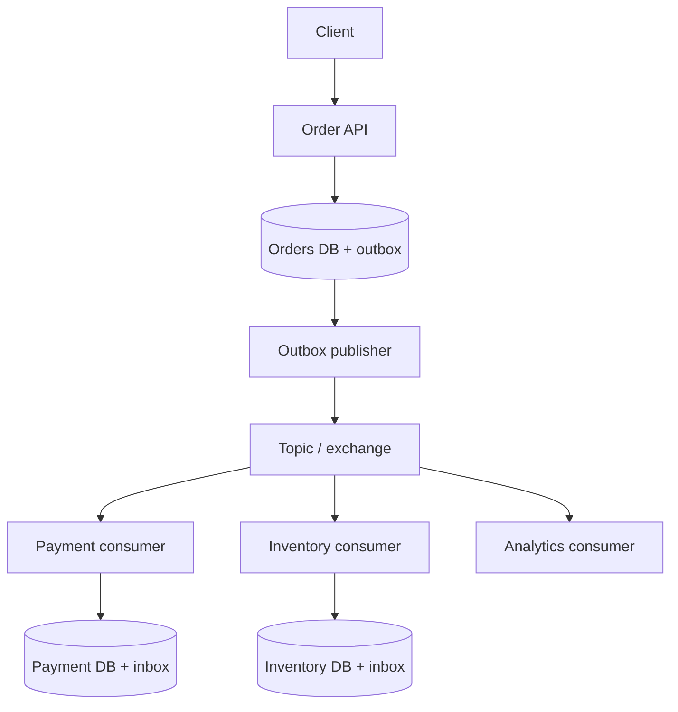

# Event-Driven Architecture
## Design an Event-Driven Architecture

An event-driven architecture lets services react to facts that have already occurred, such as `OrderPlaced` or `PaymentSucceeded`. The producer publishes an event; independent consumers update their own data or trigger follow-up work. This reduces direct coupling, but introduces eventual consistency, duplicate delivery, ordering decisions, and operational work.

## 1. Clarify the Requirements First

In an interview, ask: What are the events and peak throughput? How many independent consumers need each event? Is replay required? Which operations require immediate results? Does order matter globally or only per order/customer? What is the permitted processing delay? What data cannot leave a service? What happens if a consumer is down for hours?

Assume an order system with Order, Payment, Inventory, Notification, and Analytics services. The Order API must durably accept an order; payment and inventory workflows then proceed asynchronously. The API returns an order ID and a `Pending` status, rather than claiming that payment is complete.

## 2. Example Architecture

Each service owns its database. The outbox publisher reads committed events and sends them to the broker. Each consumer group/subscription/queue receives the events it needs. A workflow coordinator or saga handles multi-step business processes and compensations; the broker itself does not make several databases one transaction.

## 3. Kafka vs Azure Service Bus vs RabbitMQ

| Concern | Kafka | Azure Service Bus | RabbitMQ |
| --- | --- | --- | --- |
| Best fit | Durable high-volume event streams, independent consumer groups, replay | Managed enterprise queues/topics and workflows in Azure | Flexible routing and work queues with broker-managed delivery |
| Distribution | Topic partitions; group members divide partitions | Queue competes among receivers; topic has subscriptions | Exchange routes to queues; consumers compete within a queue |
| Replay | Retained log can be read again from an offset while data is retained | Processed messages are removed; DLQ is for failed messages, not general replay | Acknowledged queue messages are removed; use a stream design if replay is needed |
| Ordering scope | Within one partition | Per session for ordered related messages | Queue order needs careful consumer/prefetch/requeue configuration; multiple consumers can change observed processing order |
| Failed messages | Application-managed retry topics/DLQ topics | Built-in DLQ on queues/subscriptions and delivery-count behavior | Dead-letter exchange and target queue via policy/configuration |
| Operations | Cluster/service operation and partition planning | Managed Azure service; entity, tier, and quota planning | Exchange, queue, routing, durability, and cluster planning |

Choose by requirements, not by popularity. Kafka fits event history and multiple independent downstream processors. Service Bus fits Azure-hosted business messaging with sessions and managed DLQs. RabbitMQ fits task distribution and rich routing. All three still need idempotent consumers. Official references: [Kafka design](https://kafka.apache.org/design/), [Service Bus overview](https://learn.microsoft.com/en-us/azure/service-bus-messaging/service-bus-messaging-overview), and [RabbitMQ quorum queues](https://www.rabbitmq.com/docs/quorum-queues).

## 4. Producer Design

Publish an event about a committed business fact, rather than exposing an internal database row as a message. Include `eventId`, `eventType`, `schemaVersion`, `aggregateId` (for example, `orderId`), `occurredAt`, `correlationId`, and a minimal payload. Keep event identifiers stable across publish retries. Avoid sensitive data unless consumers need it and the transport/storage controls permit it.

**Transactional outbox:** Within one database transaction, save the order and an outbox row for `OrderPlaced`. A separate publisher sends pending outbox rows and marks them sent. If it crashes after publishing but before marking the row, it will send the event again; consumers must deduplicate. Monitor unpublished row age and use bounded batches. A change-data-capture publisher is another implementation choice.

Use delivery confirmation: Kafka producer acknowledgement settings and idempotent/transactional features where appropriate; RabbitMQ publisher confirms and durable routing where needed; Service Bus send acknowledgement. These controls protect broker publishing, but do not by themselves make a database write and message publish atomic. [Kafka design](https://kafka.apache.org/design/) · [RabbitMQ publisher confirms](https://www.rabbitmq.com/docs/confirms) · [Service Bus loss and duplicates](https://learn.microsoft.com/en-us/azure/service-bus-messaging/service-bus-message-loss-and-duplicates).

## 5. Consumer Design

A consumer validates the event schema, applies a business operation, records that it processed `eventId`, and only then acknowledges/completes or commits its offset. Scale different consumers independently. Limit concurrency to protect downstream APIs and database connection pools.

A reliable inbox pattern stores `(consumerName, eventId)` behind a unique constraint in the consumer's database, in the same transaction as its local business update. If the row already exists, treat the event as processed and acknowledge it. If an external API call is involved, a database transaction alone cannot make that remote call atomic; pass an idempotency key to the remote service and persist a state machine for recovery.

For Kafka, commit an offset after successful processing; a crash after business commit and before offset commit can cause redelivery. For Service Bus, use peek-lock and complete after success; an expired/lost lock causes redelivery. For RabbitMQ, use manual acknowledgement after success; redelivery can follow a failed consumer/channel. [Kafka design](https://kafka.apache.org/design/) · [Service Bus delivery guarantees](https://learn.microsoft.com/en-us/azure/service-bus-messaging/service-bus-message-loss-and-duplicates) · [RabbitMQ acknowledgements](https://www.rabbitmq.com/docs/confirms).

## 6. Retries and Poison Messages

Classify failures before retrying:

| Failure | Response |
| --- | --- |
| Transient timeout or throttling | Bounded exponential backoff with jitter; preserve event identity |
| Downstream outage | Pause or slow consumption, use circuit breaker and backpressure |
| Bad schema or invalid business data | Dead-letter/quarantine for inspection, rather than endless retries |
| Repeated unknown failure | Stop after a defined attempt/age limit and alert |

Avoid immediate requeue loops that consume CPU and block healthy traffic. In Kafka, use delayed retry topics or a scheduled retry service, then a DLQ topic; a retry topic can break strict per-key order unless you block later records for that key. In Service Bus, abandon for eligible retries or schedule a delayed retry, then use the entity's DLQ when delivery limits or explicit rejection apply. In RabbitMQ, use configured retry routing and a dead-letter exchange; requeueing the same failed item repeatedly can cause a hot loop. Preserve original event ID, attempt count, error class, timestamps, and correlation ID in the retry/DLQ record. [Service Bus DLQ](https://learn.microsoft.com/en-us/azure/service-bus-messaging/service-bus-dead-letter-queues) · [RabbitMQ quorum queues](https://www.rabbitmq.com/docs/quorum-queues).

## 7. DLQ Handling and Replay

A DLQ is an investigation and recovery mechanism, not a place to forget failed work. Alert on DLQ arrival and age; inspect reason, payload/schema version, and downstream state; fix the root cause; then replay safely with the same business/event identity so deduplication remains effective. Keep audit records and define retention/access controls. A Kafka DLQ is generally an application-managed topic; Service Bus queues and topic subscriptions include a DLQ subqueue; RabbitMQ routes through a dead-letter exchange to a configured target queue. [Service Bus DLQ](https://learn.microsoft.com/en-us/azure/service-bus-messaging/service-bus-dead-letter-queues) · [RabbitMQ quorum queues](https://www.rabbitmq.com/docs/quorum-queues).

## 8. Ordering

Ask whether the requirement is “all events globally ordered” or “events for one order are ordered.” Usually only per-aggregate ordering is needed.

- **Kafka:** Publish events for the same `orderId` with that key so they map to one partition; preserve a controlled per-partition processing path. Different partitions have no single global order. The partition count and key distribution affect throughput and future migration.
- **Azure Service Bus:** Set `SessionId = orderId` on a session-enabled entity; one receiver holds a session lock and processes related messages in sequence. A hot session limits parallelism for that order.
- **RabbitMQ:** A queue has an enqueue order, but multiple consumers, prefetch, retries, and requeues can change completion order. For strict per-key effects, route keys to dedicated logical queues/lanes or serialize processing and enforce sequence numbers in the application.

Use an aggregate sequence/version such as `orderVersion`. A consumer can reject, park, or later retry an event with a missing predecessor. Do not assume event timestamps establish a correct distributed total order. [Kafka design](https://kafka.apache.org/design/) · [Service Bus sessions](https://learn.microsoft.com/en-us/azure/service-bus-messaging/message-sessions) · [RabbitMQ ordering](https://www.rabbitmq.com/docs/queues).

## 9. Duplicate-Message Handling

At-least-once delivery can produce duplicates if processing succeeds but the acknowledgement is lost, a lock expires, an offset is not committed, or a publisher retries after an uncertain send result.

1. Assign a stable `eventId` or operation ID at the source.
2. Add a unique `(consumerName, eventId)` constraint in each consumer's inbox; update business state in the same local transaction.
3. Make external side effects idempotent using a stable key accepted by the downstream provider.
4. Use conditional updates and business uniqueness rules, for example one capture per payment intent.
5. Keep deduplication records at least as long as the maximum realistic retry/replay period, or rely on permanent business constraints.

Service Bus duplicate detection can discard repeated sends with the same `MessageId` within its configured window, but it does not replace consumer idempotency. Kafka exactly-once features can coordinate Kafka read/process/write flows; effects in an unrelated database or third-party payment API still require explicit idempotency design. [Service Bus duplicate detection](https://learn.microsoft.com/en-us/azure/service-bus-messaging/duplicate-detection) · [Kafka design](https://kafka.apache.org/design/).

## 10. End-to-End Order Example

1. `POST /orders` accepts a client idempotency key and saves `Order(Pending)` plus an outbox `OrderPlaced` in one transaction.
2. Outbox publisher sends `OrderPlaced` keyed by `orderId` and marks the outbox row sent; duplicate publishes remain possible.
3. Payment consumer inserts an inbox marker and transitions payment intent; the external payment request uses a stable idempotency key.
4. Payment service emits `PaymentSucceeded` or `PaymentFailed` from its own outbox.
5. Order workflow updates its state and coordinates Inventory. On a business failure, it performs defined compensation, such as releasing a reservation or initiating a refund; compensation is a new business action, not a rollback of all distributed transactions.
6. Notification and Analytics consume independently. A notification outage does not roll back a successful payment.
7. Operations monitors pending order age, consumer lag/queue age, retries, and DLQs.

## 11. Operational and Security Considerations

Monitor publish failure rate, outbox age, consumer lag or oldest-message age, processing latency, retry rate, DLQ count, partition/session hot spots, and downstream saturation. Trace with `correlationId` and `eventId`; log message metadata without dumping secrets. Version schemas compatibly, test older consumers, and plan retention and replay. Control topic/queue permissions, encrypt traffic, and rotate credentials. Load-test producer throughput, slow consumers, rebalance/restart behavior, and failure recovery.

## 12. Two-Minute Interview Answer

> I would first clarify throughput, the number of independent consumers, replay needs, consistency, and whether ordering is global or only per entity. For an order system, the Order service would save the order and an outbox event in one database transaction. A publisher sends the event to Kafka, Service Bus, or RabbitMQ, depending on whether we need stream replay, managed Azure business messaging, or flexible work-queue routing. Each consumer owns its data and acknowledges only after its local transaction succeeds. I would assume at-least-once delivery, store a consumer-specific event ID behind a unique constraint, and use idempotency keys for external side effects. Transient failures get bounded delayed retries; invalid or exhausted messages go to a monitored DLQ with a safe replay procedure. For ordering, I would key Kafka messages by order ID, use Service Bus sessions, or serialize RabbitMQ work per order, and include an aggregate version. Finally, I would measure lag, outbox age, retries, and DLQ age, and test consumer crashes and duplicate delivery.

## 13. Common Follow-Up Questions

**What if the DB commit succeeds but publish fails?** The event remains in the outbox and the publisher retries. A retry may publish twice, so consumers deduplicate.

**Can a consumer acknowledge before saving?** It can, but a crash between acknowledgement and saving loses the effect. Acknowledge after the durable local operation.

**Does exactly-once delivery eliminate duplicate payments?** No. Use a stable payment idempotency key, unique constraints, and reconciliation. Broker-level claims have a defined scope.

**What if a poison event blocks an ordered partition/session?** Decide whether to stop that key, park it and its successors, or explicitly relax ordering after recording a business decision. Sending it to a DLQ and continuing may violate state transitions.

**How do you add a new consumer?** In Kafka, a new group can replay retained events. In Service Bus or RabbitMQ, create the needed subscription/queue before future events and use a separate backfill from an event store/database if historical events are required.

**When should you use a command instead of an event?** Send a command to request one owner to perform an action; publish an event to announce a fact to any interested consumer. Model ownership and responsibility clearly.

## 14. Mistakes to Avoid

- Claiming a broker makes cross-service database transactions atomic.
- Assuming successful send acknowledgement means the consumer processed the event.
- Relying only on broker duplicate detection for payment safety.
- Assuming all partitions, sessions, or queues share a global processing order.
- Retrying permanent validation failures forever.
- Creating a DLQ without alerting, ownership, retention, and replay steps.
- Ignoring schema evolution, consumer lag, and hot keys.

