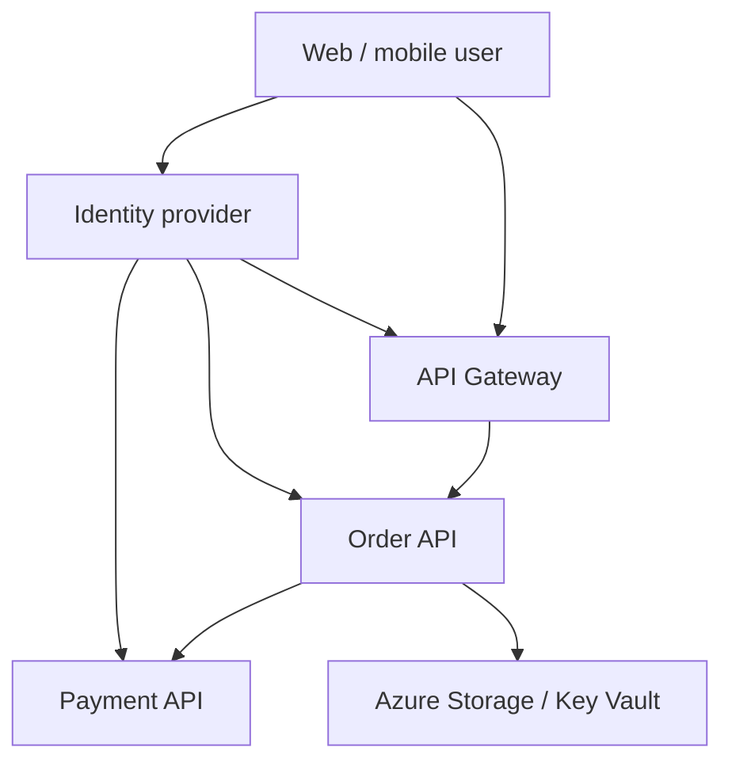

## Design Authentication and Authorization for Microservices

For a microservices platform, I separate **user identity**, **service identity**, and **business authorization**. An identity provider authenticates users and issues tokens. The API Gateway validates external requests and applies coarse policies. Each service validates the identity it receives and enforces permissions over its own resources. Service-to-service calls use a distinct workload identity. Managed Identity removes long-lived Azure credentials where supported; Key Vault stores credentials that still cannot be eliminated. [Microsoft API gateway guidance](https://learn.microsoft.com/en-us/azure/architecture/microservices/design/gateway) · [Microsoft Managed Identity guidance](https://learn.microsoft.com/en-us/entra/identity/managed-identities-azure-resources/secretless-authentication)

## 1. Clarify the Trust Boundaries

Ask who calls the system: browser/mobile users, partner apps, internal jobs, or other services. Identify the identity provider, API audiences, tenant model, deployment environment, direct access paths, data sensitivity, and resource-level rules. Define which APIs act **on behalf of a user** and which perform **app-only work**. Do not assume that all 50 services can safely accept the same broadly scoped token.

## 2. Reference Architecture



The client authenticates through OIDC and receives an access token for an API. The gateway validates and routes it. Orders validates the appropriate identity and its own authorization rules. When Orders calls Payments, it obtains a token **for Payments** using a user-delegation flow where needed, or an app-only workload identity for an application task. When Orders calls Azure Storage or Key Vault, its Managed Identity can obtain an audience-specific token. All hops use TLS; network placement complements, but does not replace, authentication.

## 3. OAuth 2.0 vs OpenID Connect

| Concept | Purpose | Typical artifact |
| --- | --- | --- |
| OAuth 2.0 | Delegated authorization to access a protected API | Access token with scopes/permissions |
| OpenID Connect (OIDC) | Authentication layer over OAuth 2.0 | ID token about the signed-in user |
| JWT | A token **format**, not an authentication protocol | Signed claims; access tokens may be JWT or opaque |

For an interactive web/mobile app, use **Authorization Code with PKCE** and an OIDC-capable provider. The client uses the ID token for sign-in context and sends an **access token** to the API. An ID token is issued to the client and should not be used as an API access token. Machine-to-machine app-only access typically uses client credentials or workload identity. Avoid implicit and resource-owner-password flows in new designs. [OpenID Connect Core](https://openid.net/specs/openid-connect-core-1_0-final.html) · [OAuth security best current practice](https://www.rfc-editor.org/rfc/rfc9700.html)

## 4. JWT Access Token Validation

At an API boundary, validate the token's signature against trusted issuer keys, issuer (`iss`), intended audience (`aud`), expiry/not-before, and the required scopes or app roles. Restrict accepted algorithms and identity providers. Fetch signing keys through trusted discovery/JWKS configuration with safe key rotation. Return **401** for absent/invalid authentication and **403** for an authenticated caller lacking permission.

A JWT is signed, not necessarily encrypted. Do not put secrets or sensitive personal data in its claims, log it, or trust claims read without signature and audience validation. Keep access tokens reasonably short-lived and use the provider's refresh-token/session policy appropriately. Instant revocation of an already issued self-contained token requires additional controls, such as short lifetimes, continuous access evaluation where applicable, or server-side state checks for sensitive operations. [ASP.NET Core JWT bearer validation](https://learn.microsoft.com/en-us/aspnet/core/security/authentication/configure-jwt-bearer-authentication?view=aspnetcore-9.0)

## 5. Gateway vs Service Responsibilities

| Control | API Gateway | Microservice |
| --- | --- | --- |
| Token validation | Validate external issuer, signature, audience, lifetime | Validate token/workload identity accepted for its own API; never blindly trust client-supplied headers |
| Authorization | Coarse route access, scopes, API product/tenant entry rules | Resource ownership, tenant boundary, state-dependent business rules |
| Rate limits | Client/tenant/route fairness | Dependency and operation capacity controls |
| Routing | Public endpoint to private service | Internal business operation |
| Audit | Edge access decision and trace ID | Business authorization decision and sensitive state change |

For example, the gateway can check `orders.read`, but only Orders knows whether user A may read **order 123**. Keep backends private and strip any inbound identity headers before adding trusted internal metadata. If the gateway forwards the original access token, every backend must validate that it is an intended audience; forwarding a token meant only for the gateway to an unrelated API is wrong. Instead, use an appropriate token exchange/on-behalf-of flow or gateway-to-backend workload token and explicitly convey user context under a protected design. [Microsoft API gateway guidance](https://learn.microsoft.com/en-us/azure/architecture/microservices/design/gateway) · [Protected APIs behind gateways](https://learn.microsoft.com/en-us/entra/msidweb/advanced/api-gateways)

## 6. Service-to-Service Authentication

**App-only call:** Orders calls Inventory as its own workload. Acquire an access token for Inventory using client credentials, federated workload identity, or a Managed Identity when the platform and identity provider support it. Inventory validates the token and grants only the required application role/scope. Avoid a shared static API key across every service.

**On behalf of a user:** Orders needs the user's identity when calling Payments or a document API. Use a supported token exchange/on-behalf-of flow to obtain a downstream token whose audience is the downstream API, carrying the permitted delegated scopes. The downstream service enforces its own business authorization. Never simply copy a token with the wrong audience.

**mTLS/service mesh:** Mutual TLS authenticates and encrypts the transport between workloads. It can complement application access tokens and policies, especially for east-west traffic, but proving “this workload is Orders” does not prove “this user may refund order 123.” Enforce both relevant identities where the operation requires them.

## 7. Managed Identity in Azure

A **system-assigned Managed Identity** belongs to one Azure resource and follows its lifecycle. A **user-assigned Managed Identity** is a separately managed identity that can be attached to eligible resources. Grant the identity least-privilege RBAC or resource-specific permissions, then acquire tokens using the Azure Identity SDK (`DefaultAzureCredential` for appropriate development/hosting setups, or explicit managed identity configuration where ambiguity matters). The token is scoped for the target resource, such as Storage, SQL, Service Bus, or Key Vault. [Managed Identity developer guidance](https://learn.microsoft.com/en-us/entra/identity/managed-identities-azure-resources/overview-for-developers)

Example for an Azure-hosted .NET service accessing Blob Storage:

```csharp
using Azure.Identity;
using Azure.Storage.Blobs;

var blobClient = new BlobServiceClient(
    new Uri("https://myaccount.blob.core.windows.net"),
    new DefaultAzureCredential());
```

Assign the service identity only the needed Storage data role. Do not put a storage account key in `appsettings.json`. In local development, `DefaultAzureCredential` can use a developer identity with separate access; in production, verify which credential source is selected and prefer an explicit identity if multiple are present. Managed Identity does not grant permission by itself: the target resource must authorize it. [Secretless authentication in Azure](https://learn.microsoft.com/en-us/entra/identity/managed-identities-azure-resources/secretless-authentication)

## 8. Secret Management

Use Managed Identity or workload federation **instead of secrets** whenever the target supports it. Some external payment providers, legacy databases, webhooks, and third-party APIs still require credentials. Store those in a secret manager such as Azure Key Vault, restrict access to the specific service identity, and load them at runtime through a supported mechanism. Do not store production secrets in source control, images, logs, or pipeline YAML.

Rotate secrets and signing certificates without downtime: support overlap between old and new versions, update consumers, observe usage, then revoke the old one. Separate environments and tenants where required; audit secret reads; set expiry and rotation alerts. Cache retrieved secrets for a controlled period so every request does not call the vault, while defining refresh on rotation. Managed Identity can authenticate the service to Key Vault even when the downstream system itself only accepts a secret. [Microsoft secretless authentication](https://learn.microsoft.com/en-us/entra/identity/managed-identities-azure-resources/secretless-authentication)

## 9. Authorization Model

Combine RBAC for broad roles (`Writer`, `Reviewer`, `Admin`) with scopes/app roles for API permissions and resource checks for ownership. For a multitenant system, use the verified tenant claim as an input and enforce the tenant key in every resource query. A role alone does not prove a user may act on any tenant's data. Where rules depend on resource state, put them in domain/application authorization policies, for example: “assigned SME may approve a section in `SMEReview` state.”

Use deny-by-default policies, explicit exceptions, and audit sensitive decisions. Consider central policy management for consistency, but keep authoritative resource facts with the owning service. Define how permission changes propagate and when an operation must recheck the database rather than rely only on a potentially stale JWT claim.

## 10. Failure and Threat Scenarios

| Scenario | Design response |
| --- | --- |
| Token expired during a long edit | Client refreshes before saving; API rejects invalid token; preserve draft safely and retry idempotently after renewal |
| Gateway bypass or spoofed identity header | Private backend networking, service authentication, strip untrusted headers, validate accepted tokens |
| Token intended for API A sent to API B | API B rejects wrong audience; caller obtains a B-audience token |
| Compromised service identity | Least privilege, isolate identities, revoke assignments, audit use, contain blast radius |
| Signing key rotation | Trusted issuer discovery and safe key refresh; avoid hard-coded keys |
| Key Vault unavailable | Bounded cache/fallback according to secret freshness; alert; do not silently use expired/revoked credentials forever |
| Unauthorized cross-tenant request | Domain service verifies tenant/resource ownership and returns 403 or an information-safe 404 |

## 11. Observability and Testing

Track authentication failures by reason without recording token contents, 401/403 rates by route, token acquisition failures, Managed Identity/Key Vault errors, unexpected cross-tenant denials, and service-to-service audience mismatches. Trace decisions with a correlation ID and record actor, action, resource, and outcome in a protected audit log for sensitive operations.

Test expired and not-yet-valid tokens, wrong issuer/audience, missing scope, forged headers, direct backend access, user-to-user and tenant-to-tenant data access, key rotation, secret rotation, and a service call with an app-only token where user delegation is required. Threat-model the path rather than only testing the happy login flow.

## 12. Two-Minute Interview Answer

> I would use an OIDC identity provider for user sign-in with Authorization Code and PKCE, then send an OAuth access token to the APIs. The API Gateway validates external tokens and enforces coarse route scopes and rate limits. Each microservice validates the identity it accepts and enforces resource-level and tenant-specific authorization, because only it owns the business data. For service-to-service calls, I would distinguish app-only operations from calls on behalf of a user. App-only calls use a workload identity or client credentials for the downstream API; delegated calls obtain a new downstream token with the correct audience and scopes. On Azure, Managed Identity lets services access Storage, SQL, Service Bus, and Key Vault without embedded credentials, after least-privilege permissions are assigned. For third-party secrets that remain unavoidable, I would use Key Vault with rotation and audit. I would test wrong-audience tokens, gateway bypass, forged headers, cross-tenant access, key rotation, and secret outages.

## 13. Common Interview Follow-Ups

**Is JWT the same as OAuth?** No. OAuth describes delegated authorization; OIDC adds user authentication; JWT is one possible token representation.

**Can the client send an ID token to an API?** No. The API expects an access token issued for that resource, with its intended audience and permissions.

**If the gateway validates a token, must services validate it too?** Services must authenticate the caller under their trust model. This may be validation of a proper access token or a protected gateway/workload identity, but never blind trust of an arbitrary forwarded header.

**Does Managed Identity replace Key Vault?** It removes many stored credentials and authenticates to Key Vault; Key Vault remains useful for external credentials, certificates, and keys that cannot be eliminated.

**What is the difference between authentication and authorization?** Authentication establishes who or what is calling. Authorization decides whether that identity may perform a particular action on a particular resource.

## 14. Mistakes to Avoid

- Treating a decoded but unvalidated JWT as trusted.
- Sending an ID token as an API access token.
- Forwarding the gateway's access token to every backend regardless of audience.
- Putting all business authorization in the gateway.
- Treating a private network or mTLS as proof of user-level permission.
- Sharing one long-lived client secret across all services.
- Assuming Managed Identity grants access without assigning permissions.
- Logging bearer tokens or storing provider secrets in configuration files.

## 15. Primary References

- [OpenID Connect Core 1.0](https://openid.net/specs/openid-connect-core-1_0-final.html)
- [OAuth 2.0 Security Best Current Practice (RFC 9700)](https://www.rfc-editor.org/rfc/rfc9700.html)
- [Microsoft: Configure JWT bearer authentication in ASP.NET Core](https://learn.microsoft.com/en-us/aspnet/core/security/authentication/configure-jwt-bearer-authentication?view=aspnetcore-9.0)
- [Microsoft: API gateways in microservices](https://learn.microsoft.com/en-us/azure/architecture/microservices/design/gateway)
- [Microsoft: Secretless authentication with Managed Identity](https://learn.microsoft.com/en-us/entra/identity/managed-identities-azure-resources/secretless-authentication)
