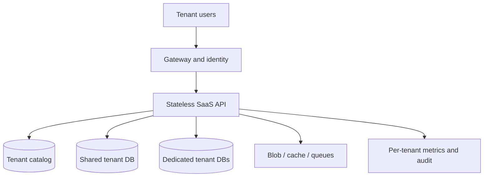

## Design a Multi-Tenant SaaS Application

A multi-tenant SaaS application serves many customer organizations (tenants) on a shared platform while enforcing isolation for data, identity, performance, and operations. The key decision is the **isolation requirement per tenant and resource**. One product can use shared application instances and a shared database for most tenants, while moving high-volume or regulated tenants to dedicated databases or deployment stamps. [Microsoft tenancy models](https://learn.microsoft.com/en-us/azure/architecture/guide/multitenant/considerations/tenancy-models)

## 1. Clarify the Requirements

Ask how many tenants and users, data volume per tenant, peak workload skew, required regions/data residency, compliance, customization, backup/restore expectations, and pricing tiers. Ask whether one tenant can demand a dedicated database, encryption key, network boundary, or deployment. Determine cross-tenant analytics needs and whether tenant data can ever be pooled for reporting.

Example: 10,000 small tenants share the standard tier, while 100 enterprise tenants need separate data stores or regions. There is no universal “database-per-tenant is always secure” or “shared database is always cheaper” answer: security and cost depend on the whole system, including storage, queues, caches, logs, and operational automation.

## 2. Reference Architecture



The tenant catalog maps a verified tenant ID to its plan, region, deployment stamp, database connection reference, feature flags, and lifecycle status. The API resolves tenant context once per request, then uses tenant-aware repositories, cache keys, Blob paths, messages, and authorization. Keep the catalog small, highly available, and protected; a catalog outage can block routing to otherwise healthy tenant databases.

## 3. Compare Data Isolation Models

| Model | Data layout | Benefits | Main risks/costs | Good fit |
| --- | --- | --- | --- | --- |
| Shared database, shared tables | Every tenant row has `TenantId` | Low infrastructure cost, simple fleet-wide schema rollout and cross-tenant operations | A missing filter can leak data; noisy neighbors; tenant-specific restore is difficult | Many small tenants with compatible requirements |
| Shared database, schema per tenant | Separate schemas in one DB | Some namespace isolation | Many schemas and migrations; shared DB capacity/failure domain; ORM complexity | Limited tenant count and clear schema ownership |
| Database per tenant | Separate DB for each tenant, often shared app | Stronger data and backup isolation, custom per-tenant scaling | Provisioning, connection pools, migrations, monitoring, and catalog management at scale | Enterprise/compliance tenants, different performance needs |
| Dedicated deployment/stamp | App and data isolated by tenant or cohort | Highest control of performance, region, and security boundaries | Highest operating cost and rollout complexity | Large regulated/strategic tenants |

Schema-per-tenant is not automatically supported by every ORM mapping approach; EF Core documents discriminator filters and database-per-tenant configuration, while schema switching needs careful model/cache design. Azure guidance treats tenancy as a spectrum, with different isolation choices for different components. [EF Core multi-tenancy](https://learn.microsoft.com/en-us/ef/core/miscellaneous/multitenancy) · [Azure storage/data approaches](https://learn.microsoft.com/en-us/azure/architecture/guide/multitenant/approaches/storage-data)

## 4. My Recommended Starting Point

For many small/medium tenants, use **shared stateless services and shared tables** with a mandatory `TenantId`, strong application scoping, and database row-level security where supported. For large, high-compliance, or noisy tenants, route through the same tenant catalog to a **dedicated database** or stamp. This hybrid design keeps cost reasonable while preserving a migration path. Do not choose a model only from tenant count; uneven tenant size and contractual isolation can dominate. [Microsoft SaaS database patterns](https://learn.microsoft.com/en-us/azure/azure-sql/database/saas-tenancy-app-design-patterns?view=azuresql)

Before moving a tenant, define data export/import, cutover, dual-write avoidance, validation, rollback, URL continuity, and region-specific policy. Abstract the tenant-to-database routing, but avoid hiding fundamentally different consistency or feature behavior behind a misleading generic repository.

## 5. Tenant Resolution and Identity

Authenticate the user through a trusted identity provider. Determine the selected tenant from an authorized membership/tenant claim or a server-side tenant membership lookup; validate it against the route/host and tenant catalog. A hostname such as `acme.example.com` is a routing hint, **not sufficient proof** that the user belongs to Acme. For a user in multiple organizations, require an explicit tenant selection and confirm membership on every request/session boundary.

A tenant context might contain `TenantId`, user ID, role/permissions, deployment stamp, and correlation ID. It must not be a mutable global singleton; scope it to the request/job. Return a safe 404/403 for unauthorized resources without leaking another tenant's existence. Apply tenant membership and resource authorization separately: being an Acme employee does not automatically grant access to every Acme document.

## 6. Shared-Database Isolation

Make `TenantId` non-null on every tenant-owned table. Use composite uniqueness and foreign keys that include `TenantId` where practical; a globally unique primary key alone does not prevent a cross-tenant relationship. Example: unique `(TenantId, ExternalOrderNumber)`, and an order item relationship that cannot point to an order in another tenant.

In EF Core, inject the immutable scoped tenant ID and use a global query filter for ordinary reads, plus repository/API authorization. Remember that raw SQL, administrative paths, filter suppression, projections, background jobs, and bulk updates can bypass application conventions. Add database **row-level security (RLS)** as defense in depth when supported. In PostgreSQL, a policy can use a transaction-scoped tenant setting; with pooled connections, set and reset the context safely for **every transaction/request** so one tenant's context cannot leak into another's connection. Do not let the application role bypass RLS. Test writes as well as reads. [EF Core multi-tenancy](https://learn.microsoft.com/en-us/ef/core/miscellaneous/multitenancy) · [PostgreSQL row-security policies](https://www.postgresql.org/docs/current/sql-createpolicy.html)

```csharp
// Illustrative shared-table filter; enforce tenant context on inserts too.
modelBuilder.Entity<Study>()
    .HasQueryFilter(study => study.TenantId == tenantContext.TenantId);
```

For tenant-wide administrative operations, use a separate audited path with explicit authorization; never turn off filters casually in an ordinary user endpoint.

## 7. Database-Per-Tenant Routing

After verifying tenant membership, query a protected catalog for the tenant's database location/connection reference, then create a DbContext with the correct connection. Avoid registering a singleton DbContext or factory that freezes one tenant's connection string for all users. Bound the number of connection pools and avoid loading thousands of tenant connections at startup. Store connection secrets in a secret manager or use workload identity where the database supports it.

Provisioning should be automated: create DB, apply schema, seed required data, assign identity/access, register catalog entry, validate health, then activate the tenant. Run migrations as a controlled fleet rollout with version tracking and rate limits; a single failed tenant DB should not leave the entire fleet in an unknown state. Azure SQL elastic pools can share compute among many tenant databases, but a tenant can still consume pool resources, so monitor both pool and database-level metrics. [Azure SQL SaaS patterns](https://learn.microsoft.com/en-us/azure/azure-sql/database/saas-tenancy-app-design-patterns?view=azuresql) · [Elastic pool resource management](https://learn.microsoft.com/en-us/azure/azure-sql/database/elastic-pool-resource-management)

## 8. Isolation Beyond the Database

| Component | Tenant isolation rule |
| --- | --- |
| Redis cache | Include tenant ID, region/stamp, relevant permissions and locale in keys; invalidate per tenant |
| Blob Storage | Use tenant-scoped paths/containers/accounts according to security tier; authorize before issuing SAS |
| Message broker | Carry verified `TenantId` in messages; workers revalidate context and partition/limit where needed |
| Search index | Filter by tenant at query and indexing time; use separate indexes for stronger isolation tiers |
| Logs/traces | Include tenant ID for operations, restrict access and redact sensitive data |
| Backups | Know whether individual tenant restore is possible; test it |
| Feature flags | Evaluate by verified tenant ID and plan; do not let a client select arbitrary entitlements |

A tenant-filtered SQL query is insufficient if a shared cache key, search query, Blob link, or background worker crosses the boundary. Azure documents different isolation approaches across storage and services. [Azure multitenant storage/data](https://learn.microsoft.com/en-us/azure/architecture/guide/multitenant/approaches/storage-data) · [Azure Storage multitenancy](https://learn.microsoft.com/en-us/azure/architecture/guide/multitenant/service/storage)

## 9. Security and Compliance

Use OIDC/OAuth access tokens with issuer/audience validation; resolve user-to-tenant membership; enforce tenant and resource-level authorization in each owning service. Use Managed Identity/workload identity and least privilege for Azure dependencies. Encrypt in transit and at rest; consider tenant-specific keys only when a contractual requirement justifies the extra lifecycle work. Audit access to sensitive records, administrative impersonation, exports, and configuration changes.

Protect the control plane: tenant provisioning, plan changes, data migration, region moves, and suspension are privileged operations. Treat tenant IDs in headers, query strings, and queue payloads as untrusted until bound to authenticated context or verified against the originating service. Define tenant deletion, retention, export, and legal hold procedures.

## 10. Scaling and Noisy-Neighbor Control

Use per-tenant request quotas and rate limits at the gateway, and per-tenant concurrency, worker queue allocation, DB connection limits, and expensive-query controls behind it. Monitor p95 latency, CPU/IO, cache usage, queue age, storage, and cost by tenant and stamp. A large export can exhaust a shared worker pool even if the API is healthy.

Scale stateless API replicas horizontally; split tenants across **deployment stamps** by region/tier/capacity. Route each tenant consistently to its assigned stamp through the catalog. When a tenant grows, move it to a larger pool or dedicated DB/stamp. Sharding a shared database by `TenantId` gives a natural route for many queries, but very large tenants can create hot shards; use explicit placement for them. [Microsoft tenancy models](https://learn.microsoft.com/en-us/azure/architecture/guide/multitenant/considerations/tenancy-models) · [Azure SQL multitenancy](https://learn.microsoft.com/en-us/azure/architecture/guide/multitenant/service/sql-database)

## 11. Reliability, Backups, and Migrations

A shared DB outage affects many tenants; dedicated DBs reduce data blast radius but increase fleet operations. Define RTO/RPO by tier, backup retention, point-in-time recovery, and per-tenant restore procedure. A shared table restore of one tenant may require an isolated restore database plus selective extraction, rather than restoring production wholesale. Test it before promising it in a contract.

Roll out schema changes backward-compatibly: expand schema, deploy application code, backfill safely, then contract old columns. For database-per-tenant, track migration version per DB and allow controlled rolling upgrades. For stamps, roll out one cohort/canary first. Provisioning, migration, and deletion jobs must be idempotent and observable.

## 12. Testing Tenant Isolation

Test two or more tenants with overlapping natural IDs and similar data. Verify list/detail/update/delete APIs, raw SQL, exports, cache, search, Blob URLs, background messages, analytics, and admin actions. Try an authenticated user with an altered tenant header/host and a guessed resource ID. Test connection-pool reuse after a tenant switch, malformed tenant claims, and concurrency under load. Automate these tests because a single missing tenant filter is a high-impact defect.

## 13. Two-Minute Interview Answer

> I would first ask about tenant count, data skew, residency, compliance, and per-tenant restore requirements. For many small tenants I would start with shared application instances and shared tables keyed by `TenantId`, enforce tenant scoping in every query and write, and add database row-level security as defense in depth. A verified tenant context comes from identity plus membership, not from an untrusted header alone. For enterprise or noisy tenants I would use a catalog to route them to a dedicated database or deployment stamp, automating provisioning and schema migrations. Isolation also applies to Redis keys, Blob paths, search filters, queues, and logs. I would enforce per-tenant quotas and worker capacity, monitor resource usage by tenant, and move heavy tenants out of shared pools. Finally, I would test cross-tenant access and tenant-specific backup/restore and make migration between tiers a planned operation.

## 14. Common Interview Follow-Ups

**Is database-per-tenant always safer?** It provides a stronger data boundary, but the application, catalog, credentials, backups, and shared services can still leak data if designed incorrectly.

**Why use RLS if EF Core has global filters?** It adds database enforcement when raw SQL or code paths accidentally omit a filter. RLS must itself be configured and tested correctly, especially with pooled connections.

**How would you query across all tenants for billing?** Use a privileged, audited aggregation pipeline or control-plane data warehouse. Do not disable tenant filters in normal request paths.

**Can one user belong to multiple tenants?** Yes. Require a verified selected tenant per operation and check membership and resource permission for that tenant.

**How do you migrate one tenant from shared to dedicated?** Prepare target schema, copy and validate data, quiesce or capture delta writes, cut over the catalog atomically, verify, and retain a rollback plan without uncontrolled dual writes.

**How do you prevent a noisy neighbor?** Rate and concurrency limits by tenant, DB/pool monitoring, workload isolation for heavy jobs, placement across stamps, and dedicated resources where needed.

## 15. Mistakes to Avoid

- Trusting a tenant ID from a URL/header without verifying membership.
- Adding `TenantId` only to top-level tables but not enforcing cross-tenant relationships.
- Assuming an EF Core query filter applies to every raw SQL or administrative path.
- Reusing a pooled DB session with another tenant's RLS context.
- Using cache/search keys or Blob paths that omit tenant isolation.
- Promising tenant-specific restores from shared tables without testing the process.
- Creating thousands of databases without automated migrations and connection management.
- Calling a database-per-tenant design fully isolated while workers, caches, and secrets remain shared without controls.

## 16. Primary References

- [Microsoft: Tenancy models for multitenant solutions](https://learn.microsoft.com/en-us/azure/architecture/guide/multitenant/considerations/tenancy-models)
- [Microsoft: Multitenant storage and data approaches](https://learn.microsoft.com/en-us/azure/architecture/guide/multitenant/approaches/storage-data)
- [Microsoft: Azure SQL SaaS database patterns](https://learn.microsoft.com/en-us/azure/azure-sql/database/saas-tenancy-app-design-patterns?view=azuresql)
- [Microsoft: EF Core multi-tenancy](https://learn.microsoft.com/en-us/ef/core/miscellaneous/multitenancy)
- [PostgreSQL: Row-security policies](https://www.postgresql.org/docs/current/sql-createpolicy.html)
