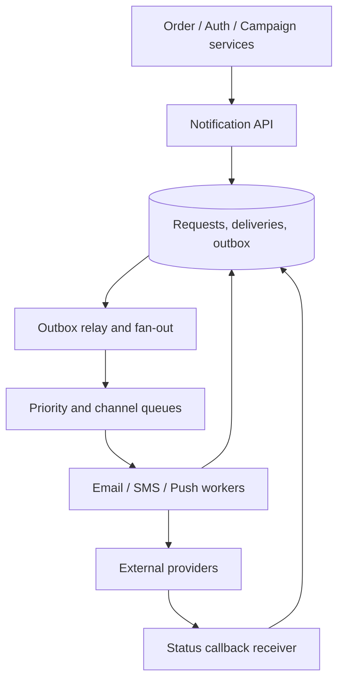

## Design a Notification System for Millions of Users

A notification platform accepts business events or explicit send requests and delivers Email, SMS, and Push messages at scale. The key design goals are timely transactional messages, controlled bulk campaigns, user preferences, provider rate compliance, observable delivery states, and safe recovery from failures. Queueing separates request acceptance from slow or unreliable external providers. [Microsoft queue-based load leveling](https://learn.microsoft.com/en-us/azure/architecture/patterns/queue-based-load-leveling)

## 1. Clarify Requirements and Capacity

Ask which notifications are critical (OTP, fraud, order updates) versus bulk (promotions), the delivery deadline for each, geographic and regulatory scope, user opt-in/opt-out rules, template languages, quiet hours, and which channel fallback is allowed. Clarify whether “sent” means accepted by a provider, delivered to a device/mail server, or actually read by a person. Those are different states.

**Example sizing assumptions:** 20 million users, 5 million daily notifications, 10× short-term peak, and an average of 1.5 channels per request. This produces 7.5 million channel attempts/day, averaging about 87 attempts/second, with an illustrative peak near 870 attempts/second. A campaign to 10 million recipients in 15 minutes would require over 11,000 attempts/second before retries, so batch campaigns need their own capacity and provider agreement. These figures are examples; calculate from the interviewer's requirements and include regional/channel splits.

## 2. High-Level Architecture

The API validates and durably records a request, then returns a `notificationId` and accepted status. Fan-out creates a separate delivery for each intended channel and recipient/device. Workers enforce channel-specific policies and send to providers. Callback processors reconcile later provider outcomes. Keep the control plane (templates, preferences, quotas, routing) separate from high-volume delivery workers where practical.

## 3. Data Model and Message Contract

| Entity | Important fields | Purpose |
| --- | --- | --- |
| `NotificationRequest` | `RequestId`, `TenantId`, `Type`, `TemplateVersion`, `Priority`, `CreatedAt`, `ExpiresAt`, `IdempotencyKey` | One logical notification request |
| `Delivery` | `DeliveryId`, `RequestId`, `UserId`, `Channel`, `DestinationRef`, `State`, `AttemptCount`, `ProviderId`, `NextAttemptAt` | One recipient/channel attempt stream |
| `UserPreference` | `UserId`, category/channel opt-in, locale, quiet hours | Eligibility and channel choice |
| `DeviceToken` | `UserId`, token, platform, last-seen, validity | Push destinations |
| `OutboxMessage` | stable event ID, payload, status | Reliable DB-to-queue publication |
| `DeliveryAttempt` | attempt ID, error category, provider response, time | Auditing and diagnosis |

Use stable `RequestId` and `DeliveryId`. The queue message can contain `DeliveryId`, tenant, channel, priority, scheduled time, and a reference to persisted content rather than sensitive full payloads. Version the payload contract. Store destinations and personal data with appropriate access controls and retention.

## 4. Intake, Preferences, and Fan-Out

1. The calling service supplies an idempotency key and notification type, recipient set/reference, template data, and business correlation ID.
2. Validate authorization, payload, template, and tenant limits. Persist a request and outbox row in one transaction; retrying the API with the same key returns the existing request.
3. Resolve recipients, contact points, locale, and preferences. For campaigns, stream recipient batches rather than loading millions of users into one process or one enormous message.
4. Check category consent, suppression, quiet hours, frequency caps, and expiry. Critical security/transactional rules may differ from marketing rules, but must be explicitly defined.
5. Create per-channel delivery records with stable IDs; enqueue them using an outbox or another atomic mechanism. Avoid silent loss between DB commit and queue publish.

Decide whether preference checks happen at planning time, just before send, or both. A campaign scheduled hours ahead should recheck opt-outs before sending. Record why an attempt was suppressed so the user and operators can distinguish suppression from provider failure. [AWS transactional outbox](https://docs.aws.amazon.com/prescriptive-guidance/latest/cloud-design-patterns/transactional-outbox.html)

## 5. Queues and Worker Scaling

Use durable queues to buffer bursts and scale workers independently by channel. Email, SMS, and Push have different provider quotas, latencies, costs, and error modes. A practical topology has separate high and normal priority queues per channel (for example, `sms-critical`, `sms-bulk`, `email-transactional`, `email-marketing`, `push-transactional`, `push-bulk`). The exact number of queues depends on operations and broker limits; avoid a queue per user.

Workers fetch bounded batches, process with bounded concurrency, acknowledge only after a durable state transition, and renew message locks if work can exceed the lock duration. Scale by **oldest message age**, backlog, send latency, provider quota headroom, and errors; CPU alone can miss an externally throttled worker. Broker queues absorb bursts, but they do not create unlimited provider capacity. [Microsoft priority queue pattern](https://learn.microsoft.com/en-us/azure/architecture/patterns/priority-queue) · [Queue-based load leveling](https://learn.microsoft.com/en-us/azure/architecture/patterns/queue-based-load-leveling)

## 6. Priorities and Fairness

Treat priority as a business SLA: OTP/fraud alerts might target seconds; order updates minutes; promotions hours. Separate critical from bulk capacity so a large campaign cannot block OTPs. Reserve a minimum worker/provider quota for critical traffic and still allocate some capacity to normal traffic to prevent starvation. Within each tier, apply per-tenant quotas to prevent one tenant from consuming all capacity.

A priority value inside one FIFO queue is insufficient unless the broker and consumers actually select by priority. Separate queues and worker pools are easy to reason about. A weighted scheduler can drain, for example, several critical batches for every normal batch, while always respecting provider limits. Expire time-sensitive work: an OTP arriving after its validity window should be marked `Expired`, not sent late. [Microsoft priority queue pattern](https://learn.microsoft.com/en-us/azure/architecture/patterns/priority-queue)

## 7. Channel Adapters and Provider Rate Limits

Implement a common worker contract around channel-specific adapters: `SendAsync(delivery, cancellationToken) -> provider result`. Use provider-specific request formats, credentials, error classification, quotas, and status callbacks inside adapters. Each provider has its own bounded concurrency and token-bucket rate control. Respect `Retry-After`/throttle signals and adapt throughput rather than letting a large queue flood the provider. FCM documents quota errors and server-side throttling for high-volume sending. [FCM error codes](https://firebase.google.com/docs/cloud-messaging/error-codes) · [FCM sending at scale](https://firebase.google.com/docs/cloud-messaging/scale-fcm)

A secondary provider may improve availability for some channels, but failover needs tested routing, approved sender identity/templates, cost controls, and duplicate-send precautions. Do not immediately resend through a second provider merely because the first provider timed out; it might have accepted the message.

## 8. Retry Policy and Failure Classification

| Result | Example | Action |
| --- | --- | --- |
| Transient | Provider 5xx, timeout, temporary network fault | Retry with bounded exponential backoff and jitter; honor `Retry-After` |
| Rate limited | 429 or provider quota response | Slow that provider/channel; reschedule within expiry |
| Permanent | Invalid phone/email/token, rejected template, invalid credentials | Mark failed or quarantine; fix configuration/data before replay |
| Ambiguous | Request timed out after send | Query provider status using stable reference if possible; reconcile before resend |
| Expired | OTP/campaign cutoff passed | Mark expired; do not retry |

Persist `AttemptCount`, `NextAttemptAt`, last error category, and provider request ID. Set a maximum attempt count **and** maximum age; a three-day retry for an OTP is wrong. Delayed retries should not block the high-priority queue's healthy traffic. Use circuit breakers and per-provider concurrency limits during outages. Distinguish SDK transport retries from business-level retries to avoid multiplicative attempts. [Microsoft transient fault guidance](https://learn.microsoft.com/en-us/azure/well-architected/design-guides/handle-transient-faults)

## 9. Duplicate Handling and Delivery State

Assume at-least-once queue delivery. Use a unique `DeliveryId` for each intended recipient/channel and a DB uniqueness constraint. Before calling a provider, a worker checks durable state and claims the delivery atomically with an expiring lease. If the worker crashes after the provider accepts a send but before saving the result, the outcome is uncertain. Use a provider idempotency feature when available, a stable client reference, status lookup/webhook reconciliation, and a cautious resend policy. An inbox marker alone cannot atomically coordinate your database and an external provider call.

Model states such as `Pending → Sending → ProviderAccepted → Delivered`, with branches `RetryScheduled`, `FailedPermanent`, `Expired`, and `Suppressed`. `ProviderAccepted` is **not** proof that the user received or read the message. Email can later bounce or generate a complaint; SMS can have delivery callbacks; push acceptance means the push provider accepted a request and does not always prove display on a device. Process callbacks idempotently and tolerate out-of-order callbacks. [SES event publishing](https://docs.aws.amazon.com/ses/latest/dg/monitor-using-event-publishing.html) · [Twilio status callbacks](https://www.twilio.com/docs/messaging/guides/outbound-message-status-in-status-callbacks)

## 10. Dead-Letter Queues and Operator Recovery

After bounded attempts, send poison/unprocessable queue messages to a DLQ with the delivery ID, error class, attempt history, and correlation ID. Alert on DLQ count **and oldest age**. Operators inspect root causes, fix bad templates/configuration or data, then safely replay the same delivery identity if it is still relevant and authorized. Do not replay expired OTPs, revoked marketing consent, or already delivered messages. Azure Service Bus provides DLQ subqueues for queues and topic subscriptions. [Azure Service Bus DLQs](https://learn.microsoft.com/en-us/azure/service-bus-messaging/service-bus-dead-letter-queues)

## 11. Provider-Specific Hygiene

- **Email:** Maintain bounce/complaint suppression, domain authentication, sender reputation, template rendering checks, and unsubscribe handling for marketing messages. A provider send success can precede a bounce. [Amazon SES event publishing](https://docs.aws.amazon.com/ses/latest/dg/monitor-using-event-publishing.html)
- **SMS:** Respect regional sender/consent rules and provider throughput; normalize phone numbers; watch cost and fraud. Track status callbacks, not just the initial API response. [Twilio outbound status](https://www.twilio.com/docs/messaging/guides/outbound-message-status-in-status-callbacks)
- **Push:** Store token freshness and remove invalid/unregistered tokens after definitive failures. Keep notification payloads minimal; app/device state and platform rules affect visibility. [FCM token management](https://firebase.google.com/docs/cloud-messaging/manage-tokens) · [FCM error codes](https://firebase.google.com/docs/cloud-messaging/error-codes)

## 12. Walk Through a High-Priority OTP and a Bulk Campaign

**OTP:** Auth service creates a request with short expiry and idempotency key. The system writes request/outbox atomically, selects an allowed destination, places a delivery on a critical channel queue, and a worker sends within the reserved provider capacity. If it is rate-limited beyond expiry, mark `Expired`. Avoid automatic cross-channel fallback unless the authentication policy explicitly permits it.

**Campaign:** Campaign service streams recipient batches into delivery records after preference checks. Bulk queues are paced to provider budgets and per-tenant limits. Workers recheck opt-out before send, process callbacks, suppress hard bounces/invalid tokens, and report accepted, delivered, failed, and suppressed counts separately. Critical queues continue independently.

## 13. Monitoring, Security, and Testing

Measure accepted requests, queue depth and **oldest age per priority/channel**, end-to-end p95/p99 time to provider acceptance, provider error/429 rate, delivery callbacks, duplicate suppressions, DLQ age, campaign completion, and cost per channel. Trace `RequestId`, `DeliveryId`, and provider ID without logging OTP values, tokens, phone numbers, or message bodies unnecessarily.

Encrypt destinations and secrets, isolate tenants, audit template changes, restrict who can launch campaigns, and enforce consent at send time. Load-test campaign bursts alongside OTP traffic. Inject provider timeouts, duplicate queue deliveries, delayed callbacks, stale device tokens, and worker crashes after provider acceptance; verify state and resend behavior.

## 14. Two-Minute Interview Answer

> I would expose a Notification API that durably records each request with an idempotency key and publishes work using an outbox, so a database commit cannot silently lose the queue message. A fan-out stage creates one delivery ID per recipient and channel after applying templates, preferences, and consent rules. I would separate critical and bulk queues for Email, SMS, and Push, with reserved critical capacity and per-tenant fairness. Workers scale by queue age and provider quota, not just CPU, and enforce channel-specific rate limits. Transient provider failures get delayed retries with backoff and jitter; permanent failures are recorded or dead-lettered; time-sensitive messages expire instead of arriving late. Since queue delivery and provider responses can be duplicated or ambiguous, I would track stable delivery IDs, use provider idempotency/status lookup where available, reconcile callbacks, and never equate provider acceptance with user delivery. I would monitor oldest queue age, provider errors, DLQs, delivery outcomes, and campaign costs.

## 15. Common Interview Follow-Ups

**Why separate queues by priority?** A campaign can produce millions of bulk tasks and delay OTPs if they share the same FIFO work queue and worker budget.

**Can I guarantee exactly-once Email or SMS?** Usually not across your DB, broker, and an external provider. Aim for effectively once behavior with stable IDs, durable state, provider features, reconciliation, and explicit handling of uncertain outcomes.

**What if the SMS provider returns 200 but the message fails later?** Store `ProviderAccepted` first and update final status from authenticated callbacks or provider queries. A 200 response is not delivery proof.

**What if a user opts out after campaign scheduling?** Check preferences again just before sending and mark the delivery `Suppressed` if it is no longer allowed.

**What if the provider is down for hours?** Stop hammering it, use a circuit breaker and delayed retry, retain durable backlog within TTL, consider approved fallback, alert, and expire messages that are no longer useful.

**Should we preserve strict order for all notifications?** Usually no. If a specific user's stateful sequence requires order, key/serialize that scope or use sequence numbers; avoid global ordering because it limits throughput.

## 16. Mistakes to Avoid

- Treating queue acceptance or provider acceptance as proof of delivery.
- Putting OTPs behind a large marketing campaign in one work queue.
- Retrying invalid addresses/tokens and expired messages indefinitely.
- Ignoring provider limits and allowing worker scaling to amplify 429s.
- Assuming a DB inbox makes a third-party send atomic.
- Replaying failed marketing sends without rechecking consent.
- Omitting bounce/complaint processing, invalid push token cleanup, and webhook idempotency.

## 17. Primary References

- [Microsoft: Priority Queue pattern](https://learn.microsoft.com/en-us/azure/architecture/patterns/priority-queue)
- [Microsoft: Queue-Based Load Leveling pattern](https://learn.microsoft.com/en-us/azure/architecture/patterns/queue-based-load-leveling)
- [Microsoft: Azure Service Bus dead-letter queues](https://learn.microsoft.com/en-us/azure/service-bus-messaging/service-bus-dead-letter-queues)
- [Firebase: Best practices for sending FCM messages at scale](https://firebase.google.com/docs/cloud-messaging/scale-fcm)
- [Amazon SES: Event publishing](https://docs.aws.amazon.com/ses/latest/dg/monitor-using-event-publishing.html)
- [Twilio: Outbound message status callbacks](https://www.twilio.com/docs/messaging/guides/outbound-message-status-in-status-callbacks)

## High-Level Architecture Flow

- Clients / Microservices: Upstream systems (payment, order services) push notification events to an API Gateway.
- Notification Service: Validates requests, fetches user preferences (opt-outs) from Redis/DB, and renders text using cached templates.
- Message Broker: Routes messages to distinct queues based on channel (Email, SMS, Push) and priority.
- Workers: Specialized microservices pull from queues and call third-party providers (FCM for push, Twilio for SMS, SendGrid for email).

## Handling Queues and Priorities

- Separate Topics/Queues: Isolate channels into separate message broker topics (e.g., sms-queue, email-queue, push-queue) so a slowdown in one channel does not block another.
- Priority Routing: Subdivide topics or use weighted priority queues (High, Medium, Low).High Priority: One-Time Passwords (OTPs) or security alerts. Processed immediately with dedicated worker threads.
- Low Priority: Marketing campaigns or weekly newsletters. Processed in bulk or rate-limited batches during off-peak hours

## Retries and Failure Handling
- Transient vs. Permanent Failures: Distinguish between temporary network drops/rate limits and permanent failures (e.g., invalid phone number, unsubscribed email).- Exponential Backoff: Retry transient failures using progressive delays (e.g., 2s, 10s, 60s) to prevent overwhelming third-party vendors.
- Dead-Letter Queues (DLQ): Route messages that exhaust maximum retry attempts to a DLQ for manual inspection or audit logging.
- Provider Fallback: If a primary SMS provider (e.g., Twilio) fails or hits a circuit breaker, automatically reroute the payload to a secondary backup provider (e.g., Plivo or MessageBird).
- Idempotency: Assign a unique notificationId to each message. Cache processed IDs in Redis with a time-to-live (TTL) window to ensure retries do not result in duplicate messages delivered to the user

