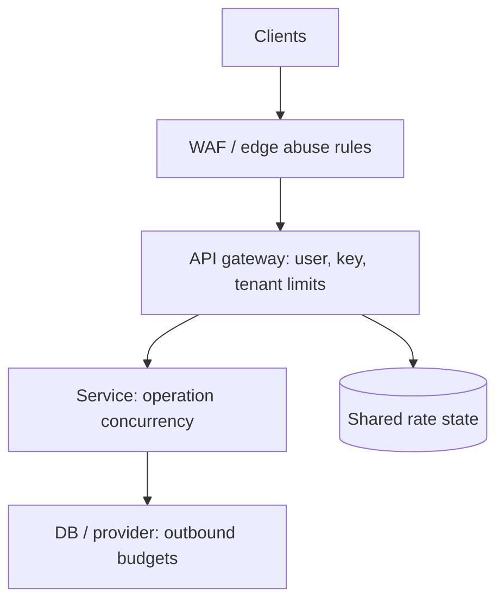

## Design a Rate Limiter for a Distributed Architecture

A rate limiter decides whether a request may proceed under a defined usage policy. It protects service capacity, distributes access fairly among clients and tenants, and enforces product quotas. For public APIs, I would apply a **per-identity token bucket at the API gateway** for controlled bursts, plus **service-level concurrency limits** for expensive operations and downstream dependencies. A distributed deployment needs shared or deliberately partitioned counters; an in-memory counter on each gateway replica is not a global limit. [Microsoft throttling design](https://learn.microsoft.com/en-us/azure/well-architected/design-guides/throttling)

## 1. Clarify the Policy Before the Algorithm

Ask what is limited: requests, expensive operations, bytes, database queries, or AI tokens? Is the limit per user, API key, tenant, IP, endpoint, or region? What burst should be allowed, and over what average period? Must enforcement be exact across all regions? What should happen if the counter store is unavailable? Does the client need a daily quota in addition to a short-term rate?

Example: a tenant may make an average of 100 requests/second with a burst of 200, while `/reports/export` allows only 5 concurrent operations. An anonymous login endpoint may have a separate per-IP/device abuse policy. A paid plan can have a daily quota; quota is a longer-term budget and should not be confused with momentary rate. Limits should match the resource that actually saturates.

## 2. Compare Algorithms

| Algorithm | State / rule | Burst behavior | Strength | Weakness / good fit |
| --- | --- | --- | --- | --- |
| Token bucket | Capacity `B`, refill `r` tokens/sec; request costs tokens | Allows bursts up to `B` after idle time | Simple, flexible average rate and burst | A burst can briefly overwhelm a dependency unless paired with concurrency control |
| Leaky bucket | Requests enter a bounded queue drained at steady rate | Smooth output until queue fills | Protects a downstream steady-rate dependency | Adds latency; stale queued requests may become useless; sometimes implemented as a meter rather than an actual queue |
| Fixed window | Count requests in aligned interval, e.g. each minute | Can admit roughly 2× limit around a boundary | Cheap and simple | Boundary burst; coarse fairness |
| Sliding window log | Keep timestamps in preceding interval | Strict moving-window control | Precise over any rolling interval | More memory and work per request |
| Sliding window counter | Combine recent adjacent buckets/segments | Smoother than fixed window | Lower state cost than exact log | Approximate near boundaries |

**Example boundary problem:** A fixed window allowing 100/minute can admit 100 requests at 12:00:59 and 100 more at 12:01:00. A rolling window sees about 200 requests in two seconds and rejects some. A token bucket with `B=200` and `r=100/60` tokens/sec intentionally allows up to 200 accumulated requests, then recovers gradually. Pick behavior based on the contract rather than claiming one algorithm is universally best. [ASP.NET Core rate limiting algorithms](https://learn.microsoft.com/en-us/aspnet/core/performance/rate-limit?view=aspnetcore-10.0) · [Redis algorithm comparison](https://redis.io/tutorials/howtos/ratelimiting/)

## 3. Token Bucket Mechanics

For a key such as `tenant-42:orders.read`, store current tokens `T` and last update time `t0`. At time `t`, refill:

```text
T = min(B, T + (t - t0) * r)
allow if T >= cost; if allowed, T = T - cost
save T and t
```

Use a trustworthy time source for a shared counter and perform refill, decision, decrement, and expiry **atomically**. A Redis Lua script is one way to avoid concurrent gateway instances both spending the same token. Set a TTL long enough to retain an active bucket but expire idle keys. For a denied request, estimate when enough tokens will return and include `Retry-After` when reliable. Weighted costs can charge an export more than a lightweight GET, but the policy must be clear to clients. [Redis rate limiter](https://redis.io/docs/latest/develop/use-cases/rate-limiter/)

## 4. Where Rate Limiting Lives



| Layer | What it protects | Typical key |
| --- | --- | --- |
| WAF/edge | Volumetric or anonymous abuse before app work | Source IP/network/device fingerprint, cautiously |
| API gateway | Fair client/tenant usage and contractual plans | Validated API key, `sub`, tenant, route |
| Service | Expensive operation and local saturation | Operation, tenant, in-flight count |
| Outbound dependency | Shared provider quota or DB connection budget | Provider credential/resource plus operation |

At the gateway, validate identity **before** using user/tenant claims as counter keys. Do not trust a caller-supplied `X-Tenant-Id`. For anonymous traffic, IP-based limits are coarse because NAT/proxies can share an address and attackers can rotate IPs. Service-level protection remains necessary even when each client is within its quota: 1,000 different clients can overload one database. [Microsoft throttling design](https://learn.microsoft.com/en-us/azure/well-architected/design-guides/throttling)

## 5. Distributed Counter Design

With N gateway replicas, per-replica memory counters can allow up to roughly N times the advertised limit if requests spread evenly. For a truly shared per-key limit, use a Redis cluster/managed cache or a gateway product with coordinated counters. Shard keys across Redis nodes and keep the read-decide-write operation atomic **for one key**. Monitor hot keys: one huge tenant can concentrate traffic on one counter shard.

Cross-region exactness is harder: a Redis call to one home region adds latency and a failure dependency; separate regional buckets are faster but may collectively overshoot. Options include a global authority, assigned regional budgets that sum to the global limit, or a documented approximate limit. The right choice depends on whether the policy is billing-critical, abuse mitigation, or a capacity guard. Azure API Management notes that distributed rate-limit enforcement is not perfectly exact; understand counter scope for the chosen tier and gateway topology. [Azure APIM rate-limit policy](https://learn.microsoft.com/en-us/azure/api-management/rate-limit-policy)

## 6. Redis Implementation Options

- **Fixed window:** `INCR` a time-bucket key with expiry in one atomic script. Simple and memory-efficient, but boundary bursts remain.
- **Sliding log:** A sorted set holds recent request timestamps; atomically trim, count, and add. Accurate but costly for hot keys/high rates. Give each request a unique member, not just an identical millisecond timestamp.
- **Sliding counter:** Store segmented counts and calculate a rolling approximation. Lower memory than a full log.
- **Token bucket:** Store token balance and last refill time, update in a Lua script using a consistent time source.

Bound counter cardinality. Millions of unique spoofed keys can consume Redis memory, so apply edge abuse controls, key TTLs, and memory alerts. Use namespaced keys that include policy version, tenant/client ID, and route group; do not put secrets or raw bearer tokens in key names. Redis documents atomic Lua operations for rate limiting. [Redis rate limiter](https://redis.io/docs/latest/develop/use-cases/rate-limiter/)

## 7. Concurrency Limits and Queueing

Rate and concurrency are different dimensions. A service processing 100 requests/sec with each call taking 10 seconds can have roughly 1,000 requests in flight. Add a **concurrency limiter** to bound memory, connections, and downstream saturation. A small wait queue may smooth short spikes, but an unbounded queue increases latency and can make timed-out clients' work pile up. Reject early or send work to a durable background queue for truly asynchronous tasks. A leaky-bucket scheduler intentionally smooths output; define a maximum wait and discard/expire irrelevant work.

ASP.NET Core offers fixed-window, sliding-window, token-bucket, and concurrency limiters. Its in-process middleware does not by itself make a policy globally exact across all replicas; use a shared coordinator if required. [ASP.NET Core rate limiting](https://learn.microsoft.com/en-us/aspnet/core/performance/rate-limit?view=aspnetcore-10.0)

## 8. HTTP Response and Client Behavior

On an actual request rate-limit violation, return **429 Too Many Requests**, a clear error code, and `Retry-After` when a useful retry time can be estimated. Optional limit/remaining/reset headers should reflect the specific policy and counter scope rather than promise precision the implementation lacks. Clients should respect the response, back off with jitter, and avoid retrying non-idempotent operations without an idempotency key. A **503 Service Unavailable** may be more appropriate for general backend overload that is not attributable to a particular caller's quota. [RFC 6585: 429](https://www.rfc-editor.org/rfc/rfc6585.html)

```http
HTTP/1.1 429 Too Many Requests
Retry-After: 3
Content-Type: application/problem+json

{"type":"rate_limit_exceeded","detail":"Retry this operation in 3 seconds."}
```

Avoid a gateway and service both performing automatic retries that amplify load. The limiter should be observable to the client without revealing another tenant's consumption.

## 9. Failure Mode: Counter Store Is Down

There is no universal fail-open or fail-closed answer:

| Policy | Possible fallback | Reason |
| --- | --- | --- |
| Login/abuse protection | Fail closed or severely limited local fallback | Security risk from unlimited attempts |
| Public low-cost read | Temporary bounded local limit | Preserve availability without unlimited load |
| Expensive provider operation | Fail closed or strict local budget | Protect external quota and cost |
| Billing quota | Reject or use durable metering/reconciliation | In-memory fallback can undercount billable use |

A local fallback must account for the number of gateway replicas; if each allows the full global quota, a Redis outage removes the intended protection. Use timeouts, circuit breakers, and a conservative per-replica emergency budget. Monitor Redis latency/error rate and rate-limit rejects so an outage is distinguishable from a real client traffic spike.

## 10. .NET Example: Local Policy and Its Boundary

This illustrates an ASP.NET Core **per-user in-process** token bucket. It is useful for service-local protection, but it is **not** one global counter across multiple instances.

```csharp
using System.Threading.RateLimiting;

builder.Services.AddRateLimiter(options =>
{
    options.RejectionStatusCode = StatusCodes.Status429TooManyRequests;
    options.AddPolicy("per-user", context =>
        RateLimitPartition.GetTokenBucketLimiter(
            partitionKey: context.User.FindFirst("sub")?.Value
                          ?? "anonymous",
            factory: _ => new TokenBucketRateLimiterOptions
            {
                TokenLimit = 60,
                TokensPerPeriod = 30,
                ReplenishmentPeriod = TimeSpan.FromMinutes(1),
                AutoReplenishment = true,
                QueueLimit = 0
            }));
});

app.UseAuthentication();
app.UseRateLimiter();
app.UseAuthorization();
app.MapGet("/api/items", () => Results.Ok())
   .RequireRateLimiting("per-user");
```

Place middleware in an order that makes the validated user available to the policy, and verify routing/auth behavior for the actual application. For a global distributed policy, use a gateway facility with the correct counter scope or a Redis-backed atomic implementation rather than assuming this local code shares state. [ASP.NET Core rate limiting](https://learn.microsoft.com/en-us/aspnet/core/performance/rate-limit?view=aspnetcore-10.0)

## 11. Monitoring and Tests

Track allowed/rejected requests by policy and tenant tier, Redis latency and errors, hot keys, concurrency queue length, upstream 429/503, retry storms, and downstream CPU/DB saturation. Do not use raw tenant IDs as high-cardinality metric labels without controlling cardinality; detailed IDs can live in sampled logs/traces. Test the fixed-window boundary, distributed concurrent hits on the same key, region partition, clock behavior, counter expiry, gateway scale-out, and Redis failure. Load-test whether permitted bursts exceed backend capacity.

## 12. Two-Minute Interview Answer

> I would first define the subject and contract: per user or tenant, per route, average rate, allowed burst, and what happens on counter-store failure. I usually choose a token bucket for public API traffic because it allows controlled bursts while enforcing an average rate. Fixed windows are cheap but have boundary spikes; sliding windows give smoother fairness at higher state cost; a leaky bucket is useful when a downstream system needs a steady output rate but adds queueing latency. I would apply identity-based limits at the API gateway, earlier coarse abuse limits at the edge, and service-level concurrency limits to protect expensive operations and databases. Across gateway replicas, I would use an atomic Redis operation or a managed gateway counter and explicitly define cross-region counter scope. Rejected clients receive 429 and useful retry guidance. If Redis fails, the fallback is policy-specific: a bounded local allowance for safe reads, but stricter behavior for login abuse and expensive provider calls. I would test high concurrency, hot keys, boundary bursts, and cache-store outages.

## 13. Common Interview Follow-Ups

**Why not rate-limit only by IP?** NAT shares addresses, mobile IPs change, and attackers rotate IPs. Use authenticated identity or API key when available; retain IP controls for anonymous abuse.

**Can Redis make a global rate limit exact?** An atomic operation makes one key's update safe on that Redis authority, but cross-region replication, failover, and network partitions still create availability and precision tradeoffs.

**What about 100 requests/minute across 10 gateway nodes?** Ten independent 100/minute counters can allow roughly 1,000/minute. Use shared state or allocate 10/minute per node with fairness limitations.

**Should rejected requests consume tokens?** Define the policy. Usually a denied request does not consume a successful-use token, but abuse detection may count attempts separately.

**How do you limit a costly AI or export endpoint?** Use weighted request cost or a separate token/usage budget plus in-flight concurrency and downstream quota controls.

**What if the client retries after 429?** Respect `Retry-After` and jitter. A burst of synchronized retries can cause another overload wave.

## 14. Mistakes to Avoid

- Saying sliding window is always exact without distinguishing log from approximate counter.
- Using a per-process limiter and calling it a global tenant quota.
- Relying only on a gateway limit while one expensive route saturates the database.
- Trusting an unvalidated tenant header as a limiter key.
- Returning 429 without telling clients how to back off when a useful estimate exists.
- Using an unbounded leaky-bucket queue that retains requests after their deadlines.
- Failing open with the full per-tenant allowance on every gateway replica.
- Ignoring multi-region state and counter-store failure behavior.

## 15. Primary References

- [Microsoft: ASP.NET Core rate limiting](https://learn.microsoft.com/en-us/aspnet/core/performance/rate-limit?view=aspnetcore-10.0)
- [Microsoft: Throttling design guide](https://learn.microsoft.com/en-us/azure/well-architected/design-guides/throttling)
- [Microsoft: Azure API Management rate-limit policy](https://learn.microsoft.com/en-us/azure/api-management/rate-limit-policy)
- [Redis: Rate limiter](https://redis.io/docs/latest/develop/use-cases/rate-limiter/)
- [RFC 6585: 429 Too Many Requests](https://www.rfc-editor.org/rfc/rfc6585.html)
