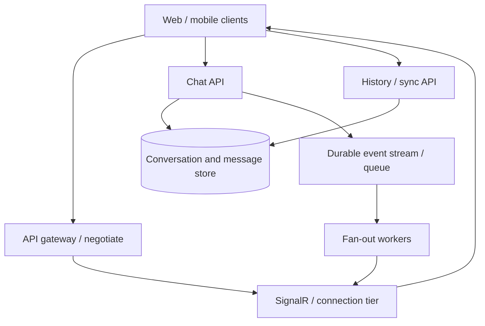

## Design a Real-Time Application: Chat, Trading, or Tracking

A real-time system delivers updates to connected clients with low latency while preserving the business guarantees those updates represent. For a .NET chat application, I would use ASP.NET Core SignalR (often with Azure SignalR Service at large Azure scale) for live delivery, plus a durable message store and a reconnect/catch-up API. WebSockets is a transport; SignalR is a framework that uses WebSockets when possible and can fall back to other transports. Polling is a simpler alternative when latency or traffic does not justify persistent connections. [ASP.NET Core SignalR overview](https://learn.microsoft.com/en-us/aspnet/core/signalr/introduction) · [Azure SignalR overview](https://learn.microsoft.com/en-us/azure/azure-signalr/signalr-overview)

## 1. Clarify Requirements and Capacity

Ask about peak concurrent connections, messages/updates per second, group sizes, latency targets, delivery guarantees, ordering scope, history retention, regions, mobile background behavior, and reconnect expectations. Distinguish a chat message from a stock quote: chat usually needs durable history and user-level receipts; market prices may prioritize the latest state and tolerate dropped intermediate quotes; tracking may tolerate periodic samples but require accurate last known position.

**Example:** 2 million daily active users, 200,000 concurrent connections at peak, and 20,000 inbound messages/second. If each message fans out to an average of 5 online recipients, outbound delivery demand is near 100,000 client sends/second before typing/presence updates and retries. Size the system for **connections, outbound fan-out, message size, and network egress**, not just HTTP requests per second. Numbers are illustrative and should be checked against service quotas and load tests.

## 2. High-Level Chat Architecture



The connection tier handles live sessions; the API and database own durable messages and permissions. A message event reaches fan-out workers and online clients. On reconnect, the client fetches missing messages from the authoritative history using a cursor. Do not treat an in-memory hub send as durable storage.

## 3. WebSockets vs SignalR vs Polling

| Option | How it works | Good fit | Main tradeoff |
| --- | --- | --- | --- |
| Raw WebSockets | Persistent, bidirectional socket; application defines framing/protocol | Custom protocol, very high control, mixed languages | You own reconnect, groups, fan-out, auth refresh, and scale-out behavior |
| ASP.NET Core SignalR | Hubs, users/groups, connection management; prefers WebSockets and can fall back to SSE/long polling | .NET web/mobile real-time features | Framework/protocol overhead and service-specific scaling decisions |
| Long polling | Repeated HTTP request waits for an update, then reconnects | Restricted networks or fallback | More requests and connection churn under high concurrency |
| Short polling | Client periodically requests current state | Low-frequency dashboards/tracking | Latency and wasted requests between changes |
| Server-Sent Events | One-way server-to-client stream over HTTP | Live feeds where client sends changes by ordinary HTTP | One-way transport and reconnection/state design still needed |

SignalR is **not a competitor transport to WebSockets**; it abstracts transport and provides hubs, group/user addressing, and client libraries. WebSockets generally gives the lowest transport overhead for bidirectional updates, but business durability and ordering remain application concerns. [SignalR transports](https://learn.microsoft.com/en-us/aspnet/core/signalr/introduction) · [SignalR configuration](https://learn.microsoft.com/en-us/aspnet/core/signalr/configuration)

## 4. Message Write and Delivery Flow

1. Client sends `SendMessage(conversationId, clientMessageId, text)` to an authenticated API or hub method.
2. Server checks membership, size/rate limits, and content rules. It writes a message to the conversation store under a unique `(senderId, clientMessageId)` key and assigns a server message ID and per-conversation sequence.
3. In the same local transaction, record an outbox event; a publisher moves it to a durable broker. This prevents a stored message from silently losing its fan-out event.
4. Fan-out workers send the event to the relevant user/group connections. A recipient can have several devices; online delivery is separate from persistent message state.
5. Sender receives a durable acceptance acknowledgement. Recipient delivery/read receipts, if required, are separate state transitions, not implied by a successful hub send.
6. A reconnecting client calls `GET /conversations/{id}/messages?afterSequence=...` to fill gaps, then resumes live events and deduplicates by server message ID.

The outbox is useful when the database and broker cannot commit atomically. A client retry with the same `clientMessageId` must return the same stored message. Live fan-out can be duplicated or missed during failures; history plus cursor-based catch-up closes the gap.

## 5. Connection Scaling

Each persistent connection consumes network, memory, and heartbeat/keepalive capacity. Scale independently from the business APIs. Maintain a connection-to-user identity mapping and route group/user messages through a shared scale-out mechanism; an API replica does not know all connections held by other replicas.

**Azure SignalR Service:** Clients connect to the managed service after negotiation, while application servers handle business logic and send messages via service connections. This offloads large client connection counts and cross-server fan-out. Plan service units, connection headroom, regional topology, quotas, and cost based on concurrent connections **and message volume**. Scale ahead of saturation; reconnect storms can exceed available capacity. [Azure SignalR scaling](https://learn.microsoft.com/en-us/aspnet/core/signalr/scale) · [Azure SignalR autoscale](https://learn.microsoft.com/en-us/azure/azure-signalr/signalr-howto-scale-autoscale)

**Self-hosted SignalR:** Place replicas behind a load balancer and use a Redis backplane or another supported scale-out design for cross-instance broadcasts. Follow the hosting guidance for sticky sessions in applicable configurations; Redis backplane itself does not make persistent connection state durable. Microsoft recommends Azure SignalR Service for Azure-hosted ASP.NET Core SignalR applications. [SignalR scale-out](https://learn.microsoft.com/en-us/aspnet/core/signalr/scale) · [Redis backplane](https://learn.microsoft.com/en-us/aspnet/core/signalr/redis-backplane)

Do not assume 200,000 connections means 200,000 application worker threads. The limits are often memory, file/socket handles, network throughput, heartbeats, and fan-out. Load-test realistic idle-to-active ratios, mobile reconnect patterns, and a hot group with very many subscribers.

## 6. Groups, Presence, and Authorization

Groups represent delivery targets such as `conversation:123`; they are **not** proof that a user is authorized to read that conversation. Check membership against the authoritative store when joining and when executing sensitive operations. Group membership/connection state is transient; clients may need to rejoin after reconnect. Track presence with short-lived heartbeats/leases in a shared store if the product needs it, but model presence as approximate due to disconnect delays and mobile backgrounding. [SignalR groups](https://learn.microsoft.com/en-us/aspnet/core/signalr/groups)

Use an access token at connection establishment. Handle expiry and revocation according to product risk: short-lived tokens, refreshed connection credentials, and server-side membership checks for operations. A connection established while authorized should not retain access forever after a user is removed from a private group; define revocation and disconnect behavior.

## 7. Ordering, Duplicates, and Delivery Guarantees

Assign an increasing sequence **per conversation** at the authoritative write path. A client renders messages by sequence and deduplicates by server message ID. Global ordering across all chats is unnecessary and costly. If messages arrive out of order, fetch the missing range before advancing the durable cursor. Concurrent writers to one conversation need transactional sequence allocation or another serialization scheme that avoids duplicate or skipped committed sequence numbers.

A successful SignalR send means the server/service accepted the send operation, **not** that the user read it or that every device received it. Use separate statuses: `Stored`, `Dispatched`, `DeliveredToDevice` (if clients acknowledge), and `Read` (client explicitly reports). Client acknowledgements can themselves be duplicated; persist them idempotently. Exactly-once end-to-end delivery should not be promised. [SignalR overview](https://learn.microsoft.com/en-us/aspnet/core/signalr/introduction)

## 8. Backpressure and Hot Fan-Out

A single group with hundreds of thousands of connections can dominate egress. Bound per-client send queues and message sizes; disconnect or degrade persistently slow consumers. Batch/coalesce state updates where possible: for a live map, send the latest position rather than every intermediate GPS sample; for a market quote, replace stale intermediate prices with a newer snapshot. **Do not coalesce durable chat messages or executed trades**, where each event matters.

Apply per-user and per-tenant send limits, cap group subscriptions, and separate high-priority transactional events from noisy presence/typing indicators. Use a durable broker where fan-out must survive worker restarts, but the broker is not a substitute for the client catch-up protocol. Monitor outbound queue age and oldest unsent event in addition to connection count.

## 9. Reconnect, Failover, and Multi-Region Design

Clients reconnect with exponential backoff and jitter, reauthenticate, rejoin authorized groups, and request messages after the last **persisted** sequence they applied. A connection ID can change on reconnect, so do not use it as a stable user ID. During deploys, drain connections where supported and expect a reconnection surge. Test node and zone loss, managed service interruption, Redis backplane failure, and broker backlog.

For global users, place connection endpoints close to clients when latency justifies it. Define an authoritative home region or consistent conversation partition so writes for one conversation have a clear order; replicate history to other regions according to stated consistency and recovery goals. A region failover may change connection endpoint and briefly interrupt delivery; the cursor-based catch-up path recovers missed messages. Do not claim multi-region active-active ordering without a conflict and sequencing design.

## 10. Trading and Tracking Variations

| Requirement | Chat | Trading | Tracking |
| --- | --- | --- | --- |
| Authoritative data | Durable conversation history | Exchange/order state and trade ledger | Latest position plus selected history |
| Ordering | Per conversation | Per instrument/order/venue as defined by business rules | Per device/asset with event time and sequence |
| Loss tolerance | Live event may be recovered from history | Executed trades/order acknowledgements must be durably reconciled | Intermediate locations may be skipped; latest state matters |
| Delivery strategy | Fan-out to conversation participants | Broadcast market data separately from authenticated order actions | Coalesce frequent location updates and send deltas |
| Security | Conversation membership | Strict client entitlements and audit | Asset/tenant ownership and location privacy |

For trading, never let a WebSocket message alone be the system of record for an order or execution. Market data feeds can use snapshots plus incrementals and sequence-gap recovery; order placement requires idempotency and authoritative confirmations. For tracking, handle out-of-order GPS points, mobile connectivity gaps, and per-device retention.

## 11. .NET SignalR Implementation Sketch

This illustrative hub checks group membership before joining and uses a separate application service for durable writes. Add the required SignalR service and, on Azure at scale, configure Azure SignalR Service according to the selected hosting mode.

```csharp
builder.Services.AddSignalR();
app.MapHub<ChatHub>("/hubs/chat");

public sealed class ChatHub(
    IConversationAccess access,
    IMessageService messages) : Hub
{
    public async Task JoinConversation(Guid conversationId)
    {
        var userId = Context.UserIdentifier
            ?? throw new HubException("Authentication required.");
        if (!await access.CanReadAsync(userId, conversationId))
            throw new HubException("Access denied.");

        await Groups.AddToGroupAsync(
            Context.ConnectionId, $"conversation:{conversationId}");
    }

    public async Task SendMessage(Guid conversationId,
        Guid clientMessageId, string text)
    {
        var userId = Context.UserIdentifier
            ?? throw new HubException("Authentication required.");
        await messages.StoreAndQueueAsync(
            userId, conversationId, clientMessageId, text);
    }
}
```

A background publisher sends committed outbox messages using `IHubContext<ChatHub>` to the authorized group. Keep hub methods thin, validate input, and never rely solely on a group name supplied by the client. [ASP.NET Core SignalR overview](https://learn.microsoft.com/en-us/aspnet/core/signalr/introduction) · [SignalR groups](https://learn.microsoft.com/en-us/aspnet/core/signalr/groups)

## 12. Monitoring and Tests

Measure concurrent connections, connection failures, reconnect rate, negotiation latency, inbound/outbound messages per second, group fan-out distribution, per-client queue growth, send latency, dropped/coalesced ephemeral events, broker lag, history catch-up gaps, and costs. Trace a message by `clientMessageId`, server ID, conversation ID, and correlation ID without logging private content unnecessarily.

Load-test many idle connections plus bursts of active traffic, a viral group, slow clients, expired auth, duplicates, out-of-order delivery, node failures, and a full reconnect storm. Verify that every stored chat message remains available through the history API even if a live push is missed.

## 13. Two-Minute Interview Answer

> I would clarify concurrent connections, message rate, fan-out, latency, and whether the data must be durable. For a .NET chat system I would use SignalR for bidirectional live updates, with Azure SignalR Service to offload connections and cross-server fan-out at Azure scale. The Chat API stores each message with a client idempotency ID and per-conversation sequence, writes an outbox event, and then fans it out to online users. A hub send is not proof of delivery, so reconnecting clients authenticate, rejoin authorized groups, and fetch messages after their last sequence from the durable store. I would use short polling for low-frequency use cases, and raw WebSockets only when a custom protocol/control requirement justifies implementing reconnect, groups, and scale-out ourselves. I would scale on concurrent connections and outbound fan-out, apply backpressure to slow clients, and test reconnect storms, hot groups, broker failure, and region failover. For trading, the order ledger is authoritative; for tracking, I would coalesce intermediate location updates while retaining needed history.

## 14. Common Interview Follow-Ups

**Does SignalR require WebSockets?** No. It prefers WebSockets where supported and can use other transports such as Server-Sent Events or long polling.

**Do I need sticky sessions?** It depends on the hosting and transport/scale-out configuration. Self-hosted multi-node SignalR commonly requires them; Azure SignalR Service changes how clients connect. Follow the selected deployment guidance.

**Does a Redis backplane store missed chat messages?** No. Use a durable message store and catch-up API for history and offline delivery.

**Can I use SignalR groups for authorization?** No. Verify membership in the authoritative service before joining and on relevant operations; group delivery alone is not an access-control policy.

**How do I avoid duplicates after reconnect?** Use stable client and server message IDs, idempotent storage, per-conversation sequence, and client deduplication.

**How would you handle an offline user?** Store messages durably; on reconnect the client fetches missing history. Optionally trigger a push notification through a separate notification service.

## 15. Mistakes to Avoid

- Equating WebSockets and SignalR as mutually exclusive technologies.
- Treating a successful hub send as durable storage or read acknowledgement.
- Storing the only copy of chat history in Redis or hub memory.
- Assuming group membership is persistent and secure by itself.
- Scaling API CPU while ignoring connection memory, outbound bandwidth, and fan-out.
- Sending every high-frequency market/GPS update to slow clients without backpressure.
- Promising global order or exactly-once delivery across regions without a durable sequencing protocol.

## 16. Primary References

- [Microsoft: ASP.NET Core SignalR overview](https://learn.microsoft.com/en-us/aspnet/core/signalr/introduction)
- [Microsoft: SignalR hosting and scaling](https://learn.microsoft.com/en-us/aspnet/core/signalr/scale)
- [Microsoft: Redis backplane for SignalR](https://learn.microsoft.com/en-us/aspnet/core/signalr/redis-backplane)
- [Microsoft: Azure SignalR Service](https://learn.microsoft.com/en-us/azure/azure-signalr/signalr-overview)
- [Microsoft: SignalR groups and users](https://learn.microsoft.com/en-us/aspnet/core/signalr/groups)
