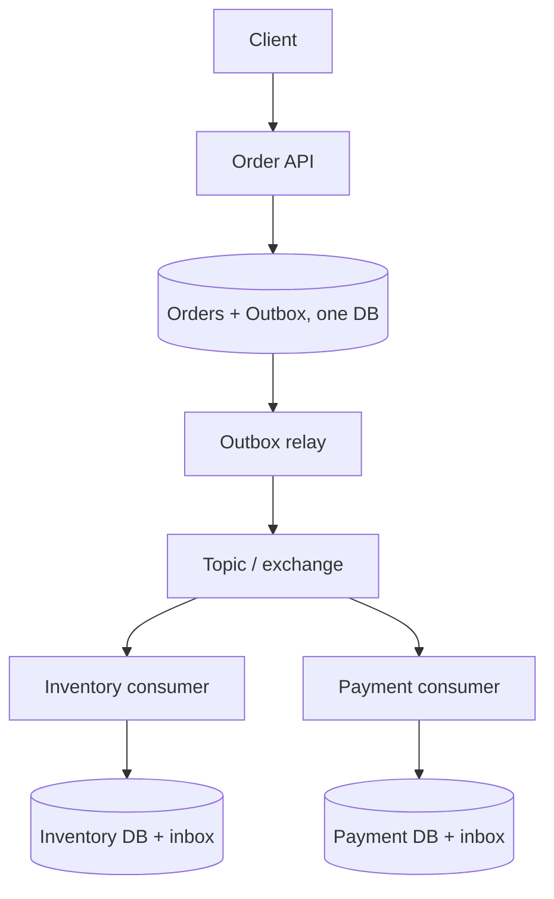

# Design a Reliable Order Processing System Using the Outbox Pattern

## Design a Reliable Order Processing System Using the Outbox Pattern

The core requirement is: **if the Order service commits an order, its `OrderPlaced` event must eventually reach the broker**. The service cannot atomically commit an ordinary database transaction and publish to Kafka, Azure Service Bus, or RabbitMQ in one local transaction. The transactional outbox solves this by committing the order and an outbox record **in the same database transaction**. A separate relay publishes the record later. This yields eventual, typically at-least-once delivery; consumers must tolerate duplicates. [Microsoft .NET microservices guidance](https://learn.microsoft.com/en-us/dotnet/architecture/microservices/architect-microservice-container-applications/asynchronous-message-based-communication) · [AWS transactional outbox](https://docs.aws.amazon.com/prescriptive-guidance/latest/cloud-design-patterns/transactional-outbox.html)

## 1. Requirements and Business Boundaries

Assume `POST /orders` creates an order in `Pending` state. Inventory and Payment services consume `OrderPlaced` and participate in the follow-up workflow. Clarify whether the API promises only durable acceptance or a fully confirmed order. In this design, it returns an order ID and `Pending` status after the **database transaction** commits; inventory and payment complete asynchronously. An order that cannot be fulfilled is later cancelled or compensated by a Saga.

The key invariants are:

- A committed order has a corresponding committed outbox record.
- A rolled-back order has no publishable `OrderPlaced` record.
- No event is intentionally acknowledged as published until the broker confirms receipt.
- A duplicate publish or delivery cannot create a duplicate business effect.
- Operations can see stuck outbox rows and orders that remain pending too long.

## 2. The DB + Broker Dual-Write Problem

A naive handler writes the order and publishes the event as two separate actions:

```text
Save Order in database
Publish OrderPlaced to message broker
```

If the database succeeds and publish fails, the order exists but downstream services never learn about it. Reversing the order does not fix it: publish can succeed and the database commit can fail, leaving a phantom event. A crash or timeout between these calls creates the same uncertainty. Retrying the entire HTTP request can create another order unless the request itself is idempotent. A `try/catch`, a process-local queue, or a broker transaction alone cannot make these two independent writes atomic. [AWS transactional outbox](https://docs.aws.amazon.com/prescriptive-guidance/latest/cloud-design-patterns/transactional-outbox.html)

## 3. Proposed Architecture



Order owns its database and writes both tables within one local ACID transaction. A relay polls committed rows or reads database change data capture (CDC), publishes messages, and records progress. Inventory and Payment own separate databases and handle duplicates independently. Outbox addresses the Order service's DB-to-broker boundary; it does not itself guarantee that the entire multi-service order succeeds. [Debezium outbox event router](https://debezium.io/documentation/reference/stable/transformations/outbox-event-router.html)

## 4. Data Model and Event Contract

A practical schema could be:

```sql
CREATE TABLE Orders (
    Id uuid PRIMARY KEY,
    CustomerId uuid NOT NULL,
    Status text NOT NULL,
    CreatedAtUtc timestamptz NOT NULL,
    Version integer NOT NULL
);

CREATE TABLE OutboxMessages (
    Id uuid PRIMARY KEY,
    AggregateType text NOT NULL,
    AggregateId uuid NOT NULL,
    AggregateVersion integer NOT NULL,
    EventType text NOT NULL,
    SchemaVersion integer NOT NULL,
    Payload jsonb NOT NULL,
    OccurredAtUtc timestamptz NOT NULL,
    Status text NOT NULL,
    Attempts integer NOT NULL DEFAULT 0,
    NextAttemptAtUtc timestamptz NULL,
    PublishedAtUtc timestamptz NULL,
    LockedUntilUtc timestamptz NULL
);

CREATE INDEX IX_Outbox_Due
ON OutboxMessages (Status, NextAttemptAtUtc, OccurredAtUtc);
```

This is illustrative PostgreSQL DDL; adapt types and worker-claim strategy to the actual database. `Id` is the stable **event ID** across every retry. `AggregateId` (the order ID) is the broker key/session ID when per-order ordering matters. `AggregateVersion` helps consumers reject out-of-order state changes. Add a correlation ID, trace context, and producer name as needed. Keep personally sensitive data out of the payload unless required; version the event schema for independently deployed consumers.

## 5. Order API: One Database Transaction

In an EF Core service, add both entities to the same `DbContext` and commit together. The following is illustrative C#; it omits validation, authentication, cancellation handling, and response mapping:

```csharp
public async Task<Guid> PlaceOrderAsync(
    PlaceOrderRequest request, CancellationToken ct)
{
    var orderId = Guid.NewGuid();
    var eventId = Guid.NewGuid();
    var order = new Order(orderId, request.CustomerId, "Pending", version: 1);

    var evt = new OrderPlacedV1(
        EventId: eventId,
        OrderId: orderId,
        CustomerId: request.CustomerId,
        Version: 1,
        OccurredAtUtc: DateTimeOffset.UtcNow);

    var outbox = OutboxMessage.Create(
        id: eventId,
        aggregateId: orderId,
        aggregateVersion: 1,
        eventType: "OrderPlaced",
        schemaVersion: 1,
        payload: JsonSerializer.Serialize(evt));

    db.Orders.Add(order);
    db.OutboxMessages.Add(outbox);
    await db.SaveChangesAsync(ct); // One DB transaction for this SaveChanges call.
    return orderId;
}
```

One `SaveChangesAsync` normally makes these inserts atomic with a relational EF Core provider. If the handler performs multiple saves or other database statements, use an explicit transaction on the **same database** and commit only after both writes succeed. Publishing inside the transaction is not the outbox solution: it extends lock time and still cannot atomically commit the broker with the database. The API should also accept a **client idempotency key** and store it under a unique constraint with the order/result to handle a response lost after commit; outbox event deduplication alone does not prevent duplicate orders.

## 6. Relay: Publish, Confirm, Mark Progress

A background service selects due, committed outbox rows in bounded batches. With multiple relay instances, claim rows using a database-supported leasing/locking mechanism; make the lease expire so a crashed worker does not strand them. Publish with `MessageId = OutboxMessages.Id` and `Key/SessionId = AggregateId`, wait for the broker's acknowledgement, then mark the row published. On send error, increment attempts, record the error class, and schedule a bounded backoff with jitter.

```text
repeat:
  claim a bounded set of due outbox rows with an expiring lease
  for each row:
    send to broker using stable event ID and aggregate key
    await broker confirmation
    mark PublishedAtUtc and Status = Published in DB
  release/retry failures with backoff
```

Do not mark a row published before receiving broker confirmation. A broker timeout can mean “not sent” **or** “sent but acknowledgement lost”; retry with the same ID. If publishing succeeds but the database update fails, the relay will publish it again. Therefore **the outbox guarantees no lost event from a committed order under eventual recovery, but does not guarantee only one broker delivery**. Broker-side duplicate detection may help within its scope; consumer idempotency is still required. [AWS transactional outbox](https://docs.aws.amazon.com/prescriptive-guidance/latest/cloud-design-patterns/transactional-outbox.html) · [Azure Service Bus delivery and duplicate handling](https://learn.microsoft.com/en-us/azure/service-bus-messaging/service-bus-message-loss-and-duplicates)

A polling relay is relatively simple and works with many relational databases. CDC reads committed outbox inserts from the database log and can reduce polling overhead, but adds connector operation, lag monitoring, and careful handling of schema and checkpoint recovery. Both approaches preserve the same duplicate caveat. [Debezium outbox event router](https://debezium.io/documentation/reference/stable/transformations/outbox-event-router.html)

## 7. Consumer: Inbox and Business Idempotency

Each consumer should atomically record its processing marker **with its local business update**. For example, Inventory enforces `UNIQUE (ConsumerName, EventId)` in an `InboxMessages` table. In a local transaction, it inserts the marker, reserves stock using an inventory-safe conditional operation, and commits. A duplicate marker means this consumer already applied the event, so it acknowledges without repeating the reservation. Do not let a failed stock reservation become a false “processed” marker: commit the outcome and resulting event according to the business state machine.

```text
receive OrderPlaced(eventId, orderId)
begin local DB transaction
  if (InventoryConsumer, eventId) already exists:
      commit; acknowledge; return
  reserve stock atomically or record a business rejection
  insert inbox marker and an outgoing outcome event into local outbox
commit
acknowledge incoming message
```

If the consumer crashes after its database commit but before broker acknowledgement, redelivery reaches the inbox check and does not reserve twice. Payment also needs a stable payment-provider idempotency key and reconciliation for an uncertain external response; an inbox transaction cannot atomically commit a third-party card charge. [Microsoft idempotent consumer pattern](https://learn.microsoft.com/en-us/azure/architecture/patterns/idempotent-consumer)

## 8. Failure Matrix

| Failure point | Durable state | Recovery |
| --- | --- | --- |
| Order DB transaction fails | Neither order nor outbox row commits | Return failure; safe client retry using idempotency key |
| API crashes after DB commit before response | Order and outbox exist | Client retries with same key and gets same order ID |
| Broker is unavailable | Order and pending outbox row exist | Relay retries; API does not falsely claim order confirmed |
| Relay crashes before sending | Row remains pending or lease expires | Another relay sends it |
| Broker accepted send but acknowledgement is lost | Row may remain pending | Retry same event ID; consumer deduplicates |
| Broker accepted send; marking Published fails | Row remains publishable | Duplicate publish possible; consumer deduplicates |
| Consumer commits but acknowledgement fails | Business effect and inbox marker committed | Redelivery becomes a no-op |
| Poison payload/schema error | Message cannot be safely processed | DLQ/quarantine, alert, fix, replay using original identity |

## 9. Ordering and Scaling

An outbox table ordered by timestamp does not automatically guarantee strict broker or consumer order: concurrent relay workers, retries, partitions, and rebalances can reorder effects. If order transitions must be sequential, assign an `AggregateVersion`, route the same `OrderId` to the same Kafka partition or Service Bus session where applicable, and have consumers validate the expected version. For strict per-order publication order, serialize publishing for that aggregate or use a proven per-aggregate claiming strategy. Do not let one failed version silently allow a later version to violate state rules.

Scale relay workers with bounded batches, expiring claims, sensible indexes, and broker backpressure. Keep DB connection and broker throughput limits in mind. Archive/delete old published rows according to retention and audit needs; partition a very large outbox by time only after measuring. A growing pending backlog is a reliability incident, even if order writes still work.

## 10. Operations and Observability

Track pending outbox count, oldest pending age, time from DB commit to publish, relay attempts, publish error rate, lease expirations, consumer lag, duplicate detections, DLQ age, and orders stuck in `Pending`. Carry `orderId`, `eventId`, and `correlationId` through logs and traces. Alert on **age**, not only row count: one old event can represent a blocked business process. Provide a safe operator replay workflow that preserves event identity. Run failure tests at every point in the matrix.

## 11. Two-Minute Interview Answer

> The dual-write problem occurs when an Order service saves an order and publishes `OrderPlaced` as separate operations. If either fails after the other succeeds, the database and broker disagree. I would use a transactional outbox: save the pending order and an outbox row with a stable event ID in the same database transaction. A background relay claims committed rows, sends the event, waits for broker confirmation, and marks the row published. If the relay crashes after send but before marking, it may resend, so I assume at-least-once delivery. Every consumer stores a unique event ID in an inbox alongside its local business update, and external payment calls use idempotency keys. The API returns an order ID and pending status after the database commit; downstream inventory/payment results drive a Saga to confirmation or compensation. I would monitor outbox age, consumer lag, retries, DLQs, and stuck orders, and test crashes at each boundary.

## 12. Follow-Up Questions

**Does the outbox give exactly-once end-to-end processing?** No. It makes the local order/outbox write atomic and supports eventual publishing. Duplicate broker sends and deliveries remain possible. Idempotent consumer effects are needed.

**Can I publish before committing?** That can expose an event for an order that later rolls back. Commit the order and outbox together; let the relay publish after commit.

**Can I delete an outbox row immediately after send?** A delete/update can fail after the broker accepted the message, which still allows duplicates. Use durable progress and a retention policy so failures can be diagnosed.

**Polling or CDC?** Polling is simpler and often sufficient; CDC can improve timely, scalable relay behavior at the cost of connector and log management. Measure requirements.

**How is this related to Saga?** Outbox guarantees reliable event publication at each local DB/broker boundary. Saga coordinates the overall business workflow and compensation between services. They complement each other.

## 13. Mistakes to Avoid

- Assuming a `try/catch` makes a database commit and broker send atomic.
- Returning `Confirmed` when the system only created a pending order.
- Generating a new event ID on each relay retry.
- Marking an outbox row published before broker confirmation.
- Assuming broker duplicate detection replaces consumer idempotency.
- Forgetting client idempotency when the HTTP response can be lost after commit.
- Treating a broker timeout as definitive failure or success.
- Ignoring publication order, stuck rows, retention, and operational replay.

## 14. Primary References

- [AWS Prescriptive Guidance: Transactional outbox pattern](https://docs.aws.amazon.com/prescriptive-guidance/latest/cloud-design-patterns/transactional-outbox.html)
- [Microsoft: Asynchronous message-based communication in .NET microservices](https://learn.microsoft.com/en-us/dotnet/architecture/microservices/architect-microservice-container-applications/asynchronous-message-based-communication)
- [Microsoft: Idempotent Consumer pattern](https://learn.microsoft.com/en-us/azure/architecture/patterns/idempotent-consumer)
- [Debezium: Outbox Event Router](https://debezium.io/documentation/reference/stable/transformations/outbox-event-router.html)


**Solving the Dual-Write Problem**

- The Dual-Write Trap: Writing to a database and then sending a message to a broker in one flow can fail midway, leaving the database updated but the event lost (or - vice versa).Atomic Transaction: Instead of calling the broker directly, the application saves the order and writes an event into an outbox table in the same database using a single ACID transaction.
- Single Write Target: The database guarantees that either both the order and the outbox event are saved, or neither is, which completely removes the dual-write risk.

**System Design and Flow**

- Order Creation Request: The client sends an order request to the Order Service.
- Database Commit: The service opens a local transaction, inserts the record into the orders table, and inserts a corresponding OrderCreated event with a PENDING status into the outbox table.
- Background Relay / Publisher: A separate background worker reads pending rows from the outbox table.
- Broker Publish: The worker publishes the event payload to the message broker (such as Kafka or RabbitMQ).
- Status Update: Once the broker acknowledges receipt, the worker updates the outbox row status to PUBLISHED (or deletes the row)

**Implementation Approaches**

- Polling Publisher: A scheduled thread or cron job periodically queries the outbox table for PENDING records. This is simple to build but adds slight delivery delay and load to the database.
- Change Data Capture (CDC): Tools like Debezium tail the database transaction log (WAL or binlog) and stream committed outbox changes directly to the broker without polling the table

**Handling Failures and Idempotency**
- At-Least-Once Delivery: If the publisher crashes after sending the message but before updating the table, the message may be resent, ensuring at-least-once delivery.
- Consumer Idempotency: Downstream services must handle duplicate events safely by tracking unique event IDs or using idempotency keys


