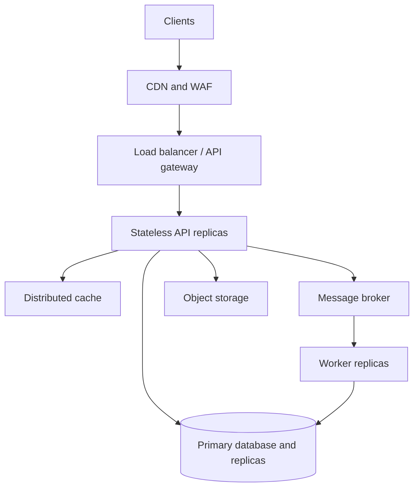

# Design a system for millions of requests/users.

## Design a System for Millions of Users and Requests

This guide gives an interview-ready design for a high-traffic web application, such as an e-commerce platform or content service. The goal is to explain the design process, the major scaling techniques, and the tradeoffs an experienced engineer should discuss.

## 1. Start With Requirements and Numbers

Ask what “millions” means before proposing components. One million registered users does not imply one million simultaneous requests.

Clarify:

- Core operations: browsing, searching, placing orders, updating profiles, uploading files.
- Read/write ratio, peak traffic, geographic distribution, and expected growth.
- Latency targets, availability target, consistency needs, data retention, and failure budget.
- Which requests require an immediate response and which can finish in the background.

Example assumptions for discussion: 10 million daily active users, 100 million requests/day, 10:1 peak-to-average traffic, 90% reads, and a 200 ms p95 target for simple cached reads. Average throughput is about 1,160 requests/second; a 10× peak is about 11,600 requests/second. Design with headroom and measure actual endpoint-level demand. If 10% of peak requests write data, expect roughly 1,160 writes/second before retries. These are illustrative inputs, not guaranteed capacity numbers.

## 2. High-Level Architecture

Keep API instances stateless so any healthy replica can serve a request. Store durable data in databases/object storage and short-lived shared data in a distributed cache. Separate latency-sensitive requests from background jobs.

## 3. Load Balancing

A load balancer distributes traffic across healthy API instances. At the edge, DNS or a global traffic manager can route users to a nearby healthy region; a regional layer-7 balancer routes HTTP traffic to application replicas. A CDN can serve static assets and cache eligible public responses before they reach the origin.

- Use health checks and readiness checks so instances receive traffic only when dependencies needed for service are available.
- Use connection draining during deployments and graceful shutdown for in-flight requests.
- Set timeouts and limits at each hop; an unlimited queue at the load balancer merely hides overload.
- Prefer stateless authentication (for example, validated JWTs) or shared session storage over sticky sessions where practical.
- Rate-limit by user/client and protect costly endpoints; configure WAF and DDoS controls as appropriate.

**Interview point:** A load balancer spreads traffic, but cannot fix a slow database or an overloaded shared dependency.

## 4. Horizontal Scaling

Add API and worker replicas as demand grows. Stateless services support this more easily than servers holding user state locally. Run multiple instances across failure zones and scale independently: search APIs, checkout APIs, and notification workers have different bottlenecks.

Autoscaling signals may include request rate, CPU, memory, p95 latency, queue depth, and queue age. CPU alone can miss a service blocked on database connections. Set minimum replicas for availability and maximum replicas to protect dependencies. Use load tests to establish capacity per replica, then calculate a safe target with headroom. Scaling a service without increasing database connections or throughput may make the bottleneck worse.

## 5. Caching

Use caching at several levels:

| Layer | Suitable data | Main concern |
| --- | --- | --- |
| CDN | Static files and public, cacheable GET responses | Invalidation and personalized content |
| Application memory | Small immutable configuration or hot local lookups | Each replica has a different copy |
| Distributed cache (for example, Redis) | Frequently read product/profile summaries, rate-limit counters | Eviction, stale values, cache outage |
| Database buffer/cache | Hot pages and indexes | Limited by memory and query patterns |

A common cache-aside read flow is: read cache → on miss, read database → write cache with TTL → return. On updates, write the database first and invalidate or refresh affected cache keys. A TTL bounds staleness but does not guarantee immediate consistency. Use explicit versioning or stronger read paths for data such as inventory and account balances.

Prevent cache stampedes with request coalescing, bounded concurrency, TTL jitter, and stale-while-revalidate where acceptable. Set a bounded fallback to the database during cache outages. Do not cache sensitive responses across users by accident.

**Interview calculation:** If 90% of 10,000 read requests/second are served by cache, roughly 1,000 read requests/second reach the database, assuming no other reads and a sustained hit rate. A high cache hit rate still requires planning for cold starts and failures.

## 6. Partitioning and Sharding

Partition data when a single table, index, or database cannot meet storage or throughput needs. Partitioning can be within one database; sharding distributes data across multiple databases.

- Choose a partition key matching dominant queries, such as `TenantId`, `UserId`, or sometimes a time range.
- Hash partitioning distributes key values; range partitioning simplifies time-based retention but can concentrate new writes in the newest partition.
- Keep related records together when possible to reduce cross-shard joins and distributed transactions.
- Avoid hot keys and skew; a celebrity account or very large tenant can overload one shard.
- Plan shard routing, rebalancing, backups, schema migrations, and queries spanning shards.

Example: route `UserId` through a stable shard map; store a user's orders on the selected shard. A naive `hash(UserId) % shardCount` changes many assignments when shard count changes, so use consistent hashing or a managed shard mapping scheme. Do not introduce sharding merely because traffic is measured in millions: good indexes, query tuning, replicas, and caching often come first.

## 7. Asynchronous Processing

Put work that need not complete in the HTTP response onto a queue: emails, image processing, search indexing, audit enrichment, analytics, and some integration calls. An API validates the request, commits essential state, publishes a job/event reliably, and returns a tracking ID or accepted result. Workers consume at a controlled rate.

For state changes that must atomically imply an event, use a transactional outbox: write business data and an outbox record in one database transaction; a publisher later sends the event. This avoids the gap where a database commit succeeds but broker publish fails. Consumers should be idempotent because retries and duplicate delivery can occur. Use retry with backoff, a dead-letter queue, poison-message handling, and monitoring of queue age. Keyed ordering is possible within a partition, but global ordering is usually expensive.

**Example:** For order placement, commit an order in `Pending` state and an outbox event together; process payment/inventory steps with explicit state transitions and compensation where needed. Do not claim a successful payment before the payment system confirms it.

## 8. Database Scaling

Start by measuring slow queries and fixing indexes, excessive round trips, N+1 queries, large scans, and unnecessary columns. Then apply suitable scaling methods:

| Technique | Helps with | Limitation |
| --- | --- | --- |
| Indexes and query tuning | Read latency and resource use | Indexes consume space and slow writes |
| Connection pooling | Reusing connections | Pools can exhaust DB capacity across many replicas |
| Read replicas | Read throughput and availability options | Replication lag; do not use for read-after-write when freshness is required |
| Vertical scaling | Quick CPU, RAM, I/O headroom | Finite ceiling and larger failure domain |
| Partitioning/sharding | Data and write distribution | Routing and operations become more complex |
| Specialized stores | Search, analytics, time-series workloads | Data synchronization and operational cost |

Route stale-tolerant reads to replicas and consistency-sensitive reads to the primary or a scheme that guarantees freshness. Replicas normally do not scale writes to one primary. For writes, reduce contention and transaction scope, batch where appropriate, partition workloads, or shard when justified. Backups, point-in-time restore, failover drills, and schema migrations matter as much as raw throughput.

## 9. Reliability, Security, and Observability

- Set request deadlines, bounded retries with jitter, circuit breakers, and bulkheads. Retry only safe operations or use idempotency keys for operations with side effects.
- Provide backpressure: cap concurrency, reject excess traffic with clear responses, and shed optional work during overload.
- Use authentication/authorization at the API, TLS in transit, encryption at rest, secrets management, and least-privilege service identities.
- Track request rate, error rate, p50/p95/p99 latency, saturation, cache hit rate, DB CPU/locks/connection usage, replication lag, queue depth and age.
- Propagate correlation IDs and distributed traces across API, broker, worker, and database calls.
- Design for zone failure first; multi-region operation adds difficult data consistency and failover decisions. Match the architecture to the stated recovery and availability goals.

## 10. Walk Through a Read and a Write

**Product read:** Client → CDN → load balancer → API → distributed cache. On a miss, API queries an indexed database/replica, caches an eligible response briefly, and returns it. A cache outage triggers a bounded database fallback and possible load shedding.

**Order write:** Client supplies an idempotency key → load balancer → API → primary DB transaction for order and outbox record → response with order state. A publisher sends the event; workers process downstream steps and update state. The client queries status or receives a notification. Unique constraints and idempotency handling prevent duplicate orders on retries.

## 11. Common Interview Follow-Ups

**How do you handle a sudden traffic spike?** Let CDN/cache absorb eligible reads, autoscale stateless replicas within safe limits, rate-limit abusive clients, buffer background work in queues, and shed nonessential work. Verify database capacity and connection budgets.

**What if Redis fails?** Fail open only for data where bounded DB fallback is safe; protect the database with concurrency limits. Rebuild cache gradually. For counters or authorization decisions, choose fail behavior based on the requirement.

**What if a read replica is behind?** Route read-after-write operations to the primary, or expose version-aware reads; monitor replication lag and degrade or reroute if it exceeds the allowed staleness.

**When should you shard?** After identifying a real single-node storage/write bottleneck and determining a suitable key, access pattern, and migration plan. It is an operational decision as well as a coding decision.

**What does “exactly once” mean for jobs?** Brokers can redeliver. Aim for effectively once business effects with idempotency keys, durable state/unique constraints, and repeatable consumers; do not assume a delivery guarantee alone prevents duplicate side effects.

**How do you test the design?** Load-test representative mixes at target and spike rates, check p95/p99 and dependency saturation, run failure drills for cache/replica/broker outages, and validate data correctness during retries and failover.

## 12. A Two-Minute Interview Answer

> I would first clarify daily and peak requests, read/write mix, latency and availability targets, consistency requirements, and which endpoints dominate traffic. For example, 100 million requests per day averages around 1,160 requests per second, but a tenfold peak means roughly 11,600 per second. I would put a CDN and WAF at the edge, route through a load balancer to stateless API replicas across zones, and scale those replicas based on latency and saturation as well as CPU. Frequently requested, safe-to-cache reads would use CDN or Redis with an explicit TTL and invalidation strategy. I would tune database queries and indexes first, then add read replicas for stale-tolerant reads. If writes or data size outgrow one primary, I would partition or shard on a key aligned with access patterns, planning for skew and rebalancing. Slow noncritical work would go through a broker to independently scaled workers, using an outbox and idempotent consumers for reliable processing. Finally, I would set timeouts, backpressure, metrics, tracing, and load and failure tests, so the system stays correct under retries and partial outages.

## 13. Mistakes to Avoid

- Equating registered users with concurrent requests.
- Adding replicas without checking database and downstream capacity.
- Assuming cache invalidation or replication lag is trivial.
- Claiming read replicas increase single-primary write throughput.
- Publishing an event after committing data without accounting for publish failure.
- Treating queue delivery as automatically free of duplicates.
- Sharding before there is a measured reason and a practical shard key.
- Giving a single architecture without discussing constraints, bottlenecks, and tradeoffs.

%%%
---
id: system-designs-005
slug:  system-designs
title: Scale From Zero To Million of Users
categoryId: system-design
subcategory: Scalability System Design
difficulty: Experienced
tags:
  - system-designs
  - Scalability
  - Million of Users
  - Microservices System Design 

summary: Scale From Zero To Million of Users
updatedAt: 2026-08-27
status: published
thumbnail: ""
videos: []
resources: []
---

# Scale From Zero To Million of Users

The term scalability in technical terms implies that the system easily grows or expands to accommodate more users, data or transactions while avoiding significant performance degradation or major changes in the system architecture or infrastructure.

Scalability is the ability of a system or business to handle more users or more work as it grows, without breaking or slowing down.

**Example:** A small food delivery app starts with 100 users. As more people start using it, the app adds more servers so orders are processed quickly. Even when the users increase to 1 million, the app still works smoothly.

## Importance of Scaling for Startups and Businesses

Scaling is crucial for startups and businesses as it allows them to grow and adapt to increasing demand, customer needs, and market conditions. Some key reasons why scaling is important include:

- Meeting Demand: Scaling allows a business to be able to meet the escalating demand for a service or product without losing quality and satisfaction.
- Capitalizing on Opportunities: This gives an organization the chance to respond fast to the market strategies, partnerships, or trends which help in maintaining competitiveness.
- Competitive Edge: Scaling allows for innovation, expanding a variety of products, as well as the development of supplemental services, these enable being ahead in competitive markets.
- Attracting Investors: Proving that the model is scalable would do well in attracting investors as well as global validation of business model thus opening avenues for funding and partnership.
- Resource Optimization: Automation and scalability technology apply the most suitable resources to the tasks and thus providing more production and less waste.

## A Roadmap for Scalability
A proper roadmap for scaling involves several key steps:

Step 1: Assessment: Analyze existing systems and technologies to find out where the performance or efficiency is dropping and which improvements in the areas are most needed.

Step 2: Design: Design comprehensive models and systems that account for potential expansion and prerequisites while having a scalability and robustness mindset.

Step 3: Implementation: Implement scalable infrastructure, systems and software that has a strong emphasis on flexibility, integrity, and efficiency.

Step 4: Testing: Carry out a series of experiments to assess the scaling of resources with different loads and conditions.

Step 5: Monitoring and Optimization: Continuously keep an eye on the system performance and optimize where required in order to sustainability and efficiency.

## Factors Influencing Scalability
Several factors influence scalability, including:

- Microservices Architecture: Use a microservices architecture to break the system into small, independent services. Each service can be developed, deployed, and scaled independently, allowing teams to work in parallel and improving system reliability and development speed.
- Horizontal Scaling: Design services to support horizontal scalability by adding more servers or replicas as load increases. Use cloud auto-scaling and container orchestration tools to dynamically scale resources based on demand.
- Load Balancing: Implement load balancing to distribute incoming network traffic across multiple service instances. Use algorithms such as round-robin or least connections to evenly distribute load and prevent overloading individual instances.
- Caching Mechanisms: Use caching to reduce backend calls and improve response time. Store frequently accessed data and query results using caching tools like Redis or Memcached to avoid repeated processing on servers.
- Database Scaling: Use cloud-native or NoSQL databases to support scalability in database. Apply techniques like replication, master-slave configuration, and failover to distribute workload, improve data availability, and handle growing data volumes. Content Delivery Networks (CDNs):Integrate CDNs to cache and deliver static content from servers closer to users. This reduces load on origin servers, lowers latency, and improves content delivery speed and overall user experience.

## Design Principles for Scalable Systems
Designing scalable systems requires adherence to certain principles, including:

- Modularity: Modular systems create independence and repairability of the functional units, making the process scalable and easy maintenance possible.
- Elasticity: The systems should be programmed to scale up or down according to the demand, which, subsequently, results in an efficient resource use and the best performance.
- Fault Tolerance: By introducing redundancy and having a backup mechanism into systems, one manages the downtime and compromises the reliability of the system while at scale.
- Horizontal Scalability: The scaling out method involves increasing the number of the instances or nodes rather than raising the capacity of individual components. Through this approach, the organizations can achieve linear scalability as well as cost efficiency.

## Scalable Infrastructure Choices
Scalable infrastructure decisions form the foundation of system designs that can handle high load while remaining flexible and adaptable. Below are key infrastructure choices that support scalability:

1. Cloud Computing Platforms
- Cloud platforms such as AWS, Azure, and GCP provide scalable virtual machines, containers, databases, and storage as services. On-demand resource provisioning allows businesses to scale up or down based on demand without upfront hardware investment, offering flexibility and cost efficiency.
2. Microservices Architecture
- Microservices architecture divides large applications into small, independent services that can be developed, deployed, and scaled separately. This approach improves flexibility, adaptability, and allows systems to scale efficiently according to demand.
3. Serverless Computing
- Serverless computing abstracts infrastructure management, freeing engineers from server provisioning and scaling tasks. Platforms like AWS Lambda, Azure Functions, and Google Cloud Functions automatically execute and scale code based on incoming workload.
4. Containerization and Orchestration
- Containerization packages applications and their dependencies into portable units that run consistently across environments. Container orchestration platforms like Kubernetes manage deployment, scaling, and administration of containers efficiently.

## Importance of Automation and Monitoring for Scalability
Here's why automation and monitoring are crucial for scalability: Here's why automation and monitoring are crucial for scalability:

- Efficiency: Automation takes away the tediousness of repetitive tasks like the distribution, starting up and scaling that are opted to be done manually, lowering the number of errors committed.
- Scalability: Automated scaling respectively allows the businesses effectively adapt to shortage or abundance of workload by distantly deploying or undeploying resources automatically.
- Reliability: Deterministic systems deployment with configuration management technique guarantees deployment is consistent and reliable, reducing the possibilities of downtime or performance problems.
- Cost Savings: Automating scaling prevents excessive expenses allocated on the over provisioning of resources, hence, resources are computed only when they are needed.

## Managing Exponential User Growth
Managing exponential user growth requires proactive planning and scalability measures. This includes:

- Scalable Infrastructure: Invest in cloud scalable infrastructure and auto-scaling equipment to cope with the growing website traffic.
- Performance Optimization: For providing fast and responsive applications, find an approach to reduce latency and optimize performance
- Horizontal Scaling: Develop systems that scale out horizontally in a way that more instances are added rather than a single instance doing all the work.
- Elastic Architecture: Make solutions with scalable designs to flexibly provision the appropriate resources according to need.
- Proactive Monitoring: Create a monitoring and alert mechanisms that will detect the scalability issues timely and respond right away.
- Capacity Planning: Implement the regular capacity planning in order to avoid sudden growth and relate system improvements to accommodate such.

## Scaling Databases and Storage Solutions
Scaling databases and storage solutions is essential for handling large data volumes and growing user bases. This can be achieved through the following techniques:

- Horizontal Partitioning (Sharding): Horizontal partitioning(sharding) distributes data across multiple nodes or shards to spread storage and workload among servers. This improves performance and allows databases to handle increasing data volumes and user requests efficiently.
- Replication: Replication maintains multiple copies of data across different nodes or data centers. It improves fault tolerance, availability, and scalability, especially for read-heavy workloads and geographically distributed users.
- Database Caching: Caching techniques such as in-memory and distributed caching reduce disk access and database load. Storing frequently accessed data in memory improves response time, scalability, and overall performance.
- Database Indexing: Indexes on frequently accessed columns speed up query execution and data retrieval. Optimized indexing improves database responsiveness and scalability as data grows.
- Cloud-Based Managed Databases: Managed database services like Amazon RDS, Azure Database, and Google Cloud SQL provide built-in scalability features such as auto-scaling, replication, and automated backups. These services simplify database management and support seamless growth.
- NoSQL Databases: NoSQL databases such as MongoDB, Cassandra, and DynamoDB are designed for horizontal scalability and high availability. Their distributed, cloud-native architecture makes them suitable for flexible and large-scale applications.

## Load Balancing and Performance Optimization Techniques
Load balancing and performance optimization techniques are essential for ensuring optimal performance and scalability. This includes:

1. Load Balancing
- Round Robin: Balance incoming requests among a group of servers by assigning them evenly.
- Least Connection: Sort-out requests to servers with the fewest connections of active hosts to accomplish smoother loads.
- IP Hash: Apply the hash function determined by the customer's IP address to the pattern of requests, so that incoming requests are always sent to the same server.
- Weighted Round Robin: Give server loads different weights to distribute the load proportionally by means of provision for their capacity.

2. Caching
- Content Caching: Cache static asserts, database queries and API responses in order to lighten a server's load and boost response times.
- CDNs (Content Delivery Networks): Try CDNs to cache content at user-resident servers and thus reduce the roundtrip latency and lift traffic burden from origin servers.
- Object Caching: Keep freshly used data objects or chunks in memory to fetch them without making too many calls to the database or API and speed up your app.
- Reverse Proxy Caching: Store answers from backend traders to reduce the load on edge servers, and thus, enhancing scalability.

3. Database Optimization
- Query Optimization: Optimize database queries by indexing, using appropriate join techniques, and executing cardinal operations by means of devising queries which would return results with better speeds.
- Connection Pooling: The connection pool be used to maintain database connections and reduce the overhead involved in creating new links.
- Database Sharding: Split database across several instance of databases and selectively choose the instances for better scalability and distribution.
- Replication: Replicate databases to many nodes using NLB technology for high availability and read scaling, facilitating load distribution on the primary databases.

## Example to Scale an Application

Let's assume that an e-commerce platform has grown at a geometric rate as thousands of users select the platform due to its popularity. 

In order to boost its level of responsiveness and to give the best performance, the platform applies load balancing and performance optimization methods of various kinds.

## Architecture Overview
The architecture consists of different fragments, e.g., web servers, application servers, a database level, and content delivery networks [CDN]. Here's how each component contributes to handling increasing users:

1. Web Servers
- Use load balancers to distribute incoming requests across multiple web server instances using algorithms like round-robin or least connections to ensure even traffic distribution.
- Apply caching techniques to store static and frequently accessed data on user devices or edge servers, reducing server load and improving response speed.

2. Application Servers
- Achieve horizontal scaling by adding application server instances and using containerization and orchestration tools like Kubernetes to dynamically manage and scale them based on workload.
- Use asynchronous processing with message queues or background jobs to handle long-running tasks such as transaction processing and inventory management efficiently.

3. Database Layer
- Use database replication and sharding techniques to splint the database workload through the multiple database systems and to be available all times and scalable.
- Develop read replicas to get similar reads and better database performance under heavy read load.

4. Content Delivery Networks (CDNs)
- Make use of CDNs to store the static content (product images, videos, etc.) nearer to users. This should largely reduce the latency and the speed of content delivery.

## Scalable Design for E-commerce
Below is the scalable design for an e-commerce website:

## Scalability and Performance Optimization
- Elastic Architecture: The architecture is designed to be dynamically scalable as per demand, and this is done with auto-scaling being enabled for web servers, application servers, and databases.
- Performance Optimization: Content compression, and minification, as well as application of lazy loading methods are used in order to speed up page load time and decrease the traffic volume.
- Monitoring and Alerting: Highly reliable monitoring systems are installed to ensure that the system is adequately performance, detect failures and blockage and act in time to control any issues promptly.

## Real-World Example of Successful Scalability
One real-world example of successful scalability is Netflix. Netflix is a video streaming service that has grown significantly over the years, serving millions of customers worldwide. Several components have contributed to Netflix's scalability.

1. Cloud Infrastructure
Netflix leverages cloud infrastructure, particularly Amazon Web Services (AWS), to scale its services dynamically based on demand. AWS provides scalability features such as auto-scaling, which allows Netflix to automatically add or remove resources based on traffic patterns.

2. Microservices Architecture
Netflix uses a microservices architecture, where its application is divided into small, independent services that can be developed, deployed, and scaled independently. This architecture allows Netflix to scale different parts of its application based on demand, improving overall scalability.

3. Caching
Netflix uses caching extensively to reduce the load on its servers and improve response times. By caching frequently accessed content and data, Netflix can serve requests more efficiently, especially during peak traffic periods.

4. Content Delivery Network (CDN)
Netflix uses a CDN to distribute its content geographically closer to its users, reducing latency and improving performance. This helps Netflix handle a large number of concurrent users without affecting the quality of service.

5. Data Partitioning
Netflix uses data partitioning techniques to distribute its data across multiple databases or storage systems. This allows Netflix to scale its data storage capacity and throughput as its user base grows.

6. Fault Tolerance
Netflix designs its systems to be fault-tolerant, meaning that they can continue to operate even if some components fail. This is achieved through redundancy, monitoring, and automated recovery mechanisms.

7. Chaos Engineering
Netflix practices chaos engineering, where they deliberately introduce failures into their systems to test their resilience. This helps Netflix identify and fix weaknesses in their infrastructure, improving overall scalability and reliability.

9. Global Availability Zones
Netflix leverages AWS's global availability zones to distribute its services across multiple geographic regions. This helps reduce latency and improve reliability by ensuring that users can access Netflix content from the nearest available server.