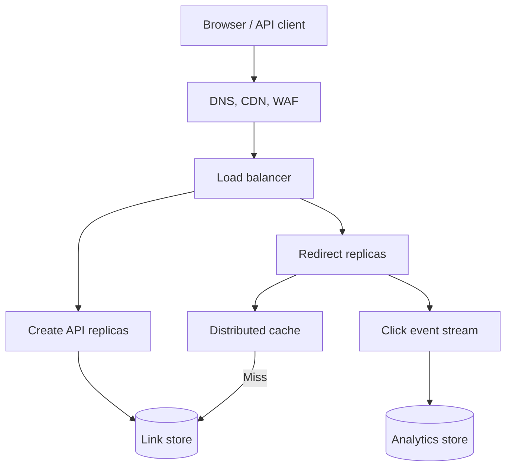

# Design a URL Shortener Like TinyURL

## Design a URL Shortener Like TinyURL

A URL shortener maps a short code such as `https://sho.rt/7aB9xQ2` to a destination URL and responds to a browser request with an HTTP redirect. It is a read-heavy key-value system: creating links must guarantee code uniqueness, while redirect lookup should be fast and highly available. An experienced answer should discuss scale assumptions, mutable/deletable links, analytics, abuse prevention, and failure behavior.

## 1. Clarify the Requirements

Ask the interviewer:

- How many links are created daily, and how many redirects occur at peak?
- Must links expire, be editable, support custom aliases, or use custom domains?
- Is click analytics required, and how fresh must it be?
- Are links public, private, tenant-specific, or protected by passwords?
- Are region-specific latency and disaster recovery requirements defined?
- Should a disabled or malicious link stop redirecting immediately?

**Example assumptions:** 1 million new links/day, 100 million redirects/day, a 10× peak, five-year retention, and mostly public links. Average writes are about 12/second and redirects about 1,160/second; illustrative peak redirects are about 11,600/second. Five years of links is roughly 1.825 billion rows. At an illustrative 300 bytes of raw metadata per row, that is about 548 GB before indexes, replication, and storage overhead. Actual URL lengths and metadata distributions must be measured.

## 2. APIs and Data Model

```http
POST /api/links
Idempotency-Key: 65d0...
Content-Type: application/json

{"destinationUrl":"https://example.com/product/123","expiresAt":null,"customAlias":null}
```

A successful creation returns the short URL and link ID. `GET /{code}` looks up the mapping and redirects. Management APIs may fetch, disable, edit, and report on a link after authentication. The `Idempotency-Key` prevents duplicate creations when a response is lost and the client retries.

| Field | Meaning |
| --- | --- |
| `Domain`, `Code` | Unique public lookup key; domain matters when supporting custom domains |
| `DestinationUrl` | Validated destination |
| `OwnerId`, `TenantId` | Management and authorization |
| `CreatedAt`, `ExpiresAt`, `DisabledAt` | Lifecycle |
| `RedirectMode` | Temporary or permanent behavior |
| `Version` | Cache invalidation and optimistic update support |

Use a unique constraint on `(Domain, Code)`. Keep analytics events separate from the hot redirect mapping rather than updating a click counter on the mapping row for every visit.

## 3. High-Level Architecture



The redirect service is stateless and scales independently from the lower-volume creation and management APIs. A CDN/edge cache can absorb public hot links when freshness and analytics tradeoffs allow it. The mapping database is the source of truth. Click tracking runs asynchronously so an analytics outage does not normally block redirects.

## 4. ID and Short-Code Generation

### Option A: Sequence or Distributed Unique ID + Base62

Generate a unique numeric ID, then encode it using digits, lowercase letters, and uppercase letters. Seven Base62 characters provide `62^7 = 3,521,614,606,208` possible strings. A central database sequence is simple and collision-free within one database, but consecutive codes are predictable and the sequence generator needs a scaling/availability plan. A distributed unique ID generator avoids one sequence bottleneck, but its bit layout, clock behavior, worker IDs, and encoded length need careful design.

### Option B: Random Base62 Code

Generate a cryptographically secure random 7- to 9-character code; insert with the unique constraint; retry collisions a bounded number of times. This avoids exposing creation volume or easy enumeration and is convenient for distributed creators. Collision probability grows as the code space fills, so monitor retries and lengthen codes before saturation. Even a low average collision probability does not remove the need for a unique constraint.

### Option C: Hash of the Long URL

A hash is deterministic but requires collision handling and raises product questions: Should the same destination return one global code, or should different users have independent links and expiration settings? A truncated hash is not collision-free. Use it only if deterministic deduplication is a real requirement; still enforce uniqueness and handle collisions.

**My choice:** Random Base62 with a unique database constraint for public codes, starting at a length supported by capacity estimates and growing when necessary. Alternatively, Base62 of a generated unique ID is efficient when predictability and enumeration are acceptable or are mitigated. Reserve banned words, sensitive route names (`api`, `admin`), and custom aliases before assigning generated codes.

## 5. Database Choice

The dominant operation is point lookup by `(Domain, Code)`, so both a relational database and a scalable key-value store can work.

| Choice | Advantages | Tradeoffs |
| --- | --- | --- |
| PostgreSQL / Azure SQL | Strong unique constraints and transactions; straightforward owner queries and management | Sharding and large-scale write distribution require additional design |
| DynamoDB or similar managed key-value store | High-scale point lookups and managed partitioning | Access-pattern-first modeling; secondary queries and hot keys need care |

Start with a relational store if traffic and team expertise permit; use an indexed unique key and read replicas or caching for read scale. A managed key-value store fits a workload dominated by massive independent code lookups. Keep owner dashboards and click analytics in suitable separate indexes/stores rather than forcing every query into the redirect table. A high-cardinality partition key distributes key-value access, but a single viral link can still become a hot key. [AWS partition-key guidance](https://docs.aws.amazon.com/amazondynamodb/latest/developerguide/bp-partition-key-design.html)

## 6. Redirect Flow and HTTP Status

1. Parse and validate the host and code; reject invalid routes before database access.
2. Check local/edge cache, then distributed cache; on miss query the mapping store.
3. If absent, disabled, expired, or blocked, return an appropriate error page/status instead of a redirect.
4. Return `Location: <destination>` with the chosen redirect status.
5. Emit a click event asynchronously within bounded resource usage; measure lost analytics events separately.

Use **302** for links that may be edited, disabled, expire, or require per-click analytics. A **301** is suitable for deliberately permanent destinations, but clients and intermediaries may cache it and then bypass your service, delaying changes and reducing server-side analytics. For non-GET requests, **307/308** explicitly preserve method and body; a URL shortener can simply limit its redirect endpoint to GET/HEAD rather than forward arbitrary POST requests to another site. Set `Cache-Control` deliberately; do not assume every 302 is never cached. [MDN HTTP redirects](https://developer.mozilla.org/en-US/docs/Web/HTTP/Guides/Redirections) · [MDN HTTP caching](https://developer.mozilla.org/en-US/docs/Web/HTTP/Guides/Caching)

## 7. Caching Strategy

Use cache-aside: query Redis by `domain:code`; on miss read the database, populate a short-lived cache entry, and redirect. Cache popular links in an in-process LRU as an optional first layer, with a distributed cache shared by replicas. Set TTLs based on how quickly edits, disablements, and expiry must take effect. Do not cache beyond a link's expiration. Negative-cache unknown codes briefly to reduce repeated database misses, but avoid making a newly created code appear unavailable for too long.

On edit or disable, commit to the database, invalidate the distributed key, and invalidate edge cache where supported. This is still subject to races and external browser caches; for strict takedown requirements use short TTLs/temporary redirects and a path that revalidates. Prevent cache stampedes on viral links with single-flight loading, bounded database fallback, and TTL jitter. If Redis fails, route a bounded number of misses to the database and shed excess load rather than overwhelming it. [Redis cache-aside](https://redis.io/docs/latest/develop/use-cases/cache-aside/)

## 8. Partitioning and Hot Links

If one database becomes insufficient, partition the mapping by a **stable hash of `(Domain, Code)`** so lookup can identify the owning shard. Use a directory/shard map or a managed key-value store. Do not range-partition by creation time if redirect lookups know only the code; that would require searching many partitions. Choose a migration and rebalancing strategy before adding shards. A hash distributes many different codes, but **one viral code remains hot on its shard**. Cache it at multiple layers or at the edge; partitioning alone cannot split reads for the same key. [AWS partition-key design](https://docs.aws.amazon.com/amazondynamodb/latest/developerguide/bp-partition-key-design.html)

For analytics, partition click events by time and optionally code/tenant; process them asynchronously in batches. Do not synchronously increment one database row on every redirect, because viral links would create write contention.

## 9. High Availability and Disaster Recovery

Run multiple stateless redirect replicas across availability zones behind health-checked load balancing. Use a highly available mapping store with backups, failover, and tested recovery; replicate cache only as appropriate because it is rebuildable. Place redirect capacity near users when global latency matters, while defining how new/updated links propagate across regions. Eventual replication can briefly produce a 404 for a newly created code or stale destination after an edit; if that is unacceptable, route read-after-write requests to the writer region or use stronger consistency for those requests.

Define recovery objectives (RTO/RPO) rather than claiming “zero downtime.” During a database outage, serving **validated cached mappings** for a limited time may preserve redirects, but stale cache could continue a disabled malicious link. Choose fail-open or fail-closed by link class and policy. If analytics is down, redirects may continue while events are buffered with a finite queue and explicit loss policy. Test cache failure, shard failure, region failover, and stale replica behavior.

## 10. Security and Abuse Prevention

Validate schemes (`https` and perhaps `http`); reject dangerous schemes such as `javascript:` and malformed URLs. Normalize destinations carefully without silently changing semantics. Rate-limit creation and custom alias reservation. Scan or classify links for phishing/malware and support fast takedown and abuse reports. If the platform fetches URL previews, isolate the fetcher and block private/internal network targets to prevent SSRF. Do not put untrusted destination HTML into the redirect response. Restrict link management to the owner/tenant, protect custom domains, and avoid storing full IP addresses in analytics without a defined purpose and retention policy.

## 11. Monitoring and Testing

Track p50/p95/p99 redirect latency, redirect throughput, cache hit rate, database read rate, hot keys/shards, creation collision retries, 404/expired/blocked counts, propagation lag, and click-event queue age. Alert on redirect errors and cache/DB saturation. Load-test a mixed distribution with a few viral links, not only uniform random codes. Test concurrent creators contending for the same custom alias and retries after a lost creation response.

## 12. Two-Minute Interview Answer

> I would first estimate link creation and peak redirect traffic. Since redirects dominate, I would make the redirect service stateless behind a load balancer and keep the code-to-URL mapping in an indexed database or managed key-value store. On creation, I would generate a random Base62 code, insert it under a unique constraint, and retry the rare collision; a client idempotency key prevents duplicate creations after a lost response. On redirect, I would check edge or Redis cache, fall back to the mapping store, validate expiration/disabled state, return a 302 for editable links, and publish click analytics asynchronously. I would hash-partition by code if the mapping store outgrows one node and use edge caching for viral hot links, because sharding alone does not solve a hot key. For availability, I would run replicas across zones, test database failover, define cross-region consistency for newly created links, and explicitly balance stale-cache availability against fast abuse takedown.

## 13. Common Interview Follow-Ups

**Why not use the long URL as the database key?** Many users can create independent links for the same destination with different owners, expiry, and analytics. The short code is the redirect lookup key.

**How do custom aliases work?** Reserve `(domain, alias)` with a unique constraint; reject conflicts, prohibited names, and case-normalization ambiguities. Check authorization for the custom domain.

**What if two creators generate the same code?** One insert wins the unique constraint. The other generates a new code and retries within a bounded limit.

**How would you count clicks accurately?** Emit durable click events and aggregate asynchronously; use a unique event ID if deduplication matters. Distinguish raw requests, bots, unique visitors, and delivery guarantees. Exact real-time counts may require additional cost and coordination.

**What if a link becomes viral?** CDN/edge caching and Redis absorb reads. Watch one-key hotspots, cache stampedes, and analytics ingestion separately.

**Why 302 instead of 301?** Editable/expiring links and central click analytics need requests to revisit the service. Permanent caching from 301 can bypass it. Choose based on product behavior.

## 14. Mistakes to Avoid

- Claiming Base62 encoding alone generates a unique ID; the underlying number must first be unique.
- Generating random codes without a unique constraint or collision retry.
- Assuming a hash partition key prevents a single viral code from becoming hot.
- Updating a synchronous click counter on every redirect.
- Using permanent browser-cached redirects for links requiring prompt edits/takedown.
- Serving stale cached malicious links without a defined policy.
- Promising global read-after-write consistency from asynchronous replication.

## 15. Primary References

- [MDN: HTTP redirections](https://developer.mozilla.org/en-US/docs/Web/HTTP/Guides/Redirections)
- [MDN: HTTP caching](https://developer.mozilla.org/en-US/docs/Web/HTTP/Guides/Caching)
- [Redis: Cache-aside](https://redis.io/docs/latest/develop/use-cases/cache-aside/)
- [AWS: DynamoDB partition key design](https://docs.aws.amazon.com/amazondynamodb/latest/developerguide/bp-partition-key-design.html)


